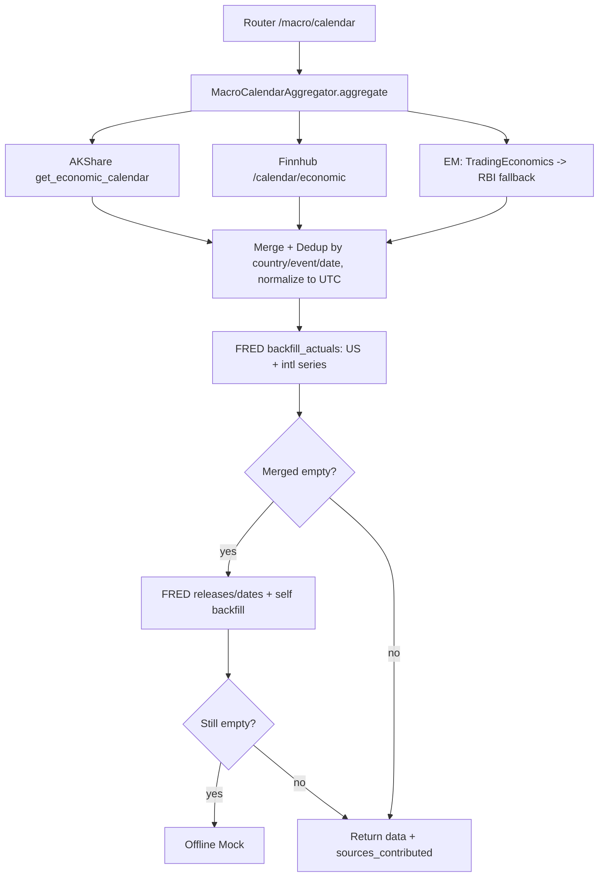

## 用户需求

按照"最优白嫖组合"重塑宏观数据获取架构，并补齐两项能力：(1) 为宏观日历增加 TradingEconomics + RBI 双源，专治印度等新兴市场 CPI 盲点；(2) 把 FRED 实际值回填逻辑接入宏观日历，使降级路径不再丢失 actual/estimate。同时修复 3 个既有的 stale 测试，保证 CI 全绿。

## 产品概述

宏观日历接口 `/api/v1/macro/calendar`（及依赖它的 `/dashboard`、`/calendar/ws`）将从"AKShare 主用 → FRED 降级（丢值）→ Mock"的三段式，升级为多源聚合：AKShare（中国+全球日历，带 actual）、Finnhub 经济日历（免费档补充/交叉验证）、TradingEconomics/RBI（新兴市场 CPI 补充）、FRED（美国及国际序列 actual 回填 + 末级兜底）。最终用户看到的数据：美国核心指标始终带权威 actual；印度等新兴市场 CPI 不再缺失；FRED 降级时 actual 不再为空；出错时明确标注各源贡献情况。

## 核心功能

- 多源聚合编排：AKShare + Finnhub + TradingEconomics/RBI 并发拉取、按 (国家, 事件, 日期) 去重合并，优先采用非空 actual/estimate 的来源。
- 新兴市场补充源：新增 TradingEconomics 源（需免费 TE_API_KEY，无 Key 优雅跳过）与 RBI 直连抓取源（无需 Key，仅印度），由 `EM_SOURCE_PRIORITY` 配置开关控制优先级（默认 TE，无 Key 降级 RBI）。
- FRED actual 回填：建立事件名→FRED 序列映射，对美国核心指标（CPI/PCE/失业率/非农/GDP/利率/初请等）及国际序列（如印度 CPI）尝试回填 actual；FRED 降级路径自身也回填，彻底消除"等待公布中"空值。
- stale 测试修复：`test_llm_service` 默认模型名对齐 `deepseek-v4-flash`；`test_risk_engine` 降级状态对齐 `empty`。

## 技术栈

- 后端：FastAPI（Python 3.13）+ asyncio 并发；数据源服务沿用现有 Legacy 纯服务 + 网关适配器模式（与 fred/finnhub/akshare 一致，避免为 yfinance 之外的源强行引入 DataSourceInterface 增加复杂度）。
- 外部数据源：AKShare（百度/新浪/金十）、Finnhub `/calendar/economic`、TradingEconomics API、RBI 官网抓取、FRED `releases/dates` 与 `series/observations`。
- 缓存：复用 Redis（现有 `redis_client`）+ DCL 锁，TTL 12h + 随机 Jitter。

## 实现方案

1. **聚合层下沉**：新增 `MacroCalendarAggregator`（位于 `backend/services/macro_calendar_service.py`），把"多源拉取 → 归一化（各源时间就地转 UTC ISO）→ 合并去重 → FRED 回填 → 兜底"封装成单一职责模块，保持 `macro.py` 路由精简（符合 YAGNI，避免路由膨胀）。
2. **Finnhub 经济日历**：在 `finnhub_service.py` 新增 `get_economic_calendar(days_ahead, days_back)` 调 `/calendar/economic?from=&to=&token=`，归一化为 `{time,country,event,impact,previous,estimate,actual}`，country 为 2 字母码、事件为英文，tz 标记为 UTC。
3. **新兴市场双源**：新增 `trading_economics_service.py`（TE API，无 `TE_API_KEY` 返回 `{status:"skipped"}`）与 `rbi_service.py`（直连抓取印度 CPI，无需 Key，tz 标记 `Asia/Kolkata`）；二者经 `EM_SOURCE_PRIORITY`（默认 `te,rbi`）串联，`macro_calendar_service` 内 `get_economic_calendar_em` 按序尝试。
4. **FRED 回填**：在 `fred_service.py` 增加 `EVENT_TO_FRED_SERIES` 映射（美国核心 + 国际序列尝试）与 `backfill_actuals(events)` 方法，复用既有 `get_series_observations` 做序列最新观测回填（观测日期 ≤ 事件日期且 actual 为空才写入）；同时让 `fred_service.get_economic_calendar` 在抓取时用 `release_name→series` 映射就地回填，使 FRED 降级路径自带 actual。
5. **路由替换**：`macro.py::_fetch_macro_calendar_data` 用聚合器替换原 L82-90 直链；聚合器已输出 UTC 时间，路由删除原 per-source 时区分支（L100-127），保留缓存/锁/DCL、high_impact 关键词识别、AI 前瞻推演；`source`/`message` 语义改为反映多源贡献与"已回填 actual"。
6. **测试修复**：`test_llm_service.py:46` 断言改 `"deepseek-v4-flash"`（代码默认已钉定 v4-flash，测试未跟随）；`test_risk_engine.py:252,289` 断言改 `"empty"`（`_fallback_data` 故意返回空态避免误报 500，测试未跟随）。

## 实现要点

- **性能**：多源 `asyncio.gather` 并发；FRED 回填按 series_id 去重，每个序列仅查一次（`get_series_observations` 已有 12h TTL 缓存），美国核心约 10 次调用封顶；保留路由层缓存与 DCL 锁，避免击穿。
- **向后兼容**：`macro.py` 对外 JSON 结构（date/country/event/impact/previous/estimate/actual）不变；`/dashboard`、`/calendar/ws` 调用处无需改动接口。
- **健壮性**：TE 无 Key、RBI 抓取失败均优雅跳过并返回空，不影响主流程；聚合器任一子源异常不拖垮整体（gather + return_exceptions）。
- **日志**：复用 `print`/logger 风格，避免打印原始大 JSON；回填失败时仅记 warning，不抛异常。
- **爆炸半径控制**：`market_daemon.py` / `akshare_collector.py` 的既有 akshare→fred 采集链路保持不动（仅前端请求走新聚合器），降低改动面。

## 架构设计



## 目录结构

```
backend/
├── services/
│   ├── macro_calendar_service.py   # [NEW] MacroCalendarAggregator：并发拉取 AKShare/Finnhub/EM，合并去重，归一化 UTC，调用 FRED 回填，兜底降级；返回 sources_contributed
│   ├── finnhub_service.py          # [MODIFY] 新增 get_economic_calendar(days_ahead, days_back)，调 /calendar/economic 并归一化
│   ├── fred_service.py             # [MODIFY] 新增 EVENT_TO_FRED_SERIES 映射与 backfill_actuals(events)；get_economic_calendar 抓取时就地回填 actual
│   ├── trading_economics_service.py# [NEW] TradingEconomics 经济日历源；无 TE_API_KEY 返回 skipped；归一化印度/新兴市场事件
│   ├── rbi_service.py              # [NEW] RBI 直连抓取印度 CPI；无需 Key；归一化 tz=Asia/Kolkata
│   └── adapters/legacy_market_data.py # [MODIFY] 新增 get_economic_calendar_finnhub / get_economic_calendar_te / get_economic_calendar_rbi 网关方法
├── core/config.py                  # [MODIFY] 新增 TE_API_KEY、EM_SOURCE_PRIORITY 配置项（默认 te,rbi）
├── routers/macro.py                # [MODIFY] 用 MacroCalendarAggregator 替换 L82-90 直链；删除 per-source 时区分支，简化时间处理；更新 source/message 语义
├── tests/
│   ├── test_llm_service.py         # [MODIFY] L46 断言对齐 "deepseek-v4-flash"
│   ├── test_risk_engine.py         # [MODIFY] L252、L289 断言对齐 "empty"
│   └── test_macro_calendar_service.py # [NEW] 聚合合并/去重、FRED 回填、TE/RBI 优雅跳过、Finnhub 解析单测
├── .env.example                    # [MODIFY] 新增 TE_API_KEY= 与 EM_SOURCE_PRIORITY=te,rbi
└── scripts/deploy/*.example         # [MODIFY] 同步新增 TE_API_KEY、EM_SOURCE_PRIORITY 配置项
```

## 关键代码结构

```python
# backend/services/fred_service.py
EVENT_TO_FRED_SERIES: dict[str, str]  # 事件关键词 -> FRED series_id（CPI/PCE/UNRATE/PAYEMS/GDP/FEDFUNDS/ICSA... + 国际序列尝试）

async def backfill_actuals(self, events: list[dict]) -> list[dict]:
    """对 US 及匹配国际事件，按 EVENT_TO_FRED_SERIES 查最新观测回填 actual（观测日期<=事件日期且 actual 为空时写入）"""

# backend/services/macro_calendar_service.py
class MacroCalendarAggregator:
    async def aggregate(self, days_ahead: int, days_back: int = 0, skip_cache: bool = False) -> dict:
        """并发拉取多源 -> 合并去重 -> FRED 回填 -> 兜底；返回 {status, data, sources_contributed, message}"""
```

## Agent Extensions

### SubAgent

- **code-explorer**
- Purpose: 在落地聚合器与路由替换前，跨文件检索所有宏观日历调用点与 `get_economic_calendar_*` 引用，确认改动爆炸半径（含 market_daemon、akshare_collector、hermes tool、前端调用）。
- Expected outcome: 产出完整的受影响文件清单与依赖关系，确保仅改动目标链路、后端对外 JSON 结构不变、无遗漏调用方未适配。