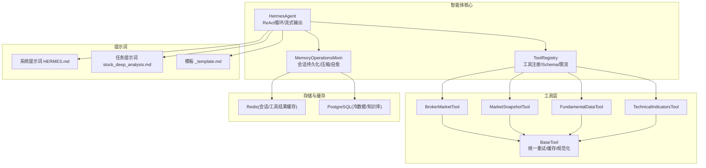
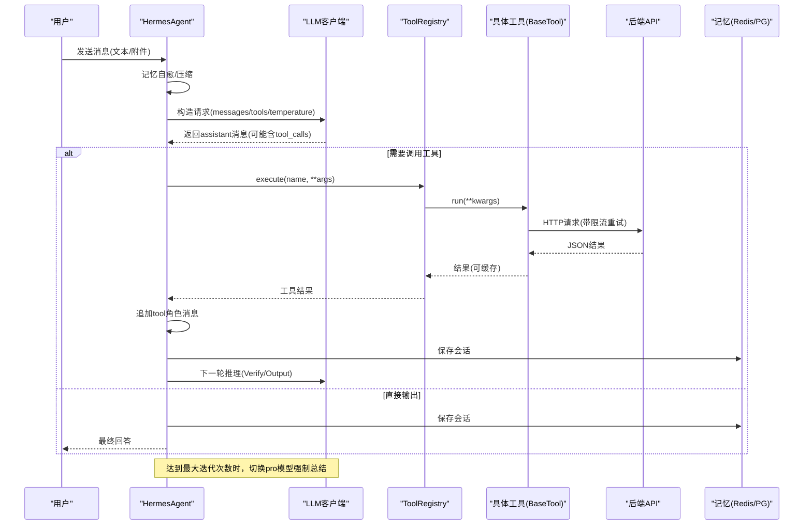
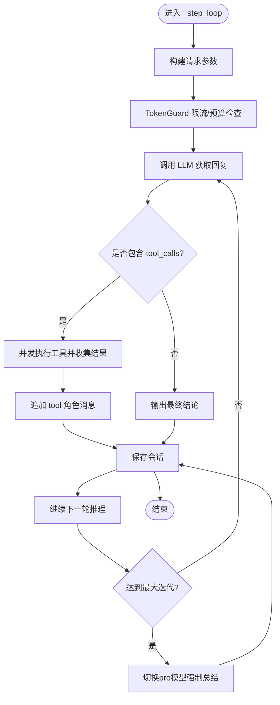
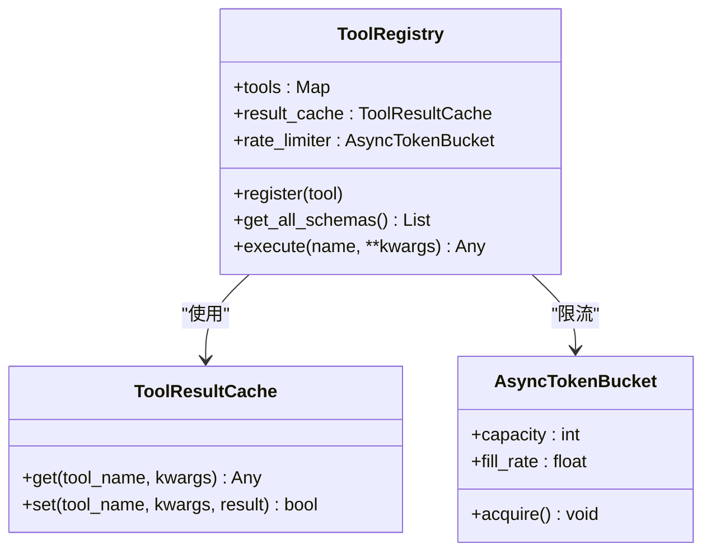
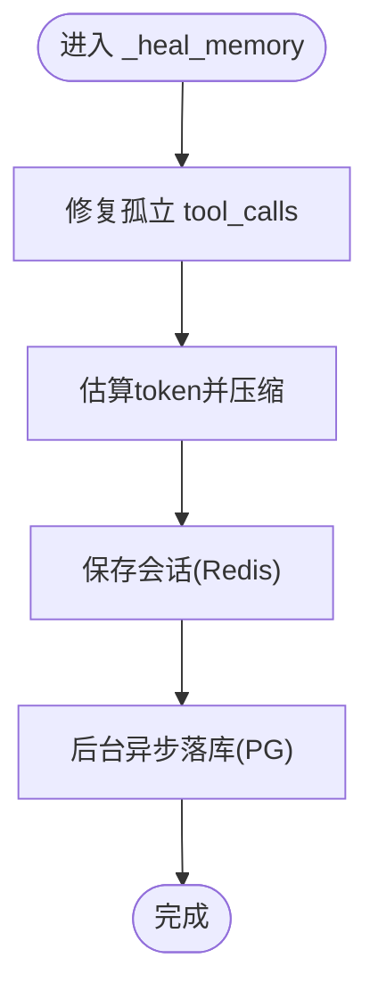
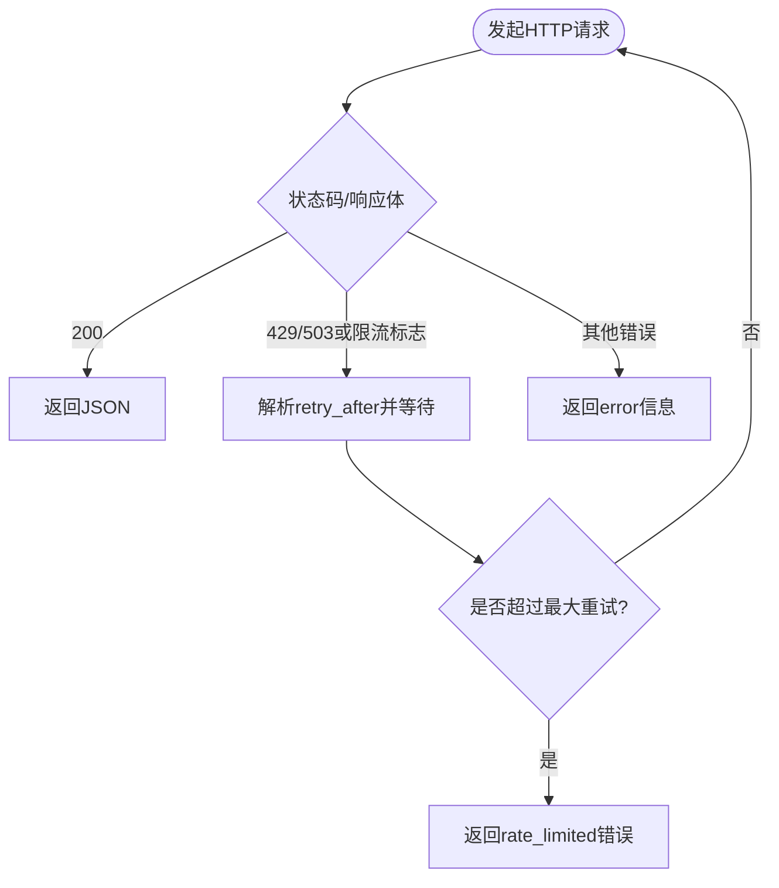
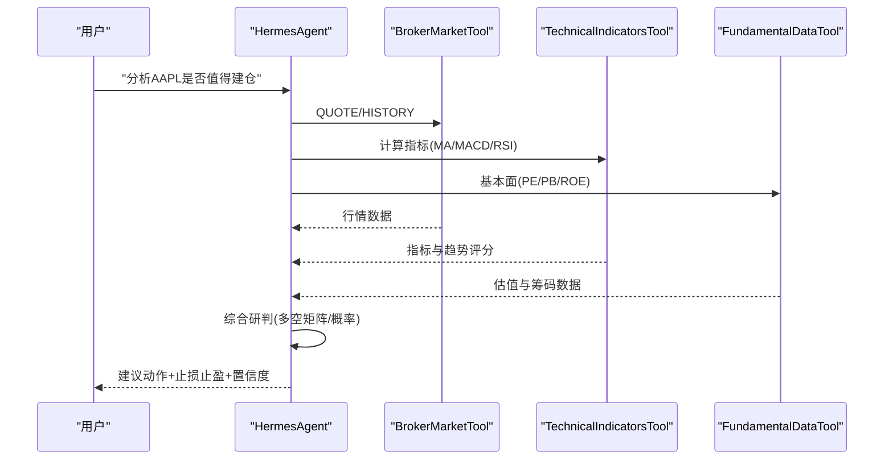
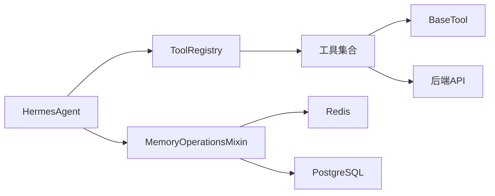

# AI智能代理系统

<cite>
**本文引用的文件**
- [hermes_agent/agent.py](file://hermes_agent/agent.py)
- [hermes_agent/tool_registry.py](file://hermes_agent/tool_registry.py)
- [hermes_agent/memory_ops.py](file://hermes_agent/memory_ops.py)
- [hermes_agent/tools/base.py](file://hermes_agent/tools/base.py)
- [hermes_agent/tools/broker_market_tool.py](file://hermes_agent/tools/broker_market_tool.py)
- [hermes_agent/tools/market_snapshot_tool.py](file://hermes_agent/tools/market_snapshot_tool.py)
- [hermes_agent/tools/fundamental_data_tool.py](file://hermes_agent/tools/fundamental_data_tool.py)
- [hermes_agent/tools/technical_indicators_tool.py](file://hermes_agent/tools/technical_indicators_tool.py)
- [hermes_agent/tool_result_cache.py](file://hermes_agent/tool_result_cache.py)
- [prompts/system/HERMES.md](file://prompts/system/HERMES.md)
- [prompts/tasks/stock_deep_analysis.md](file://prompts/tasks/stock_deep_analysis.md)
- [prompts/templates/_template.md](file://prompts/templates/_template.md)
</cite>

## 目录
1. [简介](#简介)
2. [项目结构](#项目结构)
3. [核心组件](#核心组件)
4. [架构总览](#架构总览)
5. [详细组件分析](#详细组件分析)
6. [依赖关系分析](#依赖关系分析)
7. [性能与成本优化](#性能与成本优化)
8. [故障排查指南](#故障排查指南)
9. [结论](#结论)
10. [附录](#附录)

## 简介
本文件为 Quant Agent 的 AI 智能代理系统（Hermes Agent）技术文档。围绕“智能体核心、工具注册机制、记忆管理系统”展开，系统性说明市场分析、交易执行、数据查询等工具的集成方式；阐述提示词工程最佳实践（系统提示词、任务提示词、模板设计）；给出自然语言到交易信号的转换流程（意图识别、工具调用、结果解析）；并提供自定义工具扩展、对话质量优化、AI 集成安全与成本控制、性能优化策略等实操指导。

## 项目结构
Hermes Agent 位于 hermes_agent 目录，核心由“Agent 主脑 + 工具注册表 + 记忆管理 + 工具实现 + 缓存与限流”构成；提示词体系独立于 prompts 目录，便于运行时加载与版本化管理。

图表来源
- [hermes_agent/agent.py:99-423](file://hermes_agent/agent.py#L99-L423)
- [hermes_agent/tool_registry.py:52-123](file://hermes_agent/tool_registry.py#L52-L123)
- [hermes_agent/memory_ops.py:26-357](file://hermes_agent/memory_ops.py#L26-L357)
- [hermes_agent/tools/base.py:21-282](file://hermes_agent/tools/base.py#L21-L282)
- [hermes_agent/tools/broker_market_tool.py:9-69](file://hermes_agent/tools/broker_market_tool.py#L9-L69)
- [hermes_agent/tools/market_snapshot_tool.py:9-46](file://hermes_agent/tools/market_snapshot_tool.py#L9-L46)
- [hermes_agent/tools/fundamental_data_tool.py:9-39](file://hermes_agent/tools/fundamental_data_tool.py#L9-L39)
- [hermes_agent/tools/technical_indicators_tool.py:11-104](file://hermes_agent/tools/technical_indicators_tool.py#L11-L104)
- [hermes_agent/tool_result_cache.py:107-195](file://hermes_agent/tool_result_cache.py#L107-L195)
- [prompts/system/HERMES.md:1-137](file://prompts/system/HERMES.md#L1-L137)
- [prompts/tasks/stock_deep_analysis.md:1-222](file://prompts/tasks/stock_deep_analysis.md#L1-L222)
- [prompts/templates/_template.md:1-22](file://prompts/templates/_template.md#L1-L22)

章节来源
- [hermes_agent/agent.py:99-423](file://hermes_agent/agent.py#L99-L423)
- [hermes_agent/tool_registry.py:52-123](file://hermes_agent/tool_registry.py#L52-L123)
- [hermes_agent/memory_ops.py:26-357](file://hermes_agent/memory_ops.py#L26-L357)
- [hermes_agent/tools/base.py:21-282](file://hermes_agent/tools/base.py#L21-L282)
- [hermes_agent/tools/broker_market_tool.py:9-69](file://hermes_agent/tools/broker_market_tool.py#L9-L69)
- [hermes_agent/tools/market_snapshot_tool.py:9-46](file://hermes_agent/tools/market_snapshot_tool.py#L9-L46)
- [hermes_agent/tools/fundamental_data_tool.py:9-39](file://hermes_agent/tools/fundamental_data_tool.py#L9-L39)
- [hermes_agent/tools/technical_indicators_tool.py:11-104](file://hermes_agent/tools/technical_indicators_tool.py#L11-L104)
- [hermes_agent/tool_result_cache.py:107-195](file://hermes_agent/tool_result_cache.py#L107-L195)
- [prompts/system/HERMES.md:1-137](file://prompts/system/HERMES.md#L1-L137)
- [prompts/tasks/stock_deep_analysis.md:1-222](file://prompts/tasks/stock_deep_analysis.md#L1-L222)
- [prompts/templates/_template.md:1-22](file://prompts/templates/_template.md#L1-L22)

## 核心组件
- HermesAgent：维护上下文、对接 LLM、驱动 ReAct 工作流（Plan → Tool → Verify → Output），支持同步/流式对话、自动熔断恢复、引用完整性自检、事实沉淀至知识库。
- ToolRegistry：统一工具注册、Schema 生成、并发调度、令牌桶限流、工具结果 Redis 缓存命中与写入。
- MemoryOperationsMixin：会话热存 Redis、冷存 PostgreSQL、上下文压缩与自愈、TokenGuard 防爆护栏、对话事实抽取入库。
- BaseTool：统一后端 API URL 构建、股票代码规范化、限流感知重试、双级缓存（进程内存+Redis）。
- 工具族：市场数据、基本面、技术指标、新闻/宏观、选股/检索等，均通过 @register_tool 装饰器自动注册。

章节来源
- [hermes_agent/agent.py:99-423](file://hermes_agent/agent.py#L99-L423)
- [hermes_agent/tool_registry.py:52-123](file://hermes_agent/tool_registry.py#L52-L123)
- [hermes_agent/memory_ops.py:26-357](file://hermes_agent/memory_ops.py#L26-L357)
- [hermes_agent/tools/base.py:21-282](file://hermes_agent/tools/base.py#L21-L282)

## 架构总览
下图展示从用户输入到工具执行、再到最终输出的端到端流程，包括流式心跳保活、工具并行执行、结果回写与强制总结熔断。

图表来源
- [hermes_agent/agent.py:316-423](file://hermes_agent/agent.py#L316-L423)
- [hermes_agent/tool_registry.py:94-123](file://hermes_agent/tool_registry.py#L94-L123)
- [hermes_agent/tools/base.py:97-239](file://hermes_agent/tools/base.py#L97-L239)
- [hermes_agent/memory_ops.py:132-176](file://hermes_agent/memory_ops.py#L132-L176)

## 详细组件分析

### 智能体核心（HermesAgent）
- 职责边界
  - 构建 LLM 请求参数（model/messages/tools/stream_options），统一 temperature=0.0 保证确定性。
  - ReAct 循环：最多固定迭代次数，必要时切换到 pro 模型进行强制总结。
  - 工具调用：并发执行 tool_calls，收集结果并回填上下文。
  - 流式输出：心跳保活、reasoning_chunk 透传、工具开始/结果事件推送、代码块/图表标注事件提取。
  - 自愈与合规：参考文献完整性校验、会话标题生成与清洗、事实沉淀至知识库。
- 关键路径
  - chat/chat_stream_async：入口，注入市场判因上下文，触发 _step_loop。
  - _step_loop：统一发请求、记录用量、处理 tool_calls、保存会话、异常兜底。
  - _safe_execute_tool：JSON 解析、异步执行、异常封装。
  - _build_request_kwargs/_record_usage：统一参数与用量埋点。

图表来源
- [hermes_agent/agent.py:316-423](file://hermes_agent/agent.py#L316-L423)
- [hermes_agent/memory_ops.py:261-289](file://hermes_agent/memory_ops.py#L261-L289)

章节来源
- [hermes_agent/agent.py:99-423](file://hermes_agent/agent.py#L99-L423)

### 工具注册与执行（ToolRegistry）
- 自动注册：模块导入时通过 @register_tool 将工具类加入全局列表，初始化时实例化并注册。
- Schema 生成：读取每个工具的 name/description/parameters，转换为 OpenAI function schema。
- 执行流程：查找工具 → 尝试 Redis 缓存命中 → 令牌桶限流 → 调用 run（协程或线程包装）→ 写入缓存 → 返回结果。
- 错误防护：捕获异常并返回结构化错误，避免 Agent 崩溃。

图表来源
- [hermes_agent/tool_registry.py:10-123](file://hermes_agent/tool_registry.py#L10-L123)
- [hermes_agent/tool_result_cache.py:107-195](file://hermes_agent/tool_result_cache.py#L107-L195)

章节来源
- [hermes_agent/tool_registry.py:52-123](file://hermes_agent/tool_registry.py#L52-L123)
- [hermes_agent/tool_result_cache.py:107-195](file://hermes_agent/tool_result_cache.py#L107-L195)

### 记忆管理（MemoryOperationsMixin）
- 会话热/冷存：Redis 热数据（短 TTL），PostgreSQL 冷数据（跨进程/重启恢复）。
- 上下文压缩：按 token 估算阈值裁剪巨型 tool 响应、滑动窗口保留最近 N 条。
- 记忆自愈：修复中断导致的孤立 tool_calls、补齐缺失 tool 响应。
- TokenGuard：限制单位时间调用次数与单次上下文 token 上限，超限则激进压缩或阻断。
- 事实沉淀：正则抽取数值事实，向量化后写入知识库（可配置开关）。

图表来源
- [hermes_agent/memory_ops.py:78-176](file://hermes_agent/memory_ops.py#L78-L176)
- [hermes_agent/memory_ops.py:261-289](file://hermes_agent/memory_ops.py#L261-L289)
- [hermes_agent/memory_ops.py:291-357](file://hermes_agent/memory_ops.py#L291-L357)

章节来源
- [hermes_agent/memory_ops.py:26-357](file://hermes_agent/memory_ops.py#L26-L357)

### 工具基类与限流重试（BaseTool）
- 统一后端 API URL：基于环境变量拼接基础地址与版本。
- 股票代码规范化：将自然语言/简写转为 Region.Code 格式，兼容指数与加密货币。
- 限流感知重试：检测 HTTP 429/503 或响应体中的限流信号，解析 retry_after 退避重试，失败返回结构化错误。
- 双级缓存：进程内 L1 快速命中，可选持久化至 Redis L2。

图表来源
- [hermes_agent/tools/base.py:97-239](file://hermes_agent/tools/base.py#L97-L239)

章节来源
- [hermes_agent/tools/base.py:21-282](file://hermes_agent/tools/base.py#L21-L282)

### 典型工具实现

#### 市场分析工具（BrokerMarketTool）
- 能力：统一行情探针，通过 action 路由 QUOTE/HISTORY/OPTION_CHAIN/FUND_FLOW/CAPITAL_DISTRIBUTION/WARRANT_CHAIN。
- 特性：标准化 ticker、限流感知重试、超时控制。

章节来源
- [hermes_agent/tools/broker_market_tool.py:9-69](file://hermes_agent/tools/broker_market_tool.py#L9-L69)

#### 批量快照工具（MarketSnapshotTool）
- 能力：批量获取实时快照（最多 400 只/批），派生涨跌家数与平均涨跌幅。
- 特性：支持 prefer_sources 临时偏好数据源。

章节来源
- [hermes_agent/tools/market_snapshot_tool.py:9-46](file://hermes_agent/tools/market_snapshot_tool.py#L9-L46)

#### 基本面工具（FundamentalDataTool）
- 能力：获取核心基本面与筹码博弈数据（PE/PB/ROE/做空比等）。
- 特性：优先走 merged 端点，失败降级旧端点。

章节来源
- [hermes_agent/tools/fundamental_data_tool.py:9-39](file://hermes_agent/tools/fundamental_data_tool.py#L9-L39)

#### 技术指标工具（TechnicalIndicatorsTool）
- 能力：计算 MA/MACD/RSI/KDJ/ATR/布林带等，返回趋势评分与最新截面特征。
- 特性：lookback_days 控制历史区间，默认仅返回最新一天以节省 token。

章节来源
- [hermes_agent/tools/technical_indicators_tool.py:11-104](file://hermes_agent/tools/technical_indicators_tool.py#L11-L104)

### 提示词工程最佳实践
- 系统提示词（HERMES.md）
  - 明确 Agent 定位、工作流纪律（Plan→Tool→Verify→Output）、数据边界（仅允许 Tools）、零幻觉约束、宏观风控优先级、交易安全与输出格式规范。
- 任务提示词（stock_deep_analysis.md）
  - 定义触发条件、分析流程（数据采集→多维研判→收敛输出）、工具调用序列、报告模板、降级策略与注意事项。
- 模板（_template.md）
  - 提供 Prompt 元数据与正文结构模板，便于版本化与评估。

章节来源
- [prompts/system/HERMES.md:1-137](file://prompts/system/HERMES.md#L1-L137)
- [prompts/tasks/stock_deep_analysis.md:1-222](file://prompts/tasks/stock_deep_analysis.md#L1-L222)
- [prompts/templates/_template.md:1-22](file://prompts/templates/_template.md#L1-L22)

### 自然语言到交易信号的转换流程
- 意图识别：系统提示词约束下，Agent 根据用户问题选择合适工具（如 QUOTE/HISTORY/TECH_INDICATORS）。
- 工具调用：并发执行多个工具，合并多源数据（行情、基本面、情绪、新闻）。
- 结果解析：依据工具返回的结构化数据，生成可操作的交易信号（入场/止损/止盈/仓位），并在输出中附数据时间与数据来源。
- 质量控制：引用完整性自检、事实沉淀、强制总结熔断保障输出质量与稳定性。

图表来源
- [hermes_agent/agent.py:316-423](file://hermes_agent/agent.py#L316-L423)
- [hermes_agent/tools/broker_market_tool.py:9-69](file://hermes_agent/tools/broker_market_tool.py#L9-L69)
- [hermes_agent/tools/technical_indicators_tool.py:11-104](file://hermes_agent/tools/technical_indicators_tool.py#L11-L104)
- [hermes_agent/tools/fundamental_data_tool.py:9-39](file://hermes_agent/tools/fundamental_data_tool.py#L9-L39)

## 依赖关系分析
- 耦合与内聚
  - Agent 与 ToolRegistry 松耦合：通过 Schema 描述工具能力，降低硬编码依赖。
  - 工具与 BaseTool 高内聚：统一网络层、重试、缓存与 ticker 规范化。
  - 记忆与存储解耦：通过 Mixin 注入 Redis/PG，便于替换与测试。
- 外部依赖
  - LLM 客户端（OpenAI 兼容 SDK）。
  - Redis（会话缓存、工具结果缓存、限流计数）。
  - PostgreSQL（冷数据与会话持久化、知识库）。
  - 后端服务（行情/基本面/技术指标等 REST API）。

图表来源
- [hermes_agent/agent.py:99-423](file://hermes_agent/agent.py#L99-L423)
- [hermes_agent/tool_registry.py:52-123](file://hermes_agent/tool_registry.py#L52-L123)
- [hermes_agent/memory_ops.py:26-357](file://hermes_agent/memory_ops.py#L26-L357)
- [hermes_agent/tools/base.py:21-282](file://hermes_agent/tools/base.py#L21-L282)

章节来源
- [hermes_agent/agent.py:99-423](file://hermes_agent/agent.py#L99-L423)
- [hermes_agent/tool_registry.py:52-123](file://hermes_agent/tool_registry.py#L52-L123)
- [hermes_agent/memory_ops.py:26-357](file://hermes_agent/memory_ops.py#L26-L357)
- [hermes_agent/tools/base.py:21-282](file://hermes_agent/tools/base.py#L21-L282)

## 性能与成本优化
- 流式输出与心跳保活：防止连接空闲超时，提升交互体验。
- 工具结果缓存：按工具 TTL 与白名单策略，显著减少重复请求与下游压力。
- 上下文压缩与自愈：避免 token 溢出与无效推理，降低 LLM 成本。
- 令牌桶限流：保护后端服务，避免突发流量导致雪崩。
- 模型分级：常规推理使用轻量模型，强制总结阶段使用更强模型平衡质量与成本。
- 事实沉淀：仅对明确数值/事实向量化入库，减少无关噪声。

[本节为通用指导，不直接分析具体文件]

## 故障排查指南
- 常见错误
  - 工具未找到：检查工具是否已注册且名称一致。
  - 限流/超时：观察 BaseTool 的重试日志与后端返回的 retry_after。
  - 上下文破损：Memory 自愈会补齐缺失 tool 响应；若仍异常，检查并发执行与队列逻辑。
  - 流式断连：确认心跳事件是否正常推送。
- 定位方法
  - 开启 debug_mode 打印请求/响应载荷。
  - 查看工具缓存命中率与统计。
  - 检查 Redis/PG 连接与权限。

章节来源
- [hermes_agent/tool_registry.py:94-123](file://hermes_agent/tool_registry.py#L94-L123)
- [hermes_agent/tools/base.py:97-239](file://hermes_agent/tools/base.py#L97-L239)
- [hermes_agent/memory_ops.py:78-176](file://hermes_agent/memory_ops.py#L78-L176)
- [hermes_agent/agent.py:316-423](file://hermes_agent/agent.py#L316-L423)

## 结论
Hermes Agent 以“强约束的系统提示词 + 可扩展的工具生态 + 健壮的会话与缓存机制”为核心，实现了稳定可靠的自然语言到交易信号的转化。通过流式交互、TokenGuard、工具缓存与记忆自愈，系统在安全性、成本与性能之间取得良好平衡。建议在生产环境中结合业务需求定制工具 TTL、限流阈值与模型策略，持续优化提示词与工具覆盖度。

[本节为总结性内容，不直接分析具体文件]

## 附录

### 自定义工具开发指南
- 步骤
  - 继承 BaseTool，实现 name/description/parameters/run。
  - 使用 @register_tool 装饰器自动注册。
  - 在 run 中使用 rate_limit_aware_request 发起后端请求，确保限流与重试。
  - 如需缓存，利用 BaseTool 的双级缓存或 ToolResultCache 的统一缓存。
- 示例参考
  - 市场分析：broker_market_tool.py
  - 批量快照：market_snapshot_tool.py
  - 基本面：fundamental_data_tool.py
  - 技术指标：technical_indicators_tool.py

章节来源
- [hermes_agent/tools/base.py:21-282](file://hermes_agent/tools/base.py#L21-L282)
- [hermes_agent/tools/broker_market_tool.py:9-69](file://hermes_agent/tools/broker_market_tool.py#L9-L69)
- [hermes_agent/tools/market_snapshot_tool.py:9-46](file://hermes_agent/tools/market_snapshot_tool.py#L9-L46)
- [hermes_agent/tools/fundamental_data_tool.py:9-39](file://hermes_agent/tools/fundamental_data_tool.py#L9-L39)
- [hermes_agent/tools/technical_indicators_tool.py:11-104](file://hermes_agent/tools/technical_indicators_tool.py#L11-L104)

### 扩展 Agent 能力与优化对话质量
- 扩展能力
  - 新增工具并注册，更新系统提示词中的工具路由纪律。
  - 调整 ToolResultCache 的 TTL 与白名单，平衡新鲜度与性能。
- 优化对话质量
  - 完善任务提示词（如 stock_deep_analysis.md）的分析流程与降级策略。
  - 启用事实沉淀与引用完整性自检，减少幻觉与遗漏。
  - 合理设置最大迭代次数与强制总结阈值，避免死循环。

章节来源
- [prompts/system/HERMES.md:1-137](file://prompts/system/HERMES.md#L1-L137)
- [prompts/tasks/stock_deep_analysis.md:1-222](file://prompts/tasks/stock_deep_analysis.md#L1-L222)
- [hermes_agent/tool_result_cache.py:107-195](file://hermes_agent/tool_result_cache.py#L107-L195)
- [hermes_agent/agent.py:316-423](file://hermes_agent/agent.py#L316-L423)

### 安全、成本与性能策略清单
- 安全
  - 严格数据边界：仅通过 Tools 取数，禁止外部直连。
  - 交易安全：默认沙箱，实盘需二次确认与开关控制。
  - 标题与内容风控：敏感词拦截与乱码清洗。
- 成本
  - 低温度与最小上下文：减少 token 消耗。
  - 工具缓存与复用：降低重复请求。
  - 模型分级：常规与深度分析分离。
- 性能
  - 并发工具调用与心跳保活。
  - 上下文压缩与自愈。
  - 令牌桶限流与熔断恢复。

章节来源
- [prompts/system/HERMES.md:61-86](file://prompts/system/HERMES.md#L61-L86)
- [hermes_agent/agent.py:109-173](file://hermes_agent/agent.py#L109-L173)
- [hermes_agent/tool_registry.py:10-67](file://hermes_agent/tool_registry.py#L10-L67)
- [hermes_agent/memory_ops.py:44-129](file://hermes_agent/memory_ops.py#L44-L129)