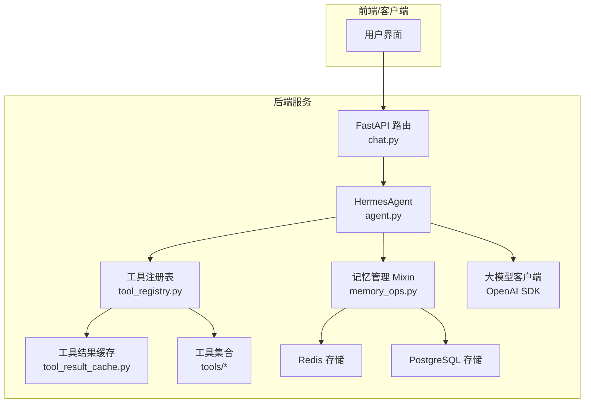
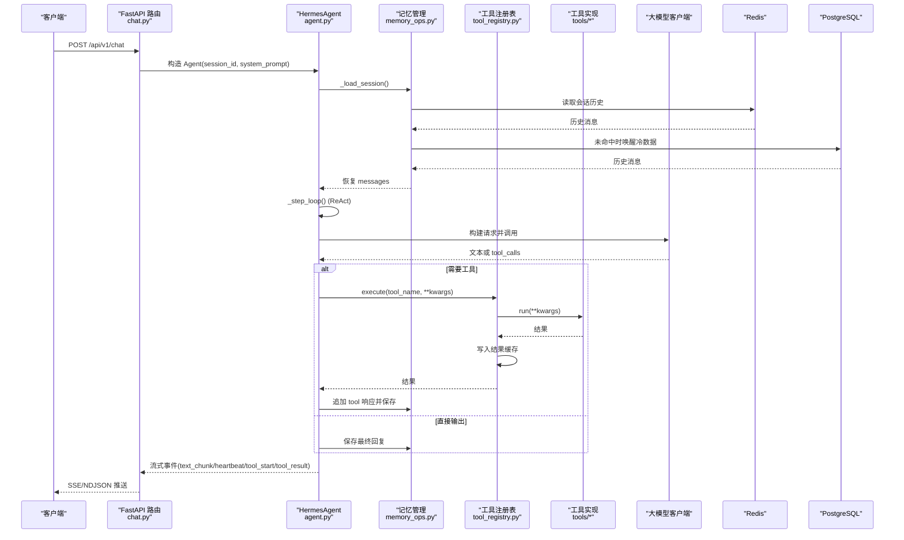
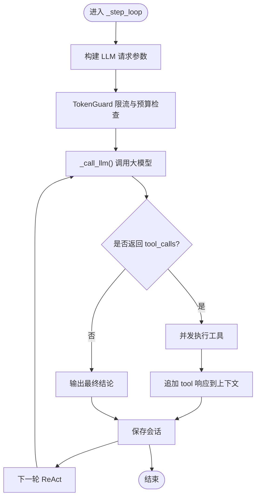
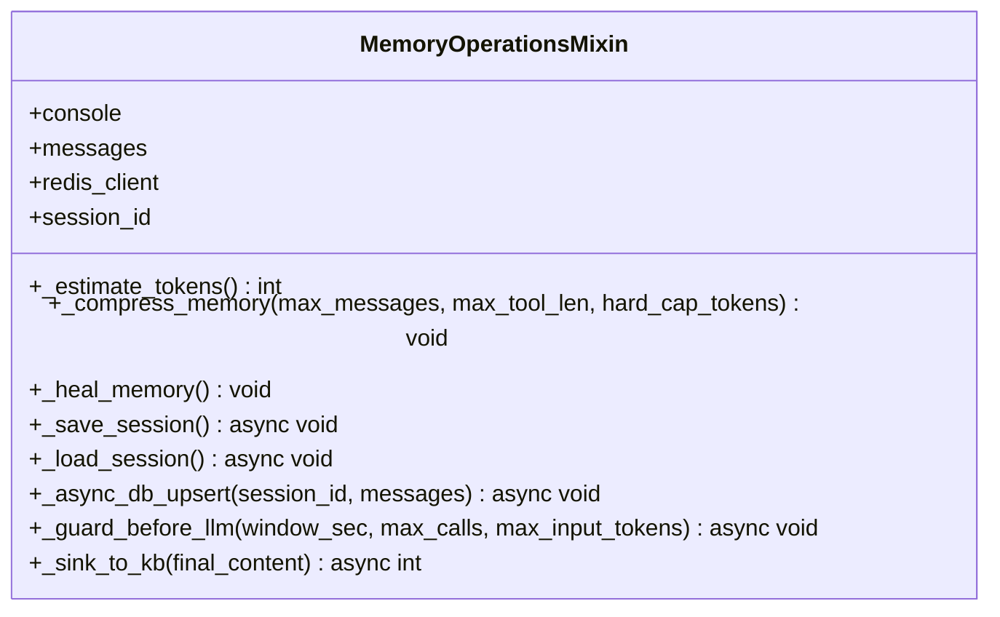
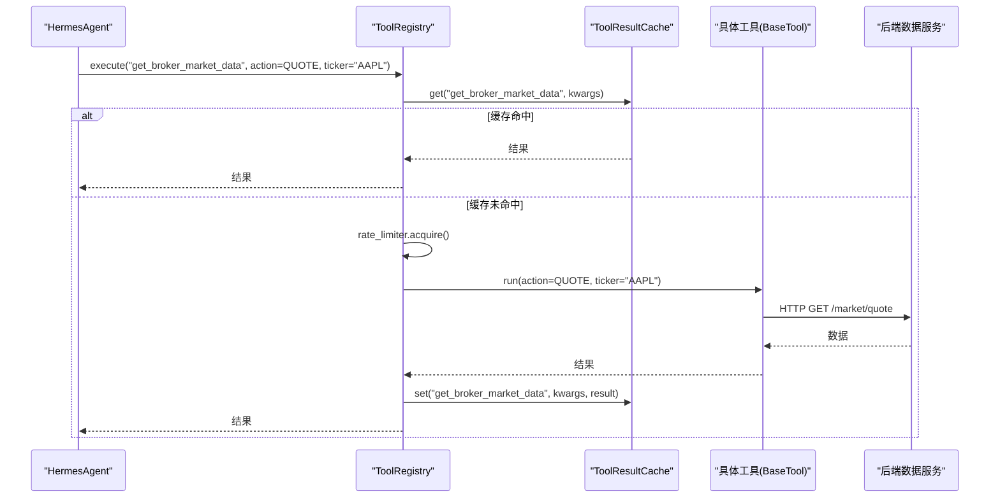
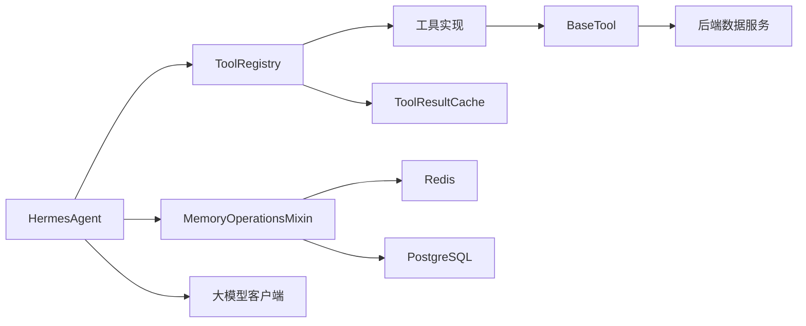

# Hermes Agent架构设计

<cite>
**本文引用的文件**
- [agent.py](file://hermes_agent/agent.py)
- [memory_ops.py](file://hermes_agent/memory_ops.py)
- [tool_registry.py](file://hermes_agent/tool_registry.py)
- [tool_result_cache.py](file://hermes_agent/tool_result_cache.py)
- [base.py](file://hermes_agent/tools/base.py)
- [decorators.py](file://hermes_agent/tools/decorators.py)
- [broker_market_tool.py](file://hermes_agent/tools/broker_market_tool.py)
- [web_search_tool.py](file://hermes_agent/tools/web_search_tool.py)
- [chat.py](file://backend/routers/chat.py)
- [HERMES.md](file://prompts/system/HERMES.md)
</cite>

## 目录
1. [简介](#简介)
2. [项目结构](#项目结构)
3. [核心组件](#核心组件)
4. [架构总览](#架构总览)
5. [详细组件分析](#详细组件分析)
6. [依赖关系分析](#依赖关系分析)
7. [性能考量](#性能考量)
8. [故障排查指南](#故障排查指南)
9. [结论](#结论)
10. [附录：使用示例与扩展点](#附录使用示例与扩展点)

## 简介
本技术文档围绕 Hermes Agent 的核心架构展开，系统性阐述智能体生命周期管理、消息处理机制、工具调度器、工具注册系统（发现、依赖注入、版本管理）、记忆管理系统（短期/长期/上下文保持），以及扩展点与插件机制。文档包含架构图、组件交互流程图、数据流说明与关键实现路径引用，帮助开发者快速理解并扩展 Hermes Agent 的能力。

## 项目结构
Hermes Agent 位于 hermes_agent 包中，核心由以下模块组成：
- 智能体主脑：负责会话状态、ReAct 循环、LLM 调用、流式输出与熔断恢复
- 记忆管理：会话持久化（Redis 热 + PostgreSQL 冷）、记忆自愈与压缩、TokenGuard 防爆护栏、事实沉淀到知识库
- 工具注册与执行：自动发现、Schema 生成、限流、统一结果缓存、安全执行
- 工具基类与装饰器：统一后端 API 访问、限流感知重试、双级缓存、自我纠错
- 具体工具：市场数据、搜索、宏观、基本面等
- 路由集成：FastAPI 路由将外部请求接入 Agent 并流式返回

**图表来源**
- [chat.py:184-200](file://backend/routers/chat.py#L184-L200)
- [agent.py:258-305](file://hermes_agent/agent.py#L258-L305)
- [memory_ops.py:132-175](file://hermes_agent/memory_ops.py#L132-L175)
- [tool_registry.py:52-92](file://hermes_agent/tool_registry.py#L52-L92)
- [tool_result_cache.py:107-195](file://hermes_agent/tool_result_cache.py#L107-L195)

**章节来源**
- [chat.py:184-200](file://backend/routers/chat.py#L184-L200)
- [agent.py:258-305](file://hermes_agent/agent.py#L258-L305)
- [memory_ops.py:132-175](file://hermes_agent/memory_ops.py#L132-L175)
- [tool_registry.py:52-92](file://hermes_agent/tool_registry.py#L52-L92)
- [tool_result_cache.py:107-195](file://hermes_agent/tool_result_cache.py#L107-L195)

## 核心组件
- 智能体主脑（HermesAgent）
  - 维护对话上下文（messages）、系统指令加载、ReAct 循环、流式与非流式 LLM 调用、工具调用并发执行、熔断恢复策略、Token 计量埋点
- 记忆管理（MemoryOperationsMixin）
  - 会话持久化（Redis 热 + PostgreSQL 冷）、记忆自愈（修复中断的 tool_calls）、上下文压缩（滑动窗口与巨型 Tool 返回值折叠）、TokenGuard 限流与预算护栏、事实抽取与知识库沉淀
- 工具注册与执行（ToolRegistry）
  - 自动发现（@register_tool）、Schema 生成（function schema）、限流（令牌桶）、统一执行（异步/同步兼容）、结果缓存（Redis Hash）
- 工具基类与装饰器（BaseTool, decorators）
  - 统一后端 API URL、限流感知智能重试、双级缓存（进程内存 + Redis）、自我纠错装饰器（ToolCorrectionError）
- 具体工具（BrokerMarketTool、WebSearchTool 等）
  - 通过 action 路由市场数据、搜索、宏观、基本面等能力；遵循 Schema 约束与安全客户端

**章节来源**
- [agent.py:116-191](file://hermes_agent/agent.py#L116-L191)
- [memory_ops.py:26-130](file://hermes_agent/memory_ops.py#L26-L130)
- [tool_registry.py:38-123](file://hermes_agent/tool_registry.py#L38-L123)
- [base.py:21-282](file://hermes_agent/tools/base.py#L21-L282)
- [decorators.py:9-64](file://hermes_agent/tools/decorators.py#L9-L64)
- [broker_market_tool.py:9-69](file://hermes_agent/tools/broker_market_tool.py#L9-L69)
- [web_search_tool.py:9-85](file://hermes_agent/tools/web_search_tool.py#L9-L85)

## 架构总览
Hermes Agent 采用“主脑 + 记忆 + 工具”的分层架构：
- 路由层接收请求，构造 Agent 实例并调用 chat/chat_stream_async
- 主脑层负责 ReAct 循环、LLM 调用、工具调度、流式事件推送
- 记忆层提供会话持久化、自愈、压缩、TokenGuard、知识库沉淀
- 工具层通过注册表统一管理，具备限流、缓存、重试、纠错能力
- 外部依赖包括 LLM 提供商、Redis、PostgreSQL、后端数据服务

**图表来源**
- [chat.py:184-200](file://backend/routers/chat.py#L184-L200)
- [agent.py:366-499](file://hermes_agent/agent.py#L366-L499)
- [memory_ops.py:132-175](file://hermes_agent/memory_ops.py#L132-L175)
- [tool_registry.py:94-123](file://hermes_agent/tool_registry.py#L94-L123)
- [tool_result_cache.py:122-187](file://hermes_agent/tool_result_cache.py#L122-L187)

## 详细组件分析

### 智能体主脑（HermesAgent）
- 生命周期管理
  - 初始化：加载系统指令、初始化 LLM 客户端、Redis 客户端、会话 ID、调试模式
  - 启动交互：CLI 与 HTTP 接口均支持，CLI 提供 /clear 快捷指令重置记忆
  - 会话恢复：initialize() 从 Redis/PG 恢复历史消息
- 消息处理机制
  - 非流式 chat()：单轮对话，自动沉淀事实到知识库
  - 流式 chat_stream_async()：SSE/NDJSON 推送 text_chunk、reasoning_chunk、tool_start、tool_result、heartbeat、error、iteration_limit_reached
  - ReAct 循环：最大迭代次数限制，动态模型覆盖（pro 模型用于强制总结），TokenGuard 防护
- 工具调度器
  - 统一执行入口 _safe_execute_tool()：解析参数、并发执行工具、异常捕获、结果回写上下文
  - 工具 Schema 注入：_build_request_kwargs() 将工具函数描述与参数 schema 下发给 LLM
- 错误处理与自愈
  - 参考文献完整性校验装饰器 with_reference_check()：检测正文引用与文末列表一致性，触发自愈补充
  - 流式自愈：在流式路径中检测遗漏参考文献并追加提示，继续下一轮
  - 熔断恢复：达到最大迭代后注入强制指令，剥夺工具使用权，使用 pro 模型输出总结

**图表来源**
- [agent.py:400-499](file://hermes_agent/agent.py#L400-L499)
- [agent.py:192-238](file://hermes_agent/agent.py#L192-L238)
- [agent.py:170-191](file://hermes_agent/agent.py#L170-L191)

**章节来源**
- [agent.py:258-305](file://hermes_agent/agent.py#L258-L305)
- [agent.py:366-499](file://hermes_agent/agent.py#L366-L499)
- [agent.py:500-800](file://hermes_agent/agent.py#L500-L800)
- [agent.py:61-113](file://hermes_agent/agent.py#L61-L113)

### 记忆管理系统
- 短期记忆（上下文窗口）
  - 滑动窗口压缩：当消息数超过阈值时截断旧消息，保留 system 与最近对话
  - 巨型 Tool 返回值折叠：对非最新轮的 tool 内容按长度阈值裁剪，释放内存
  - Token 估算：粗略估算当前上下文 token 数，用于预算控制
- 长期记忆（持久化）
  - Redis 热数据：会话历史以 JSON 形式存储，设置过期时间
  - PostgreSQL 冷数据：异步后台任务 Upsert，支持标题自动生成（基于首条用户消息）
- 上下文保持与自愈
  - 修复孤立 tool_calls：检测 assistant 消息携带 tool_calls 但缺少对应 tool 响应的情况，自动补全错误占位
  - 应用系统指令：确保 messages[0] 始终为最新系统指令
- TokenGuard 防爆护栏
  - 会话级限流：Redis 计数器限制单位时间内 LLM 调用次数
  - 预算护栏：估算 token 超限时触发激进压缩，仍超限则阻断请求
- 事实沉淀到知识库
  - 正则抽取含数字与单位的句子，去重后生成向量并入库，标记来源与时间戳

**图表来源**
- [memory_ops.py:26-357](file://hermes_agent/memory_ops.py#L26-L357)

**章节来源**
- [memory_ops.py:26-130](file://hermes_agent/memory_ops.py#L26-L130)
- [memory_ops.py:132-175](file://hermes_agent/memory_ops.py#L132-L175)
- [memory_ops.py:177-259](file://hermes_agent/memory_ops.py#L177-L259)
- [memory_ops.py:260-357](file://hermes_agent/memory_ops.py#L260-L357)

### 工具注册系统与调度器
- 工具发现
  - 全局装饰器 @register_tool：收集所有带装饰器的 Tool 类，在 ToolRegistry 初始化时自动实例化并注册
  - Schema 生成：遍历已注册工具，生成 function schema（name/description/parameters），供 LLM 选择工具
- 依赖注入
  - ToolRegistry 注入 ToolResultCache 与 AsyncTokenBucket，统一限流与缓存策略
  - BaseTool 提供 get_backend_api_url()、rate_limit_aware_request()、get/set_cached_data() 等通用能力
- 版本管理
  - 环境变量控制工具缓存 TTL：TOOL_CACHE_TTL_{NAME} > 内置表 > TOOL_CACHE_DEFAULT_TTL
  - 工具白名单：TOOL_CACHE_NO_CACHE 指定不缓存的工具名
- 执行流程
  - execute(name, **kwargs)：先查缓存，命中直接返回；否则限流后执行工具（异步/同步兼容），写入缓存并返回结果
  - 异常捕获：统一包装为 {"status": "error", "message": "..."}，防止 Agent 宕机

**图表来源**
- [tool_registry.py:52-123](file://hermes_agent/tool_registry.py#L52-L123)
- [tool_result_cache.py:107-195](file://hermes_agent/tool_result_cache.py#L107-L195)
- [broker_market_tool.py:9-69](file://hermes_agent/tools/broker_market_tool.py#L9-L69)

**章节来源**
- [tool_registry.py:38-123](file://hermes_agent/tool_registry.py#L38-L123)
- [tool_result_cache.py:43-87](file://hermes_agent/tool_result_cache.py#L43-L87)
- [tool_result_cache.py:107-195](file://hermes_agent/tool_result_cache.py#L107-L195)
- [base.py:10-18](file://hermes_agent/tools/base.py#L10-L18)
- [base.py:97-239](file://hermes_agent/tools/base.py#L97-L239)

### 工具基类与装饰器
- BaseTool
  - 统一后端 API URL：BACKEND_API_URL + API_URL_VERSION
  - 限流感知智能重试：检测 HTTP 429/503 或响应体中的 rate_limited 信号，解析 retry_after_seconds 后退避重试
  - 双级缓存：L1 进程内存字典（TTL 控制）+ L2 Redis 持久化（跨进程共享）
  - 股票代码归一化：normalize_ticker() 将自然语言代码转换为 Region.Code 格式
- 装饰器 with_agent_self_correction
  - 拦截 ToolCorrectionError，将报错信息注入 query 参数，触发 LLM 自我修正
  - 实时通知：通过 notification_service.send_alert() 向前端推送反思过程

**章节来源**
- [base.py:21-282](file://hermes_agent/tools/base.py#L21-L282)
- [decorators.py:9-64](file://hermes_agent/tools/decorators.py#L9-L64)

### 具体工具示例
- BrokerMarketTool
  - 通过 action 路由 QUOTE/HISTORY/OPTION_CHAIN/FUND_FLOW/CAPITAL_DISTRIBUTION/WARRANT_CHAIN
  - 使用 SecureAsyncClient 发起受限内网请求，结合 rate_limit_aware_request() 实现限流重试
- WebSearchTool
  - 封装 DuckDuckGo 搜索能力，支持 include/exclude_domains 过滤
  - 使用 BaseTool 的缓存机制避免重复搜索，提升性能并降低限流风险

**章节来源**
- [broker_market_tool.py:9-69](file://hermes_agent/tools/broker_market_tool.py#L9-L69)
- [web_search_tool.py:9-85](file://hermes_agent/tools/web_search_tool.py#L9-L85)

## 依赖关系分析
- 组件耦合
  - HermesAgent 强依赖 ToolRegistry 与 MemoryOperationsMixin，松耦合于具体工具实现
  - ToolRegistry 依赖 ToolResultCache 与 AsyncTokenBucket，屏蔽工具执行细节
  - BaseTool 依赖 SecureAsyncClient 与后端 API，提供通用网络与缓存能力
- 外部依赖
  - LLM 提供商：通过 OpenAI SDK 兼容接口调用（DeepSeek 等）
  - 存储：Redis（会话、限流、工具缓存）、PostgreSQL（冷数据、知识库）
  - 后端服务：市场数据、搜索、宏观、基本面等数据源
- 潜在循环依赖
  - 通过延迟导入（如 import hermes_agent.tools）避免循环依赖
  - Mixin 模式解耦记忆逻辑，减少主脑复杂度

**图表来源**
- [agent.py:116-191](file://hermes_agent/agent.py#L116-L191)
- [tool_registry.py:52-123](file://hermes_agent/tool_registry.py#L52-L123)
- [memory_ops.py:26-130](file://hermes_agent/memory_ops.py#L26-L130)
- [base.py:21-282](file://hermes_agent/tools/base.py#L21-L282)

**章节来源**
- [agent.py:116-191](file://hermes_agent/agent.py#L116-L191)
- [tool_registry.py:52-123](file://hermes_agent/tool_registry.py#L52-L123)
- [memory_ops.py:26-130](file://hermes_agent/memory_ops.py#L26-L130)
- [base.py:21-282](file://hermes_agent/tools/base.py#L21-L282)

## 性能考量
- 流式输出与心跳保活
  - chat_stream_async() 每轮 ReAct 发送 heartbeat，防止 Cloudflare/Nginx 空闲超时断开连接
  - 工具执行期间定期发送心跳，避免长时间无响应导致连接中断
- 并发工具执行
  - asyncio.gather() 并发执行多个工具调用，提升整体吞吐
  - 竞态修复：使用“已接收结果计数”而非 task.done() 作为循环终止条件，确保所有工具结果正确写入
- 缓存策略
  - 工具结果缓存：Redis Hash 键 tool:cache:{tool_name}:{args_hash}，TTL 可配置，避免重复请求
  - 双级缓存：BaseTool 的 L1 内存 + L2 Redis，提升热点数据访问速度
- Token 预算控制
  - TokenGuard 限制单位时间内 LLM 调用次数，估算上下文 token 超限时触发激进压缩
  - 流式 usage 记录：最后一个 chunk 携带 usage，统一通过 _record_usage() 埋点

**章节来源**
- [agent.py:500-800](file://hermes_agent/agent.py#L500-L800)
- [tool_result_cache.py:107-195](file://hermes_agent/tool_result_cache.py#L107-L195)
- [base.py:240-282](file://hermes_agent/tools/base.py#L240-L282)
- [memory_ops.py:260-289](file://hermes_agent/memory_ops.py#L260-L289)

## 故障排查指南
- 常见错误与处理
  - 工具执行异常：_safe_execute_tool() 捕获异常并返回结构化错误，防止 Agent 崩溃
  - 流式连接中断：heartbeat 保活机制，超时等待推理完成，异常时抛出 error 事件
  - 参考文献缺失：with_reference_check() 装饰器触发自愈，注入提示要求补充完整列表
  - 上下文破损：_heal_memory() 修复孤立 tool_calls，补全缺失的 tool 响应
- 诊断建议
  - 启用 debug_mode：打印 LLM 请求与响应详情，便于定位问题
  - 检查 Redis/PG 连接：记忆持久化失败会降级放行，但不影响主流程
  - 查看工具缓存命中率：ToolResultCache.stats() 可监控缓存效果
  - 监控限流与预算：TokenGuard 日志提示限流原因与压缩策略

**章节来源**
- [agent.py:170-191](file://hermes_agent/agent.py#L170-L191)
- [agent.py:500-800](file://hermes_agent/agent.py#L500-L800)
- [memory_ops.py:78-130](file://hermes_agent/memory_ops.py#L78-L130)
- [tool_result_cache.py:189-195](file://hermes_agent/tool_result_cache.py#L189-L195)

## 结论
Hermes Agent 通过清晰的分层架构与模块化设计，实现了智能体生命周期管理、消息处理、工具调度、记忆管理与扩展能力的有机结合。其核心优势包括：
- 健壮的 ReAct 循环与熔断恢复机制，确保对话稳定性
- 完善的记忆管理，支持热/冷数据持久化与上下文自愈
- 灵活的工具注册与执行框架，具备限流、缓存、重试与纠错能力
- 流式输出与心跳保活，提升用户体验与连接可靠性
- 可扩展的插件机制，便于开发者快速集成新工具与新功能

## 附录：使用示例与扩展点

### 初始化 Agent 与配置参数
- 基本初始化
  - 传入 tool_registry、system_prompt_path、session_id、llm_client、redis_client
  - 环境变量：LLM_API_KEY、LLM_BASE_URL、LLM_MODEL、LLM_PRO_MODEL、REDIS_HOST、REDIS_PORT、REDIS_PASSWORD
- 路由集成
  - FastAPI 路由构造 HermesAgent 实例，注入 global_registry 与 global_llm_client
  - 支持 session_id 隔离不同用户会话

**章节来源**
- [agent.py:258-305](file://hermes_agent/agent.py#L258-L305)
- [chat.py:184-200](file://backend/routers/chat.py#L184-L200)

### 处理对话流
- 非流式对话
  - 调用 chat(user_input, attachments)，自动沉淀事实到知识库
- 流式对话
  - 调用 chat_stream_async(user_input, attachments)，推送 text_chunk、reasoning_chunk、tool_start、tool_result、heartbeat、error、iteration_limit_reached
- CLI 交互
  - run_cli() 支持 /clear 快捷指令重置记忆

**章节来源**
- [agent.py:366-499](file://hermes_agent/agent.py#L366-L499)
- [agent.py:500-800](file://hermes_agent/agent.py#L500-L800)
- [agent.py:330-365](file://hermes_agent/agent.py#L330-L365)

### 扩展点与插件机制
- 新增工具
  - 继承 BaseTool，定义 name、description、parameters、run() 方法
  - 使用 @register_tool 装饰器自动注册
  - 利用 BaseTool 的 rate_limit_aware_request()、get/set_cached_data() 等能力
- 自定义缓存策略
  - 通过环境变量 TOOL_CACHE_TTL_{NAME} 覆盖默认 TTL
  - 通过 TOOL_CACHE_NO_CACHE 指定不缓存的工具
- 记忆增强
  - 重写 MemoryOperationsMixin 的方法，扩展自愈、压缩或知识库沉淀逻辑
- 系统指令定制
  - 修改 prompts/system/HERMES.md，调整工具路由纪律、输出格式与风控规则

**章节来源**
- [tool_registry.py:38-67](file://hermes_agent/tool_registry.py#L38-L67)
- [tool_result_cache.py:43-87](file://hermes_agent/tool_result_cache.py#L43-L87)
- [base.py:21-282](file://hermes_agent/tools/base.py#L21-L282)
- [HERMES.md:23-58](file://prompts/system/HERMES.md#L23-L58)
- [HERMES.md:89-137](file://prompts/system/HERMES.md#L89-L137)