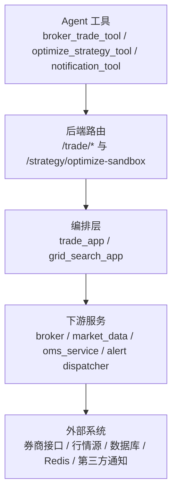
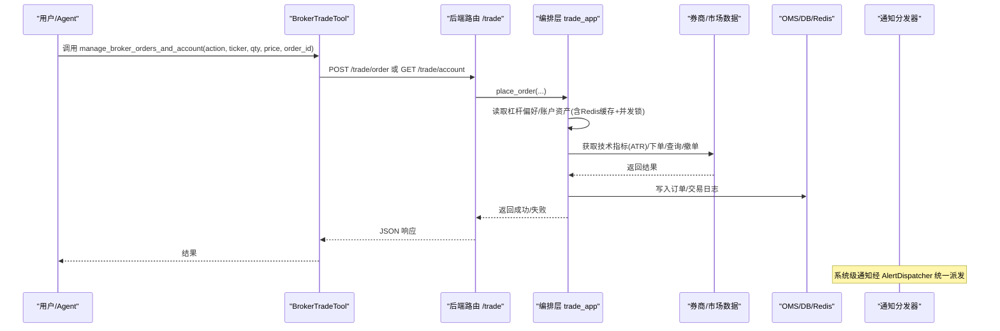
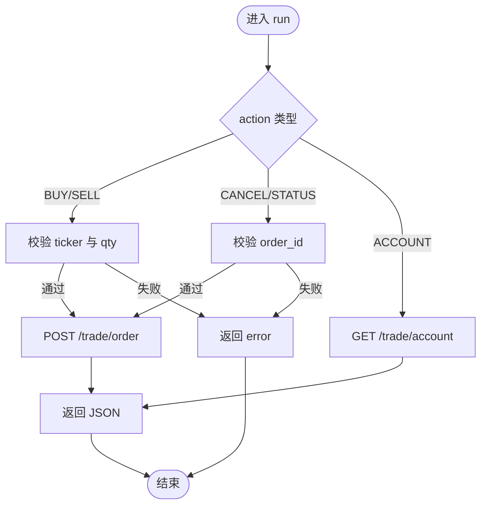
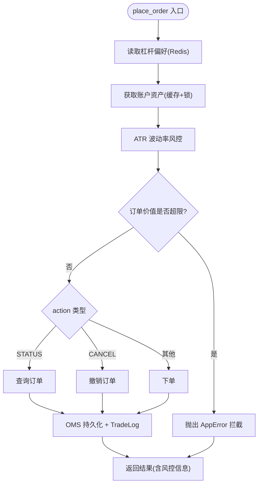
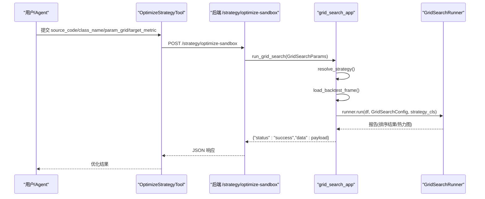
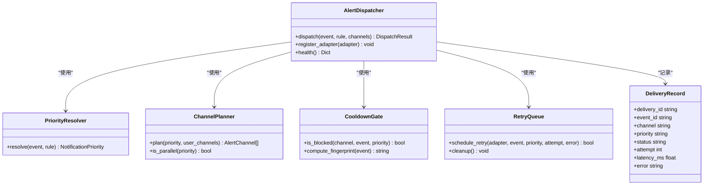
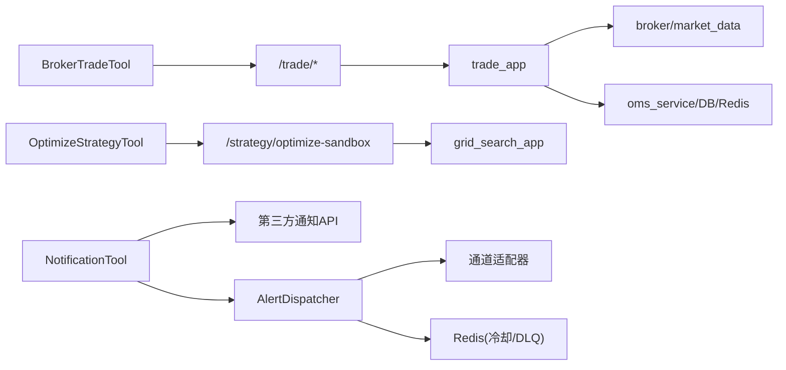

# 交易执行工具

<cite>
**本文引用的文件**
- [hermes_agent/tools/broker_trade_tool.py](file://hermes_agent/tools/broker_trade_tool.py)
- [backend/routers/trade.py](file://backend/routers/trade.py)
- [backend/app/trade_app.py](file://backend/app/trade_app.py)
- [hermes_agent/tools/optimize_strategy_tool.py](file://hermes_agent/tools/optimize_strategy_tool.py)
- [backend/app/grid_search_app.py](file://backend/app/grid_search_app.py)
- [hermes_agent/tools/notification_tool.py](file://hermes_agent/tools/notification_tool.py)
- [backend/services/alert/dispatcher.py](file://backend/services/alert/dispatcher.py)
- [backend/services/alert/notification.py](file://backend/services/alert/notification.py)
</cite>

## 目录
1. [简介](#简介)
2. [项目结构](#项目结构)
3. [核心组件](#核心组件)
4. [架构总览](#架构总览)
5. [详细组件分析](#详细组件分析)
6. [依赖关系分析](#依赖关系分析)
7. [性能考量](#性能考量)
8. [故障排查指南](#故障排查指南)
9. [结论](#结论)
10. [附录：完整使用示例](#附录完整使用示例)

## 简介
本技术文档围绕交易执行工具链，系统性说明以下能力与实现：
- 券商交易工具（broker_trade_tool）的订单执行流程：订单类型支持、参数校验、风控拦截、成交回报与持久化。
- 策略优化工具（optimize_strategy_tool）的参数调优机制：回测数据加载、网格搜索执行、结果分析与可视化。
- 通知工具（notification_tool）的多渠道推送：消息格式、重试机制、状态跟踪与冷却抑制。
- 安全控制措施：权限验证、资金检查、风控规则。
- 错误处理、日志记录与审计追踪。

## 项目结构
本项目采用“Agent 工具层 + 后端路由/编排层 + 服务/引擎层”的分层设计：
- Agent 工具层：面向大模型的工具封装，统一对外暴露能力（下单、优化、通知）。
- 后端路由层：FastAPI 路由负责鉴权、请求映射与基础校验。
- 编排与服务层：业务编排（风控、账户信息缓存、OMS 持久化）、回测与网格搜索、告警与通知分发。

**图表来源**
- [hermes_agent/tools/broker_trade_tool.py:9-63](file://hermes_agent/tools/broker_trade_tool.py#L9-L63)
- [backend/routers/trade.py:23-57](file://backend/routers/trade.py#L23-L57)
- [backend/app/trade_app.py:35-187](file://backend/app/trade_app.py#L35-L187)
- [backend/app/grid_search_app.py:47-104](file://backend/app/grid_search_app.py#L47-L104)
- [backend/services/alert/dispatcher.py:357-461](file://backend/services/alert/dispatcher.py#L357-L461)

**章节来源**
- [hermes_agent/tools/broker_trade_tool.py:9-63](file://hermes_agent/tools/broker_trade_tool.py#L9-L63)
- [backend/routers/trade.py:23-57](file://backend/routers/trade.py#L23-L57)
- [backend/app/trade_app.py:35-187](file://backend/app/trade_app.py#L35-L187)
- [backend/app/grid_search_app.py:47-104](file://backend/app/grid_search_app.py#L47-L104)
- [backend/services/alert/dispatcher.py:357-461](file://backend/services/alert/dispatcher.py#L357-L461)

## 核心组件
- 券商交易工具（BrokerTradeTool）
  - 作用：将查账户、买入、卖出、撤单、查单等动作统一收口为单一工具调用，模拟真实交易员工作台。
  - 关键行为：参数校验（action/ticker/qty/order_id），通过 SecureAsyncClient 调用后端 /trade/order 或 /trade/account。
- 策略优化工具（OptimizeStrategyTool）
  - 作用：接收策略源码、类名、参数网格与目标指标，调用后端 /strategy/optimize-sandbox 进行网格搜索。
- 通知工具（NotificationTool）
  - 作用：向 Telegram、飞书、微信（Server酱）发送通知；未配置时返回警告；失败通道单独记录错误。
- 后端交易编排（trade_app.place_order）
  - 作用：读取杠杆偏好、获取账户资产（带 Redis 缓存与并发锁）、ATR 动态波动率风控、资金敞口校验、下单分发、OMS 持久化与留痕。
- 网格搜索应用（grid_search_app.run_grid_search）
  - 作用：解析策略、加载回测数据、构建 GridSearchRunner 并执行网格搜索，返回排序结果与热力图参数。
- 通知分发器（AlertDispatcher）
  - 作用：优先级解析、通道计划、冷却门控、并行/串行投递、重试队列与 DLQ、投递记录与可观测性。

**章节来源**
- [hermes_agent/tools/broker_trade_tool.py:9-63](file://hermes_agent/tools/broker_trade_tool.py#L9-L63)
- [hermes_agent/tools/optimize_strategy_tool.py:9-52](file://hermes_agent/tools/optimize_strategy_tool.py#L9-L52)
- [hermes_agent/tools/notification_tool.py:11-81](file://hermes_agent/tools/notification_tool.py#L11-L81)
- [backend/app/trade_app.py:35-187](file://backend/app/trade_app.py#L35-L187)
- [backend/app/grid_search_app.py:47-104](file://backend/app/grid_search_app.py#L47-L104)
- [backend/services/alert/dispatcher.py:357-461](file://backend/services/alert/dispatcher.py#L357-L461)

## 架构总览
下图展示从 Agent 工具到后端路由、编排层、下游服务的端到端调用链路，以及通知分发器的统一出口。

**图表来源**
- [hermes_agent/tools/broker_trade_tool.py:35-63](file://hermes_agent/tools/broker_trade_tool.py#L35-L63)
- [backend/routers/trade.py:30-57](file://backend/routers/trade.py#L30-L57)
- [backend/app/trade_app.py:35-187](file://backend/app/trade_app.py#L35-L187)
- [backend/services/alert/dispatcher.py:396-461](file://backend/services/alert/dispatcher.py#L396-L461)

## 详细组件分析

### 券商交易工具（BrokerTradeTool）
- 支持的 action：BUY、SELL、CANCEL、STATUS、ACCOUNT。
- 参数校验：
  - BUY/SELL 必须提供 ticker 与 qty。
  - CANCEL/STATUS 必须提供 order_id。
- 调用路径：
  - ACCOUNT → GET /trade/account?market=...
  - 其他 → POST /trade/order，payload 包含 action、ticker、qty、price、order_id。
- 超时与安全：
  - 使用 SecureAsyncClient，设置超时时间，避免阻塞。
- 错误处理：
  - 网络异常或后端错误统一返回 status="error" 与 message。

**图表来源**
- [hermes_agent/tools/broker_trade_tool.py:35-63](file://hermes_agent/tools/broker_trade_tool.py#L35-L63)

**章节来源**
- [hermes_agent/tools/broker_trade_tool.py:9-63](file://hermes_agent/tools/broker_trade_tool.py#L9-L63)

### 后端交易编排（trade_app.place_order）
- 风控与校验流程：
  - 极速读取 Redis 中的杠杆偏好（默认 1.0x）。
  - 获取账户总资产（Redis 缓存 + asyncio.Lock 防穿透）。
  - 基于 ATR 的动态波动率风控：极高波动率强制降杠杆至 1.0x；计算建议止损位（2x ATR）。
  - 资金敞口校验：订单价值不得超过 total_assets * max_leverage。
- 下单分发：
  - STATUS/CANCEL/PLACE 分别调用 broker 对应方法。
- OMS 持久化与留痕：
  - 创建订单记录（区分模拟/实盘模式），写入 TradeLog。
  - 返回响应中包含风险控制的建议止损位。

**图表来源**
- [backend/app/trade_app.py:35-187](file://backend/app/trade_app.py#L35-L187)

**章节来源**
- [backend/app/trade_app.py:35-187](file://backend/app/trade_app.py#L35-L187)

### 策略优化工具（OptimizeStrategyTool）与网格搜索（grid_search_app）
- 工具输入：
  - source_code：策略源码字符串。
  - class_name：策略类名。
  - param_grid：参数网格字典（键为参数名，值为候选值数组）。
  - target_metric：优化目标（sharpe_ratio、win_rate、total_return）。
- 后端网格搜索流程：
  - 解析策略（resolve_strategy）。
  - 加载回测数据（load_backtest_frame）。
  - 构建 GridSearchRunner（VectorConfig 配置初始资金、佣金、滑点）。
  - 执行网格搜索（GridSearchConfig 指定参数网格、目标指标、工作线程数、热力图维度）。
  - 返回排序结果与可用策略列表。

**图表来源**
- [hermes_agent/tools/optimize_strategy_tool.py:35-52](file://hermes_agent/tools/optimize_strategy_tool.py#L35-L52)
- [backend/app/grid_search_app.py:47-104](file://backend/app/grid_search_app.py#L47-L104)

**章节来源**
- [hermes_agent/tools/optimize_strategy_tool.py:9-52](file://hermes_agent/tools/optimize_strategy_tool.py#L9-L52)
- [backend/app/grid_search_app.py:22-104](file://backend/app/grid_search_app.py#L22-L104)

### 通知工具（NotificationTool）与通知分发器（AlertDispatcher）
- NotificationTool：
  - 多渠道发送：Telegram、飞书 Webhook、微信（Server酱）。
  - 环境变量驱动：TELEGRAM_BOT_TOKEN、TELEGRAM_CHAT_ID、FEISHU_WEBHOOK_URL、SERVERCHAN_SENDKEY。
  - 错误隔离：每个渠道独立 try/except，记录成功与失败通道。
- AlertDispatcher（系统级通知统一出口）：
  - 优先级解析：P0~P3 基于 severity 与 source。
  - 通道计划：按优先级选择 in_app、feishu、telegram 等通道。
  - 冷却门控：基于 fingerprint 与 TTL 防止重复推送。
  - 并行/串行投递：P0-P2 并行，P3 串行且 in_app 成功后抑制外部通道。
  - 重试与 DLQ：按优先级退避重试，失败进入死信队列。
  - 投递记录：记录 delivery_id、attempt、latency_ms、error 等。

**图表来源**
- [backend/services/alert/dispatcher.py:66-108](file://backend/services/alert/dispatcher.py#L66-L108)
- [backend/services/alert/dispatcher.py:116-157](file://backend/services/alert/dispatcher.py#L116-L157)
- [backend/services/alert/dispatcher.py:173-219](file://backend/services/alert/dispatcher.py#L173-L219)
- [backend/services/alert/dispatcher.py:279-350](file://backend/services/alert/dispatcher.py#L279-L350)
- [backend/services/alert/dispatcher.py:357-461](file://backend/services/alert/dispatcher.py#L357-L461)

**章节来源**
- [hermes_agent/tools/notification_tool.py:11-81](file://hermes_agent/tools/notification_tool.py#L11-L81)
- [backend/services/alert/dispatcher.py:357-461](file://backend/services/alert/dispatcher.py#L357-L461)
- [backend/services/alert/notification.py:19-73](file://backend/services/alert/notification.py#L19-L73)

## 依赖关系分析
- 工具层依赖后端路由：
  - BrokerTradeTool → /trade/order、/trade/account。
  - OptimizeStrategyTool → /strategy/optimize-sandbox。
  - NotificationTool → 环境变量配置的第三方 API。
- 路由层依赖编排层：
  - routers/trade.py → app/trade_app.py。
- 编排层依赖下游服务：
  - broker、market_data、oms_service、redis_client、models。
- 通知分发器依赖适配器与 Redis：
  - 通道适配器（in_app、feishu、telegram 等）。
  - Redis 用于冷却与 DLQ。

**图表来源**
- [hermes_agent/tools/broker_trade_tool.py:35-63](file://hermes_agent/tools/broker_trade_tool.py#L35-L63)
- [hermes_agent/tools/optimize_strategy_tool.py:35-52](file://hermes_agent/tools/optimize_strategy_tool.py#L35-L52)
- [backend/routers/trade.py:23-57](file://backend/routers/trade.py#L23-L57)
- [backend/app/trade_app.py:35-187](file://backend/app/trade_app.py#L35-L187)
- [backend/app/grid_search_app.py:47-104](file://backend/app/grid_search_app.py#L47-L104)
- [backend/services/alert/dispatcher.py:357-461](file://backend/services/alert/dispatcher.py#L357-L461)

**章节来源**
- [backend/routers/trade.py:23-57](file://backend/routers/trade.py#L23-L57)
- [backend/app/trade_app.py:35-187](file://backend/app/trade_app.py#L35-L187)
- [backend/app/grid_search_app.py:47-104](file://backend/app/grid_search_app.py#L47-L104)
- [backend/services/alert/dispatcher.py:357-461](file://backend/services/alert/dispatcher.py#L357-L461)

## 性能考量
- 账户信息缓存与并发保护：
  - Redis 缓存账户信息，TTL 短生命周期，降低高频发单对券商 API 的压力。
  - asyncio.Lock 防止高并发下重复穿透。
- 技术指标本地缓存：
  - ATR 等技术指标命中本地缓存，无延迟影响风控决策。
- 网格搜索并行化：
  - GridSearchRunner 支持多进程/向量快路径，提升参数组合测算效率。
- 通知冷却与并行投递：
  - 通道级冷却减少重复推送；P0-P2 并行投递提升时效性。

[本节为通用性能讨论，不直接分析具体文件]

## 故障排查指南
- 下单失败：
  - 检查风控拦截（资金敞口超限、极高波动率降杠杆）。
  - 查看 AppError 的 detail 信息。
- 账户信息获取失败：
  - 确认 Redis 缓存是否有效，检查 _trade_locks 是否被正确释放。
- 通知未送达：
  - 检查环境变量是否配置（Telegram/Feishu/ServerChan）。
  - 查看 AlertDispatcher 的投递记录与 DLQ，定位失败通道与错误原因。
- 网格搜索异常：
  - 确认策略类名与源码可解析，param_grid 非空。
  - 检查回测数据加载是否成功（数据源可用性）。

**章节来源**
- [backend/app/trade_app.py:35-187](file://backend/app/trade_app.py#L35-L187)
- [backend/services/alert/dispatcher.py:279-350](file://backend/services/alert/dispatcher.py#L279-L350)
- [backend/app/grid_search_app.py:47-104](file://backend/app/grid_search_app.py#L47-L104)

## 结论
本交易执行工具链以 Agent 工具为入口，结合后端路由与编排层，实现了稳健的订单执行、策略优化与多渠道通知能力。通过 Redis 缓存、并发锁、ATR 动态风控与资金敞口校验，系统在保障安全性的同时提升了性能与可靠性。通知分发器提供统一的优先级、通道计划、冷却与重试机制，确保关键信息及时触达。整体架构清晰、职责分明，便于扩展与维护。

[本节为总结性内容，不直接分析具体文件]

## 附录：完整使用示例
以下为典型操作流程（概念性步骤，不涉及具体代码片段）：
- 下单
  - 调用 BrokerTradeTool，action=BUY/SELL，提供 ticker、qty、可选 price。
  - 后端路由转发至 trade_app.place_order，完成风控校验后下单。
  - 返回结果包含订单信息与风控提示（如建议止损位）。
- 撤单
  - 调用 BrokerTradeTool，action=CANCEL，提供 order_id。
  - 后端调用 broker.cancel_order，并持久化撤单记录。
- 查询持仓与账户
  - 调用 BrokerTradeTool，action=ACCOUNT，可选 market。
  - 后端返回账户资产与持仓概览。
- 执行策略优化
  - 调用 OptimizeStrategyTool，提供 source_code、class_name、param_grid、target_metric。
  - 后端执行网格搜索，返回最佳参数与绩效指标。
- 发送通知
  - 调用 NotificationTool，提供 message。
  - 系统通过 AlertDispatcher 统一派发，记录投递状态与重试情况。

[本节为概念性示例，不直接分析具体文件]