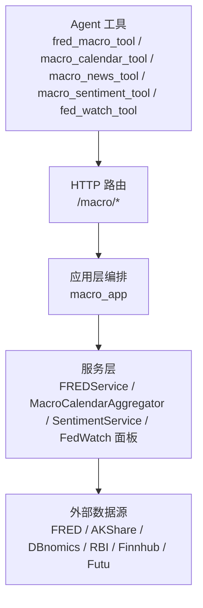
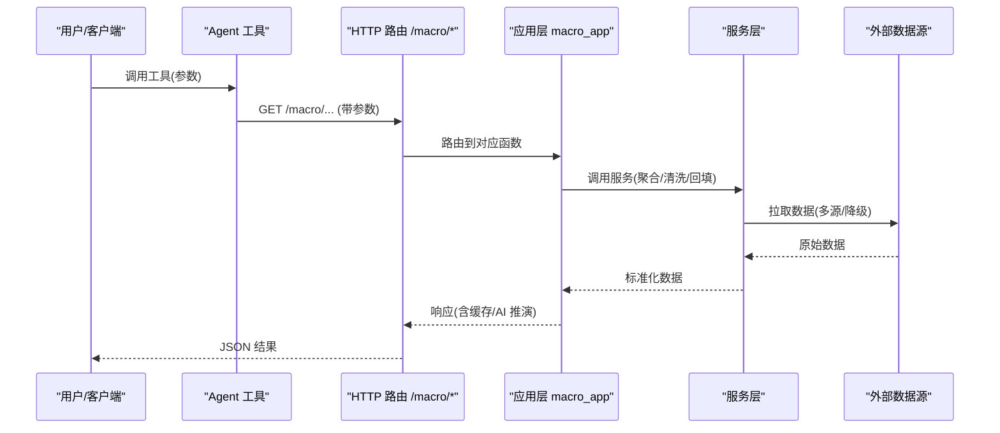
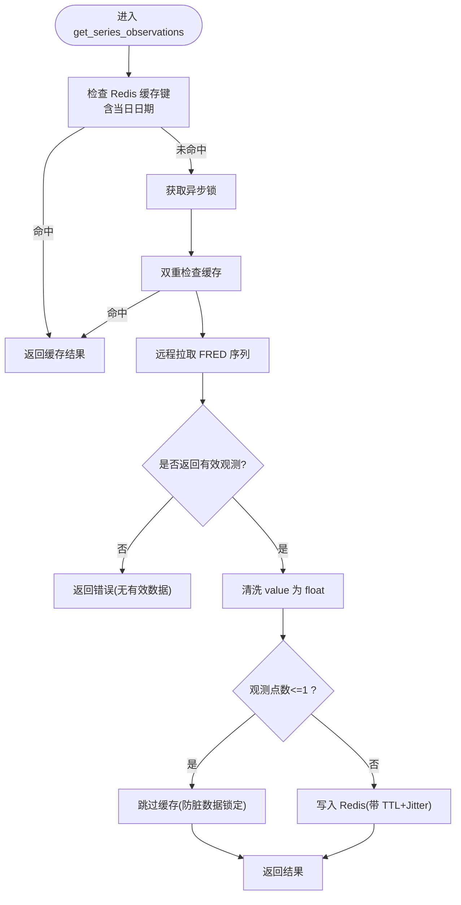
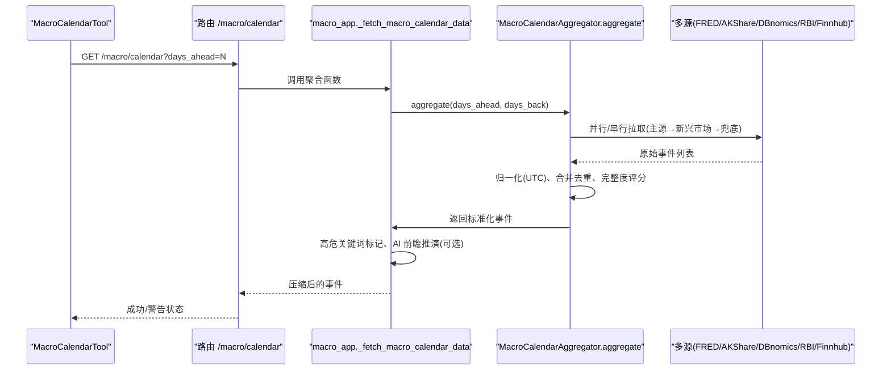
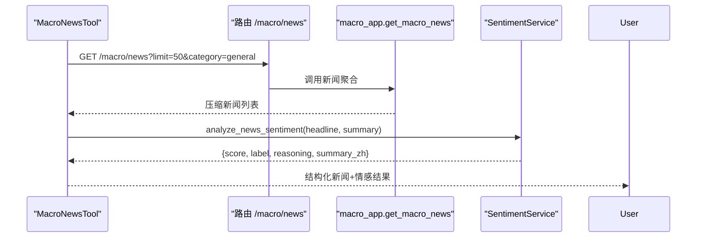
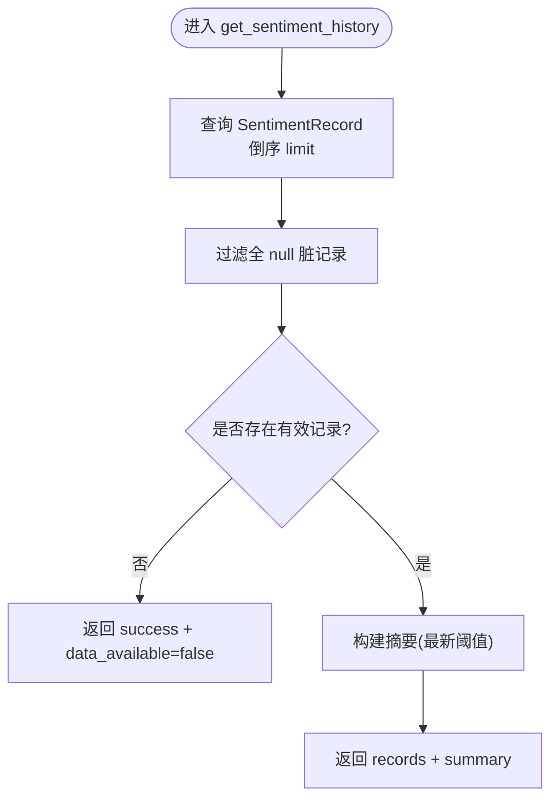
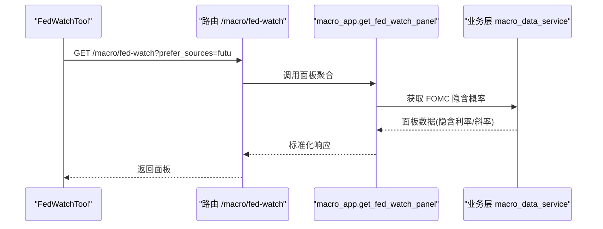

# 宏观经济工具

<cite>
**本文引用的文件**
- [fred_macro_tool.py](file://hermes_agent/tools/fred_macro_tool.py)
- [macro_calendar_tool.py](file://hermes_agent/tools/macro_calendar_tool.py)
- [macro_news_tool.py](file://hermes_agent/tools/macro_news_tool.py)
- [macro_sentiment_tool.py](file://hermes_agent/tools/macro_sentiment_tool.py)
- [fed_watch_tool.py](file://hermes_agent/tools/fed_watch_tool.py)
- [macro.py](file://backend/routers/macro.py)
- [macro_app.py](file://backend/app/macro_app.py)
- [fred_service.py](file://backend/services/macro/fred_service.py)
- [macro_calendar_service.py](file://backend/services/macro/macro_calendar_service.py)
- [sentiment_service.py](file://backend/services/macro/sentiment_service.py)
</cite>

## 目录
1. [简介](#简介)
2. [项目结构](#项目结构)
3. [核心组件](#核心组件)
4. [架构总览](#架构总览)
5. [详细组件分析](#详细组件分析)
6. [依赖关系分析](#依赖关系分析)
7. [性能考量](#性能考量)
8. [故障排查指南](#故障排查指南)
9. [结论](#结论)
10. [附录：宏观分析示例](#附录宏观分析示例)

## 简介
本技术文档面向“宏观经济工具”模块，覆盖以下五大能力：
- FRED 宏观数据工具（fred_macro_tool）：时间序列查询、数据清洗与频率转换、缓存与回填。
- 宏观日历工具（macro_calendar_tool）：事件调度系统，涵盖多源聚合、高影响过滤、实际值回填与降级策略。
- 宏观新闻工具（macro_news_tool）：新闻采集与处理流程，含分类、压缩、LLM 情感打分与批量提纯。
- 宏观情绪工具（macro_sentiment_tool）：情绪指数计算，包含 VIX、期权多空比、信用利差等指标的历史序列与阈值解读。
- 美联储观察工具（fed_watch_tool）：货币政策跟踪，包括利率决议隐含概率、下一会议隐含利率与政策斜率。

## 项目结构
宏观工具由前端 Agent 工具层调用后端 HTTP 路由，再由应用层编排服务完成数据聚合、清洗、回填与缓存。整体分层如下：
- Agent 工具层：封装参数校验、限流感知请求、结果压缩与错误包装。
- HTTP 路由层：定义 /macro/* 接口，负责鉴权、WebSocket 推送与参数透传。
- 应用层（macro_app）：统一编排、缓存锁、AI 前瞻推演、降级策略。
- 服务层：FRED 服务、宏观日历聚合器、情绪服务、FedWatch 面板等。

图表来源
- [macro.py:42-141](file://backend/routers/macro.py#L42-L141)
- [macro_app.py:58-199](file://backend/app/macro_app.py#L58-L199)
- [fred_service.py:28-128](file://backend/services/macro/fred_service.py#L28-L128)
- [macro_calendar_service.py:43-95](file://backend/services/macro/macro_calendar_service.py#L43-L95)
- [sentiment_service.py:27-86](file://backend/services/macro/sentiment_service.py#L27-L86)

章节来源
- [macro.py:42-141](file://backend/routers/macro.py#L42-L141)
- [macro_app.py:58-199](file://backend/app/macro_app.py#L58-L199)

## 核心组件
- FRED 宏观数据工具：通过后端 /macro/series 获取指定序列观测值，支持 Redis 缓存、去重锁、异常单点跳过缓存、空数据零幻觉提示。
- 宏观日历工具：通过 /macro/calendar 获取未来 N 天高影响事件，内部进行多源聚合、时区归一化、FRED actual 回填与多级降级。
- 宏观新闻工具：通过 /macro/news 获取过去 24 小时新闻，返回压缩字段（时间、标题、摘要、标签），并支持 LLM 情感打分与批量提纯。
- 宏观情绪工具：通过 /macro/sentiment-history 获取近期情绪历史序列（VIX、P/C Ratio、Credit Spread），内置完整性红线与阈值提示。
- 美联储观察工具：通过 /macro/fed-watch 获取 FOMC 各次会议目标利率隐含概率，派生下一会议隐含利率与政策斜率。

章节来源
- [fred_macro_tool.py:9-41](file://hermes_agent/tools/fred_macro_tool.py#L9-L41)
- [macro_calendar_tool.py:9-39](file://hermes_agent/tools/macro_calendar_tool.py#L9-L39)
- [macro_news_tool.py:10-53](file://hermes_agent/tools/macro_news_tool.py#L10-L53)
- [macro_sentiment_tool.py:9-105](file://hermes_agent/tools/macro_sentiment_tool.py#L9-L105)
- [fed_watch_tool.py:9-44](file://hermes_agent/tools/fed_watch_tool.py#L9-L44)

## 架构总览
宏观工具采用“薄路由 + 厚编排 + 多源聚合”的架构：
- 路由层仅做参数映射与 WebSocket 管理。
- 应用层负责缓存键设计、并发锁、AI 前瞻推演与降级策略。
- 服务层实现具体数据源适配、清洗、回填与聚合。
- 外部数据源通过 DataSourceRouter 或市场数据网关接入，具备容错与降级。

图表来源
- [macro.py:42-141](file://backend/routers/macro.py#L42-L141)
- [macro_app.py:58-199](file://backend/app/macro_app.py#L58-L199)
- [fred_service.py:28-128](file://backend/services/macro/fred_service.py#L28-L128)
- [macro_calendar_service.py:43-95](file://backend/services/macro/macro_calendar_service.py#L43-L95)

## 详细组件分析

### FRED 宏观数据工具（fred_macro_tool）
- 功能要点：
  - 参数校验：必须提供 series_id；limit 默认 100。
  - 请求路径：/macro/series，使用 SecureAsyncClient 发起限流感知请求。
  - 后端处理：FREDService.get_series_observations 实现 Redis 缓存、防击穿锁、异常单点跳过缓存、空数据零幻觉提示。
  - 数据清洗：value 可能为 "." 或字符串，需转为 float；日期保留原样。
  - 频率转换：按 limit 控制返回最近数据点数量，适合日频/周频展示。

图表来源
- [fred_service.py:28-128](file://backend/services/macro/fred_service.py#L28-L128)

章节来源
- [fred_macro_tool.py:9-41](file://hermes_agent/tools/fred_macro_tool.py#L9-L41)
- [fred_service.py:28-128](file://backend/services/macro/fred_service.py#L28-L128)
- [macro.py:51-58](file://backend/routers/macro.py#L51-L58)

### 宏观日历工具（macro_calendar_tool）
- 功能要点：
  - 参数限制：days_ahead 在 1-30 之间，默认 7。
  - 请求路径：/macro/calendar，内部进行高影响过滤，防止冗余数据撑爆上下文。
  - 多源聚合：AKShare → DBnomics/RBI → Finnhub → FRED 发布日历兜底。
  - 时区归一化：将各源时间转换为 UTC ISO 格式。
  - Actual 回填：通过 FRED 权威序列匹配事件关键词回填美国核心及国际 CPI 实际值。
  - 降级策略：任一源失败不影响整体聚合；全空时返回警告与空数据。

图表来源
- [macro_calendar_tool.py:9-39](file://hermes_agent/tools/macro_calendar_tool.py#L9-L39)
- [macro_app.py:58-199](file://backend/app/macro_app.py#L58-L199)
- [macro_calendar_service.py:43-95](file://backend/services/macro/macro_calendar_service.py#L43-L95)

章节来源
- [macro_calendar_tool.py:9-39](file://hermes_agent/tools/macro_calendar_tool.py#L9-L39)
- [macro_calendar_service.py:43-95](file://backend/services/macro/macro_calendar_service.py#L43-L95)
- [macro.py:42-48](file://backend/routers/macro.py#L42-L48)

### 宏观新闻工具（macro_news_tool）
- 功能要点：
  - 参数：limit（默认 50）、category（general/forex/crypto/merger）。
  - 请求路径：/macro/news，返回过去 24 小时新闻。
  - 数据压缩：剥离图片 URL 与 ID，仅保留 time/headline/summary/tags，降低 Token 成本。
  - 情感分析：SentimentService.analyze_news_sentiment 对单条新闻打分（-100~100），输出 Bullish/Bearish/Neutral。
  - 批量提纯：batch_filter_news 用 LLM 剔除无价值公告，返回显著新闻索引。

图表来源
- [macro_news_tool.py:10-53](file://hermes_agent/tools/macro_news_tool.py#L10-L53)
- [sentiment_service.py:27-86](file://backend/services/macro/sentiment_service.py#L27-L86)
- [macro.py:108-114](file://backend/routers/macro.py#L108-L114)

章节来源
- [macro_news_tool.py:10-53](file://hermes_agent/tools/macro_news_tool.py#L10-L53)
- [sentiment_service.py:27-86](file://backend/services/macro/sentiment_service.py#L27-L86)
- [macro.py:108-114](file://backend/routers/macro.py#L108-L114)

### 宏观情绪工具（macro_sentiment_tool）
- 功能要点：
  - 参数：days（默认 30），限制最大 2000 数据点。
  - 请求路径：/macro/sentiment-history，返回 P/C Ratio、VIX、Credit Spread 历史。
  - 完整性红线：若所有记录核心字段均为 None，返回 data_available=false 并提示不可用。
  - 阈值提示：最新记录的 VIX/P-C/Spread 附带阈值说明，辅助 LLM 研判。
  - 后端读取：从 SentimentRecord 表倒序读取，跳过全 null 脏记录。

图表来源
- [macro_sentiment_tool.py:32-105](file://hermes_agent/tools/macro_sentiment_tool.py#L32-L105)
- [macro_app.py:457-485](file://backend/app/macro_app.py#L457-L485)

章节来源
- [macro_sentiment_tool.py:9-105](file://hermes_agent/tools/macro_sentiment_tool.py#L9-L105)
- [macro_app.py:457-485](file://backend/app/macro_app.py#L457-L485)

### 美联储观察工具（fed_watch_tool）
- 功能要点：
  - 参数：prefer_sources（默认 futu），用于临时偏好数据源。
  - 请求路径：/macro/fed-watch，返回 FOMC 各次会议目标利率隐含概率。
  - 派生指标：下一会议隐含利率与政策斜率（hawkish/dovish/flat）。
  - 应用层：通过 macro_app.get_fed_watch_panel 调用业务层聚合。

图表来源
- [fed_watch_tool.py:9-44](file://hermes_agent/tools/fed_watch_tool.py#L9-L44)
- [macro.py:71-76](file://backend/routers/macro.py#L71-L76)
- [macro_app.py:428-436](file://backend/app/macro_app.py#L428-L436)

章节来源
- [fed_watch_tool.py:9-44](file://hermes_agent/tools/fed_watch_tool.py#L9-L44)
- [macro.py:71-76](file://backend/routers/macro.py#L71-L76)
- [macro_app.py:428-436](file://backend/app/macro_app.py#L428-L436)

## 依赖关系分析
- Agent 工具依赖后端路由：所有工具通过 get_backend_api_url() 拼接 /macro/* 接口。
- 路由依赖应用层：路由仅做参数映射，逻辑下沉至 macro_app。
- 应用层依赖服务层：FREDService、MacroCalendarAggregator、SentimentService 等。
- 服务层依赖外部数据源：FRED、AKShare、DBnomics、RBI、Finnhub、Futu。

图表来源
- [macro.py:42-141](file://backend/routers/macro.py#L42-L141)
- [macro_app.py:58-199](file://backend/app/macro_app.py#L58-L199)
- [fred_service.py:28-128](file://backend/services/macro/fred_service.py#L28-L128)
- [macro_calendar_service.py:43-95](file://backend/services/macro/macro_calendar_service.py#L43-L95)

章节来源
- [macro.py:42-141](file://backend/routers/macro.py#L42-L141)
- [macro_app.py:58-199](file://backend/app/macro_app.py#L58-L199)

## 性能考量
- 缓存策略：
  - FRED 序列：Redis 缓存键含当日日期，TTL 6 小时 + Jitter；单点观测跳过缓存防脏数据。
  - 宏观日历：缓存键含当日日期，TTL ~2 小时；AI 前瞻推演独立哈希缓存 3 天。
  - 情绪历史：直接读库，跳过全 null 脏记录。
- 并发控制：
  - 应用层使用异步锁池防止缓存击穿。
  - 情绪服务批量分析使用 asyncio.gather，return_exceptions=True 防止部分报错阻断全局。
- 降级与容错：
  - 宏观日历多源聚合，任一源失败不影响整体；全空返回警告。
  - FRED 回填失败静默跳过，不中断主流程。

[本节为通用性能指导，无需特定文件引用]

## 故障排查指南
- FRED 序列无数据：
  - 检查 series_id 是否正确；查看返回 status 是否为 error；确认子服务是否可用。
  - 参考：FREDService.get_series_observations 的空数据零幻觉提示。
- 宏观日历为空：
  - 检查多源配置与网络连通性；查看 sources_contributed 是否为空；确认降级路径是否生效。
  - 参考：MacroCalendarAggregator.aggregate 的全空降级。
- 新闻情感分析失败：
  - 检查 LLM 服务可用性；确认输入 headline/summary 是否被净化；查看 batch_analyze_news 的异常日志。
  - 参考：SentimentService.analyze_news_sentiment 的错误处理。
- 情绪历史为空：
  - 检查 SentimentRecord 表是否初始化；确认是否有全 null 脏记录被过滤；查看 data_available 标志。
  - 参考：macro_app.get_sentiment_history 的脏记录过滤。

章节来源
- [fred_service.py:28-128](file://backend/services/macro/fred_service.py#L28-L128)
- [macro_calendar_service.py:43-95](file://backend/services/macro/macro_calendar_service.py#L43-L95)
- [sentiment_service.py:27-86](file://backend/services/macro/sentiment_service.py#L27-L86)
- [macro_app.py:457-485](file://backend/app/macro_app.py#L457-L485)

## 结论
宏观工具模块通过“工具层 + 路由层 + 应用层 + 服务层”的分层架构，实现了多源数据聚合、清洗、回填与缓存，具备强容错与降级能力。FRED 序列提供权威数据支撑，宏观日历实现高影响事件调度，新闻工具结合 LLM 进行情感分析与提纯，情绪工具提供市场风向标历史，FedWatch 面板跟踪货币政策预期。整体设计兼顾性能、稳定性与可扩展性，适用于宏观分析与交易决策场景。

[本节为总结性内容，无需特定文件引用]

## 附录：宏观分析示例
- 获取经济指标：
  - 调用 fred_macro_tool.get_fred_macro_data(series_id="DGS10", limit=100)，获取十年期美债收益率序列。
  - 后端经 FREDService 清洗 value 并缓存，返回标准化观测列表。
- 分析政策影响：
  - 调用 macro_calendar_tool.get_macro_calendar(days_ahead=7)，获取未来 7 天高影响事件。
  - 应用层进行高危关键词标记与 AI 前瞻推演，输出事件与推演结论。
- 构建宏观模型：
  - 调用 macro_sentiment_tool.get_macro_sentiment_history(days=30)，获取情绪历史序列。
  - 结合阈值（VIX<15 乐观，>25 恐慌；P/C<0.7 看涨，>1.0 看跌；Spread<4.5% 安全，>4.5% 高危）构建情绪因子。
  - 调用 fed_watch_tool.get_fed_watch(prefer_sources="futu")，获取 FOMC 隐含概率与政策斜率，作为流动性前瞻因子。

章节来源
- [fred_macro_tool.py:9-41](file://hermes_agent/tools/fred_macro_tool.py#L9-L41)
- [macro_calendar_tool.py:9-39](file://hermes_agent/tools/macro_calendar_tool.py#L9-L39)
- [macro_sentiment_tool.py:9-105](file://hermes_agent/tools/macro_sentiment_tool.py#L9-L105)
- [fed_watch_tool.py:9-44](file://hermes_agent/tools/fed_watch_tool.py#L9-L44)
