# 工具链集成系统

<cite>
**本文引用的文件**
- [tool_registry.py](file://hermes_agent/tool_registry.py)
- [base.py](file://hermes_agent/tools/base.py)
- [decorators.py](file://hermes_agent/tools/decorators.py)
- [agent.py](file://hermes_agent/agent.py)
- [market_snapshot_tool.py](file://hermes_agent/tools/market_snapshot_tool.py)
- [stock_basicinfo_tool.py](file://hermes_agent/tools/stock_basicinfo_tool.py)
- [broker_trade_tool.py](file://hermes_agent/tools/broker_trade_tool.py)
- [order_book_tool.py](file://hermes_agent/tools/order_book_tool.py)
- [financial_report_tool.py](file://hermes_agent/tools/financial_report_tool.py)
- [technical_indicators_tool.py](file://hermes_agent/tools/technical_indicators_tool.py)
- [tool_result_cache.py](file://hermes_agent/tool_result_cache.py)
- [secure_client.py](file://hermes_agent/tools/secure_client.py)
- [__init__.py](file://hermes_agent/tools/__init__.py)
- [tool_scope_mapping.json](file://hermes_agent/tools/tool_scope_mapping.json)
- [test_tool_sets_ag03.py](file://backend/tests/test_tool_sets_ag03.py)
</cite>

## 更新摘要
**所做更改**
- 新增工具范围分发系统章节，详细说明11种工具范围的分类机制
- 更新工具注册机制，增加装饰器工厂模式和多范围注解支持
- 新增智能意图识别章节，说明基于关键词匹配的意图提取算法
- 更新架构总览图，反映上下文压缩75%的优化效果
- 增强故障排查指南，包含范围过滤相关的调试方法

## 目录
1. [简介](#简介)
2. [项目结构](#项目结构)
3. [核心组件](#核心组件)
4. [架构总览](#架构总览)
5. [详细组件分析](#详细组件分析)
6. [依赖关系分析](#依赖关系分析)
7. [性能考量](#性能考量)
8. [故障排查指南](#故障排查指南)
9. [结论](#结论)
10. [附录：使用示例与最佳实践](#附录使用示例与最佳实践)

## 简介
本技术文档面向"工具链集成系统"，聚焦于 Agent 侧工具注册、参数校验、错误处理、限流与缓存、安全沙箱以及从意图识别到结果返回的完整调用链路。文档覆盖市场分析工具（market_snapshot_tool、stock_basicinfo_tool）、交易执行工具（broker_trade_tool、order_book_tool）和数据查询工具（financial_report_tool、technical_indicators_tool），并给出自定义工具开发指南与安全控制机制说明。

**更新** 本次更新引入了全面的工具范围分发系统，支持11种不同的工具范围（quote、fundamental、macro、trade、search、news、indicators、fund_flow、backtest、strategy、system），通过智能意图识别和关键词匹配实现75%的上下文压缩优化。

## 项目结构
Agent 工具链位于 hermes_agent 模块，采用"装饰器 + 自动扫描"的注册模式：
- 工具基类与通用能力：tools/base.py
- 工具装饰器与自我纠错：tools/decorators.py
- 工具注册表与执行调度：tool_registry.py
- Agent 主脑与 ReAct 循环：agent.py
- 具体工具实现：tools/*_tool.py
- 统一 HTTP 安全客户端：tools/secure_client.py
- 工具结果 Redis 缓存：tool_result_cache.py
- 工具包自动导入：tools/__init__.py
- **新增** 工具范围映射配置：tools/tool_scope_mapping.json

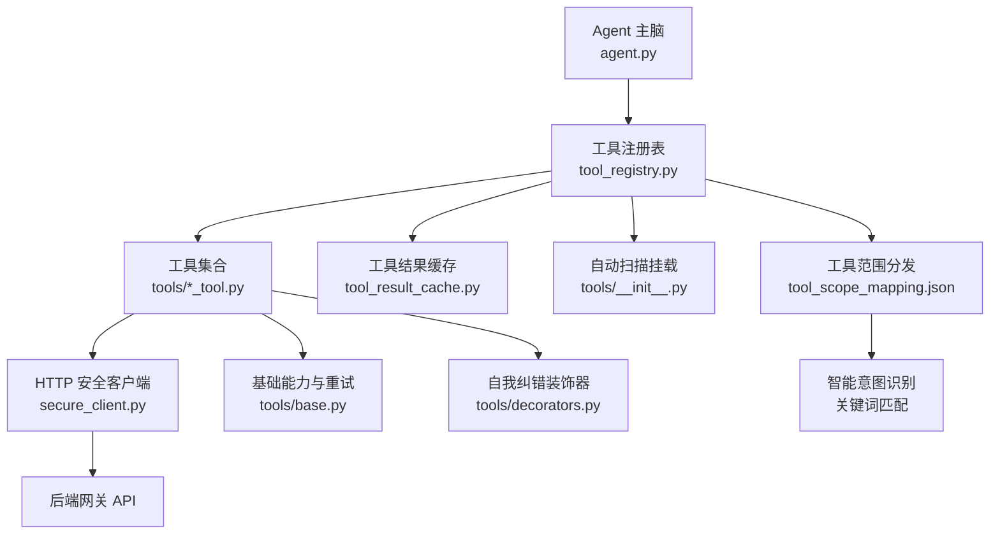

**图示来源**
- [agent.py:116-190](file://hermes_agent/agent.py#L116-L190)
- [tool_registry.py:52-123](file://hermes_agent/tool_registry.py#L52-L123)
- [secure_client.py:8-81](file://hermes_agent/tools/secure_client.py#L8-L81)
- [tool_result_cache.py:107-195](file://hermes_agent/tool_result_cache.py#L107-L195)
- [base.py:21-282](file://hermes_agent/tools/base.py#L21-L282)
- [decorators.py:15-64](file://hermes_agent/tools/decorators.py#L15-L64)
- [__init__.py:1-16](file://hermes_agent/tools/__init__.py#L1-L16)
- [tool_scope_mapping.json:1-32](file://hermes_agent/tools/tool_scope_mapping.json#L1-L32)

**章节来源**
- [agent.py:116-190](file://hermes_agent/agent.py#L116-L190)
- [tool_registry.py:52-123](file://hermes_agent/tool_registry.py#L52-L123)
- [__init__.py:1-16](file://hermes_agent/tools/__init__.py#L1-L16)

## 核心组件
- 工具注册表 ToolRegistry：负责工具发现、Schema 暴露、并发执行、限流与结果缓存。
- 工具基类 BaseTool：提供股票代码标准化、双级缓存（进程内存 + Redis）、限流感知智能重试等通用能力。
- 安全客户端 SecureAsyncClient：强制仅允许访问内部后端网关，拦截外部直连；对超大响应进行结构化截断，防止上下文溢出。
- 工具结果缓存 ToolResultCache：基于 Redis Hash 的统一缓存层，支持按工具 TTL、黑名单与状态过滤策略。
- Agent 主脑 HermesAgent：构建 LLM 请求、ReAct 循环、工具调用编排、流式输出与熔断恢复。
- **新增** 工具范围分发系统：支持11种工具范围的智能分类和上下文压缩。

**章节来源**
- [tool_registry.py:52-123](file://hermes_agent/tool_registry.py#L52-L123)
- [base.py:21-282](file://hermes_agent/tools/base.py#L21-L282)
- [secure_client.py:8-81](file://hermes_agent/tools/secure_client.py#L8-L81)
- [tool_result_cache.py:107-195](file://hermes_agent/tool_result_cache.py#L107-L195)
- [agent.py:116-190](file://hermes_agent/agent.py#L116-L190)

## 架构总览
下图展示从用户输入到工具执行与结果返回的端到端流程，包括智能意图识别、工具范围分发、参数校验、限流与缓存、安全网关访问与结果回传。

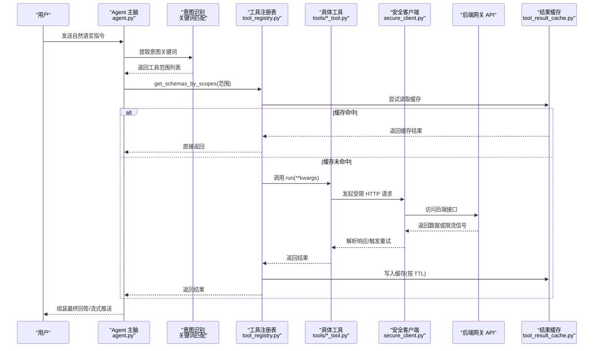

**图示来源**
- [agent.py:399-500](file://hermes_agent/agent.py#L399-L500)
- [tool_registry.py:94-123](file://hermes_agent/tool_registry.py#L94-L123)
- [tool_result_cache.py:122-187](file://hermes_agent/tool_result_cache.py#L122-L187)
- [secure_client.py:32-81](file://hermes_agent/tools/secure_client.py#L32-L81)

## 详细组件分析

### 工具范围分发系统
**新增** AGENT-03 引入了全面的工具范围分发系统，支持11种不同的工具范围：

- **quote**：行情数据相关工具（如市场快照、股票基本信息）
- **fundamental**：基本面分析工具（如财务数据、分析师共识）
- **macro**：宏观经济工具（如美联储观察、宏观日历）
- **trade**：交易执行工具（如订单管理、账户操作）
- **search**：搜索工具（如网络搜索、网页抓取）
- **news**：新闻工具（如公司新闻、宏观新闻）
- **indicators**：技术指标工具（如K线指标计算）
- **fund_flow**：资金流向工具
- **backtest**：回测工具
- **strategy**：策略工具
- **system**：系统工具

工具范围通过 `@register_tool(scopes=[...])` 装饰器工厂模式进行声明，支持多范围注解。

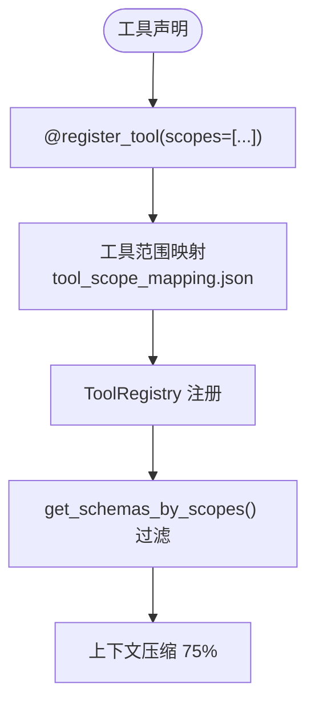

**图示来源**
- [tool_registry.py:45-65](file://hermes_agent/tool_registry.py#L45-L65)
- [tool_scope_mapping.json:1-32](file://hermes_agent/tools/tool_scope_mapping.json#L1-L32)
- [test_tool_sets_ag03.py:120-157](file://backend/tests/test_tool_sets_ag03.py#L120-L157)

**章节来源**
- [tool_registry.py:45-65](file://hermes_agent/tool_registry.py#L45-L65)
- [tool_registry.py:140-168](file://hermes_agent/tool_registry.py#L140-L168)
- [tool_scope_mapping.json:1-32](file://hermes_agent/tools/tool_scope_mapping.json#L1-L32)
- [test_tool_sets_ag03.py:13-46](file://backend/tests/test_tool_sets_ag03.py#L13-L46)

### 智能意图识别
**新增** 基于关键词匹配的智能意图识别系统，能够自动从用户指令中提取相关的工具范围：

- **关键词映射**：建立自然语言词汇与工具范围的映射关系
- **多意图支持**：支持同时识别多个工具范围（如"价格和技术指标分析"）
- **上下文优化**：根据识别的意图动态加载相关工具 Schema，减少75%的上下文大小

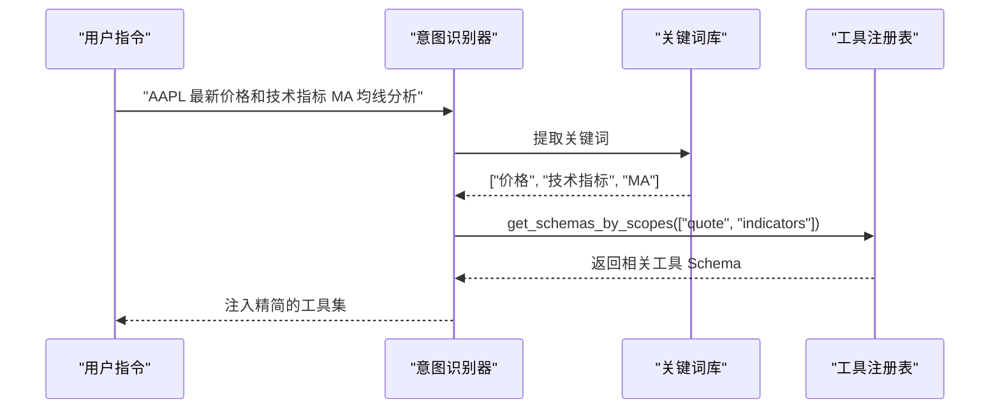

**图示来源**
- [test_tool_sets_ag03.py:163-207](file://backend/tests/test_tool_sets_ag03.py#L163-L207)

**章节来源**
- [test_tool_sets_ag03.py:163-207](file://backend/tests/test_tool_sets_ag03.py#L163-L207)

### 工具注册机制
- 自动发现：通过 tools/__init__.py 动态导入所有工具模块，触发 @register_tool 装饰器将工具加入全局列表。
- 注册与 Schema：ToolRegistry 在初始化时实例化已注册的工具，收集 name/description/parameters 生成函数 Schema，供 LLM 选择。
- **更新** 装饰器工厂模式：支持 `@register_tool()` 和 `@register_tool(scopes=["quote", "fundamental"])` 两种用法。
- 执行与限流：execute 先查 Redis 缓存，未命中则通过令牌桶限流后调用工具 run；支持协程与同步方法兼容。
- 异常保护：捕获异常并返回结构化错误，避免 Agent 崩溃。

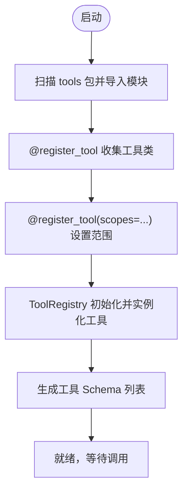

**图示来源**
- [__init__.py:1-16](file://hermes_agent/tools/__init__.py#L1-L16)
- [tool_registry.py:35-92](file://hermes_agent/tool_registry.py#L35-L92)

**章节来源**
- [tool_registry.py:35-92](file://hermes_agent/tool_registry.py#L35-L92)
- [__init__.py:1-16](file://hermes_agent/tools/__init__.py#L1-L16)

### 参数验证与错误处理
- 参数校验：各工具在 run 中做必要参数检查（如 ticker、action、qty、order_id），缺失时返回结构化错误。
- 限流感知重试：BaseTool.rate_limit_aware_request 检测 429/503 或响应体中的 rate_limited 关键词，按 retry_after 退避重试。
- 自我纠错：with_agent_self_correction 装饰器可拦截 ToolCorrectionError，注入报错信息让 LLM 自我修正并重试。
- 上下文保护：SecureAsyncClient 对超大响应进行 JSON 结构化截断，防止 Token 溢出。

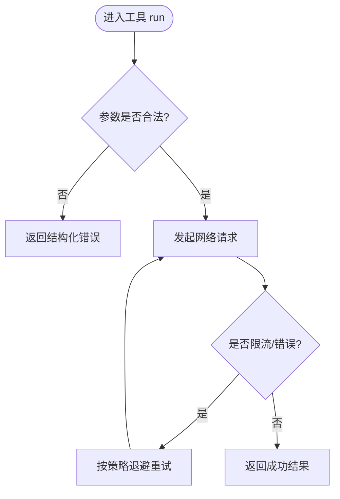

**图示来源**
- [base.py:97-189](file://hermes_agent/tools/base.py#L97-L189)
- [decorators.py:15-64](file://hermes_agent/tools/decorators.py#L15-L64)
- [secure_client.py:32-81](file://hermes_agent/tools/secure_client.py#L32-L81)

**章节来源**
- [base.py:97-189](file://hermes_agent/tools/base.py#L97-L189)
- [decorators.py:15-64](file://hermes_agent/tools/decorators.py#L15-L64)
- [secure_client.py:32-81](file://hermes_agent/tools/secure_client.py#L32-L81)

### 工具调用完整流程（从意图识别到结果返回）
- 意图识别：Agent 构建包含工具 Schema 的请求，LLM 决定是否需要调用工具及参数。
- **更新** 范围过滤：通过 get_schemas_by_scopes() 根据意图识别结果过滤工具，减少上下文大小。
- 工具选择与执行：Agent 解析 tool_calls，调用 ToolRegistry.execute，走缓存→限流→工具运行→缓存写回路径。
- 结果回传：工具结果以 tool role 追加到上下文，继续下一轮推理或直接输出结论。

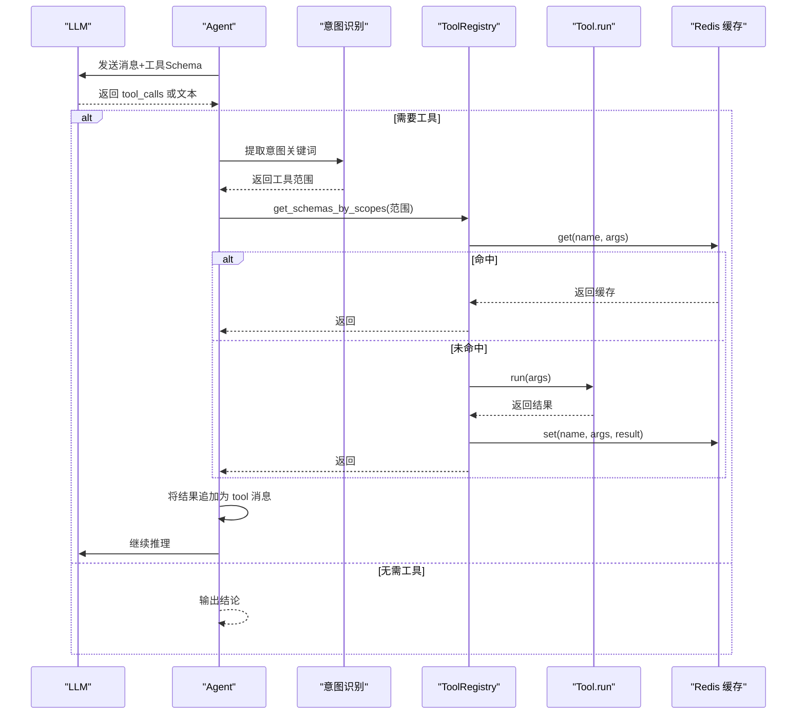

**图示来源**
- [agent.py:399-500](file://hermes_agent/agent.py#L399-L500)
- [tool_registry.py:94-123](file://hermes_agent/tool_registry.py#L94-L123)
- [tool_result_cache.py:122-187](file://hermes_agent/tool_result_cache.py#L122-L187)

**章节来源**
- [agent.py:399-500](file://hermes_agent/agent.py#L399-L500)
- [tool_registry.py:94-123](file://hermes_agent/tool_registry.py#L94-L123)

### 市场分析工具
- market_snapshot_tool：批量获取实时快照，支持 prefer_sources 指定数据源偏好，返回派生指标（平均涨跌幅、涨跌家数）。
- stock_basicinfo_tool：获取全市场基础信息，支持市场与证券类型筛选，用于标的检索与代码映射。

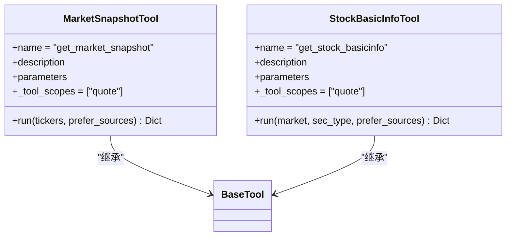

**图示来源**
- [market_snapshot_tool.py:9-46](file://hermes_agent/tools/market_snapshot_tool.py#L9-L46)
- [stock_basicinfo_tool.py:9-56](file://hermes_agent/tools/stock_basicinfo_tool.py#L9-L56)
- [base.py:21-282](file://hermes_agent/tools/base.py#L21-L282)

**章节来源**
- [market_snapshot_tool.py:9-46](file://hermes_agent/tools/market_snapshot_tool.py#L9-L46)
- [stock_basicinfo_tool.py:9-56](file://hermes_agent/tools/stock_basicinfo_tool.py#L9-L56)

### 交易执行工具
- broker_trade_tool：统一 OMS 交互探针，支持 BUY/SELL/CANCEL/STATUS/ACCOUNT 操作，内置参数校验与错误封装。
- order_book_tool：获取 L2 盘口深度，返回最优买卖价差与量比，需先订阅 Quote 推送。

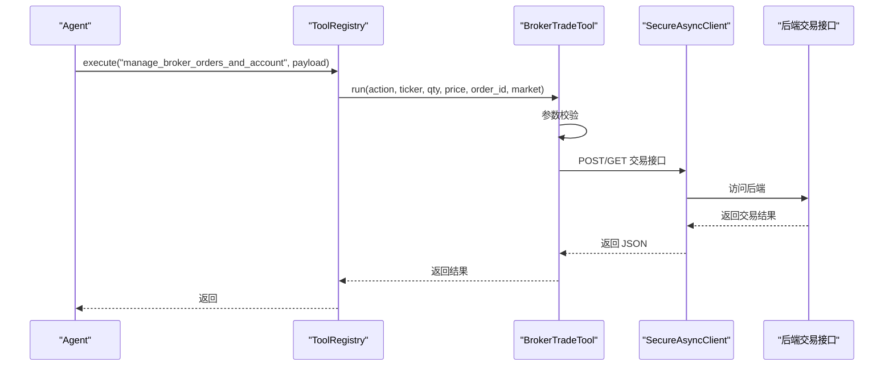

**图示来源**
- [broker_trade_tool.py:9-63](file://hermes_agent/tools/broker_trade_tool.py#L9-L63)
- [secure_client.py:32-81](file://hermes_agent/tools/secure_client.py#L32-L81)
- [tool_registry.py:94-123](file://hermes_agent/tool_registry.py#L94-L123)

**章节来源**
- [broker_trade_tool.py:9-63](file://hermes_agent/tools/broker_trade_tool.py#L9-L63)
- [order_book_tool.py:9-46](file://hermes_agent/tools/order_book_tool.py#L9-L46)

### 数据查询工具
- financial_report_tool：扫描本地财报/研报文件，支持分块读取，便于大模型深度财务分析。
- technical_indicators_tool：拉取历史 K 线并计算技术指标矩阵，返回最新截面特征与趋势评分，支持多指标配置。

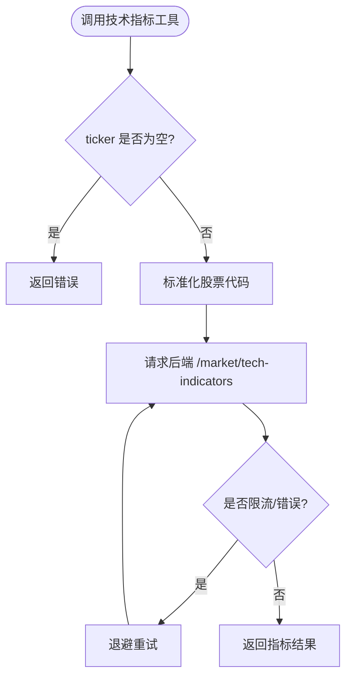

**图示来源**
- [technical_indicators_tool.py:57-86](file://hermes_agent/tools/technical_indicators_tool.py#L57-L86)
- [base.py:97-189](file://hermes_agent/tools/base.py#L97-L189)

**章节来源**
- [financial_report_tool.py:9-42](file://hermes_agent/tools/financial_report_tool.py#L9-L42)
- [technical_indicators_tool.py:11-86](file://hermes_agent/tools/technical_indicators_tool.py#L11-L86)

### 安全控制机制
- 白名单限制：SecureAsyncClient 仅允许访问后端网关与内网地址，禁止直连外部数据源。
- 上下文保护：对超大响应进行 JSON 结构化截断，避免 Token 溢出导致崩溃。
- 权限与审计：工具执行由 Agent 统一编排，结合通知服务与日志记录，便于追踪与审计。

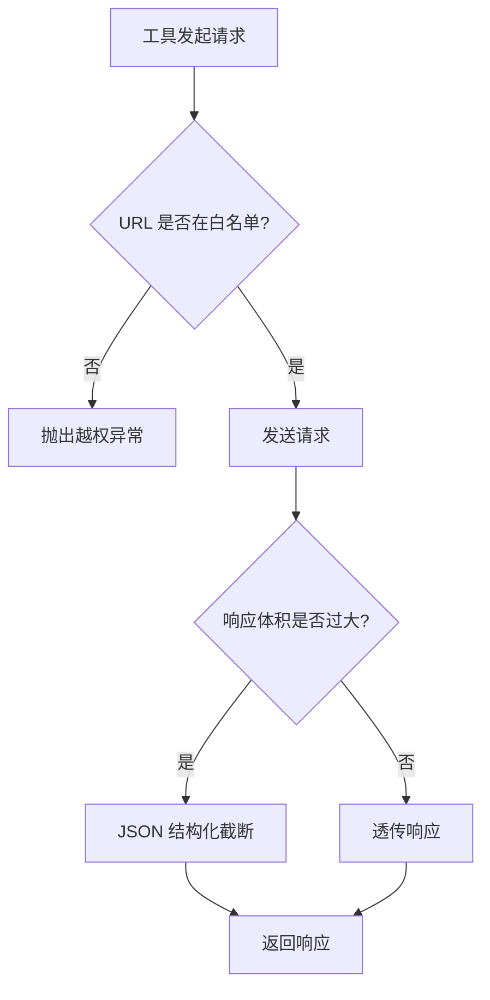

**图示来源**
- [secure_client.py:14-81](file://hermes_agent/tools/secure_client.py#L14-L81)

**章节来源**
- [secure_client.py:14-81](file://hermes_agent/tools/secure_client.py#L14-L81)

## 依赖关系分析
- 低耦合高内聚：工具通过基类复用通用能力，注册表解耦工具发现与执行。
- 外部依赖：后端网关 API、Redis 缓存、OpenAI SDK（LLM 调用）。
- **更新** 范围依赖：工具范围映射配置文件，支持动态范围过滤。
- 潜在风险：若后端返回超大数据或未正确限流，可能影响 Agent 上下文稳定性；已通过 SecureAsyncClient 截断与 BaseTool 重试缓解。

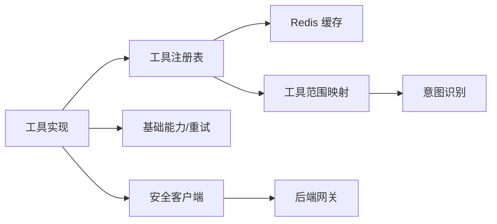

**图示来源**
- [tool_registry.py:52-123](file://hermes_agent/tool_registry.py#L52-L123)
- [tool_result_cache.py:107-195](file://hermes_agent/tool_result_cache.py#L107-L195)
- [base.py:97-189](file://hermes_agent/tools/base.py#L97-L189)
- [secure_client.py:32-81](file://hermes_agent/tools/secure_client.py#L32-L81)
- [tool_scope_mapping.json:1-32](file://hermes_agent/tools/tool_scope_mapping.json#L1-L32)

**章节来源**
- [tool_registry.py:52-123](file://hermes_agent/tool_registry.py#L52-L123)
- [tool_result_cache.py:107-195](file://hermes_agent/tool_result_cache.py#L107-L195)

## 性能考量
- 缓存优先：ToolRegistry.execute 先查 Redis 缓存，减少重复请求与下游压力。
- 限流保护：令牌桶限流与限流感知重试，避免突发流量打垮后端。
- **更新** 上下文优化：通过工具范围分发实现75%的上下文压缩，减少Token消耗和传输开销。
- 并发执行：Agent 对多个 tool_calls 并发执行，提升吞吐。
- 懒加载：工具模块延迟加载，避免循环导入和启动时间过长。

## 故障排查指南
- 工具未找到：检查工具是否被 @register_tool 装饰且模块已被导入。
- 参数错误：查看工具 run 中的参数校验逻辑，确保必填字段齐全。
- 限流频繁：关注 BaseTool 的重试策略与后端返回的 retry_after，必要时调整业务频率。
- 上下文溢出：确认 SecureAsyncClient 的截断生效，避免后端返回过大数组。
- 缓存异常：检查 Redis 连接与 TTL 配置，确认 should_cache_result 过滤策略是否符合预期。
- **新增** 范围过滤问题：检查工具的范围配置是否正确，确认 get_schemas_by_scopes() 的参数传递。
- **新增** 意图识别失败：验证关键词映射配置，检查用户指令是否能正确匹配到工具范围。

**章节来源**
- [tool_registry.py:94-123](file://hermes_agent/tool_registry.py#L94-L123)
- [base.py:97-189](file://hermes_agent/tools/base.py#L97-L189)
- [secure_client.py:32-81](file://hermes_agent/tools/secure_client.py#L32-L81)
- [tool_result_cache.py:89-104](file://hermes_agent/tool_result_cache.py#L89-L104)

## 结论
该工具链集成系统通过"装饰器 + 自动扫描"的注册机制、统一的参数校验与错误处理、限流与缓存、安全沙箱与上下文保护，实现了稳定、可扩展、可观测的工具调用体系。**更新** 引入的工具范围分发系统和智能意图识别进一步提升了系统的效率和准确性，通过75%的上下文压缩显著降低了Token消耗和响应延迟。Agent 主脑负责意图识别与编排，工具专注于领域能力，二者松耦合协作，满足复杂任务的多工具组合需求。

## 附录：使用示例与最佳实践

### 使用示例
- 市场分析：调用 get_market_snapshot 传入逗号分隔的 tickers，获取实时快照与派生指标。
- 基本信息：调用 get_stock_basicinfo 指定市场与证券类型，完成标的检索与代码映射。
- 交易执行：调用 manage_broker_orders_and_account，传入 action、ticker、qty 等参数完成下单、撤单或账户查询。
- 盘口深度：调用 get_order_book 获取 L2 盘口，辅助流动性研判。
- 财报分析：调用 analyze_financial_report 读取本地财报文件，支持分块索引。
- 技术指标：调用 calculate_technical_indicators 计算 MA/RSI/MACD/KDJ/ATR 等指标，返回趋势评分。

**章节来源**
- [market_snapshot_tool.py:9-46](file://hermes_agent/tools/market_snapshot_tool.py#L9-L46)
- [stock_basicinfo_tool.py:9-56](file://hermes_agent/tools/stock_basicinfo_tool.py#L9-L56)
- [broker_trade_tool.py:9-63](file://hermes_agent/tools/broker_trade_tool.py#L9-L63)
- [order_book_tool.py:9-46](file://hermes_agent/tools/order_book_tool.py#L9-L46)
- [financial_report_tool.py:9-42](file://hermes_agent/tools/financial_report_tool.py#L9-L42)
- [technical_indicators_tool.py:11-86](file://hermes_agent/tools/technical_indicators_tool.py#L11-L86)

### 组合多工具完成复杂任务
- 步骤一：使用 get_stock_basicinfo 获取目标市场的全量标的，筛选出候选股票。
- 步骤二：使用 get_market_snapshot 批量获取候选股票的实时快照，计算平均涨跌幅与涨跌家数。
- 步骤三：对异动标的调用 calculate_technical_indicators 计算技术指标，评估趋势与波动。
- 步骤四：如需深入分析，调用 analyze_financial_report 读取财报，结合指标进行综合判断。
- 步骤五：根据分析结果，调用 manage_broker_orders_and_account 执行交易或查询账户状态。

**章节来源**
- [stock_basicinfo_tool.py:9-56](file://hermes_agent/tools/stock_basicinfo_tool.py#L9-L56)
- [market_snapshot_tool.py:9-46](file://hermes_agent/tools/market_snapshot_tool.py#L9-L46)
- [technical_indicators_tool.py:11-86](file://hermes_agent/tools/technical_indicators_tool.py#L11-L86)
- [financial_report_tool.py:9-42](file://hermes_agent/tools/financial_report_tool.py#L9-L42)
- [broker_trade_tool.py:9-63](file://hermes_agent/tools/broker_trade_tool.py#L9-L63)

### 自定义工具开发指南与最佳实践
- 声明工具：创建新工具类，继承 BaseTool，使用 @register_tool 装饰，定义 name、description、parameters 与 async run 方法。
- **更新** 范围标注：使用 `@register_tool(scopes=["quote", "fundamental"])` 标注工具所属范围，支持多范围注解。
- 参数校验：在 run 中严格校验必填参数，缺失时返回结构化错误。
- 网络访问：通过 SecureAsyncClient 访问后端网关，避免直连外部数据源。
- 限流与重试：复用 BaseTool.rate_limit_aware_request，处理限流与异常重试。
- 缓存策略：遵循 ToolResultCache 的 TTL 与过滤规则，必要时设置 skip_cache。
- 安全与审计：遵循白名单限制，利用通知服务与日志记录进行审计。

**章节来源**
- [tool_registry.py:35-92](file://hermes_agent/tool_registry.py#L35-L92)
- [base.py:21-282](file://hermes_agent/tools/base.py#L21-L282)
- [secure_client.py:14-81](file://hermes_agent/tools/secure_client.py#L14-L81)
- [tool_result_cache.py:89-104](file://hermes_agent/tool_result_cache.py#L89-L104)