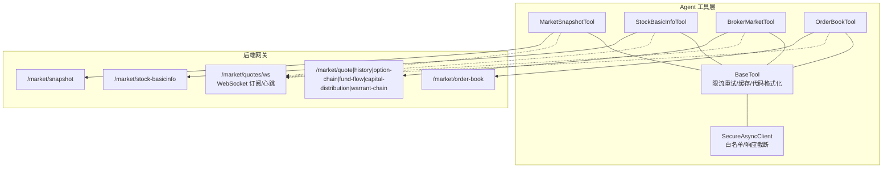
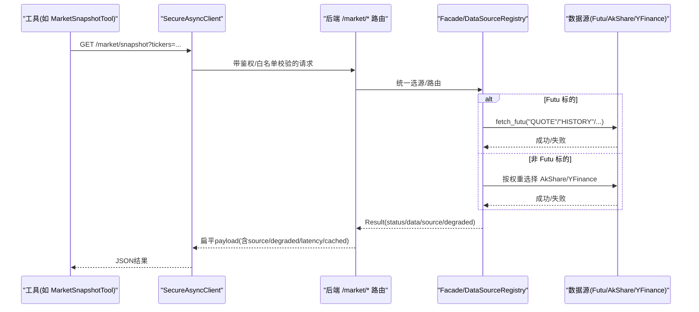
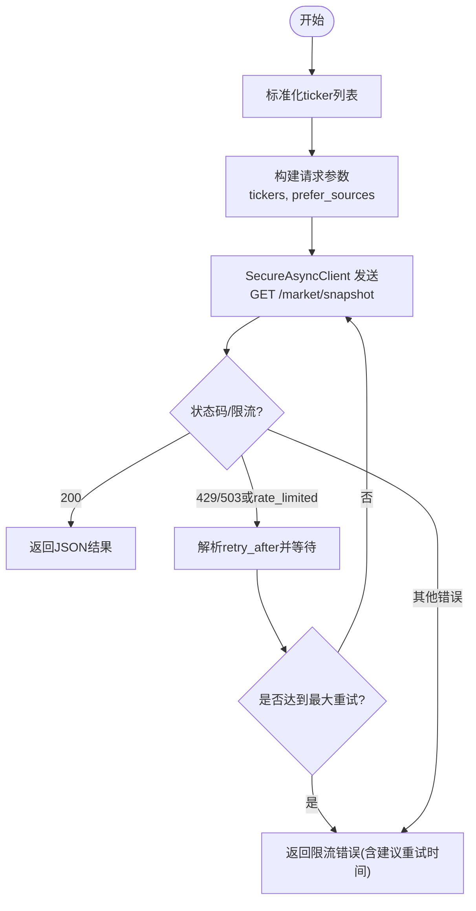
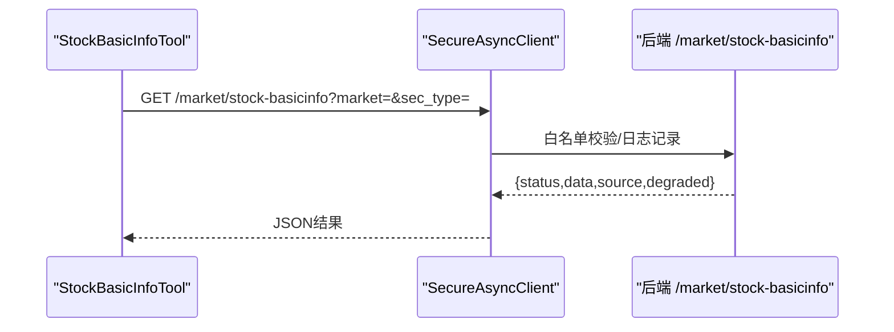
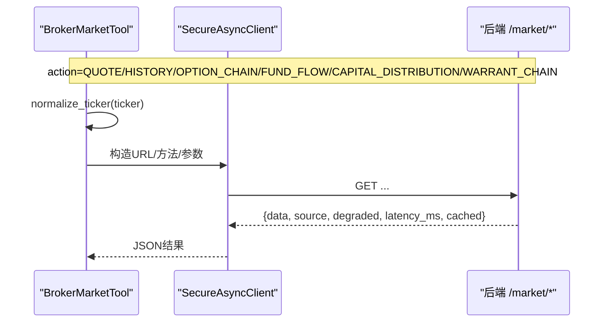
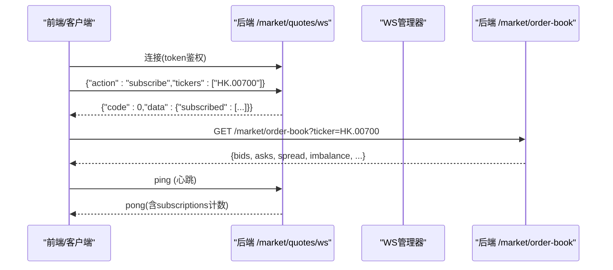
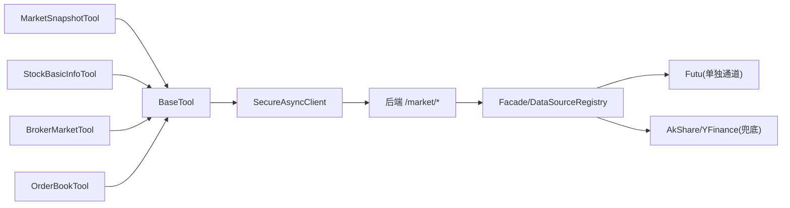

# 市场数据工具

<cite>
**本文引用的文件**
- [market_snapshot_tool.py](file://hermes_agent/tools/market_snapshot_tool.py)
- [stock_basicinfo_tool.py](file://hermes_agent/tools/stock_basicinfo_tool.py)
- [broker_market_tool.py](file://hermes_agent/tools/broker_market_tool.py)
- [order_book_tool.py](file://hermes_agent/tools/order_book_tool.py)
- [base.py](file://hermes_agent/tools/base.py)
- [secure_client.py](file://hermes_agent/tools/secure_client.py)
- [market.py](file://backend/routers/market.py)
- [market_fundamental.py](file://backend/routers/market_fundamental.py)
</cite>

## 目录
1. [简介](#简介)
2. [项目结构](#项目结构)
3. [核心组件](#核心组件)
4. [架构总览](#架构总览)
5. [详细组件分析](#详细组件分析)
6. [依赖关系分析](#依赖关系分析)
7. [性能考量](#性能考量)
8. [故障排查指南](#故障排查指南)
9. [结论](#结论)
10. [附录：调用示例与最佳实践](#附录调用示例与最佳实践)

## 简介
本技术文档面向“市场数据工具”套件，覆盖以下四个工具及其后端支撑能力：
- 市场快照工具（market_snapshot_tool）：批量获取实时行情快照，支持派生统计指标。
- 股票基本信息工具（stock_basicinfo_tool）：拉取全市场基础信息，用于标的检索与校验。
- 券商市场数据工具（broker_market_tool）：统一入口的多维市场数据探针（报价、历史K线、期权链、资金流等）。
- 订单簿工具（order_book_tool）：L2盘口深度数据，支持价差与买卖量比等流动性指标。

文档重点说明：
- WebSocket连接管理与心跳保活
- 数据缓存策略（进程内L1 + Redis L2）
- 异常处理与限流退避
- 多券商适配与数据标准化
- 订单簿深度数据处理与流动性评估
- 调用示例、错误处理、性能优化与最佳实践

## 项目结构
市场数据工具位于 Agent 侧的 hermes_agent/tools 目录，通过安全客户端访问后端 /api/v1/market/* 路由；后端在 backend/routers 中实现具体业务逻辑与数据源聚合。

图表来源
- [market_snapshot_tool.py:9-45](file://hermes_agent/tools/market_snapshot_tool.py#L9-L45)
- [stock_basicinfo_tool.py:9-55](file://hermes_agent/tools/stock_basicinfo_tool.py#L9-L55)
- [broker_market_tool.py:9-68](file://hermes_agent/tools/broker_market_tool.py#L9-L68)
- [order_book_tool.py:9-45](file://hermes_agent/tools/order_book_tool.py#L9-L45)
- [base.py:21-282](file://hermes_agent/tools/base.py#L21-L282)
- [secure_client.py:8-80](file://hermes_agent/tools/secure_client.py#L8-L80)
- [market.py:73-226](file://backend/routers/market.py#L73-L226)

章节来源
- [market_snapshot_tool.py:9-45](file://hermes_agent/tools/market_snapshot_tool.py#L9-L45)
- [stock_basicinfo_tool.py:9-55](file://hermes_agent/tools/stock_basicinfo_tool.py#L9-L55)
- [broker_market_tool.py:9-68](file://hermes_agent/tools/broker_market_tool.py#L9-L68)
- [order_book_tool.py:9-45](file://hermes_agent/tools/order_book_tool.py#L9-L45)
- [base.py:21-282](file://hermes_agent/tools/base.py#L21-L282)
- [secure_client.py:8-80](file://hermes_agent/tools/secure_client.py#L8-L80)
- [market.py:73-226](file://backend/routers/market.py#L73-L226)

## 核心组件
- BaseTool：提供股票代码标准化、限流感知智能重试、双级缓存（进程内存+Redis）、通用请求封装。
- SecureAsyncClient：强制仅能访问内部后端网关，拦截越权直连；对超大响应进行结构化截断，防止LLM上下文溢出。
- 四大工具：分别映射到后端 /market/* 端点，参数规范化后发起HTTP请求，并复用BaseTool的重试与缓存能力。

章节来源
- [base.py:21-282](file://hermes_agent/tools/base.py#L21-L282)
- [secure_client.py:8-80](file://hermes_agent/tools/secure_client.py#L8-L80)
- [market_snapshot_tool.py:9-45](file://hermes_agent/tools/market_snapshot_tool.py#L9-L45)
- [stock_basicinfo_tool.py:9-55](file://hermes_agent/tools/stock_basicinfo_tool.py#L9-L55)
- [broker_market_tool.py:9-68](file://hermes_agent/tools/broker_market_tool.py#L9-L68)
- [order_book_tool.py:9-45](file://hermes_agent/tools/order_book_tool.py#L9-L45)

## 架构总览
Agent 工具通过 SecureAsyncClient 向后端 /api/v1/market/* 发起请求；后端根据 ticker 类型选择数据源（富途单独通道或Facade统一选源），必要时走 DataSourceRouter 与子服务，最终返回扁平化 payload，由中间件统一包信封。

图表来源
- [market.py:342-545](file://backend/routers/market.py#L342-L545)
- [broker_market_tool.py:34-68](file://hermes_agent/tools/broker_market_tool.py#L34-L68)
- [base.py:97-189](file://hermes_agent/tools/base.py#L97-L189)
- [secure_client.py:8-80](file://hermes_agent/tools/secure_client.py#L8-L80)

## 详细组件分析

### 市场快照工具（MarketSnapshotTool）
- 功能：批量获取实时快照（最多400只/批），返回各标的最新价/涨跌幅等，并派生平均涨跌幅与涨跌家数。
- 调用路径：GET /market/snapshot?tickers=...&prefer_sources=...
- 关键机制：
  - 股票代码标准化：通过 BaseTool.normalize_ticker 将自然语言输入转为 Region.Code 格式。
  - 限流重试：BaseTool.rate_limit_aware_request 检测 429/503 或 body 中的 rate_limited 信号，解析 retry_after 并指数退避重试。
  - 安全客户端：SecureAsyncClient 限制仅能访问后端网关，并对大响应做结构化截断。
  - 后端处理：/market/snapshot 经 Facade 统一选源，Futu 标的走 DataSourceRouter.fetch_futu，非 Futu 走 AkShare/YFinance 兜底。

图表来源
- [market_snapshot_tool.py:9-45](file://hermes_agent/tools/market_snapshot_tool.py#L9-L45)
- [base.py:97-189](file://hermes_agent/tools/base.py#L97-L189)
- [market.py:799-800](file://backend/routers/market.py#L799-L800)

章节来源
- [market_snapshot_tool.py:9-45](file://hermes_agent/tools/market_snapshot_tool.py#L9-L45)
- [base.py:97-189](file://hermes_agent/tools/base.py#L97-L189)
- [market.py:342-545](file://backend/routers/market.py#L342-L545)

### 股票基本信息工具（StockBasicInfoTool）
- 功能：获取指定市场与证券类型的全量基础信息（代码/名称/上市日期/每手股数等），用于标的检索与代码映射。
- 调用路径：GET /market/stock-basicinfo?market=HK|US|SG&sec_type=STOCK|ETF|IDX|WARRANT
- 关键机制：
  - 参数校验与标准化：market/sec_type 枚举校验；prefer_sources 可临时指定数据源。
  - 后端处理：该端点由后端路由提供基础信息聚合，供前端与工具使用。

图表来源
- [stock_basicinfo_tool.py:9-55](file://hermes_agent/tools/stock_basicinfo_tool.py#L9-L55)
- [secure_client.py:8-80](file://hermes_agent/tools/secure_client.py#L8-L80)

章节来源
- [stock_basicinfo_tool.py:9-55](file://hermes_agent/tools/stock_basicinfo_tool.py#L9-L55)

### 券商市场数据工具（BrokerMarketTool）
- 功能：统一入口的市场数据探针，支持 QUOTE/HISTORY/OPTION_CHAIN/FUND_FLOW/CAPITAL_DISTRIBUTION/WARRANT_CHAIN。
- 调用路径：根据 action 路由至不同后端端点（/market/quote、/market/history、/market/option-chain、/market/fund-flow、/market/capital-distribution/{ticker}、/market/warrant-chain）。
- 关键机制：
  - 动作分发：action 决定 URL、方法与参数。
  - 代码标准化：normalize_ticker 确保 Region.Code 格式。
  - 限流重试：复用 BaseTool 的智能重试。
  - 后端处理：Futu 标的走 DataSourceRouter.fetch_futu；非 Futu 走 Facade 统一选源。

图表来源
- [broker_market_tool.py:9-68](file://hermes_agent/tools/broker_market_tool.py#L9-L68)
- [market.py:342-757](file://backend/routers/market.py#L342-L757)

章节来源
- [broker_market_tool.py:9-68](file://hermes_agent/tools/broker_market_tool.py#L9-L68)
- [market.py:342-757](file://backend/routers/market.py#L342-L757)

### 订单簿工具（OrderBookTool）
- 功能：获取实时 L2 盘口深度（十档买卖），派生最优买卖价差(spread)与买卖盘量比(imbalance)，用于流动性研判与盘口博弈分析。需先经 Futu 订阅 Quote 推送。
- 调用路径：GET /market/order-book?ticker=...
- 关键机制：
  - 后端处理：/market/order-book 经 Facade 统一选源，返回盘口数据与衍生指标。
  - 订阅前置：WebSocket /market/quotes/ws 支持 subscribe/unsubscribe/ping，心跳超时自动断开。

图表来源
- [order_book_tool.py:9-45](file://hermes_agent/tools/order_book_tool.py#L9-L45)
- [market.py:73-226](file://backend/routers/market.py#L73-L226)
- [market.py:780-796](file://backend/routers/market.py#L780-L796)

章节来源
- [order_book_tool.py:9-45](file://hermes_agent/tools/order_book_tool.py#L9-L45)
- [market.py:73-226](file://backend/routers/market.py#L73-L226)
- [market.py:780-796](file://backend/routers/market.py#L780-L796)

### 概念性总览
- 数据标准化：所有工具均通过 BaseTool.normalize_ticker 将自然语言或混用格式转换为后端强前缀格式（Region.Code），避免歧义。
- 安全边界：SecureAsyncClient 强制仅访问内部网关，防止绕过网关直连外部数据源。
- 限流与容错：BaseTool 提供限流检测与指数退避重试，提升鲁棒性。
- 缓存策略：BaseTool 提供 L1（进程内存）与 L2（Redis）双级缓存，降低重复请求压力。

[本节为概念性内容，不直接分析具体文件]

## 依赖关系分析
- 工具层依赖：
  - BaseTool：限流重试、缓存、代码标准化。
  - SecureAsyncClient：白名单校验、响应体积保护。
- 后端依赖：
  - market.py：统一路由，Futu 单独通道与 Facade 统一选源并存。
  - market_fundamental.py：基本面、新闻、事件等扩展端点（与本主题相关的是基本面合并与新闻降级）。

图表来源
- [base.py:21-282](file://hermes_agent/tools/base.py#L21-L282)
- [secure_client.py:8-80](file://hermes_agent/tools/secure_client.py#L8-L80)
- [market.py:342-757](file://backend/routers/market.py#L342-L757)

章节来源
- [base.py:21-282](file://hermes_agent/tools/base.py#L21-L282)
- [secure_client.py:8-80](file://hermes_agent/tools/secure_client.py#L8-L80)
- [market.py:342-757](file://backend/routers/market.py#L342-L757)

## 性能考量
- 限流退避：BaseTool 对 429/503 或 body 中的 rate_limited 信号进行识别，解析 retry_after 并指数退避重试，避免雪崩。
- 响应截断：SecureAsyncClient 对超过阈值的响应进行结构化截断，防止LLM上下文溢出。
- 缓存命中：BaseTool 的 L1/L2 缓存减少重复请求，提高吞吐。
- WebSocket 心跳：/market/quotes/ws 支持心跳保活与慢客户端背压保护，避免资源泄漏。
- 数据源降级：Futu 失败时回退到 AkShare/YFinance，保证可用性。

[本节为通用性能指导，不直接分析具体文件]

## 故障排查指南
- 限流问题：
  - 现象：返回 status="rate_limited" 或 HTTP 429/503。
  - 处理：BaseTool 已自动重试；若仍失败，查看 retry_after_seconds 并稍后重试。
- 越权访问：
  - 现象：SecureAsyncClient 抛出 PermissionError。
  - 处理：确保仅访问后端网关地址，不要直连外部数据源。
- WebSocket 断开：
  - 现象：长时间无心跳导致断开。
  - 处理：客户端定期发送 ping，保持连接活跃。
- 数据不可用：
  - 现象：后端返回 degraded=true 或 no_data。
  - 处理：检查 prefer_sources 配置与数据源健康状态；必要时切换数据源。

章节来源
- [base.py:97-189](file://hermes_agent/tools/base.py#L97-L189)
- [secure_client.py:25-30](file://hermes_agent/tools/secure_client.py#L25-L30)
- [market.py:73-226](file://backend/routers/market.py#L73-L226)

## 结论
市场数据工具通过统一的 Agent 工具层与安全客户端，结合后端的统一路由与数据源聚合，实现了稳定、可扩展、高可用的市场数据采集与分析能力。其核心优势包括：
- 标准化与解耦：代码格式标准化、数据源解耦、统一返回格式。
- 健壮性：限流退避、响应截断、心跳保活、降级策略。
- 可扩展性：新增数据源只需注册到 Facade/DataSourceRegistry，无需改动上层工具。

[本节为总结性内容，不直接分析具体文件]

## 附录：调用示例与最佳实践

### 获取实时行情（快照）
- 工具：MarketSnapshotTool
- 参数：tickers（逗号分隔，如 HK.00700,US.AAPL）
- 后端端点：GET /market/snapshot
- 预期返回：包含各标的最新价、涨跌幅、成交量等，以及派生的平均涨跌幅与涨跌家数。

章节来源
- [market_snapshot_tool.py:9-45](file://hermes_agent/tools/market_snapshot_tool.py#L9-L45)
- [market.py:799-800](file://backend/routers/market.py#L799-L800)

### 查询股票基本信息
- 工具：StockBasicInfoTool
- 参数：market（HK/US/SG）、sec_type（STOCK/ETF/IDX/WARRANT）
- 后端端点：GET /market/stock-basicinfo
- 预期返回：全市场基础信息（代码/名称/上市日期/每手股数等）。

章节来源
- [stock_basicinfo_tool.py:9-55](file://hermes_agent/tools/stock_basicinfo_tool.py#L9-L55)

### 分析订单簿数据
- 工具：OrderBookTool
- 参数：ticker（如 HK.00700）
- 后端端点：GET /market/order-book
- 预期返回：十档买卖盘口、spread、imbalance 等流动性指标。
- 前置条件：已通过 /market/quotes/ws 订阅 Quote 推送。

章节来源
- [order_book_tool.py:9-45](file://hermes_agent/tools/order_book_tool.py#L9-L45)
- [market.py:73-226](file://backend/routers/market.py#L73-L226)
- [market.py:780-796](file://backend/routers/market.py#L780-L796)

### 最佳实践
- 使用 prefer_sources 临时指定数据源，以应对特定数据源不可用场景。
- 合理设置 timeout，避免长尾请求阻塞。
- 对于高频查询，利用 BaseTool 的缓存能力减少重复请求。
- 监控 WebSocket 心跳，确保实时数据流稳定。
- 关注返回的 degraded 与 source 字段，了解数据来源与质量。

[本节为通用实践指导，不直接分析具体文件]
