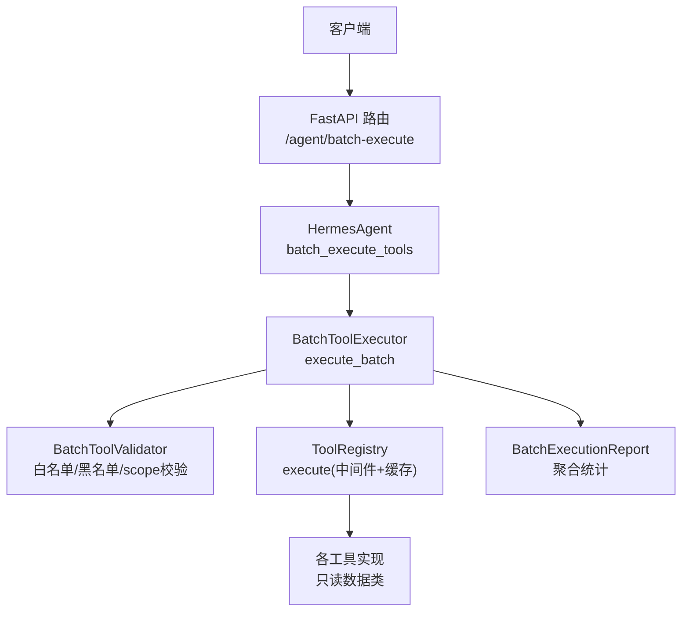
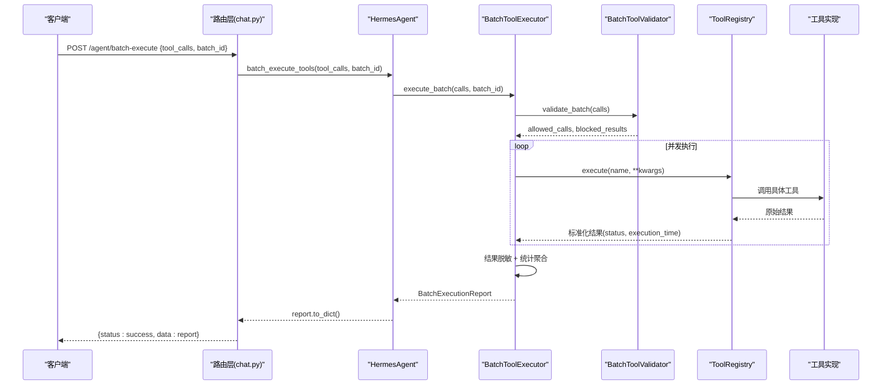
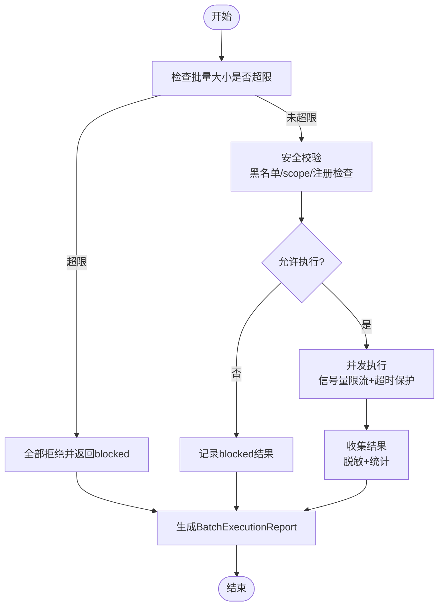
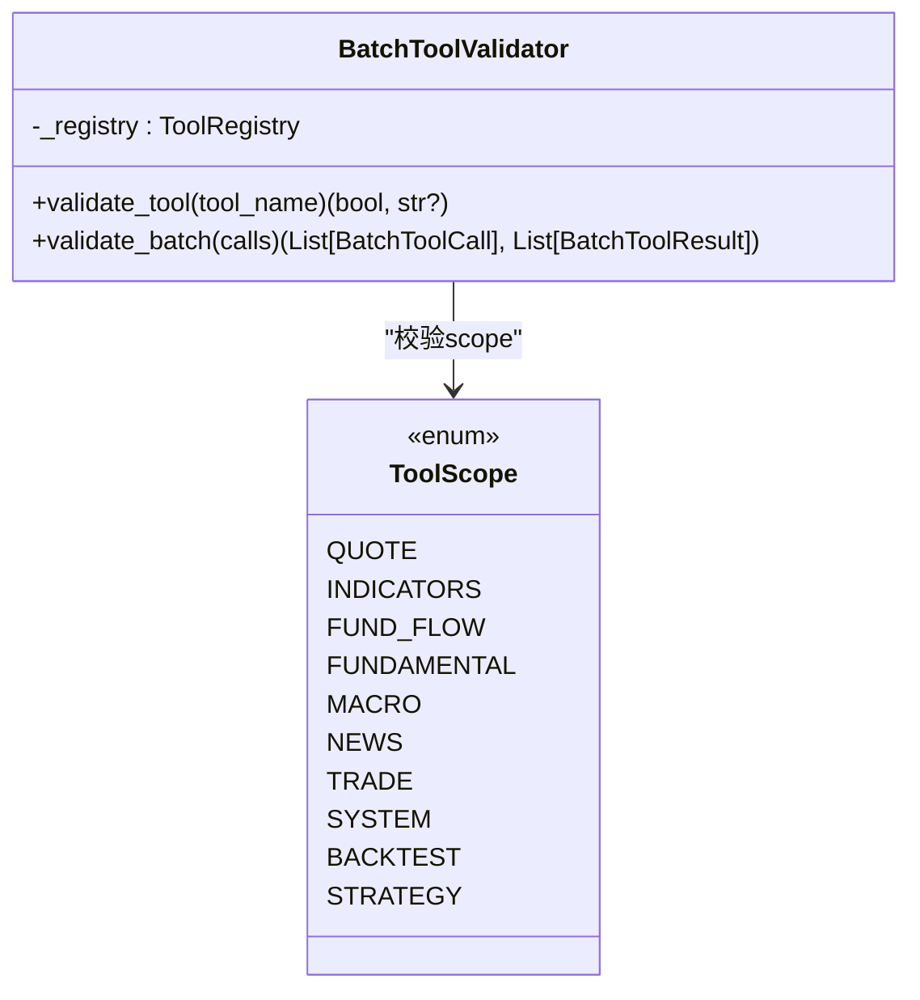
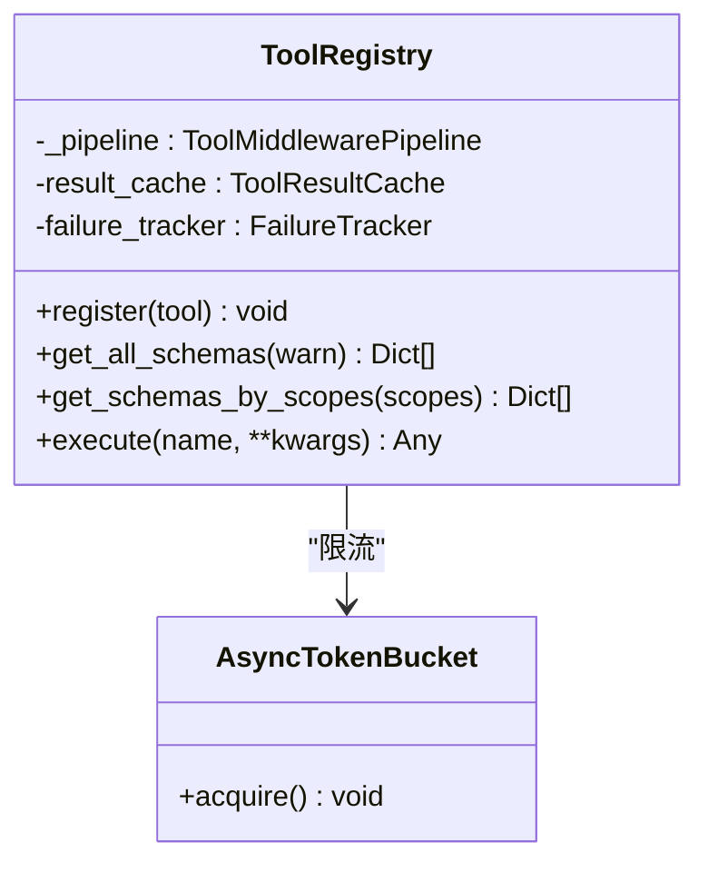
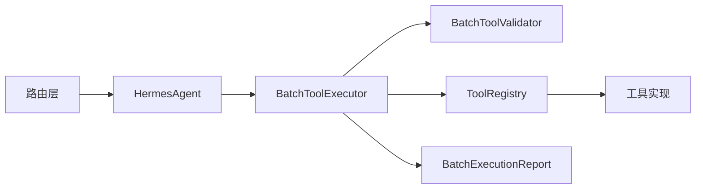

# 批量工具执行RPC系统

<cite>
**本文引用的文件**
- [backend/main.py](file://backend/main.py)
- [backend/routers/chat.py](file://backend/routers/chat.py)
- [hermes_agent/agent.py](file://hermes_agent/agent.py)
- [hermes_agent/relay_tools.py](file://hermes_agent/relay_tools.py)
- [hermes_agent/tool_registry.py](file://hermes_agent/tool_registry.py)
- [backend/tests/test_batch_tool_execution_ag05.py](file://backend/tests/test_batch_tool_execution_ag05.py)
</cite>

## 目录
1. [简介](#简介)
2. [项目结构](#项目结构)
3. [核心组件](#核心组件)
4. [架构总览](#架构总览)
5. [详细组件分析](#详细组件分析)
6. [依赖关系分析](#依赖关系分析)
7. [性能与并发特性](#性能与并发特性)
8. [故障排查指南](#故障排查指南)
9. [结论](#结论)
10. [附录：API定义与使用示例](#附录api定义与使用示例)

## 简介
本系统提供“批量工具执行RPC”能力，将多次带上下文的工具调用压缩为一次批处理执行，避免重复的LLM上下文往返，显著降低token成本并提升吞吐。其核心思想是：客户端通过HTTP API提交一组工具调用请求，服务端在安全白名单约束下并发执行，聚合结果后返回统一报告；整个过程不进入LLM对话上下文，从而获得零上下文成本的批量执行路径。

该能力由后端路由暴露、Hermes Agent桥接、工具注册表与中间件管线、以及严格的安全校验器共同组成，确保只读数据类工具的批量执行安全可控。

## 项目结构
- 入口应用装配：FastAPI 应用工厂集中挂载所有路由与中间件，批量执行接口位于聊天路由中。
- 批量执行入口：HTTP POST /api/v1/agent/batch-expose（见路由文件）接收批量调用请求。
- 执行引擎：BatchToolExecutor 负责并发执行、限流、超时控制与结果聚合。
- 安全校验：BatchToolValidator 基于白名单、黑名单与scope过滤进行三层防护。
- 工具注册与执行：ToolRegistry 统一管理工具注册、schema生成、缓存与中间件管线（熔断、分类、计时）。
- 测试覆盖：针对白名单、黑名单、并发、超时、脱敏等场景的单元测试。

图表来源
- [backend/routers/chat.py:400-444](file://backend/routers/chat.py#L400-L444)
- [hermes_agent/agent.py:233-263](file://hermes_agent/agent.py#L233-L263)
- [hermes_agent/relay_tools.py:274-384](file://hermes_agent/relay_tools.py#L274-L384)
- [hermes_agent/tool_registry.py:192-260](file://hermes_agent/tool_registry.py#L192-L260)

章节来源
- [backend/main.py:125-218](file://backend/main.py#L125-L218)
- [backend/routers/chat.py:400-444](file://backend/routers/chat.py#L400-L444)

## 核心组件
- HTTP路由层：接收批量请求，构造调用列表，委托给HermesAgent执行。
- HermesAgent：提供batch_execute_tools方法，将请求转换为BatchToolCall列表并交由执行器处理。
- BatchToolExecutor：并发执行、限流、超时保护、结果聚合与脱敏。
- BatchToolValidator：三层安全校验（硬编码黑名单、已注册检查、scope白名单），fail-closed原则。
- ToolRegistry：工具注册、schema导出、缓存命中、中间件管线（熔断、分类、计时）、正交状态标记。
- 测试套件：覆盖白名单/黑名单、并发、超时、错误处理、结果脱敏等关键用例。

章节来源
- [backend/routers/chat.py:400-444](file://backend/routers/chat.py#L400-L444)
- [hermes_agent/agent.py:233-263](file://hermes_agent/agent.py#L233-L263)
- [hermes_agent/relay_tools.py:105-167](file://hermes_agent/relay_tools.py#L105-L167)
- [hermes_agent/relay_tools.py:174-267](file://hermes_agent/relay_tools.py#L174-L267)
- [hermes_agent/relay_tools.py:274-384](file://hermes_agent/relay_tools.py#L274-L384)
- [hermes_agent/tool_registry.py:75-95](file://hermes_agent/tool_registry.py#L75-L95)
- [hermes_agent/tool_registry.py:192-260](file://hermes_agent/tool_registry.py#L192-L260)
- [backend/tests/test_batch_tool_execution_ag05.py:1-200](file://backend/tests/test_batch_tool_execution_ag05.py#L1-L200)

## 架构总览
批量工具执行RPC的整体流程如下：
- 客户端发送POST请求到 /agent/batch-execute，携带tool_calls数组与可选batch_id。
- 路由层创建临时ToolRegistry与HermesAgent实例，转换请求为内部格式。
- HermesAgent调用BatchToolExecutor.execute_batch，传入批量调用列表。
- 执行器先进行批量大小限制与安全校验，分离合法与被拒调用。
- 对合法调用并发执行（信号量限流+单调用超时），并通过ToolRegistry.execute走中间件管线（熔断、缓存、分类、计时）。
- 结果经脱敏后聚合为BatchExecutionReport返回。

图表来源
- [backend/routers/chat.py:400-444](file://backend/routers/chat.py#L400-L444)
- [hermes_agent/agent.py:233-263](file://hermes_agent/agent.py#L233-L263)
- [hermes_agent/relay_tools.py:274-384](file://hermes_agent/relay_tools.py#L274-L384)
- [hermes_agent/tool_registry.py:192-260](file://hermes_agent/tool_registry.py#L192-L260)

## 详细组件分析

### HTTP路由层（/agent/batch-execute）
- 职责：接收批量请求，构造内部调用列表，委托HermesAgent执行，统一返回成功或异常。
- 关键点：
  - 仅用于批量执行，不走LLM上下文。
  - 创建临时ToolRegistry与HermesAgent实例，隔离执行环境。
  - 将请求体中的tool_calls转换为字典列表，包含tool_name、arguments、call_id。
  - 捕获异常并返回HTTP 500。

章节来源
- [backend/routers/chat.py:400-444](file://backend/routers/chat.py#L400-L444)

### HermesAgent批量执行入口
- 职责：将外部请求转换为BatchToolCall列表，调用BatchToolExecutor执行，并返回序列化报告。
- 关键点：
  - 不经过LLM推理，直接批量执行。
  - 支持call_id关联结果。
  - 返回report.to_dict()供路由层封装响应。

章节来源
- [hermes_agent/agent.py:233-263](file://hermes_agent/agent.py#L233-L263)

### 批量执行引擎（BatchToolExecutor）
- 职责：并发执行、限流、超时保护、结果聚合与脱敏。
- 关键点：
  - 批量大小上限：MAX_BATCH_SIZE=200。
  - 单调用超时：SINGLE_CALL_TIMEOUT=30s。
  - 最大并发：MAX_CONCURRENCY=20（信号量控制）。
  - 安全校验：通过BatchToolValidator进行三层防护。
  - 结果脱敏：集成AGENT-10 redact_obj。
  - 统计聚合：successful/failed/blocked/timed_out及耗时统计。

图表来源
- [hermes_agent/relay_tools.py:300-384](file://hermes_agent/relay_tools.py#L300-L384)
- [hermes_agent/relay_tools.py:386-451](file://hermes_agent/relay_tools.py#L386-L451)

章节来源
- [hermes_agent/relay_tools.py:87-98](file://hermes_agent/relay_tools.py#L87-L98)
- [hermes_agent/relay_tools.py:105-167](file://hermes_agent/relay_tools.py#L105-L167)
- [hermes_agent/relay_tools.py:274-384](file://hermes_agent/relay_tools.py#L274-L384)
- [hermes_agent/relay_tools.py:386-451](file://hermes_agent/relay_tools.py#L386-L451)

### 安全校验器（BatchToolValidator）
- 职责：三层防护确保批量执行安全。
- 关键点：
  - 硬编码黑名单：禁止写操作、交易类、计算密集工具。
  - 已注册检查：未知工具拒绝（fail-closed）。
  - scope白名单：仅允许只读数据类（quote/indicators/fund_flow/fundamental/macro/news）。
  - 明确禁止scope：trade/system/backtest/strategy。

图表来源
- [hermes_agent/relay_tools.py:174-267](file://hermes_agent/relay_tools.py#L174-L267)

章节来源
- [hermes_agent/relay_tools.py:45-81](file://hermes_agent/relay_tools.py#L45-L81)
- [hermes_agent/relay_tools.py:174-267](file://hermes_agent/relay_tools.py#L174-L267)

### 工具注册与执行（ToolRegistry）
- 职责：工具注册、schema生成、缓存、中间件管线、正交状态标记。
- 关键点：
  - 延迟加载工具模块，自动注册带装饰器的工具。
  - get_schemas_by_scopes按scope过滤工具schema。
  - execute走中间件管线（熔断→分类→计时→核心执行）。
  - 结果缓存：仅缓存成功结果，避免缓存错误/限流。
  - 失败追踪：记录失败次数，触发熔断。
  - 正交状态：success/empty/stale/rate_limited/error/circuit_breaker。

图表来源
- [hermes_agent/tool_registry.py:75-95](file://hermes_agent/tool_registry.py#L75-L95)
- [hermes_agent/tool_registry.py:103-168](file://hermes_agent/tool_registry.py#L103-L168)
- [hermes_agent/tool_registry.py:192-260](file://hermes_agent/tool_registry.py#L192-L260)

章节来源
- [hermes_agent/tool_registry.py:17-40](file://hermes_agent/tool_registry.py#L17-L40)
- [hermes_agent/tool_registry.py:75-95](file://hermes_agent/tool_registry.py#L75-L95)
- [hermes_agent/tool_registry.py:192-260](file://hermes_agent/tool_registry.py#L192-L260)

### 测试覆盖
- 白名单验证：只读数据工具通过，交易/系统工具被拒。
- 黑名单验证：硬编码黑名单工具即使scope合法也被拒绝。
- 并发与超时：信号量限流与单调用超时保护。
- 结果脱敏：敏感信息在返回前被清洗。
- 边界条件：批量大小超限、未知工具、无scope工具等。

章节来源
- [backend/tests/test_batch_tool_execution_ag05.py:1-200](file://backend/tests/test_batch_tool_execution_ag05.py#L1-L200)

## 依赖关系分析
- 路由层依赖HermesAgent与ToolRegistry，后者依赖工具实现与中间件管线。
- 执行器依赖校验器与注册表，形成“校验→执行→聚合”的单向依赖链。
- 工具实现通过注册表暴露，受中间件管线保护（熔断、缓存、计时）。
- 测试套件模拟工具与注册表，验证安全策略与执行逻辑。

图表来源
- [backend/routers/chat.py:400-444](file://backend/routers/chat.py#L400-L444)
- [hermes_agent/agent.py:233-263](file://hermes_agent/agent.py#L233-L263)
- [hermes_agent/relay_tools.py:274-384](file://hermes_agent/relay_tools.py#L274-L384)
- [hermes_agent/tool_registry.py:192-260](file://hermes_agent/tool_registry.py#L192-L260)

章节来源
- [backend/main.py:125-218](file://backend/main.py#L125-L218)
- [backend/routers/chat.py:400-444](file://backend/routers/chat.py#L400-L444)
- [hermes_agent/relay_tools.py:274-384](file://hermes_agent/relay_tools.py#L274-L384)
- [hermes_agent/tool_registry.py:192-260](file://hermes_agent/tool_registry.py#L192-L260)

## 性能与并发特性
- 批量大小限制：单次最多200个工具调用，防止资源耗尽。
- 并发控制：最大并发20，通过信号量限制同时执行的工具数量。
- 超时保护：单个工具调用超时30秒，整体批量请求超时120秒（可通过配置调整）。
- 缓存命中：ToolRegistry对成功结果进行缓存，减少重复计算。
- 熔断机制：连续失败触发熔断，避免雪崩效应。
- 结果脱敏：敏感信息在返回前被清洗，保障数据安全。

## 故障排查指南
- 批量大小超限：检查tool_calls数量是否超过200。
- 工具被拒绝：确认工具是否在白名单内，且未被黑名单拦截。
- 执行超时：检查工具实现是否响应及时，必要时调整超时参数。
- 熔断触发：查看工具失败次数，修复底层问题后等待恢复。
- 结果脱敏：若发现敏感信息泄露，检查redact_obj是否正确集成。

章节来源
- [hermes_agent/relay_tools.py:87-98](file://hermes_agent/relay_tools.py#L87-L98)
- [hermes_agent/relay_tools.py:174-267](file://hermes_agent/relay_tools.py#L174-L267)
- [hermes_agent/tool_registry.py:192-260](file://hermes_agent/tool_registry.py#L192-L260)

## 结论
批量工具执行RPC系统通过安全白名单、并发控制、超时保护与结果脱敏，实现了高效、安全的只读数据工具批量执行。其设计将多次LLM上下文往返压缩为一次批处理，显著降低成本并提升吞吐。未来可进一步扩展工具范围、优化并发策略与增强监控指标。

## 附录：API定义与使用示例
- 端点：POST /api/v1/agent/batch-execute
- 请求体：
  - tool_calls: 数组，每项包含tool_name、arguments、call_id（可选）
  - batch_id: 字符串，批次标识（可选，默认"default"）
- 响应体：
  - status: "success"
  - data: BatchExecutionReport，包含summary、timing、results

章节来源
- [backend/routers/chat.py:400-444](file://backend/routers/chat.py#L400-L444)
- [hermes_agent/relay_tools.py:126-167](file://hermes_agent/relay_tools.py#L126-L167)
