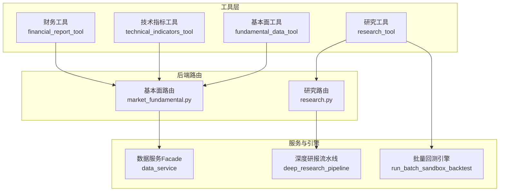
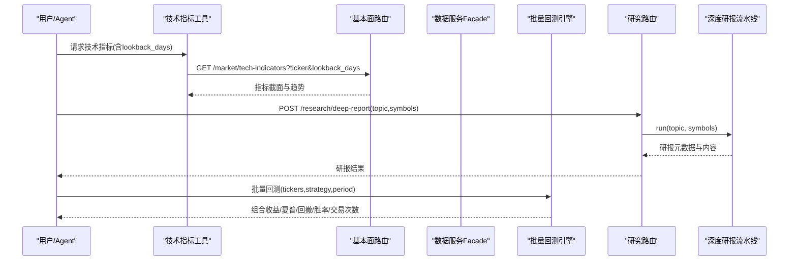
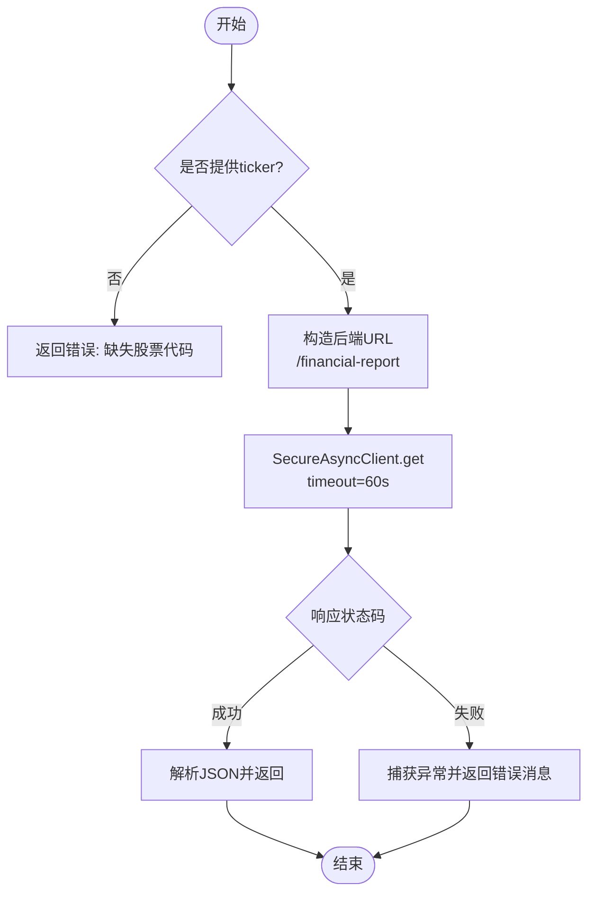
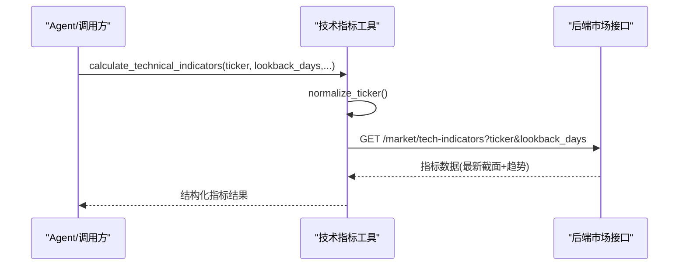
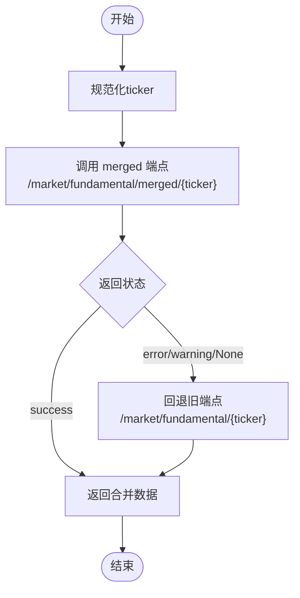
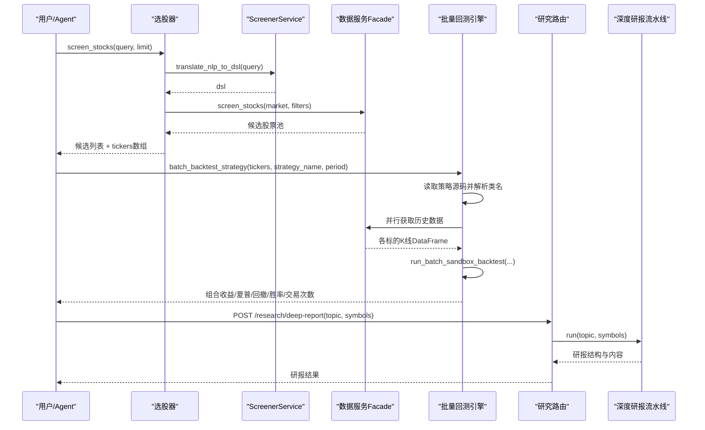
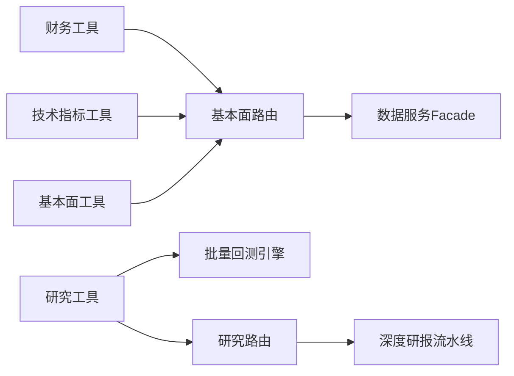

# 数据分析工具

<cite>
**本文引用的文件**
- [financial_report_tool.py](file://hermes_agent/tools/financial_report_tool.py)
- [technical_indicators_tool.py](file://hermes_agent/tools/technical_indicators_tool.py)
- [fundamental_data_tool.py](file://hermes_agent/tools/fundamental_data_tool.py)
- [research_tool.py](file://hermes_agent/tools/research_tool.py)
- [market_fundamental.py](file://backend/routers/market_fundamental.py)
- [research.py](file://backend/routers/research.py)
</cite>

## 目录
1. [简介](#简介)
2. [项目结构](#项目结构)
3. [核心组件](#核心组件)
4. [架构总览](#架构总览)
5. [详细组件分析](#详细组件分析)
6. [依赖关系分析](#依赖关系分析)
7. [性能考虑](#性能考虑)
8. [故障排查指南](#故障排查指南)
9. [结论](#结论)
10. [附录](#附录)

## 简介
本技术文档面向数据分析工具链，围绕以下四大能力展开：
- 财务报告工具（financial_report_tool）：扫描并解析本地财报与研报文件，支持分块读取，便于大模型进行深度财务与战略分析。
- 技术指标工具（technical_indicators_tool）：拉取历史K线并进行矩阵级指标计算，返回最新截面特征与可选趋势窗口，内置趋势评分、动态止损止盈等交易辅助参数。
- 基本面数据工具（fundamental_data_tool）：聚合多源基本面数据（估值、成长、质量），提供合并端点与降级回退机制，用于估值泡沫与空头拥挤度预警。
- 研究工具（research_tool）：自然语言选股、批量横截面回测、深度研报生成，形成“数据收集—分析建模—报告输出”的闭环。

文档同时给出数据质量控制、性能优化与结果可视化的最佳实践建议，帮助使用者高效完成财务分析、技术面研究与基本面评估。

## 项目结构
从工具到后端服务的关键路径如下：
- 工具层（hermes_agent/tools）：封装对外暴露的工具接口，负责参数校验、限流重试、统一调用后端API。
- 路由层（backend/routers）：提供市场数据、基本面、研究等HTTP端点，实现数据聚合、缓存、降级与标准化响应。
- 业务服务（backend/services）：通过Facade模式统一选源（如Futu/FMP/YFinance），执行并发抓取与合并。
- 回测与研究（backend/backtest, backend/app/research）：提供批量回测引擎与深度研报流水线。

**图表来源**
- [financial_report_tool.py:9-41](file://hermes_agent/tools/financial_report_tool.py#L9-L41)
- [technical_indicators_tool.py:11-86](file://hermes_agent/tools/technical_indicators_tool.py#L11-L86)
- [fundamental_data_tool.py:9-38](file://hermes_agent/tools/fundamental_data_tool.py#L9-L38)
- [research_tool.py:20-138](file://hermes_agent/tools/research_tool.py#L20-L138)
- [market_fundamental.py:445-572](file://backend/routers/market_fundamental.py#L445-L572)
- [research.py:25-51](file://backend/routers/research.py#L25-L51)

**章节来源**
- [financial_report_tool.py:9-41](file://hermes_agent/tools/financial_report_tool.py#L9-L41)
- [technical_indicators_tool.py:11-86](file://hermes_agent/tools/technical_indicators_tool.py#L11-L86)
- [fundamental_data_tool.py:9-38](file://hermes_agent/tools/fundamental_data_tool.py#L9-L38)
- [research_tool.py:20-138](file://hermes_agent/tools/research_tool.py#L20-L138)
- [market_fundamental.py:445-572](file://backend/routers/market_fundamental.py#L445-L572)
- [research.py:25-51](file://backend/routers/research.py#L25-L51)

## 核心组件
- 财务报告工具：以ticker为键匹配本地财报/研报文件，支持chunk_index分块读取；通过SecureAsyncClient调用后端财务报表面板接口，返回结构化内容供大模型分析。
- 技术指标工具：对指定ticker进行历史K线拉取与指标计算，支持MA、RSI、MACD、KDJ、ATR、布林带等；返回最新截面与lookback_days趋势；内置rate_limit_aware_request限流感知重试。
- 基本面数据工具：优先调用三源合并端点（Futu+FMP+YFinance），失败时自动回退旧单源端点；返回估值、成长、质量等多维指标。
- 研究工具：包含选股器与批量回测器。选股器将自然语言转为DSL，经Facade筛选标的；批量回测器加载策略草稿，并行获取历史数据并执行组合回测，输出收益、夏普、回撤等指标。

**章节来源**
- [financial_report_tool.py:9-41](file://hermes_agent/tools/financial_report_tool.py#L9-L41)
- [technical_indicators_tool.py:11-86](file://hermes_agent/tools/technical_indicators_tool.py#L11-L86)
- [fundamental_data_tool.py:9-38](file://hermes_agent/tools/fundamental_data_tool.py#L9-L38)
- [research_tool.py:20-138](file://hermes_agent/tools/research_tool.py#L20-L138)

## 架构总览
工具层通过统一客户端访问后端路由，路由层负责数据聚合、缓存、降级与标准化响应。研究工具进一步串联选股、回测与研报生成。

**图表来源**
- [technical_indicators_tool.py:57-86](file://hermes_agent/tools/technical_indicators_tool.py#L57-L86)
- [market_fundamental.py:445-572](file://backend/routers/market_fundamental.py#L445-L572)
- [research_tool.py:94-138](file://hermes_agent/tools/research_tool.py#L94-L138)
- [research.py:38-51](file://backend/routers/research.py#L38-L51)

## 详细组件分析

### 财务报告工具（FinancialReportTool）
- 功能要点
  - 输入校验：必须提供ticker，否则返回错误信息。
  - 分块读取：支持chunk_index，便于处理长文档。
  - 后端调用：通过SecureAsyncClient访问后端财务报表面板接口，超时控制合理。
- 数据处理流程
  - 参数校验 → 构造URL → 发起GET请求 → 解析JSON → 返回结构化内容或错误。

**图表来源**
- [financial_report_tool.py:29-41](file://hermes_agent/tools/financial_report_tool.py#L29-L41)

**章节来源**
- [financial_report_tool.py:9-41](file://hermes_agent/tools/financial_report_tool.py#L9-L41)

### 技术指标工具（TechnicalIndicatorsTool）
- 功能要点
  - 指标覆盖：MA、RSI、MACD、KDJ、ATR、布林带；支持自定义周期与标准差倍数。
  - 趋势与风控：内置trend_score（多空趋势评分），ATR动态止损/止盈乘数。
  - 批量优化：支持lookback_days返回多日趋势；使用rate_limit_aware_request进行限流感知重试。
- 调用流程
  - 参数校验与ticker规范化 → 构造URL → 限流感知请求 → 返回指标截面与趋势。

**图表来源**
- [technical_indicators_tool.py:57-86](file://hermes_agent/tools/technical_indicators_tool.py#L57-L86)

**章节来源**
- [technical_indicators_tool.py:11-86](file://hermes_agent/tools/technical_indicators_tool.py#L11-L86)

### 基本面数据工具（FundamentalDataTool）
- 功能要点
  - 三源合并：优先调用merged端点（Futu+FMP+YFinance），失败时回退旧端点。
  - 指标维度：估值（PE、PB、PEG）、成长（ROE等）、质量（Short Ratio等）。
  - 健壮性：限流感知请求，兼容未部署节点。
- 调用流程
  - ticker规范化 → 尝试merged端点 → 若失败则回退旧端点 → 返回合并后的基本面数据。

**图表来源**
- [fundamental_data_tool.py:23-38](file://hermes_agent/tools/fundamental_data_tool.py#L23-L38)
- [market_fundamental.py:555-572](file://backend/routers/market_fundamental.py#L555-L572)

**章节来源**
- [fundamental_data_tool.py:9-38](file://hermes_agent/tools/fundamental_data_tool.py#L9-L38)
- [market_fundamental.py:445-572](file://backend/routers/market_fundamental.py#L445-L572)

### 研究工具（ResearchTool）
- 选股器（ScreenerTool）
  - 自然语言转DSL → 解析为Futu过滤器 → 经Facade跨市场并行筛选 → 应用技术形态过滤 → 输出候选股票池。
- 批量回测器（BatchBacktestTool）
  - 读取策略草稿源码 → 提取类名 → 并行获取历史数据 → 调用批量回测引擎 → 汇总组合指标。
- 深度研报（后端路由）
  - 接收topic与symbols → 触发深度研报流水线 → 返回摘要、发现、分析与图表配置。

**图表来源**
- [research_tool.py:32-70](file://hermes_agent/tools/research_tool.py#L32-L70)
- [research_tool.py:94-138](file://hermes_agent/tools/research_tool.py#L94-L138)
- [research.py:38-51](file://backend/routers/research.py#L38-L51)

**章节来源**
- [research_tool.py:20-138](file://hermes_agent/tools/research_tool.py#L20-L138)
- [research.py:25-51](file://backend/routers/research.py#L25-L51)

## 依赖关系分析
- 工具层依赖
  - BaseTool与工具注册表：统一工具生命周期与注册机制。
  - SecureAsyncClient：异步HTTP客户端，支持超时与限流感知。
- 后端路由依赖
  - data_service：Facade统一选源（Futu/FMP/YFinance），提供基本面、新闻、事件、持仓等能力。
  - screener_service：自然语言转DSL、解析为过滤器、应用技术形态过滤。
  - backtest模块：批量回测引擎，提供组合绩效指标。
  - deep_research_pipeline：深度研报流水线，产出结构化研报。

**图表来源**
- [financial_report_tool.py:9-41](file://hermes_agent/tools/financial_report_tool.py#L9-L41)
- [technical_indicators_tool.py:11-86](file://hermes_agent/tools/technical_indicators_tool.py#L11-L86)
- [fundamental_data_tool.py:9-38](file://hermes_agent/tools/fundamental_data_tool.py#L9-L38)
- [research_tool.py:20-138](file://hermes_agent/tools/research_tool.py#L20-L138)
- [market_fundamental.py:445-572](file://backend/routers/market_fundamental.py#L445-L572)
- [research.py:25-51](file://backend/routers/research.py#L25-L51)

**章节来源**
- [research_tool.py:20-138](file://hermes_agent/tools/research_tool.py#L20-L138)
- [market_fundamental.py:445-572](file://backend/routers/market_fundamental.py#L445-L572)
- [research.py:25-51](file://backend/routers/research.py#L25-L51)

## 性能考虑
- 限流与重试
  - 技术指标工具与基本面工具均使用rate_limit_aware_request，避免触发外部源速率限制。
- 并发与并行
  - 研究工具的选股器与批量回测器采用asyncio.gather并行获取数据，提升吞吐。
- 缓存与降级
  - 基本面路由对新闻等热点数据使用Redis缓存与细粒度锁，防止缓存击穿；三源合并端点支持优雅降级。
- 超时控制
  - 工具层设置合理的超时时间（如60s、30s、20s），保障稳定性。
- 数据裁剪
  - 技术指标工具默认仅返回最新截面，必要时通过lookback_days扩展趋势窗口，减少传输与计算开销。

[本节为通用性能指导，不直接分析具体文件]

## 故障排查指南
- 常见错误与定位
  - 缺少必要参数：工具在入口处校验ticker等必填字段，返回明确错误消息。
  - 网络异常与超时：SecureAsyncClient捕获异常并返回错误描述，检查后端地址与网络连通性。
  - 数据不可用：基本面路由在真实源与兜底均失败时返回no_data或warning，提示改用其他工具或检查数据源配置。
- 日志与可观测性
  - 路由层打印关键警告与异常信息，便于快速定位问题。
  - 可通过后端健康检查与监控面板观察服务状态。
- 回退与容错
  - 基本面工具在merged端点失败时自动回退旧端点；新闻接口在真实源不可用时回退Yahoo兜底。

**章节来源**
- [technical_indicators_tool.py:71-86](file://hermes_agent/tools/technical_indicators_tool.py#L71-L86)
- [fundamental_data_tool.py:23-38](file://hermes_agent/tools/fundamental_data_tool.py#L23-L38)
- [market_fundamental.py:237-356](file://backend/routers/market_fundamental.py#L237-L356)

## 结论
该数据分析工具链以“工具—路由—服务—引擎”的分层架构，实现了财务报告解析、技术指标计算、基本面数据聚合与研究框架的完整闭环。通过限流感知、并发并行、缓存降级与超时控制，系统在稳定性与性能上具备良好表现。建议在实际使用中结合可视化与质量监控，持续优化数据源与计算管线。

[本节为总结性内容，不直接分析具体文件]

## 附录
- 使用示例（概念性说明）
  - 财务分析：调用财务报告工具，传入ticker与chunk_index，获取分块财报内容，配合大模型进行利润表、资产负债表、现金流量表的结构化解读。
  - 技术面研究：调用技术指标工具，设置ma_periods、rsi_period、include_macd、atr_period、bbands_period等参数，获取最新截面与趋势，结合trend_score与ATR止损止盈进行信号判断。
  - 基本面评估：调用基本面工具，获取合并后的估值、成长、质量指标，识别估值泡沫与空头拥挤风险。
  - 研究闭环：使用研究工具的选股器进行自然语言选股，随后对候选池执行批量回测，最后触发深度研报生成，输出投研建议与评级。
- 数据质量控制
  - 输入净化：路由层对ticker进行正则净化，防止注入与脏Key。
  - 零幻觉红线：真实源返回空数组视为无数据，严禁返回模拟假数据。
- 结果可视化
  - 研报流水线返回chart_configs，前端可据此渲染图表；技术指标工具返回的趋势数据可用于K线图叠加与信号标注。

[本节为概念性内容，不直接分析具体文件]