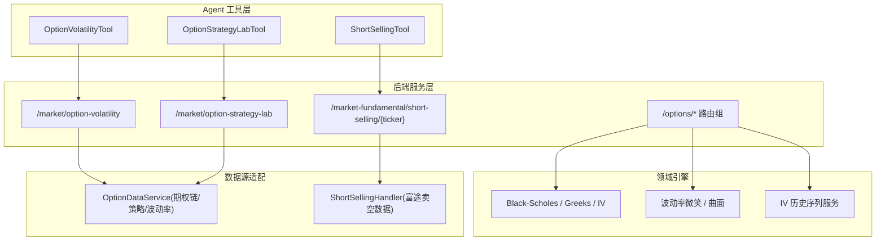
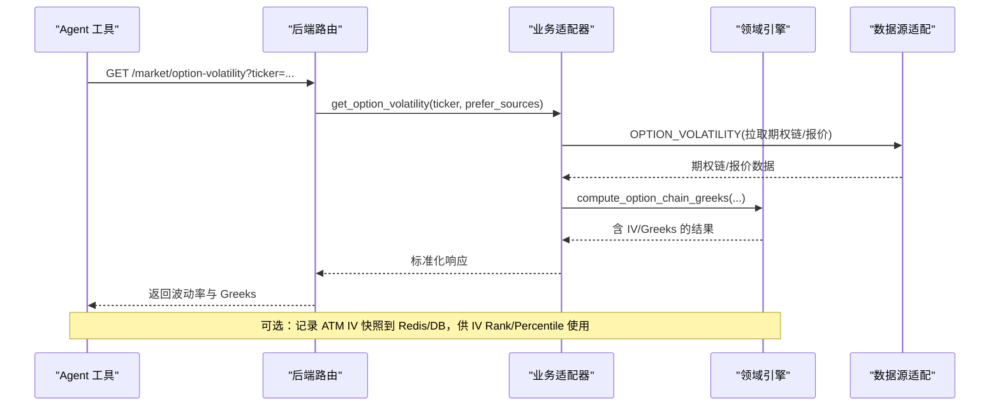
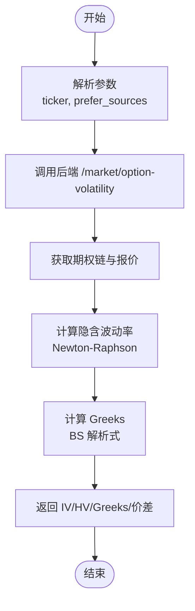
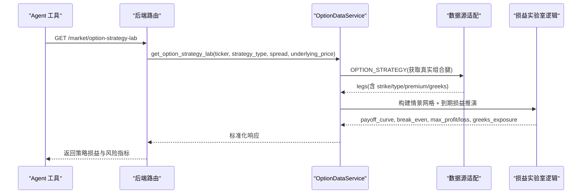
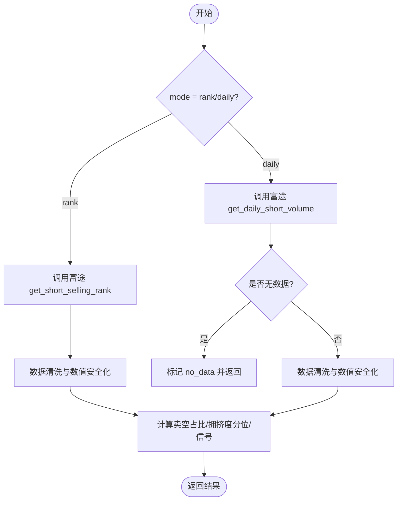
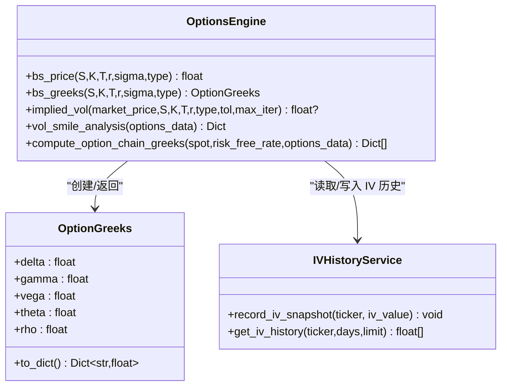
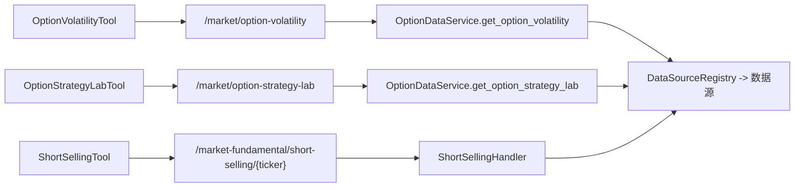

# 期权衍生品工具

<cite>
**本文引用的文件**
- [option_volatility_tool.py](file://hermes_agent/tools/option_volatility_tool.py)
- [option_strategy_lab_tool.py](file://hermes_agent/tools/option_strategy_lab_tool.py)
- [short_selling_tool.py](file://hermes_agent/tools/short_selling_tool.py)
- [options.py](file://backend/routers/options.py)
- [options_engine.py](file://backend/domain/options_engine.py)
- [iv_history_service.py](file://backend/app/iv_history_service.py)
- [option.py](file://backend/services/datasource/business/option.py)
- [short_selling_handler.py](file://data_subservice/futu_src/short_selling_handler.py)
</cite>

## 目录
1. [简介](#简介)
2. [项目结构](#项目结构)
3. [核心组件](#核心组件)
4. [架构总览](#架构总览)
5. [详细组件分析](#详细组件分析)
6. [依赖关系分析](#依赖关系分析)
7. [性能考虑](#性能考虑)
8. [故障排查指南](#故障排查指南)
9. [结论](#结论)
10. [附录：示例与最佳实践](#附录示例与最佳实践)

## 简介
本技术文档围绕三类期权与卖空相关工具展开：期权波动率工具（option_volatility_tool）、期权策略实验室工具（option_strategy_lab_tool）以及卖空工具（short_selling_tool）。文档从系统架构、数据流、算法实现、风险指标计算、数据质量与合规性等方面，提供端到端的技术说明与实操指引。重点覆盖：
- 隐含波动率（IV）计算与历史序列管理
- 波动率曲面构建与微笑分析
- 历史波动率统计与 IV Rank/Percentile
- 期权策略组合的到期损益曲线、盈亏平衡点、最大盈亏与 Greeks 敞口
- 港股卖空拥挤度监控、可借券查询与成本估算
- 风险管理：希腊字母、压力测试、止损设置
- 数据质量保证、性能优化与合规要求

## 项目结构
后端通过 FastAPI 路由暴露期权能力，领域引擎负责定价与波动率分析，业务适配器聚合数据源，Agent 层工具封装为统一 API 调用入口；数据子服务对接富途等外部数据源，提供卖空数据与期权链数据。

**图表来源**
- [option_volatility_tool.py:9-48](file://hermes_agent/tools/option_volatility_tool.py#L9-L48)
- [option_strategy_lab_tool.py:9-67](file://hermes_agent/tools/option_strategy_lab_tool.py#L9-L67)
- [short_selling_tool.py:9-57](file://hermes_agent/tools/short_selling_tool.py#L9-L57)
- [options.py:41-253](file://backend/routers/options.py#L41-L253)
- [options_engine.py:57-413](file://backend/domain/options_engine.py#L57-L413)
- [iv_history_service.py:30-96](file://backend/app/iv_history_service.py#L30-L96)
- [option.py:18-236](file://backend/services/datasource/business/option.py#L18-L236)
- [short_selling_handler.py:46-257](file://data_subservice/futu_src/short_selling_handler.py#L46-L257)

**章节来源**
- [option_volatility_tool.py:9-48](file://hermes_agent/tools/option_volatility_tool.py#L9-L48)
- [option_strategy_lab_tool.py:9-67](file://hermes_agent/tools/option_strategy_lab_tool.py#L9-L67)
- [short_selling_tool.py:9-57](file://hermes_agent/tools/short_selling_tool.py#L9-L57)
- [options.py:41-253](file://backend/routers/options.py#L41-L253)
- [options_engine.py:57-413](file://backend/domain/options_engine.py#L57-L413)
- [iv_history_service.py:30-96](file://backend/app/iv_history_service.py#L30-L96)
- [option.py:18-236](file://backend/services/datasource/business/option.py#L18-L236)
- [short_selling_handler.py:46-257](file://data_subservice/futu_src/short_selling_handler.py#L46-L257)

## 核心组件
- 期权波动率工具：面向单合约（OCC 格式），返回 IV、HV、Greeks 与理论/市场价差，用于波动率曲面分析与期现套利研判。
- 期权策略实验室工具：基于真实期权策略组合，构建到期损益曲线、盈亏平衡点、最大盈亏与 Greeks 敞口，支持策略类型、价差档位与情景网格中心价。
- 卖空工具：聚合富途卖空榜与每日卖空量，结合监管交叉验证，输出卖空成交占比、拥挤度分位与挤空/崩塌信号。

**章节来源**
- [option_volatility_tool.py:9-48](file://hermes_agent/tools/option_volatility_tool.py#L9-L48)
- [option_strategy_lab_tool.py:9-67](file://hermes_agent/tools/option_strategy_lab_tool.py#L9-L67)
- [short_selling_tool.py:9-57](file://hermes_agent/tools/short_selling_tool.py#L9-L57)

## 架构总览
后端期权能力由路由层、领域引擎与数据源适配三层构成：
- 路由层：提供 /options/* 系列接口（Greeks、筛选、微笑、IV Rank、矩阵）与 /market/* 工具接口。
- 领域引擎：实现 Black-Scholes 定价、Greeks、隐含波动率反解、波动率微笑与曲面、IV Rank/Percentile。
- 数据源适配：OptionDataService 聚合期权链与策略数据；ShortSellingHandler 对接富途卖空数据。

**图表来源**
- [option_volatility_tool.py:41-48](file://hermes_agent/tools/option_volatility_tool.py#L41-L48)
- [options.py:41-84](file://backend/routers/options.py#L41-L84)
- [option.py:58-70](file://backend/services/datasource/business/option.py#L58-L70)
- [options_engine.py:333-413](file://backend/domain/options_engine.py#L333-L413)
- [iv_history_service.py:30-96](file://backend/app/iv_history_service.py#L30-L96)

## 详细组件分析

### 期权波动率工具（OptionVolatilityTool）
- 功能：输入 OCC 期权代码，返回 IV、HV、Greeks（Delta/Gamma/Theta/Vega/Rho）与买卖盘理论价差。
- 数据流：工具调用后端 /market/option-volatility，经 OptionDataService 派发至数据源获取期权链与报价，再由领域引擎批量计算 IV 与 Greeks。
- 关键算法：
  - 隐含波动率：Newton-Raphson 迭代反解 BS 模型价格。
  - Greeks：按 BS 解析式计算 Delta/Gamma/Vega/Theta/Rho。
  - 历史波动率：可通过 HV 指标或历史收益率标准差（由上游数据源提供）获得。
- 风险指标：Greeks 用于敏感度分析与对冲参考。

**图表来源**
- [option_volatility_tool.py:41-48](file://hermes_agent/tools/option_volatility_tool.py#L41-L48)
- [options_engine.py:140-197](file://backend/domain/options_engine.py#L140-L197)
- [options_engine.py:98-134](file://backend/domain/options_engine.py#L98-L134)

**章节来源**
- [option_volatility_tool.py:9-48](file://hermes_agent/tools/option_volatility_tool.py#L9-L48)
- [options_engine.py:98-197](file://backend/domain/options_engine.py#L98-L197)

### 期权策略实验室工具（OptionStrategyLabTool）
- 功能：给定正股/ETF/指数与策略类型（如 STRANGLE），返回真实组合腿的到期损益曲线、盈亏平衡点、最大盈亏与 Greeks 敞口。
- 数据流：工具调用 /market/option-strategy-lab，经 OptionDataService 获取真实策略组合（OPTION_STRATEGY），对组合腿进行纯代数损益推演。
- 算法要点：
  - 损益曲线：到期日纯代数推演（Σ每腿内在价值 − 真实权利金），非 BS 近似。
  - 盈亏平衡点：PnL 穿越零点的插值定位。
  - Greeks 敞口：各腿真实 Greeks 求和，缺失字段不补零。
- 风险控制：严格校验行权价/权利金/类型，缺失则不可用并给出 note。

**图表来源**
- [option_strategy_lab_tool.py:51-67](file://hermes_agent/tools/option_strategy_lab_tool.py#L51-L67)
- [option.py:72-226](file://backend/services/datasource/business/option.py#L72-L226)

**章节来源**
- [option_strategy_lab_tool.py:9-67](file://hermes_agent/tools/option_strategy_lab_tool.py#L9-L67)
- [option.py:72-226](file://backend/services/datasource/business/option.py#L72-L226)

### 卖空工具（ShortSellingTool）
- 功能：港股卖空拥挤度监控，聚合富途卖空榜与每日卖空量，结合 HKEX/SFC 监管交叉验证，输出卖空成交占比、拥挤度分位与挤空/崩塌信号。
- 数据流：工具调用 /market-fundamental/short-selling/{ticker}，经由 ShortSellingHandler 获取 rank/daily 数据，并进行清洗与标注。
- 关键点：
  - T-1 语义：当日盘后通常为 0 行，需如实标注 no_data，禁止臆造为零。
  - 数据清洗：数值安全化，缺失保留原值，避免零幻觉。
  - 拥挤度：基于卖空成交占比中位数与分位，识别潜在逼空机会。

**图表来源**
- [short_selling_tool.py:45-57](file://hermes_agent/tools/short_selling_tool.py#L45-L57)
- [short_selling_handler.py:53-157](file://data_subservice/futu_src/short_selling_handler.py#L53-L157)
- [short_selling_handler.py:160-257](file://data_subservice/futu_src/short_selling_handler.py#L160-L257)

**章节来源**
- [short_selling_tool.py:9-57](file://hermes_agent/tools/short_selling_tool.py#L9-L57)
- [short_selling_handler.py:46-257](file://data_subservice/futu_src/short_selling_handler.py#L46-L257)

### 波动率曲面与微笑分析
- 波动率微笑：按行权价分组，计算 call_iv、put_iv、avg_iv，并推导 ATM IV、Skew 与 Smile Width。
- 波动率曲面：跨到期日的 IV 矩阵，用于前端热力图展示。
- IV Rank/Percentile：基于真实 ATM IV 历史序列（Redis/DB）计算当前 IV 在历史窗口中的相对位置。

**图表来源**
- [options_engine.py:19-36](file://backend/domain/options_engine.py#L19-L36)
- [options_engine.py:57-413](file://backend/domain/options_engine.py#L57-L413)
- [iv_history_service.py:30-96](file://backend/app/iv_history_service.py#L30-L96)

**章节来源**
- [options_engine.py:57-413](file://backend/domain/options_engine.py#L57-L413)
- [iv_history_service.py:30-96](file://backend/app/iv_history_service.py#L30-L96)

## 依赖关系分析
- Agent 工具依赖后端路由提供的 REST API。
- 后端路由依赖领域引擎与业务适配器。
- 业务适配器通过 Facade 分发至数据源注册表，最终落到具体数据源（如 Futu）。
- 卖空数据依赖富途 OpenD 接口，具备严格的错误与空数据标注。

**图表来源**
- [option_volatility_tool.py:41-48](file://hermes_agent/tools/option_volatility_tool.py#L41-L48)
- [option_strategy_lab_tool.py:51-67](file://hermes_agent/tools/option_strategy_lab_tool.py#L51-L67)
- [short_selling_tool.py:45-57](file://hermes_agent/tools/short_selling_tool.py#L45-L57)
- [option.py:18-236](file://backend/services/datasource/business/option.py#L18-L236)
- [short_selling_handler.py:46-257](file://data_subservice/futu_src/short_selling_handler.py#L46-L257)

**章节来源**
- [option_volatility_tool.py:41-48](file://hermes_agent/tools/option_volatility_tool.py#L41-L48)
- [option_strategy_lab_tool.py:51-67](file://hermes_agent/tools/option_strategy_lab_tool.py#L51-L67)
- [short_selling_tool.py:45-57](file://hermes_agent/tools/short_selling_tool.py#L45-L57)
- [option.py:18-236](file://backend/services/datasource/business/option.py#L18-L236)
- [short_selling_handler.py:46-257](file://data_subservice/futu_src/short_selling_handler.py#L46-L257)

## 性能考虑
- 缓存策略：IV 历史优先读 Redis，未命中回 DB；Redis 列表保持时间序并限制长度，过期清理。
- 批量计算：期权链 Greeks 与 IV 批量处理，减少重复计算与 I/O。
- 数据源限流：工具层使用 rate_limit_aware_request，避免高频请求触发限流。
- 容错降级：当 ATM 合约缺失时，采用最接近平值的若干合约均值替代，提升稳定性。

[本节为通用性能建议，不直接分析具体文件]

## 故障排查指南
- 期权 Greeks/IV 计算失败：检查标的现价是否为正、期权链是否有效、strike/T/r/sigma 是否合法；关注 None 值兜底逻辑。
- IV Rank/Percentile 不足：首次调用会记录首批快照，后续累积真实数据后自动生效；若仍为空，检查 Redis/DB 写入与读取路径。
- 卖空数据为空：T-1 结算导致当日盘后 0 行属正常，应返回 no_data；确认富途连接与接口返回形态。
- 策略实验室不可用：组合腿缺少行权价/权利金/类型字段时无法构建损益曲线，需检查上游数据列名与解析逻辑。

**章节来源**
- [options.py:41-253](file://backend/routers/options.py#L41-L253)
- [options_engine.py:333-413](file://backend/domain/options_engine.py#L333-L413)
- [iv_history_service.py:30-96](file://backend/app/iv_history_service.py#L30-L96)
- [short_selling_handler.py:160-257](file://data_subservice/futu_src/short_selling_handler.py#L160-L257)
- [option.py:72-226](file://backend/services/datasource/business/option.py#L72-L226)

## 结论
本方案以“工具—路由—引擎—数据源”的分层架构，实现了期权波动率分析、策略损益推演与卖空拥挤度监控的核心能力。通过严谨的数据质量保障（零幻觉红线、T-1 语义、None 兜底）与稳健的风险指标（Greeks、IV Rank/Percentile、拥挤度分位），为期权交易与风险管理提供了可靠支撑。建议在实盘中结合压力测试与止损机制，持续监控数据质量与系统健康度。

[本节为总结性内容，不直接分析具体文件]

## 附录：示例与最佳实践

### 示例一：波动率分析（单合约）
- 步骤：
  - 准备 OCC 期权代码（如 US.AAPL260320C200000）。
  - 调用 OptionVolatilityTool 获取 IV、HV、Greeks 与买卖盘价差。
  - 结合 IV Rank/Percentile 判断波动率水平与趋势。
- 注意事项：
  - 确保数据源可用，prefer_sources 可指定默认数据源。
  - 若 IV 缺失，引擎将基于中间价反解；注意流动性差的合约可能收敛失败。

**章节来源**
- [option_volatility_tool.py:9-48](file://hermes_agent/tools/option_volatility_tool.py#L9-L48)
- [options_engine.py:140-197](file://backend/domain/options_engine.py#L140-L197)

### 示例二：构建期权组合与损益分析
- 步骤：
  - 选择标的（正股/ETF/指数）与策略类型（如 STRANGLE）。
  - 调用 OptionStrategyLabTool 获取真实组合腿与到期损益曲线。
  - 分析盈亏平衡点、最大盈亏与 Greeks 敞口，评估风险收益特征。
- 注意事项：
  - 损益来自真实组合腿的代数推演，严禁使用 BS 近似凑数。
  - 若组合腿缺失关键字段，将返回不可用提示。

**章节来源**
- [option_strategy_lab_tool.py:9-67](file://hermes_agent/tools/option_strategy_lab_tool.py#L9-L67)
- [option.py:72-226](file://backend/services/datasource/business/option.py#L72-L226)

### 示例三：执行卖空操作（融券交易支持）
- 步骤：
  - 查询可借券与卖空拥挤度：调用 ShortSellingTool，mode 可选 rank/daily。
  - 评估卖空成本与限制：依据卖空成交占比、拥挤度分位与监管交叉验证结果。
  - 执行卖空：结合券商接口与风控规则下单（本仓库侧重数据分析与监控）。
- 注意事项：
  - T-1 语义下当日盘后可能无数据，需等待结算或切换 mode。
  - 严格遵循合规要求与交易所限制。

**章节来源**
- [short_selling_tool.py:9-57](file://hermes_agent/tools/short_selling_tool.py#L9-L57)
- [short_selling_handler.py:53-257](file://data_subservice/futu_src/short_selling_handler.py#L53-L257)

### 风险管理措施
- 希腊字母计算：通过 BS 解析式计算 Delta/Gamma/Vega/Theta/Rho，用于敏感度分析与对冲。
- 压力测试：基于情景网格（标的价格区间）评估极端行情下的损益与风险暴露。
- 止损设置：根据 Greeks 与波动率水平设定动态止损阈值，结合 IV Rank/Percentile 调整仓位。

**章节来源**
- [options_engine.py:98-134](file://backend/domain/options_engine.py#L98-L134)
- [option.py:164-226](file://backend/services/datasource/business/option.py#L164-L226)

### 数据质量保证
- 零幻觉红线：缺失数据不臆造，明确标注 no_data 或 None。
- 数值安全化：对浮点数进行安全转换，避免异常传播。
- 历史序列：仅持久化真实 ATM IV 快照，防止污染历史序列。

**章节来源**
- [short_selling_handler.py:160-257](file://data_subservice/futu_src/short_selling_handler.py#L160-L257)
- [iv_history_service.py:30-96](file://backend/app/iv_history_service.py#L30-L96)

### 合规性要求
- 数据来源合规：仅使用授权数据源（如富途、HKEX/SFC 监管数据）。
- 审计与日志：关键操作记录日志，便于追溯与审计。
- 权限控制：敏感接口需鉴权与限流，防止滥用。

[本节为通用合规建议，不直接分析具体文件]
