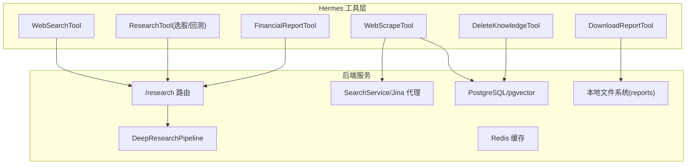
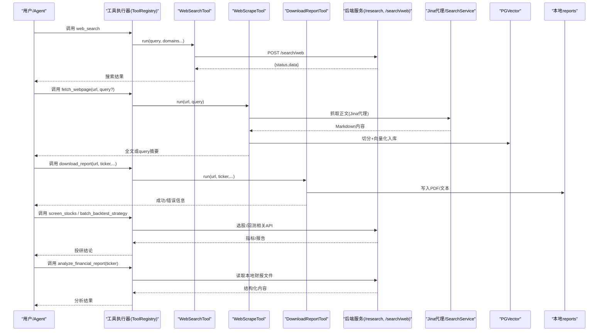
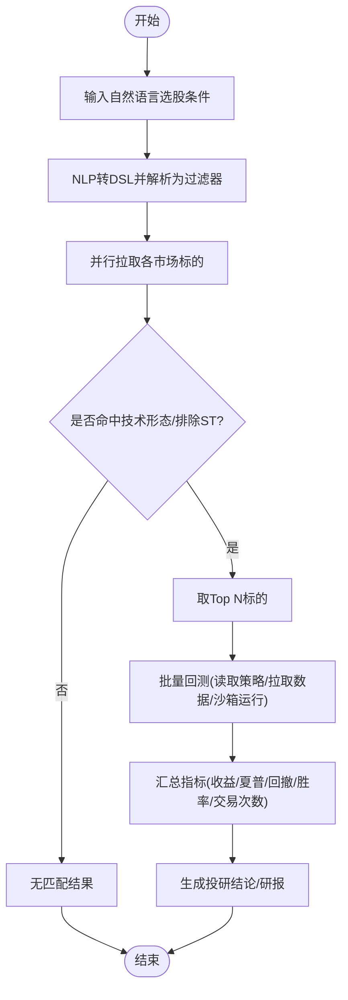
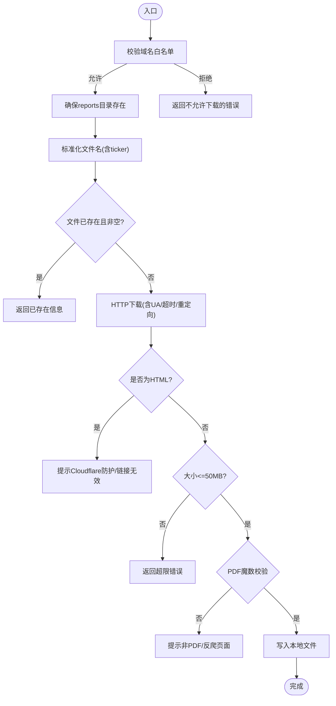
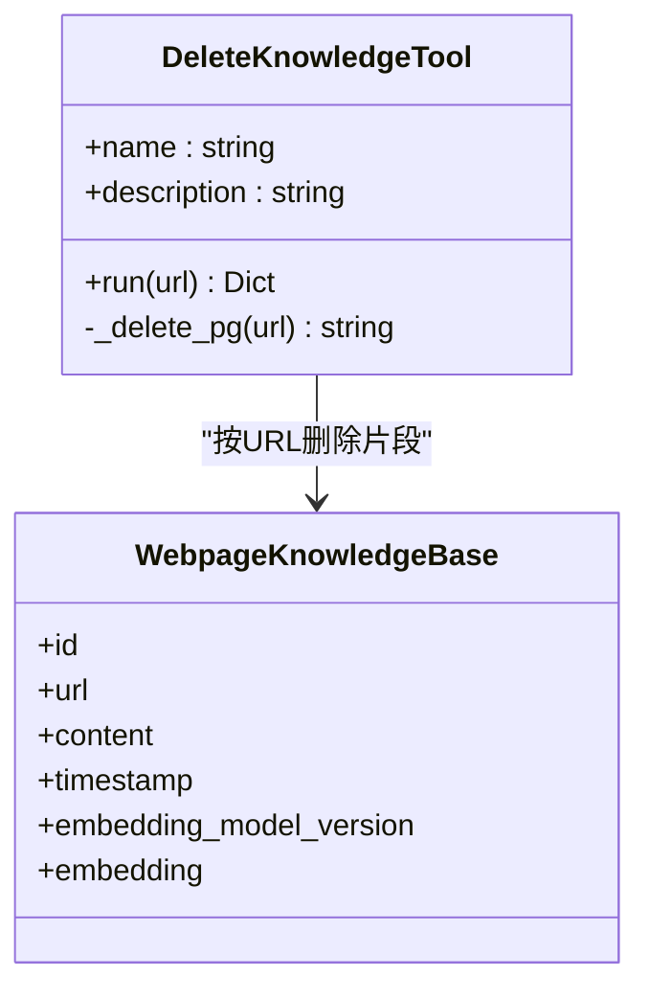
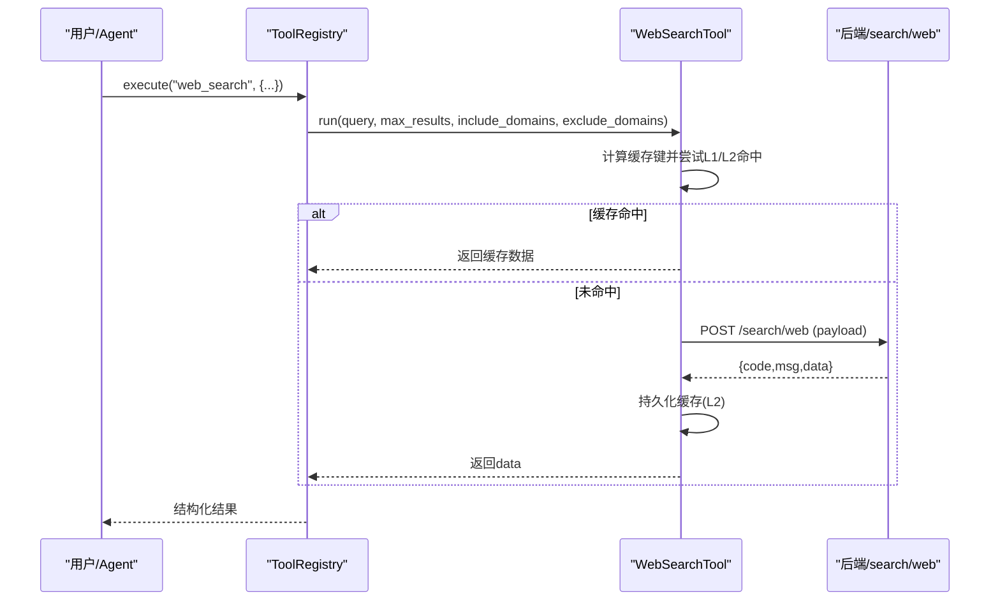
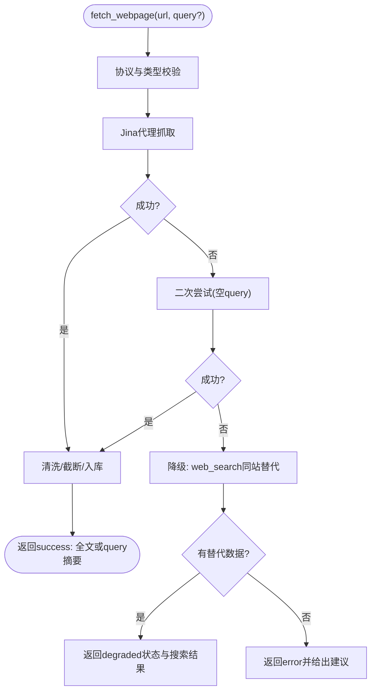
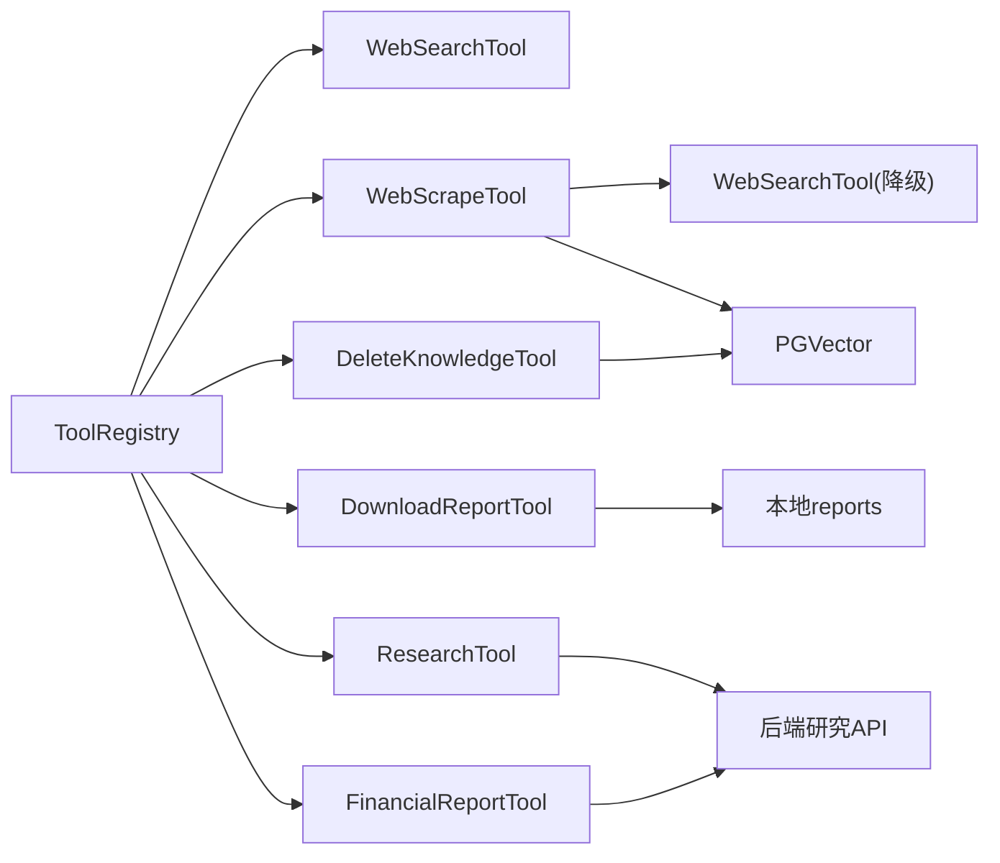

# 研究知识工具

<cite>
**本文引用的文件**
- [research_tool.py](file://hermes_agent/tools/research_tool.py)
- [download_report_tool.py](file://hermes_agent/tools/download_report_tool.py)
- [delete_knowledge_tool.py](file://hermes_agent/tools/delete_knowledge_tool.py)
- [web_search_tool.py](file://hermes_agent/tools/web_search_tool.py)
- [web_scrape_tool.py](file://hermes_agent/tools/web_scrape_tool.py)
- [base.py](file://hermes_agent/tools/base.py)
- [tool_registry.py](file://hermes_agent/tool_registry.py)
- [financial_report_tool.py](file://hermes_agent/tools/financial_report_tool.py)
- [research.py](file://backend/routers/research.py)
- [deep_research.py](file://backend/app/research/deep_research.py)
</cite>

## 目录
1. [简介](#简介)
2. [项目结构](#项目结构)
3. [核心组件](#核心组件)
4. [架构总览](#架构总览)
5. [详细组件分析](#详细组件分析)
6. [依赖关系分析](#依赖关系分析)
7. [性能考量](#性能考量)
8. [故障排查指南](#故障排查指南)
9. [结论](#结论)
10. [附录：研究场景示例与最佳实践](#附录研究场景示例与最佳实践)

## 简介
本技术文档面向“研究知识工具”套件，覆盖以下能力：
- 研究工作流管理（research_tool）：选股、批量回测、研报生成流水线。
- 研报下载工具（download_report_tool）：从公开站点安全下载 PDF/文档到本地 reports 目录，供后续解析。
- 知识库管理工具（delete_knowledge_tool）：基于 PostgreSQL pgvector 的知识片段删除与维护。
- 网络搜索工具（web_search_tool）：通过后端网关调用搜索引擎，支持域名过滤与结果缓存。
- 网页抓取工具（web_scrape_tool）：Jina 代理 + 重试降级 + RAG 入库与语义检索。
同时提供数据安全、隐私保护与合规性建议，并给出端到端研究场景示例。

## 项目结构
围绕 Hermes Agent 的工具层与后端服务协同：
- 工具层位于 hermes_agent/tools，统一通过 tool_registry 注册与执行，内置限流、熔断、缓存等横切能力。
- 后端路由在 backend/routers/research.py 暴露深度研报 API；具体流水线在 backend/app/research/deep_research.py。
- 数据与存储：PGVector（PostgreSQL 向量扩展）用于网页知识切片与检索；Redis 用于工具级缓存；本地 reports 目录用于研报文件落地。

图表来源
- [web_search_tool.py:37-84](file://hermes_agent/tools/web_search_tool.py#L37-L84)
- [web_scrape_tool.py:50-117](file://hermes_agent/tools/web_scrape_tool.py#L50-L117)
- [download_report_tool.py:220-341](file://hermes_agent/tools/download_report_tool.py#L220-L341)
- [delete_knowledge_tool.py:24-45](file://hermes_agent/tools/delete_knowledge_tool.py#L24-L45)
- [research_tool.py:20-138](file://hermes_agent/tools/research_tool.py#L20-L138)
- [research.py:25-51](file://backend/routers/research.py#L25-L51)
- [deep_research.py:199-230](file://backend/app/research/deep_research.py#L199-L230)

章节来源
- [web_search_tool.py:37-84](file://hermes_agent/tools/web_search_tool.py#L37-L84)
- [web_scrape_tool.py:50-117](file://hermes_agent/tools/web_scrape_tool.py#L50-L117)
- [download_report_tool.py:220-341](file://hermes_agent/tools/download_report_tool.py#L220-L341)
- [delete_knowledge_tool.py:24-45](file://hermes_agent/tools/delete_knowledge_tool.py#L24-L45)
- [research_tool.py:20-138](file://hermes_agent/tools/research_tool.py#L20-L138)
- [research.py:25-51](file://backend/routers/research.py#L25-L51)
- [deep_research.py:199-230](file://backend/app/research/deep_research.py#L199-L230)

## 核心组件
- WebSearchTool：封装后端 /search/web 接口，支持 include/exclude 域名过滤、结果缓存（L1/L2）。
- WebScrapeTool：优先走 Jina 代理抓取正文，失败自动降级至 web_search；对 Markdown 进行清洗、RAG 切分与入库；带 query 时返回精准摘要。
- DownloadReportTool：白名单域名校验、大小限制、HTML/PDF 魔数检测、标准化命名与幂等保存。
- DeleteKnowledgeTool：按 URL 精确删除 PGVector 中的网页片段，保障知识库时效性。
- ResearchTool：自然语言选股 → 筛选/过滤 → 批量回测 → 指标汇总，支撑投研闭环。
- FinancialReportTool：读取本地财报/研报文件，配合 download_report_tool 完成离线分析。
- ToolRegistry/BaseTool：统一注册、中间件管线（熔断）、限流感知重试、双级缓存。

章节来源
- [web_search_tool.py:37-84](file://hermes_agent/tools/web_search_tool.py#L37-L84)
- [web_scrape_tool.py:50-117](file://hermes_agent/tools/web_scrape_tool.py#L50-L117)
- [download_report_tool.py:220-341](file://hermes_agent/tools/download_report_tool.py#L220-L341)
- [delete_knowledge_tool.py:24-45](file://hermes_agent/tools/delete_knowledge_tool.py#L24-L45)
- [research_tool.py:20-138](file://hermes_agent/tools/research_tool.py#L20-L138)
- [financial_report_tool.py:29-41](file://hermes_agent/tools/financial_report_tool.py#L29-L41)
- [base.py:97-189](file://hermes_agent/tools/base.py#L97-L189)
- [tool_registry.py:183-251](file://hermes_agent/tool_registry.py#L183-L251)

## 架构总览
下图展示“搜索—抓取—入库—检索—研报生成”的端到端流程，以及工具之间的协作关系。

图表来源
- [web_search_tool.py:37-84](file://hermes_agent/tools/web_search_tool.py#L37-L84)
- [web_scrape_tool.py:50-117](file://hermes_agent/tools/web_scrape_tool.py#L50-L117)
- [download_report_tool.py:220-341](file://hermes_agent/tools/download_report_tool.py#L220-L341)
- [research_tool.py:20-138](file://hermes_agent/tools/research_tool.py#L20-L138)
- [financial_report_tool.py:29-41](file://hermes_agent/tools/financial_report_tool.py#L29-L41)
- [research.py:25-51](file://backend/routers/research.py#L25-L51)

## 详细组件分析

### 研究工作流管理（research_tool）
- 自然语言选股：将 NLP 条件翻译为 DSL，再转换为市场过滤器，并行拉取多市场标的，应用后过滤与技术形态过滤，输出候选股票池。
- 批量回测：读取策略草稿源码，提取类名，并行获取历史数据，进入沙箱回测引擎，汇总组合收益、夏普、回撤、胜率与交易次数。
- 研报生成：通过后端 /research/deep-report 触发三段式流水线（聚类发现→数据深挖→图表交付），最终产出 Markdown 研报与图表配置。

图表来源
- [research_tool.py:20-138](file://hermes_agent/tools/research_tool.py#L20-L138)
- [research.py:25-51](file://backend/routers/research.py#L25-L51)
- [deep_research.py:199-230](file://backend/app/research/deep_research.py#L199-L230)

章节来源
- [research_tool.py:20-138](file://hermes_agent/tools/research_tool.py#L20-L138)
- [research.py:25-51](file://backend/routers/research.py#L25-L51)
- [deep_research.py:199-230](file://backend/app/research/deep_research.py#L199-L230)

### 研报下载工具（download_report_tool）
- 安全校验：域名白名单（港交所、SEC、巨潮、东方财富等），防止 SSRF。
- 下载与校验：设置超时与重定向，针对 SEC 添加声明性 UA；检测 HTML 响应与 PDF 魔数；限制最大文件大小。
- 命名规范：统一 ticker 格式，生成含 ticker 的标准文件名，便于后续 analyze_financial_report 匹配。
- 幂等处理：若文件已存在且非空则直接返回，避免重复下载。

图表来源
- [download_report_tool.py:220-341](file://hermes_agent/tools/download_report_tool.py#L220-L341)

章节来源
- [download_report_tool.py:220-341](file://hermes_agent/tools/download_report_tool.py#L220-L341)

### 知识库管理工具（delete_knowledge_tool）
- 功能：根据 URL 精确删除 PGVector 中与该 URL 相关的所有网页片段，解决过期/干扰数据问题。
- 实现：通过 SQLAlchemy SessionLocal 直连数据库，按 url 字段 filter 删除并提交事务。
- 适用场景：当检索到过时指引、旧财报或不再有效的网页内容影响分析时主动清理。

图表来源
- [delete_knowledge_tool.py:24-45](file://hermes_agent/tools/delete_knowledge_tool.py#L24-L45)

章节来源
- [delete_knowledge_tool.py:24-45](file://hermes_agent/tools/delete_knowledge_tool.py#L24-L45)

### 网络搜索工具（web_search_tool）
- 机制：调用后端 /search/web 接口，支持 include_domains/exclude_domains 过滤，提升结果相关性。
- 缓存：使用 BaseTool 的双级缓存（进程内存 L1 + Redis L2），键包含查询词、数量与域名过滤，TTL 1小时，降低重复请求与限流风险。
- 错误处理：统一解包后端响应体，提取 msg/detail，返回结构化错误信息。

图表来源
- [web_search_tool.py:37-84](file://hermes_agent/tools/web_search_tool.py#L37-L84)
- [base.py:240-282](file://hermes_agent/tools/base.py#L240-L282)
- [tool_registry.py:183-251](file://hermes_agent/tool_registry.py#L183-L251)

章节来源
- [web_search_tool.py:37-84](file://hermes_agent/tools/web_search_tool.py#L37-L84)
- [base.py:240-282](file://hermes_agent/tools/base.py#L240-L282)
- [tool_registry.py:183-251](file://hermes_agent/tool_registry.py#L183-L251)

### 网页抓取工具（web_scrape_tool）
- 抓取链路：优先 Jina 代理（经后端 search_service.fetch_webpage），失败自动重试一次；仍失败则降级为 web_search 同站替代源。
- 反爬与清洗：拦截 JS 护盾/访问受限提示；去除冗余图片与链接；移除页脚与免责声明；自适应截断防 Token 溢出。
- RAG 入库与检索：Markdown 标题层级切分 + 滑动窗口；向量化后幂等写入 PGVector；带 query 时检索 Top3 段落并生成带引用标注的摘要。
- 安全防线：仅允许 http(s) 协议；拦截 PDF/Office 二进制链接，引导使用专用工具。

图表来源
- [web_scrape_tool.py:50-117](file://hermes_agent/tools/web_scrape_tool.py#L50-L117)
- [web_scrape_tool.py:119-200](file://hermes_agent/tools/web_scrape_tool.py#L119-L200)
- [web_scrape_tool.py:202-345](file://hermes_agent/tools/web_scrape_tool.py#L202-L345)

章节来源
- [web_scrape_tool.py:50-117](file://hermes_agent/tools/web_scrape_tool.py#L50-L117)
- [web_scrape_tool.py:119-200](file://hermes_agent/tools/web_scrape_tool.py#L119-L200)
- [web_scrape_tool.py:202-345](file://hermes_agent/tools/web_scrape_tool.py#L202-L345)

### 财务研报解析（financial_report_tool）
- 功能：扫描本地 reports 目录中与 ticker 匹配的财报/研报文件（txt/md/pdf），分块读取并返回结构化内容，供大模型深度分析。
- 集成：通过 SecureAsyncClient 调用后端 /financial-report 接口，参数包括 ticker 与 chunk_index。

章节来源
- [financial_report_tool.py:29-41](file://hermes_agent/tools/financial_report_tool.py#L29-L41)

## 依赖关系分析
- 工具间耦合：WebScrapeTool 依赖 WebSearchTool 作为降级路径；所有工具通过 ToolRegistry 统一注册与执行，共享限流、熔断与缓存能力。
- 外部依赖：
  - 后端服务：/search/web、/financial-report、/research/deep-report。
  - 数据存储：PostgreSQL/pgvector（RAG 向量库）、Redis（缓存）、本地文件系统（reports）。
  - 第三方代理：Jina Reader（经后端代理）。
- 潜在循环依赖：工具层不直接互相 import 复杂逻辑，仅通过工具名调用，降低耦合。

图表来源
- [tool_registry.py:183-251](file://hermes_agent/tool_registry.py#L183-L251)
- [web_scrape_tool.py:50-117](file://hermes_agent/tools/web_scrape_tool.py#L50-L117)
- [download_report_tool.py:220-341](file://hermes_agent/tools/download_report_tool.py#L220-L341)
- [delete_knowledge_tool.py:24-45](file://hermes_agent/tools/delete_knowledge_tool.py#L24-L45)
- [research_tool.py:20-138](file://hermes_agent/tools/research_tool.py#L20-L138)
- [financial_report_tool.py:29-41](file://hermes_agent/tools/financial_report_tool.py#L29-L41)

章节来源
- [tool_registry.py:183-251](file://hermes_agent/tool_registry.py#L183-L251)
- [web_scrape_tool.py:50-117](file://hermes_agent/tools/web_scrape_tool.py#L50-L117)
- [download_report_tool.py:220-341](file://hermes_agent/tools/download_report_tool.py#L220-L341)
- [delete_knowledge_tool.py:24-45](file://hermes_agent/tools/delete_knowledge_tool.py#L24-L45)
- [research_tool.py:20-138](file://hermes_agent/tools/research_tool.py#L20-L138)
- [financial_report_tool.py:29-41](file://hermes_agent/tools/financial_report_tool.py#L29-L41)

## 性能考量
- 并发与并行：选股阶段对多市场并行拉取；批量回测对 tickers 并行获取历史数据；Jina 抓取失败后的降级搜索也具备并发潜力。
- 缓存策略：搜索与工具执行结果采用 L1/L2 双级缓存，显著降低重复请求与外部限流概率。
- 重试与退避：BaseTool 提供限流感知智能重试，结合指数退避与上限控制，提高鲁棒性。
- I/O 限制：下载工具限制最大文件大小与超时时间，避免资源耗尽；网页抓取对长文进行自适应截断，减少 Token 压力。
- 向量入库：RAG 切分采用标题层级 + 滑动窗口，兼顾表格完整性与检索精度；幂等写入避免重复堆积。

[本节为通用性能讨论，无需特定文件引用]

## 故障排查指南
- 搜索失败：检查后端 /search/web 返回的 msg/detail；确认 include/exclude 域名过滤是否过严；查看缓存键是否命中导致旧结果。
- 抓取失败：确认 URL 协议合法；若返回 HTML 或 JS 护盾提示，启用降级搜索；检查 Jina 代理可用性；必要时手动下载后用财务研报工具分析。
- 下载失败：核对域名是否在白名单；SEC 需正确 UA；若返回 HTML 而非 PDF，可能是 Cloudflare 防护；注意 50MB 限制。
- 知识库清理：确认 URL 完全一致；若删除计数为 0，说明库中无该 URL 片段。
- 限流与熔断：关注 ToolRegistry 的失败追踪与熔断器；遇到 rate_limited 时等待 retry_after_seconds 后再试。

章节来源
- [web_search_tool.py:37-84](file://hermes_agent/tools/web_search_tool.py#L37-L84)
- [web_scrape_tool.py:50-117](file://hermes_agent/tools/web_scrape_tool.py#L50-L117)
- [download_report_tool.py:220-341](file://hermes_agent/tools/download_report_tool.py#L220-L341)
- [delete_knowledge_tool.py:24-45](file://hermes_agent/tools/delete_knowledge_tool.py#L24-L45)
- [base.py:97-189](file://hermes_agent/tools/base.py#L97-L189)
- [tool_registry.py:183-251](file://hermes_agent/tool_registry.py#L183-L251)

## 结论
研究知识工具套件以“搜索—抓取—入库—检索—研报生成”为主线，构建了从数据采集到投研产出的完整闭环。通过白名单下载、RAG 入库与语义检索、限流重试与熔断、缓存优化等手段，在保证安全与合规的前提下提升了效率与稳定性。建议在生产环境中持续监控外部依赖健康度与限流信号，并结合业务需求调整缓存 TTL、切分策略与阈值。

[本节为总结性内容，无需特定文件引用]

## 附录：研究场景示例与最佳实践

### 典型研究场景
- 场景一：快速调研某公司最新年报
  1) 使用 web_search 搜索“公司名 年报 site:sec.gov”，获取 PDF 直链。
  2) 调用 download_report 下载至 reports 目录（自动命名与校验）。
  3) 调用 analyze_financial_report 解析本地文件，获得结构化内容。
  4) 如需深入，可再次用 web_scrape 抓取相关新闻或管理层讲话，触发 RAG 入库与检索。

- 场景二：行业主题深度研报
  1) 使用 research_tool 的自然语言选股，构建备选股票池。
  2) 选择策略进行批量回测，汇总关键指标。
  3) 调用 /research/deep-report 触发三段式流水线，生成 Markdown 研报与图表配置。

- 场景三：动态页面抓取与替代源
  1) 对目标网页调用 fetch_webpage，若被反爬拦截，工具自动降级为 web_search 同站替代。
  2) 若仍失败，提示用户更换链接或手动下载后用财务研报工具分析。

### 数据安全、隐私与合规最佳实践
- 下载安全：严格域名白名单；限制文件大小与超时；检测 HTML/PDF 魔数；对 SEC 等站点使用声明性 UA。
- 抓取安全：仅允许 http(s)；拦截二进制文档；对 JS 护盾与访问受限内容进行识别与降级。
- 数据最小化：RAG 入库仅保存必要片段；对长文进行自适应截断；定期清理过期 URL 的知识片段。
- 权限与审计：在生产环境结合后端鉴权与审计日志，记录工具调用、数据来源与操作者身份。
- 合规性：遵循数据源使用条款；避免抓取受版权保护的全文；对敏感信息脱敏后再入库。

[本节为通用指导，无需特定文件引用]