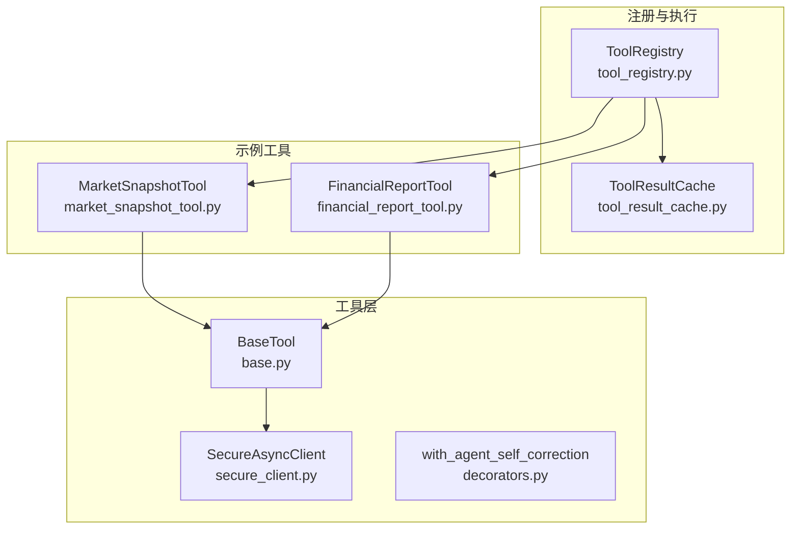
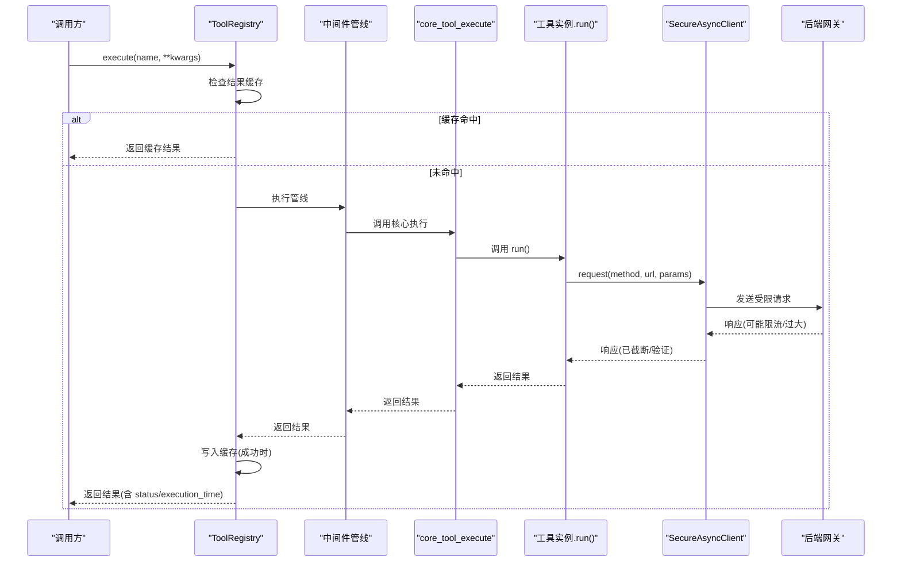
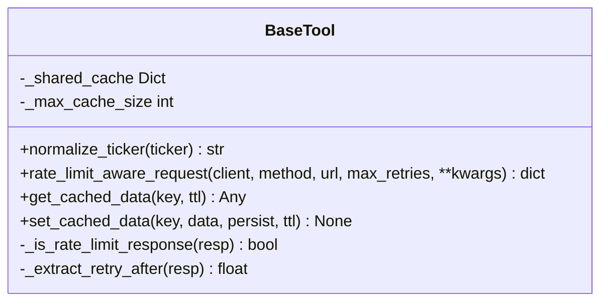
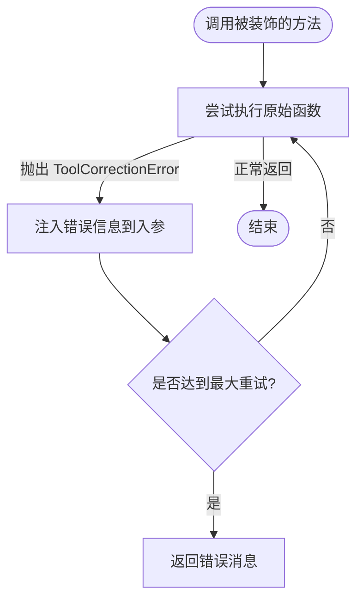
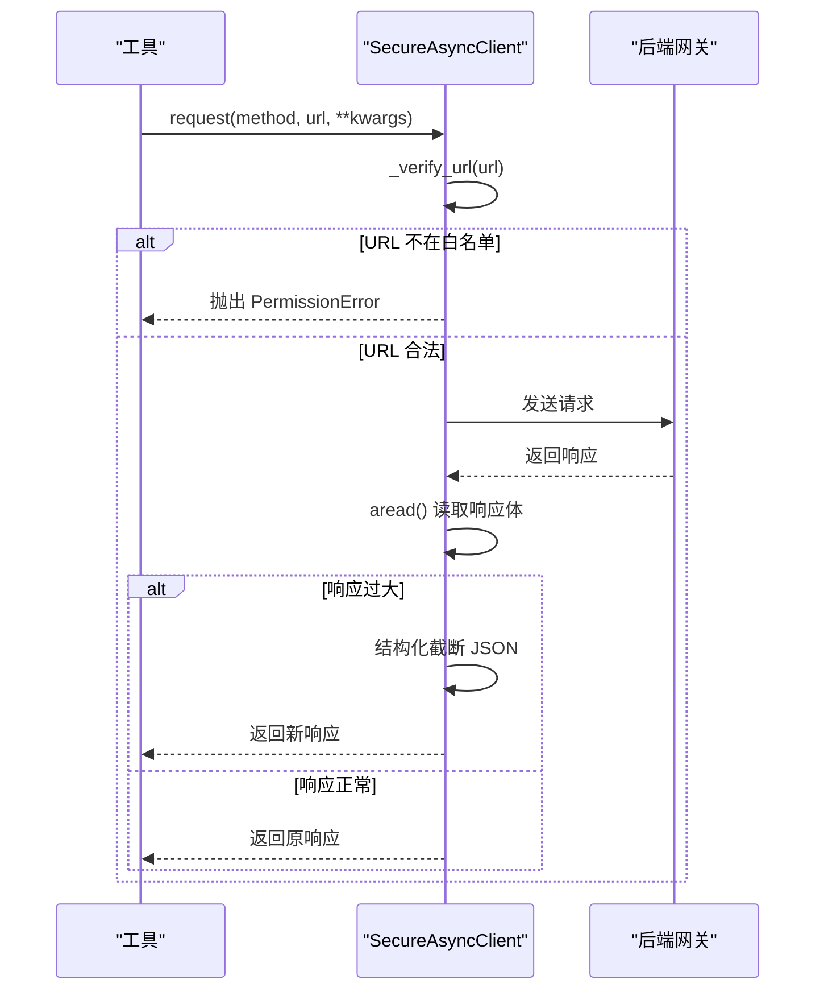
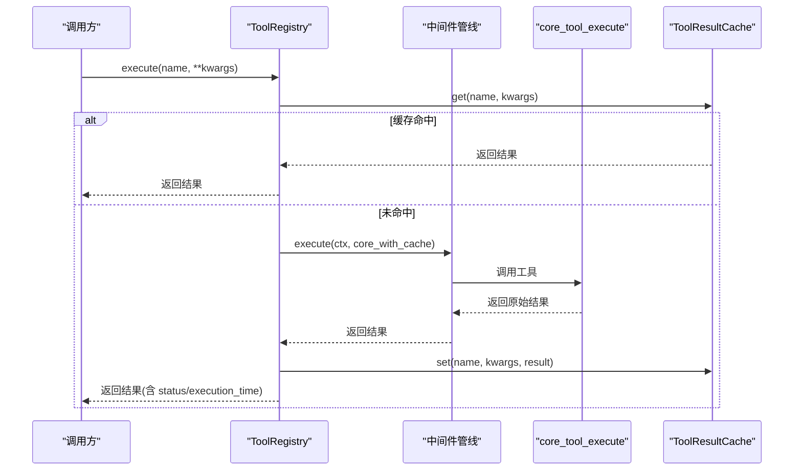
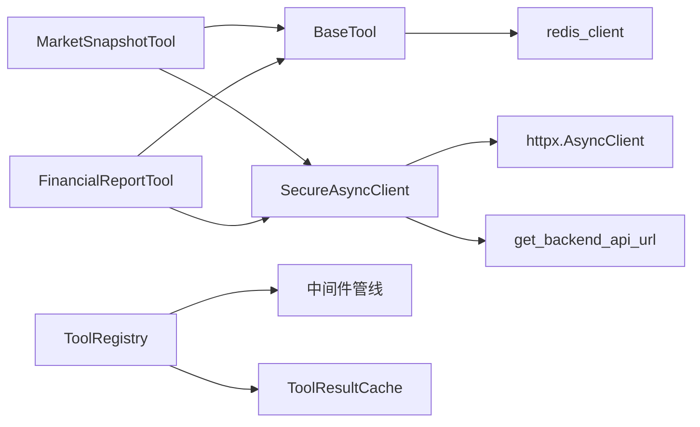

# 自定义工具开发

<cite>
**本文引用的文件**
- [base.py](file://hermes_agent/tools/base.py)
- [decorators.py](file://hermes_agent/tools/decorators.py)
- [secure_client.py](file://hermes_agent/tools/secure_client.py)
- [tool_registry.py](file://hermes_agent/tool_registry.py)
- [tool_result_cache.py](file://hermes_agent/tool_result_cache.py)
- [market_snapshot_tool.py](file://hermes_agent/tools/market_snapshot_tool.py)
- [financial_report_tool.py](file://hermes_agent/tools/financial_report_tool.py)
- [test_tools.py](file://backend/tests/test_tools.py)
</cite>

## 目录
1. [简介](#简介)
2. [项目结构](#项目结构)
3. [核心组件](#核心组件)
4. [架构总览](#架构总览)
5. [详细组件分析](#详细组件分析)
6. [依赖关系分析](#依赖关系分析)
7. [性能考量](#性能考量)
8. [故障排查指南](#故障排查指南)
9. [结论](#结论)
10. [附录：完整开发流程与示例](#附录完整开发流程与示例)

## 简介
本指南面向需要在系统中扩展“Agent 工具”的开发者，围绕基础工具类、装饰器系统、安全客户端、工具注册与缓存等关键模块，提供从设计模式到落地实践的系统化说明。内容涵盖：
- 工具基类的继承结构与生命周期管理
- 限流感知重试与双级缓存机制
- 参数校验、自我纠错等装饰器能力
- 安全客户端的白名单与响应体积保护
- 工具注册、Schema 暴露、中间件管线执行
- 完整的自定义工具开发流程（需求→实现→测试→发布）
- 调试技巧、性能优化策略与发布维护最佳实践

## 项目结构
与工具开发直接相关的代码集中在 hermes_agent 子包中，核心文件包括：
- 基础能力：base.py（工具基类、限流重试、缓存）、secure_client.py（安全 HTTP 客户端）
- 装饰器：decorators.py（自我纠错装饰器）
- 注册与执行：tool_registry.py（工具注册表、中间件管线、执行入口）
- 结果缓存：tool_result_cache.py（Redis 统一结果缓存）
- 示例工具：market_snapshot_tool.py、financial_report_tool.py
- 测试参考：backend/tests/test_tools.py

图表来源
- [base.py:21-282](file://hermes_agent/tools/base.py#L21-L282)
- [secure_client.py:8-81](file://hermes_agent/tools/secure_client.py#L8-L81)
- [decorators.py:15-64](file://hermes_agent/tools/decorators.py#L15-L64)
- [tool_registry.py:66-252](file://hermes_agent/tool_registry.py#L66-L252)
- [tool_result_cache.py:107-195](file://hermes_agent/tool_result_cache.py#L107-L195)
- [market_snapshot_tool.py:9-46](file://hermes_agent/tools/market_snapshot_tool.py#L9-L46)
- [financial_report_tool.py:9-42](file://hermes_agent/tools/financial_report_tool.py#L9-L42)

章节来源
- [base.py:21-282](file://hermes_agent/tools/base.py#L21-L282)
- [secure_client.py:8-81](file://hermes_agent/tools/secure_client.py#L8-L81)
- [decorators.py:15-64](file://hermes_agent/tools/decorators.py#L15-L64)
- [tool_registry.py:66-252](file://hermes_agent/tool_registry.py#L66-L252)
- [tool_result_cache.py:107-195](file://hermes_agent/tool_result_cache.py#L107-L195)
- [market_snapshot_tool.py:9-46](file://hermes_agent/tools/market_snapshot_tool.py#L9-L46)
- [financial_report_tool.py:9-42](file://hermes_agent/tools/financial_report_tool.py#L9-L42)

## 核心组件
- BaseTool：提供统一的股票代码规范化、限流感知智能重试、进程内 L1 + Redis L2 双级缓存能力。
- SecureAsyncClient：仅允许访问后端网关或本地地址，拦截越权直连；对超大响应进行结构化截断，防止上下文溢出。
- ToolRegistry：自动发现并注册工具，生成 OpenAI function-calling Schema；通过中间件管线执行工具，集成熔断、失败追踪、计时与分类。
- ToolResultCache：基于 Redis Hash 的统一结果缓存，支持按工具 TTL、跳过策略、命中统计。
- Decorators：提供 with_agent_self_correction 装饰器，捕获下游校验错误并注入提示，驱动大模型自我修正。

章节来源
- [base.py:21-282](file://hermes_agent/tools/base.py#L21-L282)
- [secure_client.py:8-81](file://hermes_agent/tools/secure_client.py#L8-L81)
- [tool_registry.py:66-252](file://hermes_agent/tool_registry.py#L66-L252)
- [tool_result_cache.py:107-195](file://hermes_agent/tool_result_cache.py#L107-L195)
- [decorators.py:15-64](file://hermes_agent/tools/decorators.py#L15-L64)

## 架构总览
工具调用从注册表进入，经中间件管线（熔断、计时、分类），最终由 core_tool_execute 调用具体工具的 run 方法。请求通过 SecureAsyncClient 发往后端网关，返回数据经限流感知重试与结果缓存后回传。

图表来源
- [tool_registry.py:183-252](file://hermes_agent/tool_registry.py#L183-L252)
- [secure_client.py:32-81](file://hermes_agent/tools/secure_client.py#L32-L81)
- [base.py:97-239](file://hermes_agent/tools/base.py#L97-L239)
- [tool_result_cache.py:122-187](file://hermes_agent/tool_result_cache.py#L122-L187)

## 详细组件分析

### 基础工具类 BaseTool（继承结构、生命周期、依赖注入）
- 继承结构：所有工具继承 BaseTool，获得统一能力（限流重试、缓存、ticker 规范化）。
- 生命周期：工具以实例形式被注册表持有；每次执行通过 registry.execute → 中间件 → core_tool_execute → tool.run 完成一次调用生命周期。
- 依赖注入：
  - 后端 API URL 通过 get_backend_api_url 读取环境变量动态构建，避免硬编码。
  - 缓存依赖 redis_client，读写均异步。
  - 限流重试逻辑封装在 rate_limit_aware_request，统一处理 429/503 与 body 中的限流信号。

图表来源
- [base.py:21-282](file://hermes_agent/tools/base.py#L21-L282)

章节来源
- [base.py:21-282](file://hermes_agent/tools/base.py#L21-L282)

### 装饰器系统（参数校验、权限控制、日志记录）
- 自我纠错装饰器 with_agent_self_correction：
  - 捕获 ToolCorrectionError，将报错信息拼接至指定入参（如 query），触发 LLM 自我修正。
  - 支持最大重试次数，超过阈值返回结构化错误。
  - 通过通知服务推送实时告警，便于前端展示 AI 反思过程。
- 权限控制与日志记录：
  - 权限控制由 SecureAsyncClient 的 URL 白名单保障，禁止绕过网关直连外部数据源。
  - 日志记录通过 print 输出请求/响应摘要，便于调试；生产环境可替换为结构化日志。

图表来源
- [decorators.py:15-64](file://hermes_agent/tools/decorators.py#L15-L64)

章节来源
- [decorators.py:15-64](file://hermes_agent/tools/decorators.py#L15-L64)
- [secure_client.py:14-31](file://hermes_agent/tools/secure_client.py#L14-L31)

### 安全客户端 SecureAsyncClient（API 密钥、请求加密、响应验证）
- API 密钥管理：
  - 当前实现不直接处理密钥；建议通过后端网关统一鉴权（JWT/内部密钥），工具侧仅通过受控网关访问。
- 请求加密：
  - 使用 httpx 发起 HTTPS 请求；如需端到端加密，可在网关层实现 TLS 终止与内部加密通道。
- 响应验证与保护：
  - URL 白名单校验，拒绝非授权域名。
  - 响应体大小保护：当 JSON 数组过长时，递归截断并插入提示信息，防止上下文溢出。
  - 移除 content-length 头以避免重算不一致问题。

图表来源
- [secure_client.py:8-81](file://hermes_agent/tools/secure_client.py#L8-L81)

章节来源
- [secure_client.py:8-81](file://hermes_agent/tools/secure_client.py#L8-L81)

### 工具注册与执行（ToolRegistry）
- 自动注册：通过 @register_tool 装饰器将工具类加入全局列表，并在初始化时实例化注册。
- Schema 暴露：每个工具需提供 name、description、parameters，注册表将其转换为 OpenAI function-calling schema。
- 中间件管线：包含熔断器中间件，失败计数达到阈值后短路返回；执行完成后进行失败追踪与分类。
- 结果缓存：在执行前后检查 Redis 缓存，命中则直接返回；成功结果写回缓存（排除错误/限流/空结果）。

图表来源
- [tool_registry.py:66-252](file://hermes_agent/tool_registry.py#L66-L252)
- [tool_result_cache.py:122-187](file://hermes_agent/tool_result_cache.py#L122-L187)

章节来源
- [tool_registry.py:66-252](file://hermes_agent/tool_registry.py#L66-L252)
- [tool_result_cache.py:122-187](file://hermes_agent/tool_result_cache.py#L122-L187)

### 示例工具解析
- MarketSnapshotTool：
  - 通过 get_backend_api_url 构造后端接口路径，使用 SecureAsyncClient 发起 GET 请求，借助 BaseTool.rate_limit_aware_request 处理限流与重试。
  - 参数：tickers（必填）、prefer_sources（可选）。
- FinancialReportTool：
  - 扫描并读取本地财报文件，调用后端 /financial-report 接口，返回解析后的内容。
  - 参数：ticker（必填）、chunk_index（可选）。

章节来源
- [market_snapshot_tool.py:9-46](file://hermes_agent/tools/market_snapshot_tool.py#L9-L46)
- [financial_report_tool.py:9-42](file://hermes_agent/tools/financial_report_tool.py#L9-L42)

## 依赖关系分析
- BaseTool 依赖：
  - backend.core.redis_client：用于 L2 缓存持久化。
  - asyncio：异步重试与等待。
- SecureAsyncClient 依赖：
  - httpx.AsyncClient：HTTP 客户端。
  - base.get_backend_api_url：获取后端 API 基础 URL。
- ToolRegistry 依赖：
  - hermes_agent.middleware：中间件管线、熔断器、失败追踪。
  - hermes_agent.tool_result_cache：统一结果缓存。
  - hermes_agent.scopes：工具场景过滤。
- 示例工具依赖：
  - BaseTool、SecureAsyncClient、register_tool。

图表来源
- [base.py:21-282](file://hermes_agent/tools/base.py#L21-L282)
- [secure_client.py:8-81](file://hermes_agent/tools/secure_client.py#L8-L81)
- [tool_registry.py:66-252](file://hermes_agent/tool_registry.py#L66-L252)
- [tool_result_cache.py:107-195](file://hermes_agent/tool_result_cache.py#L107-L195)

章节来源
- [base.py:21-282](file://hermes_agent/tools/base.py#L21-L282)
- [secure_client.py:8-81](file://hermes_agent/tools/secure_client.py#L8-L81)
- [tool_registry.py:66-252](file://hermes_agent/tool_registry.py#L66-L252)
- [tool_result_cache.py:107-195](file://hermes_agent/tool_result_cache.py#L107-L195)

## 性能考量
- 限流感知重试：
  - 检测 HTTP 429/503 与响应体中的限流标志，解析 retry_after 并指数退避，避免雪崩。
  - 默认最大重试次数与延迟上限，防止无限重试。
- 双级缓存：
  - L1 内存缓存快速命中，L2 Redis 跨进程共享；过期清理与容量限制避免内存膨胀。
- 响应截断：
  - 对超长 JSON 数组进行高位截断，减少 Token 占用，降低上下文溢出风险。
- 结果缓存 TTL：
  - 按工具配置不同 TTL，平衡新鲜度与性能；可通过环境变量覆盖。

章节来源
- [base.py:97-239](file://hermes_agent/tools/base.py#L97-L239)
- [secure_client.py:41-81](file://hermes_agent/tools/secure_client.py#L41-L81)
- [tool_result_cache.py:25-67](file://hermes_agent/tool_result_cache.py#L25-L67)

## 故障排查指南
- 常见错误与定位：
  - 限流错误：检查 rate_limit_aware_request 的日志与重试次数；确认后端是否返回 retry_after。
  - 网络异常：查看 SecureAsyncClient 的请求/响应日志；确认 URL 在白名单内。
  - 上下文溢出：关注响应截断日志；必要时调整业务逻辑减少返回数据量。
  - 缓存未命中：检查 TOOL_CACHE_ENABLED、TTL 配置与 no-cache 工具列表。
- 调试技巧：
  - 启用详细日志：观察中间件管线执行顺序与耗时。
  - Mock 外部依赖：使用 unittest.mock 模拟 SecureAsyncClient 与后端响应，验证边界分支。
  - 单元测试参考：参见 test_tools.py 中对 BaseTool.normalize_ticker、缓存、工具元数据的用例。

章节来源
- [base.py:97-239](file://hermes_agent/tools/base.py#L97-L239)
- [secure_client.py:32-81](file://hermes_agent/tools/secure_client.py#L32-L81)
- [tool_result_cache.py:122-187](file://hermes_agent/tool_result_cache.py#L122-L187)
- [test_tools.py:23-112](file://backend/tests/test_tools.py#L23-L112)

## 结论
本指南系统化梳理了 Agent 工具的基础设施与开发范式：通过 BaseTool 统一限流重试与缓存，SecureAsyncClient 保障安全与健壮性，ToolRegistry 提供注册、Schema 暴露与中间件执行，ToolResultCache 提升性能与一致性。结合装饰器的自我纠错能力，可实现高可用的工具生态。遵循本文的开发流程与最佳实践，可高效扩展新的工具并稳定上线。

## 附录：完整开发流程与示例

### 开发流程概览
- 需求分析：明确工具的业务目标、输入输出、依赖数据源与性能要求。
- 设计与建模：定义工具名称、描述、参数 Schema；选择是否需要缓存、重试、纠错。
- 实现工具类：
  - 继承 BaseTool，实现 run 方法。
  - 使用 SecureAsyncClient 访问后端网关。
  - 使用 register_tool 装饰器自动注册。
- 测试与验证：
  - 编写单元测试，覆盖参数校验、成功/失败分支、限流与缓存。
  - 使用 mock 隔离外部依赖。
- 调试与优化：
  - 观察限流重试与缓存命中情况；调整 TTL 与重试策略。
  - 监控响应体积，必要时优化返回数据。
- 发布与维护：
  - 更新工具 Schema；确保文档与版本兼容。
  - 建立监控与告警，跟踪失败率与性能指标。

### 创建新工具类示例
- 步骤：
  - 新建工具文件，继承 BaseTool。
  - 定义 name、description、parameters。
  - 实现 async run(...) 方法，调用后端接口并返回结构化结果。
  - 使用 @register_tool 装饰器注册。
- 参考实现：
  - [market_snapshot_tool.py:9-46](file://hermes_agent/tools/market_snapshot_tool.py#L9-L46)
  - [financial_report_tool.py:9-42](file://hermes_agent/tools/financial_report_tool.py#L9-L42)

### 实现业务逻辑与注册接口
- 业务逻辑：
  - 参数校验与规范化（如 ticker 标准化）。
  - 调用后端接口，处理限流与异常。
  - 返回统一格式的结果（status、message、data）。
- 注册接口：
  - 通过 register_tool 自动注册，无需手动维护列表。
  - 注册表自动生成 OpenAI function-calling schema，供上层调用。

章节来源
- [tool_registry.py:45-91](file://hermes_agent/tool_registry.py#L45-L91)
- [market_snapshot_tool.py:9-46](file://hermes_agent/tools/market_snapshot_tool.py#L9-L46)
- [financial_report_tool.py:9-42](file://hermes_agent/tools/financial_report_tool.py#L9-L42)

### 工具测试方法与调试技巧
- 单元测试要点：
  - 校验工具元数据（name、description、parameters）。
  - 模拟后端响应，验证成功与失败分支。
  - 验证 BaseTool.normalize_ticker 的多种输入场景。
  - 验证缓存行为（命中、过期、容量限制）。
- 调试技巧：
  - 使用 mock 替代 SecureAsyncClient，避免真实网络调用。
  - 打印关键日志，观察限流重试与缓存命中。
  - 参考现有测试用例，覆盖边界条件。

章节来源
- [test_tools.py:23-112](file://backend/tests/test_tools.py#L23-L112)
- [test_tools.py:113-172](file://backend/tests/test_tools.py#L113-L172)
- [test_tools.py:201-238](file://backend/tests/test_tools.py#L201-L238)

### 性能优化策略
- 合理设置 TTL：根据数据新鲜度配置工具级 TTL，避免频繁请求。
- 限流重试：利用 rate_limit_aware_request 的智能退避，降低失败率。
- 响应截断：防止大响应导致上下文溢出，提升稳定性。
- 缓存命中：优先命中 L1 内存缓存，减少 Redis 压力。

章节来源
- [tool_result_cache.py:25-67](file://hermes_agent/tool_result_cache.py#L25-L67)
- [base.py:97-239](file://hermes_agent/tools/base.py#L97-L239)
- [secure_client.py:41-81](file://hermes_agent/tools/secure_client.py#L41-L81)

### 发布与维护最佳实践
- 版本管理：
  - 工具变更需同步更新 Schema 与文档。
  - 保持向后兼容，避免破坏上游调用。
- 文档编写：
  - 清晰描述工具用途、参数、返回值与异常。
  - 提供使用示例与常见问题解答。
- 用户支持：
  - 建立监控与告警，及时发现问题。
  - 收集用户反馈，持续优化体验。

[本节为通用指导，不直接分析具体文件]