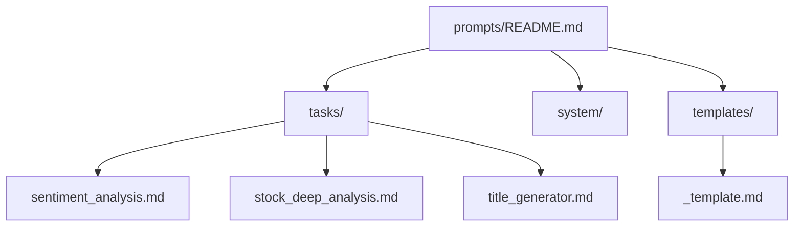
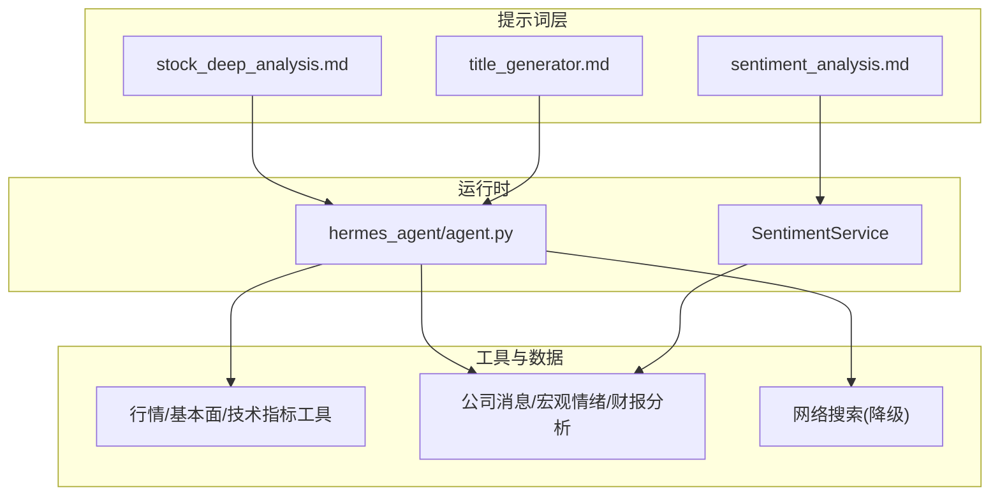
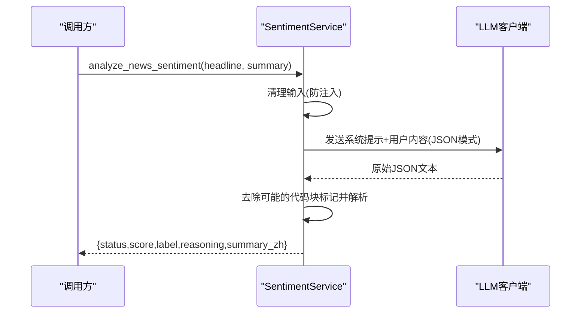
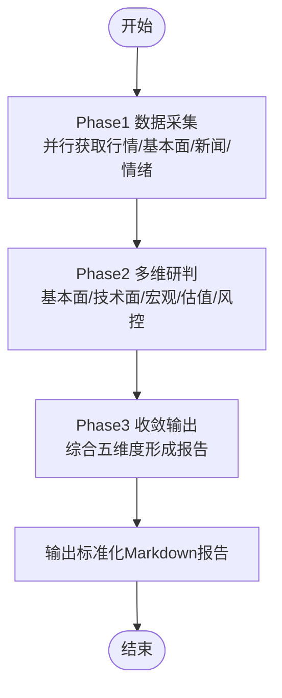
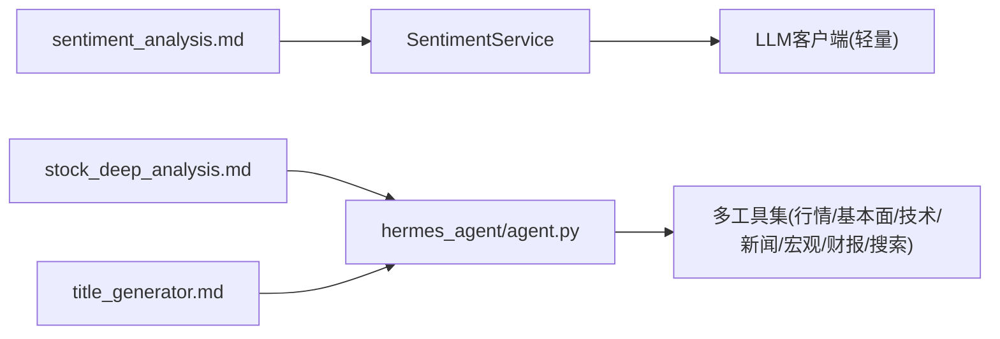

# 任务提示词构建

<cite>
**本文引用的文件**
- [prompts/tasks/sentiment_analysis.md](file://prompts/tasks/sentiment_analysis.md)
- [prompts/tasks/stock_deep_analysis.md](file://prompts/tasks/stock_deep_analysis.md)
- [prompts/tasks/title_generator.md](file://prompts/tasks/title_generator.md)
- [prompts/README.md](file://prompts/README.md)
- [prompts/templates/_template.md](file://prompts/templates/_template.md)
- [backend/services/macro/sentiment_service.py](file://backend/services/macro/sentiment_service.py)
- [hermes_agent/agent.py](file://hermes_agent/agent.py)
</cite>

## 目录
1. [引言](#引言)
2. [项目结构](#项目结构)
3. [核心组件](#核心组件)
4. [架构总览](#架构总览)
5. [详细组件分析](#详细组件分析)
6. [依赖关系分析](#依赖关系分析)
7. [性能考量](#性能考量)
8. [故障排查指南](#故障排查指南)
9. [结论](#结论)
10. [附录](#附录)

## 引言
本文件面向“任务提示词”的构建与治理，聚焦三类典型任务：情感分析、个股深度研判、会话标题生成。文档从系统架构、数据流、处理逻辑、集成点、错误处理与性能特征等维度展开，并结合仓库中的实际实现进行说明，帮助读者理解如何设计高质量、可评估、可维护的任务提示词。

## 项目结构
提示词采用“版本化 + 元信息头 + 模板化”的组织方式，便于统一管理与回归测试。

图表来源
- [prompts/README.md:1-58](file://prompts/README.md#L1-L58)
- [prompts/templates/_template.md:1-22](file://prompts/templates/_template.md#L1-L22)

章节来源
- [prompts/README.md:1-58](file://prompts/README.md#L1-L58)
- [prompts/templates/_template.md:1-22](file://prompts/templates/_template.md#L1-L22)

## 核心组件
- 新闻情感分析（轻量任务）：使用小模型、强制 JSON 输出、温度=0 保证稳定性，并内置防注入清洗与批量并发处理。
- 个股深度研判（复杂任务）：以“五维专家视角”驱动工具调用序列，输出标准化 Markdown 报告，包含执行摘要、基本面、技术面、宏观、估值、风控与建议。
- 会话标题生成（极简任务）：对首条消息做极简中文总结，严格限制长度与格式。

章节来源
- [prompts/tasks/sentiment_analysis.md:1-25](file://prompts/tasks/sentiment_analysis.md#L1-L25)
- [prompts/tasks/stock_deep_analysis.md:1-222](file://prompts/tasks/stock_deep_analysis.md#L1-L222)
- [prompts/tasks/title_generator.md:1-15](file://prompts/tasks/title_generator.md#L1-L15)

## 架构总览
下图展示三类任务在系统中的位置与交互：任务提示词由 Agent 或专用服务加载，结合工具与 LLM 完成数据处理与结构化输出。

图表来源
- [hermes_agent/agent.py:270-469](file://hermes_agent/agent.py#L270-L469)
- [backend/services/macro/sentiment_service.py:1-171](file://backend/services/macro/sentiment_service.py#L1-L171)
- [prompts/tasks/stock_deep_analysis.md:51-90](file://prompts/tasks/stock_deep_analysis.md#L51-L90)

## 详细组件分析

### 情感分析任务（sentiment_analysis.md）
- 输入变量
  - headline：新闻标题（字符串）
  - summary：新闻摘要（可选）
- 输出标准
  - JSON 对象，字段包括 score（-100~100）、label（Bullish/Bearish/Neutral）、reasoning（单句中文解释）、summary_zh（专业中文摘要）
- 设计要点
  - 目标模型为轻量级，temperature=0，强制 JSON 输出，确保稳定解析
  - 输入净化：替换尖括号与反引号，防止间接提示注入
  - 批处理能力：并发打分，异常不阻断整体流程
  - 降级策略：解析失败返回默认中性结果并记录错误

图表来源
- [backend/services/macro/sentiment_service.py:14-86](file://backend/services/macro/sentiment_service.py#L14-L86)
- [prompts/tasks/sentiment_analysis.md:1-25](file://prompts/tasks/sentiment_analysis.md#L1-L25)

章节来源
- [prompts/tasks/sentiment_analysis.md:1-25](file://prompts/tasks/sentiment_analysis.md#L1-L25)
- [backend/services/macro/sentiment_service.py:1-171](file://backend/services/macro/sentiment_service.py#L1-L171)

### 个股深度分析任务（stock_deep_analysis.md）
- 触发条件
  - 明确标的+分析意图、建仓/买卖咨询、诊断请求、隐含分析意图
- 分析流程
  - Phase 1 数据采集：并行获取行情、基本面、新闻与情绪
  - Phase 2 多维研判：基本面、技术面、宏观、估值、风控五大视角
  - Phase 3 收敛输出：首席分析师综合，识别共识与分歧，给出可操作建议
- 工具调用序列
  - 必须：行情快照、基本面指标、技术指标、公司消息、宏观情绪历史
  - 可选：财报分析、网络搜索（用于补充行业对比或最新研报观点）
- 输出报告格式（强制）
  - 结构化 Markdown，包含执行摘要、基本面评分表、技术面信号、宏观与行业关联、估值三档情景、风险提示、多空因素矩阵、投资建议、进阶追问建议、数据来源时间戳

图表来源
- [prompts/tasks/stock_deep_analysis.md:51-90](file://prompts/tasks/stock_deep_analysis.md#L51-L90)
- [prompts/tasks/stock_deep_analysis.md:92-186](file://prompts/tasks/stock_deep_analysis.md#L92-L186)

章节来源
- [prompts/tasks/stock_deep_analysis.md:1-222](file://prompts/tasks/stock_deep_analysis.md#L1-L222)

### 标题生成任务（title_generator.md）
- 输入变量
  - user_content：用户首条消息（字符串）
- 输出标准
  - 纯文本，不超过3个词或10个汉字，严禁标点与解释性文字
- 设计要点
  - 极简总结，避免冗余；适合会话列表展示与检索

章节来源
- [prompts/tasks/title_generator.md:1-15](file://prompts/tasks/title_generator.md#L1-L15)

### 思维链引导与上下文注入
- 思维链（CoT）流式支持：Agent 在接收 LLM 响应时，若存在 reasoning_content，则作为推理片段流式输出，便于前端实时呈现思考过程。
- 上下文注入：通过系统提示与用户消息组合，将任务指令与输入数据安全包裹（如 XML 标签），降低提示注入风险。

章节来源
- [hermes_agent/agent.py:270-340](file://hermes_agent/agent.py#L270-L340)
- [backend/services/macro/sentiment_service.py:30-49](file://backend/services/macro/sentiment_service.py#L30-L49)

### 结构化输出与模板规范
- 所有 Prompt 文件头部需包含 YAML Front Matter：id、name、target_model、input_variables、output_format、last_tested、eval_score、changelog
- 新 Prompt 应基于模板 _template.md 创建，保持统一结构与可追溯性

章节来源
- [prompts/README.md:22-48](file://prompts/README.md#L22-L48)
- [prompts/templates/_template.md:1-22](file://prompts/templates/_template.md#L1-L22)

## 依赖关系分析
- 情感分析服务依赖 LLM 路由与轻量模型配置，并通过 response_format=json_object 强制结构化输出
- 深度分析任务依赖多类工具（行情、基本面、技术指标、新闻、宏观情绪、财报、搜索），并在数据不足时启用降级策略
- 标题生成任务直接由 Agent 调用，强调极简输出

图表来源
- [backend/services/macro/sentiment_service.py:1-171](file://backend/services/macro/sentiment_service.py#L1-L171)
- [hermes_agent/agent.py:270-469](file://hermes_agent/agent.py#L270-L469)
- [prompts/tasks/stock_deep_analysis.md:51-90](file://prompts/tasks/stock_deep_analysis.md#L51-L90)

章节来源
- [backend/services/macro/sentiment_service.py:1-171](file://backend/services/macro/sentiment_service.py#L1-L171)
- [hermes_agent/agent.py:270-469](file://hermes_agent/agent.py#L270-L469)
- [prompts/tasks/stock_deep_analysis.md:51-90](file://prompts/tasks/stock_deep_analysis.md#L51-L90)

## 性能考量
- 情感分析
  - 使用轻量模型与 temperature=0，减少成本并提升稳定性
  - 批量并发处理，提高吞吐；异常不阻断整体流程
- 深度分析
  - 工具调用尽量并行（行情/基本面/技术指标优先并行；新闻/情绪可与前一组并行）
  - 降级策略避免阻塞主流程，保障报告完整性
- 标题生成
  - 极简任务，低延迟、低成本

[本节提供通用指导，无需特定文件引用]

## 故障排查指南
- 情感分析
  - 现象：LLM 返回空内容或 JSON 解析失败
  - 处理：清理前后空白与可能的代码块标记；解析失败返回默认中性结果并记录错误
  - 参考路径
    - [backend/services/macro/sentiment_service.py:53-86](file://backend/services/macro/sentiment_service.py#L53-L86)
- 深度分析
  - 现象：部分工具失败或数据不完整
  - 处理：按降级策略回退（如用网络搜索替代行情、标注估算值、跳过新闻章节并备注）
  - 参考路径
    - [prompts/tasks/stock_deep_analysis.md:199-216](file://prompts/tasks/stock_deep_analysis.md#L199-L216)
- 标题生成
  - 现象：输出超长或含标点
  - 处理：约束 prompt 输出长度与字符类型，必要时在后端校验截断

章节来源
- [backend/services/macro/sentiment_service.py:53-86](file://backend/services/macro/sentiment_service.py#L53-L86)
- [prompts/tasks/stock_deep_analysis.md:199-216](file://prompts/tasks/stock_deep_analysis.md#L199-L216)

## 结论
本仓库通过“版本化提示词 + 模板规范 + 工具编排 + 结构化输出”的方式，实现了三类典型任务的稳定与可评估。情感分析侧重轻量与鲁棒性，深度分析强调多维度与可操作建议，标题生成追求极简与一致性。配合思维链流式输出与降级策略，系统在准确性、效率与可用性之间取得平衡。

[本节为总结性内容，无需特定文件引用]

## 附录
- 最佳实践清单
  - 问题分解：将复杂任务拆分为阶段（采集→研判→收敛），每阶段对应明确职责与工具
  - 约束条件：在 Prompt 中明确输入/输出格式、枚举值、长度限制与语言风格
  - 评估标准：每个 Prompt 附带 last_tested 与 eval_score，变更需附 Eval 对比
  - 调试技巧：开启 debug_mode 查看工具调用与结果；利用事件日志追踪助手消息与工具调用
- 示例与参考路径
  - 情感分析：参考服务实现与 Prompt 定义
    - [backend/services/macro/sentiment_service.py:14-86](file://backend/services/macro/sentiment_service.py#L14-L86)
    - [prompts/tasks/sentiment_analysis.md:15-25](file://prompts/tasks/sentiment_analysis.md#L15-L25)
  - 深度分析：参考工具序列与报告模板
    - [prompts/tasks/stock_deep_analysis.md:51-90](file://prompts/tasks/stock_deep_analysis.md#L51-L90)
    - [prompts/tasks/stock_deep_analysis.md:92-186](file://prompts/tasks/stock_deep_analysis.md#L92-L186)
  - 标题生成：参考极简输出约束
    - [prompts/tasks/title_generator.md:5-14](file://prompts/tasks/title_generator.md#L5-L14)

章节来源
- [prompts/README.md:22-58](file://prompts/README.md#L22-L58)
- [prompts/tasks/sentiment_analysis.md:15-25](file://prompts/tasks/sentiment_analysis.md#L15-L25)
- [prompts/tasks/stock_deep_analysis.md:51-186](file://prompts/tasks/stock_deep_analysis.md#L51-L186)
- [prompts/tasks/title_generator.md:5-14](file://prompts/tasks/title_generator.md#L5-L14)
- [hermes_agent/agent.py:270-469](file://hermes_agent/agent.py#L270-L469)
