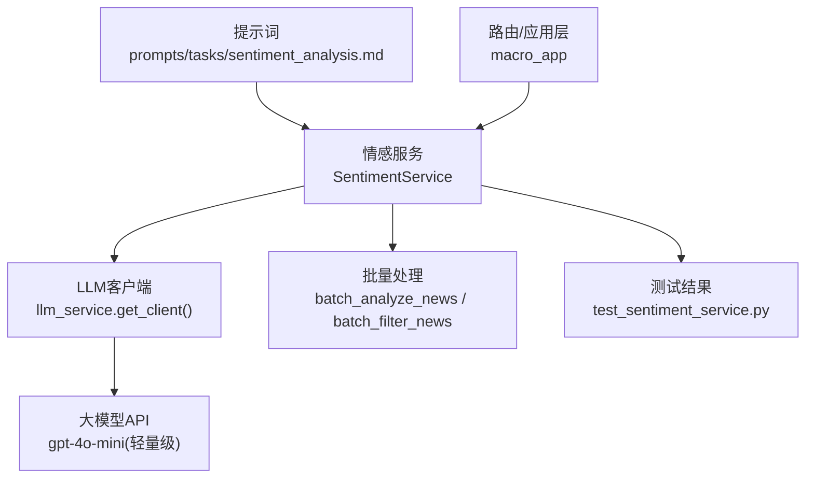
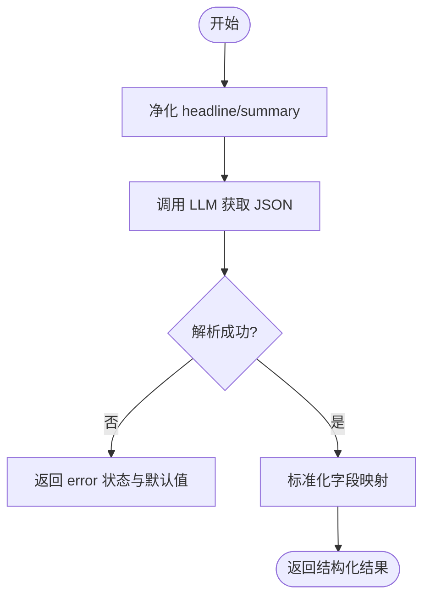
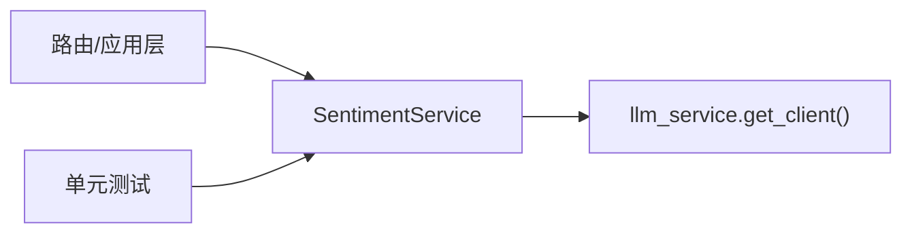

# 情感分析提示词

<cite>
**本文引用的文件**
- [prompts/tasks/sentiment_analysis.md](file://prompts/tasks/sentiment_analysis.md)
- [backend/services/macro/sentiment_service.py](file://backend/services/macro/sentiment_service.py)
- [backend/tests/test_sentiment_service.py](file://backend/tests/test_sentiment_service.py)
- [backend/tests/test_router_macro_extra.py](file://backend/tests/test_router_macro_extra.py)
</cite>

## 目录
1. [简介](#简介)
2. [项目结构](#项目结构)
3. [核心组件](#核心组件)
4. [架构总览](#架构总览)
5. [详细组件分析](#详细组件分析)
6. [依赖关系分析](#依赖关系分析)
7. [性能考量](#性能考量)
8. [故障排查指南](#故障排查指南)
9. [结论](#结论)
10. [附录：示例输入输出与评估要点](#附录示例输入输出与评估要点)

## 简介
本技术文档围绕“金融新闻情感分析”的提示词设计与实现，系统化说明输入变量、输出格式规范、评分与标签判定依据、推理过程要求（reasoning）与中文摘要生成（summary_zh），并提供调试技巧与常见问题解决方案。该能力由后端服务调用轻量级大模型完成，强调稳定、可解析的 JSON 输出与鲁棒的异常处理。

## 项目结构
- 提示词定义位于 prompts/tasks/sentiment_analysis.md，明确任务目标、输入变量与输出字段约束。
- 后端服务实现位于 backend/services/macro/sentiment_service.py，封装了单条/批量新闻的情感打分、过滤与并发处理逻辑。
- 测试覆盖位于 backend/tests/test_sentiment_service.py，验证 JSON 清洗、错误降级、并发健壮性与提示注入防护等关键路径。
- 集成用例可见 backend/tests/test_router_macro_extra.py，展示宏观新闻接口如何附加 sentiment 字段并返回给上层。



图表来源
- [prompts/tasks/sentiment_analysis.md:1-25](file://prompts/tasks/sentiment_analysis.md#L1-L25)
- [backend/services/macro/sentiment_service.py:8-86](file://backend/services/macro/sentiment_service.py#L8-L86)
- [backend/tests/test_sentiment_service.py:52-115](file://backend/tests/test_sentiment_service.py#L52-L115)

章节来源
- [prompts/tasks/sentiment_analysis.md:1-25](file://prompts/tasks/sentiment_analysis.md#L1-L25)
- [backend/services/macro/sentiment_service.py:8-171](file://backend/services/macro/sentiment_service.py#L8-L171)
- [backend/tests/test_sentiment_service.py:1-209](file://backend/tests/test_sentiment_service.py#L1-L209)
- [backend/tests/test_router_macro_extra.py:150-165](file://backend/tests/test_router_macro_extra.py#L150-L165)

## 核心组件
- 提示词（Prompt）：定义任务角色、输入变量 headline/summary、输出 JSON 字段 score/label/reasoning/summary_zh，以及严格的取值范围与枚举约束。
- 情感服务（SentimentService）：
  - analyze_news_sentiment：对单条新闻进行安全净化、构造用户消息、调用 LLM、清理 Markdown 围栏、解析 JSON 并标准化返回。
  - batch_filter_news：基于 LLM 从一批标题中筛选“重要新闻”，返回显著索引列表。
  - batch_analyze_news：并发对多条新闻执行情感打分，容错单条失败，不阻断整体流程。
- 测试套件：覆盖成功路径、Markdown 围栏剥离、空内容/异常降级、提示注入防护、批量并发与单条异常隔离等。

章节来源
- [prompts/tasks/sentiment_analysis.md:5-24](file://prompts/tasks/sentiment_analysis.md#L5-L24)
- [backend/services/macro/sentiment_service.py:27-86](file://backend/services/macro/sentiment_service.py#L27-L86)
- [backend/services/macro/sentiment_service.py:88-167](file://backend/services/macro/sentiment_service.py#L88-L167)
- [backend/tests/test_sentiment_service.py:52-115](file://backend/tests/test_sentiment_service.py#L52-L115)

## 架构总览
情感分析的数据流如下：
- 输入：headline（必需）、summary（可选）。
- 处理：系统提示词 + 用户消息（XML 包裹的安全文本）→ LLM 强制 JSON 输出 → 服务端清洗与解析 → 标准化结果。
- 输出：JSON 对象 {score, label, reasoning, summary_zh}；异常时返回 error 状态与默认值。

```mermaid
sequenceDiagram
participant U as "调用方"
participant S as "SentimentService"
participant L as "LLM客户端"
participant M as "大模型API"
U->>S : "analyze_news_sentiment(headline, summary)"
S->>S : "安全净化 headline/summary"
S->>L : "chat.completions.create(system_prompt + user_content)"
L->>M : "请求(temperature=0, response_format=json_object)"
M-->>L : "choices[0].message.content(JSON字符串)"
L-->>S : "原始响应"
S->>S : "去除
```json 围栏并 strip"
    S->>S: "json.loads -> 标准化{status,score,label,reasoning,summary_zh}"
    S-->>U: "返回结构化结果"
```

图表来源
- [backend/services/macro/sentiment_service.py:27-86](file://backend/services/macro/sentiment_service.py#L27-L86)

## 详细组件分析

### 提示词设计（sentiment_analysis.md）
- 输入变量
  - headline：string，新闻标题（必填）
  - summary：string，新闻摘要（可选）
- 输出格式（严格 JSON）
  - score：int，范围 -100 到 100，负向越极端越接近 -100，正向越极端越接近 100，0 表示完全中性
  - label：enum，仅允许 "Bullish"、"Bearish"、"Neutral"
  - reasoning：string，用一句话中文解释打分与标签的依据
  - summary_zh：string，专业简短的中文新闻摘要
- 约束与风格
  - 禁止使用 Markdown 代码块（如 ```json），直接输出裸 JSON
  - 温度设为 0 以保证稳定性（在服务端调用处设置）

章节来源
- [prompts/tasks/sentiment_analysis.md:5-24](file://prompts/tasks/sentiment_analysis.md#L5-L24)

### 情感服务实现（SentimentService）
- 安全净化
  - 将 < > 替换为《》，移除 ```，防止间接提示注入与上下文截断
- 调用策略
  - 使用轻量级模型（ModelTier.LIGHTWEIGHT），temperature=0，response_format=json_object 强制 JSON
- 结果清洗
  - 去除前后空白与不可见换行符
  - 自动剥离 ```json 或 ``` 围栏
  - 解析 JSON 后映射为标准字段，缺失字段提供默认值
- 异常处理
  - 捕获异常记录失败指标，返回 status="error"，score=0，label="Neutral"，reasoning 包含错误信息
- 批量能力
  - batch_filter_news：按重要性筛选新闻标题，返回显著索引数组
  - batch_analyze_news：并发处理，单条异常不影响其他条目，保留原对象



图表来源
- [backend/services/macro/sentiment_service.py:27-86](file://backend/services/macro/sentiment_service.py#L27-L86)

章节来源
- [backend/services/macro/sentiment_service.py:8-171](file://backend/services/macro/sentiment_service.py#L8-L171)
- [backend/tests/test_sentiment_service.py:52-115](file://backend/tests/test_sentiment_service.py#L52-L115)

### 批量过滤与并发分析
- 批量过滤
  - 通过提示词区分“重大事件”与“例行公告”，返回显著索引列表
  - 异常时优雅降级，返回原始新闻列表
- 并发分析
  - 使用 asyncio.gather 并发请求，return_exceptions=True 保证部分失败不中断
  - 单条异常在内部被吞掉并返回 error 状态，外层继续收集结果

章节来源
- [backend/services/macro/sentiment_service.py:88-167](file://backend/services/macro/sentiment_service.py#L88-L167)
- [backend/tests/test_sentiment_service.py:158-202](file://backend/tests/test_sentiment_service.py#L158-L202)

### 集成与路由
- 宏观新闻接口在返回数据中附加 sentiment 字段，包含 score、label、summary_zh、reasoning
- 测试用例展示了典型返回结构与字段校验

章节来源
- [backend/tests/test_router_macro_extra.py:150-165](file://backend/tests/test_router_macro_extra.py#L150-L165)

## 依赖关系分析
- SentimentService 依赖 llm_service 提供的客户端与模型选择（轻量级）
- 测试通过 Mock 客户端模拟 LLM 响应，验证 JSON 清洗、异常降级与并发行为
- 路由层消费 SentimentService 的结果，将其嵌入宏观新闻数据中



图表来源
- [backend/services/macro/sentiment_service.py:8-12](file://backend/services/macro/sentiment_service.py#L8-L12)
- [backend/tests/test_sentiment_service.py:24-36](file://backend/tests/test_sentiment_service.py#L24-L36)

章节来源
- [backend/services/macro/sentiment_service.py:8-12](file://backend/services/macro/sentiment_service.py#L8-L12)
- [backend/tests/test_sentiment_service.py:24-36](file://backend/tests/test_sentiment_service.py#L24-L36)

## 性能考量
- 使用轻量级模型与 temperature=0 提升稳定性与降低成本
- 批量并发处理提高吞吐，同时控制单条异常不影响整体
- 避免不必要的重试与冗余解析，减少网络与 CPU 开销

## 故障排查指南
- 常见错误与定位
  - LLM 返回空内容：检查 response.choices[0].message.content 是否为空，确认 API 可用与配额
  - JSON 解析失败：确认是否已正确剥离 ```json 围栏；必要时增加日志打印 raw_json
  - 提示注入风险：确保 headline/summary 中的 < > ``` 已被净化
  - 批量处理异常：查看单条异常是否在内部被捕获并返回 error 状态
- 调试技巧
  - 在 analyze_news_sentiment 中打印 safe_headline/safe_summary 与 raw_json，便于复现问题
  - 使用单元测试快速验证不同边界情况（空内容、Markdown 围栏、异常路径）
- 常见问题与解决
  - 模糊情感：通过调整 prompt 强化“积极/消极/中性”的判断标准，并在 reasoning 中要求给出依据
  - 多义词识别：在 prompt 中强调结合 headline 与 summary 的上下文，避免孤立判断
  - 输出不稳定：保持 temperature=0 与 response_format=json_object，确保 JSON 稳定性

章节来源
- [backend/services/macro/sentiment_service.py:27-86](file://backend/services/macro/sentiment_service.py#L27-L86)
- [backend/tests/test_sentiment_service.py:72-115](file://backend/tests/test_sentiment_service.py#L72-L115)

## 结论
该情感分析方案以明确的提示词约束与严格的 JSON 输出为核心，配合安全净化、异常降级与批量并发能力，满足金融新闻场景下的高可靠、低成本与可扩展需求。通过完善的测试覆盖与清晰的错误处理，能够在生产环境中稳定运行。

## 附录：示例输入输出与评估要点

- 输入变量
  - headline：string，例如“公司发布Q2财报：营收超预期”
  - summary：string（可选），例如“净利润同比增长30%”

- 输出格式（JSON）
  - score：int，范围 -100 到 100
  - label：enum，仅 "Bullish"、"Bearish"、"Neutral"
  - reasoning：string，一句话中文解释打分与标签依据
  - summary_zh：string，专业简短的中文摘要

- 示例输入输出（来自测试与集成用例）
  - 示例1（积极）
    - 输入：headline="公司发布财报", summary="营收同比增长30%"
    - 输出：{"score": 80, "label": "Bullish", "reasoning": "营收超预期", "summary_zh": "公司发布强劲财报"}
  - 示例2（消极）
    - 输入：headline="公司亏损", summary="净利润大幅下滑"
    - 输出：{"score": -50, "label": "Bearish", "reasoning": "亏损", "summary_zh": "业绩下滑"}
  - 示例3（中性）
    - 输入：headline="董事会会议召开日期", summary=""
    - 输出：{"score": 0, "label": "Neutral", "reasoning": "例行公告", "summary_zh": "无新数据披露"}
  - 示例4（集成用例）
    - 输入：headline="AI stocks rally", summary=""
    - 输出：{"score": 80, "label": "Bullish", "reasoning": "需求强劲", "summary_zh": "AI股大涨"}

- 评估标准与判断依据
  - 积极（Bullish）：正面财务表现、增长预期、利好政策或产品发布等
  - 消极（Bearish）：负面财务表现、监管调查、重大不利事件等
  - 中性（Neutral）：例行公告、无实质影响的信息、平衡性报道
  - 评分区间：-100（极度看跌）至 100（极度看涨），0 为完全中性
  - reasoning：必须用一句话中文说明打分与标签的理由，便于审计与回溯
  - summary_zh：专业、简洁的中文摘要，便于快速理解

- 调试与常见问题
  - 模糊情感：在 prompt 中强化上下文结合 headline/summary，并要求 reasoning 明确指出关键因素
  - 多义词识别：强调结合行业与语境，避免字面误判
  - 输出稳定性：保持 temperature=0 与 response_format=json_object；若出现 Markdown 围栏，服务会自动剥离
  - 异常处理：空内容或解析失败时返回 error 状态与默认值，便于上层降级与告警

章节来源
- [backend/tests/test_sentiment_service.py:52-115](file://backend/tests/test_sentiment_service.py#L52-L115)
- [backend/tests/test_router_macro_extra.py:150-165](file://backend/tests/test_router_macro_extra.py#L150-L165)