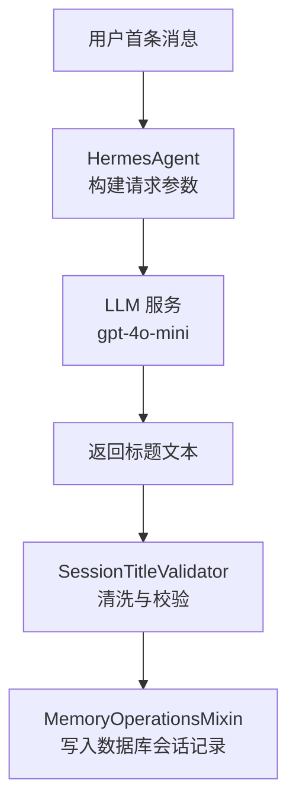
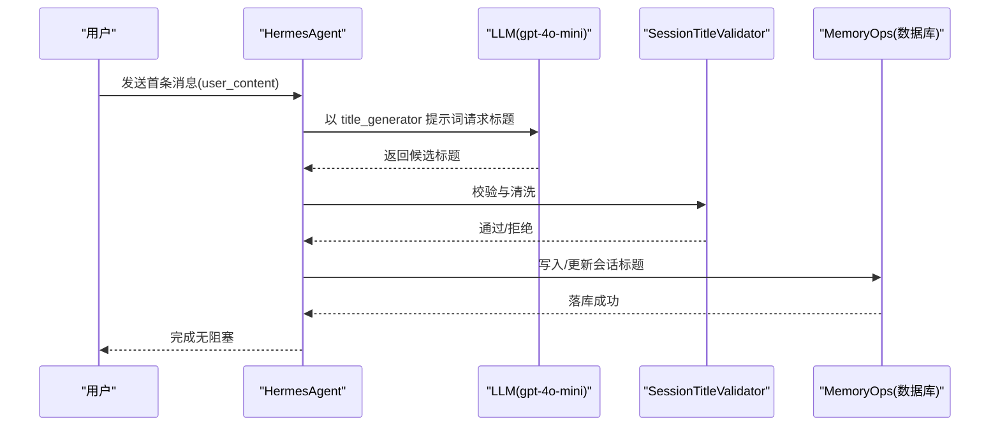
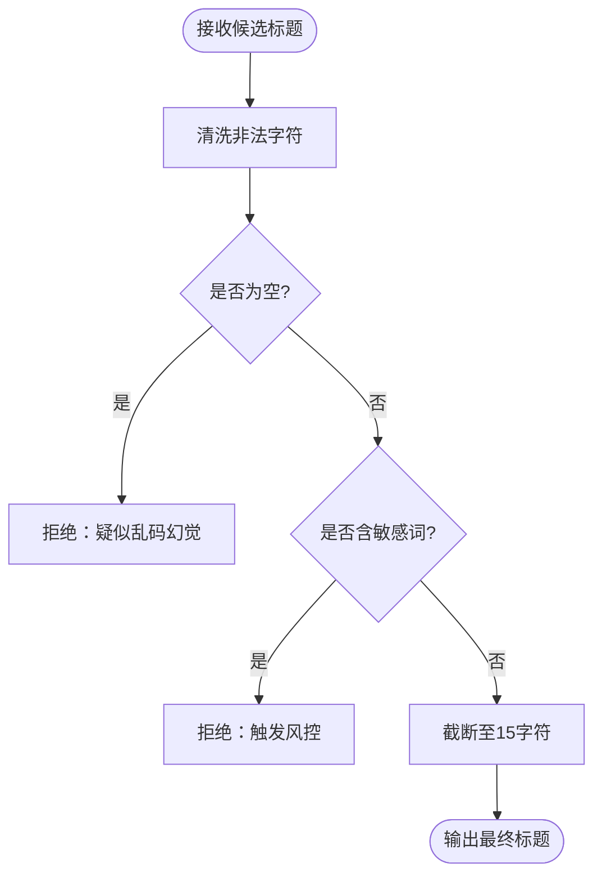
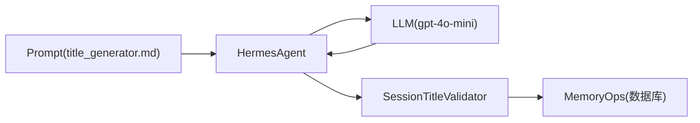

# 标题生成提示词

<cite>
**本文引用的文件**
- [prompts/tasks/title_generator.md](file://prompts/tasks/title_generator.md)
- [prompts/README.md](file://prompts/README.md)
- [prompts/templates/_template.md](file://prompts/templates/_template.md)
- [hermes_agent/agent.py](file://hermes_agent/agent.py)
- [hermes_agent/memory_ops.py](file://hermes_agent/memory_ops.py)
</cite>

## 目录
1. [简介](#简介)
2. [项目结构](#项目结构)
3. [核心组件](#核心组件)
4. [架构总览](#架构总览)
5. [详细组件分析](#详细组件分析)
6. [依赖关系分析](#依赖关系分析)
7. [性能与约束](#性能与约束)
8. [平台适配策略](#平台适配策略)
9. [创意生成技巧](#创意生成技巧)
10. [场景化示例](#场景化示例)
11. [A/B测试与效果评估](#ab测试与效果评估)
12. [故障排查指南](#故障排查指南)
13. [结论](#结论)

## 简介
本技术文档围绕“会话标题生成”的提示词设计与工程实现，系统化阐述目标、约束、流程与优化方法。该能力用于在用户发起对话后，基于首条消息自动生成极简、专业的中文会话标题，便于后续会话管理与检索。当前实现采用任务级 Prompt（位于 prompts/tasks/title_generator.md），由 Hermes Agent 在会话生命周期中调用并持久化到数据库。

## 项目结构
- 提示词管理
  - 任务级 Prompt：prompts/tasks/title_generator.md
  - Prompt 规范与索引：prompts/README.md
  - 模板：prompts/templates/_template.md
- 运行时集成
  - Agent 主脑与流式处理：hermes_agent/agent.py
  - 会话存储与标题落库：hermes_agent/memory_ops.py

**图表来源**
- [hermes_agent/agent.py:70-97](file://hermes_agent/agent.py#L70-L97)
- [hermes_agent/agent.py:38-57](file://hermes_agent/agent.py#L38-L57)
- [hermes_agent/memory_ops.py:250-265](file://hermes_agent/memory_ops.py#L250-L265)

**章节来源**
- [prompts/tasks/title_generator.md:1-15](file://prompts/tasks/title_generator.md#L1-L15)
- [prompts/README.md:1-58](file://prompts/README.md#L1-L58)
- [prompts/templates/_template.md:1-22](file://prompts/templates/_template.md#L1-L22)
- [hermes_agent/agent.py:38-57](file://hermes_agent/agent.py#L38-L57)
- [hermes_agent/memory_ops.py:250-265](file://hermes_agent/memory_ops.py#L250-L265)

## 核心组件
- 任务级提示词（title_generator.md）
  - 目标模型：gpt-4o-mini
  - 输入变量：user_content（用户首条消息）
  - 输出格式：纯文本，不超过3个词或10个汉字
  - 行为约束：严禁标点、引号或其他解释性文字；使用极简、专业中文精准总结
- 标题校验器（SessionTitleValidator）
  - 敏感词拦截
  - 乱码清洗：仅保留中文、英文字母、数字及基础空格/横线
  - 长度硬限制：截断至15字符
- 会话持久化（memory_ops.py）
  - 将生成的标题写入 AgentSession 表，若为新建会话则一并写入 messages

**章节来源**
- [prompts/tasks/title_generator.md:1-15](file://prompts/tasks/title_generator.md#L1-L15)
- [hermes_agent/agent.py:38-57](file://hermes_agent/agent.py#L38-L57)
- [hermes_agent/memory_ops.py:250-265](file://hermes_agent/memory_ops.py#L250-L265)

## 架构总览
标题生成在 Hermes Agent 的 ReAct 循环之外作为独立任务执行：当检测到需要生成标题时，构造最小上下文（仅 user_content），调用 LLM 获取标题，经校验器清洗后落库。

**图表来源**
- [hermes_agent/agent.py:70-97](file://hermes_agent/agent.py#L70-L97)
- [hermes_agent/agent.py:38-57](file://hermes_agent/agent.py#L38-L57)
- [hermes_agent/memory_ops.py:250-265](file://hermes_agent/memory_ops.py#L250-L265)

## 详细组件分析

### 提示词设计（title_generator.md）
- 角色设定：标题生成器
- 语言风格：极简、专业中文
- 长度约束：不超过3个词或10个汉字
- 输出约束：纯文本，禁止标点、引号与解释性文字
- 输入变量：user_content（string）
- 目标模型：gpt-4o-mini

该提示词强调“精准总结”，避免冗余信息，确保标题可被快速识别与检索。

**章节来源**
- [prompts/tasks/title_generator.md:1-15](file://prompts/tasks/title_generator.md#L1-L15)

### 标题校验器（SessionTitleValidator）
- 敏感词拦截：命中即拒绝
- 乱码清洗：仅保留中文、英文字母、数字、空格与横线
- 长度限制：最多15字符（进一步保证显示一致性）
- 异常处理：清洗后为空或触发风控时抛出错误，阻断落库

**图表来源**
- [hermes_agent/agent.py:38-57](file://hermes_agent/agent.py#L38-L57)

**章节来源**
- [hermes_agent/agent.py:38-57](file://hermes_agent/agent.py#L38-L57)

### 会话持久化（memory_ops.py）
- 写入逻辑：若会话存在则更新 messages 与 title；否则新建记录并写入 messages 与 title
- 事务与并发：通过异步线程封装 DB 操作，降低对主循环的影响
- 容错：捕获异常并降级打印，避免阻塞主流程

**章节来源**
- [hermes_agent/memory_ops.py:250-265](file://hermes_agent/memory_ops.py#L250-L265)

## 依赖关系分析
- 提示词层：title_generator.md 定义任务语义与约束
- 运行层：HermesAgent 负责构建请求参数、调用 LLM、组装结果
- 校验层：SessionTitleValidator 保障输出质量与安全
- 存储层：MemoryOperationsMixin 将标题持久化到数据库

**图表来源**
- [prompts/tasks/title_generator.md:1-15](file://prompts/tasks/title_generator.md#L1-L15)
- [hermes_agent/agent.py:70-97](file://hermes_agent/agent.py#L70-L97)
- [hermes_agent/agent.py:38-57](file://hermes_agent/agent.py#L38-L57)
- [hermes_agent/memory_ops.py:250-265](file://hermes_agent/memory_ops.py#L250-L265)

**章节来源**
- [prompts/README.md:1-58](file://prompts/README.md#L1-L58)

## 性能与约束
- 模型选择：gpt-4o-mini，兼顾速度与成本
- 温度设置：低随机性（0.0），确保结果稳定
- 输出长度：严格限制，减少渲染与存储开销
- 清洗策略：正则过滤与长度截断，避免异常数据进入下游
- 并发与超时：数据库写入走异步线程，避免阻塞主循环

**章节来源**
- [hermes_agent/agent.py:70-97](file://hermes_agent/agent.py#L70-L97)
- [hermes_agent/agent.py:38-57](file://hermes_agent/agent.py#L38-L57)

## 平台适配策略
说明：当前实现聚焦于“会话标题”的通用生成，未内置平台差异化策略。可在上层路由或展示层根据平台特性进行二次包装（如社交媒体的更短标题、新闻网站的关键词前置等）。

- 社交媒体：建议更短、更具情绪张力（例如加入感叹或悬念词）
- 新闻网站：建议关键词前置、事实导向（时间、主体、事件）
- 专业论坛：建议术语准确、范围明确（领域、指标、对象）

注意：上述为概念性建议，需在上层业务逻辑中实现，不改变底层提示词与校验器。

[本节为概念性内容，不直接分析具体代码文件]

## 创意生成技巧
说明：当前提示词强调“极简、专业、精准总结”，因此不建议引入过多修辞。以下技巧可作为未来扩展方向，在上层进行二次加工或替换提示词时使用：
- 悬念设置：用省略或疑问句式引导点击（需谨慎控制长度）
- 数字使用：突出关键数值（如涨幅、时间点）提升可读性
- 情感触发词：适度使用正向/负向词汇增强吸引力（需结合风控）

注意：这些技巧可能影响合规性与稳定性，建议在 A/B 测试中验证后再推广。

[本节为概念性内容，不直接分析具体代码文件]

## 场景化示例
说明：以下为概念性示例，展示不同内容类型在“会话标题”上的呈现方式。实际输出受限于“不超过3个词或10个汉字”的约束，应以简洁为主。

- 财经新闻：某公司财报发布、市场波动
- 研究报告：行业趋势、策略回测
- 市场分析：指数走势、资金流向

注意：示例仅为示意，不代表系统当前输出。

[本节为概念性内容，不直接分析具体代码文件]

## A/B测试与效果评估
- 实验设计
  - 对照组：当前提示词（极简、专业）
  - 实验组A：加入悬念/数字/情感词的变体提示词
  - 实验组B：按平台定制（社交媒体/新闻/论坛）
- 评估指标
  - 点击率（CTR）：标题被点击的比例
  - 停留时长：用户阅读时长
  - 转化率：从点击到深入阅读/收藏/分享的比例
  - 合规通过率：敏感词拦截率、违规率
  - 成本与延迟：Token 消耗、响应时延
- 数据采集
  - 埋点：曝光、点击、停留、转化
  - 日志：提示词版本、模型版本、输入摘要
- 迭代策略
  - 小流量灰度 → 逐步放量
  - 显著性检验（A/B 对比）
  - 回归测试：确保校验器与存储链路稳定

[本节为概念性内容，不直接分析具体代码文件]

## 故障排查指南
- 标题为空或被拒绝
  - 检查 SessionTitleValidator 的敏感词与清洗规则
  - 确认 LLM 返回是否包含标点或解释性文字
- 标题过长
  - 校验器已强制截断至15字符，若仍异常，检查上游拼接逻辑
- 落库失败
  - 查看 memory_ops.py 中的异常捕获与降级逻辑
  - 检查数据库连接与事务提交
- 性能问题
  - 关注 TokenGuard 限流与压缩逻辑，避免上下文过大导致延迟

**章节来源**
- [hermes_agent/agent.py:38-57](file://hermes_agent/agent.py#L38-L57)
- [hermes_agent/memory_ops.py:250-265](file://hermes_agent/memory_ops.py#L250-L265)

## 结论
当前标题生成能力以“极简、专业、精准”为核心原则，通过任务级提示词与严格的校验器保障输出质量与安全性，并在会话生命周期中高效持久化。未来可在上层进行平台化适配与创意增强，并通过 A/B 测试持续优化点击率与用户体验。