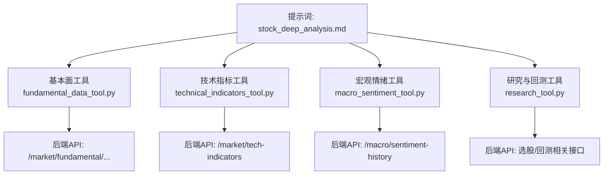
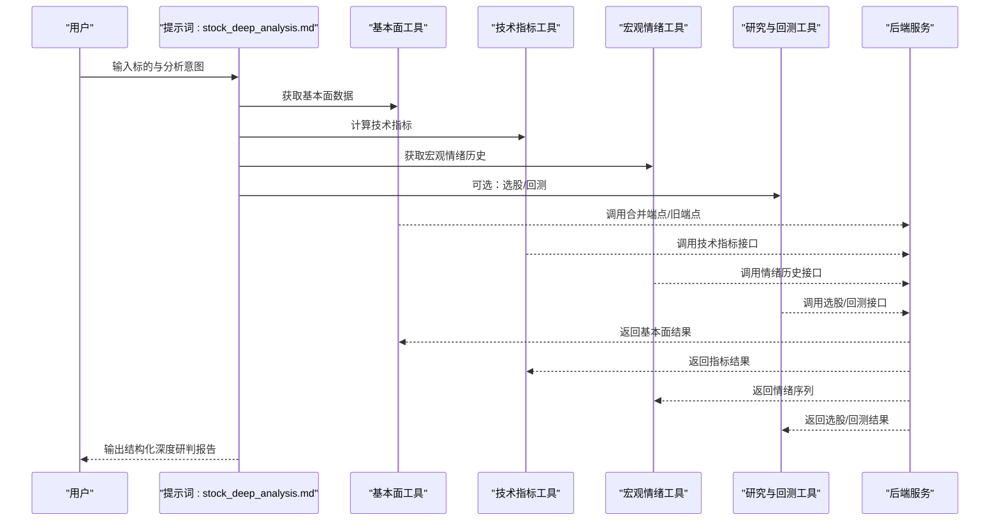
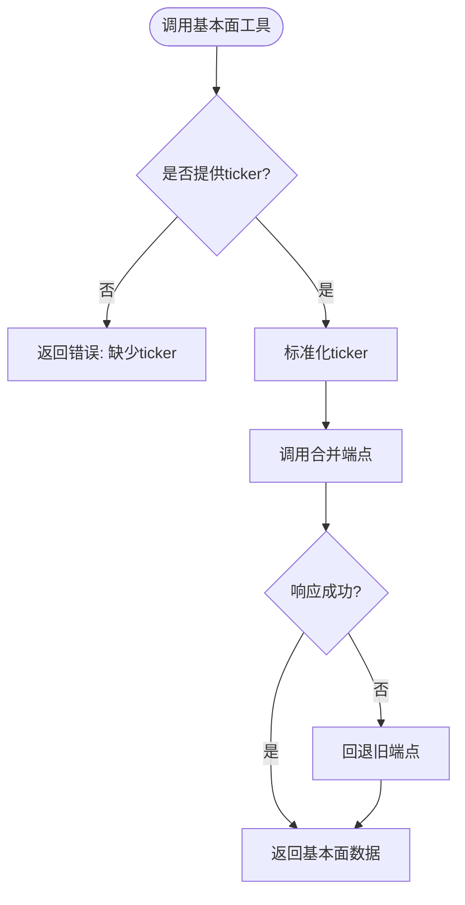
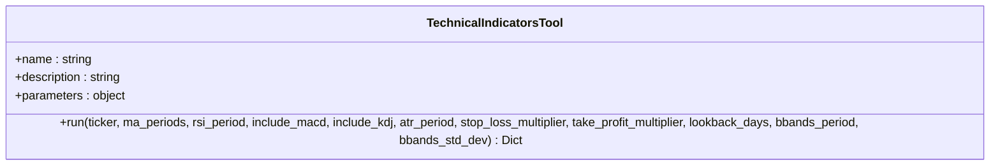
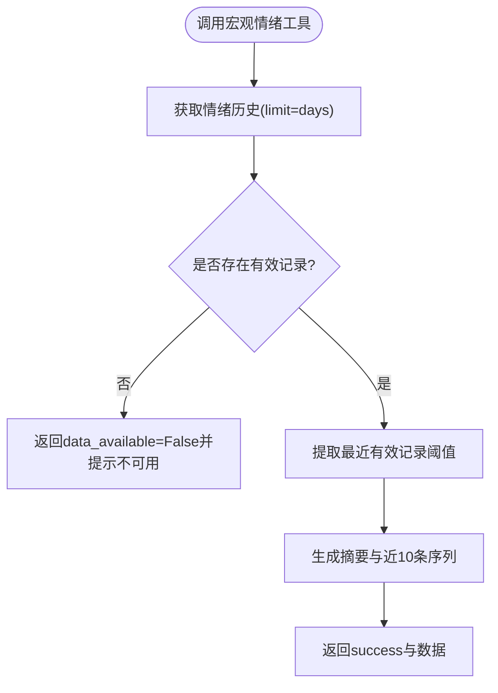
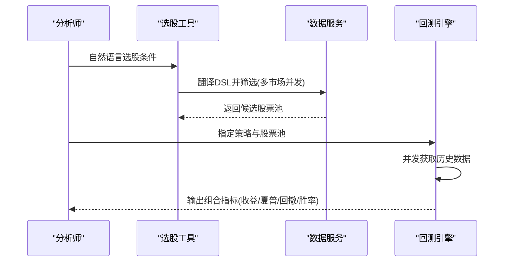
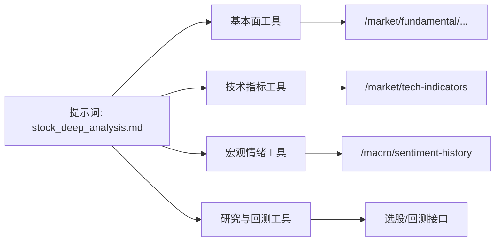

# 深度分析提示词

<cite>
**本文引用的文件**
- [stock_deep_analysis.md](file://prompts/tasks/stock_deep_analysis.md)
- [fundamental_data_tool.py](file://hermes_agent/tools/fundamental_data_tool.py)
- [technical_indicators_tool.py](file://hermes_agent/tools/technical_indicators_tool.py)
- [macro_sentiment_tool.py](file://hermes_agent/tools/macro_sentiment_tool.py)
- [research_tool.py](file://hermes_agent/tools/research_tool.py)
</cite>

## 目录
1. [简介](#简介)
2. [项目结构](#项目结构)
3. [核心组件](#核心组件)
4. [架构总览](#架构总览)
5. [详细组件分析](#详细组件分析)
6. [依赖关系分析](#依赖关系分析)
7. [性能考量](#性能考量)
8. [故障排查指南](#故障排查指南)
9. [结论](#结论)
10. [附录](#附录)

## 简介
本技术文档围绕 prompts/tasks/stock_deep_analysis.md 中的“个股深度研判”任务，系统化说明其研究方法论、分析维度、数据收集要求与报告结构。该提示词定义了从数据采集到收敛输出的标准化流程，并明确五大专家视角（基本面、技术面、宏观、估值、风控）的评估标准与工具调用序列。同时，文档提供不同类型股票（成长股、价值股、周期股）的差异化分析策略，以及基于仓库内工具的端到端实现路径，帮助使用者以统一框架开展高质量、可复现的股票深度研究。

## 项目结构
- 提示词定义位于 prompts/tasks/stock_deep_analysis.md，规定触发条件、分析流程、工具调用顺序、输出模板与降级策略。
- 工具层位于 hermes_agent/tools，封装了后端 API 调用与数据处理逻辑，包括：
  - 基本面数据获取：fundamental_data_tool.py
  - 技术指标计算：technical_indicators_tool.py
  - 宏观情绪历史：macro_sentiment_tool.py
  - 研究与回测辅助：research_tool.py（选股与批量回测）
- 该设计将“提示词驱动的分析流程”与“工具化数据能力”解耦，便于扩展与维护。

图表来源
- [stock_deep_analysis.md:51-90](file://prompts/tasks/stock_deep_analysis.md#L51-L90)
- [fundamental_data_tool.py:23-38](file://hermes_agent/tools/fundamental_data_tool.py#L23-L38)
- [technical_indicators_tool.py:57-86](file://hermes_agent/tools/technical_indicators_tool.py#L57-L86)
- [macro_sentiment_tool.py:32-40](file://hermes_agent/tools/macro_sentiment_tool.py#L32-L40)
- [research_tool.py:32-70](file://hermes_agent/tools/research_tool.py#L32-L70)

章节来源
- [stock_deep_analysis.md:1-222](file://prompts/tasks/stock_deep_analysis.md#L1-L222)

## 核心组件
- 提示词主流程
  - 触发条件：包含标的代码与分析意图的提问或诊断请求。
  - 分析流程：Phase 1 数据采集（并行优先），Phase 2 多维研判（五大专家视角），Phase 3 收敛输出（首席分析师综合）。
  - 工具调用序列：强制必须项（行情、基本面、技术指标、公司新闻、宏观情绪历史），可选项（财报分析、网络搜索）。
  - 输出格式：强制 Markdown 模板，包含执行摘要、基本面评分、技术面信号、宏观与行业关联、估值分析、风险提示、多空因素矩阵、投资建议等章节。
  - 降级策略：当工具失败或数据不完整时，按规则降级并标注数据来源与置信度。
  - 跨市场适配：美股/港股/A股差异化的货币、资金流向与限制关注点。

- 工具组件
  - 基本面数据工具：通过合并端点获取核心指标（PE/PB/ROE/做空比/营收增速等），未部署时回退旧端点。
  - 技术指标工具：拉取历史K线并计算MA/MACD/RSI/KDJ/ATR/布林带等，返回最新截面特征与趋势评分。
  - 宏观情绪工具：获取VIX、P/C Ratio、信用利差的历史序列，进行有效性校验与阈值解读。
  - 研究与回测工具：自然语言选股、筛选后批量回测，输出组合收益、夏普比率、最大回撤等指标。

章节来源
- [stock_deep_analysis.md:51-90](file://prompts/tasks/stock_deep_analysis.md#L51-L90)
- [stock_deep_analysis.md:92-186](file://prompts/tasks/stock_deep_analysis.md#L92-L186)
- [stock_deep_analysis.md:199-221](file://prompts/tasks/stock_deep_analysis.md#L199-L221)
- [fundamental_data_tool.py:9-38](file://hermes_agent/tools/fundamental_data_tool.py#L9-L38)
- [technical_indicators_tool.py:11-86](file://hermes_agent/tools/technical_indicators_tool.py#L11-L86)
- [macro_sentiment_tool.py:9-104](file://hermes_agent/tools/macro_sentiment_tool.py#L9-L104)
- [research_tool.py:20-70](file://hermes_agent/tools/research_tool.py#L20-L70)
- [research_tool.py:84-135](file://hermes_agent/tools/research_tool.py#L84-L135)

## 架构总览
下图展示了“提示词—工具—后端API”的整体交互关系，体现数据采集的并行化与降级机制，以及研究报告的结构化输出。

图表来源
- [stock_deep_analysis.md:51-90](file://prompts/tasks/stock_deep_analysis.md#L51-L90)
- [fundamental_data_tool.py:23-38](file://hermes_agent/tools/fundamental_data_tool.py#L23-L38)
- [technical_indicators_tool.py:57-86](file://hermes_agent/tools/technical_indicators_tool.py#L57-L86)
- [macro_sentiment_tool.py:32-40](file://hermes_agent/tools/macro_sentiment_tool.py#L32-L40)
- [research_tool.py:32-70](file://hermes_agent/tools/research_tool.py#L32-L70)

## 详细组件分析

### 提示词主流程与报告结构
- 触发条件与不适用场景：明确何时启动深度分析，避免与纯选股或纯技术画图混淆。
- 分析流程三阶段：
  - Phase 1 数据采集：并行优先，确保硬数据与上下文同步获取。
  - Phase 2 多维研判：五大专家视角依次生成，保证全面性与专业性。
  - Phase 3 收敛输出：首席分析师综合，识别共识与分歧，给出可操作建议。
- 工具调用序列：
  - 必须项：行情快照、基本面核心指标、技术指标、公司新闻、宏观情绪历史。
  - 可选项：财报分析（本地缓存）、网络搜索（补充缺失信息）。
- 输出报告格式：
  - 执行摘要：用三句话概括估值状态、技术信号与建议动作。
  - 基本面评分：表格展示关键指标与行业均值对比，附诊断总结。
  - 技术面信号：趋势、支撑压力、量价关系、关键指标与确认/待确认信号。
  - 宏观与行业关联：行业周期、政策影响、事件风险、资金流向。
  - 估值分析：三档情景（悲观/中性/乐观），安全边际与同业对比。
  - 风险提示：不可省略，列出概率与影响，给出止损位与最大回撤估计。
  - 多空因素矩阵：权重对比，明确力量对比。
  - 投资建议：看涨概率、动作、仓位、入场条件、止盈止损、持有周期、置信度。
- 降级策略与完整性规则：
  - 各工具失败时的降级方案与标注要求。
  - 风险提示绝对不可省略；数值单位与行业数据缺失标注规范。
- 跨市场适配：
  - 美股/港股/A股的货币、资金流向与交易限制差异。

章节来源
- [stock_deep_analysis.md:36-90](file://prompts/tasks/stock_deep_analysis.md#L36-L90)
- [stock_deep_analysis.md:92-186](file://prompts/tasks/stock_deep_analysis.md#L92-L186)
- [stock_deep_analysis.md:199-221](file://prompts/tasks/stock_deep_analysis.md#L199-L221)

### 基本面数据工具
- 职责：获取标的的核心基本面与筹码博弈数据，用于估值泡沫与轧空风险判断。
- 参数与行为：
  - 必需 ticker，自动标准化。
  - 优先调用合并端点，失败时回退旧单源端点。
  - 限流感知请求，超时控制。
- 适用场景：支持 PE/PB/ROE/做空比/营收增速等指标，为估值与风控提供依据。

图表来源
- [fundamental_data_tool.py:23-38](file://hermes_agent/tools/fundamental_data_tool.py#L23-L38)

章节来源
- [fundamental_data_tool.py:9-38](file://hermes_agent/tools/fundamental_data_tool.py#L9-L38)

### 技术指标工具
- 职责：拉取历史K线并进行矩阵级技术指标计算，返回最新截面特征与趋势评分。
- 参数与行为：
  - 支持 MA、RSI、MACD、KDJ、ATR、布林带等。
  - 可配置 lookback_days 以观察短期趋势。
  - 限流感知请求，超时控制。
- 适用场景：为技术面信号与支撑压力判断提供精确数值，避免大模型自行口算。

图表来源
- [technical_indicators_tool.py:11-86](file://hermes_agent/tools/technical_indicators_tool.py#L11-L86)

章节来源
- [technical_indicators_tool.py:11-86](file://hermes_agent/tools/technical_indicators_tool.py#L11-L86)

### 宏观情绪工具
- 职责：获取近期市场情绪真实历史序列（VIX、P/C Ratio、Credit Spread），并进行有效性校验。
- 参数与行为：
  - days 默认30，limit上限2000。
  - 若所有记录核心字段为空，返回 data_available=False 并提示不可用。
  - 提取最近有效记录的阈值供 LLM 研判。
- 适用场景：宏观策略师视角的行业周期、政策影响与资金流向判断。

图表来源
- [macro_sentiment_tool.py:32-104](file://hermes_agent/tools/macro_sentiment_tool.py#L32-L104)

章节来源
- [macro_sentiment_tool.py:9-104](file://hermes_agent/tools/macro_sentiment_tool.py#L9-L104)

### 研究与回测工具
- 职责：自然语言选股与批量回测，辅助形成最终投研建议。
- 选股流程：
  - 将自然语言翻译为DSL，解析为多市场过滤条件。
  - 并发调用数据服务筛选，应用技术形态过滤与ST剔除。
  - 返回候选股票池与代码数组。
- 批量回测流程：
  - 读取策略源码，提取类名。
  - 并发获取历史数据，执行沙箱回测。
  - 输出组合收益率、夏普比率、最大回撤、胜率与交易次数。
- 适用场景：在深度分析中作为增强手段，验证策略可行性与历史表现。

图表来源
- [research_tool.py:32-70](file://hermes_agent/tools/research_tool.py#L32-L70)
- [research_tool.py:84-135](file://hermes_agent/tools/research_tool.py#L84-L135)

章节来源
- [research_tool.py:20-70](file://hermes_agent/tools/research_tool.py#L20-L70)
- [research_tool.py:84-135](file://hermes_agent/tools/research_tool.py#L84-L135)

## 依赖关系分析
- 提示词对工具的依赖：
  - 必须依赖：行情、基本面、技术指标、公司新闻、宏观情绪历史。
  - 可选依赖：财报分析、网络搜索。
- 工具对后端API的依赖：
  - 基本面：合并端点/旧端点。
  - 技术指标：/market/tech-indicators。
  - 宏观情绪：/macro/sentiment-history。
  - 研究与回测：选股与回测相关接口。
- 耦合与内聚：
  - 提示词负责流程编排与输出规范，工具负责数据获取与处理，后端API提供稳定数据源，层次清晰、内聚度高。
- 外部依赖与集成点：
  - 限流与重试：工具层具备限流感知与超时控制。
  - 降级策略：工具失败时回退或降级，保障报告完整性。

图表来源
- [stock_deep_analysis.md:51-90](file://prompts/tasks/stock_deep_analysis.md#L51-L90)
- [fundamental_data_tool.py:23-38](file://hermes_agent/tools/fundamental_data_tool.py#L23-L38)
- [technical_indicators_tool.py:57-86](file://hermes_agent/tools/technical_indicators_tool.py#L57-L86)
- [macro_sentiment_tool.py:32-40](file://hermes_agent/tools/macro_sentiment_tool.py#L32-L40)
- [research_tool.py:32-70](file://hermes_agent/tools/research_tool.py#L32-L70)

章节来源
- [stock_deep_analysis.md:51-90](file://prompts/tasks/stock_deep_analysis.md#L51-L90)

## 性能考量
- 并行采集：提示词要求工具1-3尽量并行调用，减少等待时间，提升整体效率。
- 限流与超时：工具层使用限流感知请求与超时控制，避免阻塞与资源浪费。
- 数据有效性校验：宏观情绪工具对空数据进行快速判定，避免无效计算与误导。
- 降级策略：在数据不足时快速降级，保证报告基本完整性，降低失败成本。
- 可扩展性：新增工具或后端接口时，可在不改动提示词主流程的情况下扩展能力。

[本节为通用指导，无需具体文件引用]

## 故障排查指南
- 常见失败与降级：
  - 基本面数据部分缺失：表格中标注 N/A，并在评分处注明置信度降低。
  - 技术指标计算失败：基于价格手动估算简单均线位置，标注为估算值。
  - 公司新闻无结果：跳过新闻章节，并在末尾注明未获取到最新新闻。
  - 宏观情绪历史失败：使用网络搜索替代或标注暂不可用。
  - 所有工具均失败：输出极简版报告，仅含执行摘要与风险提示，并声明数据获取失败。
- 数据源降级策略：
  - 行情数据：网络搜索替代，标注延迟。
  - 基本面数据：旧端点回退。
  - 技术指标：估算值标注。
  - 情绪历史：空数据提示与阈值缺失说明。
- 报告完整性规则：
  - 风险提示不可省略。
  - 估值分析至少给出定性判断。
  - 数值单位与行业数据缺失标注规范。

章节来源
- [stock_deep_analysis.md:199-215](file://prompts/tasks/stock_deep_analysis.md#L199-L215)

## 结论
stock_deep_analysis.md 提供了一个严谨、可执行的个股深度分析框架，结合工具层的稳定数据能力，实现了从数据采集、多维研判到收敛输出的全链路标准化。通过五大专家视角与强制报告模板，确保分析的专业性与一致性；通过降级策略与跨市场适配，提升鲁棒性与适用范围。配合研究与回测工具，可在深度分析基础上进一步验证策略可行性，形成闭环的投研工作流。

[本节为总结，无需具体文件引用]

## 附录

### 不同类型股票的差异化分析策略
- 成长股
  - 重点：营收与净利增速、ROE 趋势、现金流健康度、估值扩张空间。
  - 技术面：动量与趋势确认，关注突破与放量。
  - 宏观与行业：高景气赛道与政策支持。
  - 估值：DCF 与相对估值并重，关注增长可持续性。
  - 风控：高波动下的止损与仓位管理。
- 价值股
  - 重点：低 PE/PB、稳定分红、现金流充裕。
  - 技术面：底部区域与均值回归信号。
  - 宏观与行业：防御属性与经济周期尾部。
  - 估值：安全边际充足，情景分析保守。
  - 风控：尾部风险与流动性风险。
- 周期股
  - 重点：行业周期位置、产能利用率、库存与价格弹性。
  - 技术面：趋势跟随与拐点确认。
  - 宏观与行业：政策与供需变化。
  - 估值：相对估值为主，关注盈利弹性。
  - 风控：周期下行风险与杠杆约束。

[本节为概念性内容，无需具体文件引用]

### 实际案例分析演示（步骤指引）
- 数据准备
  - 调用基本面工具获取核心指标。
  - 调用技术指标工具计算关键指标与趋势评分。
  - 调用宏观情绪工具获取 VIX、P/C Ratio、信用利差历史。
  - 如需要，调用网络搜索补充行业与公告信息。
- 多维研判
  - 基本面分析师：三表质量、盈利能力、现金流健康度。
  - 技术面分析师：趋势、支撑压力、量价关系、动量指标。
  - 宏观策略师：行业周期、政策影响、资金流向。
  - 估值专家：绝对/相对估值、安全边际、情景分析。
  - 风控官：尾部风险、流动性风险、集中度风险。
- 收敛输出
  - 首席分析师综合五维度，识别共识与分歧。
  - 输出结构化报告，包含执行摘要、评分、信号、估值、风险、建议。
- 进阶验证
  - 使用研究与回测工具进行选股与批量回测，验证策略历史表现。
  - 根据回测结果调整建议动作与仓位。

章节来源
- [stock_deep_analysis.md:51-90](file://prompts/tasks/stock_deep_analysis.md#L51-L90)
- [stock_deep_analysis.md:92-186](file://prompts/tasks/stock_deep_analysis.md#L92-L186)
- [research_tool.py:32-70](file://hermes_agent/tools/research_tool.py#L32-L70)
- [research_tool.py:84-135](file://hermes_agent/tools/research_tool.py#L84-L135)