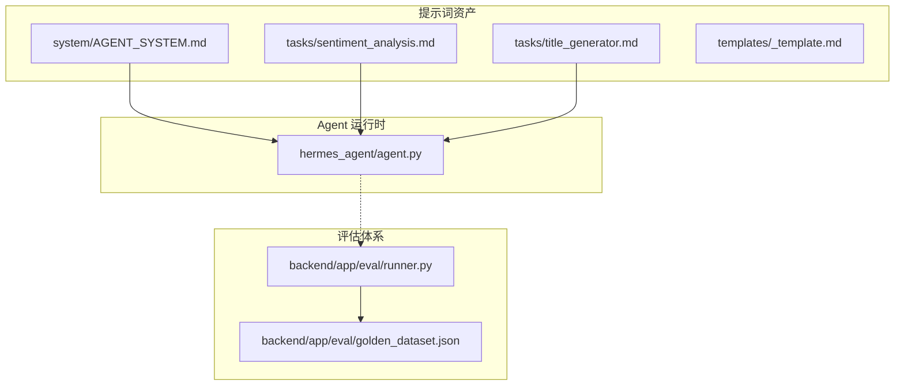
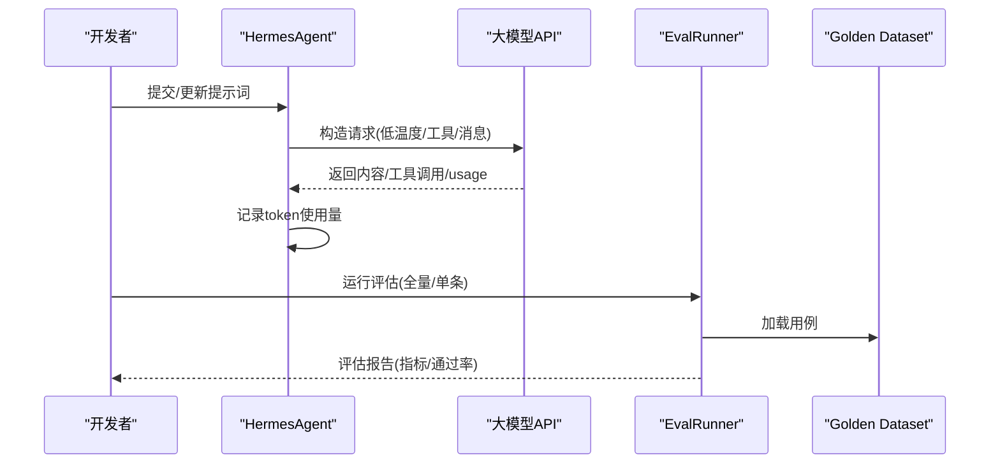
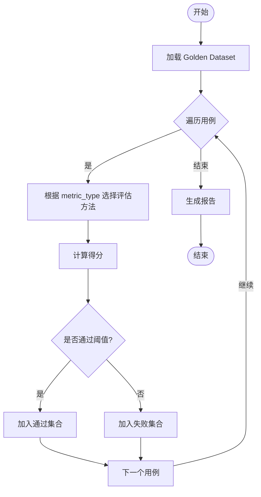
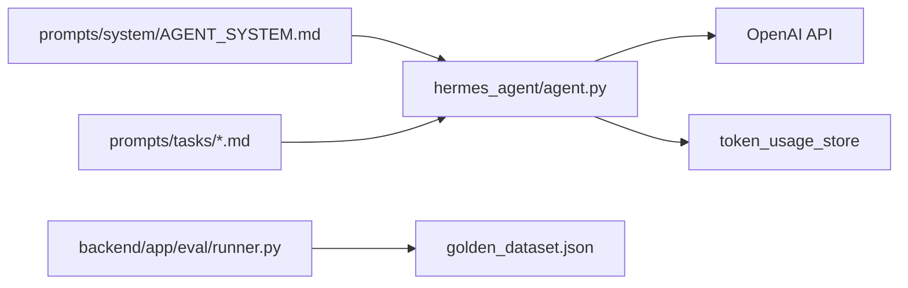

# 提示词优化

<cite>
**本文引用的文件**
- [prompts/README.md](file://prompts/README.md)
- [prompts/system/AGENT_SYSTEM.md](file://prompts/system/AGENT_SYSTEM.md)
- [prompts/tasks/sentiment_analysis.md](file://prompts/tasks/sentiment_analysis.md)
- [prompts/tasks/title_generator.md](file://prompts/tasks/title_generator.md)
- [hermes_agent/agent.py](file://hermes_agent/agent.py)
- [backend/app/eval/runner.py](file://backend/app/eval/runner.py)
- [backend/app/eval/golden_dataset.json](file://backend/app/eval/golden_dataset.json)
</cite>

## 目录
1. [引言](#引言)
2. [项目结构](#项目结构)
3. [核心组件](#核心组件)
4. [架构总览](#架构总览)
5. [详细组件分析](#详细组件分析)
6. [依赖关系分析](#依赖关系分析)
7. [性能调优指南](#性能调优指南)
8. [故障排查与评估](#故障排查与评估)
9. [结论](#结论)
10. [附录：从基础到高级的提示词演进案例](#附录从基础到高级的提示词演进案例)

## 引言
本指南面向在量化与投研场景中持续优化提示词（Prompt）的工程团队，围绕以下目标展开：
- 明确提示词优化的核心原则：关键词选择、结构优化、语义精确性。
- 将 A/B 测试融入提示词迭代：实验设计、效果评估、闭环改进。
- 提供性能调优技巧：响应时间、Token 使用、质量提升策略。
- 建立提示词版本管理：变更追踪、回滚机制、兼容性保证。
- 给出自动化评估工具与人工评审流程，配合仓库现有能力落地。

## 项目结构
仓库中与提示词相关的资产集中在 prompts 目录，并通过 hermes_agent 与后端评估框架进行加载与评测。关键要点：
- 系统级 Prompt：位于 prompts/system，作为 Agent 主脑指令入口。
- 任务级 Prompt：位于 prompts/tasks，用于子模型或专用 LLM 调用。
- 模板：位于 prompts/templates，便于统一结构与变量占位。
- 版本规范：prompts/README.md 规定了元数据、变更流程与索引。
- 运行时加载：hermes_agent/agent.py 定义默认系统 Prompt 路径并驱动 ReAct 循环。
- 评估体系：backend/app/eval 提供 Golden Dataset 与 EvalRunner，支撑指标化评估。

图表来源
- [prompts/system/AGENT_SYSTEM.md:1-8](file://prompts/system/AGENT_SYSTEM.md#L1-L8)
- [prompts/tasks/sentiment_analysis.md:1-25](file://prompts/tasks/sentiment_analysis.md#L1-L25)
- [prompts/tasks/title_generator.md:1-15](file://prompts/tasks/title_generator.md#L1-L15)
- [hermes_agent/agent.py:17-20](file://hermes_agent/agent.py#L17-L20)
- [backend/app/eval/runner.py:21-23](file://backend/app/eval/runner.py#L21-L23)
- [backend/app/eval/golden_dataset.json:1-61](file://backend/app/eval/golden_dataset.json#L1-L61)

章节来源
- [prompts/README.md:1-58](file://prompts/README.md#L1-L58)
- [prompts/system/AGENT_SYSTEM.md:1-8](file://prompts/system/AGENT_SYSTEM.md#L1-L8)
- [hermes_agent/agent.py:17-20](file://hermes_agent/agent.py#L17-L20)
- [backend/app/eval/runner.py:21-23](file://backend/app/eval/runner.py#L21-L23)

## 核心组件
- 提示词版本管理与元数据
  - 每个 Prompt 文件头部包含 id、name、target_model、input_variables、output_format、last_tested、eval_score、changelog 等字段，确保可追溯与可评估。
  - 变更流程要求修改后运行对应 Eval，并在 PR 中附带对比结果，更新 last_tested 与 eval_score。
- Agent 系统指令与加载
  - 系统级 Prompt 通过默认路径加载，Agent 运行时以低温度确保确定性输出。
  - 会话标题生成具备安全清洗与长度限制，避免敏感词与乱码污染上下文。
- 评估框架
  - EvalRunner 读取 Golden Dataset，按 metric_type 执行评估并汇总报告；支持单条与全量运行。
  - Golden Dataset 覆盖数值准确性、引用可追溯、DSL 合规等多类指标，并提供边界与失败用例。

章节来源
- [prompts/README.md:22-58](file://prompts/README.md#L22-L58)
- [prompts/tasks/sentiment_analysis.md:1-25](file://prompts/tasks/sentiment_analysis.md#L1-L25)
- [prompts/tasks/title_generator.md:1-15](file://prompts/tasks/title_generator.md#L1-L15)
- [hermes_agent/agent.py:38-58](file://hermes_agent/agent.py#L38-L58)
- [backend/app/eval/runner.py:25-73](file://backend/app/eval/runner.py#L25-L73)
- [backend/app/eval/golden_dataset.json:1-61](file://backend/app/eval/golden_dataset.json#L1-L61)

## 架构总览
提示词优化贯穿“资产—运行—评估”的闭环：
- 资产层：系统/任务/模板三类 Prompt，遵循统一的元数据与命名规范。
- 运行层：HermesAgent 负责构建请求参数、调用 LLM、记录 Token 用量、执行工具与流式事件分发。
- 评估层：EvalRunner 基于 Golden Dataset 对指标进行打分，形成可比较的报告。

图表来源
- [hermes_agent/agent.py:70-97](file://hermes_agent/agent.py#L70-L97)
- [hermes_agent/agent.py:100-112](file://hermes_agent/agent.py#L100-L112)
- [backend/app/eval/runner.py:56-73](file://backend/app/eval/runner.py#L56-L73)
- [backend/app/eval/golden_dataset.json:1-61](file://backend/app/eval/golden_dataset.json#L1-L61)

## 详细组件分析

### 提示词版本管理与元数据
- 关键字段说明
  - id/name/target_model：唯一标识、名称、目标模型，便于定位与灰度切换。
  - input_variables/output_format：输入变量与输出格式约束，降低解析成本与错误率。
  - last_tested/eval_score/changelog：测试时间、评分与变更记录，支撑回归与审计。
- 变更流程
  - 修改 Prompt → 运行 Eval → PR 附对比 → 更新元数据。
  - 建议将 Eval 纳入 CI，阻断未评估通过的合并。

章节来源
- [prompts/README.md:22-48](file://prompts/README.md#L22-L48)

### 系统级 Prompt 与 Agent 集成
- 加载路径与职责分离
  - 系统级 Prompt 独立于 IDE 编码宪法，避免混用导致行为漂移。
  - HermesAgent 默认加载路径指向 prompts/system/HERMES.md。
- 请求参数与确定性
  - 使用低 temperature 保障输出稳定性，适合量化场景。
  - 仅在流式时附加 stream_options，减少不必要开销。
- 会话标题安全校验
  - 内置敏感词拦截、乱码清洗与长度限制，防止污染上下文与 UI。

章节来源
- [prompts/system/AGENT_SYSTEM.md:1-8](file://prompts/system/AGENT_SYSTEM.md#L1-L8)
- [hermes_agent/agent.py:17-20](file://hermes_agent/agent.py#L17-L20)
- [hermes_agent/agent.py:70-97](file://hermes_agent/agent.py#L70-L97)
- [hermes_agent/agent.py:38-58](file://hermes_agent/agent.py#L38-L58)

### 任务级 Prompt：新闻情感分析与标题生成
- 新闻情感分析
  - 严格 JSON 输出，限定字段类型与取值范围，便于下游解析与度量。
  - 指定 target_model，便于不同模型下的效果对比与回退。
- 会话标题生成
  - 极简中文输出，限制长度与字符集，结合 Pydantic 校验保障健壮性。

章节来源
- [prompts/tasks/sentiment_analysis.md:1-25](file://prompts/tasks/sentiment_analysis.md#L1-L25)
- [prompts/tasks/title_generator.md:1-15](file://prompts/tasks/title_generator.md#L1-L15)
- [hermes_agent/agent.py:38-58](file://hermes_agent/agent.py#L38-L58)

### 评估框架与 Golden Dataset
- 评估运行器
  - 支持全量与单条评估，按 metric_type 路由至相应指标函数。
  - 报告聚合通过率与分类统计，便于趋势观察。
- 数据集设计
  - 覆盖 normal/boundary/failure 三类场景，兼顾功能正确性与鲁棒性。
  - 指标类型包括 numeric_accuracy、citation_traceability、dsl_compliance。

图表来源
- [backend/app/eval/runner.py:25-73](file://backend/app/eval/runner.py#L25-L73)
- [backend/app/eval/golden_dataset.json:1-61](file://backend/app/eval/golden_dataset.json#L1-L61)

章节来源
- [backend/app/eval/runner.py:25-73](file://backend/app/eval/runner.py#L25-L73)
- [backend/app/eval/golden_dataset.json:1-61](file://backend/app/eval/golden_dataset.json#L1-L61)

## 依赖关系分析
- 提示词与 Agent
  - Agent 通过默认路径加载系统 Prompt，任务 Prompt 由具体服务/工具按需加载。
- Agent 与评估
  - 评估不直接依赖 Agent 内部实现，但可通过 Golden Dataset 间接验证 Prompt 效果。
- 外部依赖
  - OpenAI SDK 用于 LLM 调用；Pydantic 用于结构化校验；Redis 用于 Token 用量存储（由 token_usage_store 抽象）。

图表来源
- [hermes_agent/agent.py:17-20](file://hermes_agent/agent.py#L17-L20)
- [hermes_agent/agent.py:100-112](file://hermes_agent/agent.py#L100-L112)
- [backend/app/eval/runner.py:21-23](file://backend/app/eval/runner.py#L21-L23)
- [backend/app/eval/golden_dataset.json:1-61](file://backend/app/eval/golden_dataset.json#L1-L61)

章节来源
- [hermes_agent/agent.py:17-20](file://hermes_agent/agent.py#L17-L20)
- [backend/app/eval/runner.py:21-23](file://backend/app/eval/runner.py#L21-L23)

## 性能调优指南
- 响应时间优化
  - 使用低 temperature 减少发散，提高收敛速度。
  - 仅在需要时启用流式输出，避免额外开销。
  - 控制工具调用数量与复杂度，减少往返次数。
- Token 使用优化
  - 精简 Prompt 与上下文，仅保留必要信息。
  - 利用 output_format 约束输出，降低解析与重试成本。
  - 通过 _record_usage 统一埋点，监控 prompt/completion/total tokens。
- 质量提升策略
  - 明确输入变量与输出格式，减少歧义。
  - 引入结构化校验（如 Pydantic），提前拦截异常。
  - 结合 Golden Dataset 的多指标评估，持续校准。

章节来源
- [hermes_agent/agent.py:70-97](file://hermes_agent/agent.py#L70-L97)
- [hermes_agent/agent.py:100-112](file://hermes_agent/agent.py#L100-L112)
- [prompts/tasks/sentiment_analysis.md:1-25](file://prompts/tasks/sentiment_analysis.md#L1-L25)
- [prompts/tasks/title_generator.md:1-15](file://prompts/tasks/title_generator.md#L1-L15)

## 故障排查与评估
- 常见问题定位
  - 提示词未生效：检查默认路径与加载逻辑是否正确。
  - 输出格式错误：核对 output_format 与下游解析逻辑。
  - 敏感词/乱码：确认标题校验规则是否触发。
- 评估与回归
  - 使用 EvalRunner 运行全量或单条用例，关注通过率与指标变化。
  - 在 PR 中附带评估对比，确保变更可回溯。
- 回滚与兼容
  - 借助 Git 与 Prompt 元数据中的 changelog，快速回滚到稳定版本。
  - 通过 target_model 与灰度策略，逐步替换模型与提示词。

章节来源
- [prompts/README.md:42-58](file://prompts/README.md#L42-L58)
- [hermes_agent/agent.py:38-58](file://hermes_agent/agent.py#L38-L58)
- [backend/app/eval/runner.py:56-73](file://backend/app/eval/runner.py#L56-L73)

## 结论
通过将提示词纳入版本化管理、结合结构化输出与严格的评估体系，可以在保证稳定性的前提下持续提升质量与效率。建议在工程实践中：
- 将 Prompt 变更与 Eval 绑定为强制门禁。
- 以 Golden Dataset 为核心基准，持续扩展用例覆盖。
- 在 Agent 侧统一埋点与限流，保障性能与可观测性。

## 附录：从基础到高级的提示词演进案例
- 基础版
  - 目标：完成基本意图识别与简单回答。
  - 问题：输出不稳定、格式不可控、难以评估。
- 进阶版
  - 目标：引入结构化输出与元数据，接入评估框架。
  - 改进：明确 input_variables 与 output_format，增加 target_model 与 eval_score。
- 高级版
  - 目标：多指标评估、A/B 测试、灰度发布与回滚。
  - 实践：基于 Golden Dataset 的 numeric_accuracy/citation_traceability/dsl_compliance 指标，结合 CI 门禁与变更审计。

章节来源
- [prompts/README.md:22-58](file://prompts/README.md#L22-L58)
- [backend/app/eval/golden_dataset.json:1-61](file://backend/app/eval/golden_dataset.json#L1-L61)
