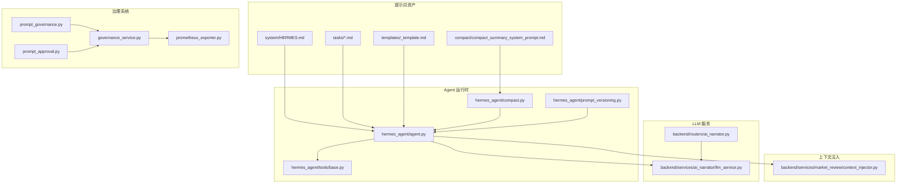
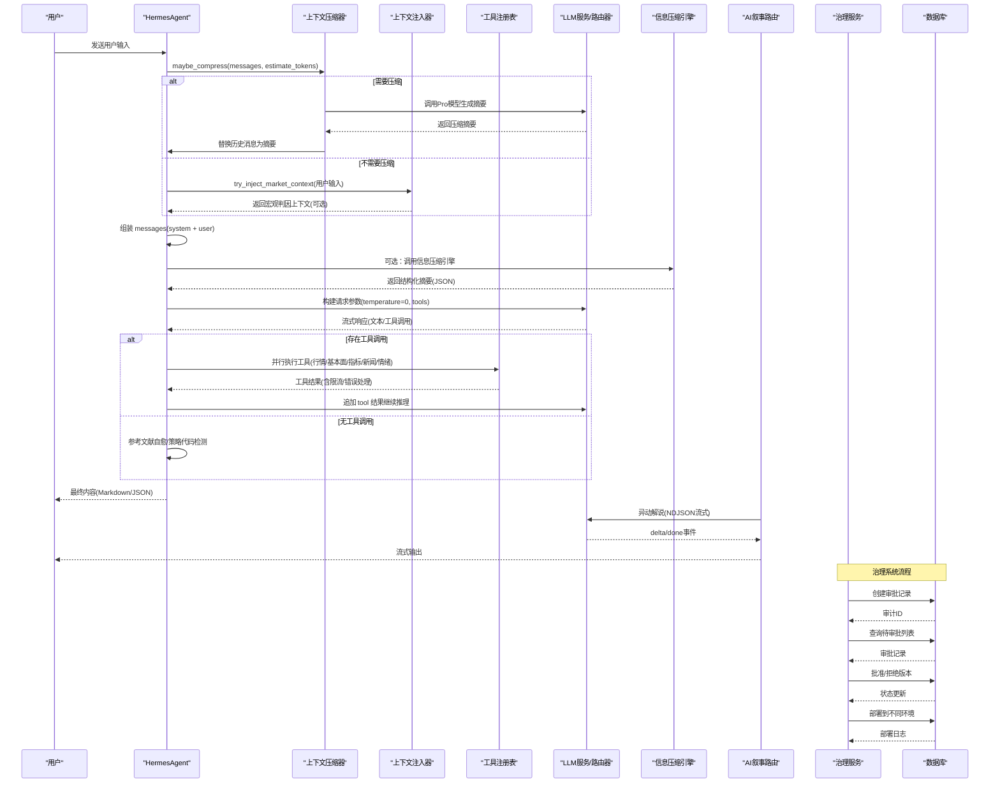
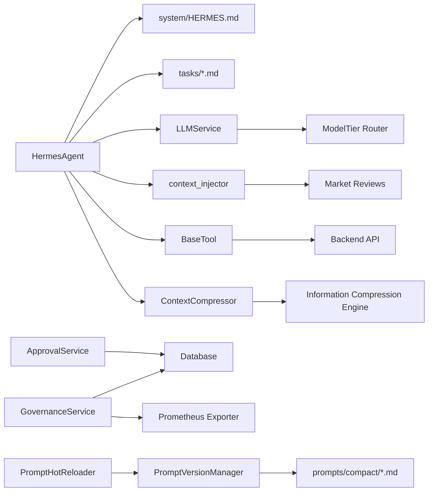

# 提示词工程

<cite>
**本文引用的文件**
- [prompts/README.md](file://prompts/README.md)
- [prompts/system/AGENT_SYSTEM.md](file://prompts/system/AGENT_SYSTEM.md)
- [prompts/tasks/sentiment_analysis.md](file://prompts/tasks/sentiment_analysis.md)
- [prompts/tasks/stock_deep_analysis.md](file://prompts/tasks/stock_deep_analysis.md)
- [prompts/tasks/title_generator.md](file://prompts/tasks/title_generator.md)
- [prompts/templates/_template.md](file://prompts/templates/_template.md)
- [prompts/compact/compact_summary_system_prompt.md](file://prompts/compact/compact_summary_system_prompt.md)
- [hermes_agent/agent.py](file://hermes_agent/agent.py)
- [hermes_agent/compact.py](file://hermes_agent/compact.py)
- [hermes_agent/prompt_versioning.py](file://hermes_agent/prompt_versioning.py)
- [backend/services/ai_narrator/llm_service.py](file://backend/services/ai_narrator/llm_service.py)
- [backend/routers/ai_narrator.py](file://backend/routers/ai_narrator.py)
- [backend/services/market_review/context_injector.py](file://backend/services/market_review/context_injector.py)
- [hermes_agent/tools/base.py](file://hermes_agent/tools/base.py)
- [backend/core/models/prompt_governance.py](file://backend/core/models/prompt_governance.py)
- [backend/routers/prompt_governance.py](file://backend/routers/prompt_governance.py)
- [backend/routers/prompt_approval.py](file://backend/routers/prompt_approval.py)
- [backend/app/eval/golden_dataset.json](file://backend/app/eval/golden_dataset.json)
- [backend/services/prompt/governance_service.py](file://backend/services/prompt/governance_service.py)
- [backend/services/prompt/approval_service.py](file://backend/services/prompt/approval_service.py)
- [backend/services/prompt/prometheus_exporter.py](file://backend/services/prompt/prometheus_exporter.py)
- [docs/AGENT-16-NEXT_USAGE.md](file://docs/AGENT-16-NEXT_USAGE.md)
</cite>

## 更新摘要
**变更内容**
- 新增信息压缩引擎提示词模板，专门用于金融内容分析和摘要生成
- 实现上下文压缩机制，支持LLM摘要和fallback截断策略
- 增强版本管理、A/B测试和热更新功能
- 添加质量评估指标和性能目标（0.25-0.40压缩比，≥95%事实召回率）
- 完善使用文档和集成模式示例

## 目录
1. [简介](#简介)
2. [项目结构](#项目结构)
3. [核心组件](#核心组件)
4. [架构总览](#架构总览)
5. [详细组件分析](#详细组件分析)
6. [依赖关系分析](#依赖关系分析)
7. [性能与优化](#性能与优化)
8. [故障排查指南](#故障排查指南)
9. [结论](#结论)
10. [附录](#附录)

## 简介
本技术文档面向"提示词工程"在量化交易智能体中的系统化落地，覆盖系统提示词设计原则、任务提示词构建方法、模板最佳实践、提示词优化技巧、版本管理与A/B测试机制、以及调试评估工具链。内容基于仓库中 prompts 目录、Hermes Agent 运行时、LLM 服务与路由、上下文注入器与工具层等实现进行归纳与提炼，帮助开发者持续改进提示词质量并稳定输出结构化结果。

**更新** 新增了信息压缩引擎提示词模板和上下文压缩机制，包括YAML frontmatter元数据、JSON schema输出格式、质量控制清单和性能目标。同时增强了版本管理、A/B测试、部署环境和监控指标的完整治理体系。

## 项目结构
提示词工程相关资产集中在 prompts 目录，按"系统级指令""任务级提示词""模板"分层组织；Agent 运行时负责加载系统提示词、驱动 ReAct 循环、执行工具调用；LLM 服务提供多模型路由与结构化输出能力；市场复盘上下文注入器可在个股分析时自动注入宏观判因信息；工具基类提供限流感知重试与缓存。

**图表来源**
- [hermes_agent/agent.py:17-20](file://hermes_agent/agent.py#L17-L20)
- [prompts/system/AGENT_SYSTEM.md:1-8](file://prompts/system/AGENT_SYSTEM.md#L1-L8)
- [prompts/compact/compact_summary_system_prompt.md:1-187](file://prompts/compact/compact_summary_system_prompt.md#L1-L187)
- [hermes_agent/compact.py:115-301](file://hermes_agent/compact.py#L115-L301)
- [hermes_agent/prompt_versioning.py:100-549](file://hermes_agent/prompt_versioning.py#L100-L549)
- [backend/services/ai_narrator/llm_service.py:34-137](file://backend/services/ai_narrator/llm_service.py#L34-L137)
- [backend/routers/ai_narrator.py:25-80](file://backend/routers/ai_narrator.py#L25-L80)
- [backend/services/market_review/context_injector.py:165-229](file://backend/services/market_review/context_injector.py#L165-L229)
- [hermes_agent/tools/base.py:21-282](file://hermes_agent/tools/base.py#L21-L282)
- [backend/routers/prompt_governance.py:18-323](file://backend/routers/prompt_governance.py#L18-L323)
- [backend/routers/prompt_approval.py:27-360](file://backend/routers/prompt_approval.py#L27-L360)
- [backend/services/prompt/governance_service.py:472-573](file://backend/services/prompt/governance_service.py#L472-L573)
- [backend/services/prompt/prometheus_exporter.py:130-343](file://backend/services/prompt/prometheus_exporter.py#L130-L343)

**章节来源**
- [prompts/README.md:1-58](file://prompts/README.md#L1-L58)
- [prompts/system/AGENT_SYSTEM.md:1-8](file://prompts/system/AGENT_SYSTEM.md#L1-L8)
- [prompts/compact/compact_summary_system_prompt.md:1-187](file://prompts/compact/compact_summary_system_prompt.md#L1-L187)
- [hermes_agent/agent.py:17-20](file://hermes_agent/agent.py#L17-L20)

## 核心组件
- 系统提示词（System Prompt）：由 Hermes Agent 在会话初始化时加载，作为对话首轮 system 消息，定义角色、行为约束、输出规范与风控规则。
- 任务提示词（Task Prompts）：针对具体子任务（如新闻情感分析、会话标题生成、个股深度研判）的专用提示词，包含输入变量、输出格式、触发条件与工具序列。
- 模板（Templates）：统一的前置元数据与正文结构，便于新增提示词时保持一致性。
- **新增** 信息压缩引擎（Information Compression Engine）：专门用于金融内容分析和摘要生成的专业提示词，支持语义密度最大化和信噪比优化。
- LLM 服务与路由：提供多模型分级路由、离线降级、结构化输出校验与 token 计量。
- **新增** 上下文压缩器（Context Compressor）：智能压缩长对话历史，支持LLM摘要和fallback截断策略。
- 上下文注入：在市场复盘数据可用时，自动为个股分析注入宏观判因上下文，提升归因准确性。
- 工具层：统一限流感知重试、双级缓存、标的代码规范化，保障提示词调用的稳定性与可观测性。
- **新增** 提示词治理系统：包括版本管理、人类审批工作流、金数据集评估、反馈收集、质量评估和监控指标。

**章节来源**
- [hermes_agent/agent.py:505-575](file://hermes_agent/agent.py#L505-L575)
- [prompts/tasks/sentiment_analysis.md:1-25](file://prompts/tasks/sentiment_analysis.md#L1-L25)
- [prompts/tasks/title_generator.md:1-15](file://prompts/tasks/title_generator.md#L1-L15)
- [prompts/tasks/stock_deep_analysis.md:1-222](file://prompts/tasks/stock_deep_analysis.md#L1-L222)
- [prompts/compact/compact_summary_system_prompt.md:20-187](file://prompts/compact/compact_summary_system_prompt.md#L20-L187)
- [hermes_agent/compact.py:115-301](file://hermes_agent/compact.py#L115-L301)
- [backend/services/ai_narrator/llm_service.py:284-348](file://backend/services/ai_narrator/llm_service.py#L284-L348)
- [backend/services/market_review/context_injector.py:165-229](file://backend/services/market_review/context_injector.py#L165-L229)
- [hermes_agent/tools/base.py:21-282](file://hermes_agent/tools/base.py#L21-L282)
- [backend/core/models/prompt_governance.py:30-199](file://backend/core/models/prompt_governance.py#L30-L199)
- [backend/services/prompt/governance_service.py:472-573](file://backend/services/prompt/governance_service.py#L472-L573)

## 架构总览
下图展示从用户输入到提示词组装、ReAct 推理、工具调用、上下文注入、LLM 服务路由与结构化输出的完整链路，以及新增的信息压缩引擎和治理系统流程。

**图表来源**
- [hermes_agent/agent.py:187-499](file://hermes_agent/agent.py#L187-L499)
- [hermes_agent/compact.py:137-163](file://hermes_agent/compact.py#L137-L163)
- [backend/services/market_review/context_injector.py:217-229](file://backend/services/market_review/context_injector.py#L217-L229)
- [backend/services/ai_narrator/llm_service.py:284-348](file://backend/services/ai_narrator/llm_service.py#L284-L348)
- [backend/routers/ai_narrator.py:40-80](file://backend/routers/ai_narrator.py#L40-L80)
- [backend/routers/prompt_governance.py:89-323](file://backend/routers/prompt_governance.py#L89-L323)
- [backend/routers/prompt_approval.py:101-360](file://backend/routers/prompt_approval.py#L101-360)
- [backend/core/models/prompt_governance.py:47-199](file://backend/core/models/prompt_governance.py#L47-L199)

## 详细组件分析

### 系统提示词设计原则
- 角色定义：明确 Agent 身份与专业领域（量化交易主脑），限定语言风格与思维模式（概率思维、逆向思考）。
- 行为约束：限制工具调用次数与迭代上限，强制风险提示不可省略，要求数据源降级策略与跨市场适配。
- 输出格式规范：对 Markdown 报告结构与 JSON 字段类型进行严格约定，确保下游解析与可视化稳定。
- 安全与合规：内置敏感词拦截、乱码清洗、长度硬限制，避免幻觉与越界输出。

**章节来源**
- [prompts/tasks/stock_deep_analysis.md:92-222](file://prompts/tasks/stock_deep_analysis.md#L92-L222)
- [hermes_agent/agent.py:38-58](file://hermes_agent/agent.py#L38-L58)
- [prompts/system/AGENT_SYSTEM.md:1-8](file://prompts/system/AGENT_SYSTEM.md#L1-L8)

### 任务提示词的构建方法
- 问题分解：将复杂任务拆分为数据采集、多维研判、收敛输出三个阶段，每个阶段对应专家视角与工具序列。
- 上下文注入：在个股分析场景下，自动注入近三日市场复盘摘要，形成"大盘系统性→板块资金流→个股跟跌/跟涨"的判因链。
- 思维链引导：通过分阶段流程、工具调用顺序、降级策略与注意事项，引导模型逐步推理并给出可操作建议。
- 触发条件与关键词：为任务提示词定义明确的触发模式与关键词集合，便于路由选择合适模板。

**章节来源**
- [prompts/tasks/stock_deep_analysis.md:36-91](file://prompts/tasks/stock_deep_analysis.md#L36-L91)
- [backend/services/market_review/context_injector.py:165-214](file://backend/services/market_review/context_injector.py#L165-L214)
- [prompts/tasks/sentiment_analysis.md:1-25](file://prompts/tasks/sentiment_analysis.md#L1-L25)
- [prompts/tasks/title_generator.md:1-15](file://prompts/tasks/title_generator.md#L1-L15)

### 模板设计的最佳实践
- 变量替换：使用 input_variables 声明输入变量及其类型，便于模板渲染与校验。
- 条件分支：在提示词内定义触发条件与不适用场景，结合工具可用性进行分支处理。
- 动态内容生成：通过工具调用获取实时数据，并在报告中标注数据来源与时间戳，保证时效性与可追溯性。
- 元数据管理：每个提示词文件头部包含 id、name、target_model、last_tested、eval_score、changelog 等，便于版本追踪与评估对比。

**章节来源**
- [prompts/templates/_template.md:1-22](file://prompts/templates/_template.md#L1-L22)
- [prompts/README.md:22-58](file://prompts/README.md#L22-L58)
- [prompts/tasks/stock_deep_analysis.md:1-34](file://prompts/tasks/stock_deep_analysis.md#L1-L34)

### 信息压缩引擎设计
- **新增** 语义密度最大化：通过删除填充词、合并同类项、被动转主动等策略，在保留关键信息的同时消除冗余。
- **新增** 信噪比优化：保留所有数字、锚定来源、删除推测性表述，确保金融内容的精确性和可靠性。
- **新增** 结构保留：维持一级结论→二级支撑→三级证据的层级关系，保持逻辑链完整和对比关系清晰。
- **新增** 金融内容特殊规则：价格点位绝对保留、风险指示器标准化编码、可操作性评分机制。

**章节来源**
- [prompts/compact/compact_summary_system_prompt.md:28-107](file://prompts/compact/compact_summary_system_prompt.md#L28-L107)

### 上下文压缩机制
- **新增** 智能压缩决策：基于token数量阈值判断是否需要压缩，避免不必要的LLM调用。
- **新增** 双路径压缩策略：优先使用Pro模型生成高质量摘要，失败时自动回退到有损截断策略。
- **新增** 审计追踪：记录压缩方法、原始范围、token变化等元数据，支持质量评估和问题排查。
- **新增** 配置化参数：支持环境变量配置系统提示词、最大摘要长度等关键参数。

**章节来源**
- [hermes_agent/compact.py:44-76](file://hermes_agent/compact.py#L44-L76)
- [hermes_agent/compact.py:137-163](file://hermes_agent/compact.py#L137-L163)
- [hermes_agent/compact.py:164-234](file://hermes_agent/compact.py#L164-L234)
- [hermes_agent/compact.py:235-281](file://hermes_agent/compact.py#L235-L281)

### 提示词优化的技巧
- 关键词选择：在触发条件中列举典型问法与英文关键词，提高意图识别准确率。
- 结构优化：采用分阶段流程、表格化工具序列、强制输出模板，降低模型自由发挥导致的格式漂移。
- 性能调优：设置 temperature=0.0 保证确定性；并行调用工具减少等待；使用降级策略避免单点失败阻塞。
- 结构化输出：通过 Pydantic 模型与 JSON Schema 强制校验，确保下游解析稳定。

**章节来源**
- [hermes_agent/agent.py:70-97](file://hermes_agent/agent.py#L70-L97)
- [backend/services/ai_narrator/llm_service.py:284-348](file://backend/services/ai_narrator/llm_service.py#L284-L348)
- [prompts/tasks/stock_deep_analysis.md:74-91](file://prompts/tasks/stock_deep_analysis.md#L74-L91)

### 示例：不同类型任务的提示词设计
- 市场分析（新闻情感分析）：以 JSON 输出为核心，规定 score、label、reasoning、summary_zh 字段，强调纯 JSON 输出与中文解释。
- 策略建议（个股深度研判）：五维专家视角（基本面/技术面/宏观/估值/风控），强制 Markdown 报告模板，包含执行摘要、评分表、信号、风险矩阵与投资建议。
- 风险报告（风险控制章节）：强制风险提示不可省略，列出概率与影响等级，给出最大回撤估计与止损位。
- **新增** 信息压缩（对话摘要）：专业化金融内容压缩，支持结构化JSON输出、置信度评分、压缩比计算和质量控制检查。

**章节来源**
- [prompts/tasks/sentiment_analysis.md:15-25](file://prompts/tasks/sentiment_analysis.md#L15-L25)
- [prompts/tasks/stock_deep_analysis.md:92-186](file://prompts/tasks/stock_deep_analysis.md#L92-L186)
- [prompts/compact/compact_summary_system_prompt.md:109-147](file://prompts/compact/compact_summary_system_prompt.md#L109-L147)

### 提示词版本管理与 A/B 测试机制
- 版本管理：所有系统级与任务级提示词纳入版本控制，变更需附带 Eval 结果；文件头部的 last_tested 与 eval_score 用于追踪。
- A/B 测试：通过不同 target_model 或 prompt 版本进行对比评估；在 PR 描述中附上评估结果对比，确保质量不下降。
- 评估闭环：修改提示词后运行对应 Eval 用例，更新元数据并归档变更记录。
- **新增** 治理系统集成：通过 PromptVersionManager 统一管理版本，支持创建新版本、查询历史、回滚操作；集成 Golden Dataset 回归测试，确保版本质量。
- **新增** 热更新机制：基于watchdog的文件监听，支持Prompt文件的实时热重载，无需重启服务。

**章节来源**
- [prompts/README.md:1-58](file://prompts/README.md#L1-L58)
- [backend/routers/prompt_governance.py:89-145](file://backend/routers/prompt_governance.py#L89-L145)
- [backend/services/prompt/governance_service.py:490-515](file://backend/services/prompt/governance_service.py#L490-L515)
- [hermes_agent/prompt_versioning.py:100-257](file://hermes_agent/prompt_versioning.py#L100-L257)
- [hermes_agent/prompt_versioning.py:452-510](file://hermes_agent/prompt_versioning.py#L452-L510)

### 人类审批工作流
- **新增** 审批流程：支持创建审批记录、人工批准/拒绝、部署到不同环境（staging/production/canary）、一键回滚功能。
- 审计追踪：完整的审批历史记录，包括审批人、时间戳、评论和质量评分快照。
- 环境管理：支持测试环境、生产环境和金丝雀发布的差异化部署策略。
- 回滚机制：出现问题时可快速回滚到之前稳定的版本，确保业务连续性。

**章节来源**
- [backend/routers/prompt_approval.py:101-360](file://backend/routers/prompt_approval.py#L101-360)
- [backend/services/prompt/approval_service.py:55-323](file://backend/services/prompt/approval_service.py#L55-L323)
- [backend/core/models/prompt_governance.py:47-199](file://backend/core/models/prompt_governance.py#L47-L199)

### 金数据集评估与反馈收集
- **新增** 金数据集：包含58个预定义的测试用例，涵盖正常场景、边界情况和失败场景，用于回归测试和质量验证。
- 评估指标：支持数值准确性、引用可追溯性、DSL合规性等多种评估维度。
- 反馈收集：用户可通过thumbs up/down提供反馈，系统自动统计好评率、平均评分等指标。
- 质量评估：通过启发式算法和LLM驱动的评估器，计算连贯性、清晰度、相关性等质量分数。

**章节来源**
- [backend/app/eval/golden_dataset.json:1-61](file://backend/app/eval/golden_dataset.json#L1-L61)
- [backend/services/prompt/governance_service.py:98-194](file://backend/services/prompt/governance_service.py#L98-L194)
- [backend/services/prompt/governance_service.py:196-281](file://backend/services/prompt/governance_service.py#L196-L281)

### 监控指标与可观测性
- **新增** Prometheus指标：导出质量分数、反馈统计、A/B测试结果、版本创建计数等关键指标。
- 实时监控：支持Grafana可视化，提供质量趋势、性能指标和告警阈值配置。
- 性能监控：测量Golden Dataset回归测试耗时、LLM评估延迟、向量搜索时间等性能指标。
- 告警机制：配置质量阈值警告和严重级别，及时发现质量问题。

**章节来源**
- [backend/services/prompt/prometheus_exporter.py:24-343](file://backend/services/prompt/prometheus_exporter.py#L24-L343)

### 提示词调试工具与评估方法
- 调试工具：
  - Agent 调试模式：打印请求与响应细节，便于定位提示词与工具调用问题。
  - 心跳保活：每轮 ReAct 前发送心跳，防止长耗时任务超时。
  - 熔断恢复：达到最大迭代次数后强制收敛，输出最终总结。
- 评估方法：
  - 结构化输出校验：使用 Pydantic 模型校验 JSON 输出，失败时抛出异常并记录原始输出。
  - Token 计量：统一记录 prompt/completion/total tokens，支持成本分析与性能监控。
  - 流式事件：SSE/NDJSON 事件便于前端渐进渲染与错误隔离。
- **新增** 治理工具：
  - Golden Dataset回归测试：自动化质量验证，确保版本变更不会引入回归问题。
  - 相似提示词搜索：基于向量存储的智能检索，帮助找到类似的高质量提示词。
  - LLM驱动的困惑度评估：通过语言模型评估提示词质量，提供客观的质量评分。
  - **新增** 上下文压缩审计：记录压缩方法、token变化、压缩比等关键指标。

**章节来源**
- [hermes_agent/agent.py:211-223](file://hermes_agent/agent.py#L211-L223)
- [hermes_agent/agent.py:452-499](file://hermes_agent/agent.py#L452-L499)
- [backend/services/ai_narrator/llm_service.py:350-369](file://backend/services/ai_narrator/llm_service.py#L350-L369)
- [backend/routers/ai_narrator.py:40-80](file://backend/routers/ai_narrator.py#L40-L80)
- [backend/services/prompt/governance_service.py:283-360](file://backend/services/prompt/governance_service.py#L283-L360)
- [backend/services/prompt/governance_service.py:362-470](file://backend/services/prompt/governance_service.py#L362-L470)
- [hermes_agent/compact.py:203-229](file://hermes_agent/compact.py#L203-L229)

## 依赖关系分析
- Agent 与提示词：HermesAgent 默认加载 prompts/system/HERMES.md 作为系统指令；任务提示词通过路由或工具调用按需装配。
- Agent 与 LLM 服务：统一通过 _build_request_kwargs 构造请求参数，支持温度、工具、流式选项；LLMService 提供多模型路由与离线降级。
- 上下文注入与市场复盘：当用户输入包含标的代码时，自动推断市场并拉取近期复盘摘要，注入到用户消息末尾。
- 工具层与后端 API：BaseTool 提供限流感知重试与双级缓存，标代码规范化确保后端接口一致性。
- **新增** 上下文压缩与Agent：ContextCompressor 在token超限时自动触发压缩，支持LLM摘要和fallback截断两种策略。
- **新增** 信息压缩引擎与提示词：compact_summary_system_prompt 提供专业化的金融内容压缩能力，输出结构化JSON摘要。
- **新增** 治理系统与数据库：PromptGovernanceService 通过 SQLAlchemy ORM 与数据库交互，管理版本、审批记录和部署日志。
- **新增** 监控指标与Prometheus：PrometheusExporter 注册自定义指标，提供标准化的监控数据导出。

**图表来源**
- [hermes_agent/agent.py:17-20](file://hermes_agent/agent.py#L17-L20)
- [backend/services/ai_narrator/llm_service.py:34-137](file://backend/services/ai_narrator/llm_service.py#L34-L137)
- [backend/services/market_review/context_injector.py:165-229](file://backend/services/market_review/context_injector.py#L165-L229)
- [hermes_agent/tools/base.py:21-282](file://hermes_agent/tools/base.py#L21-L282)
- [hermes_agent/compact.py:115-301](file://hermes_agent/compact.py#L115-L301)
- [prompts/compact/compact_summary_system_prompt.md:1-187](file://prompts/compact/compact_summary_system_prompt.md#L1-L187)
- [backend/services/prompt/governance_service.py:472-573](file://backend/services/prompt/governance_service.py#L472-L573)
- [backend/services/prompt/prometheus_exporter.py:130-343](file://backend/services/prompt/prometheus_exporter.py#L130-L343)
- [hermes_agent/prompt_versioning.py:100-549](file://hermes_agent/prompt_versioning.py#L100-L549)

**章节来源**
- [hermes_agent/agent.py:187-499](file://hermes_agent/agent.py#L187-L499)
- [backend/services/ai_narrator/llm_service.py:284-348](file://backend/services/ai_narrator/llm_service.py#L284-L348)
- [backend/services/market_review/context_injector.py:119-163](file://backend/services/market_review/context_injector.py#L119-L163)
- [hermes_agent/tools/base.py:97-239](file://hermes_agent/tools/base.py#L97-L239)
- [hermes_agent/compact.py:137-163](file://hermes_agent/compact.py#L137-L163)

## 性能与优化
- 低随机性：temperature=0.0 确保输出确定性，适合量化场景。
- 并行工具调用：在个股深度研判中，行情/基本面/技术指标尽量并行，缩短端到端延迟。
- 限流感知重试：BaseTool 检测 429/503 与 body 状态，解析 retry_after 并退避重试，避免瞬时抖动导致失败。
- 双级缓存：进程内存 L1 + Redis L2 持久化，提升热点数据读取速度。
- 流式输出：SSE/NDJSON 事件支持打字机式渲染，改善用户体验与错误隔离。
- **新增** 上下文压缩优化：
  - 智能触发：基于token阈值判断，避免不必要的压缩调用。
  - 双路径策略：优先LLM摘要，失败自动回退到截断策略。
  - 配置化参数：支持环境变量调整压缩行为和性能目标。
- **新增** 信息压缩性能目标：
  - 压缩比：0.25-0.40（优秀标准）
  - 事实召回率：≥95%
  - 处理延迟：≤200ms（5000 tokens以内输入）
  - 信息损失率：<15%
- **新增** 治理性能优化：
  - 批量写入：反馈收集器使用内存缓冲，批量写入磁盘，减少I/O开销。
  - 异步处理：Golden Dataset回归测试和LLM评估支持异步执行，提升吞吐量。
  - 指标采样：Prometheus指标使用Histogram和Summary，避免高频采样带来的性能压力。

**章节来源**
- [hermes_agent/agent.py:70-97](file://hermes_agent/agent.py#L70-L97)
- [prompts/tasks/stock_deep_analysis.md:74-91](file://prompts/tasks/stock_deep_analysis.md#L74-L91)
- [hermes_agent/tools/base.py:97-239](file://hermes_agent/tools/base.py#L97-L239)
- [backend/routers/ai_narrator.py:40-80](file://backend/routers/ai_narrator.py#L40-L80)
- [backend/services/prompt/governance_service.py:196-281](file://backend/services/prompt/governance_service.py#L196-L281)
- [backend/services/prompt/prometheus_exporter.py:92-112](file://backend/services/prompt/prometheus_exporter.py#L92-L112)
- [prompts/compact/compact_summary_system_prompt.md:177-183](file://prompts/compact/compact_summary_system_prompt.md#L177-L183)
- [hermes_agent/compact.py:137-163](file://hermes_agent/compact.py#L137-L163)

## 故障排查指南
- 大模型调用异常：检查 _call_llm 与 _react_loop 的错误捕获与心跳保活；确认模型客户端配置与网络连通性。
- 工具执行失败：查看 _safe_execute_tool 的异常封装；确认后端 API 限流与重试逻辑；必要时启用降级策略。
- 结构化输出校验失败：核对 Pydantic 模型与 JSON Schema；检查 llm_service.generate_pydantic 的原始输出日志。
- 上下文注入无效：验证 detect_market_from_text 的正则匹配与白名单；检查市场复盘存储是否有数据。
- 流式输出中断：确认 NDJSON 事件协议与 heartbeat_wrap；检查下游异常是否以 error 事件形式透传。
- **新增** 上下文压缩问题排查：
  - 压缩未触发：检查token估算函数和阈值配置；确认messages长度和最小保留条数设置。
  - 摘要为空：验证Pro模型调用和错误处理；检查fallback截断是否正常工作。
  - 压缩效果差：调整max_summary_tokens参数；优化压缩提示词的内容提取逻辑。
- **新增** 信息压缩引擎问题排查：
  - JSON输出格式错误：验证输出schema和字段完整性；检查confidence和compression_ratio计算逻辑。
  - 压缩比不达标：分析输入文本复杂度；调整信息密度最大化策略。
  - 事实召回率低：检查数字保留规则和风险指示器编码逻辑。
- **新增** 治理系统故障排查：
  - 审批流程卡住：检查数据库连接和事务提交；确认审批记录状态是否正确流转。
  - 金数据集测试失败：验证测试用例格式和数据完整性；检查模拟LLM响应的正确性。
  - 指标导出异常：确认Prometheus客户端配置和网络连通性；检查指标注册是否成功。
  - 版本回滚失败：验证目标版本是否存在；检查文件系统权限和备份完整性。
  - 热更新失效：确认watchdog依赖安装和文件监听权限；检查回调函数执行状态。

**章节来源**
- [hermes_agent/agent.py:137-174](file://hermes_agent/agent.py#L137-L174)
- [hermes_agent/agent.py:443-499](file://hermes_agent/agent.py#L443-L499)
- [backend/services/ai_narrator/llm_service.py:344-348](file://backend/services/ai_narrator/llm_service.py#L344-L348)
- [backend/services/market_review/context_injector.py:146-163](file://backend/services/market_review/context_injector.py#L146-L163)
- [backend/routers/ai_narrator.py:40-80](file://backend/routers/ai_narrator.py#L40-L80)
- [backend/services/prompt/approval_service.py:71-199](file://backend/services/prompt/approval_service.py#L71-L199)
- [backend/services/prompt/prometheus_exporter.py:277-343](file://backend/services/prompt/prometheus_exporter.py#L277-L343)
- [hermes_agent/compact.py:158-163](file://hermes_agent/compact.py#L158-L163)
- [hermes_agent/compact.py:232-234](file://hermes_agent/compact.py#L232-L234)
- [prompts/compact/compact_summary_system_prompt.md:151-162](file://prompts/compact/compact_summary_system_prompt.md#L151-L162)

## 结论
本仓库将提示词工程与 Agent 运行时、LLM 服务、上下文注入与工具层深度融合，形成了从系统指令到任务模板、从结构化输出到版本管理的完整闭环。通过严格的输出规范、并行工具调用、限流重试与流式事件，系统在量化场景中实现了高确定性与高可用性。

**更新** 新增的信息压缩引擎和上下文压缩机制进一步增强了系统的企业级能力，包括专业的金融内容摘要生成、智能的对话历史压缩、人类审批工作流、金数据集评估、反馈收集和质量评估，以及版本管理、A/B测试、部署环境和监控指标。这些功能为大规模团队协作和持续改进提供了坚实基础。

建议持续完善 Eval 体系与 A/B 测试流程，推动提示词质量稳步提升。重点关注信息压缩引擎的性能优化和上下文压缩的效果评估，确保在保持高事实召回率的同时实现优秀的压缩比。

## 附录
- 提示词文件头部元数据字段说明：id、name、target_model、input_variables、output_format、last_tested、eval_score、changelog。
- 推荐工作流：修改提示词 → 运行 Eval → 对比评估结果 → 更新元数据 → 提交 PR。
- 常用调试开关：QUANT_ENV=development 开启调试模式；LLM_FALLBACK_ENABLED 控制降级开关。
- **新增** 信息压缩引擎API：
  - 压缩配置：HERMES_COMPACT_SUMMARY_SYSTEM_PROMPT、HERMES_COMPACT_SYSTEM_PROMPT、HERMES_COMPACT_MAX_SUMMARY_TOKENS
  - 性能目标：压缩比0.25-0.40，事实召回率≥95%，处理延迟≤200ms
  - 输出格式：JSON {summary, key_points, confidence, compression_ratio, original_length, compressed_length, focus_areas_hit}
- **新增** 治理系统API：
  - 版本管理：POST /prompt-governance/versions，GET /prompt-governance/versions/{name}/history
  - 审批流程：POST /prompt-governance/approval/approve，POST /prompt-governance/approval/reject
  - 部署管理：POST /prompt-governance/approval/deploy/staging，POST /prompt-governance/approval/deploy/production
  - 回滚操作：POST /prompt-governance/approval/rollback
  - 质量评估：POST /prompt-governance/validate/golden-dataset，GET /prompt-governance/quality/{name}/{version}
  - 监控指标：GET /metrics（Prometheus格式）
- **新增** 上下文压缩配置：
  - 压缩阈值：max_tokens_before_compress（默认120000）
  - 最小保留：min_items_retained（默认10）
  - 工具长度：max_tool_len（默认800）
  - 最大消息：max_messages（默认30）

**章节来源**
- [prompts/README.md:22-58](file://prompts/README.md#L22-L58)
- [hermes_agent/agent.py:530-544](file://hermes_agent/agent.py#L530-L544)
- [backend/services/ai_narrator/llm_service.py:200-215](file://backend/services/ai_narrator/llm_service.py#L200-L215)
- [backend/routers/prompt_governance.py:89-323](file://backend/routers/prompt_governance.py#L89-L323)
- [backend/routers/prompt_approval.py:101-360](file://backend/routers/prompt_approval.py#L101-360)
- [backend/services/prompt/prometheus_exporter.py:323-343](file://backend/services/prompt/prometheus_exporter.py#L323-L343)
- [prompts/compact/compact_summary_system_prompt.md:1-187](file://prompts/compact/compact_summary_system_prompt.md#L1-L187)
- [hermes_agent/compact.py:44-76](file://hermes_agent/compact.py#L44-L76)
- [docs/AGENT-16-NEXT_USAGE.md:304-314](file://docs/AGENT-16-NEXT_USAGE.md#L304-L314)