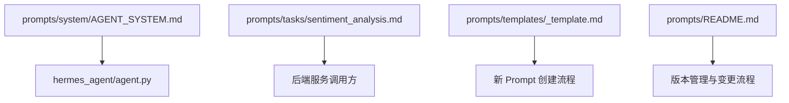
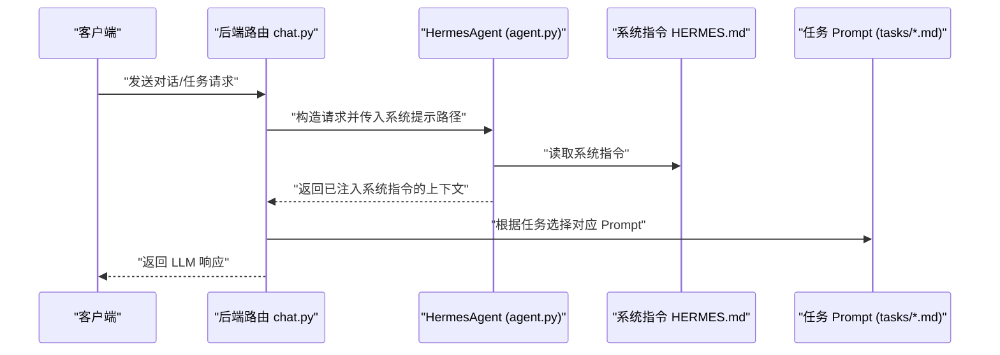
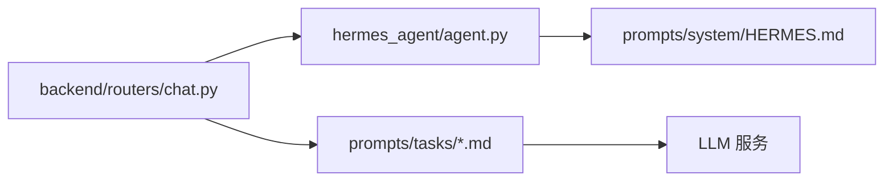

# 模板引擎

<cite>
**本文引用的文件**
- [prompts/templates/_template.md](file://prompts/templates/_template.md)
- [prompts/README.md](file://prompts/README.md)
- [prompts/tasks/sentiment_analysis.md](file://prompts/tasks/sentiment_analysis.md)
- [prompts/system/AGENT_SYSTEM.md](file://prompts/system/AGENT_SYSTEM.md)
- [hermes_agent/agent.py](file://hermes_agent/agent.py)
- [backend/routers/chat.py](file://backend/routers/chat.py)
- [backend/tests/test_hermes_prompt_path.py](file://backend/tests/test_hermes_prompt_path.py)
</cite>

## 目录
1. [简介](#简介)
2. [项目结构](#项目结构)
3. [核心组件](#核心组件)
4. [架构总览](#架构总览)
5. [详细组件分析](#详细组件分析)
6. [依赖关系分析](#依赖关系分析)
7. [性能考虑](#性能考虑)
8. [故障排查指南](#故障排查指南)
9. [结论](#结论)
10. [附录](#附录)

## 简介
本技术文档围绕仓库中的“提示词模板系统”展开，聚焦以下目标：
- 解释模板系统的架构设计：变量替换机制、条件分支处理、动态内容生成。
- 详细说明 _template.md 的模板结构设计：占位符定义、嵌套模板、继承关系。
- 提供模板开发最佳实践：命名规范、模块化设计、复用策略。
- 说明模板渲染引擎的工作原理：语法解析、性能优化、错误处理。
- 给出具体使用示例与测试调试方法，帮助快速创建复杂业务模板。

该模板系统以 Markdown + YAML Front Matter 为核心载体，配合后端 Agent 运行时加载与调用，形成“可版本化、可评估、可复用”的提示词工程体系。

## 项目结构
提示词相关资源集中在 prompts 目录，采用分层组织：
- system：系统级 Prompt（Agent 主脑指令），由运行时统一加载。
- tasks：任务级 Prompt（面向子模型或专用 LLM 调用）。
- templates：通用模板骨架，用于新建 Prompt 时参考。

**图表来源**
- [prompts/system/AGENT_SYSTEM.md:1-8](file://prompts/system/AGENT_SYSTEM.md#L1-L8)
- [hermes_agent/agent.py:19-20](file://hermes_agent/agent.py#L19-L20)
- [prompts/tasks/sentiment_analysis.md:1-13](file://prompts/tasks/sentiment_analysis.md#L1-L13)
- [prompts/templates/_template.md:1-22](file://prompts/templates/_template.md#L1-L22)
- [prompts/README.md:1-58](file://prompts/README.md#L1-L58)

**章节来源**
- [prompts/README.md:1-58](file://prompts/README.md#L1-L58)
- [prompts/templates/_template.md:1-22](file://prompts/templates/_template.md#L1-L22)
- [prompts/system/AGENT_SYSTEM.md:1-8](file://prompts/system/AGENT_SYSTEM.md#L1-L8)

## 核心组件
- 模板元数据（YAML Front Matter）：每个 Prompt 文件头部包含 id、name、target_model、input_variables、output_format、last_tested、eval_score、changelog 等字段，用于描述模板用途、输入输出、版本与评测信息。
- 模板骨架（_template.md）：提供标准结构与注释，指导新增 Prompt 的编写。
- 任务模板（tasks/*.md）：面向具体任务的 Prompt，如新闻情感分析，明确结构化输出格式。
- 系统指令（system/*.md）：Agent 运行时加载的系统级指令，作为对话上下文的基础。
- 运行时加载器（hermes_agent/agent.py）：负责读取并注入系统 Prompt，供聊天路由与 CLI 调用。

**章节来源**
- [prompts/templates/_template.md:1-22](file://prompts/templates/_template.md#L1-L22)
- [prompts/tasks/sentiment_analysis.md:1-25](file://prompts/tasks/sentiment_analysis.md#L1-L25)
- [prompts/system/AGENT_SYSTEM.md:1-8](file://prompts/system/AGENT_SYSTEM.md#L1-L8)
- [hermes_agent/agent.py:19-20](file://hermes_agent/agent.py#L19-L20)

## 架构总览
模板系统由“静态模板 + 运行时加载 + 调用方”三部分构成：
- 静态模板：Markdown + YAML Front Matter，便于版本控制与人工审阅。
- 运行时加载：Agent 在启动或会话初始化时读取系统 Prompt，注入到消息上下文中。
- 调用方：后端路由（chat.py）与 CLI（run_cli.py）通过 Agent 发起请求，携带任务 Prompt 与参数。

**图表来源**
- [backend/routers/chat.py:192-198](file://backend/routers/chat.py#L192-L198)
- [hermes_agent/agent.py:563-623](file://hermes_agent/agent.py#L563-L623)
- [prompts/system/AGENT_SYSTEM.md:1-8](file://prompts/system/AGENT_SYSTEM.md#L1-L8)
- [prompts/tasks/sentiment_analysis.md:1-25](file://prompts/tasks/sentiment_analysis.md#L1-L25)

## 详细组件分析

### 模板结构与占位符
- 模板骨架（_template.md）定义了标准头部与正文结构，包括：
  - 元数据：id、name、target_model、input_variables、output_format、last_tested、eval_score、changelog。
  - 正文：标题、用途说明、系统指令区域。
- 占位符约定：
  - input_variables 列表用于声明输入变量及其类型与可选性，便于调用方校验与填充。
  - output_format 描述期望的结构化输出，便于下游解析与评测。
- 嵌套与继承：
  - 当前仓库未实现模板语言级的嵌套与继承；推荐通过“模块化拆分 + 组合引用”的方式实现复用。例如将通用段落放入独立文件，在任务 Prompt 中按语义拼接。

**章节来源**
- [prompts/templates/_template.md:1-22](file://prompts/templates/_template.md#L1-L22)
- [prompts/tasks/sentiment_analysis.md:1-25](file://prompts/tasks/sentiment_analysis.md#L1-L25)

### 变量替换机制
- 变量来源：调用方从业务上下文提取数据，依据 input_variables 映射为键值对。
- 替换策略：建议在调用层进行字符串替换（如 Python f-string 或模板引擎），确保：
  - 类型安全：对数值、布尔、枚举等进行格式化与校验。
  - 空值处理：对可选变量提供默认值或跳过逻辑。
  - 转义与清洗：避免特殊字符破坏 Markdown 或 JSON 结构。
- 建议实现：
  - 在路由或服务层集中实现替换函数，统一处理变量注入与校验。
  - 对输出格式进行二次校验（如 JSON Schema），保证稳定性。

[本节为概念性说明，不直接分析具体文件]

### 条件分支处理
- 基于变量的分支：在模板正文中使用条件语句（如 if/else）或在调用层根据变量选择不同模板片段。
- 多模板路由：当业务场景差异较大时，可通过路由层根据输入特征选择不同任务 Prompt。
- 推荐模式：
  - 简单分支：在模板内用自然语言条件描述，由 LLM 自行判断。
  - 强约束分支：在调用层做硬分支，选择不同模板或参数，减少歧义。

[本节为概念性说明，不直接分析具体文件]

### 动态内容生成
- 数据来源：行情、新闻、指标、用户输入等。
- 生成流程：
  - 收集数据 → 构建变量字典 → 注入模板 → 校验输出 → 调用 LLM。
- 注意事项：
  - 控制上下文长度，避免超出模型限制。
  - 对长文本进行摘要或分页。
  - 对敏感信息进行脱敏。

[本节为概念性说明，不直接分析具体文件]

### 模板开发最佳实践
- 命名规范：
  - 文件命名：按功能域划分，如 sentiment_analysis.md、title_generator.md。
  - 元数据 id：唯一且可读，如 prompt-sentiment-001。
- 模块化设计：
  - 将通用指令抽取为共享片段，避免重复。
  - 任务 Prompt 保持单一职责，专注特定输出格式。
- 复用策略：
  - 通过 input_variables 抽象共性，减少模板数量。
  - 使用统一的 output_format 便于解析与评测。
- 版本管理：
  - 每次变更更新 last_tested 与 eval_score，并在 PR 中附带评测对比。

**章节来源**
- [prompts/README.md:22-58](file://prompts/README.md#L22-L58)
- [prompts/tasks/sentiment_analysis.md:1-25](file://prompts/tasks/sentiment_analysis.md#L1-L25)

### 模板渲染引擎工作原理
- 语法解析：
  - 读取 YAML Front Matter 获取元数据。
  - 解析 Markdown 正文，识别占位符与指令区域。
- 执行流程：
  - 加载系统指令（HERMES.md）作为基础上下文。
  - 根据任务选择对应 Prompt，注入变量后组装最终消息。
  - 调用 LLM 并解析结构化输出。
- 性能优化：
  - 缓存系统指令与常用模板片段。
  - 批量处理时复用上下文，减少重复 I/O。
- 错误处理：
  - 对缺失变量、非法类型、输出格式不符等情况进行拦截与重试。
  - 记录日志与指标，便于定位问题。

**章节来源**
- [hermes_agent/agent.py:563-623](file://hermes_agent/agent.py#L563-L623)
- [backend/routers/chat.py:192-198](file://backend/routers/chat.py#L192-L198)

### 使用示例：创建复杂业务模板
- 步骤：
  1. 复制 _template.md 为新文件，填写元数据。
  2. 在 input_variables 中声明所有输入变量及类型。
  3. 在 output_format 中定义结构化输出（如 JSON 字段）。
  4. 在正文中编写系统指令与任务说明。
  5. 在调用层实现变量替换与输出校验。
- 示例参考：
  - 新闻情感分析 Prompt 展示了如何定义输入变量与严格输出格式。

**章节来源**
- [prompts/templates/_template.md:1-22](file://prompts/templates/_template.md#L1-L22)
- [prompts/tasks/sentiment_analysis.md:1-25](file://prompts/tasks/sentiment_analysis.md#L1-L25)

### 测试与调试工具
- 路径验证测试：
  - 验证默认系统 Prompt 路径指向正确的文件，并检查内容关键字段。
- 加载测试：
  - 通过临时文件模拟系统 Prompt，验证加载逻辑正确性。
- 建议扩展：
  - 增加单元测试覆盖变量替换、输出解析、异常分支。
  - 引入端到端测试，模拟完整调用链路。

**章节来源**
- [backend/tests/test_hermes_prompt_path.py:1-24](file://backend/tests/test_hermes_prompt_path.py#L1-L24)

## 依赖关系分析
模板系统与运行时的依赖关系如下：
- 路由层依赖 Agent 提供的系统 Prompt 加载能力。
- Agent 依赖系统指令文件（HERMES.md）与任务 Prompt 文件。
- 任务 Prompt 依赖调用方的数据源与变量注入逻辑。

**图表来源**
- [backend/routers/chat.py:192-198](file://backend/routers/chat.py#L192-L198)
- [hermes_agent/agent.py:563-623](file://hermes_agent/agent.py#L563-L623)
- [prompts/system/AGENT_SYSTEM.md:1-8](file://prompts/system/AGENT_SYSTEM.md#L1-L8)

**章节来源**
- [backend/routers/chat.py:192-198](file://backend/routers/chat.py#L192-L198)
- [hermes_agent/agent.py:563-623](file://hermes_agent/agent.py#L563-L623)

## 性能考虑
- 模板缓存：对系统指令与常用模板片段进行内存缓存，减少重复读取。
- 变量注入优化：批量处理时复用变量映射表，避免重复计算。
- 输出解析：使用高效解析器（如 JSON 解析库）并设置超时与重试。
- 监控与度量：记录模板加载耗时、变量注入耗时、解析成功率等指标。

[本节为概念性说明，不直接分析具体文件]

## 故障排查指南
- 常见问题：
  - 系统 Prompt 路径错误：检查 DEFAULT_SYSTEM_PROMPT_PATH 与实际文件位置。
  - 变量缺失或类型错误：在调用层增加校验与默认值处理。
  - 输出格式不符合预期：在解析前进行 Schema 校验，失败时重试或降级。
- 调试步骤：
  - 打印注入后的完整消息，确认变量替换正确。
  - 记录 LLM 原始响应，便于分析问题。
  - 使用单元测试复现问题，逐步缩小范围。

**章节来源**
- [backend/tests/test_hermes_prompt_path.py:1-24](file://backend/tests/test_hermes_prompt_path.py#L1-L24)

## 结论
本模板系统以“Markdown + YAML Front Matter”为核心，结合 Agent 运行时加载与调用方协作，实现了可版本化、可评估、可复用的提示词工程体系。通过规范的模板结构、严格的输出格式与完善的测试手段，能够有效支撑复杂业务场景下的动态内容生成与条件分支处理。建议持续完善变量注入与输出解析的健壮性，并引入更多自动化测试与性能监控，以提升整体稳定性与效率。

[本节为总结性内容，不直接分析具体文件]

## 附录
- 模板文件头字段说明：
  - id：唯一标识，便于追踪与引用。
  - name：人类可读名称。
  - target_model：目标模型版本，便于评测对比。
  - input_variables：输入变量列表，含类型与可选性。
  - output_format：期望的输出格式，便于解析与评测。
  - last_tested：最后测试日期。
  - eval_score：评测得分。
  - changelog：变更记录。

**章节来源**
- [prompts/templates/_template.md:1-22](file://prompts/templates/_template.md#L1-L22)
- [prompts/tasks/sentiment_analysis.md:1-25](file://prompts/tasks/sentiment_analysis.md#L1-L25)
- [prompts/README.md:22-58](file://prompts/README.md#L22-L58)