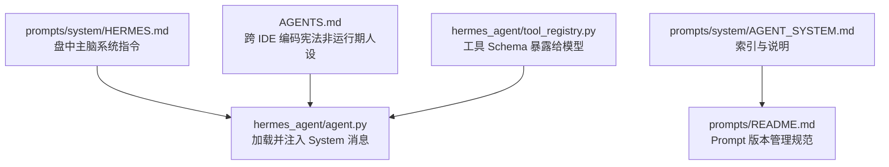
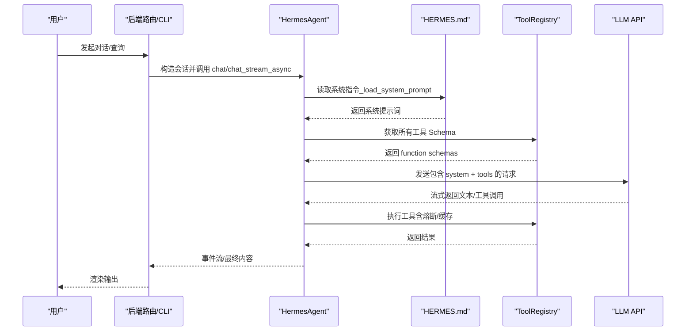
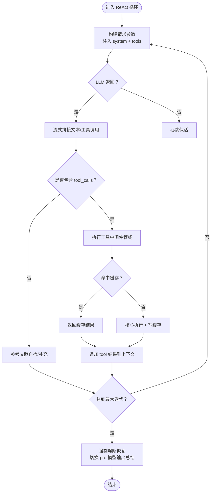
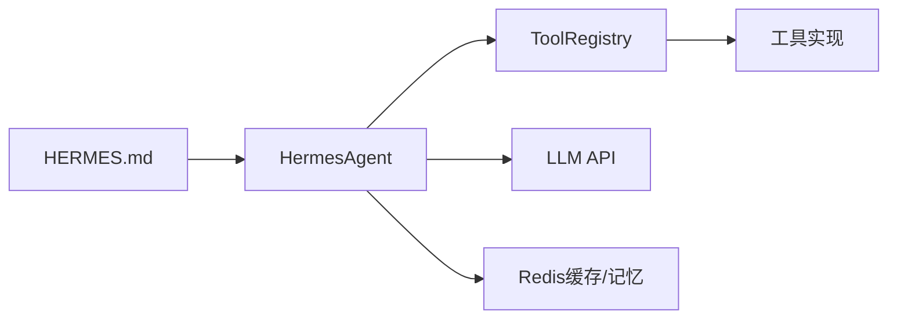

# 系统提示词设计

<cite>
**本文引用的文件**
- [prompts/system/HERMES.md](file://prompts/system/HERMES.md)
- [prompts/system/AGENT_SYSTEM.md](file://prompts/system/AGENT_SYSTEM.md)
- [prompts/README.md](file://prompts/README.md)
- [hermes_agent/agent.py](file://hermes_agent/agent.py)
- [hermes_agent/tool_registry.py](file://hermes_agent/tool_registry.py)
- [AGENTS.md](file://AGENTS.md)
</cite>

## 目录
1. [引言](#引言)
2. [项目结构](#项目结构)
3. [核心组件](#核心组件)
4. [架构总览](#架构总览)
5. [详细组件分析](#详细组件分析)
6. [依赖关系分析](#依赖关系分析)
7. [性能与稳定性考量](#性能与稳定性考量)
8. [故障排查指南](#故障排查指南)
9. [结论](#结论)
10. [附录：构建方法与示例](#附录构建方法与示例)

## 引言
本技术文档面向“系统提示词”的设计、治理与落地，聚焦于量化交易场景下的 Agent 主脑（Hermes）指令体系。内容涵盖：
- 系统提示词的核心作用：角色定义、行为约束、输出格式规范
- AGENT_SYSTEM.md 的索引职责与 HERMES.md 的运行期职责分离
- Prompt 版本管理与测试流程
- 不同角色的提示词构建方法（量化分析师、风险管理专家、策略研究员等）
- 与运行时（Agent 循环、工具注册表、熔断与缓存）的集成方式

## 项目结构
仓库将“系统级 Prompt”与“任务级 Prompt”分层管理，并通过统一的元数据与变更流程进行版本控制与评估。

**图示来源**
- [prompts/system/HERMES.md:1-20](file://prompts/system/HERMES.md#L1-L20)
- [hermes_agent/agent.py:17-20](file://hermes_agent/agent.py#L17-L20)
- [prompts/system/AGENT_SYSTEM.md:1-8](file://prompts/system/AGENT_SYSTEM.md#L1-L8)
- [prompts/README.md:1-20](file://prompts/README.md#L1-L20)
- [AGENTS.md:1-10](file://AGENTS.md#L1-L10)
- [hermes_agent/tool_registry.py:85-98](file://hermes_agent/tool_registry.py#L85-L98)

**章节来源**
- [prompts/system/HERMES.md:1-20](file://prompts/system/HERMES.md#L1-L20)
- [prompts/system/AGENT_SYSTEM.md:1-8](file://prompts/system/AGENT_SYSTEM.md#L1-L8)
- [prompts/README.md:1-20](file://prompts/README.md#L1-L20)
- [hermes_agent/agent.py:17-20](file://hermes_agent/agent.py#L17-L20)
- [AGENTS.md:1-10](file://AGENTS.md#L1-L10)
- [hermes_agent/tool_registry.py:85-98](file://hermes_agent/tool_registry.py#L85-L98)

## 核心组件
- 系统提示词（System Prompt）
  - 运行期主脑指令位于 prompts/system/HERMES.md，定义角色定位、工具路由纪律、零幻觉、上下文保护、宏观风控优先级、交易安全、输出格式、HTML 卡片生成规则与硬风控。
  - 索引文件 prompts/system/AGENT_SYSTEM.md 明确加载路径与调用方，避免与 IDE 编码宪法混用。
- 版本与模板
  - prompts/README.md 规定 Prompt 头部 YAML Front Matter、变更流程、当前 Prompt 位置索引。
  - prompts/templates/_template.md 提供新 Prompt 的模板。
- 运行时集成
  - hermes_agent/agent.py 在初始化时读取 HERMES.md，作为 messages[0] 的 system 内容注入；统一 ReAct 循环驱动 Plan→Tool→Verify→Output。
  - hermes_agent/tool_registry.py 将工具以 function schema 暴露给模型，驱动模型按纪律选择工具。

**章节来源**
- [prompts/system/HERMES.md:9-21](file://prompts/system/HERMES.md#L9-L21)
- [prompts/system/HERMES.md:23-59](file://prompts/system/HERMES.md#L23-L59)
- [prompts/system/HERMES.md:61-87](file://prompts/system/HERMES.md#L61-L87)
- [prompts/system/HERMES.md:89-137](file://prompts/system/HERMES.md#L89-L137)
- [prompts/system/AGENT_SYSTEM.md:1-8](file://prompts/system/AGENT_SYSTEM.md#L1-L8)
- [prompts/README.md:22-48](file://prompts/README.md#L22-L48)
- [prompts/templates/_template.md:1-22](file://prompts/templates/_template.md#L1-L22)
- [hermes_agent/agent.py:519-565](file://hermes_agent/agent.py#L519-L565)
- [hermes_agent/tool_registry.py:85-98](file://hermes_agent/tool_registry.py#L85-L98)

## 架构总览
下图展示系统提示词从文件到运行时的加载与使用路径，以及工具能力如何被注入到模型请求中。

**图示来源**
- [hermes_agent/agent.py:519-565](file://hermes_agent/agent.py#L519-L565)
- [hermes_agent/agent.py:583-589](file://hermes_agent/agent.py#L583-L589)
- [hermes_agent/agent.py:69-97](file://hermes_agent/agent.py#L69-L97)
- [hermes_agent/tool_registry.py:85-98](file://hermes_agent/tool_registry.py#L85-L98)
- [hermes_agent/tool_registry.py:111-179](file://hermes_agent/tool_registry.py#L111-L179)

## 详细组件分析

### 系统提示词（HERMES.md）设计原则
- 角色定义
  - 定位为“顶尖量化交易主脑”，具备质疑精神、厌恶废话、黑色幽默但严格基于数据。
- 行为约束
  - 工作流强制 Plan → Tool → Verify → Output，禁止跳过验证直接输出结论。
  - 数据边界：仅能通过已挂载 Tools 取数，禁止直连外部行情/财务 API，禁止编造数字。
  - 工具路由纪律：按类别（交易与盘口、基本面、技术面、宏观与舆情、选股、检索）选择工具，同名冲突时以 schema 为准。
  - 零幻觉：金融数字必须来自 Tool；失败需声明无法分析；引用须标注来源；多源矛盾需暴露。
  - 上下文保护：禁止复述原始长数据；计算必须矢量化；同一 Tool 连续失败 3 次触发熔断报告。
  - 宏观风控优先级：Tier 1/2/3 分级关注宏观变量与事件。
  - 交易安全：默认沙箱；下单前确认价格与流动性；实盘需二次确认。
- 输出格式规范
  - 早报/快照/新闻采用固定模板；结论需含多空矩阵、看涨概率、建议与进阶追问。
  - 图表标注使用合法 JSON（chart-annotations），普通分析严禁输出 echarts 块。
  - HTML 卡片仅在明确要求时输出，遵循 Tailwind 与暗黑配色约定。
  - 代码生成硬风控：生成策略/因子代码时不调用行情工具，回测在独立沙箱完成。

**章节来源**
- [prompts/system/HERMES.md:9-21](file://prompts/system/HERMES.md#L9-L21)
- [prompts/system/HERMES.md:23-59](file://prompts/system/HERMES.md#L23-L59)
- [prompts/system/HERMES.md:61-87](file://prompts/system/HERMES.md#L61-L87)
- [prompts/system/HERMES.md:89-137](file://prompts/system/HERMES.md#L89-L137)

### 运行时集成（Agent 循环与工具注册表）
- 系统提示词加载
  - 默认路径指向 prompts/system/HERMES.md；若缺失则回退为通用提示词。
  - 每次会话通过 _apply_system_prompt 确保使用最新版本覆盖历史 system 消息。
- ReAct 驱动循环
  - 统一事件契约（heartbeat/reasoning_chunk/text_chunk/tool_start/tool_result/strategy_code/chart_annotation/iteration_limit_reached/error）。
  - 流式推理与心跳保活；参考文献自愈；策略代码与图表标注检测。
  - 达到最大迭代次数后启动强制熔断恢复，切换至更强力模型输出总结。
- 工具执行与中间件
  - ToolRegistry 暴露 function schemas 给模型；execute 走中间件管线（熔断器、分类、计时、核心执行）。
  - 结果正交分类（success/empty/stale/rate_limited/error/circuit_breaker），失败计数触发熔断。
  - 成功结果写入缓存（Redis Hash），降低重复调用成本。

**图示来源**
- [hermes_agent/agent.py:187-513](file://hermes_agent/agent.py#L187-L513)
- [hermes_agent/tool_registry.py:111-179](file://hermes_agent/tool_registry.py#L111-L179)

**章节来源**
- [hermes_agent/agent.py:519-565](file://hermes_agent/agent.py#L519-L565)
- [hermes_agent/agent.py:583-589](file://hermes_agent/agent.py#L583-L589)
- [hermes_agent/agent.py:187-513](file://hermes_agent/agent.py#L187-L513)
- [hermes_agent/tool_registry.py:85-98](file://hermes_agent/tool_registry.py#L85-L98)
- [hermes_agent/tool_registry.py:111-179](file://hermes_agent/tool_registry.py#L111-L179)

### 版本管理与测试方法
- 文件头元数据
  - 每个 Prompt 文件需在头部包含 id、name、target_model、input_variables、output_format、last_tested、eval_score、changelog。
- 变更流程
  - 修改 Prompt → 运行对应 Eval 用例 → PR 附带对比结果 → 更新 last_tested 与 eval_score。
- 当前索引
  - 系统级 Prompt 与任务级 Prompt 的位置与状态在 README 中维护，便于追踪迁移进度。

**章节来源**
- [prompts/README.md:22-48](file://prompts/README.md#L22-L48)
- [prompts/README.md:49-58](file://prompts/README.md#L49-L58)
- [prompts/templates/_template.md:1-22](file://prompts/templates/_template.md#L1-L22)

## 依赖关系分析
- 耦合关系
  - HermesAgent 依赖 ToolRegistry 提供的 function schemas 与 execute 能力。
  - 系统提示词通过文件 I/O 加载，运行时可替换路径；IDE 编码宪法与运行期指令严格分离。
- 外部依赖
  - LLM API（OpenAI SDK 兼容）、Redis（缓存/记忆）、可选市场上下文注入。
- 潜在风险
  - 工具失败链导致熔断；缓存命中可能掩盖上游变化；流式处理需心跳保活。

**图示来源**
- [hermes_agent/agent.py:519-565](file://hermes_agent/agent.py#L519-L565)
- [hermes_agent/tool_registry.py:85-98](file://hermes_agent/tool_registry.py#L85-L98)
- [hermes_agent/tool_registry.py:111-179](file://hermes_agent/tool_registry.py#L111-L179)

**章节来源**
- [hermes_agent/agent.py:519-565](file://hermes_agent/agent.py#L519-L565)
- [hermes_agent/tool_registry.py:85-98](file://hermes_agent/tool_registry.py#L85-L98)
- [hermes_agent/tool_registry.py:111-179](file://hermes_agent/tool_registry.py#L111-L179)

## 性能与稳定性考量
- 流式推理与心跳保活：避免前端长时间无响应；支持超时与重试。
- 工具缓存：成功结果写入 Redis Hash，减少重复调用与延迟。
- 熔断机制：同一工具连续失败 3 次触发熔断，防止死循环与资源浪费。
- Token 计量：统一记录 prompt/completion/total tokens，便于成本与配额管理。
- 上下文压缩与自愈：自动修复遗漏参考文献，减少无效轮次。

**章节来源**
- [hermes_agent/agent.py:224-249](file://hermes_agent/agent.py#L224-L249)
- [hermes_agent/agent.py:397-428](file://hermes_agent/agent.py#L397-L428)
- [hermes_agent/tool_registry.py:123-145](file://hermes_agent/tool_registry.py#L123-L145)
- [hermes_agent/tool_registry.py:163-179](file://hermes_agent/tool_registry.py#L163-L179)

## 故障排查指南
- 未找到系统指令文件
  - 现象：运行时打印警告并使用回退提示词。
  - 处理：检查 prompts/system/HERMES.md 是否存在且可读。
- 工具执行异常
  - 现象：返回 error 或 circuit_breaker；日志显示失败原因。
  - 处理：查看 ToolRegistry 日志与失败计数；检查配置与数据源健康。
- 流式无响应
  - 现象：长时间无 text_chunk。
  - 处理：观察 heartbeat；检查 LLM API 连通性与限流。
- 参考文献缺失
  - 现象：正文引用编号与文末文献不一致。
  - 处理：系统自动触发自愈轮次补充；如仍失败，检查 web_search/fetch_webpage 可用性。

**章节来源**
- [hermes_agent/agent.py:583-589](file://hermes_agent/agent.py#L583-L589)
- [hermes_agent/tool_registry.py:163-179](file://hermes_agent/tool_registry.py#L163-L179)
- [hermes_agent/agent.py:397-428](file://hermes_agent/agent.py#L397-L428)

## 结论
本项目的系统提示词体系通过“运行期主脑指令 + 索引文件 + 版本规范”三层设计，实现了：
- 明确的角色定位与行为约束，确保量化场景下的严谨与可追溯
- 严格的工具路由与零幻觉要求，保障数据准确性与安全性
- 完善的版本管理与测试流程，支撑持续演进与质量可控
- 与运行时深度集成，形成稳定、可观测、可扩展的 Agent 工作流

## 附录：构建方法与示例
- 构建方法（通用步骤）
  - 身份设定：明确角色背景、专业领域、经验年限与风格（如华尔街量化主脑、风险管理专家）。
  - 能力描述：列出可调用的工具类别与典型用法，强调数据边界与禁止事项。
  - 限制条件：零幻觉、宏观风控优先级、交易安全、上下文保护、熔断策略。
  - 交互风格：语言风格（犀利/专业）、输出模板（早报/快照/结论）、图表标注规范。
  - 版本元数据：在文件头添加 id/name/target_model/input_variables/output_format/last_tested/eval_score/changelog。
- 示例角色（概念性说明）
  - 量化分析师：侧重因子与信号解释、回测结果解读、风险提示；输出需含数据来源与时间戳。
  - 风险管理专家：侧重宏观事件影响、波动率与尾部风险、压力测试建议；强调 Tier 1/2/3 监控。
  - 策略研究员：侧重策略逻辑拆解、参数敏感性、过拟合检测；代码生成时不调用行情工具，回测在沙箱完成。
- 测试方法
  - 针对任务级 Prompt 编写 Eval 用例，覆盖输入变量与输出格式校验。
  - 变更 Prompt 后运行 Eval，对比评分与错误率，更新 last_tested 与 eval_score。
  - 对系统级 Prompt 进行端到端回归：验证工具路由、熔断、缓存、参考文献自愈等关键路径。

**章节来源**
- [prompts/README.md:22-48](file://prompts/README.md#L22-L48)
- [prompts/templates/_template.md:1-22](file://prompts/templates/_template.md#L1-L22)
- [prompts/system/HERMES.md:9-21](file://prompts/system/HERMES.md#L9-L21)
- [prompts/system/HERMES.md:61-87](file://prompts/system/HERMES.md#L61-L87)
- [prompts/system/HERMES.md:89-137](file://prompts/system/HERMES.md#L89-L137)
