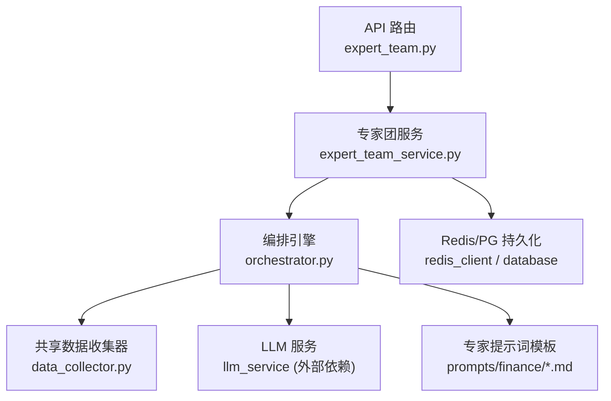
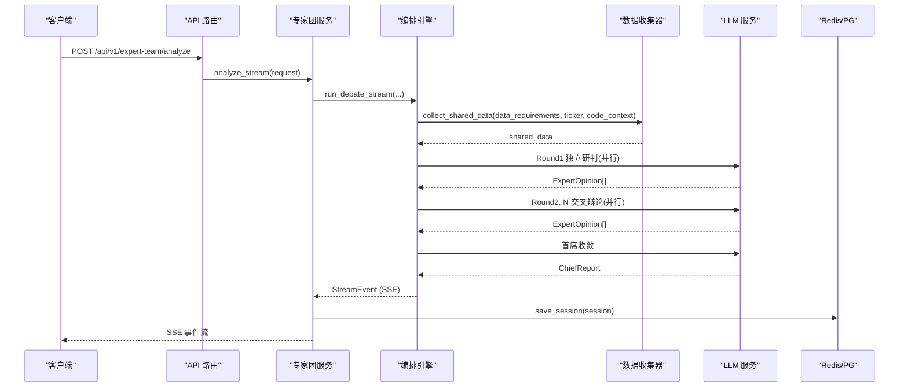
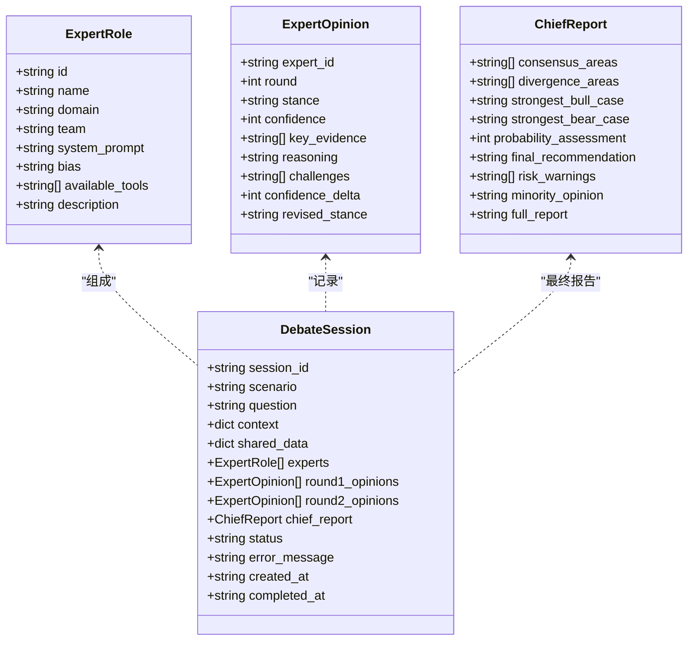
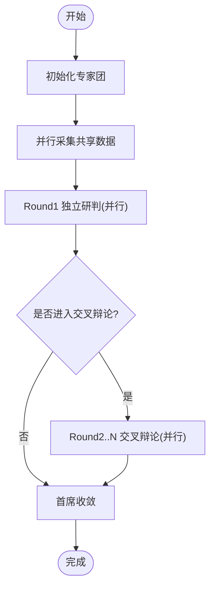
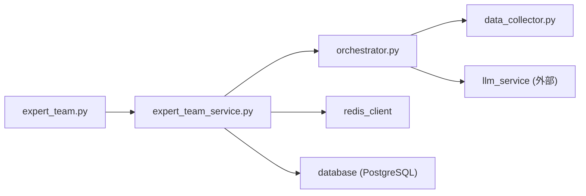

# 专家团队管理

<cite>
**本文引用的文件**
- [backend/routers/expert_team.py](file://backend/routers/expert_team.py)
- [backend/services/expert_team/expert_team_service.py](file://backend/services/expert_team/expert_team_service.py)
- [backend/services/expert_team/orchestrator.py](file://backend/services/expert_team/orchestrator.py)
- [backend/services/expert_team/models.py](file://backend/services/expert_team/models.py)
- [backend/services/expert_team/data_collector.py](file://backend/services/expert_team/data_collector.py)
- [backend/services/expert_team/prompts/finance/chief_investment_officer.md](file://backend/services/expert_team/prompts/finance/chief_investment_officer.md)
- [backend/services/expert_team/prompts/finance/industry_analyst.md](file://backend/services/expert_team/prompts/finance/industry_analyst.md)
- [backend/services/expert_team/prompts/finance/portfolio_risk_manager.md](file://backend/services/expert_team/prompts/finance/portfolio_risk_manager.md)
</cite>

## 目录
1. [简介](#简介)
2. [项目结构](#项目结构)
3. [核心组件](#核心组件)
4. [架构总览](#架构总览)
5. [详细组件分析](#详细组件分析)
6. [依赖关系分析](#依赖关系分析)
7. [性能考量](#性能考量)
8. [故障排查指南](#故障排查指南)
9. [结论](#结论)
10. [附录：使用示例与扩展指南](#附录使用示例与扩展指南)

## 简介
本技术文档面向“专家团队管理系统”，聚焦专家角色定义与管理机制、专家提示词工程、动态团队组建与任务分配算法、注册配置与管理 API、以及知识库构建与维护机制。系统通过三轮混合协议（独立研判→交叉辩论→首席收敛）组织多专家协作，结合共享数据包采集与流式事件输出，提供可扩展的金融与代码领域专家能力。

## 项目结构
围绕专家团队的核心代码位于后端服务层，主要包含路由、服务编排、数据模型、数据采集与提示词模板等模块。整体采用分层设计：API 路由负责鉴权与请求转发；服务层封装会话持久化与 SSE 流；编排器实现三轮辩论流程；数据收集器按场景需求并行拉取数据；提示词模板定义专家角色与输出规范。

图表来源
- [backend/routers/expert_team.py:48-103](file://backend/routers/expert_team.py#L48-L103)
- [backend/services/expert_team/expert_team_service.py:31-157](file://backend/services/expert_team/expert_team_service.py#L31-L157)
- [backend/services/expert_team/orchestrator.py:43-184](file://backend/services/expert_team/orchestrator.py#L43-L184)
- [backend/services/expert_team/data_collector.py:57-122](file://backend/services/expert_team/data_collector.py#L57-L122)

章节来源
- [backend/routers/expert_team.py:1-104](file://backend/routers/expert_team.py#L1-L104)
- [backend/services/expert_team/expert_team_service.py:1-229](file://backend/services/expert_team/expert_team_service.py#L1-L229)
- [backend/services/expert_team/orchestrator.py:1-552](file://backend/services/expert_team/orchestrator.py#L1-L552)
- [backend/services/expert_team/data_collector.py:1-192](file://backend/services/expert_team/data_collector.py#L1-L192)

## 核心组件
- 专家角色与数据模型：定义专家角色、观点、会话、场景模板及 SSE 事件结构，支撑结构化推理与可观测性。
- 专家团服务：统一入口，封装编排器调用、SSE 流式输出与会话双层持久化（Redis 热 + PG 冷）。
- 编排引擎：实现三轮混合协议（Round 1 独立研判、Round 2..N 交叉辩论、首席收敛），并发调度专家并控制超时。
- 共享数据收集器：根据场景模板的数据需求，通过工具注册表并行采集行情、基本面、技术指标、宏观新闻等，统一注入提示词。
- 提示词模板：以 Markdown 形式定义专家角色、专业领域、分析框架与输出风格，确保一致性与专业性。

章节来源
- [backend/services/expert_team/models.py:11-128](file://backend/services/expert_team/models.py#L11-L128)
- [backend/services/expert_team/expert_team_service.py:31-157](file://backend/services/expert_team/expert_team_service.py#L31-L157)
- [backend/services/expert_team/orchestrator.py:35-184](file://backend/services/expert_team/orchestrator.py#L35-L184)
- [backend/services/expert_team/data_collector.py:14-122](file://backend/services/expert_team/data_collector.py#L14-L122)
- [backend/services/expert_team/prompts/finance/chief_investment_officer.md:1-26](file://backend/services/expert_team/prompts/finance/chief_investment_officer.md#L1-L26)

## 架构总览
系统通过 FastAPI 路由暴露专家团分析接口，内部由专家团服务协调编排引擎执行三轮辩论。编排器在每轮中并行调用各专家（基于 LLM 结构化输出），并通过共享数据收集器获取上下文数据。最终由首席分析师综合所有观点生成收敛报告。会话状态与结果通过 Redis 与 PostgreSQL 进行双层持久化，支持高可用与历史回溯。

图表来源
- [backend/routers/expert_team.py:48-77](file://backend/routers/expert_team.py#L48-L77)
- [backend/services/expert_team/expert_team_service.py:37-61](file://backend/services/expert_team/expert_team_service.py#L37-L61)
- [backend/services/expert_team/orchestrator.py:43-184](file://backend/services/expert_team/orchestrator.py#L43-L184)
- [backend/services/expert_team/data_collector.py:57-122](file://backend/services/expert_team/data_collector.py#L57-L122)

## 详细组件分析

### 专家角色与提示词工程
- 角色定义：通过数据模型中的专家角色字段描述 ID、名称、领域、团队、系统提示词、偏见倾向、可用工具集与简介。
- 提示词模板：金融域包含首席投资官、行业分析师、组合风控经理等角色，分别定义专业领域、分析框架与输出风格，确保专家输出的一致性与专业性。
- 输出格式规范：每轮专家输出为结构化 JSON（立场、置信度、关键依据、推理过程），第二轮增加质疑、置信度变化与修正观点；首席报告包含共识区、分歧区、概率评估与建议等。

图表来源
- [backend/services/expert_team/models.py:11-69](file://backend/services/expert_team/models.py#L11-L69)

章节来源
- [backend/services/expert_team/models.py:11-69](file://backend/services/expert_team/models.py#L11-L69)
- [backend/services/expert_team/prompts/finance/chief_investment_officer.md:1-26](file://backend/services/expert_team/prompts/finance/chief_investment_officer.md#L1-L26)
- [backend/services/expert_team/prompts/finance/industry_analyst.md:1-24](file://backend/services/expert_team/prompts/finance/industry_analyst.md#L1-L24)
- [backend/services/expert_team/prompts/finance/portfolio_risk_manager.md:1-25](file://backend/services/expert_team/prompts/finance/portfolio_risk_manager.md#L1-L25)

### 动态团队组建与任务分配算法
- 团队组建：根据场景模板或自定义专家 IDs 实例化专家阵容；若未指定则使用场景默认阵容。
- 任务分配：编排器在每个阶段并行调度所有专家任务，设置单专家超时与整轮超时，保证整体响应时间可控。
- 匹配策略：当前实现基于场景模板的 data_requirements 与专家可用工具集进行数据准备；专家选择由场景模板或传入 expert_ids 决定，便于按能力与负载进行动态调整。
- 工作负载平衡：通过 asyncio.gather 并行执行专家任务，避免串行瓶颈；异常与超时被捕获并降级为失败意见，保障流程继续。

图表来源
- [backend/services/expert_team/orchestrator.py:72-184](file://backend/services/expert_team/orchestrator.py#L72-L184)

章节来源
- [backend/services/expert_team/orchestrator.py:72-184](file://backend/services/expert_team/orchestrator.py#L72-L184)

### 专家提示词工程与输出规范
- 角色设定：每个专家拥有独立的系统提示词，明确职责边界与分析框架。
- 专业领域限定：通过领域标签与团队分类约束专家能力范围，避免越界回答。
- 输出格式规范：强制结构化 JSON 输出，便于后续解析与可视化；首席报告包含概率评估与风险提示，确保决策可追溯。

章节来源
- [backend/services/expert_team/models.py:86-128](file://backend/services/expert_team/models.py#L86-L128)
- [backend/services/expert_team/prompts/finance/chief_investment_officer.md:1-26](file://backend/services/expert_team/prompts/finance/chief_investment_officer.md#L1-L26)

### 共享数据包与知识库构建维护
- 共享数据包：根据场景模板的数据需求，通过工具注册表并行采集行情、基本面、技术指标、宏观新闻、市场复盘等；未知或不可用类型标记为跳过或错误，并在提示词中说明。
- 知识库构建：将采集到的数据格式化后注入专家提示词，形成统一的上下文；额外上下文可通过请求参数注入，支持灵活扩展。
- 更新策略：数据收集器具备超时保护与异常处理，确保部分数据源失败不影响整体流程；提示词模板可独立迭代，无需改动核心逻辑。

章节来源
- [backend/services/expert_team/data_collector.py:14-122](file://backend/services/expert_team/data_collector.py#L14-L122)
- [backend/services/expert_team/data_collector.py:151-192](file://backend/services/expert_team/data_collector.py#L151-L192)

### API 接口文档
- 发起分析（SSE 流式）
  - 路径：POST /api/v1/expert-team/analyze
  - 认证：Bearer Token 或 Cookie（JWT）
  - 请求体：场景 ID、问题、标的代码（可选）、代码片段（可选）、额外上下文、轮数、自定义专家 IDs
  - 响应：SSE 事件流，包含状态、专家观点、轮次完成、首席报告、错误与完成事件
- 场景模板列表
  - 路径：GET /api/v1/expert-team/scenarios
  - 认证：同上
  - 响应：可用场景模板列表
- 历史会话列表
  - 路径：GET /api/v1/expert-team/sessions?limit=20
  - 认证：同上
  - 响应：会话摘要列表（含状态、专家数量、概率评估等）
- 完整会话记录
  - 路径：GET /api/v1/expert-team/sessions/{session_id}
  - 认证：同上
  - 响应：完整辩论记录（含共享数据、专家观点、首席报告）

章节来源
- [backend/routers/expert_team.py:22-103](file://backend/routers/expert_team.py#L22-L103)

## 依赖关系分析
- 路由依赖服务：路由层仅负责鉴权与请求转发，实际业务逻辑在服务层。
- 服务依赖编排器：服务层封装编排器调用与持久化，屏蔽复杂流程细节。
- 编排器依赖数据收集器与 LLM：编排器通过数据收集器获取上下文，调用 LLM 进行结构化推理。
- 持久化依赖 Redis 与 PG：服务层实现双层持久化，优先 Redis，回退至 PG，内存兜底。

图表来源
- [backend/routers/expert_team.py:48-103](file://backend/routers/expert_team.py#L48-L103)
- [backend/services/expert_team/expert_team_service.py:31-157](file://backend/services/expert_team/expert_team_service.py#L31-L157)
- [backend/services/expert_team/orchestrator.py:43-184](file://backend/services/expert_team/orchestrator.py#L43-L184)
- [backend/services/expert_team/data_collector.py:57-122](file://backend/services/expert_team/data_collector.py#L57-L122)

章节来源
- [backend/routers/expert_team.py:48-103](file://backend/routers/expert_team.py#L48-L103)
- [backend/services/expert_team/expert_team_service.py:31-157](file://backend/services/expert_team/expert_team_service.py#L31-L157)
- [backend/services/expert_team/orchestrator.py:43-184](file://backend/services/expert_team/orchestrator.py#L43-L184)
- [backend/services/expert_team/data_collector.py:57-122](file://backend/services/expert_team/data_collector.py#L57-L122)

## 性能考量
- 并发与超时：专家任务并行执行，单专家与整轮均设置超时，防止长尾阻塞。
- 数据收集优化：共享数据包并行采集，避免重复调用外部 API；对失败与超时数据进行降级处理。
- 持久化策略：Redis 热缓存提升读取性能，PG 冷存储保证持久化；异步写入不阻塞 SSE 流。
- 流式输出：SSE 事件分片推送，提升前端渲染体验与实时性。

[本节为通用性能讨论，不直接分析具体文件]

## 故障排查指南
- 鉴权失败：检查请求是否携带合法 JWT（Header 或 Cookie），确认密钥与算法配置正确。
- 数据源不可用：查看共享数据包中的状态字段，识别跳过或错误的数据类型；检查工具注册表与网络连通性。
- 专家超时或异常：关注编排器的超时日志与异常堆栈，必要时调整超时阈值或减少专家数量。
- 持久化失败：检查 Redis 与 PG 连接状态；服务层已实现降级与兜底，但需关注告警日志。

章节来源
- [backend/routers/expert_team.py:22-46](file://backend/routers/expert_team.py#L22-L46)
- [backend/services/expert_team/expert_team_service.py:67-194](file://backend/services/expert_team/expert_team_service.py#L67-L194)
- [backend/services/expert_team/orchestrator.py:254-456](file://backend/services/expert_team/orchestrator.py#L254-L456)
- [backend/services/expert_team/data_collector.py:125-148](file://backend/services/expert_team/data_collector.py#L125-L148)

## 结论
专家团队管理系统通过清晰的分层架构、灵活的提示词工程与健壮的编排流程，实现了多专家协作的智能投研与代码审查能力。系统支持动态团队组建、并行数据处理与流式输出，并提供双层持久化与完善的错误处理机制。未来可进一步扩展专家角色与数据源，增强匹配策略与工作负载平衡算法。

[本节为总结性内容，不直接分析具体文件]

## 附录：使用示例与扩展指南
- 添加新专家角色
  - 在提示词目录新增 Markdown 文件，定义角色、领域、分析框架与输出风格。
  - 在数据模型中扩展专家角色字段（如领域、团队、可用工具集）。
  - 在场景模板或注册表中引用新专家 ID，参与团队组建。
- 定制分析模板
  - 修改场景模板的数据需求列表，控制共享数据包采集范围。
  - 调整编排器的轮数与超时配置，平衡深度与响应时间。
  - 通过 extra_context 注入额外上下文，支持个性化分析。

章节来源
- [backend/services/expert_team/models.py:11-81](file://backend/services/expert_team/models.py#L11-L81)
- [backend/services/expert_team/data_collector.py:14-51](file://backend/services/expert_team/data_collector.py#L14-L51)
- [backend/services/expert_team/orchestrator.py:72-184](file://backend/services/expert_team/orchestrator.py#L72-L184)
