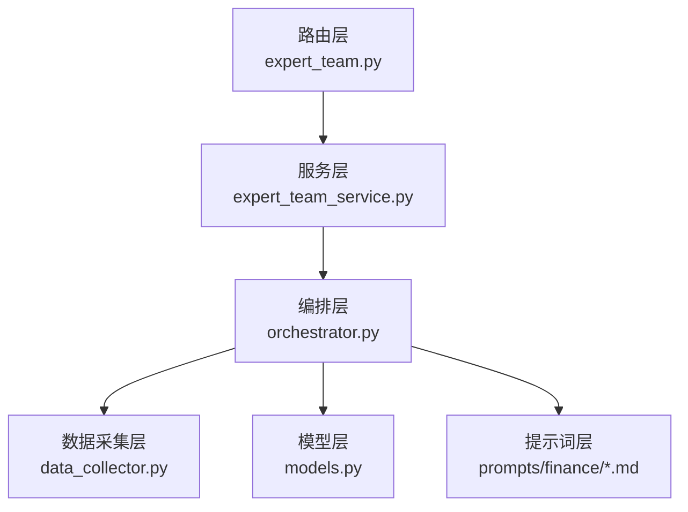
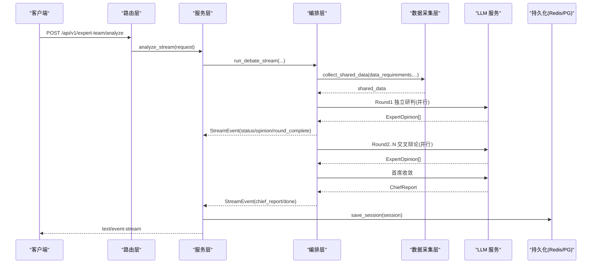
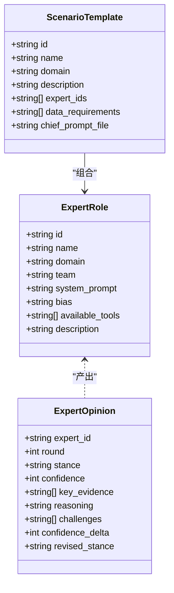
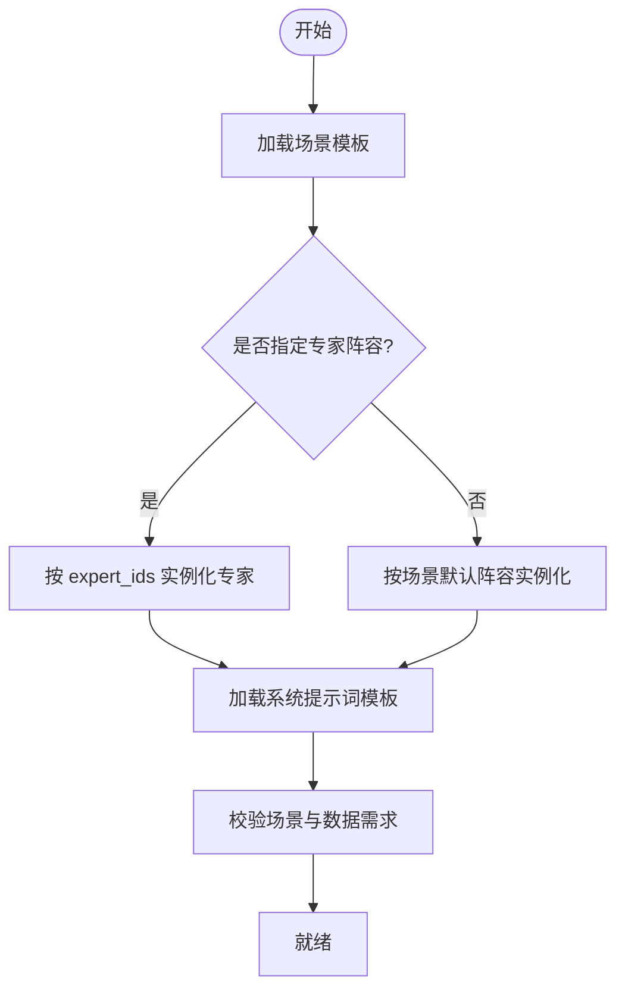
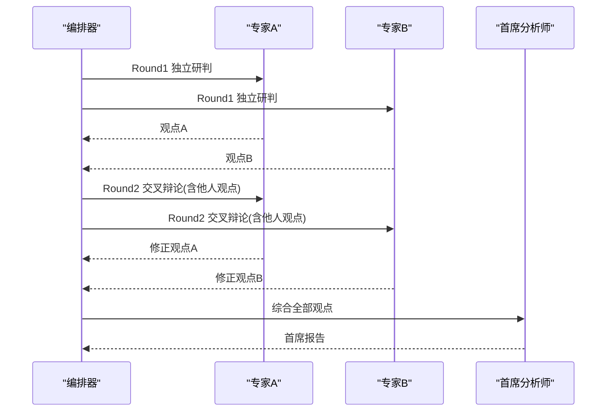
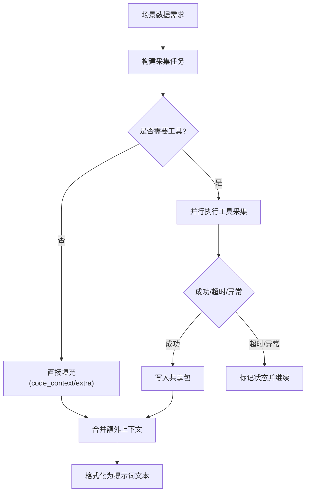
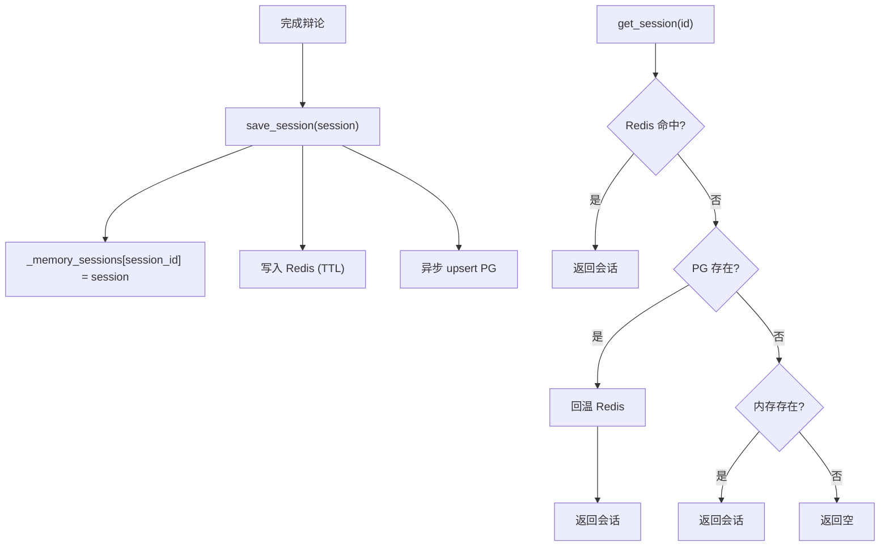
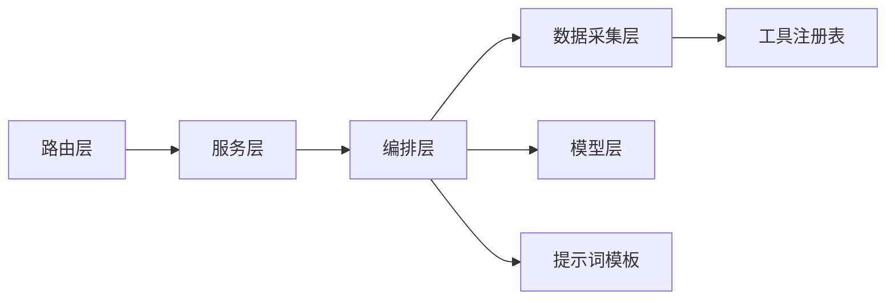

# 专家角色管理

<cite>
**本文引用的文件**
- [backend/routers/expert_team.py](file://backend/routers/expexpert_team.py)
- [backend/services/expert_team/expert_team_service.py](file://backend/services/expert_team/expert_team_service.py)
- [backend/services/expert_team/orchestrator.py](file://backend/services/expert_team/orchestrator.py)
- [backend/services/expert_team/models.py](file://backend/services/expert_team/models.py)
- [backend/services/expert_team/data_collector.py](file://backend/services/expert_team/data_collector.py)
- [backend/services/expert_team/prompts/finance/chief_investment_officer.md](file://backend/services/expert_team/prompts/finance/chief_investment_officer.md)
- [backend/services/expert_team/prompts/finance/fundamental.md](file://backend/services/expert_team/prompts/finance/fundamental.md)
- [backend/services/expert_team/prompts/finance/industry_analyst.md](file://backend/services/expert_team/prompts/finance/industry_analyst.md)
</cite>

## 目录
1. [简介](#简介)
2. [项目结构](#项目结构)
3. [核心组件](#核心组件)
4. [架构总览](#架构总览)
5. [详细组件分析](#详细组件分析)
6. [依赖关系分析](#依赖关系分析)
7. [性能与扩展性](#性能与扩展性)
8. [故障排查指南](#故障排查指南)
9. [结论](#结论)
10. [附录：API 接口规范与使用示例](#附录api-接口规范与使用示例)

## 简介
本技术文档围绕“专家角色管理系统”展开，聚焦以下目标：
- 解释预定义的专家角色类型（如首席投资官、行业分析师、风险管理师、技术分析师等）的职责定义与权限范围。
- 说明专家角色的注册机制（角色元数据、能力标签、专业领域限定）。
- 阐述专家角色的动态加载与热更新机制（提示词模板的解析与验证）。
- 提供完整的 API 接口文档（角色查询、注册、配置更新）。
- 给出添加自定义专家角色与配置角色权限的具体使用示例。

## 项目结构
专家角色管理相关代码主要位于后端服务模块中，采用分层设计：
- 路由层：暴露 HTTP 接口，负责鉴权与请求转发。
- 服务层：封装编排器与持久化逻辑，提供统一入口。
- 编排层：实现多轮辩论流程、数据采集、LLM 调用与事件流输出。
- 模型层：定义专家角色、会话、场景模板、SSE 事件等数据结构。
- 数据采集层：根据场景需求并行采集共享数据包。
- 提示词层：按领域组织专家系统提示词模板。

**图表来源**
- [backend/routers/expert_team.py:1-104](file://backend/routers/expert_team.py#L1-L104)
- [backend/services/expert_team/expert_team_service.py:1-229](file://backend/services/expert_team/expert_team_service.py#L1-L229)
- [backend/services/expert_team/orchestrator.py:1-552](file://backend/services/expert_team/orchestrator.py#L1-L552)
- [backend/services/expert_team/data_collector.py:1-192](file://backend/services/expert_team/data_collector.py#L1-L192)
- [backend/services/expert_team/models.py:1-128](file://backend/services/expert_team/models.py#L1-L128)

**章节来源**
- [backend/routers/expert_team.py:1-104](file://backend/routers/expert_team.py#L1-L104)
- [backend/services/expert_team/expert_team_service.py:1-229](file://backend/services/expert_team/expert_team_service.py#L1-L229)
- [backend/services/expert_team/orchestrator.py:1-552](file://backend/services/expert_team/orchestrator.py#L1-L552)
- [backend/services/expert_team/models.py:1-128](file://backend/services/expert_team/models.py#L1-L128)
- [backend/services/expert_team/data_collector.py:1-192](file://backend/services/expert_team/data_collector.py#L1-L192)

## 核心组件
- 专家角色模型：定义角色 ID、名称、领域、团队、系统提示词、偏见倾向、可用工具列表、描述等元数据。
- 会话与观点模型：记录单轮专家观点、置信度、关键依据、推理过程、质疑与修正。
- 场景模板：预配置的专家组合、数据需求、首席提示词文件。
- 编排引擎：实现三轮混合协议（独立研判→交叉辩论→首席收敛），并输出 SSE 事件流。
- 数据采集器：基于场景的数据需求，通过工具注册表并行采集共享数据包。
- 服务层：统一入口，封装编排器与双层持久化（Redis 热 + PG 冷）。
- 路由层：提供 REST 接口与 JWT 鉴权。

**章节来源**
- [backend/services/expert_team/models.py:11-81](file://backend/services/expert_team/models.py#L11-L81)
- [backend/services/expert_team/orchestrator.py:35-184](file://backend/services/expert_team/orchestrator.py#L35-L184)
- [backend/services/expert_team/data_collector.py:14-122](file://backend/services/expert_team/data_collector.py#L14-L122)
- [backend/services/expert_team/expert_team_service.py:31-157](file://backend/services/expert_team/expert_team_service.py#L31-L157)
- [backend/routers/expert_team.py:22-104](file://backend/routers/expert_team.py#L22-L104)

## 架构总览
专家角色管理的整体流程如下：
- 客户端通过路由层发起分析请求（携带场景、问题、可选标的或代码上下文）。
- 服务层创建会话，调用编排器执行多轮辩论。
- 编排器初始化专家团（从场景模板或自定义专家阵容），采集共享数据，依次执行 Round 1/2/N 与首席收敛。
- 每步以 SSE 事件流推送状态、专家观点、轮次完成、首席报告与完成信号。
- 完成后异步持久化至 Redis 与 PostgreSQL，支持历史会话查询。

**图表来源**
- [backend/routers/expert_team.py:48-77](file://backend/routers/expert_team.py#L48-L77)
- [backend/services/expert_team/expert_team_service.py:37-61](file://backend/services/expert_team/expert_team_service.py#L37-L61)
- [backend/services/expert_team/orchestrator.py:43-184](file://backend/services/expert_team/orchestrator.py#L43-L184)
- [backend/services/expert_team/data_collector.py:57-122](file://backend/services/expert_team/data_collector.py#L57-L122)

## 详细组件分析

### 专家角色模型与职责
- 角色元数据：id、name、domain、team、system_prompt、bias、available_tools、description。
- 金融域预置角色示例：
  - 首席投资官：站在最高决策层视角，关注资产配置、战略方向、投委会决策框架、长期复利思维与能力圈边界；输出明确决策、置信度、仓位建议与退出预案。
  - 基本面分析师：三表质量、盈利能力、现金流健康度、盈利可持续性；强调数据驱动与事实/推测区分。
  - 行业分析师：行业格局、市场空间、产业链地位、生命周期、政策环境；量化市场空间与 KSF。
- 权限范围：通过 available_tools 限制每个专家可调用的工具子集，确保最小权限原则。

**图表来源**
- [backend/services/expert_team/models.py:11-81](file://backend/services/expert_team/models.py#L11-L81)

**章节来源**
- [backend/services/expert_team/models.py:11-81](file://backend/services/expert_team/models.py#L11-L81)
- [backend/services/expert_team/prompts/finance/chief_investment_officer.md:1-26](file://backend/services/expert_team/prompts/finance/chief_investment_officer.md#L1-L26)
- [backend/services/expert_team/prompts/finance/fundamental.md:1-22](file://backend/services/expert_team/prompts/finance/fundamental.md#L1-L22)
- [backend/services/expert_team/prompts/finance/industry_analyst.md:1-24](file://backend/services/expert_team/prompts/finance/industry_analyst.md#L1-L24)

### 动态加载与热更新机制
- 动态加载：
  - 场景模板由注册表提供，支持按 scenario_id 获取默认专家阵容。
  - 支持传入 expert_ids 覆盖默认阵容，按顺序实例化专家，保留场景的数据需求与首席提示词。
- 热更新：
  - 系统提示词来自 prompts/finance/*.md 等模板文件，运行时读取并注入到专家 system_prompt。
  - 修改模板文件后无需重启即可生效（由编排器在运行期加载）。
- 验证：
  - 路由层在发起分析前校验场景是否存在，避免非法场景进入流程。
  - 数据采集器对未知数据类型返回跳过状态，保证鲁棒性。

**图表来源**
- [backend/services/expert_team/orchestrator.py:72-89](file://backend/services/expert_team/orchestrator.py#L72-L89)
- [backend/routers/expert_team.py:60-67](file://backend/routers/expert_team.py#L60-L67)
- [backend/services/expert_team/data_collector.py:80-95](file://backend/services/expert_team/data_collector.py#L80-L95)

**章节来源**
- [backend/services/expert_team/orchestrator.py:72-89](file://backend/services/expert_team/orchestrator.py#L72-L89)
- [backend/routers/expert_team.py:60-67](file://backend/routers/expert_team.py#L60-L67)
- [backend/services/expert_team/data_collector.py:80-95](file://backend/services/expert_team/data_collector.py#L80-L95)

### 多轮辩论与事件流
- Round 1：各专家并行独立研判，输出结构化观点（立场、置信度、依据、推理）。
- Round 2..N：交叉辩论，专家审视他人观点并修正自身判断，输出质疑与置信度变化。
- 首席收敛：综合全部辩论内容生成最终报告（共识区、分歧区、最强论据、概率评估、建议、风险提示、少数派意见、完整报告）。
- 事件流：SSE 推送 status、expert_opinion、round_complete、chief_report、done/error 等事件，首片附带完整数据，后续增量文本。

**图表来源**
- [backend/services/expert_team/orchestrator.py:110-161](file://backend/services/expert_team/orchestrator.py#L110-L161)
- [backend/services/expert_team/orchestrator.py:254-456](file://backend/services/expert_team/orchestrator.py#L254-L456)
- [backend/services/expert_team/orchestrator.py:460-525](file://backend/services/expert_team/orchestrator.py#L460-L525)

**章节来源**
- [backend/services/expert_team/orchestrator.py:110-161](file://backend/services/expert_team/orchestrator.py#L110-L161)
- [backend/services/expert_team/orchestrator.py:254-456](file://backend/services/expert_team/orchestrator.py#L254-L456)
- [backend/services/expert_team/orchestrator.py:460-525](file://backend/services/expert_team/orchestrator.py#L460-L525)

### 数据采集与共享包
- 数据类型映射：quote、fundamental、technicals、macro_news、sentiment、market_review、code_context。
- 并行采集：按场景 data_requirements 并发调用工具，超时保护与错误降级。
- 格式化：将共享数据转为 prompt 可读文本，控制长度避免超出上下文窗口。

**图表来源**
- [backend/services/expert_team/data_collector.py:14-51](file://backend/services/expert_team/data_collector.py#L14-L51)
- [backend/services/expert_team/data_collector.py:57-122](file://backend/services/expert_team/data_collector.py#L57-L122)
- [backend/services/expert_team/data_collector.py:151-192](file://backend/services/expert_team/data_collector.py#L151-L192)

**章节来源**
- [backend/services/expert_team/data_collector.py:14-192](file://backend/services/expert_team/data_collector.py#L14-L192)

### 持久化与会话管理
- 双层持久化：Redis 热缓存（TTL 12 小时）+ PostgreSQL 冷存储。
- 三级降级：Redis → PG → 内存兜底，保证本地可运行。
- 会话查询：列表与详情接口，返回摘要与完整记录。

**图表来源**
- [backend/services/expert_team/expert_team_service.py:67-157](file://backend/services/expert_team/expert_team_service.py#L67-L157)

**章节来源**
- [backend/services/expert_team/expert_team_service.py:67-157](file://backend/services/expert_team/expert_team_service.py#L67-L157)

## 依赖关系分析
- 路由层依赖服务层与模型层，提供鉴权与接口。
- 服务层依赖编排器与模型层，封装持久化。
- 编排层依赖数据采集器、LLM 服务、模型层与提示词模板。
- 数据采集层依赖工具注册表，按场景需求并行采集。

**图表来源**
- [backend/routers/expert_team.py:17-18](file://backend/routers/expert_team.py#L17-L18)
- [backend/services/expert_team/expert_team_service.py:11-19](file://backend/services/expert_team/expert_team_service.py#L11-L19)
- [backend/services/expert_team/orchestrator.py:12-28](file://backend/services/expert_team/orchestrator.py#L12-L28)
- [backend/services/expert_team/data_collector.py:14-51](file://backend/services/expert_team/data_collector.py#L14-L51)

**章节来源**
- [backend/routers/expert_team.py:17-18](file://backend/routers/expert_team.py#L17-L18)
- [backend/services/expert_team/expert_team_service.py:11-19](file://backend/services/expert_team/expert_team_service.py#L11-L19)
- [backend/services/expert_team/orchestrator.py:12-28](file://backend/services/expert_team/orchestrator.py#L12-L28)
- [backend/services/expert_team/data_collector.py:14-51](file://backend/services/expert_team/data_collector.py#L14-L51)

## 性能与扩展性
- 并发与超时：Round 1/2 并行调度专家，设置整轮与单专家超时，防止阻塞。
- 流式输出：SSE 分片推送，提升前端渲染体验。
- 持久化降级：Redis/PG/内存三级降级，提高可用性。
- 可扩展点：
  - 新增专家角色：在提示词目录添加模板，并在注册表中声明角色元数据与可用工具。
  - 新增场景模板：定义 expert_ids、data_requirements、chief_prompt_file。
  - 新增数据类型：在数据采集器中注册新工具映射与参数键。

[本节为通用指导，不直接分析具体文件]

## 故障排查指南
- 场景不存在：路由层校验失败返回 400，检查 scenario_id 是否正确。
- 工具不可用：数据采集器返回跳过状态，检查工具注册表与参数。
- 超时与异常：编排器捕获异常并记录，检查 LLM 服务与网络状况。
- 持久化失败：Redis/PG 写入失败降级为内存，检查数据库连接与缓存服务。

**章节来源**
- [backend/routers/expert_team.py:60-67](file://backend/routers/expert_team.py#L60-L67)
- [backend/services/expert_team/data_collector.py:80-148](file://backend/services/expert_team/data_collector.py#L80-L148)
- [backend/services/expert_team/orchestrator.py:174-184](file://backend/services/expert_team/orchestrator.py#L174-L184)
- [backend/services/expert_team/expert_team_service.py:160-194](file://backend/services/expert_team/expert_team_service.py#L160-L194)

## 结论
专家角色管理系统通过清晰的模型定义、动态加载与热更新、多轮辩论编排、流式事件输出与双层持久化，提供了可扩展、高可用的专家协作能力。通过合理配置角色元数据、能力标签与专业领域限定，可实现灵活的角色权限控制与业务适配。

[本节为总结，不直接分析具体文件]

## 附录：API 接口规范与使用示例

### 接口总览
- POST /api/v1/expert-team/analyze：发起专家团分析（SSE 流式响应）
- GET /api/v1/expert-team/scenarios：获取所有可用场景模板
- GET /api/v1/expert-team/sessions：获取历史会话列表
- GET /api/v1/expert-team/sessions/{session_id}：获取完整辩论记录

鉴权方式：Bearer Token 或 Cookie（JWT），缺失或无效返回 401。

**章节来源**
- [backend/routers/expert_team.py:22-104](file://backend/routers/expert_team.py#L22-L104)

### 请求与响应模型
- AnalyzeRequest：scenario、question、ticker、code_context、extra_context、rounds、expert_ids
- SessionSummary：session_id、scenario、question、status、expert_count、probability_assessment、created_at、completed_at
- StreamEvent：type（status/expert_opinion/round_complete/chief_report/error/done）、data、message、content

**章节来源**
- [backend/services/expert_team/models.py:86-128](file://backend/services/expert_team/models.py#L86-L128)

### 使用示例
- 添加自定义专家角色：
  - 在 prompts/finance 下新增 .md 模板，定义角色职责与分析框架。
  - 在注册表中声明角色元数据（id、name、domain、team、system_prompt、available_tools、description）。
  - 在场景模板中将该专家加入 expert_ids，或在请求中通过 expert_ids 覆盖默认阵容。
- 配置角色权限：
  - 通过 available_tools 限制该专家可调用的工具子集，遵循最小权限原则。
  - 在数据采集器中为新工具注册映射与参数键，确保共享数据包正确采集。

[本节为操作指引，不直接引用具体代码片段]
