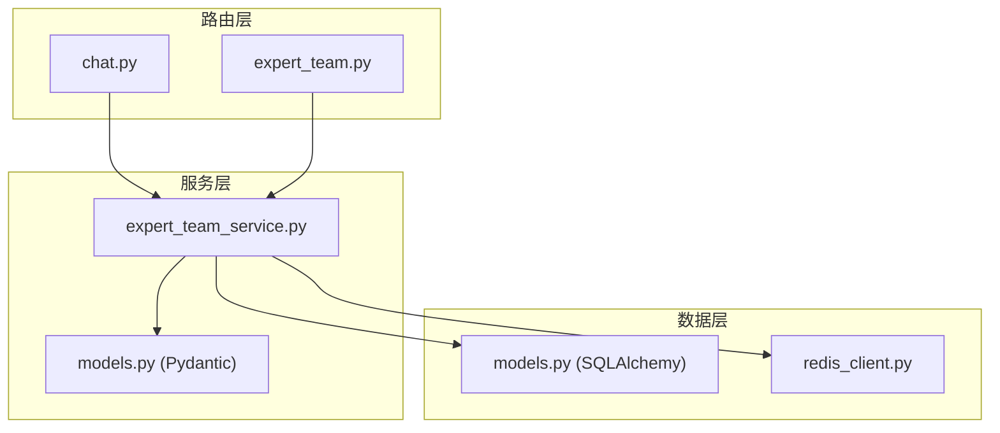
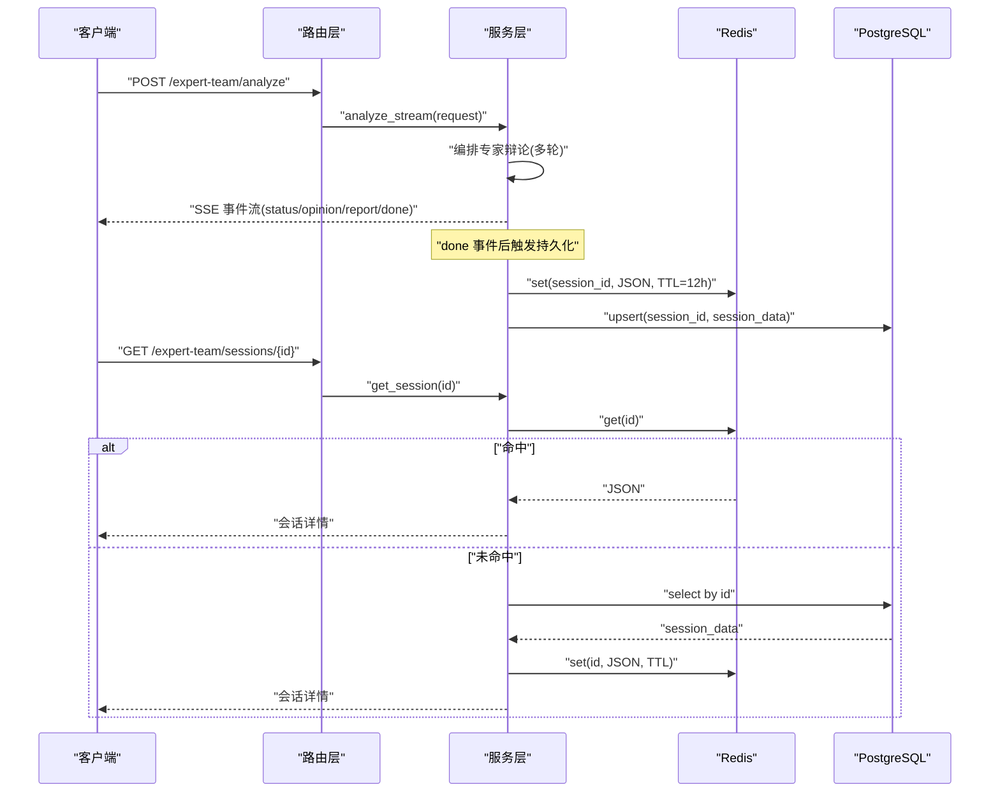
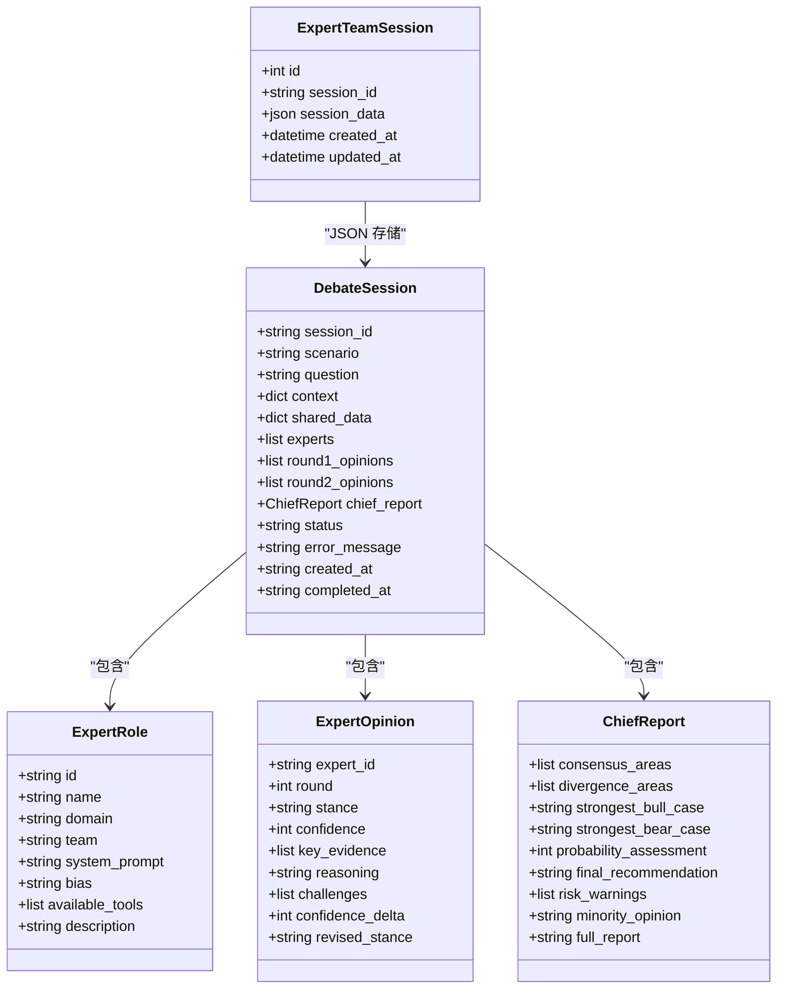
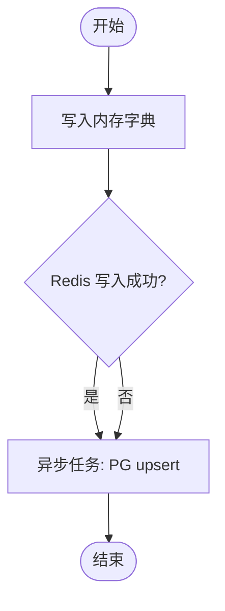
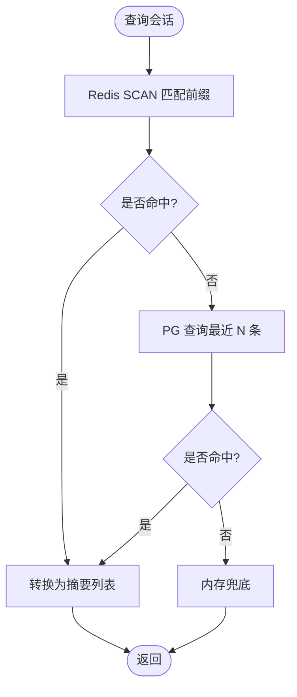
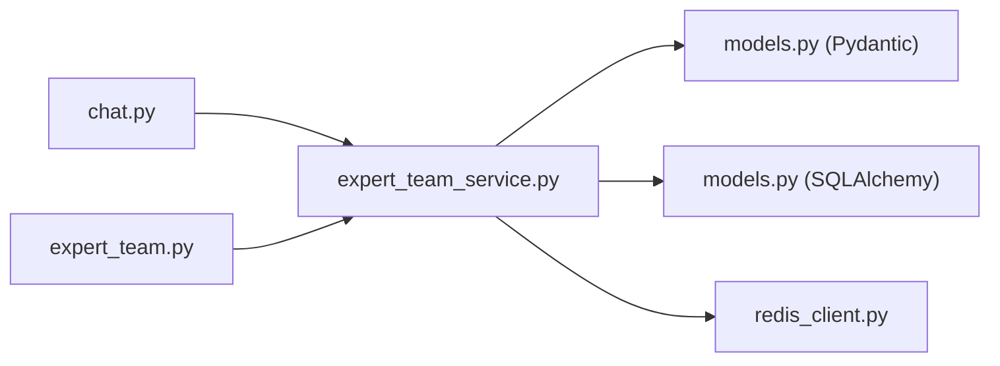

# 会话持久化

<cite>
**本文引用的文件**
- [backend/routers/chat.py](file://backend/routers/chat.py)
- [backend/routers/expert_team.py](file://backend/routers/expert_team.py)
- [backend/services/expert_team/expert_team_service.py](file://backend/services/expert_team/expert_team_service.py)
- [backend/services/expert_team/models.py](file://backend/services/expert_team/models.py)
- [backend/core/models.py](file://backend/core/models.py)
- [backend/core/redis_client.py](file://backend/core/redis_client.py)
</cite>

## 目录
1. [简介](#简介)
2. [项目结构](#项目结构)
3. [核心组件](#核心组件)
4. [架构总览](#架构总览)
5. [详细组件分析](#详细组件分析)
6. [依赖关系分析](#依赖关系分析)
7. [性能考量](#性能考量)
8. [故障排查指南](#故障排查指南)
9. [结论](#结论)
10. [附录：API 与使用示例](#附录api-与使用示例)

## 简介
本技术文档围绕“专家辩论会话持久化系统”展开，重点说明双层持久化架构（Redis 热缓存 + PostgreSQL 冷存储）的协同机制、会话生命周期管理（创建、状态跟踪、自动过期与清理）、序列化格式与数据完整性保证、以及查询与恢复机制。同时提供历史会话查询、对话状态恢复、备份与恢复的具体使用示例，帮助读者快速上手并正确运维该系统。

## 项目结构
与会话持久化相关的代码主要分布在以下模块：
- 路由层：对外暴露 REST/SSE 接口，负责鉴权、参数校验与调用服务层
- 服务层：封装专家团编排与双层持久化策略（Redis 热 + PG 冷），并提供会话列表与详情查询
- 模型层：定义会话数据结构（Pydantic 模型）与数据库表映射（SQLAlchemy）
- 基础设施：Redis 客户端与连接池、批量写入器、本地 L1 缓存等

图表来源
- [backend/routers/chat.py:184-224](file://backend/routers/chat.py#L184-L224)
- [backend/routers/expert_team.py:48-103](file://backend/routers/expert_team.py#L48-L103)
- [backend/services/expert_team/expert_team_service.py:37-194](file://backend/services/expert_team/expert_team_service.py#L37-L194)
- [backend/services/expert_team/models.py:53-128](file://backend/services/expert_team/models.py#L53-L128)
- [backend/core/models.py:106-137](file://backend/core/models.py#L106-L137)
- [backend/core/redis_client.py:11-34](file://backend/core/redis_client.py#L11-L34)

章节来源
- [backend/routers/chat.py:184-224](file://backend/routers/chat.py#L184-L224)
- [backend/routers/expert_team.py:48-103](file://backend/routers/expert_team.py#L48-L103)
- [backend/services/expert_team/expert_team_service.py:37-194](file://backend/services/expert_team/expert_team_service.py#L37-L194)
- [backend/services/expert_team/models.py:53-128](file://backend/services/expert_team/models.py#L53-L128)
- [backend/core/models.py:106-137](file://backend/core/models.py#L106-L137)
- [backend/core/redis_client.py:11-34](file://backend/core/redis_client.py#L11-L34)

## 核心组件
- 路由层
  - chat.py：提供聊天流式接口与历史会话 CRUD（基于 AgentSession 表）
  - expert_team.py：提供专家团分析 SSE 接口与历史会话列表/详情（基于 ExpertTeamSession 表）
- 服务层
  - expert_team_service.py：实现双层持久化（Redis TTL 热缓存 + PG 冷存储），会话列表/详情查询，SSE 事件流处理
- 模型层
  - models.py（Pydantic）：DebateSession、ExpertRole、ExpertOpinion、ChiefReport、ScenarioTemplate、AnalyzeRequest、SessionSummary、StreamEvent
  - models.py（SQLAlchemy）：AgentSession、ExpertTeamSession 等持久化表
- 基础设施
  - redis_client.py：异步 Redis 客户端、连接池、批量写入器、进程内 L1 缓存

章节来源
- [backend/routers/chat.py:184-224](file://backend/routers/chat.py#L184-L224)
- [backend/routers/expert_team.py:48-103](file://backend/routers/expert_team.py#L48-L103)
- [backend/services/expert_team/expert_team_service.py:37-194](file://backend/services/expert_team/expert_team_service.py#L37-L194)
- [backend/services/expert_team/models.py:53-128](file://backend/services/expert_team/models.py#L53-L128)
- [backend/core/models.py:106-137](file://backend/core/models.py#L106-L137)
- [backend/core/redis_client.py:11-34](file://backend/core/redis_client.py#L11-L34)

## 架构总览
系统采用“三层降级读取 + 双层落盘写入”的设计：
- 写入路径
  - 内存兜底：始终写入进程内字典（确保本地可运行）
  - Redis 热缓存：设置 TTL（默认 12 小时），用于快速读取
  - PostgreSQL 冷存储：异步 upsert，保证持久性与可恢复性
- 读取路径
  - 优先从 Redis 获取（低延迟）
  - 失败则回退到 PostgreSQL（高可靠）
  - 再失败则返回内存兜底（容灾）

图表来源
- [backend/routers/expert_team.py:48-103](file://backend/routers/expert_team.py#L48-L103)
- [backend/services/expert_team/expert_team_service.py:37-194](file://backend/services/expert_team/expert_team_service.py#L37-L194)

章节来源
- [backend/routers/expert_team.py:48-103](file://backend/routers/expert_team.py#L48-L103)
- [backend/services/expert_team/expert_team_service.py:37-194](file://backend/services/expert_team/expert_team_service.py#L37-L194)

## 详细组件分析

### 会话数据模型与序列化
- Pydantic 模型（服务层）
  - DebateSession：包含 session_id、scenario、question、context、shared_data、experts、round1_opinions、round2_opinions、chief_report、status、error_message、created_at、completed_at
  - ExpertRole/ExpertOpinion/ChiefReport：描述专家角色、观点与最终报告
  - ScenarioTemplate/AnalyzeRequest/SessionSummary/StreamEvent：场景模板、请求体、摘要与 SSE 事件
- SQLAlchemy 模型（数据层）
  - AgentSession：agent 会话消息持久化（messages 为 JSON）
  - ExpertTeamSession：专家团会话持久化（session_data 为完整 DebateSession JSON）

图表来源
- [backend/services/expert_team/models.py:11-128](file://backend/services/expert_team/models.py#L11-L128)
- [backend/core/models.py:126-137](file://backend/core/models.py#L126-L137)

章节来源
- [backend/services/expert_team/models.py:11-128](file://backend/services/expert_team/models.py#L11-L128)
- [backend/core/models.py:126-137](file://backend/core/models.py#L126-L137)

### 双层持久化写入流程
- 写入顺序与职责
  - 内存兜底：立即写入进程内字典，保障本地可运行
  - Redis 热缓存：设置 TTL（默认 12 小时），加速后续读取
  - PostgreSQL 冷存储：异步 upsert，确保长期可恢复
- 异常与降级
  - Redis 写入失败仅记录警告，不阻塞主流程
  - PG 写入失败仅记录警告，不影响 SSE 流式响应

图表来源
- [backend/services/expert_team/expert_team_service.py:147-194](file://backend/services/expert_team/expert_team_service.py#L147-L194)

章节来源
- [backend/services/expert_team/expert_team_service.py:147-194](file://backend/services/expert_team/expert_team_service.py#L147-L194)

### 会话列表与详情查询（含降级）
- 列表查询
  - 优先扫描 Redis 键空间（按前缀匹配），构建会话对象并转为摘要
  - 若 Redis 不可用，回退到 PostgreSQL 查询最新 N 条
  - 最后回退到内存兜底
- 详情查询
  - 优先从 Redis 获取；未命中则查 PG，并将结果回温至 Redis（TTL）
  - 仍失败则返回内存中对应会话

图表来源
- [backend/services/expert_team/expert_team_service.py:67-110](file://backend/services/expert_team/expert_team_service.py#L67-L110)

章节来源
- [backend/services/expert_team/expert_team_service.py:67-110](file://backend/services/expert_team/expert_team_service.py#L67-L110)

### 会话生命周期管理
- 创建
  - 通过路由接收请求，服务层编排专家辩论，完成后生成 DebateSession
- 状态跟踪
  - DebateSession.status 字段跟踪阶段：pending → collecting → round1 → round2 → synthesis → done/error
- 自动过期
  - Redis 键设置 TTL（默认 12 小时），过期自动失效
- 清理策略
  - 删除单个会话：同时删除 PG 记录与 Redis 键
  - 删除全部会话：遍历用户前缀，批量删除 Redis 键，并清空 PG 记录

章节来源
- [backend/routers/chat.py:325-383](file://backend/routers/chat.py#L325-L383)
- [backend/services/expert_team/expert_team_service.py:160-194](file://backend/services/expert_team/expert_team_service.py#L160-L194)

### 会话数据的序列化格式与完整性
- 序列化格式
  - Redis：以 JSON 字符串形式存储 DebateSession（model_dump_json）
  - PG：以 JSON 列存储完整 DebateSession（model_dump）
- 数据完整性
  - Pydantic 模型对字段类型与范围进行约束（如置信度 0-100）
  - 读写过程通过 model_dump/model_dump_json 与构造函数反序列化，保证结构一致
  - 错误信息存储在 error_message 字段，便于诊断

章节来源
- [backend/services/expert_team/models.py:53-128](file://backend/services/expert_team/models.py#L53-L128)
- [backend/services/expert_team/expert_team_service.py:160-194](file://backend/services/expert_team/expert_team_service.py#L160-L194)

## 依赖关系分析
- 路由层依赖服务层，服务层依赖模型层与基础设施
- Redis 客户端提供连接池、批量写入与 L1 缓存能力
- PG 通过 SQLAlchemy ORM 访问，支持 JSON 字段存储复杂会话数据

图表来源
- [backend/routers/chat.py:184-224](file://backend/routers/chat.py#L184-L224)
- [backend/routers/expert_team.py:48-103](file://backend/routers/expert_team.py#L48-L103)
- [backend/services/expert_team/expert_team_service.py:37-194](file://backend/services/expert_team/expert_team_service.py#L37-L194)
- [backend/core/redis_client.py:11-34](file://backend/core/redis_client.py#L11-L34)

章节来源
- [backend/routers/chat.py:184-224](file://backend/routers/chat.py#L184-L224)
- [backend/routers/expert_team.py:48-103](file://backend/routers/expert_team.py#L48-L103)
- [backend/services/expert_team/expert_team_service.py:37-194](file://backend/services/expert_team/expert_team_service.py#L37-L194)
- [backend/core/redis_client.py:11-34](file://backend/core/redis_client.py#L11-L34)

## 性能考量
- 写入优化
  - 异步 PG upsert：不阻塞 SSE 流式响应
  - Redis TTL：减少热点数据占用，避免无限增长
- 读取优化
  - 三级降级：Redis → PG → 内存，兼顾速度与可靠性
  - Redis SCAN 分页：避免一次性加载过多键
- 网络与连接
  - Redis 连接池上限配置化，防止资源耗尽
  - 批量写入队列：降低高频 set 的网络开销

章节来源
- [backend/services/expert_team/expert_team_service.py:67-110](file://backend/services/expert_team/expert_team_service.py#L67-L110)
- [backend/core/redis_client.py:22-34](file://backend/core/redis_client.py#L22-L34)
- [backend/core/redis_client.py:46-177](file://backend/core/redis_client.py#L46-L177)

## 故障排查指南
- Redis 不可用
  - 现象：列表/详情查询降级到 PG 或内存
  - 处理：检查连接池与网络；确认 TTL 与键前缀
- PG 写入失败
  - 现象：日志记录警告，但 SSE 正常返回
  - 处理：检查数据库连接与事务；必要时重放会话
- 会话丢失
  - 现象：Redis 过期或手动删除导致短期不可见
  - 处理：从 PG 恢复并回温至 Redis
- 删除不一致
  - 现象：PG 已删但 Redis 残留
  - 处理：使用 scan+delete 清理用户前缀下的所有键

章节来源
- [backend/services/expert_team/expert_team_service.py:160-194](file://backend/services/expert_team/expert_team_service.py#L160-L194)
- [backend/routers/chat.py:325-383](file://backend/routers/chat.py#L325-L383)

## 结论
本系统通过“内存兜底 + Redis 热缓存 + PostgreSQL 冷存储”的三层读取与双层写入设计，在保证高性能的同时实现了高可用与可恢复性。会话状态机清晰、序列化格式规范、查询与恢复机制完善，适合大规模专家辩论场景的持续演进与运维。

## 附录：API 与使用示例

### 专家团分析（SSE 流式）
- 端点：POST /expert-team/analyze
- 请求体字段（AnalyzeRequest）
  - scenario：场景模板 ID（如 financial_research）
  - question：用户问题
  - ticker：可选，金融域标的代码
  - code_context：可选，代码片段
  - extra_context：额外上下文
  - rounds：辩论轮数（1-4）
  - expert_ids：自定义专家阵容（可选）
- 响应：SSE 事件流（status、expert_opinion、round_complete、chief_report、error、done）

章节来源
- [backend/routers/expert_team.py:48-77](file://backend/routers/expert_team.py#L48-L77)
- [backend/services/expert_team/models.py:86-96](file://backend/services/expert_team/models.py#L86-L96)
- [backend/services/expert_team/models.py:114-128](file://backend/services/expert_team/models.py#L114-L128)

### 历史会话列表
- 端点：GET /expert-team/sessions?limit=20
- 行为：Redis 热 → PG 冷 → 内存兜底；返回 SessionSummary 列表
- 排序：按创建时间倒序

章节来源
- [backend/routers/expert_team.py:88-93](file://backend/routers/expert_team.py#L88-L93)
- [backend/services/expert_team/expert_team_service.py:67-110](file://backend/services/expert_team/expert_team_service.py#L67-L110)
- [backend/services/expert_team/models.py:98-109](file://backend/services/expert_team/models.py#L98-L109)

### 完整辩论记录
- 端点：GET /expert-team/sessions/{session_id}
- 行为：Redis → PG → 内存；命中 PG 后回温至 Redis

章节来源
- [backend/routers/expert_team.py:96-103](file://backend/routers/expert_team.py#L96-L103)
- [backend/services/expert_team/expert_team_service.py:112-145](file://backend/services/expert_team/expert_team_service.py#L112-L145)

### 聊天与会话管理（Agent 会话）
- 端点：POST /chat（流式 NDJSON）
- 端点：GET /sessions（关键字搜索、按更新时间倒序）
- 端点：GET /sessions/{session_id}（获取消息列表）
- 端点：DELETE /sessions（删除当前用户所有会话，冷热两层）
- 端点：DELETE /sessions/{session_id}（删除指定会话，冷热两层）

章节来源
- [backend/routers/chat.py:184-224](file://backend/routers/chat.py#L184-L224)
- [backend/routers/chat.py:230-322](file://backend/routers/chat.py#L230-L322)
- [backend/routers/chat.py:325-383](file://backend/routers/chat.py#L325-L383)

### 使用示例
- 查询历史会话
  - 调用 GET /expert-team/sessions?limit=20，获取最近 20 条摘要
- 恢复对话状态
  - 调用 GET /expert-team/sessions/{session_id}，若 Redis 未命中将自动从 PG 回温
- 会话备份与恢复
  - 备份：定期导出 PG 中 expert_team_sessions 表的 session_data 字段（JSON）
  - 恢复：将备份数据导入 PG；如需热读，可通过服务层的 get_session 触发回温至 Redis

章节来源
- [backend/routers/expert_team.py:88-103](file://backend/routers/expert_team.py#L88-L103)
- [backend/services/expert_team/expert_team_service.py:112-145](file://backend/services/expert_team/expert_team_service.py#L112-L145)
- [backend/core/models.py:126-137](file://backend/core/models.py#L126-L137)
