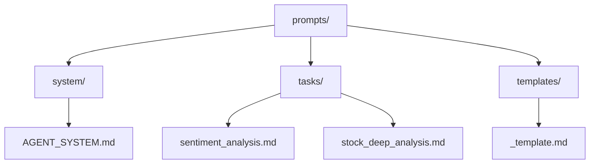
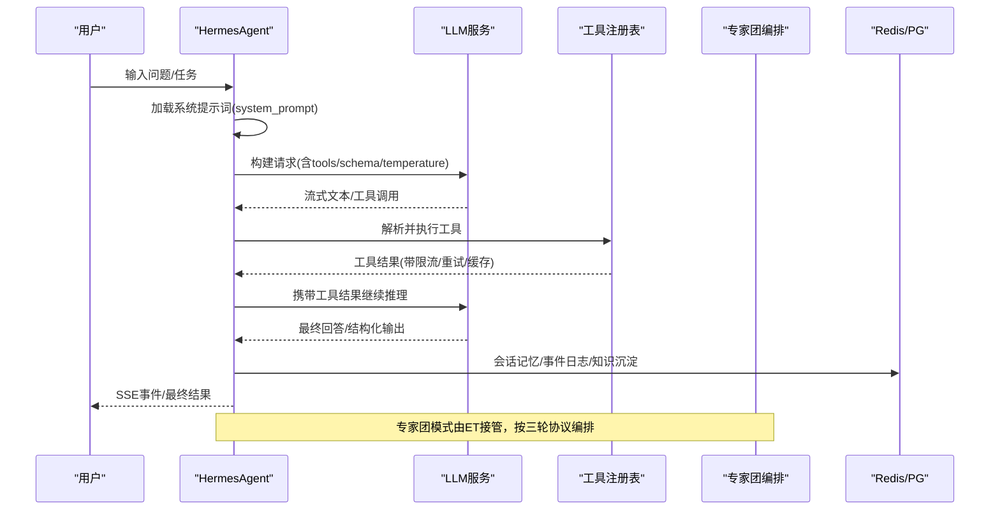
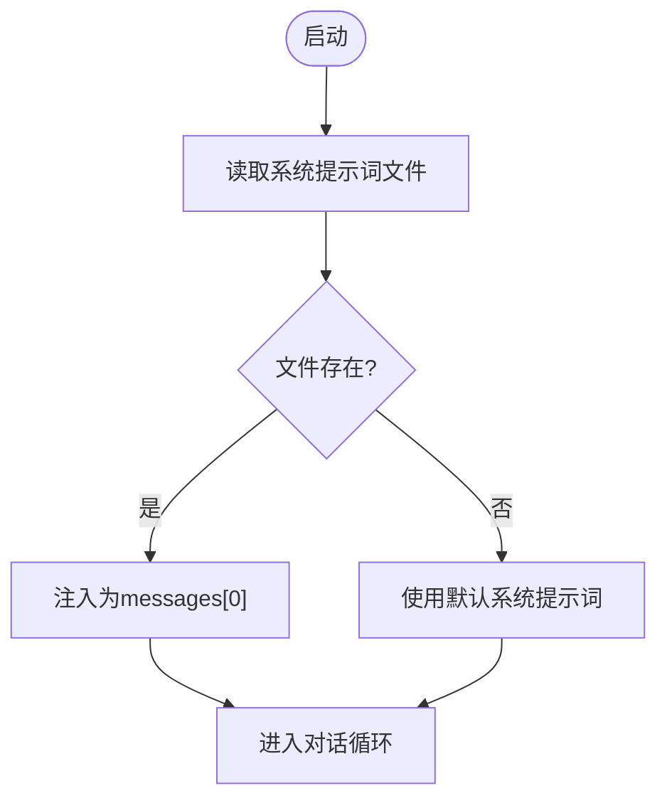
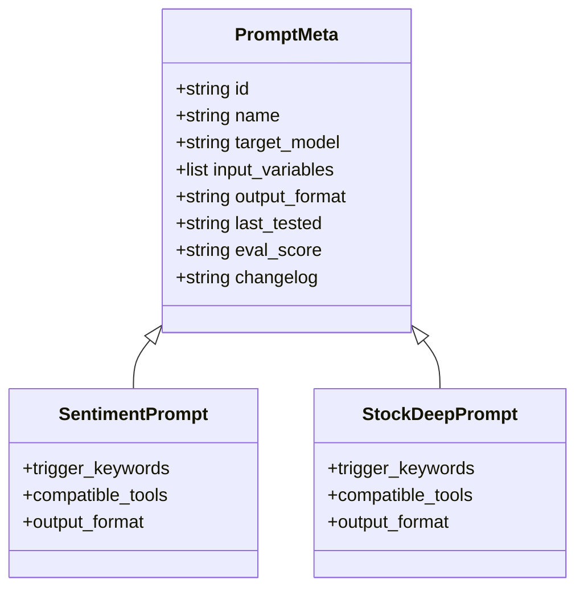
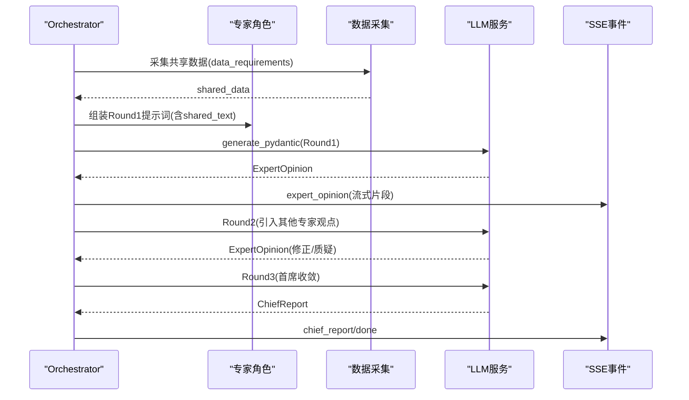
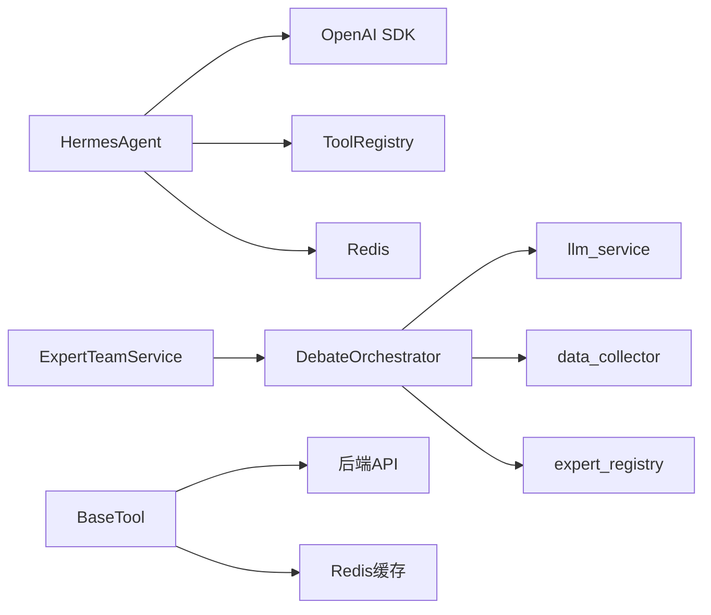

# 提示词工程

<cite>
**本文引用的文件**
- [prompts/README.md](file://prompts/README.md)
- [prompts/system/AGENT_SYSTEM.md](file://prompts/system/AGENT_SYSTEM.md)
- [prompts/tasks/sentiment_analysis.md](file://prompts/tasks/sentiment_analysis.md)
- [prompts/tasks/stock_deep_analysis.md](file://prompts/tasks/stock_deep_analysis.md)
- [prompts/templates/_template.md](file://prompts/templates/_template.md)
- [hermes_agent/agent.py](file://hermes_agent/agent.py)
- [backend/services/expert_team/expert_team_service.py](file://backend/services/expert_team/expert_team_service.py)
- [backend/services/expert_team/orchestrator.py](file://backend/services/expert_team/orchestrator.py)
- [backend/services/expert_team/models.py](file://backend/services/expert_team/models.py)
- [hermes_agent/tools/base.py](file://hermes_agent/tools/base.py)
</cite>

## 目录
1. [引言](#引言)
2. [项目结构](#项目结构)
3. [核心组件](#核心组件)
4. [架构总览](#架构总览)
5. [详细组件分析](#详细组件分析)
6. [依赖关系分析](#依赖关系分析)
7. [性能与可观测性](#性能与可观测性)
8. [故障排查指南](#故障排查指南)
9. [结论](#结论)
10. [附录：使用示例与最佳实践](#附录：使用示例与最佳实践)

## 引言
本技术文档面向“提示词工程”子系统，聚焦专家提示词的架构设计、生命周期管理、与专家角色的绑定机制、动态参数注入与上下文感知、以及结构化模板化输出。同时给出 A/B 测试、版本控制、性能监控与优化策略的落地方案，并提供面向不同分析场景的定制与优化示例。

## 项目结构
提示词工程在仓库中以“文件即配置”的方式组织，系统级指令、任务级提示词与模板分离存放，便于版本管理与评估回归。

**图表来源**
- [prompts/README.md:1-58](file://prompts/README.md#L1-L58)
- [prompts/system/AGENT_SYSTEM.md:1-8](file://prompts/system/AGENT_SYSTEM.md#L1-L8)
- [prompts/tasks/sentiment_analysis.md:1-25](file://prompts/tasks/sentiment_analysis.md#L1-L25)
- [prompts/tasks/stock_deep_analysis.md:1-34](file://prompts/tasks/stock_deep_analysis.md#L1-L34)
- [prompts/templates/_template.md:1-22](file://prompts/templates/_template.md#L1-L22)

**章节来源**
- [prompts/README.md:1-58](file://prompts/README.md#L1-L58)
- [prompts/system/AGENT_SYSTEM.md:1-8](file://prompts/system/AGENT_SYSTEM.md#L1-L8)

## 核心组件
- 提示词规范与元数据：通过 YAML Front Matter 定义 id、name、target_model、input_variables、output_format、last_tested、eval_score、changelog 等，支撑版本追踪与评估对比。
- 系统指令加载：HermesAgent 启动时从 prompts/system/HERMES.md（或索引指向）加载系统级提示词，并作为消息首条 system 内容注入。
- 任务级提示词：如新闻情感分析、个股深度研判，提供触发条件、工具调用序列、输出格式约束与降级策略。
- 专家团编排：Orchestrator 将多角色提示词与数据收集、LLM 结构化输出、SSE 流式事件串联，形成“独立研判→交叉辩论→首席收敛”的三段式流程。
- 工具与缓存：BaseTool 提供限流感知重试、双级缓存（进程内存 + Redis），保障提示词执行时的稳定性与性能。

**章节来源**
- [prompts/README.md:22-58](file://prompts/README.md#L22-L58)
- [hermes_agent/agent.py:594-628](file://hermes_agent/agent.py#L594-L628)
- [prompts/tasks/sentiment_analysis.md:1-25](file://prompts/tasks/sentiment_analysis.md#L1-L25)
- [prompts/tasks/stock_deep_analysis.md:36-91](file://prompts/tasks/stock_deep_analysis.md#L36-L91)
- [backend/services/expert_team/orchestrator.py:43-172](file://backend/services/expert_team/orchestrator.py#L43-L172)
- [hermes_agent/tools/base.py:21-282](file://hermes_agent/tools/base.py#L21-L282)

## 架构总览
提示词工程贯穿“指令加载→上下文增强→模型推理→工具调用→结构化输出→持久化与评估”的全链路。

**图表来源**
- [hermes_agent/agent.py:70-97](file://hermes_agent/agent.py#L70-L97)
- [hermes_agent/agent.py:190-477](file://hermes_agent/agent.py#L190-L477)
- [backend/services/expert_team/orchestrator.py:43-172](file://backend/services/expert_team/orchestrator.py#L43-L172)
- [backend/services/expert_team/expert_team_service.py:37-61](file://backend/services/expert_team/expert_team_service.py#L37-L61)

## 详细组件分析

### 系统指令与加载机制
- 系统指令路径：默认指向 prompts/system/HERMES.md；索引文件 AGENT_SYSTEM.md 说明加载位置与调用方。
- 运行时注入：HermesAgent 初始化时读取系统提示词，并在消息列表首位以 role=system 注入；支持覆盖历史 system 内容以保证最新指令生效。
- 安全与降级：若文件缺失则回退到默认系统提示词，避免启动失败。

**图表来源**
- [prompts/system/AGENT_SYSTEM.md:1-8](file://prompts/system/AGENT_SYSTEM.md#L1-L8)
- [hermes_agent/agent.py:594-628](file://hermes_agent/agent.py#L594-L628)

**章节来源**
- [prompts/system/AGENT_SYSTEM.md:1-8](file://prompts/system/AGENT_SYSTEM.md#L1-L8)
- [hermes_agent/agent.py:594-628](file://hermes_agent/agent.py#L594-L628)

### 任务级提示词模板与结构化输出
- 元数据规范：每个 Prompt 文件头部包含 id、name、target_model、input_variables、output_format、last_tested、eval_score、changelog，便于版本管理与评估回归。
- 结构化输出：通过 output_format 明确返回类型（如 JSON 字段、Markdown 报告模板），配合 Pydantic 校验确保一致性。
- 触发条件与工具序列：如个股深度研判定义触发关键词、工具调用顺序与并行策略，保证分析流程可控。

**图表来源**
- [prompts/README.md:22-58](file://prompts/README.md#L22-L58)
- [prompts/tasks/sentiment_analysis.md:1-25](file://prompts/tasks/sentiment_analysis.md#L1-L25)
- [prompts/tasks/stock_deep_analysis.md:1-34](file://prompts/tasks/stock_deep_analysis.md#L1-L34)

**章节来源**
- [prompts/README.md:22-58](file://prompts/README.md#L22-L58)
- [prompts/tasks/sentiment_analysis.md:1-25](file://prompts/tasks/sentiment_analysis.md#L1-L25)
- [prompts/tasks/stock_deep_analysis.md:36-91](file://prompts/tasks/stock_deep_analysis.md#L36-L91)

### 专家团编排与提示词绑定
- 角色与提示词绑定：ExpertRole 包含 system_prompt、available_tools、bias 等，指示该专家使用的提示词与可调用的工具子集。
- 三轮协议：Round1 独立研判（并行）、Round2 交叉辩论（对抗）、Round3 首席收敛（综合），每轮通过 llm_service.generate_pydantic 强制结构化输出。
- 数据注入：collect_shared_data 采集共享数据并格式化后注入 prompt，实现上下文感知与个性化定制。

**图表来源**
- [backend/services/expert_team/orchestrator.py:43-172](file://backend/services/expert_team/orchestrator.py#L43-L172)
- [backend/services/expert_team/orchestrator.py:254-456](file://backend/services/expert_team/orchestrator.py#L254-L456)
- [backend/services/expert_team/models.py:11-51](file://backend/services/expert_team/models.py#L11-L51)

**章节来源**
- [backend/services/expert_team/models.py:11-51](file://backend/services/expert_team/models.py#L11-L51)
- [backend/services/expert_team/orchestrator.py:254-456](file://backend/services/expert_team/orchestrator.py#L254-L456)

### 动态参数注入与上下文感知
- 宏观上下文注入：chat_stream_async 中尝试注入市场背景上下文，增强用户输入的语境。
- 工具参数标准化：BaseTool.normalize_ticker 统一股票代码格式，减少下游歧义。
- 会话记忆与压缩：HermesAgent 维护 messages 列表，支持记忆修复与压缩，控制上下文窗口与成本。

**章节来源**
- [hermes_agent/agent.py:710-752](file://hermes_agent/agent.py#L710-L752)
- [hermes_agent/tools/base.py:31-86](file://hermes_agent/tools/base.py#L31-L86)

### 错误处理与降级策略
- 工具执行异常脱敏：_safe_execute_tool 捕获异常并通过 redact_exception 脱敏，防止凭据泄漏。
- 限流与重试：BaseTool.rate_limit_aware_request 检测 429/503 或响应体中的限流信号，按 retry_after 退避重试。
- 熔断恢复：达到最大思考轮次后，切换至 pro 模型进行强制收敛，避免无限循环。

**章节来源**
- [hermes_agent/agent.py:118-137](file://hermes_agent/agent.py#L118-L137)
- [hermes_agent/agent.py:491-547](file://hermes_agent/agent.py#L491-L547)
- [hermes_agent/tools/base.py:97-239](file://hermes_agent/tools/base.py#L97-L239)

## 依赖关系分析
- HermesAgent 依赖 OpenAI SDK 客户端、工具注册表、Redis 客户端与事件日志。
- 专家团编排依赖 llm_service、数据收集器、专家注册表与模型定义。
- 工具层依赖后端 API URL 构建、限流重试与双级缓存。

**图表来源**
- [hermes_agent/agent.py:553-605](file://hermes_agent/agent.py#L553-L605)
- [backend/services/expert_team/expert_team_service.py:31-65](file://backend/services/expert_team/expert_team_service.py#L31-L65)
- [backend/services/expert_team/orchestrator.py:35-41](file://backend/services/expert_team/orchestrator.py#L35-L41)
- [hermes_agent/tools/base.py:10-18](file://hermes_agent/tools/base.py#L10-L18)

**章节来源**
- [hermes_agent/agent.py:553-605](file://hermes_agent/agent.py#L553-L605)
- [backend/services/expert_team/expert_team_service.py:31-65](file://backend/services/expert_team/expert_team_service.py#L31-L65)
- [backend/services/expert_team/orchestrator.py:35-41](file://backend/services/expert_team/orchestrator.py#L35-L41)
- [hermes_agent/tools/base.py:10-18](file://hermes_agent/tools/base.py#L10-L18)

## 性能与可观测性
- Token 计量：统一在 _call_llm 与流式路径记录 usage，便于成本分析与配额管理。
- 心跳保活：ReAct 循环与工具执行期间周期性发送 heartbeat，提升长耗时任务的交互体验。
- 流式渲染：专家观点与首席报告按句切分流式推送，降低前端渲染延迟。
- 缓存与重试：BaseTool 的双级缓存与限流感知重试显著降低外部依赖抖动对提示词执行的影响。

**章节来源**
- [hermes_agent/agent.py:99-113](file://hermes_agent/agent.py#L99-L113)
- [hermes_agent/agent.py:210-253](file://hermes_agent/agent.py#L210-L253)
- [backend/services/expert_team/orchestrator.py:208-243](file://backend/services/expert_team/orchestrator.py#L208-L243)
- [hermes_agent/tools/base.py:240-282](file://hermes_agent/tools/base.py#L240-L282)

## 故障排查指南
- 系统提示词未加载：检查 prompts/system/HERMES.md 是否存在，或确认 AGENT_SYSTEM.md 的索引是否正确。
- 工具执行异常：查看 _safe_execute_tool 的脱敏错误信息，定位具体 tool_name 与 arguments_str。
- 限流与超时：BaseTool 会返回 rate_limited 状态与 retry_after_seconds；Orchestrator 设置单专家与整轮超时，必要时调整 _EXPERT_TIMEOUT 与 _ROUND_TIMEOUT。
- 会话丢失：ExpertTeamService 采用 Redis 热 + PG 冷 + 内存兜底三层存储，优先检查 Redis 键空间与 PG 表记录。

**章节来源**
- [hermes_agent/agent.py:118-137](file://hermes_agent/agent.py#L118-L137)
- [hermes_agent/tools/base.py:97-239](file://hermes_agent/tools/base.py#L97-L239)
- [backend/services/expert_team/orchestrator.py:30-33](file://backend/services/expert_team/orchestrator.py#L30-L33)
- [backend/services/expert_team/expert_team_service.py:67-145](file://backend/services/expert_team/expert_team_service.py#L67-L145)

## 结论
本提示词工程以“文件即配置”为核心，结合系统指令加载、任务级模板化、专家团三轮协议编排与强结构化输出，实现了高可控、可评估、可扩展的提示词体系。通过版本管理、A/B 测试、性能监控与降级策略，保障了生产环境的稳定性与可观测性。未来可在更多领域扩展专家角色与场景模板，持续优化提示词效果与成本。

## 附录：使用示例与最佳实践

### 为不同分析场景定制提示词模板
- 新闻情感分析：使用 sentiment_analysis.md 的元数据与输出格式，限定 JSON 字段与取值范围，便于自动化解析与评分。
- 个股深度研判：依据 stock_deep_analysis.md 的触发条件与工具序列，组合基本面、技术面、宏观、估值与风控五大视角，输出结构化 Markdown 报告。
- 新场景创建：基于 templates/_template.md 的 YAML Front Matter 与正文结构，快速搭建新提示词，并补充 input_variables 与 output_format。

**章节来源**
- [prompts/tasks/sentiment_analysis.md:1-25](file://prompts/tasks/sentiment_analysis.md#L1-L25)
- [prompts/tasks/stock_deep_analysis.md:36-91](file://prompts/tasks/stock_deep_analysis.md#L36-L91)
- [prompts/templates/_template.md:1-22](file://prompts/templates/_template.md#L1-L22)

### 提示词生命周期管理（版本控制、A/B测试、监控与优化）
- 版本控制：所有系统级 Prompt 纳入版本控制，变更需附带 Eval 结果，更新 last_tested 与 eval_score。
- A/B 测试：通过 target_model 与 temperature 等参数区分实验组，结合 llm_service 的结构化输出进行指标对比。
- 性能监控：利用 token_usage_store 记录用量，结合心跳与流式事件统计耗时与吞吐。
- 优化策略：根据 eval_score 与用户反馈迭代 prompt 正文与输出格式；在工具侧启用缓存与重试以降低抖动。

**章节来源**
- [prompts/README.md:22-58](file://prompts/README.md#L22-L58)
- [hermes_agent/agent.py:99-113](file://hermes_agent/agent.py#L99-L113)
- [backend/services/expert_team/orchestrator.py:30-33](file://backend/services/expert_team/orchestrator.py#L30-L33)

### 提示词与专家角色的绑定机制
- 角色定义：ExpertRole 指定 system_prompt、available_tools、bias 等，决定该专家的行为边界与能力集合。
- 动态参数注入：Orchestrator 将 shared_data 与用户问题拼接为 user_prompt，实现上下文感知。
- 个性化定制：通过 extra_context 与 code_context 传递额外信息，满足不同场景的个性化需求。

**章节来源**
- [backend/services/expert_team/models.py:11-22](file://backend/services/expert_team/models.py#L11-L22)
- [backend/services/expert_team/orchestrator.py:91-115](file://backend/services/expert_team/orchestrator.py#L91-L115)

### 结构化提示词编写与约束设置
- 明确输入变量：在 input_variables 中声明必填与可选字段及类型，减少歧义。
- 严格输出格式：使用 output_format 描述 JSON 或 Markdown 模板，配合 Pydantic 校验确保一致性。
- 约束条件：在提示词正文中设定行为边界（如“仅输出 JSON”“不得省略风险提示”），提高稳定性。

**章节来源**
- [prompts/README.md:22-58](file://prompts/README.md#L22-L58)
- [prompts/tasks/sentiment_analysis.md:15-25](file://prompts/tasks/sentiment_analysis.md#L15-L25)
- [prompts/tasks/stock_deep_analysis.md:92-186](file://prompts/tasks/stock_deep_analysis.md#L92-L186)

### 错误处理机制与降级策略
- 工具异常脱敏：统一在 _safe_execute_tool 中捕获并脱敏，避免敏感信息泄露。
- 限流与重试：BaseTool 识别限流信号并按 retry_after 退避，提升鲁棒性。
- 熔断与恢复：达到最大思考轮次后切换模型进行收敛，确保任务完成。

**章节来源**
- [hermes_agent/agent.py:118-137](file://hermes_agent/agent.py#L118-L137)
- [hermes_agent/tools/base.py:97-239](file://hermes_agent/tools/base.py#L97-L239)
- [hermes_agent/agent.py:491-547](file://hermes_agent/agent.py#L491-L547)