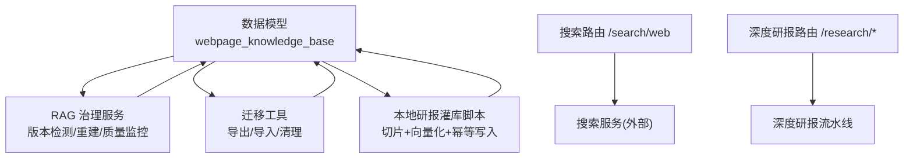
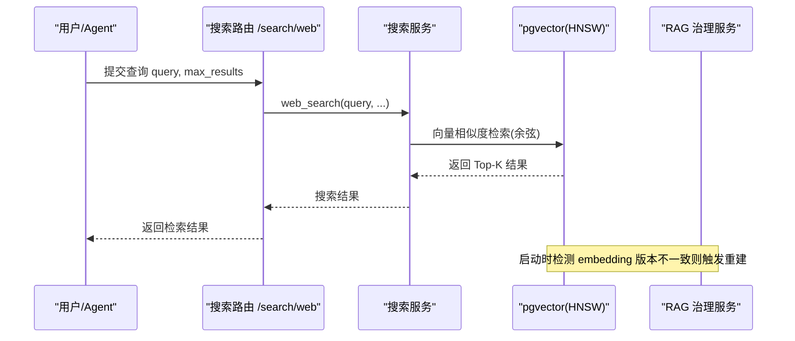
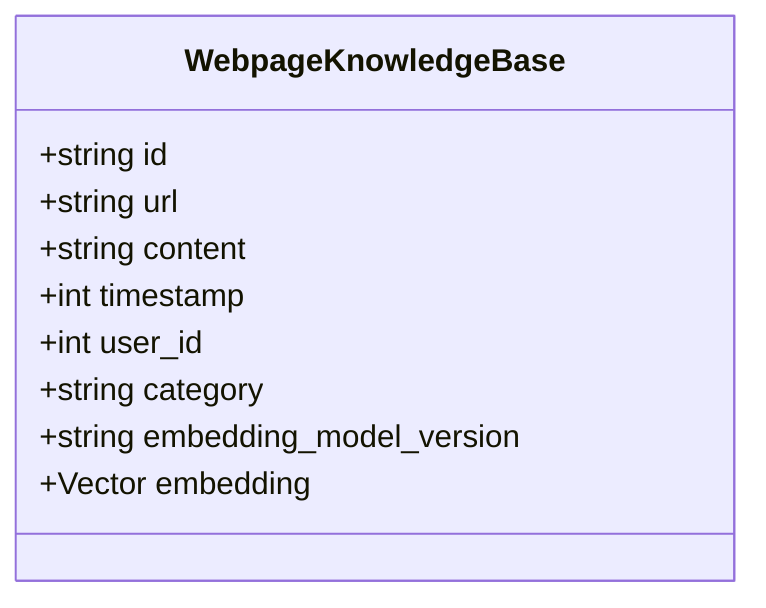
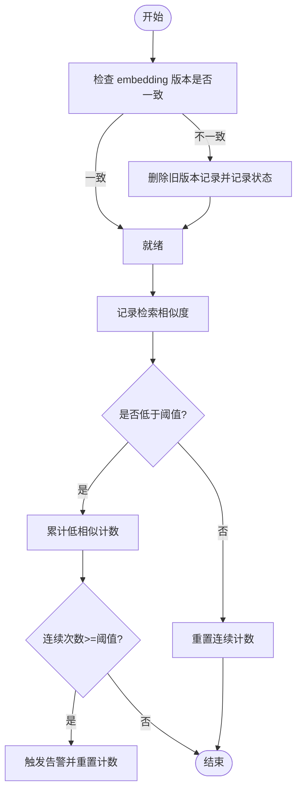
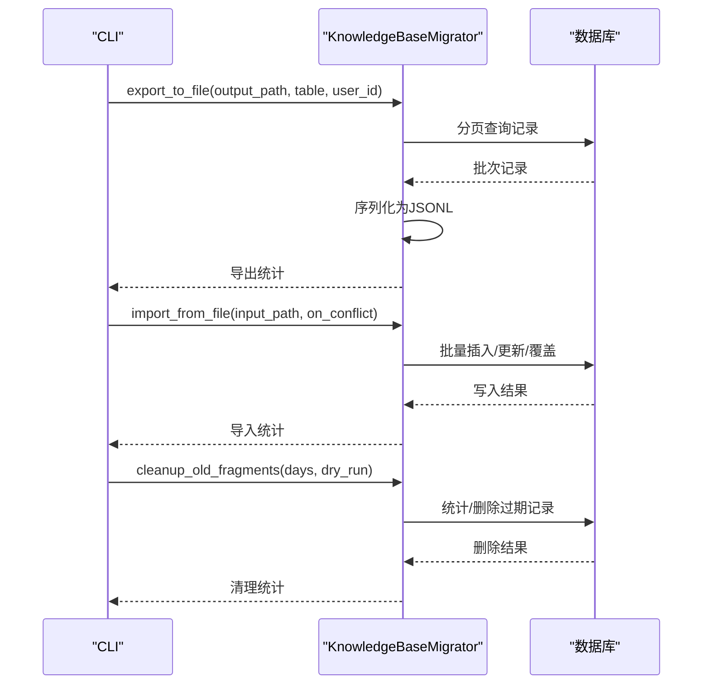
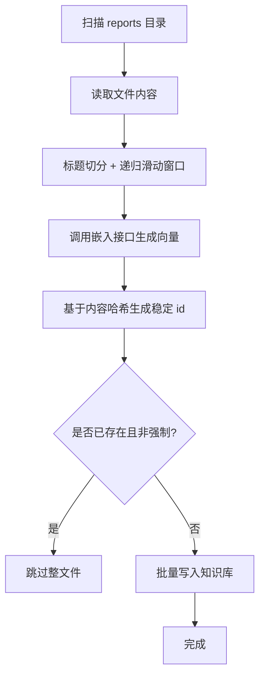
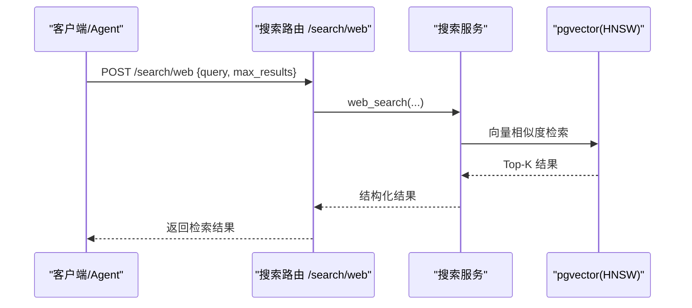
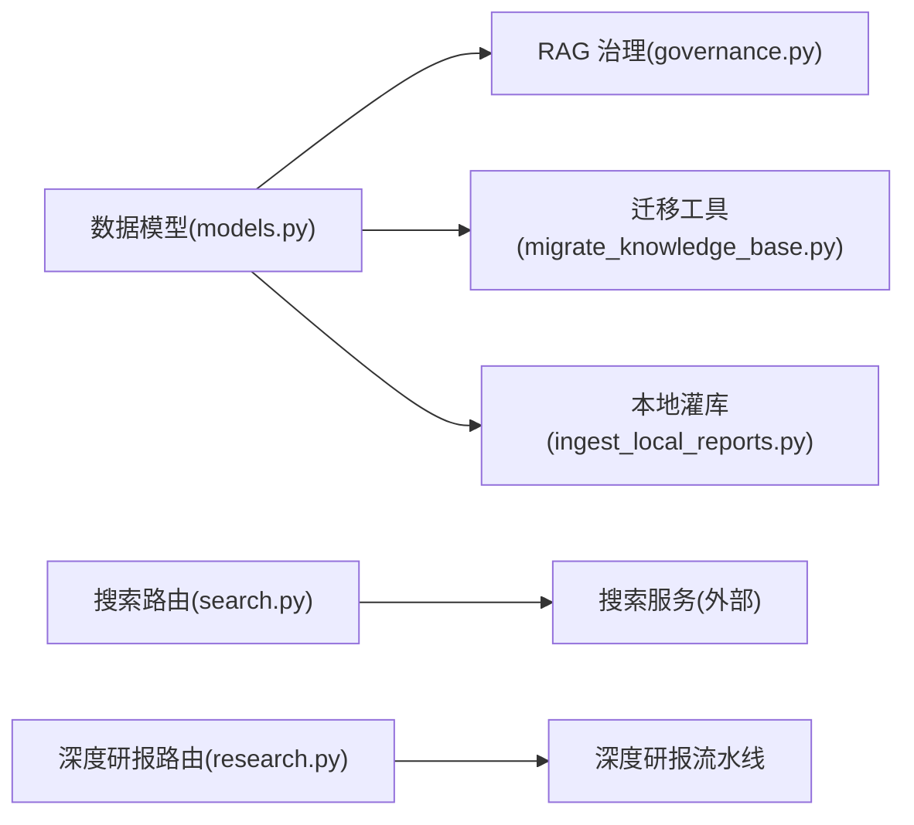

# 知识库管理

<cite>
**本文引用的文件**
- [backend/core/models.py](file://backend/core/models.py)
- [backend/app/rag/governance.py](file://backend/app/rag/governance.py)
- [backend/scripts/migrate_knowledge_base.py](file://backend/scripts/migrate_knowledge_base.py)
- [backend/scripts/ingest_local_reports.py](file://backend/scripts/ingest_local_reports.py)
- [backend/routers/search.py](file://backend/routers/search.py)
- [backend/routers/research.py](file://backend/routers/research.py)
</cite>

## 目录
1. [简介](#简介)
2. [项目结构](#项目结构)
3. [核心组件](#核心组件)
4. [架构总览](#架构总览)
5. [详细组件分析](#详细组件分析)
6. [依赖关系分析](#依赖关系分析)
7. [性能考量](#性能考量)
8. [故障排查指南](#故障排查指南)
9. [结论](#结论)
10. [附录：使用示例](#附录使用示例)

## 简介
本技术文档面向“专家知识库管理系统”，聚焦于研报解析、知识抽取与实体关系建模的存储方案，以及知识库构建流水线（数据采集、清洗、索引构建、版本管理）、检索机制（语义搜索、相似度匹配、多模态检索）与维护工具（数据质量检查、知识更新策略、冲突解决）。文档以代码级事实为依据，提供可视化图示与可操作的使用示例。

## 项目结构
知识库相关能力主要分布在以下模块：
- 数据模型与向量存储：定义网页知识库表及向量字段、HNSW 索引等。
- RAG 治理服务：负责 Embedding 模型版本检测与重建、检索质量监控。
- 迁移与导入导出：支持知识库数据的导出、导入、清理旧片段。
- 本地研报灌库：将本地财报/研报批量切分、向量化并写入知识库。
- 检索入口：对外暴露统一搜索接口，供 Agent 调用。
- 深度研报：触发深度研报生成流程（与知识库协同使用）。

图表来源
- [backend/core/models.py:199-231](file://backend/core/models.py#L199-L231)
- [backend/app/rag/governance.py:19-169](file://backend/app/rag/governance.py#L19-L169)
- [backend/scripts/migrate_knowledge_base.py:46-354](file://backend/scripts/migrate_knowledge_base.py#L46-L354)
- [backend/scripts/ingest_local_reports.py:50-135](file://backend/scripts/ingest_local_reports.py#L50-L135)
- [backend/routers/search.py:1-30](file://backend/routers/search.py#L1-L30)
- [backend/routers/research.py:1-52](file://backend/routers/research.py#L1-L52)

章节来源
- [backend/core/models.py:199-231](file://backend/core/models.py#L199-L231)
- [backend/app/rag/governance.py:19-169](file://backend/app/rag/governance.py#L19-L169)
- [backend/scripts/migrate_knowledge_base.py:46-354](file://backend/scripts/migrate_knowledge_base.py#L46-L354)
- [backend/scripts/ingest_local_reports.py:50-135](file://backend/scripts/ingest_local_reports.py#L50-L135)
- [backend/routers/search.py:1-30](file://backend/routers/search.py#L1-L30)
- [backend/routers/research.py:1-52](file://backend/routers/research.py#L1-L52)

## 核心组件
- 网页知识库表（WebpageKnowledgeBase）
  - 主键 id、来源 url、正文 content、时间戳 timestamp、用户隔离 user_id。
  - 分类 category（如 financial_report/news/macro/general），用于按类过滤。
  - 向量 embedding 与 HNSW 索引，支持余弦相似度检索。
  - 记录 embedding_model_version，便于版本管理与重建。
- RAG 治理服务（RAGGovernanceService）
  - 启动时检测 DB 中是否存在与当前配置不一致的 embedding 版本，必要时触发重建。
  - 记录检索相似度，连续低相似度达到阈值时告警。
  - 提供质量统计接口。
- 迁移工具（KnowledgeBaseMigrator）
  - 导出为 JSONL（含向量），支持跨节点迁移。
  - 导入支持 skip/update/overwrite 冲突策略。
  - 清理超期旧片段（默认 90 天）。
- 本地研报灌库脚本
  - 扫描 reports 目录，按标题与递归滑动窗口切分文本。
  - 复用统一向量化接口，保证向量空间一致。
  - 基于内容哈希生成稳定 id，实现幂等写入；支持强制覆盖。
- 搜索路由
  - 对外暴露 /search/web 统一网络搜索入口，供 Agent 调用。
- 深度研报路由
  - 提供 /research/meta 与 /research/deep-report 端点，驱动深度研报生成。

章节来源
- [backend/core/models.py:199-231](file://backend/core/models.py#L199-L231)
- [backend/app/rag/governance.py:19-169](file://backend/app/rag/governance.py#L19-L169)
- [backend/scripts/migrate_knowledge_base.py:46-354](file://backend/scripts/migrate_knowledge_base.py#L46-L354)
- [backend/scripts/ingest_local_reports.py:50-135](file://backend/scripts/ingest_local_reports.py#L50-L135)
- [backend/routers/search.py:1-30](file://backend/routers/search.py#L1-L30)
- [backend/routers/research.py:1-52](file://backend/routers/research.py#L1-L52)

## 架构总览
知识库系统围绕“写入—索引—检索—治理”的闭环设计：
- 写入：网页抓取或本地研报灌库，经文本切分后向量化入库。
- 索引：PostgreSQL pgvector + HNSW 索引，支持高效余弦相似度检索。
- 检索：通过搜索路由统一接入，Agent 侧调用。
- 治理：版本检测与重建、检索质量监控、过期清理。

图表来源
- [backend/routers/search.py:11-29](file://backend/routers/search.py#L11-L29)
- [backend/app/rag/governance.py:27-125](file://backend/app/rag/governance.py#L27-L125)
- [backend/core/models.py:199-231](file://backend/core/models.py#L199-L231)

## 详细组件分析

### 数据模型与向量存储（WebpageKnowledgeBase）
- 字段说明
  - id：主键，唯一标识片段。
  - url：来源出处。
  - content：网页正文碎片。
  - timestamp：时间戳，用于 TTL 清理。
  - user_id：多租户隔离（NULL 表示系统全局公共库）。
  - category：分类（financial_report/news/macro/general），便于检索端按类过滤。
  - embedding_model_version：记录生成该向量的模型版本，支撑版本治理。
  - embedding：向量特征，配合 HNSW 索引进行相似度检索。
- 索引策略
  - HNSW 索引，使用余弦距离运算类，参数 m=16、ef_construction=64，平衡召回率与内存。
- 复杂度与性能
  - 插入：O(1) 近似（HNSW 构建在索引层）。
  - 检索：近似最近邻 O(log N) 级别，受 m、ef_construction 影响。

图表来源
- [backend/core/models.py:199-231](file://backend/core/models.py#L199-L231)

章节来源
- [backend/core/models.py:199-231](file://backend/core/models.py#L199-L231)

### RAG 治理服务（版本管理与质量监控）
- 功能要点
  - check_embedding_version：检测 DB 中是否存在与当前配置不一致的 embedding 版本。
  - trigger_embedding_rebuild：删除旧版本记录，标记需要重新 embedding。
  - record_retrieval_similarity：记录每次检索最高相似度，连续低于阈值触发告警。
  - get_quality_stats：输出检索质量统计。
- 关键阈值
  - SIMILARITY_THRESHOLD：相似度阈值。
  - LOW_QUALITY_STREAK：连续低相似度次数阈值。

图表来源
- [backend/app/rag/governance.py:27-169](file://backend/app/rag/governance.py#L27-L169)

章节来源
- [backend/app/rag/governance.py:27-169](file://backend/app/rag/governance.py#L27-L169)

### 迁移工具（导出/导入/清理）
- 导出：分页读取知识库表，序列化到 JSONL（包含向量）。
- 导入：支持 skip/update/overwrite 三种冲突策略，批量写入。
- 清理：按 timestamp 清理超过指定天数的片段，支持 dry-run。

图表来源
- [backend/scripts/migrate_knowledge_base.py:61-354](file://backend/scripts/migrate_knowledge_base.py#L61-L354)

章节来源
- [backend/scripts/migrate_knowledge_base.py:61-354](file://backend/scripts/migrate_knowledge_base.py#L61-L354)

### 本地研报灌库（切片+向量化+幂等写入）
- 切片策略：Markdown 标题切分 + 递归滑动窗口，确保片段粒度与网页抓取链路一致。
- 向量化：统一调用后端嵌入接口，保证向量空间一致。
- 幂等写入：基于文件内容哈希生成稳定 id，避免重复堆积；支持 --force 覆盖。

图表来源
- [backend/scripts/ingest_local_reports.py:50-135](file://backend/scripts/ingest_local_reports.py#L50-L135)

章节来源
- [backend/scripts/ingest_local_reports.py:50-135](file://backend/scripts/ingest_local_reports.py#L50-L135)

### 检索机制（语义搜索与相似度匹配）
- 语义搜索：通过搜索路由 /search/web 统一入口，由搜索服务执行向量相似度检索。
- 相似度匹配：基于 pgvector HNSW 索引与余弦距离计算，返回 Top-K 结果。
- 多模态检索：当前仓库未提供多模态（图像/音频）嵌入与检索实现；如需扩展，可在搜索服务层对接多模态嵌入模型，并在知识库表中增加对应模态字段与索引。

图表来源
- [backend/routers/search.py:11-29](file://backend/routers/search.py#L11-L29)
- [backend/core/models.py:199-231](file://backend/core/models.py#L199-L231)

章节来源
- [backend/routers/search.py:11-29](file://backend/routers/search.py#L11-L29)
- [backend/core/models.py:199-231](file://backend/core/models.py#L199-L231)

### 版本管理与更新策略
- 版本检测：启动时比对 DB 中的 embedding_model_version 与当前配置。
- 重建策略：若不一致，删除旧版本记录，后续通过灌库/抓取链路重新生成向量。
- 更新策略：支持 overwrite 模式清空目标表后全量导入；update 模式增量更新；skip 模式保留已有。

章节来源
- [backend/app/rag/governance.py:27-125](file://backend/app/rag/governance.py#L27-L125)
- [backend/scripts/migrate_knowledge_base.py:124-309](file://backend/scripts/migrate_knowledge_base.py#L124-L309)

### 实体关系建模与存储
- 当前知识库以“片段”为单位存储网页正文与向量，适合 RAG 检索。
- 实体关系建模：可通过 category、url、timestamp 等字段进行粗粒度关联；如需细粒度实体关系图谱，可在现有表基础上扩展实体字段与关系边表，或使用图数据库进行增强。
- 存储方案建议：保持片段粒度不变，新增实体/关系元数据列或独立表，并通过外键与 webpage_knowledge_base.id 关联。

章节来源
- [backend/core/models.py:199-231](file://backend/core/models.py#L199-L231)

## 依赖关系分析
- 模型依赖：WebpageKnowledgeBase 依赖 pgvector 类型与 HNSW 索引。
- 服务依赖：RAG 治理服务依赖数据库连接与 Redis（用于状态缓存）。
- 脚本依赖：迁移工具与灌库脚本依赖 SQLAlchemy SessionLocal 与嵌入接口。
- 路由依赖：搜索路由依赖搜索服务；深度研报路由依赖深度研报流水线。

图表来源
- [backend/core/models.py:199-231](file://backend/core/models.py#L199-L231)
- [backend/app/rag/governance.py:19-169](file://backend/app/rag/governance.py#L19-L169)
- [backend/scripts/migrate_knowledge_base.py:46-354](file://backend/scripts/migrate_knowledge_base.py#L46-L354)
- [backend/scripts/ingest_local_reports.py:50-135](file://backend/scripts/ingest_local_reports.py#L50-L135)
- [backend/routers/search.py:1-30](file://backend/routers/search.py#L1-L30)
- [backend/routers/research.py:1-52](file://backend/routers/research.py#L1-L52)

章节来源
- [backend/core/models.py:199-231](file://backend/core/models.py#L199-L231)
- [backend/app/rag/governance.py:19-169](file://backend/app/rag/governance.py#L19-L169)
- [backend/scripts/migrate_knowledge_base.py:46-354](file://backend/scripts/migrate_knowledge_base.py#L46-L354)
- [backend/scripts/ingest_local_reports.py:50-135](file://backend/scripts/ingest_local_reports.py#L50-L135)
- [backend/routers/search.py:1-30](file://backend/routers/search.py#L1-L30)
- [backend/routers/research.py:1-52](file://backend/routers/research.py#L1-L52)

## 性能考量
- 向量索引：HNSW 参数 m=16、ef_construction=64 在召回率与内存间取得平衡；可根据数据规模调优。
- 批量写入：迁移工具与灌库脚本采用批量操作，减少事务开销。
- 相似度阈值：RAG 治理服务设置相似度阈值与连续低相似度告警，有助于发现索引退化或数据漂移。
- 清理策略：定期清理过期片段，控制表大小与检索延迟。

[本节为通用性能指导，不直接分析具体文件]

## 故障排查指南
- 向量维度不一致
  - 现象：检索失败或结果异常。
  - 处理：确认 EMBEDDING_DIM 与嵌入模型输出维度一致；检查 embedding_model_version 与当前配置。
- 版本不一致导致检索质量下降
  - 现象：连续低相似度告警。
  - 处理：触发 embedding 重建，删除旧版本记录后重新灌库。
- 导入冲突
  - 现象：导入过程中出现重复或覆盖问题。
  - 处理：选择合适 on_conflict 策略（skip/update/overwrite），必要时先 dry-run 评估影响。
- 本地灌库失败
  - 现象：嵌入服务不可用或无法切分。
  - 处理：检查嵌入服务可用性；确认文件格式与内容可读性；调整切片参数。

章节来源
- [backend/app/rag/governance.py:127-169](file://backend/app/rag/governance.py#L127-L169)
- [backend/scripts/migrate_knowledge_base.py:124-309](file://backend/scripts/migrate_knowledge_base.py#L124-L309)
- [backend/scripts/ingest_local_reports.py:80-135](file://backend/scripts/ingest_local_reports.py#L80-L135)

## 结论
本知识库系统以 pgvector + HNSW 为核心，结合 RAG 治理、迁移工具与本地灌库脚本，形成完整的“采集—清洗—索引—检索—治理”流水线。通过版本管理与质量监控，保障检索稳定性与准确性；通过灵活的冲突策略与清理机制，支持大规模知识的持续维护。未来可扩展多模态检索与实体关系图谱，进一步提升领域知识服务能力。

[本节为总结性内容，不直接分析具体文件]

## 附录：使用示例
- 导入外部研报
  - 将研报放入 backend/reports 目录，运行本地灌库脚本进行切片、向量化与幂等写入。
  - 参考路径：[本地研报灌库脚本:50-135](file://backend/scripts/ingest_local_reports.py#L50-L135)
- 构建领域知识图谱
  - 在现有片段粒度基础上，扩展实体与关系字段，或通过独立表关联 webpage_knowledge_base.id。
  - 参考路径：[数据模型:199-231](file://backend/core/models.py#L199-L231)
- 维护知识更新
  - 使用迁移工具进行导出/导入/清理，支持 skip/update/overwrite 冲突策略。
  - 参考路径：[迁移工具:61-354](file://backend/scripts/migrate_knowledge_base.py#L61-L354)
- 触发深度研报生成
  - 调用 /research/deep-report 端点，获取深度分析报告。
  - 参考路径：[深度研报路由:38-52](file://backend/routers/research.py#L38-L52)

章节来源
- [backend/scripts/ingest_local_reports.py:50-135](file://backend/scripts/ingest_local_reports.py#L50-L135)
- [backend/core/models.py:199-231](file://backend/core/models.py#L199-L231)
- [backend/scripts/migrate_knowledge_base.py:61-354](file://backend/scripts/migrate_knowledge_base.py#L61-L354)
- [backend/routers/research.py:38-52](file://backend/routers/research.py#L38-L52)
