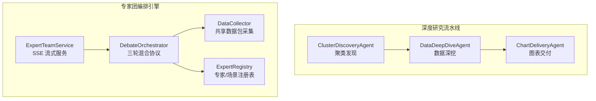
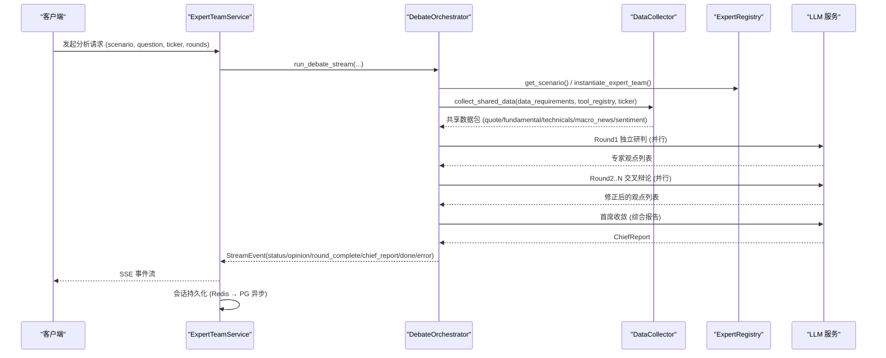
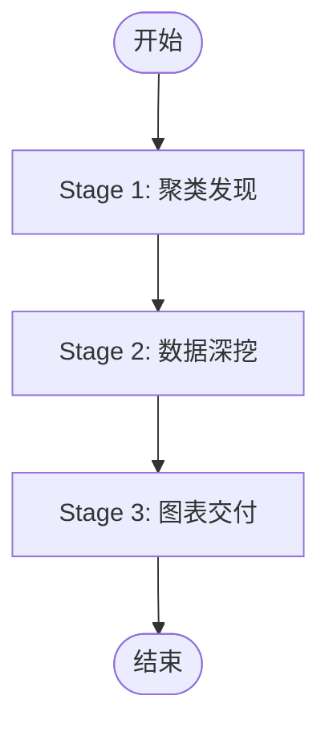
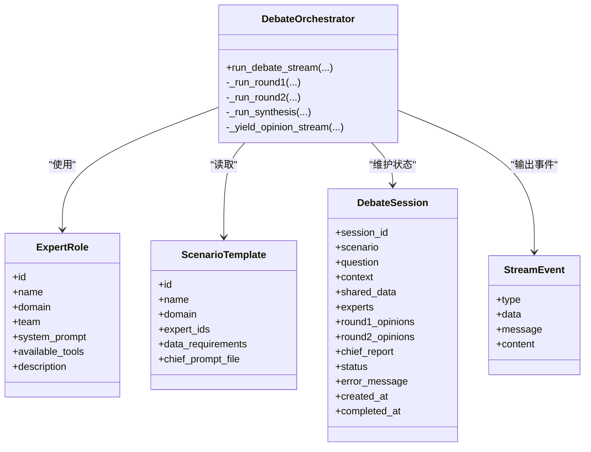
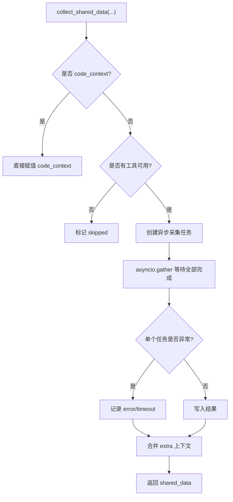
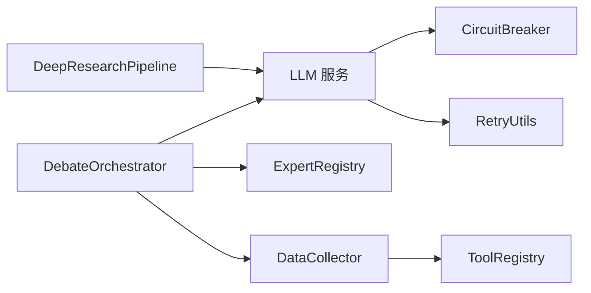
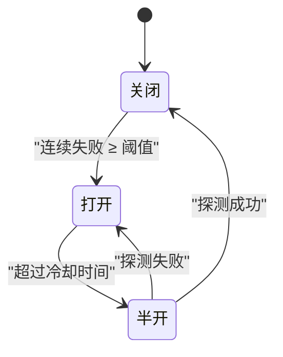

# 多智能体架构设计

<cite>
**本文引用的文件**
- [backend/app/research/deep_research.py](file://backend/app/research/deep_research.py)
- [backend/services/expert_team/orchestrator.py](file://backend/services/expert_team/orchestrator.py)
- [backend/services/expert_team/data_collector.py](file://backend/services/expert_team/data_collector.py)
- [backend/services/expert_team/expert_registry.py](file://backend/services/expert_team/expert_registry.py)
- [backend/services/expert_team/models.py](file://backend/services/expert_team/models.py)
- [backend/services/expert_team/expert_team_service.py](file://backend/services/expert_team/expert_team_service.py)
- [backend/core/circuit_breaker.py](file://backend/core/circuit_breaker.py)
- [backend/core/retry_utils.py](file://backend/core/retry_utils.py)
</cite>

## 目录
1. [简介](#简介)
2. [项目结构](#项目结构)
3. [核心组件](#核心组件)
4. [架构总览](#架构总览)
5. [详细组件分析](#详细组件分析)
6. [依赖关系分析](#依赖关系分析)
7. [性能与并发](#性能与并发)
8. [故障处理与恢复](#故障处理与恢复)
9. [扩展指南](#扩展指南)
10. [监控与可观测性](#监控与可观测性)
11. [结论](#结论)

## 简介
本技术文档围绕“深度研究系统的三段流水线架构”展开，聚焦以下三类智能体的职责分工与协作机制：
- ClusterDiscoveryAgent（聚类发现）：负责收集新闻与基本面等数据，识别关键主题与异常信号。
- DataDeepDiveAgent（数据深挖）：基于聚类结果进行深度分析，结合知识库检索形成结构化洞察。
- ChartDeliveryAgent（图表交付）：将分析结果组装为最终 Markdown 研报并输出可视化配置。

同时，文档对专家团编排引擎（三轮混合协议：独立研判→交叉辩论→首席收敛）的通信协议、数据传递格式、错误处理策略、异步执行模型与并发控制机制进行了系统化说明，并提供扩展新智能体与自定义研究流程的实践指引。

## 项目结构
本项目在多智能体层面包含两条主线：
- 深度研究三段流水线：位于后端研究模块，提供端到端的研报生成能力。
- 专家团多智能体协作系统：通过场景模板与工具注册表驱动多角色协同推理，并以 SSE 流式事件对外输出。

**图示来源**
- [backend/app/research/deep_research.py:43-226](file://backend/app/research/deep_research.py#L43-L226)
- [backend/services/expert_team/orchestrator.py:35-184](file://backend/services/expert_team/orchestrator.py#L35-L184)
- [backend/services/expert_team/data_collector.py:57-122](file://backend/services/expert_team/data_collector.py#L57-L122)
- [backend/services/expert_team/expert_registry.py:328-414](file://backend/services/expert_team/expert_registry.py#L328-L414)
- [backend/services/expert_team/expert_team_service.py:31-61](file://backend/services/expert_team/expert_team_service.py#L31-L61)

**章节来源**
- [backend/app/research/deep_research.py:1-231](file://backend/app/research/deep_research.py#L1-L231)
- [backend/services/expert_team/orchestrator.py:1-552](file://backend/services/expert_team/orchestrator.py#L1-L552)
- [backend/services/expert_team/data_collector.py:1-192](file://backend/services/expert_team/data_collector.py#L1-L192)
- [backend/services/expert_team/expert_registry.py:1-414](file://backend/services/expert_team/expert_registry.py#L1-L414)
- [backend/services/expert_team/expert_team_service.py:1-229](file://backend/services/expert_team/expert_team_service.py#L1-L229)

## 核心组件
- 深度研究流水线
  - ClusterDiscoveryAgent：调用 LLM 进行主题聚类与异常信号识别，输出结构化发现列表。
  - DataDeepDiveAgent：基于发现进行深度分析，产出专业文本洞察。
  - ChartDeliveryAgent：整合发现与分析，生成 Markdown 研报与图表配置占位。
- 专家团编排引擎
  - DebateOrchestrator：实现三轮混合协议，管理会话状态、并行任务调度、超时控制与流式事件输出。
  - DataCollector：按场景模板的数据需求，并行采集共享数据包，统一格式化后供各专家复用。
  - ExpertRegistry：维护专家角色定义、团队分组与场景模板，支持动态加载提示词。
  - ExpertTeamService：对外暴露 SSE 流式接口，实现双层持久化（Redis 热 + PG 冷）与内存兜底。

**章节来源**
- [backend/app/research/deep_research.py:43-226](file://backend/app/research/deep_research.py#L43-L226)
- [backend/services/expert_team/orchestrator.py:35-184](file://backend/services/expert_team/orchestrator.py#L35-L184)
- [backend/services/expert_team/data_collector.py:57-122](file://backend/services/expert_team/data_collector.py#L57-L122)
- [backend/services/expert_team/expert_registry.py:241-414](file://backend/services/expert_team/expert_registry.py#L241-L414)
- [backend/services/expert_team/expert_team_service.py:31-61](file://backend/services/expert_team/expert_team_service.py#L31-L61)

## 架构总览
深度研究流水线采用顺序三段式处理；专家团编排引擎则采用“并行研判+交叉辩论+收敛报告”的混合协议，并通过 SSE 向客户端推送实时进度。

**图示来源**
- [backend/services/expert_team/expert_team_service.py:37-61](file://backend/services/expert_team/expert_team_service.py#L37-L61)
- [backend/services/expert_team/orchestrator.py:43-184](file://backend/services/expert_team/orchestrator.py#L43-L184)
- [backend/services/expert_team/data_collector.py:57-122](file://backend/services/expert_team/data_collector.py#L57-L122)
- [backend/services/expert_team/expert_registry.py:328-414](file://backend/services/expert_team/expert_registry.py#L328-L414)

## 详细组件分析

### 深度研究流水线（三段式）
- ClusterDiscoveryAgent
  - 输入：主题与标的集合
  - 处理：构建 prompt 调用 LLM，解析结构化发现
  - 输出：ResearchFinding 列表（主题、摘要、相关性）
- DataDeepDiveAgent
  - 输入：主题与发现列表
  - 处理：调用 LLM 进行深度分析（驱动因素、历史对比、风险评估、投资建议）
  - 输出：深度分析文本
- ChartDeliveryAgent
  - 输入：主题、标的、发现、深度分析
  - 处理：组装 Markdown 研报与图表配置占位
  - 输出：ResearchReport（含 markdown_content）

**图示来源**
- [backend/app/research/deep_research.py:43-104](file://backend/app/research/deep_research.py#L43-L104)
- [backend/app/research/deep_research.py:107-151](file://backend/app/research/deep_research.py#L107-L151)
- [backend/app/research/deep_research.py:153-196](file://backend/app/research/deep_research.py#L153-L196)

**章节来源**
- [backend/app/research/deep_research.py:43-226](file://backend/app/research/deep_research.py#L43-L226)

### 专家团编排引擎（三轮混合协议）
- 阶段 0：初始化专家团（根据场景模板或自定义 expert_ids）
- 阶段 1：采集共享数据（并行，带超时保护）
- 阶段 2：Round 1 独立研判（并行，单专家超时控制）
- 阶段 3：Round 2..N 交叉辩论（并行，聚合上一轮观点）
- 阶段 4：首席收敛（综合所有观点生成最终报告）
- 完成：设置会话状态为 done，并暴露给服务层持久化

**图示来源**
- [backend/services/expert_team/orchestrator.py:35-184](file://backend/services/expert_team/orchestrator.py#L35-L184)
- [backend/services/expert_team/models.py:11-128](file://backend/services/expert_team/models.py#L11-L128)
- [backend/services/expert_team/expert_registry.py:328-414](file://backend/services/expert_team/expert_registry.py#L328-L414)

**章节来源**
- [backend/services/expert_team/orchestrator.py:35-552](file://backend/services/expert_team/orchestrator.py#L35-L552)
- [backend/services/expert_team/models.py:11-128](file://backend/services/expert_team/models.py#L11-L128)

### 共享数据包采集器
- 功能：依据场景模板的 data_requirements，通过 ToolRegistry 并行采集多种数据类型（行情、基本面、技术指标、宏观新闻、情绪历史、市场复盘、代码上下文）。
- 特性：
  - 每个采集任务带超时保护（默认 30s），失败或超时会以结构化错误返回，不阻塞其他任务。
  - 输出统一为 dict[str, Any]，便于后续格式化与截断，避免超出 LLM 上下文窗口。

**图示来源**
- [backend/services/expert_team/data_collector.py:57-122](file://backend/services/expert_team/data_collector.py#L57-L122)
- [backend/services/expert_team/data_collector.py:125-148](file://backend/services/expert_team/data_collector.py#L125-L148)
- [backend/services/expert_team/data_collector.py:151-192](file://backend/services/expert_team/data_collector.py#L151-L192)

**章节来源**
- [backend/services/expert_team/data_collector.py:57-192](file://backend/services/expert_team/data_collector.py#L57-L192)

### 专家注册表与场景模板
- 专家角色：覆盖分析师、研究员、交易员、风控、管理层与代码域，具备领域、团队、可用工具与描述。
- 场景模板：预配置专家组合与数据需求，如金融投研、完整投决会、交易决策、代码审查。
- 工具绑定：专家可通过 available_tools 声明可调用的工具子集，增强安全与可控性。

**章节来源**
- [backend/services/expert_team/expert_registry.py:51-235](file://backend/services/expert_team/expert_registry.py#L51-L235)
- [backend/services/expert_team/expert_registry.py:328-414](file://backend/services/expert_team/expert_registry.py#L328-L414)

### 服务层与持久化
- ExpertTeamService 提供 analyze_stream 方法，封装 orchestrator 的流式执行，并在 done 事件后异步持久化会话。
- 双层持久化：
  - Redis 热缓存：快速读写，带 TTL。
  - PostgreSQL 冷存储：异步 upsert，保证长期可追溯。
  - 内存兜底：在 Redis/PG 不可用时仍可在本地运行。

**章节来源**
- [backend/services/expert_team/expert_team_service.py:31-61](file://backend/services/expert_team/expert_team_service.py#L31-L61)
- [backend/services/expert_team/expert_team_service.py:67-157](file://backend/services/expert_team/expert_team_service.py#L67-L157)
- [backend/services/expert_team/expert_team_service.py:160-194](file://backend/services/expert_team/expert_team_service.py#L160-L194)

## 依赖关系分析
- 深度研究流水线依赖 LLM 服务进行主题聚类与深度分析，并通过简单顺序调用串联三个阶段。
- 专家团编排引擎依赖：
  - ExpertRegistry：场景与专家定义
  - DataCollector：共享数据采集
  - LLM 服务：结构化输出（Pydantic 模型约束）
  - 熔断器与重试工具：保障外部调用稳定性

**图示来源**
- [backend/app/research/deep_research.py:199-226](file://backend/app/research/deep_research.py#L199-L226)
- [backend/services/expert_team/orchestrator.py:12-28](file://backend/services/expert_team/orchestrator.py#L12-L28)
- [backend/core/circuit_breaker.py:35-75](file://backend/core/circuit_breaker.py#L35-L75)
- [backend/core/retry_utils.py:1-58](file://backend/core/retry_utils.py#L1-L58)

**章节来源**
- [backend/app/research/deep_research.py:199-226](file://backend/app/research/deep_research.py#L199-L226)
- [backend/services/expert_team/orchestrator.py:12-28](file://backend/services/expert_team/orchestrator.py#L12-L28)
- [backend/core/circuit_breaker.py:35-75](file://backend/core/circuit_breaker.py#L35-L75)
- [backend/core/retry_utils.py:1-58](file://backend/core/retry_utils.py#L1-L58)

## 性能与并发
- 并行执行
  - Round 1/2 使用 asyncio.gather 并行调度专家任务，提升吞吐。
  - 共享数据采集使用 asyncio.create_task 与 asyncio.gather 并行拉取多源数据。
- 超时控制
  - 单专家超时：_EXPERT_TIMEOUT（默认 60s）
  - 整轮超时：_ROUND_TIMEOUT（默认 180s）
  - 采集超时：_COLLECT_TIMEOUT（默认 30s）
- 资源管理
  - 共享数据包统一格式化与长度截断，避免 LLM 上下文溢出。
  - 专家可用工具子集限制，减少不必要的外部调用。
- 优化建议
  - 根据负载调整 gather 并发度与超时阈值。
  - 对慢速数据源增加重试与熔断策略。
  - 对大对象（如长文本）进行分块传输与增量渲染。

**章节来源**
- [backend/services/expert_team/orchestrator.py:254-288](file://backend/services/expert_team/orchestrator.py#L254-L288)
- [backend/services/expert_team/orchestrator.py:339-374](file://backend/services/expert_team/orchestrator.py#L339-L374)
- [backend/services/expert_team/data_collector.py:57-122](file://backend/services/expert_team/data_collector.py#L57-L122)
- [backend/services/expert_team/data_collector.py:125-148](file://backend/services/expert_team/data_collector.py#L125-L148)

## 故障处理与恢复
- 错误分类与降级
  - 专家研判失败：记录为 ExpertOpinion 中的失败信息，置信度置零，继续推进流程。
  - 数据采集中断：以 status=error/timeout/skipped 标注，不影响其他数据项。
  - LLM 调用失败：深度研究流水线捕获异常并返回降级内容。
- 熔断与重试
  - CircuitBreaker：按服务维度维护 CLOSED/OPEN/HALF_OPEN 状态，连续失败触发熔断，冷却后自动探测恢复。
  - RetryUtils：针对限流、网络异常与特定 HTTP 状态码进行指数退避重试。
- 会话状态与持久化
  - 异常时设置 session.status="error"，并保留错误消息与完成时间。
  - 持久化层具备降级路径（Redis → PG → 内存），确保可用性。

**图示来源**
- [backend/core/circuit_breaker.py:45-103](file://backend/core/circuit_breaker.py#L45-L103)
- [backend/core/circuit_breaker.py:147-218](file://backend/core/circuit_breaker.py#L147-L218)
- [backend/core/retry_utils.py:10-58](file://backend/core/retry_utils.py#L10-L58)

**章节来源**
- [backend/services/expert_team/orchestrator.py:174-184](file://backend/services/expert_team/orchestrator.py#L174-L184)
- [backend/services/expert_team/data_collector.py:125-148](file://backend/services/expert_team/data_collector.py#L125-L148)
- [backend/app/research/deep_research.py:72-104](file://backend/app/research/deep_research.py#L72-L104)
- [backend/core/circuit_breaker.py:45-379](file://backend/core/circuit_breaker.py#L45-L379)
- [backend/core/retry_utils.py:1-58](file://backend/core/retry_utils.py#L1-L58)

## 扩展指南
- 新增智能体（深度研究流水线）
  - 在 DeepResearchPipeline 中实例化新 Agent，并在 run 方法中按顺序接入流水线。
  - 为新 Agent 定义输入/输出数据结构，确保与上下游兼容。
  - 示例路径参考：[backend/app/research/deep_research.py:199-226](file://backend/app/research/deep_research.py#L199-L226)
- 新增专家角色（专家团）
  - 在 ExpertRegistry 中定义新的 ExpertRole，指定 domain、team、available_tools 与 description。
  - 将新专家加入场景模板的 expert_ids 或创建新场景。
  - 示例路径参考：[backend/services/expert_team/expert_registry.py:51-235](file://backend/services/expert_team/expert_registry.py#L51-L235)
- 自定义研究流程
  - 修改 orchestrator 的 run_debate_stream 流程节点，插入新的阶段或调整轮次。
  - 通过 StreamEvent 类型扩展事件语义，保持 SSE 协议一致性。
  - 示例路径参考：[backend/services/expert_team/orchestrator.py:43-184](file://backend/services/expert_team/orchestrator.py#L43-L184)
  - 事件模型参考：[backend/services/expert_team/models.py:114-128](file://backend/services/expert_team/models.py#L114-L128)

**章节来源**
- [backend/app/research/deep_research.py:199-226](file://backend/app/research/deep_research.py#L199-L226)
- [backend/services/expert_team/expert_registry.py:51-235](file://backend/services/expert_team/expert_registry.py#L51-L235)
- [backend/services/expert_team/expert_registry.py:328-414](file://backend/services/expert_team/expert_registry.py#L328-L414)
- [backend/services/expert_team/orchestrator.py:43-184](file://backend/services/expert_team/orchestrator.py#L43-L184)
- [backend/services/expert_team/models.py:114-128](file://backend/services/expert_team/models.py#L114-L128)

## 监控与可观测性
- 指标与日志
  - 熔断器状态与转换次数通过 Prometheus 指标暴露（CIRCUIT_BREAKER_STATE、CIRCUIT_BREAKER_TRANSITIONS）。
  - 专家团编排过程中记录关键步骤日志（状态变更、异常、超时）。
- 健康检查
  - 熔断器提供 status_snapshot 用于健康检查与运维恢复。
- 会话追踪
  - 会话 ID 贯穿全流程，便于前端展示与后端审计。
  - 双层持久化确保会话可回溯与可重现。

**章节来源**
- [backend/core/circuit_breaker.py:341-352](file://backend/core/circuit_breaker.py#L341-L352)
- [backend/services/expert_team/orchestrator.py:84-184](file://backend/services/expert_team/orchestrator.py#L84-L184)
- [backend/services/expert_team/expert_team_service.py:67-157](file://backend/services/expert_team/expert_team_service.py#L67-L157)

## 结论
本多智能体架构通过“深度研究三段流水线”与“专家团三轮混合协议”双轨并行，既满足端到端研报生成的业务需求，又提供了灵活可扩展的多角色协作框架。借助并行执行、超时控制、熔断与重试机制，系统在稳定性与性能之间取得平衡；通过 SSE 流式事件与双层持久化，实现了良好的用户体验与可观测性。未来可在数据源集成、专家角色扩展与流程编排方面持续演进，进一步提升研究与决策质量。
