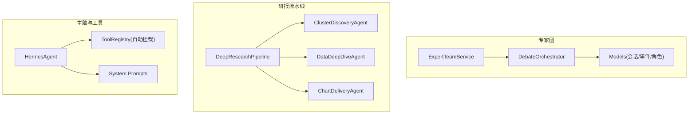
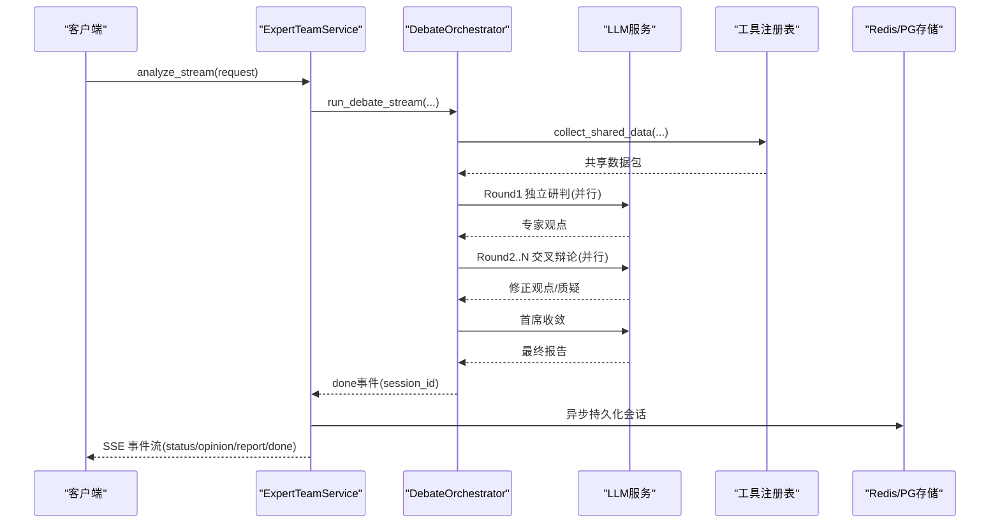
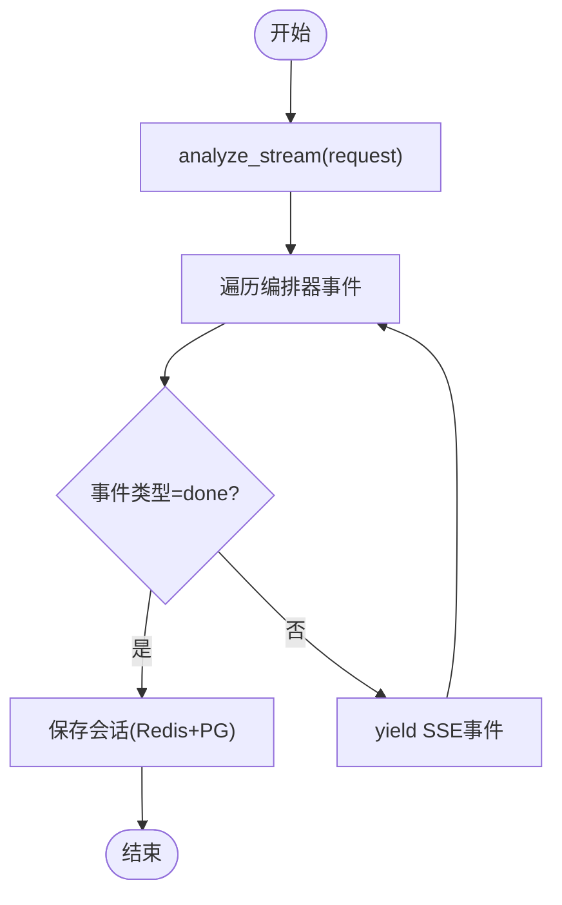
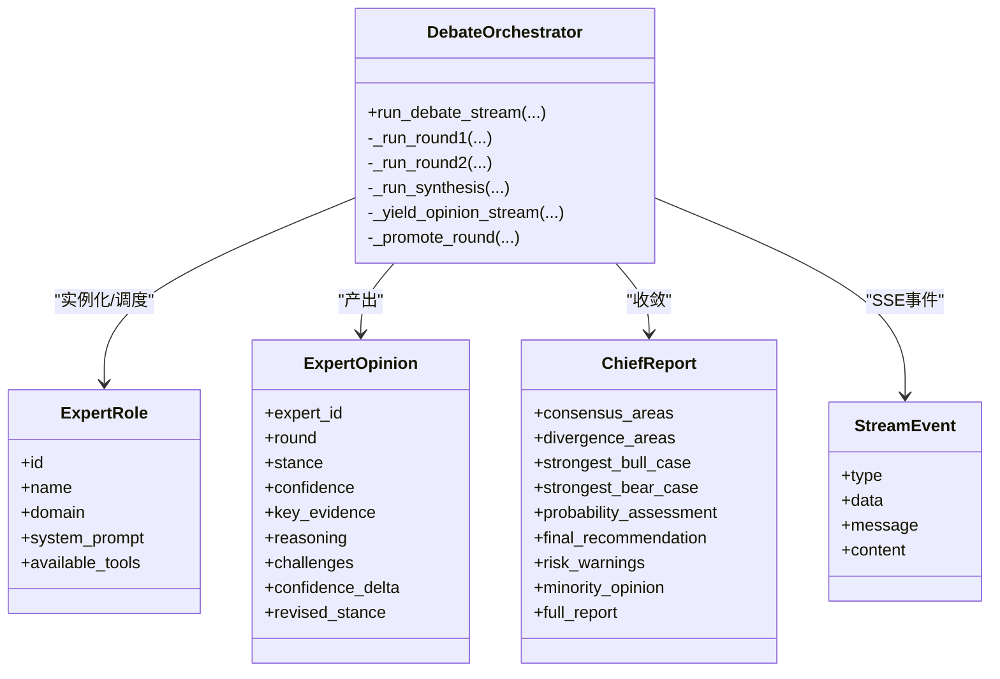
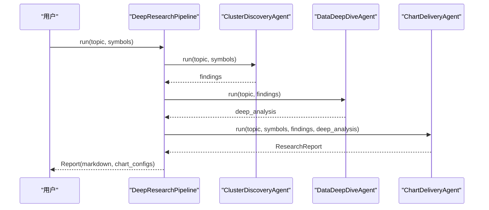
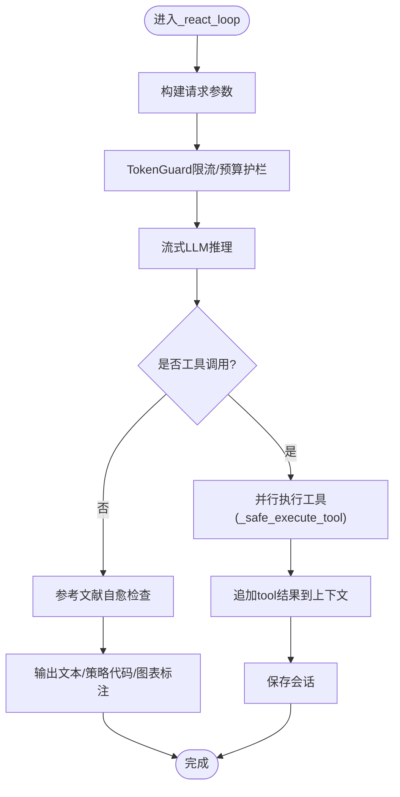
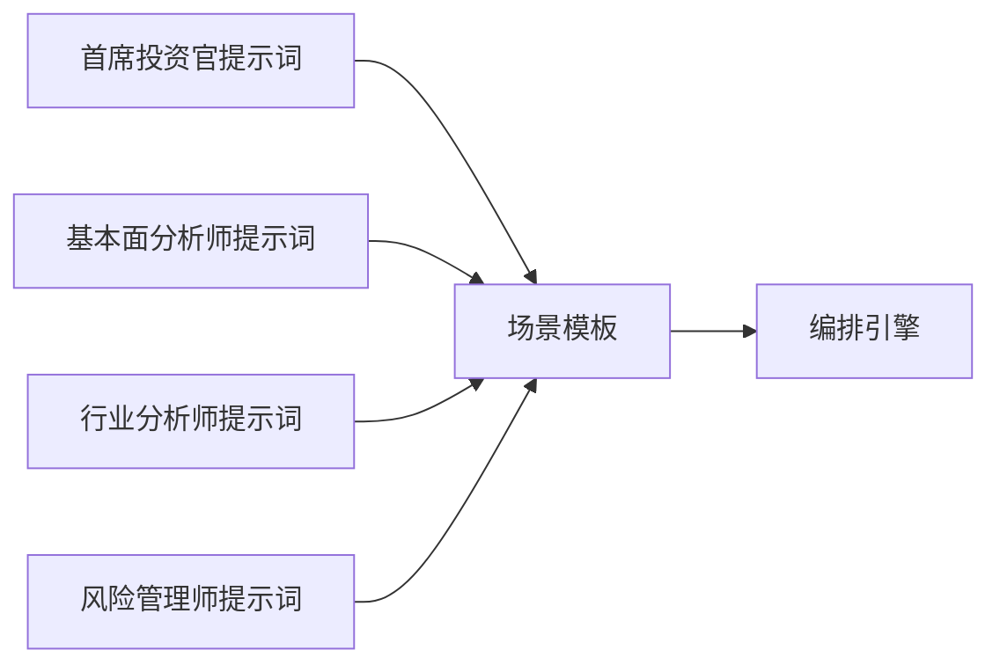
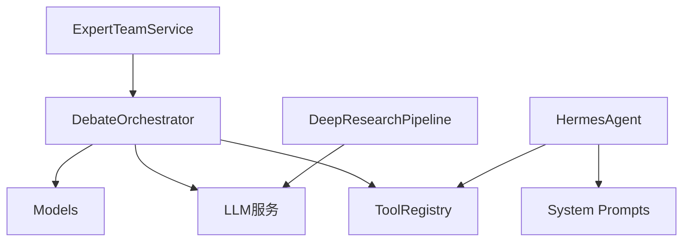

# 深度研究系统

<cite>
**本文引用的文件**
- [backend/services/expert_team/expert_team_service.py](file://backend/services/expert_team/expert_team_service.py)
- [backend/services/expert_team/orchestrator.py](file://backend/services/expert_team/orchestrator.py)
- [backend/services/expert_team/models.py](file://backend/services/expert_team/models.py)
- [backend/app/research/deep_research.py](file://backend/app/research/deep_research.py)
- [hermes_agent/agent.py](file://hermes_agent/agent.py)
- [prompts/system/HERMES.md](file://prompts/system/HERMES.md)
- [prompts/system/AGENT_SYSTEM.md](file://prompts/system/AGENT_SYSTEM.md)
- [hermes_agent/tools/__init__.py](file://hermes_agent/tools/__init__.py)
- [backend/services/expert_team/prompts/finance/chief_investment_officer.md](file://backend/services/expert_team/prompts/finance/chief_investment_officer.md)
</cite>

## 目录
1. [简介](#简介)
2. [项目结构](#项目结构)
3. [核心组件](#核心组件)
4. [架构总览](#架构总览)
5. [详细组件分析](#详细组件分析)
6. [依赖关系分析](#依赖关系分析)
7. [性能与可观测性](#性能与可观测性)
8. [故障排查指南](#故障排查指南)
9. [结论](#结论)
10. [附录：使用示例与最佳实践](#附录使用示例与最佳实践)

## 简介
本技术文档面向“深度研究系统”，聚焦多智能体协作的研究框架、专家角色定义与提示词设计、研究流程自动化（问题分解、信息收集、分析推理、报告生成）、可视化与呈现方式、可追溯性与可重复性保证，以及与外部数据源的集成方式。系统由两条主线构成：
- 专家团多智能体协作：以“三轮混合协议”编排引擎为核心，实现独立研判、交叉辩论、首席收敛的完整研究闭环。
- 深度研报流水线：三段式流水线完成聚类发现、数据深挖、图表交付，输出结构化 Markdown 研报与图表配置。

## 项目结构
围绕深度研究的核心代码主要分布在以下模块：
- 专家团服务与编排：负责场景模板加载、数据采集、专家并行调用、SSE 事件流输出与会话持久化。
- 深度研报流水线：封装聚类发现、数据深挖、图表交付三个 Agent，串联生成最终研报。
- Hermes Agent 主脑：统一 ReAct 循环、工具调度、熔断恢复、记忆与上下文管理。
- 提示词体系：系统指令与专家角色提示词分离管理，确保运行时行为稳定可控。

**图示来源**
- [backend/services/expert_team/expert_team_service.py:31-66](file://backend/services/expert_team/expert_team_service.py#L31-L66)
- [backend/services/expert_team/orchestrator.py:35-172](file://backend/services/expert_team/orchestrator.py#L35-L172)
- [backend/app/research/deep_research.py:19-231](file://backend/app/research/deep_research.py#L19-L231)
- [hermes_agent/agent.py:60-702](file://hermes_agent/agent.py#L60-L702)
- [hermes_agent/tools/__init__.py:1-16](file://hermes_agent/tools/__init__.py#L1-L16)
- [prompts/system/HERMES.md:1-137](file://prompts/system/HERMES.md#L1-L137)

**章节来源**
- [backend/services/expert_team/expert_team_service.py:31-66](file://backend/services/expert_team/expert_team_service.py#L31-L66)
- [backend/services/expert_team/orchestrator.py:35-172](file://backend/services/expert_team/orchestrator.py#L35-L172)
- [backend/app/research/deep_research.py:19-231](file://backend/app/research/deep_research.py#L19-L231)
- [hermes_agent/agent.py:60-702](file://hermes_agent/agent.py#L60-L702)
- [hermes_agent/tools/__init__.py:1-16](file://hermes_agent/tools/__init__.py#L1-L16)
- [prompts/system/HERMES.md:1-137](file://prompts/system/HERMES.md#L1-L137)

## 核心组件
- 专家团服务层：提供 SSE 流式分析入口、场景查询、历史会话检索与双层持久化（Redis 热 + PostgreSQL 冷）。
- 编排引擎：实现三轮混合协议（Round 1 独立研判、Round 2..N 交叉辩论、首席收敛），并输出结构化事件流。
- 数据模型：定义专家角色、观点、会话状态、场景模板、请求/响应与 SSE 事件结构。
- 深度研报流水线：三段式流水线，从主题聚类到深度分析再到 Markdown 研报与图表配置组装。
- Hermes Agent：统一 ReAct 驱动循环、工具执行、熔断恢复、记忆与上下文注入、流式事件转发。
- 提示词体系：系统指令与专家角色提示词分离，支持运行时加载与覆盖。

**章节来源**
- [backend/services/expert_team/expert_team_service.py:31-229](file://backend/services/expert_team/expert_team_service.py#L31-L229)
- [backend/services/expert_team/orchestrator.py:35-552](file://backend/services/expert_team/orchestrator.py#L35-L552)
- [backend/services/expert_team/models.py:11-128](file://backend/services/expert_team/models.py#L11-L128)
- [backend/app/research/deep_research.py:19-231](file://backend/app/research/deep_research.py#L19-L231)
- [hermes_agent/agent.py:60-702](file://hermes_agent/agent.py#L60-L702)
- [prompts/system/HERMES.md:1-137](file://prompts/system/HERMES.md#L1-L137)

## 架构总览
系统采用“服务层 + 编排引擎 + 数据模型 + 主脑 + 提示词”的分层架构。专家团服务暴露统一的 SSE 接口；编排引擎负责任务拆分与并发调度；数据模型保障结构化输入输出；Hermes Agent 作为通用主脑，负责 ReAct 循环与工具路由；提示词体系确保角色行为一致。

**图示来源**
- [backend/services/expert_team/expert_team_service.py:37-66](file://backend/services/expert_team/expert_team_service.py#L37-L66)
- [backend/services/expert_team/orchestrator.py:43-172](file://backend/services/expert_team/orchestrator.py#L43-L172)
- [backend/services/expert_team/models.py:114-128](file://backend/services/expert_team/models.py#L114-L128)

## 详细组件分析

### 专家团服务层（ExpertTeamService）
- 职责：封装编排器，提供 SSE 流式分析、场景列表、历史会话检索与双层持久化。
- 关键流程：
  - analyze_stream：订阅编排器的流式事件，拦截 done 事件提取 session_id，完成后异步持久化。
  - get_sessions/get_session：三层读取策略（Redis → PG → 内存兜底），保证高可用。
  - save_session：写入内存、Redis 热缓存，并异步 upsert 至 PG。
- 错误处理：各层失败时记录日志并降级，确保本地可运行。

**图示来源**
- [backend/services/expert_team/expert_team_service.py:37-66](file://backend/services/expert_team/expert_team_service.py#L37-L66)
- [backend/services/expert_team/expert_team_service.py:147-195](file://backend/services/expert_team/expert_team_service.py#L147-L195)

**章节来源**
- [backend/services/expert_team/expert_team_service.py:31-229](file://backend/services/expert_team/expert_team_service.py#L31-L229)

### 编排引擎（DebateOrchestrator）
- 职责：实现三轮混合协议，协调数据采集、专家并行研判、交叉辩论与首席收敛，输出 SSE 事件流。
- 关键流程：
  - 阶段 0：初始化专家团（按场景或自定义阵容）。
  - 阶段 1：采集共享数据（基于场景 data_requirements）。
  - 阶段 2：Round 1 独立研判（并行，超时保护）。
  - 阶段 3：Round 2..N 交叉辩论（并行，逐步深化）。
  - 阶段 4：首席收敛（综合所有观点，生成最终报告）。
- 事件流：status、expert_opinion、round_complete、chief_report、error、done。

**图示来源**
- [backend/services/expert_team/orchestrator.py:35-172](file://backend/services/expert_team/orchestrator.py#L35-L172)
- [backend/services/expert_team/models.py:11-128](file://backend/services/expert_team/models.py#L11-L128)

**章节来源**
- [backend/services/expert_team/orchestrator.py:35-552](file://backend/services/expert_team/orchestrator.py#L35-L552)
- [backend/services/expert_team/models.py:11-128](file://backend/services/expert_team/models.py#L11-L128)

### 深度研报流水线（DeepResearchPipeline）
- 职责：三段式流水线，完成聚类发现、数据深挖、图表交付，输出 Markdown 研报与图表配置。
- 关键流程：
  - ClusterDiscoveryAgent：构建 prompt，调用 LLM 进行主题聚类与异常信号识别。
  - DataDeepDiveAgent：基于聚类结果进行深入分析（驱动因素、历史对比、风险评估、投资建议）。
  - ChartDeliveryAgent：组装 Markdown 研报与图表配置，返回结构化研究报告。
- 错误处理：LLM 调用失败时降级为基础发现，记录警告日志。

**图示来源**
- [backend/app/research/deep_research.py:199-231](file://backend/app/research/deep_research.py#L199-L231)
- [backend/app/research/deep_research.py:43-104](file://backend/app/research/deep_research.py#L43-L104)
- [backend/app/research/deep_research.py:107-151](file://backend/app/research/deep_research.py#L107-L151)
- [backend/app/research/deep_research.py:153-196](file://backend/app/research/deep_research.py#L153-L196)

**章节来源**
- [backend/app/research/deep_research.py:19-231](file://backend/app/research/deep_research.py#L19-L231)

### Hermes Agent 主脑
- 职责：维护上下文状态、对接大模型 API、调度 ReAct 工作流、工具执行、熔断恢复、记忆与上下文注入。
- 关键流程：
  - _react_loop：统一 ReAct 循环，支持流式与非流式消费，心跳保活、参考文献自愈、熔断恢复。
  - _safe_execute_tool：统一工具执行逻辑，异常时返回错误结构。
  - chat/chat_stream_async：对外接口，委托 _react_loop 并转发 SSE 事件。
- 提示词加载：默认加载 prompts/system/HERMES.md，支持覆盖。

**图示来源**
- [hermes_agent/agent.py:187-510](file://hermes_agent/agent.py#L187-L510)
- [hermes_agent/agent.py:118-134](file://hermes_agent/agent.py#L118-L134)
- [prompts/system/HERMES.md:1-137](file://prompts/system/HERMES.md#L1-L137)

**章节来源**
- [hermes_agent/agent.py:60-702](file://hermes_agent/agent.py#L60-L702)
- [prompts/system/HERMES.md:1-137](file://prompts/system/HERMES.md#L1-L137)

### 专家角色与提示词设计
- 首席投资官（CIO）：站在最高决策层视角，将各方研判转化为最终投资决策，强调资产配置、战略方向、投委会决策框架与长期复利思维。
- 其他金融域专家：通过 prompts/finance 下的提示词文件定义（如基本面、行业分析师、风险管理师等），结合场景模板与数据需求进行调用。
- 系统指令：HERMES.md 规定工具路由纪律、零幻觉原则、宏观风控优先级、交易安全与输出格式。

**图示来源**
- [backend/services/expert_team/prompts/finance/chief_investment_officer.md:1-26](file://backend/services/expert_team/prompts/finance/chief_investment_officer.md#L1-L26)
- [backend/services/expert_team/orchestrator.py:73-89](file://backend/services/expert_team/orchestrator.py#L73-L89)

**章节来源**
- [backend/services/expert_team/prompts/finance/chief_investment_officer.md:1-26](file://backend/services/expert_team/prompts/finance/chief_investment_officer.md#L1-L26)
- [prompts/system/HERMES.md:1-137](file://prompts/system/HERMES.md#L1-L137)

## 依赖关系分析
- 专家团服务依赖编排引擎与数据模型，编排引擎依赖 LLM 服务与工具注册表。
- 深度研报流水线依赖 LLM 服务，用于聚类发现与深度分析。
- Hermes Agent 依赖工具注册表与系统提示词，支持自动扫描挂载工具。

**图示来源**
- [backend/services/expert_team/expert_team_service.py:31-66](file://backend/services/expert_team/expert_team_service.py#L31-L66)
- [backend/services/expert_team/orchestrator.py:35-172](file://backend/services/expert_team/orchestrator.py#L35-L172)
- [backend/app/research/deep_research.py:199-231](file://backend/app/research/deep_research.py#L199-L231)
- [hermes_agent/agent.py:60-702](file://hermes_agent/agent.py#L60-L702)
- [hermes_agent/tools/__init__.py:1-16](file://hermes_agent/tools/__init__.py#L1-L16)

**章节来源**
- [backend/services/expert_team/expert_team_service.py:31-66](file://backend/services/expert_team/expert_team_service.py#L31-L66)
- [backend/services/expert_team/orchestrator.py:35-172](file://backend/services/expert_team/orchestrator.py#L35-L172)
- [backend/app/research/deep_research.py:199-231](file://backend/app/research/deep_research.py#L199-L231)
- [hermes_agent/agent.py:60-702](file://hermes_agent/agent.py#L60-L702)
- [hermes_agent/tools/__init__.py:1-16](file://hermes_agent/tools/__init__.py#L1-L16)

## 性能与可观测性
- 并发与超时：专家研判与交叉辩论采用并行任务与轮次超时保护，避免单点阻塞。
- 流式输出：SSE 事件流提升前端渲染体验，减少首屏延迟。
- 记忆与上下文：Hermes Agent 支持会话记忆压缩与上下文注入，降低 Token 消耗。
- 熔断与恢复：同一工具连续失败触发熔断，切换备用模型或降级策略。
- 持久化：双层存储（Redis 热 + PG 冷）保障高可用与可追溯。

[本节为通用指导，不直接分析具体文件]

## 故障排查指南
- 专家研判失败：检查 LLM 服务可用性、工具注册表挂载、提示词加载路径。
- 流式中断：确认 SSE 事件流是否正常推送，检查心跳保活与超时设置。
- 持久化失败：验证 Redis/PG 连接与权限，查看降级至内存兜底的日志。
- 工具执行异常：检查工具参数合法性、外部数据源健康状态与重试机制。

**章节来源**
- [backend/services/expert_team/expert_team_service.py:147-195](file://backend/services/expert_team/expert_team_service.py#L147-L195)
- [backend/services/expert_team/orchestrator.py:174-184](file://backend/services/expert_team/orchestrator.py#L174-L184)
- [hermes_agent/agent.py:118-134](file://hermes_agent/agent.py#L118-L134)

## 结论
深度研究系统通过专家团多智能体协作与深度研报流水线，实现了从问题分解、信息收集、分析推理到报告生成的全流程自动化。系统具备高可用、可追溯、可重复的特性，支持与外部数据源集成，并提供丰富的可视化与呈现方式。建议在生产环境中启用熔断、限流与监控，确保稳定性与性能。

[本节为总结性内容，不直接分析具体文件]

## 附录：使用示例与最佳实践

### 深度市场研究
- 步骤：选择“金融投研”场景，传入问题与标的代码，启动专家团分析。
- 输出：SSE 事件流包含状态更新、专家观点、最终报告，支持前端实时渲染。
- 最佳实践：合理设置 rounds 与 expert_ids，控制成本与深度。

**章节来源**
- [backend/services/expert_team/expert_team_service.py:37-66](file://backend/services/expert_team/expert_team_service.py#L37-L66)
- [backend/services/expert_team/orchestrator.py:43-172](file://backend/services/expert_team/orchestrator.py#L43-L172)

### 公司基本面分析
- 步骤：在问题中指定公司代码，利用共享数据包中的财务指标与技术指标进行分析。
- 输出：专家观点包含关键依据与推理过程，最终报告提供概率评估与建议。
- 最佳实践：结合宏观新闻与舆情数据，提升分析全面性。

**章节来源**
- [backend/services/expert_team/orchestrator.py:91-108](file://backend/services/expert_team/orchestrator.py#L91-L108)
- [backend/services/expert_team/orchestrator.py:254-336](file://backend/services/expert_team/orchestrator.py#L254-L336)

### 行业趋势预测
- 步骤：使用深度研报流水线，输入主题与相关标的，执行聚类发现与深度分析。
- 输出：Markdown 研报与图表配置，支持前端可视化展示。
- 最佳实践：结合历史对比与风险评估，提高预测准确性。

**章节来源**
- [backend/app/research/deep_research.py:43-104](file://backend/app/research/deep_research.py#L43-L104)
- [backend/app/research/deep_research.py:107-151](file://backend/app/research/deep_research.py#L107-L151)
- [backend/app/research/deep_research.py:153-196](file://backend/app/research/deep_research.py#L153-L196)

### 研究过程的可追溯性与可重复性
- 实验记录：会话状态与专家观点持久化至 Redis/PG，支持回溯分析。
- 参数配置：场景模板与专家阵容可配置，确保实验一致性。
- 结果验证：通过 SSE 事件流与最终报告进行交叉验证。

**章节来源**
- [backend/services/expert_team/expert_team_service.py:67-145](file://backend/services/expert_team/expert_team_service.py#L67-L145)
- [backend/services/expert_team/models.py:53-69](file://backend/services/expert_team/models.py#L53-L69)

### 与外部数据源的集成
- 工具注册表：自动扫描挂载工具，支持新增工具零配置接入。
- 数据源适配：通过 ToolRegistry 统一调用，屏蔽底层差异。
- 实时数据：支持行情、财报、新闻等多源数据获取与分析。

**章节来源**
- [hermes_agent/tools/__init__.py:1-16](file://hermes_agent/tools/__init__.py#L1-L16)
- [hermes_agent/agent.py:118-134](file://hermes_agent/agent.py#L118-L134)