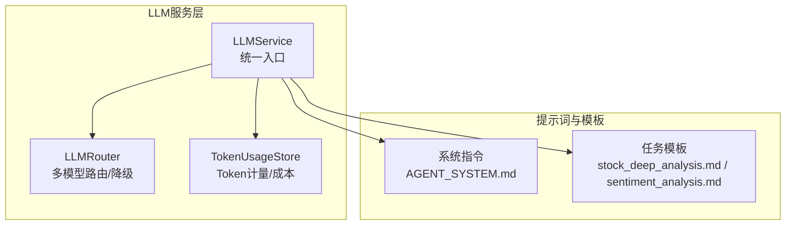
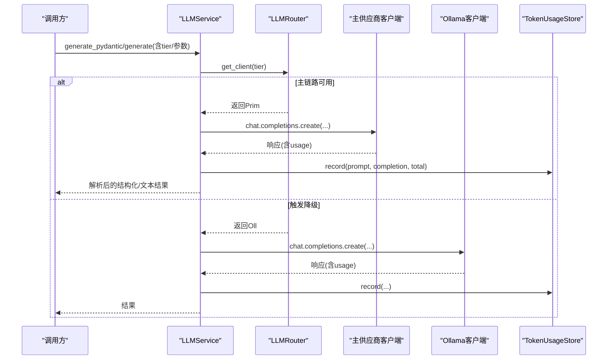
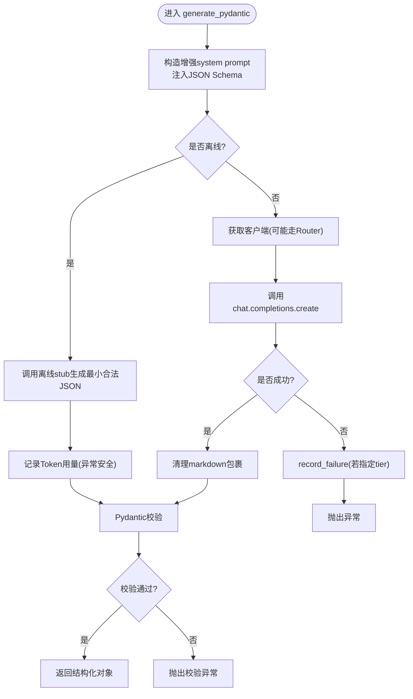
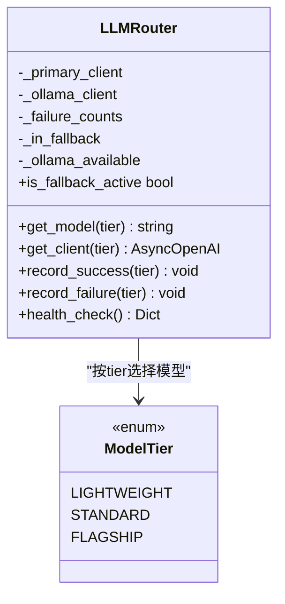
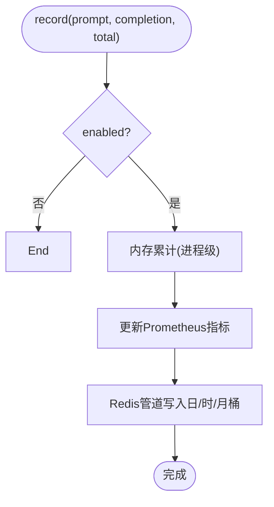
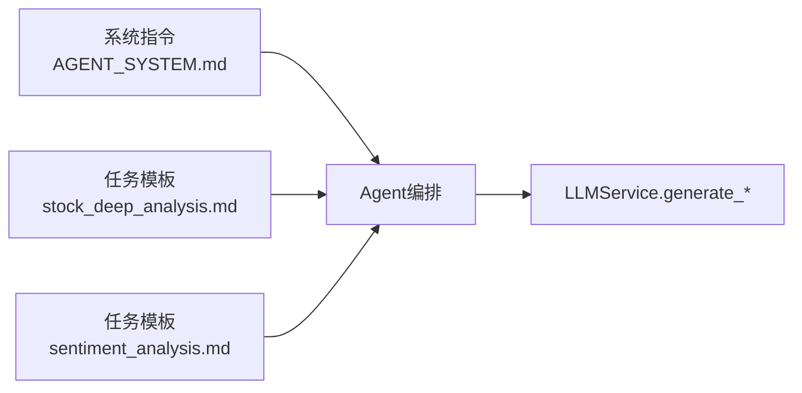
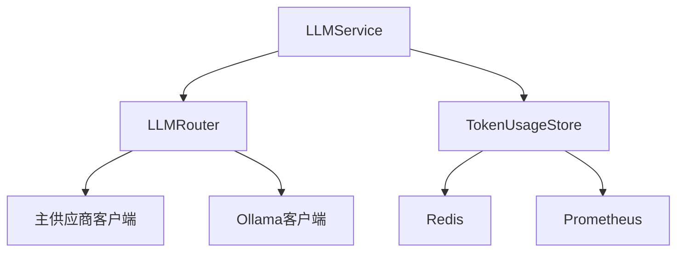

# AI分析引擎

<cite>
**本文引用的文件**
- [llm_service.py](file://backend/services/ai_narrator/llm_service.py)
- [models.py](file://backend/services/ai_narrator/models.py)
- [token_usage_store.py](file://backend/services/ai_narrator/token_usage_store.py)
- [AGENT_SYSTEM.md](file://prompts/system/AGENT_SYSTEM.md)
- [stock_deep_analysis.md](file://prompts/tasks/stock_deep_analysis.md)
- [sentiment_analysis.md](file://prompts/tasks/sentiment_analysis.md)
</cite>

## 目录
1. [简介](#简介)
2. [项目结构](#项目结构)
3. [核心组件](#核心组件)
4. [架构总览](#架构总览)
5. [详细组件分析](#详细组件分析)
6. [依赖关系分析](#依赖关系分析)
7. [性能与成本优化](#性能与成本优化)
8. [故障排查指南](#故障排查指南)
9. [结论](#结论)
10. [附录](#附录)

## 简介
本技术文档面向AI分析引擎的LLM服务层，系统性阐述模型路由、负载均衡与故障转移机制；说明不同模型层级（ModelTier）的选择策略与性能特征；总结提示词工程最佳实践（系统提示词设计、任务模板管理、上下文构建）；给出模型调优参数配置（温度、最大令牌数、重试机制）；并提供具体分析任务示例、结果评估方法与成本优化策略。

## 项目结构
围绕AI分析引擎的LLM能力，代码主要分布在以下位置：
- LLM服务与多模型路由：backend/services/ai_narrator/llm_service.py
- Token计量与成本统计：backend/services/ai_narrator/token_usage_store.py
- 数据模型（请求/响应）：backend/services/ai_narrator/models.py
- 提示词与任务模板：prompts/system/AGENT_SYSTEM.md、prompts/tasks/*.md

图表来源
- [llm_service.py:192-262](file://backend/services/ai_narrator/llm_service.py#L192-L262)
- [token_usage_store.py:95-201](file://backend/services/ai_narrator/token_usage_store.py#L95-L201)
- [AGENT_SYSTEM.md:1-8](file://prompts/system/AGENT_SYSTEM.md#L1-L8)
- [stock_deep_analysis.md:1-34](file://prompts/tasks/stock_deep_analysis.md#L1-L34)
- [sentiment_analysis.md:1-25](file://prompts/tasks/sentiment_analysis.md#L1-L25)

章节来源
- [llm_service.py:1-425](file://backend/services/ai_narrator/llm_service.py#L1-L425)
- [token_usage_store.py:1-317](file://backend/services/ai_narrator/token_usage_store.py#L1-L317)
- [AGENT_SYSTEM.md:1-8](file://prompts/system/AGENT_SYSTEM.md#L1-L8)
- [stock_deep_analysis.md:1-222](file://prompts/tasks/stock_deep_analysis.md#L1-L222)
- [sentiment_analysis.md:1-25](file://prompts/tasks/sentiment_analysis.md#L1-L25)

## 核心组件
- LLMService：统一对外暴露的LLM调用入口，支持结构化输出（Pydantic）与纯文本生成，内置离线stub模式与Token计量插桩。
- LLMRouter：按ModelTier选择模型版本，实现主供应商到本地Ollama的自动降级与恢复探测。
- TokenUsageStore：按日/时/月三维聚合记录Token消耗，提供Prometheus指标与Redis持久化，支持内存降级。
- 提示词与模板：系统指令与任务模板集中管理，确保一致的Agent行为与输出格式。

章节来源
- [llm_service.py:26-190](file://backend/services/ai_narrator/llm_service.py#L26-L190)
- [llm_service.py:192-425](file://backend/services/ai_narrator/llm_service.py#L192-L425)
- [token_usage_store.py:95-317](file://backend/services/ai_narrator/token_usage_store.py#L95-L317)
- [models.py:9-35](file://backend/services/ai_narrator/models.py#L9-L35)
- [AGENT_SYSTEM.md:1-8](file://prompts/system/AGENT_SYSTEM.md#L1-L8)
- [stock_deep_analysis.md:36-222](file://prompts/tasks/stock_deep_analysis.md#L36-L222)
- [sentiment_analysis.md:15-25](file://prompts/tasks/sentiment_analysis.md#L15-L25)

## 架构总览
LLM服务层采用“统一入口 + 路由器 + 计量”的分层设计：
- 统一入口：LLMService封装OpenAI兼容客户端生命周期、离线stub切换、结构化/非结构化生成。
- 路由器：LLMRouter基于ModelTier进行模型选择，维护失败计数并触发到Ollama的降级，具备健康检查与自动恢复。
- 计量：TokenUsageStore在每次调用后异步记录Token用量，支撑预算监控与可视化。

图表来源
- [llm_service.py:284-348](file://backend/services/ai_narrator/llm_service.py#L284-L348)
- [llm_service.py:372-420](file://backend/services/ai_narrator/llm_service.py#L372-L420)
- [llm_service.py:121-189](file://backend/services/ai_narrator/llm_service.py#L121-L189)
- [token_usage_store.py:150-201](file://backend/services/ai_narrator/token_usage_store.py#L150-L201)

## 详细组件分析

### LLMService：统一入口与生成管线
- 功能要点
  - 支持结构化输出：generate_pydantic将Pydantic模型转为JSON Schema并强制校验。
  - 支持纯文本生成：generate用于自由文本场景（如异动解说、早报）。
  - 离线stub：当环境判定为离线时，直接返回确定性最小合法响应，避免触网。
  - Token计量：每次成功调用后异步记录prompt/completion/total tokens。
  - 向后兼容：保留默认client属性，便于旧接口平滑迁移。
- 关键流程
  - 获取客户端：优先走LLMRouter（可指定tier），否则使用默认客户端。
  - 结构化输出：构造增强system prompt，强制JSON输出，清理markdown包裹，再经Pydantic校验。
  - 失败处理：若指定tier，调用router.record_failure以累计失败次数，达到阈值触发降级。
- 错误与健壮性
  - Pydantic校验失败抛出明确异常，便于上层捕获与回退。
  - Token计量异常被吞掉，不阻塞热路径。

图表来源
- [llm_service.py:284-348](file://backend/services/ai_narrator/llm_service.py#L284-L348)
- [llm_service.py:350-370](file://backend/services/ai_narrator/llm_service.py#L350-L370)

章节来源
- [llm_service.py:192-425](file://backend/services/ai_narrator/llm_service.py#L192-L425)

### LLMRouter：模型分级、负载均衡与故障转移
- 模型分级（ModelTier）
  - LIGHTWEIGHT：轻量任务（低延迟、低成本）。
  - STANDARD：标准任务（默认）。
  - FLAGSHIP：旗舰任务（高复杂度推理）。
- 路由与降级
  - 每个tier独立维护失败计数，达到阈值且fallback_enabled开启时，切换到本地Ollama。
  - 降级前同步探测Ollama可达性，避免“降级到死路”。
  - 成功调用后重置失败计数，并在检测到主供应商恢复时切回。
- 健康检查
  - health_check同时探测主供应商与Ollama可用性，更新缓存状态。
- 负载均衡
  - 当前实现为单实例内按失败阈值的开关式降级；可按需扩展为加权轮询或多端点池化。

图表来源
- [llm_service.py:26-190](file://backend/services/ai_narrator/llm_service.py#L26-L190)

章节来源
- [llm_service.py:26-190](file://backend/services/ai_narrator/llm_service.py#L26-L190)

### TokenUsageStore：Token计量与成本可视
- 维度与键空间
  - 日桶：YYYY-MM-DD，TTL 7天。
  - 时桶：YYYY-MM-DD:HH，TTL 2天。
  - 月桶：YYYY-MM，TTL 400天。
- 写入与降级
  - 每次调用成功后异步记录prompt/completion/total tokens与calls。
  - Redis不可用时静默降级至内存累计，不影响业务。
- 指标与查询
  - 注册Prometheus计数器与当日Gauge。
  - 提供今日/小时/月度/区间查询接口，缺数据补零保证前端连续展示。

图表来源
- [token_usage_store.py:150-201](file://backend/services/ai_narrator/token_usage_store.py#L150-L201)

章节来源
- [token_usage_store.py:1-317](file://backend/services/ai_narrator/token_usage_store.py#L1-L317)

### 提示词工程：系统指令、任务模板与上下文构建
- 系统指令
  - 集中存放于prompts/system/AGENT_SYSTEM.md，作为Agent默认系统提示词索引。
- 任务模板
  - stock_deep_analysis.md：定义个股深度研判的触发条件、工具调用序列、输出模板与降级策略。
  - sentiment_analysis.md：定义新闻情感分析的输入变量、严格JSON输出格式与字段约束。
- 上下文构建
  - 结构化输出：通过generate_pydantic将Pydantic模型转成JSON Schema注入system prompt，强制模型输出符合Schema的JSON。
  - 非结构化输出：通过generate组装messages（system + user），灵活控制上下文长度与风格。

图表来源
- [AGENT_SYSTEM.md:1-8](file://prompts/system/AGENT_SYSTEM.md#L1-L8)
- [stock_deep_analysis.md:36-222](file://prompts/tasks/stock_deep_analysis.md#L36-L222)
- [sentiment_analysis.md:15-25](file://prompts/tasks/sentiment_analysis.md#L15-L25)
- [llm_service.py:284-348](file://backend/services/ai_narrator/llm_service.py#L284-L348)

章节来源
- [AGENT_SYSTEM.md:1-8](file://prompts/system/AGENT_SYSTEM.md#L1-L8)
- [stock_deep_analysis.md:1-222](file://prompts/tasks/stock_deep_analysis.md#L1-L222)
- [sentiment_analysis.md:1-25](file://prompts/tasks/sentiment_analysis.md#L1-L25)
- [llm_service.py:284-348](file://backend/services/ai_narrator/llm_service.py#L284-L348)

## 依赖关系分析
- LLMService依赖：
  - LLMRouter：按tier选择模型与降级。
  - TokenUsageStore：记录Token用量。
  - OpenAI兼容客户端：发起聊天补全请求。
- Router依赖：
  - 主供应商客户端（AsyncOpenAI）与Ollama客户端（AsyncOpenAI）。
  - httpx事件钩子用于请求/响应日志。
- TokenUsageStore依赖：
  - Redis（持久化）、Prometheus（指标）。

图表来源
- [llm_service.py:192-262](file://backend/services/ai_narrator/llm_service.py#L192-L262)
- [llm_service.py:77-102](file://backend/services/ai_narrator/llm_service.py#L77-L102)
- [token_usage_store.py:95-201](file://backend/services/ai_narrator/token_usage_store.py#L95-L201)

章节来源
- [llm_service.py:1-425](file://backend/services/ai_narrator/llm_service.py#L1-L425)
- [token_usage_store.py:1-317](file://backend/services/ai_narrator/token_usage_store.py#L1-L317)

## 性能与成本优化
- 模型分层策略
  - LIGHTWEIGHT：适合高频、低延迟、低成本任务（如简单摘要、分类）。
  - STANDARD：默认层，平衡质量与成本。
  - FLAGSHIP：复杂推理、长上下文、高质量输出。
- 温度与采样
  - 结构化输出：temperature=0.0，配合response_format=json_object，提升稳定性。
  - 自由文本：temperature可调（默认0.7），根据创意需求调整。
- 最大令牌数
  - 建议在调用侧通过max_tokens等参数限制输出长度，结合模板约束减少无效内容。
- 重试与超时
  - 客户端max_retries=2，网络抖动透明重试；Router统一管理业务级重试与降级。
  - 超时：主链路30s，Ollama 60s，避免长时间阻塞。
- 降级与恢复
  - 连续失败阈值（默认3次）触发降级；成功调用后自动恢复。
  - 降级前探测Ollama可达性，避免无效降级。
- Token计量与预算
  - 通过TokenUsageStore按日/时/月聚合，结合Prometheus/Grafana监控配额接近度。
  - 建议设置告警阈值，超限时自动降级或限流。

章节来源
- [llm_service.py:77-102](file://backend/services/ai_narrator/llm_service.py#L77-L102)
- [llm_service.py:121-189](file://backend/services/ai_narrator/llm_service.py#L121-L189)
- [llm_service.py:284-348](file://backend/services/ai_narrator/llm_service.py#L284-L348)
- [llm_service.py:372-420](file://backend/services/ai_narrator/llm_service.py#L372-L420)
- [token_usage_store.py:40-50](file://backend/services/ai_narrator/token_usage_store.py#L40-L50)
- [token_usage_store.py:150-201](file://backend/services/ai_narrator/token_usage_store.py#L150-L201)

## 故障排查指南
- 常见现象与定位
  - 结构化输出未通过校验：检查Pydantic模型定义与模板约束，查看原始输出日志。
  - 频繁降级：检查主供应商健康状态与失败计数，确认Ollama可达性。
  - Token计量缺失：确认TokenUsageStore.enabled与Redis连通性，查看内存降级累计。
- 诊断步骤
  - 调用health_check验证主供应商与Ollama可用性。
  - 观察router.is_fallback_active判断是否处于降级态。
  - 查询TokenUsageStore.get_today/get_hourly/get_monthly核对用量趋势。
- 恢复策略
  - 修复主供应商连接或密钥后，下一次成功调用会自动切回。
  - 若Ollama不可达，保持主链路重试直至恢复。

章节来源
- [llm_service.py:163-189](file://backend/services/ai_narrator/llm_service.py#L163-L189)
- [llm_service.py:284-348](file://backend/services/ai_narrator/llm_service.py#L284-L348)
- [token_usage_store.py:219-288](file://backend/services/ai_narrator/token_usage_store.py#L219-L288)

## 结论
本AI分析引擎的LLM服务层通过统一的入口、灵活的模型路由与稳健的降级机制，实现了高可用与可观测的AI推理能力。结合分层模型策略、严格的提示词模板与Token计量，可在保障服务质量的同时有效控制成本。建议在生产环境中持续监控健康与用量，动态调整tier策略与阈值，以实现最优性价比。

## 附录

### 模型调优参数配置清单
- 温度（temperature）
  - 结构化输出：0.0（稳定）
  - 自由文本：0.7（默认），可按创意需求上调/下调
- 最大令牌数（max_tokens）
  - 建议在调用侧显式设置，结合模板约束输出长度
- 重试与超时
  - 客户端max_retries=2；主链路超时30s，Ollama 60s
- 降级阈值
  - fallback_threshold默认3次；可根据业务容忍度调整
- 离线模式
  - 通过环境变量控制离线stub启用，测试与断网场景下提供确定性输出

章节来源
- [llm_service.py:284-348](file://backend/services/ai_narrator/llm_service.py#L284-L348)
- [llm_service.py:372-420](file://backend/services/ai_narrator/llm_service.py#L372-L420)
- [llm_service.py:121-189](file://backend/services/ai_narrator/llm_service.py#L121-L189)

### 分析任务示例与结果评估
- 任务示例
  - 个股深度研判：遵循stock_deep_analysis.md的触发条件、工具调用序列与输出模板，综合五大专家视角收敛报告。
  - 新闻情感分析：遵循sentiment_analysis.md的JSON输出规范，输出score/label/reasoning/summary_zh。
- 结果评估方法
  - 结构化输出：通过Pydantic校验确保字段类型与范围正确。
  - 一致性：对比多次运行输出方差（温度影响），必要时降低temperature。
  - 成本：结合TokenUsageStore统计单次任务token消耗，评估ROI。
  - 可用性：监控降级率与恢复时间，确保SLA。

章节来源
- [stock_deep_analysis.md:36-222](file://prompts/tasks/stock_deep_analysis.md#L36-L222)
- [sentiment_analysis.md:15-25](file://prompts/tasks/sentiment_analysis.md#L15-L25)
- [token_usage_store.py:219-288](file://backend/services/ai_narrator/token_usage_store.py#L219-L288)

### 成本优化策略
- 合理选择tier：轻量任务用LIGHTWEIGHT，复杂推理用FLAGSHIP。
- 控制上下文长度：精简system prompt与user prompt，减少prompt_tokens。
- 限制输出长度：通过max_tokens与模板约束减少completion_tokens。
- 利用缓存与复用：对重复查询结果做缓存，减少重复调用。
- 监控与告警：基于TokenUsageStore设置配额告警，超限时自动降级或限流。

章节来源
- [token_usage_store.py:40-50](file://backend/services/ai_narrator/token_usage_store.py#L40-L50)
- [token_usage_store.py:150-201](file://backend/services/ai_narrator/token_usage_store.py#L150-L201)
