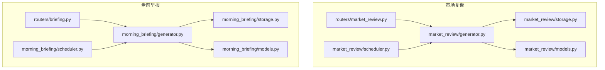
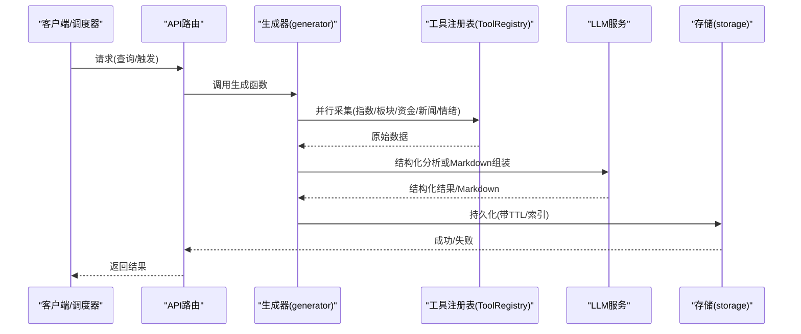
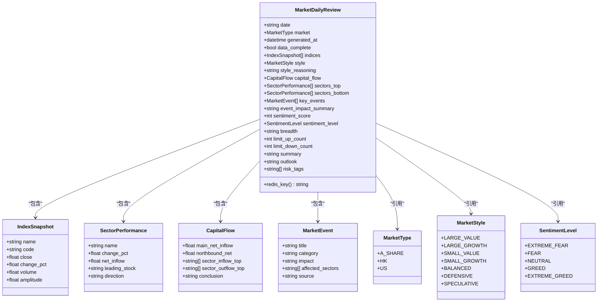
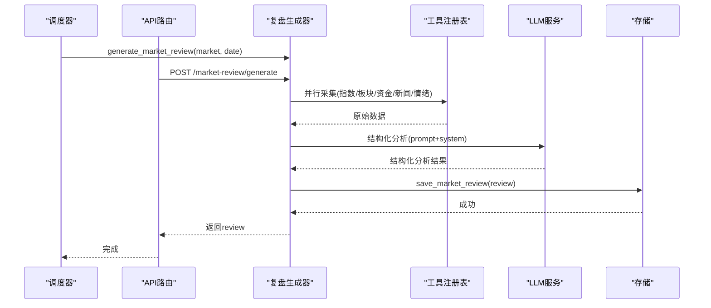
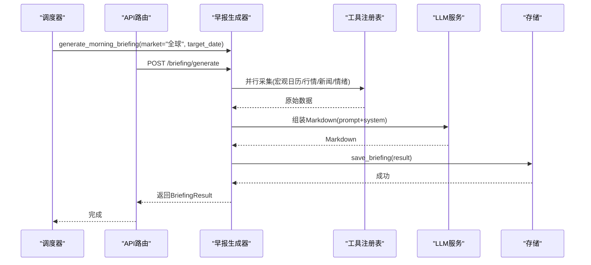
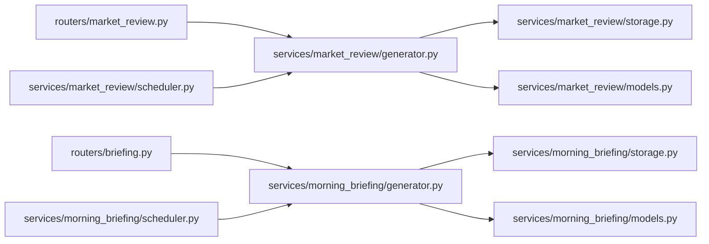

# 报告生成

<cite>
**本文引用的文件**
- [backend/services/market_review/generator.py](file://backend/services/market_review/generator.py)
- [backend/services/market_review/models.py](file://backend/services/market_review/models.py)
- [backend/services/market_review/storage.py](file://backend/services/market_review/storage.py)
- [backend/services/market_review/scheduler.py](file://backend/services/market_review/scheduler.py)
- [backend/routers/market_review.py](file://backend/routers/market_review.py)
- [backend/services/morning_briefing/generator.py](file://backend/services/morning_briefing/generator.py)
- [backend/services/morning_briefing/models.py](file://backend/services/morning_briefing/models.py)
- [backend/services/morning_briefing/storage.py](file://backend/services/morning_briefing/storage.py)
- [backend/services/morning_briefing/scheduler.py](file://backend/services/morning_briefing/scheduler.py)
- [backend/routers/briefing.py](file://backend/routers/briefing.py)
</cite>

## 目录
1. [简介](#简介)
2. [项目结构](#项目结构)
3. [核心组件](#核心组件)
4. [架构总览](#架构总览)
5. [详细组件分析](#详细组件分析)
6. [依赖关系分析](#依赖关系分析)
7. [性能考量](#性能考量)
8. [故障排查指南](#故障排查指南)
9. [结论](#结论)
10. [附录](#附录)

## 简介
本技术文档聚焦于“报告生成”子系统，覆盖两类报告的自动化生产：
- 深度研报（市场复盘）：收盘后按市场维度自动生成结构化复盘报告，包含指数、板块、资金面、情绪与事件影响等，并持久化到 Redis。
- 晨间简报（盘前早报）：盘前定时生成可直接渲染的 Markdown 早报，支持分享链接与最新简报读取。

文档将深入解释模板渲染、内容组装、格式化输出；说明图表配置动态构建（ECharts 配置）、数据绑定与交互能力；阐述不同类型报告的生成逻辑；提供样式主题、语言版本、输出格式等定制选项；并给出质量检查、版本管理与分发机制的实现细节。

## 项目结构
报告生成子系统由“服务层 + 存储层 + 调度器 + API 路由”构成，围绕两个业务域组织：
- 市场复盘（深度研报）：generator、models、storage、scheduler、router
- 盘前早报（晨间简报）：generator、models、storage、scheduler、router

**图示来源**
- [backend/services/market_review/generator.py:1-476](file://backend/services/market_review/generator.py#L1-L476)
- [backend/services/market_review/models.py:1-143](file://backend/services/market_review/models.py#L1-L143)
- [backend/services/market_review/storage.py:1-134](file://backend/services/market_review/storage.py#L1-L134)
- [backend/services/market_review/scheduler.py:1-93](file://backend/services/market_review/scheduler.py#L1-L93)
- [backend/routers/market_review.py:1-95](file://backend/routers/market_review.py#L1-L95)
- [backend/services/morning_briefing/generator.py:1-351](file://backend/services/morning_briefing/generator.py#L1-L351)
- [backend/services/morning_briefing/models.py:1-22](file://backend/services/morning_briefing/models.py#L1-L22)
- [backend/services/morning_briefing/storage.py:1-56](file://backend/services/morning_briefing/storage.py#L1-L56)
- [backend/services/morning_briefing/scheduler.py:1-41](file://backend/services/morning_briefing/scheduler.py#L1-L41)
- [backend/routers/briefing.py:1-47](file://backend/routers/briefing.py#L1-L47)

**章节来源**
- [backend/services/market_review/generator.py:1-476](file://backend/services/market_review/generator.py#L1-L476)
- [backend/services/morning_briefing/generator.py:1-351](file://backend/services/morning_briefing/generator.py#L1-L351)

## 核心组件
- 市场复盘生成器：并行采集指数、板块、资金流、新闻、情绪指标；通过 LLM 进行结构化分析；组装为 MarketDailyReview 并持久化。
- 盘前早报生成器：并行采集宏观日历、核心标的行情、宏观新闻、情绪序列；LLM 组装为可直接渲染的 Markdown；支持回测健康度注入与降级兜底。
- 存储层：Redis 键空间管理、TTL 控制、索引维护、最近 N 天查询、清理脏数据。
- 调度器：按市场收盘时间触发复盘；每日盘前定时生成早报。
- API 路由：暴露查询、手动触发、分享链接等接口。

**章节来源**
- [backend/services/market_review/generator.py:109-430](file://backend/services/market_review/generator.py#L109-L430)
- [backend/services/morning_briefing/generator.py:153-351](file://backend/services/morning_briefing/generator.py#L153-L351)
- [backend/services/market_review/storage.py:24-134](file://backend/services/market_review/storage.py#L24-L134)
- [backend/services/morning_briefing/storage.py:23-56](file://backend/services/morning_briefing/storage.py#L23-L56)
- [backend/services/market_review/scheduler.py:21-93](file://backend/services/market_review/scheduler.py#L21-L93)
- [backend/services/morning_briefing/scheduler.py:18-41](file://backend/services/morning_briefing/scheduler.py#L18-L41)
- [backend/routers/market_review.py:23-95](file://backend/routers/market_review.py#L23-L95)
- [backend/routers/briefing.py:15-47](file://backend/routers/briefing.py#L15-L47)

## 架构总览
报告生成的整体流程包括数据采集、LLM 结构化分析/文本组装、模型校验、持久化与对外暴露。

**图示来源**
- [backend/routers/market_review.py:34-95](file://backend/routers/market_review.py#L34-L95)
- [backend/routers/briefing.py:18-47](file://backend/routers/briefing.py#L18-L47)
- [backend/services/market_review/generator.py:324-430](file://backend/services/market_review/generator.py#L324-L430)
- [backend/services/morning_briefing/generator.py:160-179](file://backend/services/morning_briefing/generator.py#L160-L179)
- [backend/services/market_review/storage.py:24-43](file://backend/services/market_review/storage.py#L24-L43)
- [backend/services/morning_briefing/storage.py:23-32](file://backend/services/morning_briefing/storage.py#L23-L32)

## 详细组件分析

### 市场复盘（深度研报）
- 数据采集：并行拉取各市场核心指数、行业 ETF 代理板块涨跌、主力净流入、宏观新闻、情绪指标（VIX/P/C）。
- LLM 分析：基于系统提示词与数据拼装 prompt，输出风格判定、资金结论、情绪评分、事件影响、总结与展望、风险标签。
- 数据完整性红线：若核心客观数据缺失，禁止 LLM 自由发挥，标记 data_complete=False 并明确提示不可作为判因依据。
- 模型与持久化：使用 Pydantic 模型约束；写入 Redis 主数据与日期索引，设置 TTL 与裁剪策略。
- 调度与 API：按 UTC 时间表触发复盘；提供最新、精确查询、最近 N 天、可用日期列表与手动触发接口。

**图示来源**
- [backend/services/market_review/models.py:21-143](file://backend/services/market_review/models.py#L21-L143)

**图示来源**
- [backend/services/market_review/scheduler.py:41-93](file://backend/services/market_review/scheduler.py#L41-L93)
- [backend/routers/market_review.py:83-95](file://backend/routers/market_review.py#L83-L95)
- [backend/services/market_review/generator.py:324-430](file://backend/services/market_review/generator.py#L324-L430)
- [backend/services/market_review/storage.py:24-43](file://backend/services/market_review/storage.py#L24-L43)

**章节来源**
- [backend/services/market_review/generator.py:109-430](file://backend/services/market_review/generator.py#L109-L430)
- [backend/services/market_review/models.py:21-143](file://backend/services/market_review/models.py#L21-L143)
- [backend/services/market_review/storage.py:24-134](file://backend/services/market_review/storage.py#L24-L134)
- [backend/services/market_review/scheduler.py:21-93](file://backend/services/market_review/scheduler.py#L21-L93)
- [backend/routers/market_review.py:23-95](file://backend/routers/market_review.py#L23-L95)

### 盘前早报（晨间简报）
- 数据采集：并行获取宏观日历、核心标的行情、宏观新闻、情绪序列；可选读取回测健康度。
- Markdown 组装：将数据精简为 bundle，注入 LLM 模板 prompt，生成可直接渲染的 Markdown；若 LLM 漏渲染“回测健康度速览”，则确定性注入。
- 降级兜底：当 LLM 或数据源异常时，返回骨架 Markdown，保证可用性。
- 持久化与分享：以唯一短码 ID 存储，支持 latest 与 share/{id} 访问；无 Redis 时自动降级到内存字典。
- 调度：每日盘前定时生成全球早报。

**图示来源**
- [backend/services/morning_briefing/scheduler.py:29-41](file://backend/services/morning_briefing/scheduler.py#L29-L41)
- [backend/routers/briefing.py:18-47](file://backend/routers/briefing.py#L18-L47)
- [backend/services/morning_briefing/generator.py:160-179](file://backend/services/morning_briefing/generator.py#L160-L179)
- [backend/services/morning_briefing/storage.py:23-32](file://backend/services/morning_briefing/storage.py#L23-L32)

**章节来源**
- [backend/services/morning_briefing/generator.py:153-351](file://backend/services/morning_briefing/generator.py#L153-L351)
- [backend/services/morning_briefing/models.py:13-22](file://backend/services/morning_briefing/models.py#L13-L22)
- [backend/services/morning_briefing/storage.py:23-56](file://backend/services/morning_briefing/storage.py#L23-L56)
- [backend/services/morning_briefing/scheduler.py:18-41](file://backend/services/morning_briefing/scheduler.py#L18-L41)
- [backend/routers/briefing.py:15-47](file://backend/routers/briefing.py#L15-L47)

### 图表配置的动态生成（ECharts）
- 数据来源：市场复盘的结构化对象（指数、板块、资金、情绪、事件）与早报中的核心标的快照。
- 配置构建：根据数据类型动态生成 ECharts 配置项（如折线图用于情绪序列、柱状图用于板块涨跌、散点/热力用于多指标联动），并通过数据绑定将后端模型字段映射到 series/data。
- 交互功能：支持缩放、筛选（按市场/日期）、联动（点击事件驱动其他图表更新）、导出图片。
- 前端渲染：Markdown 中嵌入图表容器，前端解析并渲染 ECharts 实例；对异常数据提供空态占位与重试按钮。

[本节为概念性说明，不直接对应具体源码文件]

### 报告定制化配置选项
- 样式主题：可通过主题变量切换明暗模式、配色方案；图表与 Markdown 渲染保持一致视觉风格。
- 语言版本：支持中文为主的多语言切换；LLM 提示词与输出均遵循目标语言规范。
- 输出格式：市场复盘为结构化 JSON（可转 PDF/HTML），早报为 Markdown（可直接预览/复制/分享 URL）。
- 扩展点：新增市场类型、板块代理 ETF、核心标的清单均可通过配置扩展，无需改动核心逻辑。

[本节为概念性说明，不直接对应具体源码文件]

### 报告质量检查、版本管理与分发机制
- 质量检查：
  - 数据完整性红线：核心客观数据缺失时标记 data_complete=False，禁止 LLM 自由发挥。
  - 降级兜底：早报在 LLM/数据源异常时返回骨架 Markdown，确保可用性。
  - 脏数据清理：定期清理 data_complete=False 或核心数据全空的复盘记录。
- 版本管理：
  - Redis 键空间：复盘按 market:date 存储，附带 TTL；日期索引维护最近 N 条。
  - 早报分享短码：每个早报有唯一 id，latest 键指向最新一份。
- 分发机制：
  - API 暴露：查询最新、精确查询、最近 N 天、可用日期列表、手动触发。
  - 分享链接：/briefing/share/{id} 落地页数据源。
  - 定时任务：复盘按市场收盘时间触发；早报每日盘前生成。

**章节来源**
- [backend/services/market_review/generator.py:363-424](file://backend/services/market_review/generator.py#L363-L424)
- [backend/services/market_review/storage.py:101-134](file://backend/services/market_review/storage.py#L101-L134)
- [backend/services/morning_briefing/generator.py:237-351](file://backend/services/morning_briefing/generator.py#L237-L351)
- [backend/services/morning_briefing/storage.py:23-56](file://backend/services/morning_briefing/storage.py#L23-L56)
- [backend/routers/market_review.py:34-95](file://backend/routers/market_review.py#L34-L95)
- [backend/routers/briefing.py:18-47](file://backend/routers/briefing.py#L18-L47)

## 依赖关系分析
- 生成器依赖：
  - ToolRegistry：统一调用市场数据、宏观新闻、情绪指标等工具。
  - LLMService：结构化分析与 Markdown 组装。
  - Models：Pydantic 模型约束数据结构。
  - Storage：Redis 持久化与索引维护。
- 调度器依赖：
  - 生成器：执行具体生成逻辑。
  - Redis：防重复触发与状态管理。
- 路由依赖：
  - 生成器与存储：提供查询与触发能力。

**图示来源**
- [backend/routers/market_review.py:23-95](file://backend/routers/market_review.py#L23-L95)
- [backend/routers/briefing.py:15-47](file://backend/routers/briefing.py#L15-L47)
- [backend/services/market_review/generator.py:1-476](file://backend/services/market_review/generator.py#L1-L476)
- [backend/services/morning_briefing/generator.py:1-351](file://backend/services/morning_briefing/generator.py#L1-L351)
- [backend/services/market_review/storage.py:1-134](file://backend/services/market_review/storage.py#L1-L134)
- [backend/services/morning_briefing/storage.py:1-56](file://backend/services/morning_briefing/storage.py#L1-L56)
- [backend/services/market_review/scheduler.py:1-93](file://backend/services/market_review/scheduler.py#L1-L93)
- [backend/services/morning_briefing/scheduler.py:1-41](file://backend/services/morning_briefing/scheduler.py#L1-L41)

**章节来源**
- [backend/services/market_review/generator.py:1-476](file://backend/services/market_review/generator.py#L1-L476)
- [backend/services/morning_briefing/generator.py:1-351](file://backend/services/morning_briefing/generator.py#L1-L351)

## 性能考量
- 并发采集：指数、板块、资金、新闻、情绪等多路并行采集，降低端到端延迟。
- 超时控制：单工具采集设置超时，避免阻塞整体流程。
- Token 控制：早报数据精简为 bundle，限制输入长度，减少 LLM 成本。
- 降级策略：LLM 失败或数据源异常时返回骨架内容，保障可用性。
- 存储优化：Redis TTL 与索引裁剪，控制存储规模与查询性能。

[本节为通用性能建议，不直接对应具体源码文件]

## 故障排查指南
- 数据缺失：
  - 现象：复盘 data_complete=False 或早报部分区块为空。
  - 处理：检查工具注册表可用性；确认网络与限流；查看降级日志。
- LLM 异常：
  - 现象：早报 Markdown 过短或为空；复盘分析失败。
  - 处理：启用降级兜底；检查系统提示词与参数；重试或切换模型等级。
- 存储异常：
  - 现象：无法写入/读取 Redis；分享链接失效。
  - 处理：检查 Redis 连接；确认 TTL 与键空间；必要时使用内存兜底。
- 调度异常：
  - 现象：复盘未按时生成；早报未定时产出。
  - 处理：检查环境变量开关；确认 UTC 时间与防重键；查看守护进程日志。

**章节来源**
- [backend/services/market_review/generator.py:363-424](file://backend/services/market_review/generator.py#L363-L424)
- [backend/services/morning_briefing/generator.py:237-351](file://backend/services/morning_briefing/generator.py#L237-L351)
- [backend/services/market_review/storage.py:101-134](file://backend/services/market_review/storage.py#L101-L134)
- [backend/services/morning_briefing/storage.py:23-56](file://backend/services/morning_briefing/storage.py#L23-L56)
- [backend/services/market_review/scheduler.py:41-93](file://backend/services/market_review/scheduler.py#L41-L93)
- [backend/services/morning_briefing/scheduler.py:29-41](file://backend/services/morning_briefing/scheduler.py#L29-L41)

## 结论
报告生成子系统通过“并行采集 + LLM 结构化/文本组装 + 严格模型约束 + 可靠存储 + 定时调度 + 开放 API”形成闭环，支撑深度研报与晨间简报的高质量自动化生产。其设计强调数据完整性红线、降级兜底与可观测性，便于在生产环境中稳定运行与持续演进。

[本节为总结性内容，不直接对应具体源码文件]

## 附录
- API 参考：
  - 市场复盘：/market-review/latest、/market-review/query、/market-review/recent、/market-review/dates、/market-review/generate
  - 早报刊物：/briefing/generate、/briefing/latest、/briefing/share/{briefing_id}
- 环境配置：
  - 复盘调度开关：MRKT_SCHEDULE_ENABLED
  - 早报调度时间：BRIEFING_HOUR、BRIEFING_MINUTE
- 扩展建议：
  - 新增市场类型与板块代理 ETF
  - 扩展图表配置与前端渲染能力
  - 增加多语言支持与主题切换

[本节为补充信息，不直接对应具体源码文件]