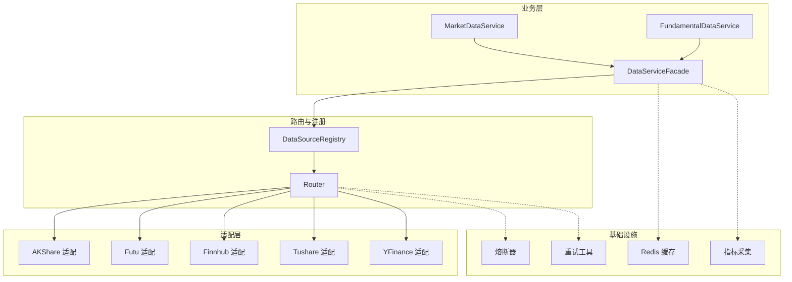
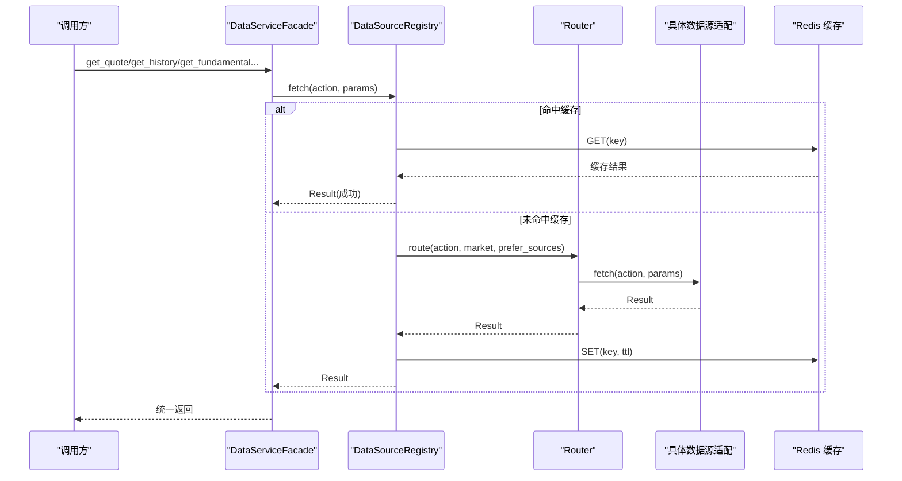
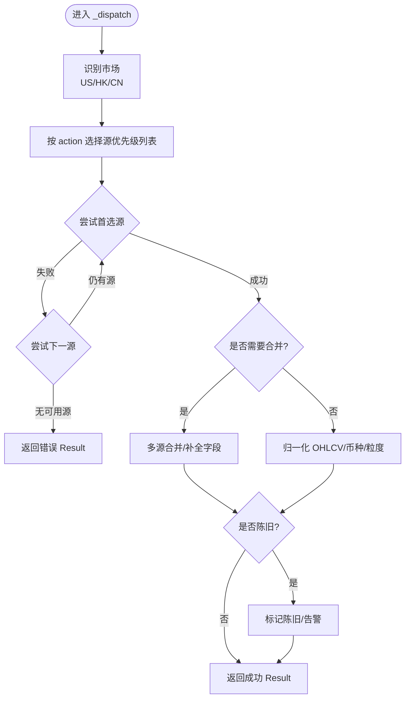
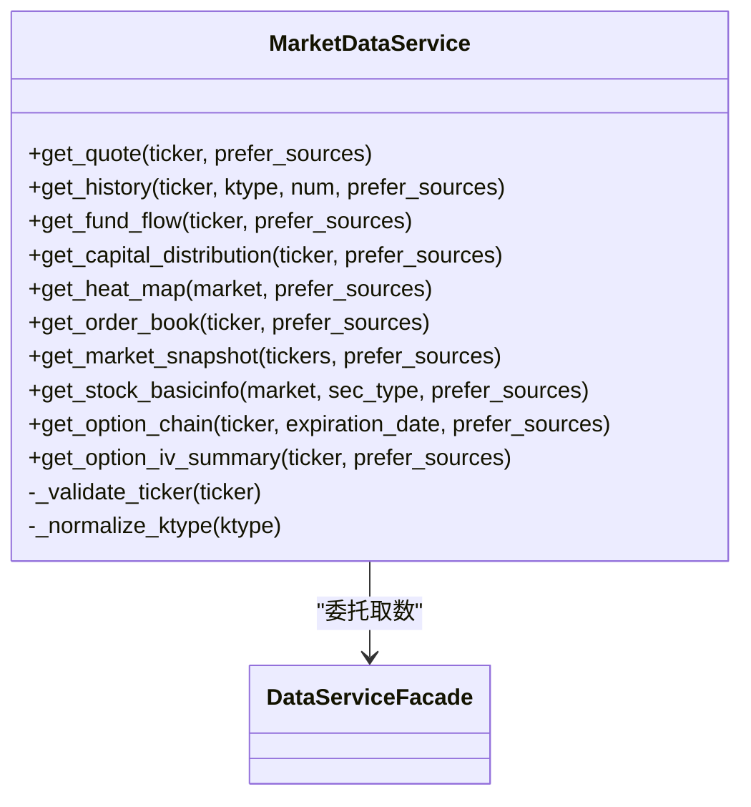
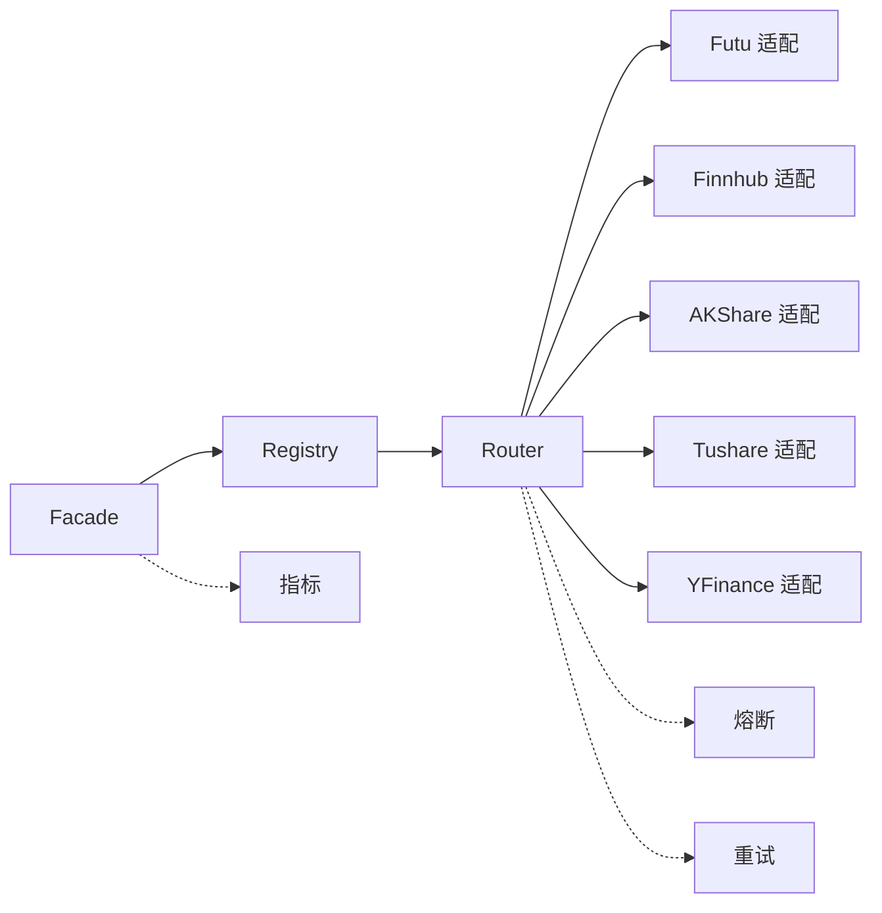

# 数据采集集成

<cite>
**本文引用的文件**
- [facade.py](file://backend/services/datasource/business/facade.py)
- [market.py](file://backend/services/datasource/business/market.py)
- [fundamental.py](file://backend/services/datasource/business/fundamental.py)
- [protocol.py](file://backend/services/datasource/protocol.py)
- [cache_manager.py](file://backend/core/cache_manager.py)
- [redis_client.py](file://backend/core/redis_client.py)
- [circuit_breaker.py](file://backend/core/circuit_breaker.py)
- [retry_utils.py](file://backend/core/retry_utils.py)
- [metrics.py](file://backend/core/metrics.py)
- [router.py](file://backend/services/datasource/router.py)
- [registry.py](file://backend/services/datasource/registry.py)
- [source_registry.py](file://backend/services/datasource/source_registry.py)
- [akshare/service.py](file://backend/services/akshare/service.py)
- [futu/service.py](file://backend/services/futu/service.py)
- [finnhub/service.py](file://backend/services/finnhub/service.py)
- [tushare/service.py](file://backend/services/tushare/service.py)
- [yfinance/__init__.py](file://data_subservice/_internal/yfinance/__init__.py)
- [test_be_arch06_facade.py](file://backend/tests/test_be_arch06_facade.py)
</cite>

## 目录
1. [简介](#简介)
2. [项目结构](#项目结构)
3. [核心组件](#核心组件)
4. [架构总览](#架构总览)
5. [详细组件分析](#详细组件分析)
6. [依赖关系分析](#依赖关系分析)
7. [性能与缓存优化](#性能与缓存优化)
8. [数据质量控制](#数据质量控制)
9. [API 调用示例与数据格式规范](#api-调用示例与数据格式规范)
10. [故障排查指南](#故障排查指南)
11. [结论](#结论)

## 简介
本技术文档面向“数据采集集成”子系统，围绕 Facade 模式在数据源聚合中的应用，系统阐述市场数据、基本面数据与新闻数据的统一接口设计；说明各数据源的适配层实现（实时行情、历史 K 线、财务指标等）；给出数据质量控制机制（验证、完整性检查、异常处理）；并提供数据缓存策略与性能优化方案（Redis 缓存、批量请求、并发控制），以及 API 调用示例与数据格式规范。

## 项目结构
该子系统采用分层与领域划分：
- 业务层（Facade + 领域适配器）：提供面向业务的语义接口（行情、基本面、新闻等），屏蔽底层多源差异。
- 路由与注册层：通过 DataSourceRegistry/Router 将 action 路由到具体数据源适配器。
- 适配层：针对 Futu、Finnhub、AKShare、Tushare、YFinance 等外部数据源的薄封装。
- 基础设施：缓存（Redis）、熔断、重试、指标、日志等通用能力。

图表来源
- [facade.py:212-800](file://backend/services/datasource/business/facade.py#L212-L800)
- [market.py:28-229](file://backend/services/datasource/business/market.py#L28-L229)
- [fundamental.py:18-42](file://backend/services/datasource/business/fundamental.py#L18-L42)
- [protocol.py:12-47](file://backend/services/datasource/protocol.py#L12-L47)
- [router.py:1-200](file://backend/services/datasource/router.py#L1-L200)
- [registry.py:1-200](file://backend/services/datasource/registry.py#L1-L200)
- [source_registry.py:1-200](file://backend/services/datasource/source_registry.py#L1-L200)

章节来源
- [facade.py:1-1328](file://backend/services/datasource/business/facade.py#L1-L1328)
- [market.py:1-230](file://backend/services/datasource/business/market.py#L1-L230)
- [fundamental.py:1-42](file://backend/services/datasource/business/fundamental.py#L1-L42)
- [protocol.py:1-47](file://backend/services/datasource/protocol.py#L1-L47)

## 核心组件
- DataServiceFacade：业务聚合门面，负责策略选源、多源融合、一致性检测、归一化与业务级缓存统计。
- MarketDataService：行情领域适配器，封装 ticker 校验、ktype 归一、期权 IV 派生等策略。
- FundamentalDataService：基本面领域适配器，封装基本面与公司概况查询。
- DataSourceInterface：数据源统一协议，强制所有数据源暴露 name/version/capabilities/mode/is_available/health/fetch。
- Router/Registry/SourceRegistry：动作路由与数据源注册中心，按 market/action 选择优先级与降级路径。

章节来源
- [facade.py:212-800](file://backend/services/datasource/business/facade.py#L212-L800)
- [market.py:28-229](file://backend/services/datasource/business/market.py#L28-L229)
- [fundamental.py:18-42](file://backend/services/datasource/business/fundamental.py#L18-L42)
- [protocol.py:12-47](file://backend/services/datasource/protocol.py#L12-L47)

## 架构总览
Facade 不直接 import 具体数据源库，仅通过 datasource_registry.fetch 取数，确保解耦与可替换性。不同市场（US/HK/CN）对同一 action 的源优先级不同，支持自动降级与合并互补字段。

图表来源
- [facade.py:220-242](file://backend/services/datasource/business/facade.py#L220-L242)
- [router.py:1-200](file://backend/services/datasource/router.py#L1-L200)
- [registry.py:1-200](file://backend/services/datasource/registry.py#L1-L200)
- [source_registry.py:1-200](file://backend/services/datasource/source_registry.py#L1-L200)
- [redis_client.py:1-200](file://backend/core/redis_client.py#L1-L200)

## 详细组件分析

### 业务门面（DataServiceFacade）
- 职责：
  - 统一业务语义接口：get_quote、get_history、get_fund_flow、get_capital_distribution、get_heat_map、get_option_chain、get_fundamental、get_fundamental_info、get_order_book、get_market_snapshot、get_stock_basicinfo、get_analyst_consensus、get_analyst_vs_actual 等。
  - 市场感知源优先级：QUOTE/HISTORY/FUND_FLOW/FUNDAMENTAL/NEWS 等 action 在不同市场（US/HK/CN）有差异化优先级与降级顺序。
  - 新鲜度阈值：按 action 定义 stale 阈值，超过即判为陈旧。
  - 多源融合：如经济日历事件合并、真基本面三源并发合并（Futu/FMP/YFinance）。
  - 产品级增强：筹码背离信号结构化、盘口价差/量比、板块热力图面板、快照涨跌家数等。
- 关键策略：
  - 市场判定：基于 ticker 前缀或裸 A 股代码段识别 US/HK/CN。
  - 偏差告警：多源报价偏差百分比阈值触发度量上报。
  - 零幻觉红线：缺失字段保留 None 并记录 note，不臆造数据。

图表来源
- [facade.py:52-157](file://backend/services/datasource/business/facade.py#L52-L157)
- [facade.py:159-206](file://backend/services/datasource/business/facade.py#L159-L206)
- [facade.py:220-800](file://backend/services/datasource/business/facade.py#L220-L800)

章节来源
- [facade.py:1-800](file://backend/services/datasource/business/facade.py#L1-L800)

### 行情领域适配器（MarketDataService）
- 职责：
  - 统一 ticker 校验与 ktype 归一（DAY/WEEK/MONTH/MIN_* → K_DAY/K_WEEK/K_MON/K_MIN_*）。
  - 封装行情相关策略：get_quote、get_history、get_fund_flow、get_capital_distribution、get_heat_map、get_order_book、get_market_snapshot、get_stock_basicinfo、get_option_chain、get_option_iv_summary。
  - 期权 IV 指标派生：ATM IV、IV 分位、30日已实现波动率、Skew，全部来自真实数据，缺失字段置 None。

图表来源
- [market.py:28-229](file://backend/services/datasource/business/market.py#L28-L229)
- [facade.py:220-800](file://backend/services/datasource/business/facade.py#L220-L800)

章节来源
- [market.py:1-230](file://backend/services/datasource/business/market.py#L1-L230)

### 基本面领域适配器（FundamentalDataService）
- 职责：
  - 封装个股基本面与公司概况查询，统一经 Facade 获取。
  - ticker 基础校验，保证输入安全。

章节来源
- [fundamental.py:1-42](file://backend/services/datasource/business/fundamental.py#L1-L42)

### 数据源统一协议（DataSourceInterface）
- 强制所有数据源实现：name/version/capabilities/mode/is_available/health/fetch。
- 确保 Router/Registry 能统一发现与调度。

章节来源
- [protocol.py:12-47](file://backend/services/datasource/protocol.py#L12-L47)

### 适配层实现要点
- Futu：实时 L2 盘口、资金流、筹码分布、期权链、快照、基本信息等，低延迟且覆盖港股/美股。
- Finnhub：美股新闻与部分基本面兜底。
- AKShare：A 股行情、资金流、新闻等。
- Tushare：A 股资金流与部分基本面。
- YFinance：美股/港股基本面与行情兜底。

章节来源
- [akshare/service.py:1-200](file://backend/services/akshare/service.py#L1-L200)
- [futu/service.py:1-200](file://backend/services/futu/service.py#L1-L200)
- [finnhub/service.py:1-200](file://backend/services/finnhub/service.py#L1-L200)
- [tushare/service.py:1-200](file://backend/services/tushare/service.py#L1-L200)
- [yfinance/__init__.py:1-200](file://data_subservice/_internal/yfinance/__init__.py#L1-L200)

## 依赖关系分析
- 耦合与内聚：
  - Facade 与 Registry/Router 松耦合，仅通过 Protocol 交互，便于替换与扩展。
  - 领域适配器（Market/Fundamental）高内聚于业务策略，降低上层调用复杂度。
- 外部依赖：
  - 各数据源适配层分别依赖第三方 SDK/HTTP 客户端。
  - 基础设施依赖 Redis、熔断器、重试工具、指标采集。
- 潜在循环依赖：
  - 通过 Registry/Router 解耦，避免 Facade 直接 import 具体数据源，降低循环风险。

图表来源
- [facade.py:212-800](file://backend/services/datasource/business/facade.py#L212-L800)
- [router.py:1-200](file://backend/services/datasource/router.py#L1-L200)
- [registry.py:1-200](file://backend/services/datasource/registry.py#L1-L200)
- [source_registry.py:1-200](file://backend/services/datasource/source_registry.py#L1-L200)

章节来源
- [facade.py:212-800](file://backend/services/datasource/business/facade.py#L212-L800)
- [router.py:1-200](file://backend/services/datasource/router.py#L1-L200)
- [registry.py:1-200](file://backend/services/datasource/registry.py#L1-L200)
- [source_registry.py:1-200](file://backend/services/datasource/source_registry.py#L1-L200)

## 性能与缓存优化
- Redis 缓存：
  - 使用 Redis 作为分布式缓存，减少重复请求与下游压力。
  - 结合 TTL 与键空间管理，避免脏读与内存膨胀。
- 批量请求：
  - 批量快照（SNAPSHOT）一次拉取多只标的，降低网络开销。
  - 经济日历事件合并，减少多次调用。
- 并发控制：
  - 基本面三源并发拉取（Futu/FMP/YFinance），单源失败不影响整体可用性。
  - 使用 asyncio.gather 提升吞吐，配合熔断与重试保障稳定性。
- 指标与监控：
  - 通过指标模块上报融合耗时、偏差、命中率等，支撑容量规划与问题定位。

章节来源
- [cache_manager.py:1-200](file://backend/core/cache_manager.py#L1-L200)
- [redis_client.py:1-200](file://backend/core/redis_client.py#L1-L200)
- [metrics.py:1-200](file://backend/core/metrics.py#L1-L200)
- [facade.py:490-556](file://backend/services/datasource/business/facade.py#L490-L556)

## 数据质量控制
- 数据验证：
  - ticker 基础校验（非空、去除空白、禁止注入字符）。
  - ktype 归一化，确保下游一致。
- 完整性检查：
  - 新鲜度阈值（stale threshold）：按 action 定义过期时间，超期标记陈旧。
  - 多源偏差阈值：报价偏差百分比超过阈值触发告警。
- 异常处理：
  - 单源崩溃不影响合并流程（graceful degradation）。
  - 缺失字段保留 None 并记录 note，遵循零幻觉红线。
  - 熔断与重试：对不稳定外部服务进行保护与恢复。

章节来源
- [market.py:195-225](file://backend/services/datasource/business/market.py#L195-L225)
- [facade.py:186-209](file://backend/services/datasource/business/facade.py#L186-L209)
- [circuit_breaker.py:1-200](file://backend/core/circuit_breaker.py#L1-L200)
- [retry_utils.py:1-200](file://backend/core/retry_utils.py#L1-L200)

## API 调用示例与数据格式规范
以下为典型调用方式与返回结构约定（以路径引用代替具体代码内容）：
- 行情快照
  - 调用：MarketDataService.get_quote / DataServiceFacade.get_quote
  - 参数：ticker、prefer_sources（可选）
  - 返回：Result.data 包含标准化 OHLCV 字段；若陈旧则带 stale 标记
  - 参考路径：[get_quote 实现:220-227](file://backend/services/datasource/business/facade.py#L220-L227)
- 历史 K 线
  - 调用：MarketDataService.get_history / DataServiceFacade.get_history
  - 参数：ticker、ktype（归一后）、num、prefer_sources（可选）
  - 返回：Result.data 包含 K 线序列（时间、开高低收、成交量）
  - 参考路径：[get_history 实现:229-242](file://backend/services/datasource/business/facade.py#L229-L242)
- 主力资金流
  - 调用：MarketDataService.get_fund_flow / DataServiceFacade.get_fund_flow
  - 参数：ticker、prefer_sources（可选）
  - 返回：Result.data 含净流入、席位明细等
  - 参考路径：[get_fund_flow 实现:244-251](file://backend/services/datasource/business/facade.py#L244-L251)
- 基本面合并（真基本面）
  - 调用：DataServiceFacade.get_fundamental_merged
  - 参数：ticker
  - 返回：Result.data 含 sources 状态与 futu/fmp/yfinance 三路数据
  - 参考路径：[get_fundamental_merged 实现:490-556](file://backend/services/datasource/business/facade.py#L490-L556)
- 分析师共识 vs 实际
  - 调用：DataServiceFacade.get_analyst_vs_actual
  - 参数：ticker、prefer_sources（可选）
  - 返回：Result.data 含目标价、当前价、上行空间、结论与 notes
  - 参考路径：[get_analyst_vs_actual 实现:709-800](file://backend/services/datasource/business/facade.py#L709-L800)

数据格式规范要点：
- 统一 Result 结构：is_success/is_error、data、error、source。
- 字段归一：OHLCV、币种、时间粒度、复权方式。
- 零幻觉：缺失字段为 None，附带 note 说明来源与原因。
- 面板增强：热力图、快照、盘口等附加 panel 字段供前端渲染。

章节来源
- [facade.py:220-800](file://backend/services/datasource/business/facade.py#L220-L800)
- [market.py:37-191](file://backend/services/datasource/business/market.py#L37-L191)

## 故障排查指南
- 常见问题定位：
  - 数据陈旧：检查 stale 阈值与缓存 TTL，确认上游推送频率。
  - 多源偏差：查看偏差阈值与指标上报，定位异常源。
  - 单源失败：确认熔断状态与重试次数，必要时切换 prefer_sources。
  - 缓存未命中：检查 Redis 连接与键生成逻辑。
- 建议步骤：
  - 启用详细日志与指标看板，观察请求链路耗时与错误码。
  - 使用测试用例验证路由与降级路径（例如 facade 行为测试）。
  - 逐步隔离数据源，确认是否为外部服务限流或不可用。

章节来源
- [test_be_arch06_facade.py:1-200](file://backend/tests/test_be_arch06_facade.py#L1-L200)
- [circuit_breaker.py:1-200](file://backend/core/circuit_breaker.py#L1-L200)
- [retry_utils.py:1-200](file://backend/core/retry_utils.py#L1-L200)
- [redis_client.py:1-200](file://backend/core/redis_client.py#L1-L200)

## 结论
本集成通过 Facade 模式实现了多数据源的统一接入与业务语义抽象，结合市场感知路由、多源融合与产品级增强，提供了稳定、可扩展的数据采集能力。配合 Redis 缓存、并发控制、熔断重试与指标监控，系统在性能与可靠性方面具备良好表现。数据质量控制贯穿全流程，确保输出的一致性与可信度。后续可继续完善更多市场与数据源的适配，持续优化路由策略与缓存命中率。