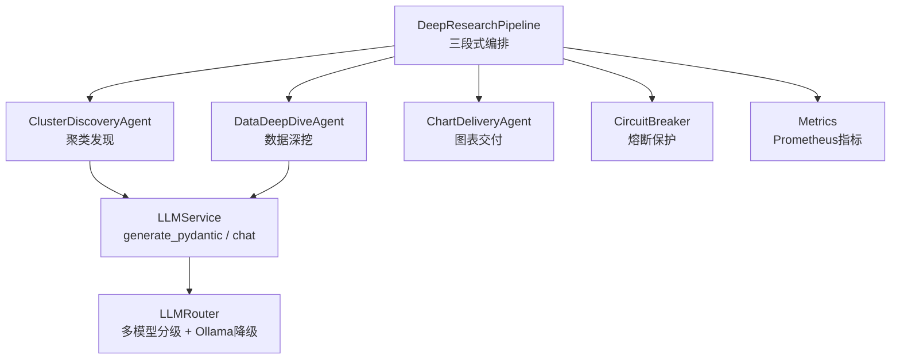
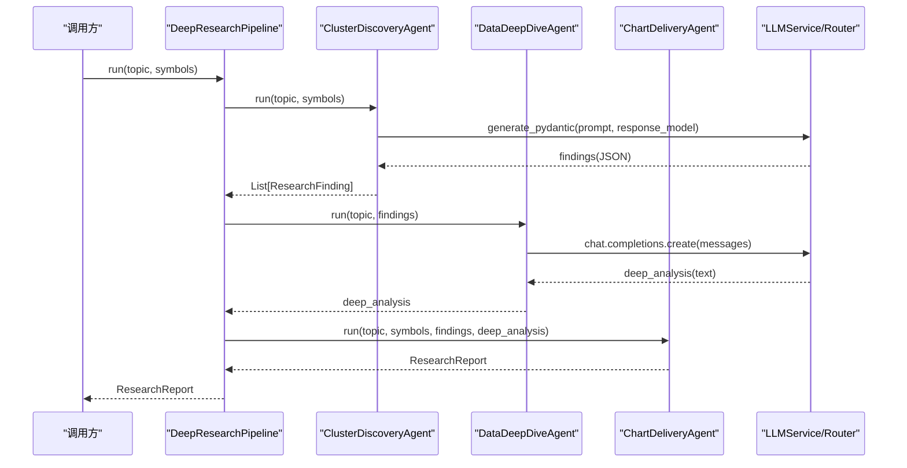
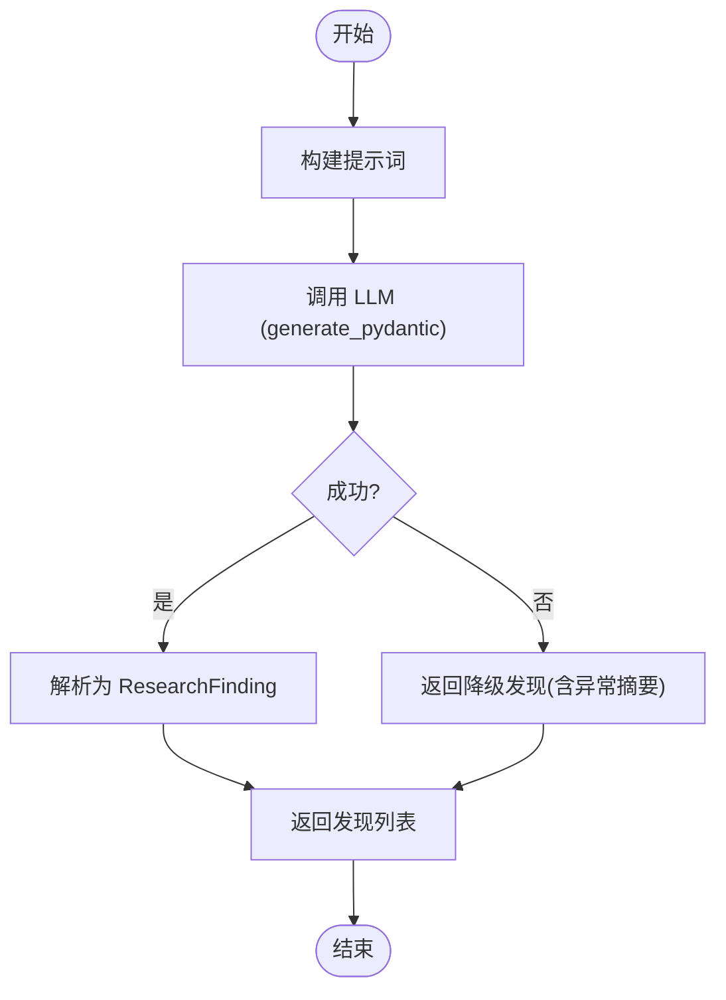
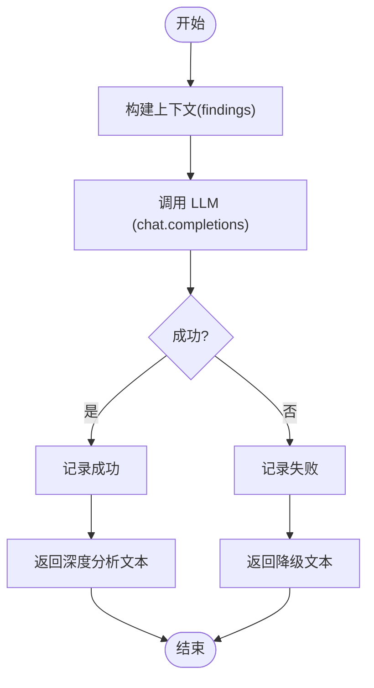
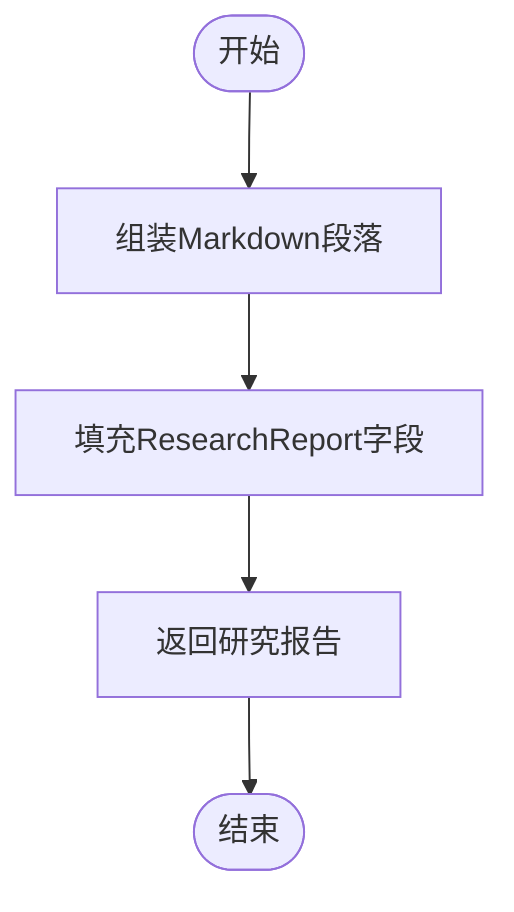
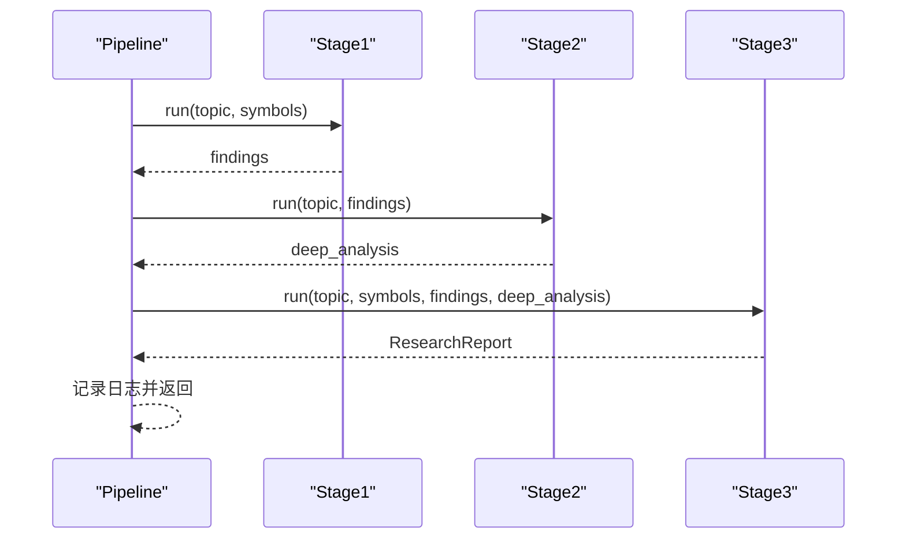
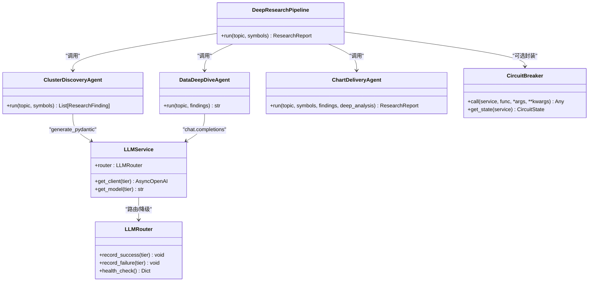

# 研究流水线编排

<cite>
**本文引用的文件**
- [backend/app/research/deep_research.py](file://backend/app/research/deep_research.py)
- [backend/tests/test_deep_research.py](file://backend/tests/test_deep_research.py)
- [backend/services/ai_narrator/llm_service.py](file://backend/services/ai_narrator/llm_service.py)
- [backend/core/circuit_breaker.py](file://backend/core/circuit_breaker.py)
- [backend/core/metrics.py](file://backend/core/metrics.py)
</cite>

## 目录
1. [简介](#简介)
2. [项目结构](#项目结构)
3. [核心组件](#核心组件)
4. [架构总览](#架构总览)
5. [详细组件分析](#详细组件分析)
6. [依赖关系分析](#依赖关系分析)
7. [性能与可观测性](#性能与可观测性)
8. [故障排查指南](#故障排查指南)
9. [结论](#结论)
10. [附录：调用示例与配置](#附录调用示例与配置)

## 简介
本技术文档聚焦于“DeepResearchPipeline”的三段式流水线架构，围绕以下三个 Agent 的协作机制展开：
- ClusterDiscoveryAgent（聚类发现）：收集新闻与基本面信息，识别关键主题与异常信号。
- DataDeepDiveAgent（数据深挖）：基于聚类发现进行深度分析，结合知识库检索与历史对比。
- ChartDeliveryAgent（图表交付）：组装最终 Markdown 研报与 ECharts 配置，输出结构化报告。

文档将详细说明每个阶段的输入输出数据格式、错误处理策略与降级方案，解释执行流程控制（阶段间数据传递、异常捕获、日志记录），并提供流水线配置选项、执行监控方法（性能指标与调试工具）、具体调用示例与故障排查指南。

## 项目结构
DeepResearchPipeline 位于后端应用的研究模块中，通过统一的 LLM 服务与路由机制完成多模型分级调用与自动降级；同时借助熔断器与指标体系保障系统稳定性与可观测性。

图示来源
- [backend/app/research/deep_research.py:199-226](file://backend/app/research/deep_research.py#L199-L226)
- [backend/services/ai_narrator/llm_service.py:26-189](file://backend/services/ai_narrator/llm_service.py#L26-L189)
- [backend/core/circuit_breaker.py:64-200](file://backend/core/circuit_breaker.py#L64-L200)
- [backend/core/metrics.py:100-110](file://backend/core/metrics.py#L100-L110)

章节来源
- [backend/app/research/deep_research.py:1-231](file://backend/app/research/deep_research.py#L1-L231)

## 核心组件
- ResearchFinding：单条研究发现，包含主题、摘要、来源、相关性等字段。
- ResearchReport：深度研报，包含主题、标的列表、执行摘要、发现列表、深度分析、图表配置、参考链接、Markdown 内容等。
- ClusterDiscoveryAgent：负责从 LLM 获取结构化发现列表，支持失败降级。
- DataDeepDiveAgent：基于发现进行深度分析，支持失败降级并记录路由状态。
- ChartDeliveryAgent：组装 Markdown 研报与结构化报告对象。
- DeepResearchPipeline：编排三个阶段，顺序执行并记录日志。

章节来源
- [backend/app/research/deep_research.py:19-41](file://backend/app/research/deep_research.py#L19-L41)
- [backend/app/research/deep_research.py:43-104](file://backend/app/research/deep_research.py#L43-L104)
- [backend/app/research/deep_research.py:107-151](file://backend/app/research/deep_research.py#L107-L151)
- [backend/app/research/deep_research.py:153-196](file://backend/app/research/deep_research.py#L153-L196)
- [backend/app/research/deep_research.py:199-226](file://backend/app/research/deep_research.py#L199-L226)

## 架构总览
DeepResearchPipeline 采用三段式顺序执行：
- Stage 1：聚类发现（ClusterDiscoveryAgent）
- Stage 2：数据深挖（DataDeepDiveAgent）
- Stage 3：图表交付（ChartDeliveryAgent）

每个阶段均通过 LLMService 调用不同 tier 的模型，并在失败时触发降级或错误处理；Pipeline 层统一记录日志与阶段进度。

图示来源
- [backend/app/research/deep_research.py:207-226](file://backend/app/research/deep_research.py#L207-L226)
- [backend/services/ai_narrator/llm_service.py:121-189](file://backend/services/ai_narrator/llm_service.py#L121-L189)

## 详细组件分析

### ClusterDiscoveryAgent（聚类发现）
- 输入：topic（主题）、symbols（标的列表）
- 输出：List[ResearchFinding]
- 行为：
  - 构建提示词，调用 llm_service.generate_pydantic 获取结构化 JSON 响应。
  - 解析为 ResearchFinding 列表。
  - 异常捕获：若 LLM 调用失败，记录警告日志并返回基础降级结果（含异常信息摘要）。
- 错误处理与降级：
  - 使用 try/except 包裹 LLM 调用，失败时返回最小可用发现，保证后续阶段仍可执行。
- 性能考虑：
  - 使用 Pydantic 模型校验响应结构，减少解析错误风险。
  - 建议对大 topic/symbols 列表进行分片或限制长度，避免提示词过长。

图示来源
- [backend/app/research/deep_research.py:52-104](file://backend/app/research/deep_research.py#L52-L104)

章节来源
- [backend/app/research/deep_research.py:43-104](file://backend/app/research/deep_research.py#L43-L104)
- [backend/tests/test_deep_research.py:24-54](file://backend/tests/test_deep_research.py#L24-L54)

### DataDeepDiveAgent（数据深挖）
- 输入：topic（主题）、findings（聚类发现列表）
- 输出：deep_analysis（文本）
- 行为：
  - 将 findings 拼接为提示词上下文，调用 llm_service.get_client(ModelTier.FLAGSHIP) 进行对话生成。
  - 成功时记录 router.record_success，失败时记录 router.record_failure 并返回降级文本。
- 错误处理与降级：
  - 捕获异常后记录失败计数，可能触发 LLMRouter 的降级逻辑（如切换至本地 Ollama）。
  - 返回包含异常信息的降级文本，确保下游仍可继续组装报告。
- 性能考虑：
  - 温度参数较低（0.3），提高输出稳定性。
  - 建议对 findings 数量进行上限控制，避免提示词过大。

图示来源
- [backend/app/research/deep_research.py:116-151](file://backend/app/research/deep_research.py#L116-L151)
- [backend/services/ai_narrator/llm_service.py:139-161](file://backend/services/ai_narrator/llm_service.py#L139-L161)

章节来源
- [backend/app/research/deep_research.py:107-151](file://backend/app/research/deep_research.py#L107-L151)
- [backend/tests/test_deep_research.py:59-101](file://backend/tests/test_deep_research.py#L59-L101)

### ChartDeliveryAgent（图表交付）
- 输入：topic（主题）、symbols（标的列表）、findings（发现列表）、deep_analysis（深度分析文本）
- 输出：ResearchReport（包含 Markdown 内容与结构化字段）
- 行为：
  - 组装 Markdown 段落（标题、标的、核心发现、深度分析、风险提示）。
  - 填充 ResearchReport 各字段，包括 executive_summary、findings、deep_analysis、chart_configs、references、markdown_content。
- 错误处理与降级：
  - 当 findings 为空时，executive_summary 设为空字符串，仍生成完整 Markdown。
- 性能考虑：
  - 当前 chart_configs 为空列表，可扩展为动态生成 ECharts 配置。
  - 建议对长文本进行分段与缓存，提升渲染效率。

图示来源
- [backend/app/research/deep_research.py:161-196](file://backend/app/research/deep_research.py#L161-L196)

章节来源
- [backend/app/research/deep_research.py:153-196](file://backend/app/research/deep_research.py#L153-L196)
- [backend/tests/test_deep_research.py:106-134](file://backend/tests/test_deep_research.py#L106-L134)

### DeepResearchPipeline（流水线编排）
- 职责：顺序执行三个阶段，传递数据并记录日志。
- 执行流程：
  - Stage 1：调用 ClusterDiscoveryAgent.run，得到 findings。
  - Stage 2：调用 DataDeepDiveAgent.run，得到 deep_analysis。
  - Stage 3：调用 ChartDeliveryAgent.run，组装 ResearchReport。
- 异常捕获与日志：
  - 每阶段完成后记录日志，便于追踪执行进度与耗时。
  - 若某阶段抛出未捕获异常，将中断流水线；建议在外部增加统一异常处理与重试策略。
- 扩展点：
  - 可增加并行化（如 Stage 1 与 Stage 2 的部分子任务并行）。
  - 可增加熔断器包装外部 API 调用，防止雪崩。

图示来源
- [backend/app/research/deep_research.py:207-226](file://backend/app/research/deep_research.py#L207-L226)

章节来源
- [backend/app/research/deep_research.py:199-226](file://backend/app/research/deep_research.py#L199-L226)
- [backend/tests/test_deep_research.py:139-172](file://backend/tests/test_deep_research.py#L139-L172)

## 依赖关系分析
- LLMService 与 LLMRouter：
  - 提供多模型分级路由（LIGHTWEIGHT/STANDARD/FLAGSHIP）与 Ollama 降级。
  - 支持健康检查与恢复探测，连续失败达到阈值后自动切换至本地模型。
- CircuitBreaker：
  - 对外部 API 调用提供熔断保护，避免级联故障。
  - 支持限流错误过滤与状态机转换（CLOSED → OPEN → HALF_OPEN → CLOSED）。
- Metrics：
  - 暴露 Prometheus 指标，用于监控熔断器状态、数据源延迟、错误率等。

图示来源
- [backend/app/research/deep_research.py:199-226](file://backend/app/research/deep_research.py#L199-L226)
- [backend/services/ai_narrator/llm_service.py:26-189](file://backend/services/ai_narrator/llm_service.py#L26-L189)
- [backend/core/circuit_breaker.py:64-200](file://backend/core/circuit_breaker.py#L64-L200)

章节来源
- [backend/services/ai_narrator/llm_service.py:26-189](file://backend/services/ai_narrator/llm_service.py#L26-L189)
- [backend/core/circuit_breaker.py:64-200](file://backend/core/circuit_breaker.py#L64-L200)
- [backend/core/metrics.py:100-110](file://backend/core/metrics.py#L100-L110)

## 性能与可观测性
- 指标采集：
  - 熔断器状态与转换次数：CIRCUIT_BREAKER_STATE、CIRCUIT_BREAKER_TRANSITIONS。
  - 数据源延迟与错误率：DATASOURCE_LATENCY、DATASOURCE_ERRORS、DATASOURCE_RATE_LIMITS。
  - 可用性探针：DATASOURCE_PROBE_SUCCESS、DATASOURCE_PROBE_LATENCY。
- 监控建议：
  - 在 Pipeline 各阶段前后埋点耗时，计算端到端延迟。
  - 对 LLM 调用成功率、降级触发频率进行统计。
  - 结合 Grafana 仪表盘可视化指标趋势。
- 调试工具：
  - 使用单元测试 Mock LLM 服务，验证各阶段行为与降级路径。
  - 启用结构化日志，按阶段与异常类型分类记录。

章节来源
- [backend/core/metrics.py:100-110](file://backend/core/metrics.py#L100-L110)
- [backend/tests/test_deep_research.py:1-172](file://backend/tests/test_deep_research.py#L1-L172)

## 故障排查指南
- 常见问题定位：
  - LLM 调用超时或网络抖动：检查 LLMRouter 的降级状态与健康检查；查看 record_failure 是否触发降级。
  - 熔断器打开：确认外部 API 是否持续失败；检查 CIRCUIT_BREAKER_STATE 指标。
  - 报告内容为空或异常：检查 ClusterDiscoveryAgent 的降级返回；确认 findings 是否为空。
- 排查步骤：
  - 查看 Pipeline 日志，确认各阶段是否执行完成。
  - 检查 LLMService 的模型选择与路由状态。
  - 使用单元测试复现问题，逐步缩小范围。
- 恢复策略：
  - 调整熔断器阈值与冷却时间，避免误触发。
  - 优化提示词与输入长度，降低 LLM 负载。
  - 引入重试与退避机制，提升鲁棒性。

章节来源
- [backend/core/circuit_breaker.py:64-200](file://backend/core/circuit_breaker.py#L64-L200)
- [backend/services/ai_narrator/llm_service.py:139-189](file://backend/services/ai_narrator/llm_service.py#L139-L189)
- [backend/app/research/deep_research.py:93-104](file://backend/app/research/deep_research.py#L93-L104)
- [backend/app/research/deep_research.py:147-151](file://backend/app/research/deep_research.py#L147-L151)

## 结论
DeepResearchPipeline 通过三段式 Agent 协作，实现了从聚类发现到深度分析再到报告交付的完整研究流水线。其设计具备清晰的输入输出契约、完善的错误处理与降级机制，以及良好的可观测性与扩展性。建议在生产环境中结合熔断器、指标监控与单元测试，进一步提升系统的稳定性与可维护性。

## 附录：调用示例与配置
- 基本调用示例：
  - 创建 Pipeline 实例并调用 run 方法，传入主题与标的列表。
  - 获取 ResearchReport 对象，提取 markdown_content 与结构化字段。
- 配置选项：
  - LLM 模型分级：通过 ModelTier 指定轻量、标准、旗舰模型。
  - 降级策略：设置 LLMRouter 的 fallback_enabled 与 fallback_threshold。
  - 熔断器参数：通过环境变量配置最大失败次数与冷却时间。
- 监控与调试：
  - 使用 Prometheus 抓取指标，Grafana 展示仪表盘。
  - 通过单元测试 Mock 外部依赖，验证各阶段行为。

章节来源
- [backend/app/research/deep_research.py:207-226](file://backend/app/research/deep_research.py#L207-L226)
- [backend/services/ai_narrator/llm_service.py:43-63](file://backend/services/ai_narrator/llm_service.py#L43-L63)
- [backend/core/circuit_breaker.py:40-43](file://backend/core/circuit_breaker.py#L40-L43)
- [backend/tests/test_deep_research.py:139-172](file://backend/tests/test_deep_research.py#L139-L172)
