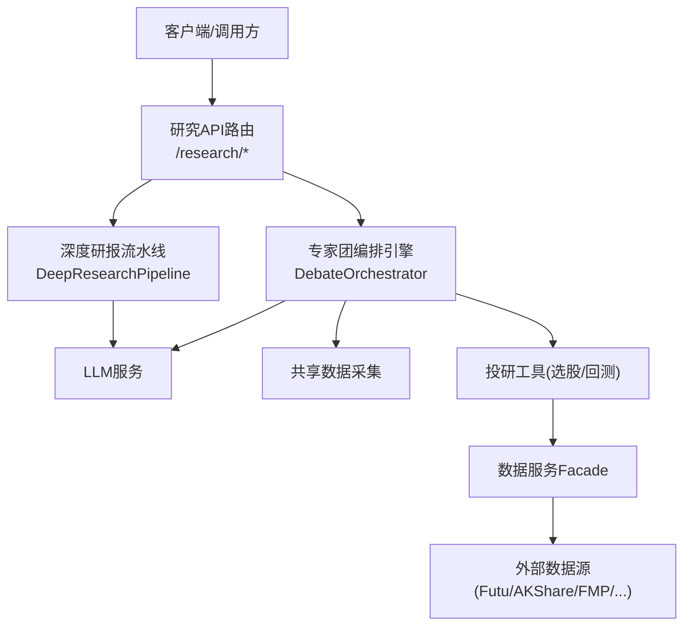
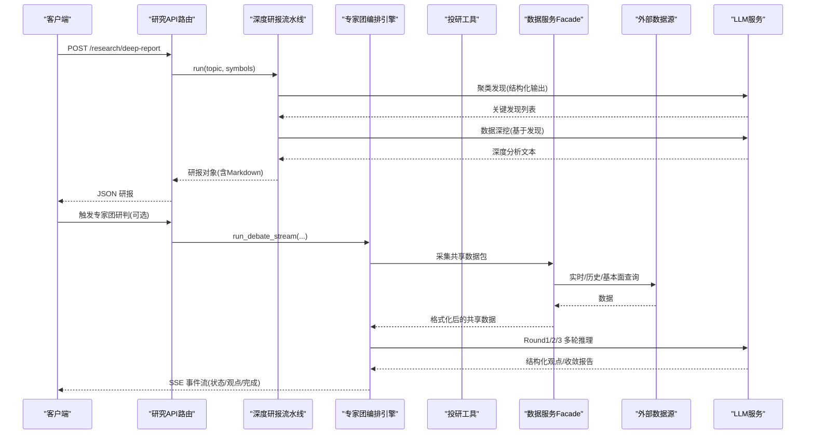
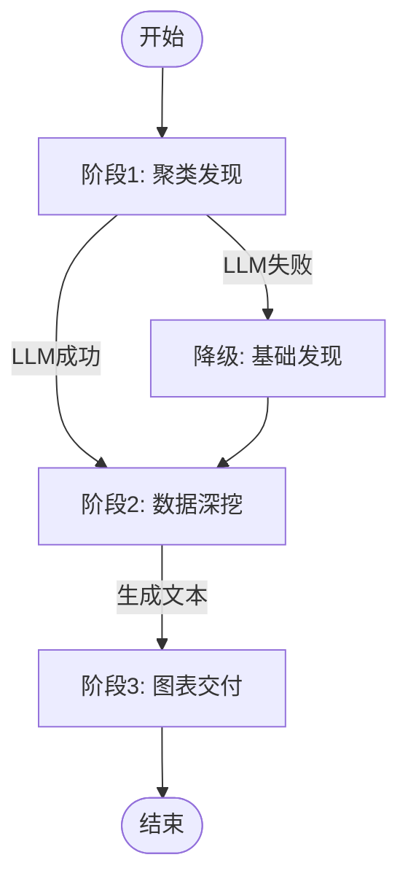
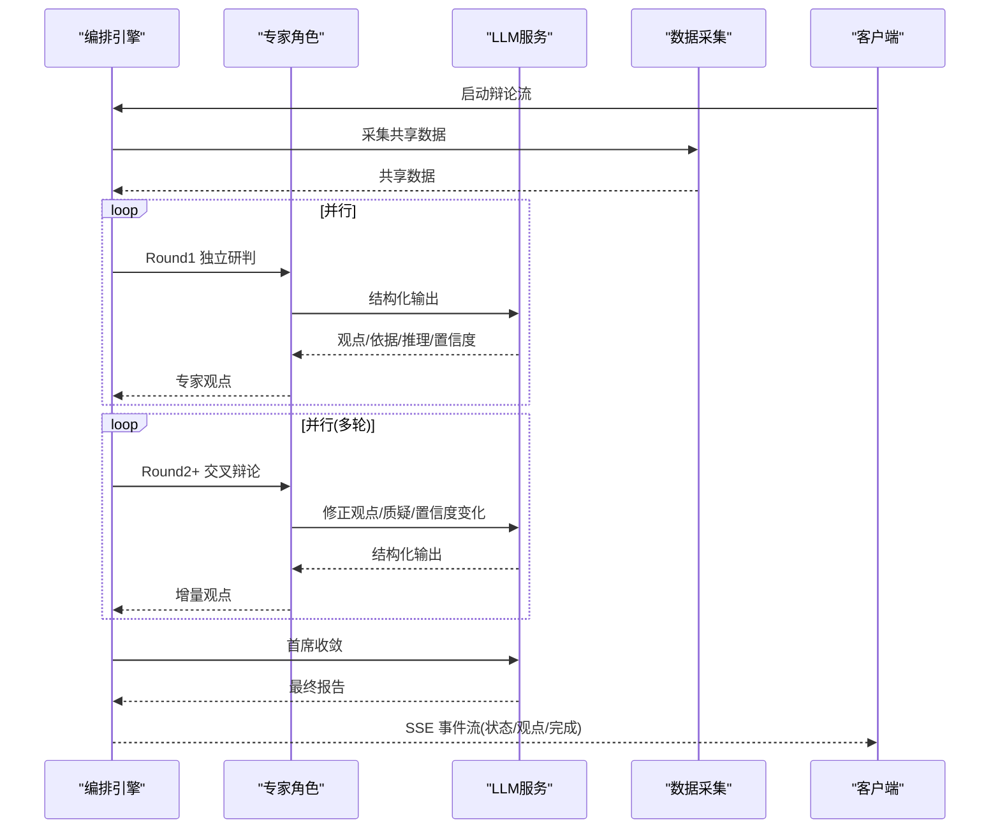
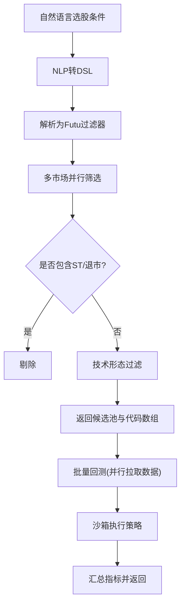
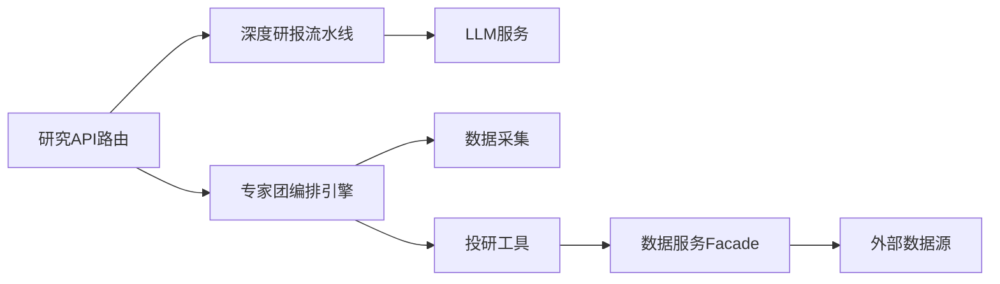

# 研究流程自动化

<cite>
**本文引用的文件**
- [backend/app/research/deep_research.py](file://backend/app/research/deep_research.py)
- [backend/routers/research.py](file://backend/routers/research.py)
- [backend/services/expert_team/orchestrator.py](file://backend/services/expert_team/orchestrator.py)
- [hermes_agent/tools/research_tool.py](file://hermes_agent/tools/research_tool.py)
- [backend/core/config.py](file://backend/core/config.py)
</cite>

## 目录
1. [简介](#简介)
2. [项目结构](#项目结构)
3. [核心组件](#核心组件)
4. [架构总览](#架构总览)
5. [详细组件分析](#详细组件分析)
6. [依赖关系分析](#依赖关系分析)
7. [性能与并发](#性能与并发)
8. [故障排查指南](#故障排查指南)
9. [结论](#结论)
10. [附录：工作流配置与调试](#附录工作流配置与调试)

## 简介
本技术文档面向“研究流程自动化”，围绕深度研究的完整流水线展开，覆盖问题分解、信息收集、分析推理、报告生成等阶段。重点说明各阶段的输入输出规范、质量控制机制、异常处理策略；解释外部数据源集成方式（实时/历史/基本面）；阐述研究任务的编排与执行（并行、依赖、进度跟踪）；给出结果验证与评估方法（准确性、一致性、置信度）；并提供可操作的工作流配置示例与调试方法。

## 项目结构
与研究自动化直接相关的后端能力主要分布在以下位置：
- 深度研报流水线：三段式 Agent（聚类发现、数据深挖、图表交付），通过统一 API 暴露。
- 专家团辩论编排引擎：三轮混合协议（独立研判→交叉辩论→首席收敛），支持 SSE 流式进度。
- 投研工具集：选股器与批量回测工具，作为 AI Agent 的工具能力接入。
- 配置中心：集中管理 LLM、数据源、数据库、Redis 等关键配置。

**图示来源**
- [backend/routers/research.py:1-52](file://backend/routers/research.py#L1-L52)
- [backend/app/research/deep_research.py:199-231](file://backend/app/research/deep_research.py#L199-L231)
- [backend/services/expert_team/orchestrator.py:35-184](file://backend/services/expert_team/orchestrator.py#L35-L184)
- [hermes_agent/tools/research_tool.py:20-70](file://hermes_agent/tools/research_tool.py#L20-L70)
- [hermes_agent/tools/research_tool.py:84-138](file://hermes_agent/tools/research_tool.py#L84-L138)

**章节来源**
- [backend/routers/research.py:1-52](file://backend/routers/research.py#L1-L52)
- [backend/app/research/deep_research.py:199-231](file://backend/app/research/deep_research.py#L199-L231)
- [backend/services/expert_team/orchestrator.py:35-184](file://backend/services/expert_team/orchestrator.py#L35-L184)
- [hermes_agent/tools/research_tool.py:20-70](file://hermes_agent/tools/research_tool.py#L20-L70)
- [hermes_agent/tools/research_tool.py:84-138](file://hermes_agent/tools/research_tool.py#L84-L138)

## 核心组件
- 深度研报流水线：将主题与标的拆解为“聚类发现→数据深挖→图表交付”的三段式流程，产出结构化研报与 Markdown 内容。
- 专家团编排引擎：以“独立研判→交叉辩论→首席收敛”的三轮协议组织多角色智能体，输出共识/分歧、概率评估与最终建议。
- 投研工具：自然语言选股与批量回测，打通从“条件筛选→数据获取→策略回测→指标汇总”的研究闭环。
- 配置与运行环境：集中管理 LLM、嵌入模型、数据源密钥、数据库与缓存等运行时参数，保障启动即校验。

**章节来源**
- [backend/app/research/deep_research.py:19-197](file://backend/app/research/deep_research.py#L19-L197)
- [backend/services/expert_team/orchestrator.py:35-184](file://backend/services/expert_team/orchestrator.py#L35-L184)
- [hermes_agent/tools/research_tool.py:20-138](file://hermes_agent/tools/research_tool.py#L20-L138)
- [backend/core/config.py:20-134](file://backend/core/config.py#L20-L134)

## 架构总览
研究流程自动化的整体架构由“API 路由 → 流水线/编排器 → 数据与工具 → LLM”构成。API 层负责请求校验与响应封装；流水线与编排器负责任务拆分、并行调度与进度上报；数据与工具层提供选股、回测、行情与基本面数据；LLM 层提供文本生成与结构化解析能力。

**图示来源**
- [backend/routers/research.py:25-52](file://backend/routers/research.py#L25-L52)
- [backend/app/research/deep_research.py:199-231](file://backend/app/research/deep_research.py#L199-L231)
- [backend/services/expert_team/orchestrator.py:43-184](file://backend/services/expert_team/orchestrator.py#L43-L184)
- [hermes_agent/tools/research_tool.py:32-70](file://hermes_agent/tools/research_tool.py#L32-L70)
- [hermes_agent/tools/research_tool.py:94-138](file://hermes_agent/tools/research_tool.py#L94-L138)

## 详细组件分析

### 深度研报流水线（三段式）
- 阶段一：聚类发现
  - 输入：主题、监控标的列表
  - 处理：构建提示词，调用 LLM 进行主题聚类与信号识别，返回结构化发现（主题、摘要、相关性）
  - 输出：研究发现列表
  - 质量与异常：LLM 失败时降级返回基础发现并记录日志
- 阶段二：数据深挖
  - 输入：主题 + 阶段一发现
  - 处理：构造深入分析提示词，调用 LLM 输出驱动因素、历史对比、风险评估与建议
  - 输出：深度分析文本
  - 质量与异常：记录成功/失败计数，异常时返回占位文本
- 阶段三：图表交付
  - 输入：主题、标的、发现、深度分析
  - 处理：组装 Markdown 研报与图表配置（可扩展）
  - 输出：研究报告对象（含 Markdown）

**图示来源**
- [backend/app/research/deep_research.py:43-104](file://backend/app/research/deep_research.py#L43-L104)
- [backend/app/research/deep_research.py:107-151](file://backend/app/research/deep_research.py#L107-L151)
- [backend/app/research/deep_research.py:153-197](file://backend/app/research/deep_research.py#L153-L197)

**章节来源**
- [backend/app/research/deep_research.py:19-197](file://backend/app/research/deep_research.py#L19-L197)

### 专家团辩论编排引擎（三轮混合协议）
- 阶段0：初始化专家团
  - 根据场景模板或自定义专家阵容实例化专家角色
  - 输出：专家信息与轮数
- 阶段1：采集共享数据
  - 依据场景的数据需求，聚合实时/历史/基本面数据，格式化为提示上下文
  - 输出：共享数据包键值集合
- 阶段2：Round 1 独立研判（并行）
  - 每个专家基于共享数据独立输出观点、依据、推理与置信度
  - 超时控制：整轮与单专家均设超时
  - 异常：单个专家失败不影响其他专家，结果中保留失败标记
- 阶段3：Round 2..N 交叉辩论（并行）
  - 专家审视自身与其他人的观点，修正立场、提出质疑、更新置信度
  - 输出：每轮观点增量流式推送
- 阶段4：首席收敛
  - 综合所有轮次观点，输出共识/分歧、最强看多/看空论据、概率评估与最终建议
  - 输出：完整 Markdown 报告

**图示来源**
- [backend/services/expert_team/orchestrator.py:43-184](file://backend/services/expert_team/orchestrator.py#L43-L184)
- [backend/services/expert_team/orchestrator.py:254-336](file://backend/services/expert_team/orchestrator.py#L254-L336)
- [backend/services/expert_team/orchestrator.py:339-456](file://backend/services/expert_team/orchestrator.py#L339-L456)
- [backend/services/expert_team/orchestrator.py:460-525](file://backend/services/expert_team/orchestrator.py#L460-L525)

**章节来源**
- [backend/services/expert_team/orchestrator.py:35-184](file://backend/services/expert_team/orchestrator.py#L35-L184)
- [backend/services/expert_team/orchestrator.py:254-336](file://backend/services/expert_team/orchestrator.py#L254-L336)
- [backend/services/expert_team/orchestrator.py:339-456](file://backend/services/expert_team/orchestrator.py#L339-L456)
- [backend/services/expert_team/orchestrator.py:460-525](file://backend/services/expert_team/orchestrator.py#L460-L525)

### 投研工具（选股与批量回测）
- 选股工具
  - 输入：自然语言选股条件、返回数量上限
  - 处理：NLP→DSL→Futu过滤器→多市场并行筛选→技术形态过滤→ST/退市排除
  - 输出：候选股票池与代码数组（供后续回测）
- 批量回测工具
  - 输入：股票代码列表、策略名称、时间跨度
  - 处理：读取策略源码→提取类名→并行拉取历史数据→沙箱回测→汇总指标
  - 输出：组合收益率、夏普比率、最大回撤、胜率、交易次数等

**图示来源**
- [hermes_agent/tools/research_tool.py:20-70](file://hermes_agent/tools/research_tool.py#L20-L70)
- [hermes_agent/tools/research_tool.py:84-138](file://hermes_agent/tools/research_tool.py#L84-L138)

**章节来源**
- [hermes_agent/tools/research_tool.py:20-70](file://hermes_agent/tools/research_tool.py#L20-L70)
- [hermes_agent/tools/research_tool.py:84-138](file://hermes_agent/tools/research_tool.py#L84-L138)

### API 路由与元数据
- 元数据接口：返回工具数量与当前 LLM 模型名称，避免前端写死。
- 深度研报接口：接收主题与标的，调用流水线生成研报并返回结构化结果。

**章节来源**
- [backend/routers/research.py:25-52](file://backend/routers/research.py#L25-L52)

## 依赖关系分析
- 模块耦合
  - 研究API路由依赖深度研报流水线与配置中心。
  - 深度研报流水线依赖 LLM 服务与内部数据结构。
  - 专家团编排引擎依赖数据采集、专家注册表、LLM 服务与工具注册表。
  - 投研工具依赖数据服务 Facade 与回测沙箱。
- 外部依赖
  - 数据源：Futu、AKShare、FMP、YFinance、DBNomics、RBI 等（通过数据服务与子服务 Worker 集成）。
  - LLM：多模型路由与降级策略（轻量/标准/旗舰）。
- 潜在循环依赖
  - 当前结构通过分层与接口隔离，未见明显循环导入；建议在新增工具时保持“工具→数据服务→外部源”的单向依赖。

**图示来源**
- [backend/routers/research.py:1-52](file://backend/routers/research.py#L1-L52)
- [backend/app/research/deep_research.py:199-231](file://backend/app/research/deep_research.py#L199-L231)
- [backend/services/expert_team/orchestrator.py:35-184](file://backend/services/expert_team/orchestrator.py#L35-L184)
- [hermes_agent/tools/research_tool.py:20-138](file://hermes_agent/tools/research_tool.py#L20-L138)

**章节来源**
- [backend/routers/research.py:1-52](file://backend/routers/research.py#L1-L52)
- [backend/app/research/deep_research.py:199-231](file://backend/app/research/deep_research.py#L199-L231)
- [backend/services/expert_team/orchestrator.py:35-184](file://backend/services/expert_team/orchestrator.py#L35-L184)
- [hermes_agent/tools/research_tool.py:20-138](file://hermes_agent/tools/research_tool.py#L20-L138)

## 性能与并发
- 并行处理
  - 专家团 Round 1/2 使用 asyncio.gather 并行调度专家，提升吞吐。
  - 选股工具对多市场并行筛选，缩短端到端延迟。
  - 批量回测并行拉取历史数据，减少 I/O 等待。
- 超时与限流
  - 单专家与整轮均设置超时，防止长尾阻塞。
  - LLM 调用具备多模型路由与降级阈值，保障可用性。
- 内存与序列化
  - 结构化输出采用 Pydantic 模型，便于校验与压缩传输。
  - 流式推进通过分片文本与增量 content 降低前端渲染压力。

[本节为通用性能讨论，不直接分析具体文件]

## 故障排查指南
- LLM 调用失败
  - 现象：聚类发现或深挖阶段返回降级内容或错误消息。
  - 排查：检查 LLM 配置（API Key、Base URL、模型名）、网络连通性与速率限制；查看日志中的失败计数与降级路径。
  - 参考实现：异常捕获与降级逻辑、成功/失败记录。
- 专家团超时或异常
  - 现象：某轮或某专家无输出或返回失败标记。
  - 排查：确认数据采集是否成功、专家系统提示词是否合理、LLM 响应是否超时；关注整轮与单专家超时配置。
- 选股/回测失败
  - 现象：无法筛选出股票或回测终止。
  - 排查：检查 DSL 转换、过滤器有效性、数据源可用性与历史数据完整性；确认策略文件存在且继承正确基类。
- 配置缺失
  - 现象：服务启动失败或功能不可用。
  - 排查：核对 DATABASE_URL、EMBEDDING_API_KEY、LLM_* 等必填项；确保实盘交易开关与 Futu 解锁密码匹配。

**章节来源**
- [backend/app/research/deep_research.py:72-104](file://backend/app/research/deep_research.py#L72-L104)
- [backend/app/research/deep_research.py:135-151](file://backend/app/research/deep_research.py#L135-L151)
- [backend/services/expert_team/orchestrator.py:254-336](file://backend/services/expert_team/orchestrator.py#L254-L336)
- [backend/services/expert_team/orchestrator.py:339-456](file://backend/services/expert_team/orchestrator.py#L339-L456)
- [hermes_agent/tools/research_tool.py:32-70](file://hermes_agent/tools/research_tool.py#L32-L70)
- [hermes_agent/tools/research_tool.py:94-138](file://hermes_agent/tools/research_tool.py#L94-L138)
- [backend/core/config.py:94-134](file://backend/core/config.py#L94-L134)

## 结论
本研究流程自动化方案通过“三段式研报流水线”与“三轮专家团编排引擎”实现了从问题分解到报告生成的全链路自动化。借助并行调度、超时保护、结构化输出与流式推进，系统在稳定性与用户体验方面具备良好表现。结合选股与批量回测工具，形成“数据→分析→验证→报告”的闭环，满足投研场景的多维度需求。

[本节为总结性内容，不直接分析具体文件]

## 附录：工作流配置与调试

### 工作流配置要点
- LLM 配置
  - 环境变量：LLM_API_KEY、LLM_BASE_URL、LLM_MODEL、LLM_PRO_MODEL、LLM_LIGHTWEIGHT_MODEL、LLM_FALLBACK_ENABLED、LLM_FALLBACK_THRESHOLD。
  - 作用：选择模型、启用降级与阈值控制，保障鲁棒性。
- 数据源与嵌入
  - 环境变量：EMBEDDING_API_KEY、EMBEDDING_BASE_URL、EMBEDDING_MODEL、EMBEDDING_DIM；FINNHUB_API_KEY、AKSHARE_API_KEY、FRED_API_KEY。
  - 作用：向量检索、新闻与宏观数据接入。
- 数据库与缓存
  - 环境变量：DATABASE_URL、REDIS_HOST、REDIS_PORT、REDIS_PASSWORD。
  - 作用：持久化会话、缓存热点数据。
- 交易与风控
  - 环境变量：REAL_TRADE_EXECUTE、FUTU_PWD_UNLOCK。
  - 作用：控制实盘开关与安全解锁。

**章节来源**
- [backend/core/config.py:20-134](file://backend/core/config.py#L20-L134)

### 调试方法与工具
- 使用元数据接口
  - 调用 GET /research/meta 获取工具数量与当前模型名，用于前端动态适配。
- 观察 SSE 事件流
  - 在专家团研判过程中，订阅 status、expert_opinion、round_complete、chief_report、done、error 等事件，定位瓶颈与异常。
- 日志与指标
  - 关注 LLM 成功/失败记录、超时告警、数据采集项数量、异常堆栈。
- 单元测试与回归
  - 针对选股与回测工具编写用例，覆盖边界条件（空结果、数据缺失、策略不存在）。

**章节来源**
- [backend/routers/research.py:25-52](file://backend/routers/research.py#L25-L52)
- [backend/services/expert_team/orchestrator.py:43-184](file://backend/services/expert_team/orchestrator.py#L43-L184)
- [hermes_agent/tools/research_tool.py:20-138](file://hermes_agent/tools/research_tool.py#L20-L138)