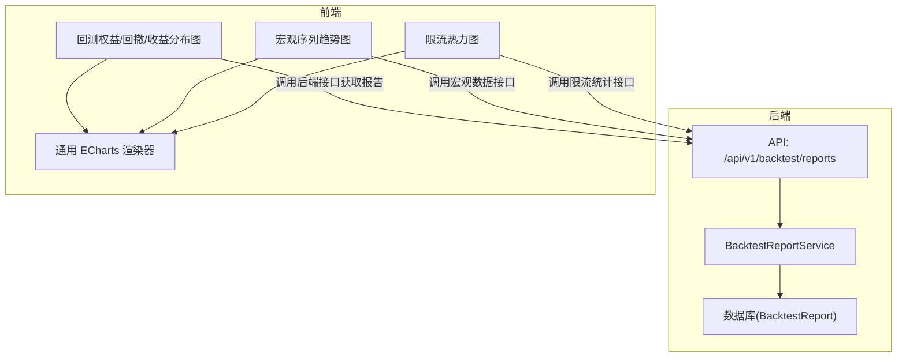
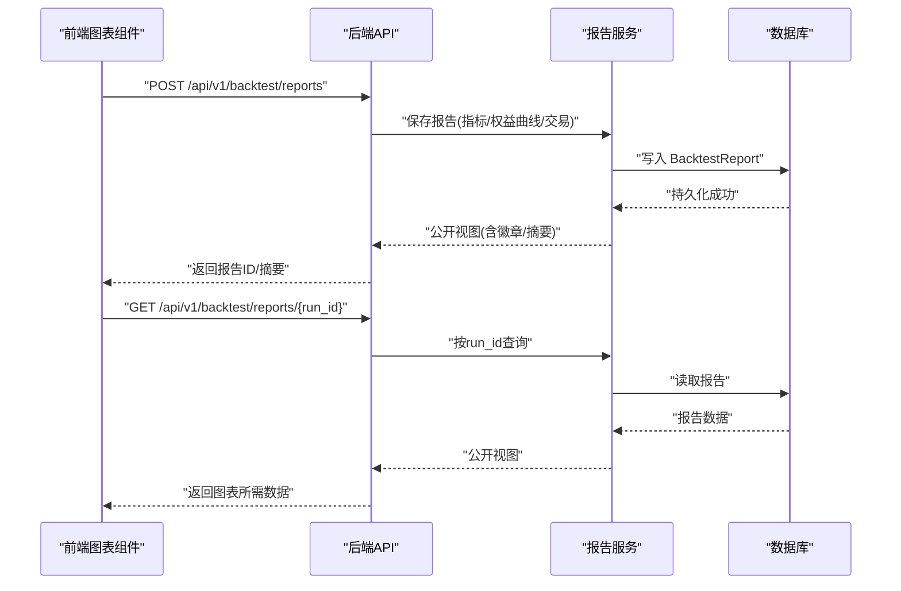
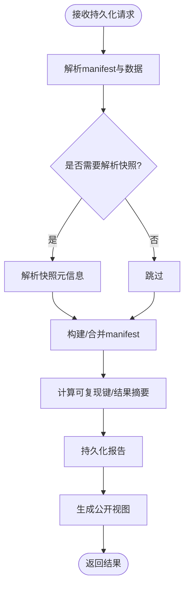
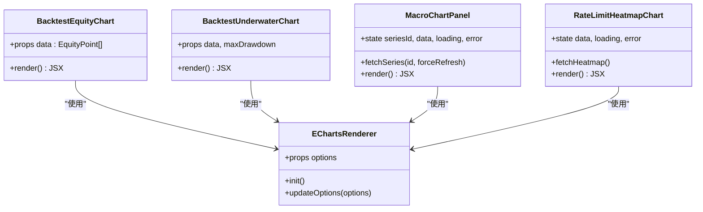
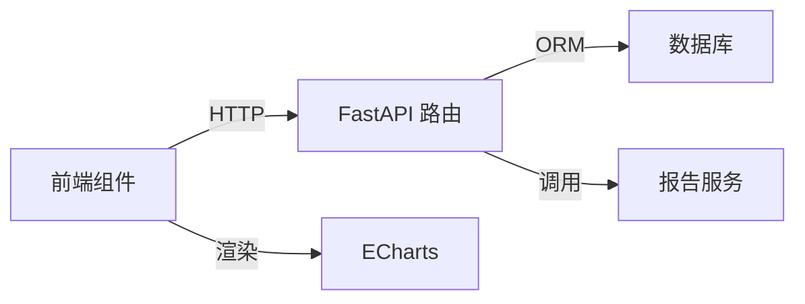

# 结果可视化与呈现

<cite>
**本文引用的文件**
- [backtest-charts.tsx](file://frontend/src/features/trading/backtest-charts.tsx)
- [echarts-renderer.tsx](file://frontend/src/features/copilot/echarts-renderer.tsx)
- [macro-chart.tsx](file://frontend/src/features/data-center/macro-chart.tsx)
- [rate-limit-heatmap-chart.tsx](file://frontend/src/features/data-center/rate-limit-heatmap-chart.tsx)
- [report_service.py](file://backend/app/backtest/report_service.py)
- [backtest_reports.py](file://backend/routers/backtest_reports.py)
</cite>

## 目录
1. [简介](#简介)
2. [项目结构](#项目结构)
3. [核心组件](#核心组件)
4. [架构总览](#架构总览)
5. [详细组件分析](#详细组件分析)
6. [依赖关系分析](#依赖关系分析)
7. [性能考量](#性能考量)
8. [故障排查指南](#故障排查指南)
9. [结论](#结论)
10. [附录](#附录)

## 简介
本技术文档聚焦于“研究结果可视化与呈现”的端到端实现：从后端回测报告的持久化与标准化输出，到前端基于 ECharts 的趋势图、对比图、热力图等可视化渲染；涵盖 Markdown 报告生成入口（通过 API 返回结构化数据）、ECharts 配置策略、前后端数据契约、主题切换与响应式布局、以及模板定制要点。目标是帮助开发者快速理解并扩展可视化能力，确保图表数据一致性与可维护性。

## 项目结构
围绕可视化与呈现的关键路径如下：
- 后端：回测报告持久化服务与 API，提供指标、权益曲线、交易明细等结构化数据，用于前端渲染与报告导出。
- 前端：统一的 ECharts 渲染封装与多种业务图表组件，支持暗黑主题、响应式尺寸、交互提示与自定义标记。

**图示来源**
- [backtest_reports.py:82-149](file://backend/routers/backtest_reports.py#L82-L149)
- [report_service.py:58-166](file://backend/app/backtest/report_service.py#L58-L166)
- [backtest-charts.tsx:17-188](file://frontend/src/features/trading/backtest-charts.tsx#L17-L188)
- [macro-chart.tsx:20-195](file://frontend/src/features/data-center/macro-chart.tsx#L20-L195)
- [rate-limit-heatmap-chart.tsx:26-218](file://frontend/src/features/data-center/rate-limit-heatmap-chart.tsx#L26-L218)

**章节来源**
- [backtest_reports.py:82-149](file://backend/routers/backtest_reports.py#L82-L149)
- [report_service.py:58-166](file://backend/app/backtest/report_service.py#L58-L166)
- [backtest-charts.tsx:17-188](file://frontend/src/features/trading/backtest-charts.tsx#L17-L188)
- [macro-chart.tsx:20-195](file://frontend/src/features/data-center/macro-chart.tsx#L20-L195)
- [rate-limit-heatmap-chart.tsx:26-218](file://frontend/src/features/data-center/rate-limit-heatmap-chart.tsx#L26-L218)

## 核心组件
- 回测报告服务：负责计算可复现指纹、结果摘要哈希、持久化报告元数据与指标，并提供公开视图字段，便于前端消费。
- 回测报告 API：暴露持久化、查询、列表接口，支持按 run_id、可复现键、代码哈希检索，并在需要时解析快照元信息。
- 前端图表组件：
  - 回测权益曲线、回撤图、收益分布直方图：展示策略表现、基准对比、交易标记与回撤带。
  - 宏观趋势图：自由查询 FRED 序列，展示时间序列走势与滞后提示。
  - 限流热力图：按数据源与日期聚合限流率，辅助诊断数据源健康度。
- 通用 ECharts 渲染器：为流式或动态场景提供轻量级 ECharts 实例管理与选项更新。

**章节来源**
- [report_service.py:20-166](file://backend/app/backtest/report_service.py#L20-L166)
- [backtest_reports.py:28-149](file://backend/routers/backtest_reports.py#L28-L149)
- [backtest-charts.tsx:17-188](file://frontend/src/features/trading/backtest-charts.tsx#L17-L188)
- [macro-chart.tsx:20-195](file://frontend/src/features/data-center/macro-chart.tsx#L20-L195)
- [rate-limit-heatmap-chart.tsx:26-218](file://frontend/src/features/data-center/rate-limit-heatmap-chart.tsx#L26-L218)
- [echarts-renderer.tsx:10-38](file://frontend/src/features/copilot/echarts-renderer.tsx#L10-L38)

## 架构总览
下图展示了从前端请求到后端处理、再到图表渲染的完整链路，包括报告持久化、查询与图表数据组装。

**图示来源**
- [backtest_reports.py:82-149](file://backend/routers/backtest_reports.py#L82-L149)
- [report_service.py:64-166](file://backend/app/backtest/report_service.py#L64-L166)

## 详细组件分析

### 回测报告服务与API
- 可复现性保障：通过代码哈希、清单哈希、参数与随机种子计算唯一键，确保同输入同输出；对 live/unbound 模式禁用可复现标记。
- 结果摘要：对指标与权益曲线进行规范化后计算摘要哈希，便于一致性校验。
- 公开视图：对外暴露精简字段，包含运行元数据、指标、权益曲线、交易明细、徽章与创建时间。
- API 能力：
  - 持久化报告：支持可选快照解析，统一数据模式。
  - 查询报告：按 run_id 精确获取。
  - 列表查询：支持按可复现键或代码哈希筛选，限制返回条数。

**图示来源**
- [backtest_reports.py:82-149](file://backend/routers/backtest_reports.py#L82-L149)
- [report_service.py:20-166](file://backend/app/backtest/report_service.py#L20-L166)

**章节来源**
- [report_service.py:20-166](file://backend/app/backtest/report_service.py#L20-L166)
- [backtest_reports.py:28-149](file://backend/routers/backtest_reports.py#L28-L149)

### 前端图表组件：趋势图、对比图、热力图
- 回测权益曲线与回撤图：
  - 支持策略与基准双系列对比，显示回撤带区域与交易标记点。
  - 根据主题自动调整颜色与提示框样式，保持可读性。
  - 空态友好提示：无真实收益序列时不绘制假分布。
- 宏观趋势图：
  - 自由查询 FRED 序列，展示时间序列走势，标注最新观测日期与滞后提示。
  - 错误友好映射：将底层异常转换为易懂的用户提示。
- 限流热力图：
  - 以数据源为行、日期为列，展示限流率，支持交互式 tooltip 与视觉映射。
  - 提供刷新按钮与统计面板，便于运维监控。

**图示来源**
- [backtest-charts.tsx:17-188](file://frontend/src/features/trading/backtest-charts.tsx#L17-L188)
- [macro-chart.tsx:20-195](file://frontend/src/features/data-center/macro-chart.tsx#L20-L195)
- [rate-limit-heatmap-chart.tsx:26-218](file://frontend/src/features/data-center/rate-limit-heatmap-chart.tsx#L26-L218)
- [echarts-renderer.tsx:10-38](file://frontend/src/features/copilot/echarts-renderer.tsx#L10-L38)

**章节来源**
- [backtest-charts.tsx:17-188](file://frontend/src/features/trading/backtest-charts.tsx#L17-L188)
- [macro-chart.tsx:20-195](file://frontend/src/features/data-center/macro-chart.tsx#L20-L195)
- [rate-limit-heatmap-chart.tsx:26-218](file://frontend/src/features/data-center/rate-limit-heatmap-chart.tsx#L26-L218)
- [echarts-renderer.tsx:10-38](file://frontend/src/features/copilot/echarts-renderer.tsx#L10-L38)

### Markdown 报告生成机制
- 生成入口：通过后端 API 返回的结构化数据（指标、权益曲线、交易明细）作为报告内容的数据源。
- 数据契约：公开视图字段稳定且精简，便于模板引擎直接绑定。
- 模板定制：可在前端或后端模板中引用这些字段，组合成 Markdown 段落、表格与图表嵌入指令。
- 建议流程：
  - 调用报告 API 获取 run_id 对应的公开视图。
  - 将指标与关键图表数据注入 Markdown 模板。
  - 在报告中嵌入 ECharts 配置或图片链接，保证跨平台展示一致性。

**章节来源**
- [backtest_reports.py:82-149](file://backend/routers/backtest_reports.py#L82-L149)
- [report_service.py:142-166](file://backend/app/backtest/report_service.py#L142-L166)

### 图表数据的标准化格式与转换规则
- 权益曲线：数组元素包含时间戳/日期与策略、基准值，必要时附加回撤区间与交易动作。
- 回撤图：数组元素包含时间与回撤百分比，支持最大回撤标记线。
- 收益分布：直方图分箱数据，若无真实序列则显示空态。
- 宏观序列：按日期升序排列的时间序列，附带最新观测日期与滞后天数提示。
- 限流热力图：二维网格数据（数据源×日期），值为限流率，tooltip 展示次数与总量。

**章节来源**
- [backtest-charts.tsx:17-188](file://frontend/src/features/trading/backtest-charts.tsx#L17-L188)
- [macro-chart.tsx:31-66](file://frontend/src/features/data-center/macro-chart.tsx#L31-L66)
- [rate-limit-heatmap-chart.tsx:56-153](file://frontend/src/features/data-center/rate-limit-heatmap-chart.tsx#L56-L153)

### 前端渲染组件：交互、响应式与主题
- 交互能力：
  - 工具提示：轴触发、格式化数值、显示额外上下文（如交易动作、回撤）。
  - 标记点/线：交易标记、最大回撤线，增强可读性。
  - 刷新与搜索：宏观图支持强制刷新与快捷标签；热力图支持手动刷新。
- 响应式布局：
  - 容器自适应宽度高度，窗口缩放时重绘图表。
  - 网格与坐标轴标签适配小屏设备。
- 主题切换：
  - 基于 next-themes 的暗黑模式，统一文本、分割线与背景色。
  - ECharts 暗黑主题常量复用，保证视觉一致性。

**章节来源**
- [backtest-charts.tsx:17-188](file://frontend/src/features/trading/backtest-charts.tsx#L17-L188)
- [macro-chart.tsx:20-195](file://frontend/src/features/data-center/macro-chart.tsx#L20-L195)
- [rate-limit-heatmap-chart.tsx:26-218](file://frontend/src/features/data-center/rate-limit-heatmap-chart.tsx#L26-L218)
- [echarts-renderer.tsx:10-38](file://frontend/src/features/copilot/echarts-renderer.tsx#L10-L38)

### 报告模板定制机制
- 样式配置：通过主题变量与 CSS 类名控制卡片、边框与背景透明度，保持品牌一致性。
- 内容结构：Markdown 模板可按模块组织（概览、指标、图表、结论），每个模块绑定对应数据字段。
- 品牌标识：在头部或页脚加入 Logo、版本号与合规声明，增强专业感。
- 扩展建议：
  - 将 ECharts 配置抽离为独立 JSON，便于版本管理与 A/B 测试。
  - 增加多语言文案与本地化开关，提升国际化体验。

[本节为概念性说明，不直接分析具体文件]

## 依赖关系分析
- 后端依赖：
  - FastAPI 路由与 Pydantic 模型定义请求/响应结构。
  - SQLAlchemy ORM 操作数据库表（BacktestReport、DataSnapshot）。
  - 服务层封装可复现键与摘要计算逻辑。
- 前端依赖：
  - ECharts 图表库与 useEChart Hook 管理实例生命周期。
  - next-themes 提供主题上下文。
  - 组件内状态管理（useState/useEffect）控制加载、错误与数据更新。

**图示来源**
- [backtest_reports.py:82-149](file://backend/routers/backtest_reports.py#L82-L149)
- [report_service.py:58-166](file://backend/app/backtest/report_service.py#L58-L166)
- [backtest-charts.tsx:17-188](file://frontend/src/features/trading/backtest-charts.tsx#L17-L188)
- [macro-chart.tsx:20-195](file://frontend/src/features/data-center/macro-chart.tsx#L20-L195)
- [rate-limit-heatmap-chart.tsx:26-218](file://frontend/src/features/data-center/rate-limit-heatmap-chart.tsx#L26-L218)

**章节来源**
- [backtest_reports.py:82-149](file://backend/routers/backtest_reports.py#L82-L149)
- [report_service.py:58-166](file://backend/app/backtest/report_service.py#L58-L166)
- [backtest-charts.tsx:17-188](file://frontend/src/features/trading/backtest-charts.tsx#L17-L188)
- [macro-chart.tsx:20-195](file://frontend/src/features/data-center/macro-chart.tsx#L20-L195)
- [rate-limit-heatmap-chart.tsx:26-218](file://frontend/src/features/data-center/rate-limit-heatmap-chart.tsx#L26-L218)

## 性能考量
- 后端：
  - 列表查询限制返回条数，避免大结果集拖慢响应。
  - 快照解析失败时快速报错，减少无效计算。
  - 结果摘要仅对必要字段计算，降低开销。
- 前端：
  - 按需初始化 ECharts 实例，销毁时释放资源。
  - 窗口 resize 事件去抖与增量更新选项，避免频繁重绘。
  - 空态与错误态提前渲染，提升感知性能。

[本节提供通用指导，不直接分析具体文件]

## 故障排查指南
- 报告不存在：当按 run_id 查询未找到记录时，返回 404。检查传入 ID 是否正确，或确认是否已持久化报告。
- 快照解析失败：若 resolve_snapshot 为真但快照不存在或不可用，抛出 400。核对 snapshot_id 与数据源状态。
- 数据源不可用：宏观图可能返回友好错误提示（如远程节点未连接、序列不存在）。检查网络与 FRED 服务状态。
- 限流数据为空：热力图可能暂无数据，点击刷新重试；关注后端限流统计任务是否正常执行。

**章节来源**
- [backtest_reports.py:124-149](file://backend/routers/backtest_reports.py#L124-L149)
- [macro-chart.tsx:31-66](file://frontend/src/features/data-center/macro-chart.tsx#L31-L66)
- [rate-limit-heatmap-chart.tsx:33-54](file://frontend/src/features/data-center/rate-limit-heatmap-chart.tsx#L33-L54)

## 结论
本系统通过后端报告服务与 API 提供稳定、可复现的结构化数据，前端基于 ECharts 实现丰富的可视化能力，覆盖趋势、对比与热力等多种图表类型。通过统一的主题与响应式设计，确保在不同设备上的一致体验。结合 Markdown 模板与数据契约，可实现自动化报告生成与个性化定制，满足研究与运营的多场景需求。

[本节为总结性内容，不直接分析具体文件]

## 附录
- API 调用示例（文字描述）：
  - 持久化报告：POST /api/v1/backtest/reports，提交 manifest、metrics、equity_curve、trades 等字段。
  - 查询报告：GET /api/v1/backtest/reports/{run_id}，获取公开视图。
  - 列表查询：GET /api/v1/backtest/reports?reproducibility_key=&code_hash=&limit=20，筛选并分页。
- 前端集成要点：
  - 使用 useEChart Hook 管理图表实例与选项更新。
  - 根据主题动态设置颜色与提示框样式。
  - 对空态与错误态进行友好提示，避免误导用户。

[本节为补充说明，不直接分析具体文件]