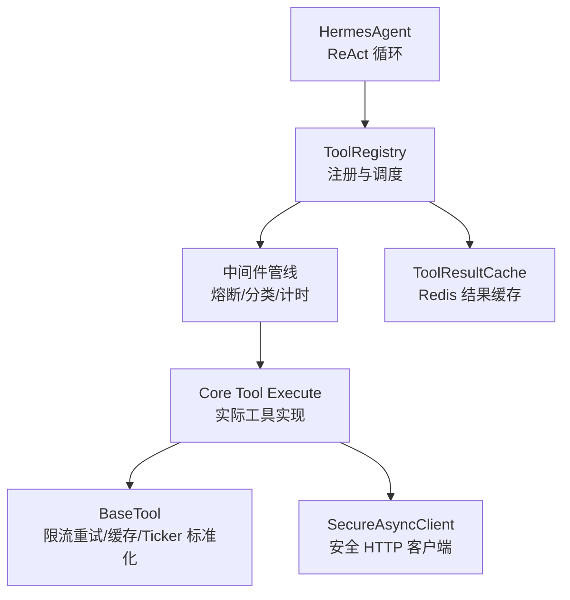
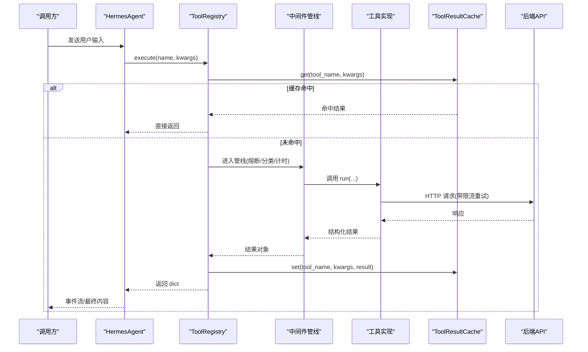
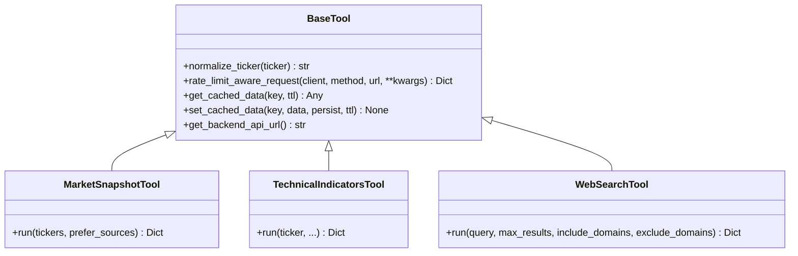
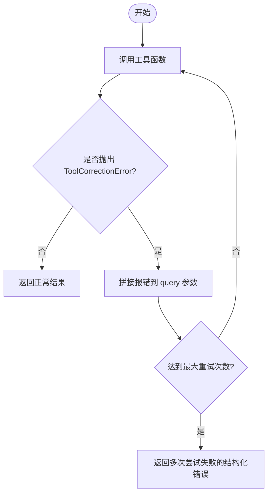
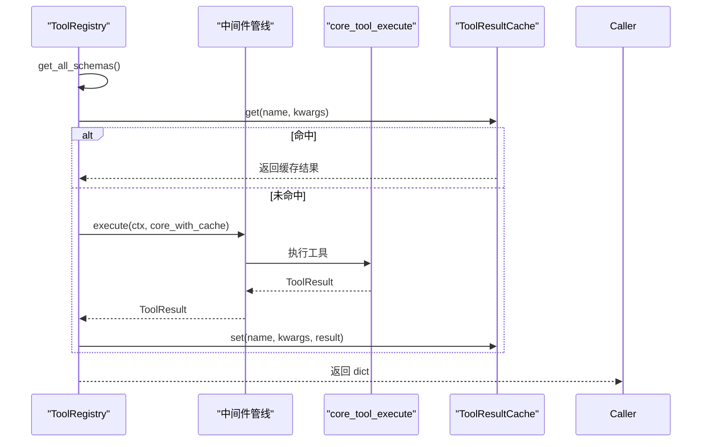
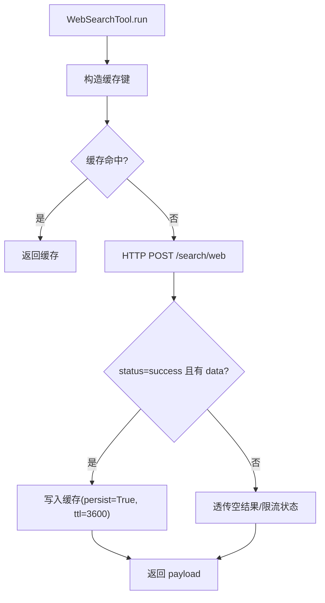
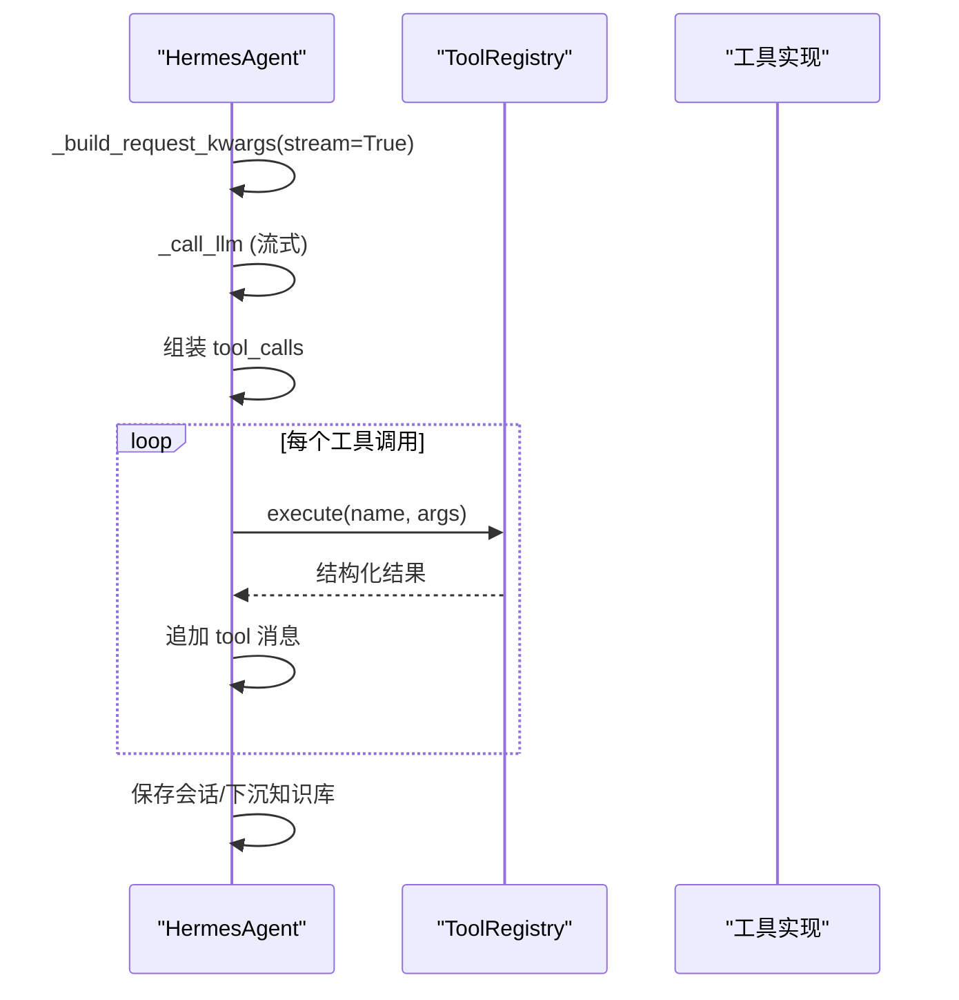
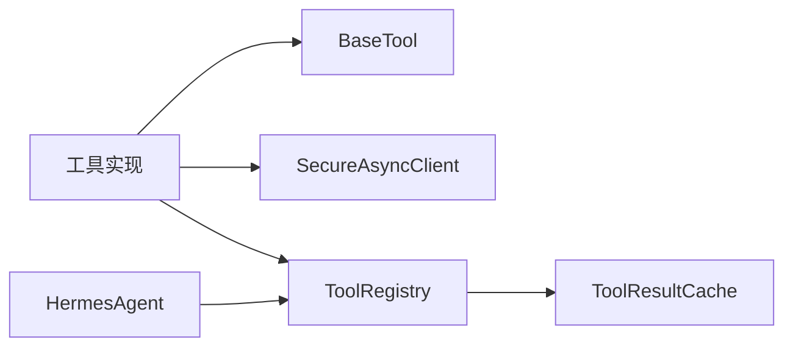

# 自定义工具开发

<cite>
**本文引用的文件**
- [base.py](file://hermes_agent/tools/base.py)
- [decorators.py](file://hermes_agent/tools/decorators.py)
- [tool_registry.py](file://hermes_agent/tool_registry.py)
- [agent.py](file://hermes_agent/agent.py)
- [market_snapshot_tool.py](file://hermes_agent/tools/market_snapshot_tool.py)
- [technical_indicators_tool.py](file://hermes_agent/tools/technical_indicators_tool.py)
- [web_search_tool.py](file://hermes_agent/tools/web_search_tool.py)
- [tool_result_cache.py](file://hermes_agent/tool_result_cache.py)
- [test_tools.py](file://backend/tests/test_tools.py)
- [test_web_search_tool.py](file://hermes_agent/tools/tests/test_web_search_tool.py)
</cite>

## 目录
1. [简介](#简介)
2. [项目结构](#项目结构)
3. [核心组件](#核心组件)
4. [架构总览](#架构总览)
5. [详细组件分析](#详细组件分析)
6. [依赖关系分析](#依赖关系分析)
7. [性能考量](#性能考量)
8. [故障排查指南](#故障排查指南)
9. [结论](#结论)
10. [附录](#附录)

## 简介
本指南面向在量化智能体系统中开发“自定义工具”的工程师，围绕工具基类设计、继承体系、装饰器使用、执行管线、缓存与重试、测试与发布规范进行系统化说明。目标是帮助开发者快速构建稳定、可观测、易维护的工具，并覆盖从需求到上线的全流程。

## 项目结构
系统采用“Agent 驱动 + 工具注册表 + 中间件管线 + 统一缓存”的分层架构：
- Agent 负责对话与 ReAct 循环，调用工具注册表执行具体工具。
- 工具通过装饰器自动注册，提供统一的元数据（name/description/parameters）和 run 方法。
- 工具执行走中间件管线（熔断、结果分类、计时），并受统一结果缓存保护。
- 基础能力（限流感知重试、双级缓存、Ticker 标准化）由 BaseTool 封装。

**图示来源**
- [agent.py:187-510](file://hermes_agent/agent.py#L187-L510)
- [tool_registry.py:63-169](file://hermes_agent/tool_registry.py#L63-L169)
- [tool_result_cache.py:107-195](file://hermes_agent/tool_result_cache.py#L107-L195)
- [base.py:21-282](file://hermes_agent/tools/base.py#L21-L282)

**章节来源**
- [agent.py:187-510](file://hermes_agent/agent.py#L187-L510)
- [tool_registry.py:63-169](file://hermes_agent/tool_registry.py#L63-L169)
- [tool_result_cache.py:107-195](file://hermes_agent/tool_result_cache.py#L107-L195)
- [base.py:21-282](file://hermes_agent/tools/base.py#L21-L282)

## 核心组件
- BaseTool：提供限流感知重试、双级缓存（进程内存 L1 + Redis L2）、Ticker 标准化等通用能力。
- ToolRegistry：工具注册、Schema 导出、中间件管线编排、统一执行入口。
- ToolResultCache：基于 Redis Hash 的统一结果缓存，支持按工具 TTL、跳过策略与命中统计。
- Agent：ReAct 主循环，统一 LLM 调用、工具执行事件流、熔断恢复与记忆沉淀。
- 装饰器 with_agent_self_correction：对工具参数进行自我纠错重试，结合通知服务推送反思过程。

**章节来源**
- [base.py:21-282](file://hermes_agent/tools/base.py#L21-L282)
- [tool_registry.py:63-169](file://hermes_agent/tool_registry.py#L63-L169)
- [tool_result_cache.py:107-195](file://hermes_agent/tool_result_cache.py#L107-L195)
- [agent.py:187-510](file://hermes_agent/agent.py#L187-L510)
- [decorators.py:15-64](file://hermes_agent/tools/decorators.py#L15-L64)

## 架构总览
下图展示一次工具调用的端到端流程：Agent 发起请求 → Registry 检查缓存 → 中间件管线 → 工具执行 → 写入缓存 → 返回结构化结果。

**图示来源**
- [agent.py:187-510](file://hermes_agent/agent.py#L187-L510)
- [tool_registry.py:126-169](file://hermes_agent/tool_registry.py#L126-L169)
- [tool_result_cache.py:122-187](file://hermes_agent/tool_result_cache.py#L122-L187)
- [base.py:97-189](file://hermes_agent/tools/base.py#L97-L189)

## 详细组件分析

### 基类与继承关系
- BaseTool 是所有工具的父类，提供：
  - 限流感知智能重试 rate_limit_aware_request
  - 双级缓存 get_cached_data/set_cached_data
  - Ticker 标准化 normalize_ticker
  - 后端 API URL 构建 get_backend_api_url
- 工具类通过 @register_tool 装饰器自动注册，并在 ToolRegistry 初始化时实例化并加入注册表。

**图示来源**
- [base.py:21-282](file://hermes_agent/tools/base.py#L21-L282)
- [market_snapshot_tool.py:9-46](file://hermes_agent/tools/market_snapshot_tool.py#L9-L46)
- [technical_indicators_tool.py:11-87](file://hermes_agent/tools/technical_indicators_tool.py#L11-L87)
- [web_search_tool.py:9-85](file://hermes_agent/tools/web_search_tool.py#L9-L85)

**章节来源**
- [base.py:21-282](file://hermes_agent/tools/base.py#L21-L282)
- [market_snapshot_tool.py:9-46](file://hermes_agent/tools/market_snapshot_tool.py#L9-L46)
- [technical_indicators_tool.py:11-87](file://hermes_agent/tools/technical_indicators_tool.py#L11-L87)
- [web_search_tool.py:9-85](file://hermes_agent/tools/web_search_tool.py#L9-L85)

### 工具装饰器与自我纠错
- with_agent_self_correction：当子模型或下游校验失败抛出 ToolCorrectionError 时，将错误信息注入 query 参数并重试，最多指定次数；同时通过通知服务推送反思过程。
- 适用场景：LLM 输出参数不符合约束时的自动修正闭环。

**图示来源**
- [decorators.py:15-64](file://hermes_agent/tools/decorators.py#L15-L64)

**章节来源**
- [decorators.py:15-64](file://hermes_agent/tools/decorators.py#L15-L64)

### 工具注册与执行管线
- register_tool：类装饰器，收集待自动注册的 Tool 类。
- ToolRegistry：
  - 自动扫描并实例化工具
  - 生成 OpenAI 兼容的 function schema
  - 构建中间件管线（熔断 → 结果分类 → 计时）
  - 统一执行入口 execute，先查缓存，再走管线，最后写缓存（仅成功且非空）

**图示来源**
- [tool_registry.py:49-169](file://hermes_agent/tool_registry.py#L49-L169)
- [tool_result_cache.py:122-187](file://hermes_agent/tool_result_cache.py#L122-L187)

**章节来源**
- [tool_registry.py:49-169](file://hermes_agent/tool_registry.py#L49-L169)

### 典型工具实现示例
- 市场快照工具：批量获取实时行情，派生涨跌统计，适合自选股墙与板块监控。
- 技术指标工具：拉取历史 K 线并计算 MA/RSI/MACD/KDJ/ATR/布林带等指标，返回最新截面特征，避免 Token 浪费。
- 网络搜索工具：封装 DuckDuckGo 搜索，支持域名白/黑名单，具备后端信封剥离与缓存策略。

**图示来源**
- [web_search_tool.py:37-85](file://hermes_agent/tools/web_search_tool.py#L37-L85)
- [tool_result_cache.py:89-104](file://hermes_agent/tool_result_cache.py#L89-L104)

**章节来源**
- [market_snapshot_tool.py:9-46](file://hermes_agent/tools/market_snapshot_tool.py#L9-L46)
- [technical_indicators_tool.py:11-87](file://hermes_agent/tools/technical_indicators_tool.py#L11-L87)
- [web_search_tool.py:37-85](file://hermes_agent/tools/web_search_tool.py#L37-L85)

### Agent 与工具集成
- Agent 的 _react_loop 统一处理 LLM 推理、工具调用事件流、心跳保活、熔断恢复与知识沉淀。
- 工具执行通过 _safe_execute_tool 调用 Registry.execute，异常被捕获并转为结构化错误。

**图示来源**
- [agent.py:187-510](file://hermes_agent/agent.py#L187-L510)
- [agent.py:118-134](file://hermes_agent/agent.py#L118-L134)

**章节来源**
- [agent.py:118-134](file://hermes_agent/agent.py#L118-L134)
- [agent.py:187-510](file://hermes_agent/agent.py#L187-L510)

## 依赖关系分析
- 工具对外依赖：
  - SecureAsyncClient：受限内网 HTTP 客户端，超时控制与安全边界。
  - BaseTool：限流重试、缓存、Ticker 标准化。
  - ToolRegistry：注册与执行编排。
  - ToolResultCache：Redis 结果缓存。
- 内部耦合：
  - Agent 与 Registry 强耦合于 ReAct 工作流。
  - 工具与 BaseTool 松耦合，便于替换实现。
- 外部依赖：
  - 后端 API（市场、搜索、基本面等）。
  - Redis（缓存与持久化）。

**图示来源**
- [base.py:21-282](file://hermes_agent/tools/base.py#L21-L282)
- [tool_registry.py:63-169](file://hermes_agent/tool_registry.py#L63-L169)
- [tool_result_cache.py:107-195](file://hermes_agent/tool_result_cache.py#L107-L195)
- [agent.py:187-510](file://hermes_agent/agent.py#L187-L510)

**章节来源**
- [base.py:21-282](file://hermes_agent/tools/base.py#L21-L282)
- [tool_registry.py:63-169](file://hermes_agent/tool_registry.py#L63-L169)
- [tool_result_cache.py:107-195](file://hermes_agent/tool_result_cache.py#L107-L195)
- [agent.py:187-510](file://hermes_agent/agent.py#L187-L510)

## 性能考量
- 缓存策略
  - 进程级 L1 缓存（BaseTool._shared_cache）用于极速读取，容量限制与过期清理。
  - Redis L2 缓存（ToolResultCache）用于跨进程共享与持久化，按工具配置 TTL。
  - 结果过滤：错误、限流、空结果不缓存，避免污染缓存。
- 并发与重试
  - 限流感知重试 rate_limit_aware_request：检测 429/503 或 body 中的限流信号，解析 retry_after 退避。
  - 指数退避上限控制，防止雪崩。
- 资源管理
  - 使用上下文管理器管理 HTTP 客户端生命周期，确保连接释放。
  - 中间件计时记录执行耗时，便于定位瓶颈。

**章节来源**
- [base.py:97-282](file://hermes_agent/tools/base.py#L97-L282)
- [tool_result_cache.py:89-187](file://hermes_agent/tool_result_cache.py#L89-L187)
- [tool_registry.py:111-169](file://hermes_agent/tool_registry.py#L111-L169)

## 故障排查指南
- 常见错误与定位
  - 限流：关注 rate_limited 标志与 retry_after_seconds，调整重试间隔或降级策略。
  - 网络异常：rate_limit_aware_request 会返回结构化错误，包含重试次数与错误摘要。
  - 缓存失效：检查 Redis 连通性与 TTL 配置，确认 should_cache_result 过滤逻辑。
  - 工具未注册：确认 @register_tool 已应用且模块导入触发自动注册。
- 调试建议
  - 开启 Agent debug_mode，查看 LLM 请求/响应与工具 Schema。
  - 使用单元测试 mock 外部依赖，验证入参解析与出参结构。
  - 通过中间件日志观察执行耗时与熔断状态。

**章节来源**
- [base.py:97-189](file://hermes_agent/tools/base.py#L97-L189)
- [tool_result_cache.py:89-187](file://hermes_agent/tool_result_cache.py#L89-L187)
- [tool_registry.py:111-169](file://hermes_agent/tool_registry.py#L111-L169)
- [agent.py:187-510](file://hermes_agent/agent.py#L187-L510)

## 结论
本指南基于现有代码库总结了工具基类设计、装饰器用法、执行管线与缓存机制，提供了从需求到部署的完整路径与最佳实践。遵循该规范可实现高可用、可观测、易扩展的工具生态，支撑 Agent 的稳定运行与持续演进。

## 附录

### 工具开发全流程
- 需求分析：明确工具职责、输入输出、SLA 与缓存策略。
- 设计与实现：
  - 继承 BaseTool，定义 name/description/parameters/run。
  - 使用 SecureAsyncClient 访问后端 API，必要时启用限流重试。
  - 利用 BaseTool 缓存与 Ticker 标准化提升稳定性。
- 测试：
  - 单元测试：mock 网络与缓存，覆盖参数校验、成功/失败分支。
  - 集成测试：对接真实后端与 Redis，验证端到端流程。
- 发布与版本管理：
  - 通过 ToolRegistry 自动注册，确保 Schema 同步更新。
  - 配置 ToolResultCache TTL，保证数据新鲜度。
  - 监控指标：执行耗时、缓存命中率、熔断触发率。

**章节来源**
- [tool_registry.py:49-169](file://hermes_agent/tool_registry.py#L49-L169)
- [tool_result_cache.py:20-67](file://hermes_agent/tool_result_cache.py#L20-L67)
- [base.py:21-282](file://hermes_agent/tools/base.py#L21-L282)

### 测试最佳实践
- 单元测试要点
  - 校验 BaseTool.normalize_ticker 的多市场格式转换。
  - 验证缓存读写与过期行为。
  - Mock SecureAsyncClient 模拟后端响应，覆盖信封剥离与错误分支。
- 集成测试要点
  - 使用真实 Redis 与后端接口，验证缓存命中与中间件管线。
  - 断言 ToolRegistry 自动注册与 Schema 完整性。

**章节来源**
- [test_tools.py:23-238](file://backend/tests/test_tools.py#L23-L238)
- [test_web_search_tool.py:30-77](file://hermes_agent/tools/tests/test_web_search_tool.py#L30-L77)

### 性能优化清单
- 缓存
  - 合理设置 TTL，避免热数据过期过短或冷数据长期驻留。
  - 使用 skip_cache 标记避免空结果污染缓存。
- 并发
  - 批量请求合并（如快照工具），减少网络往返。
  - 指数退避与上限控制，避免风暴。
- 资源
  - 严格使用上下文管理器管理 HTTP 客户端。
  - 中间件计时定位慢点，配合监控告警。

**章节来源**
- [tool_result_cache.py:89-187](file://hermes_agent/tool_result_cache.py#L89-L187)
- [base.py:97-189](file://hermes_agent/tools/base.py#L97-L189)
- [tool_registry.py:111-169](file://hermes_agent/tool_registry.py#L111-L169)