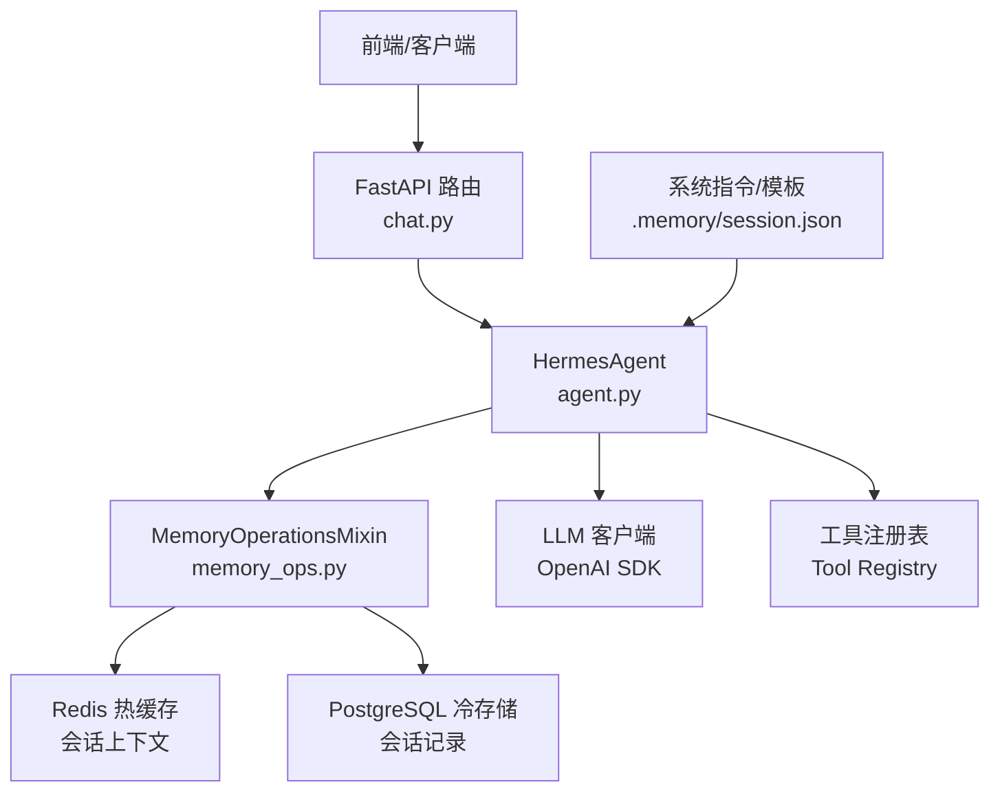
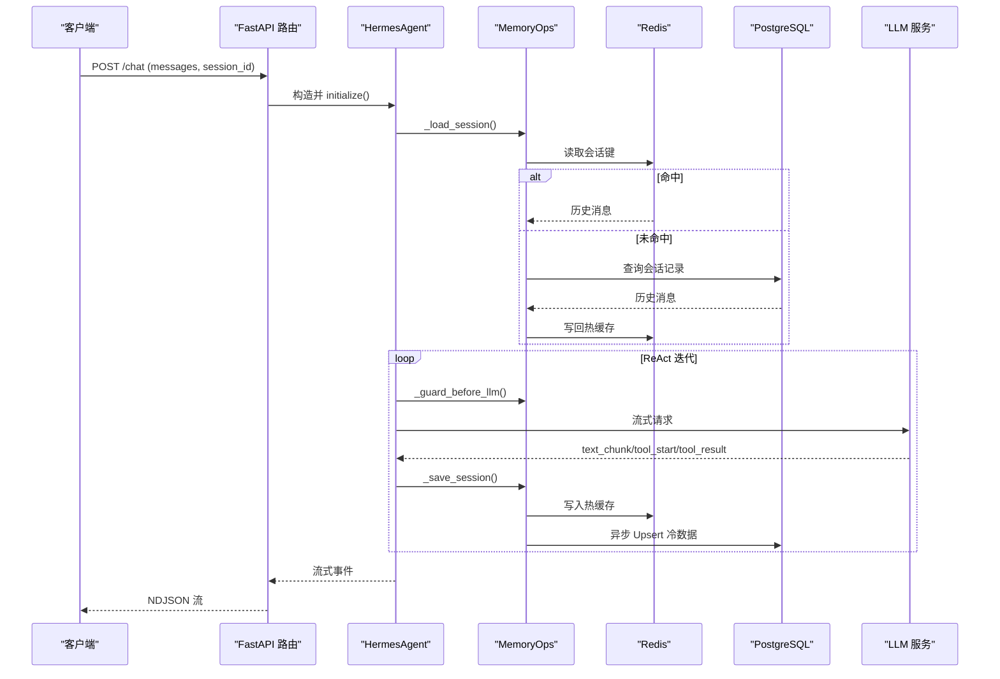
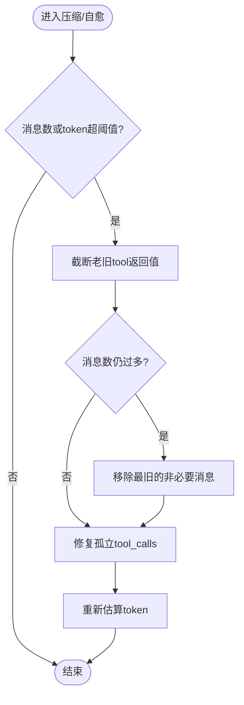
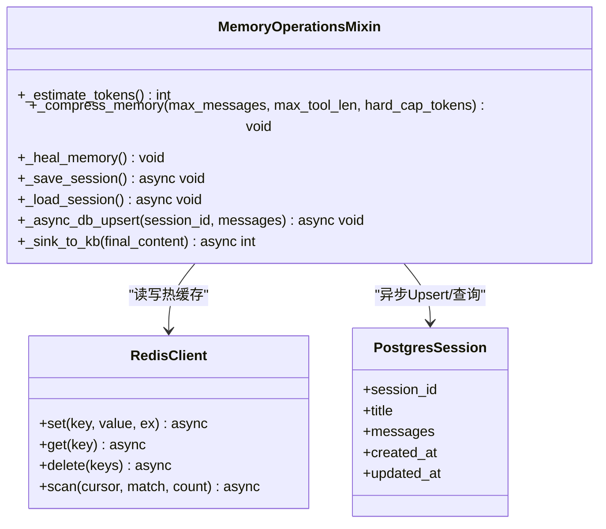
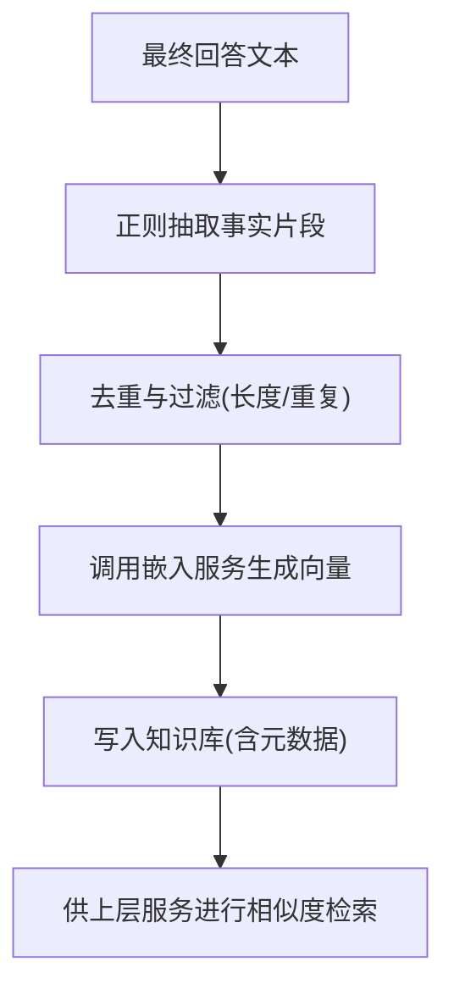
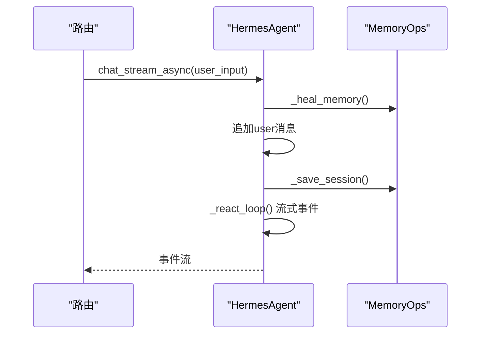
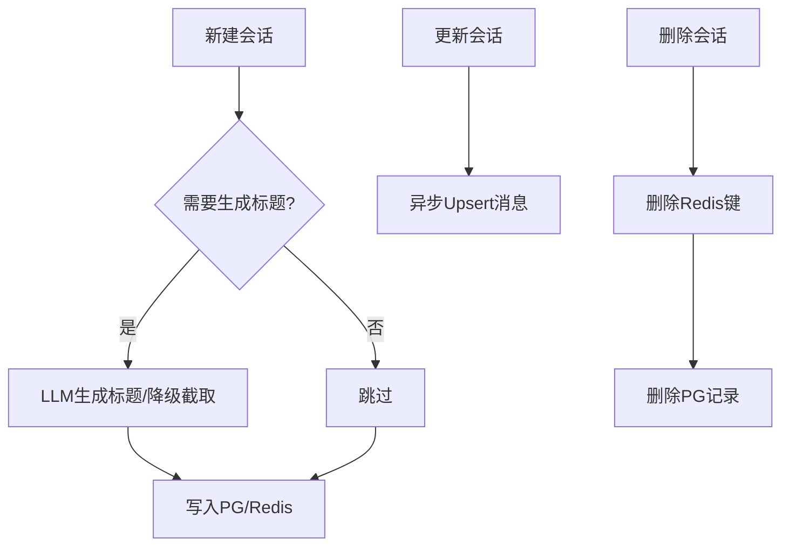
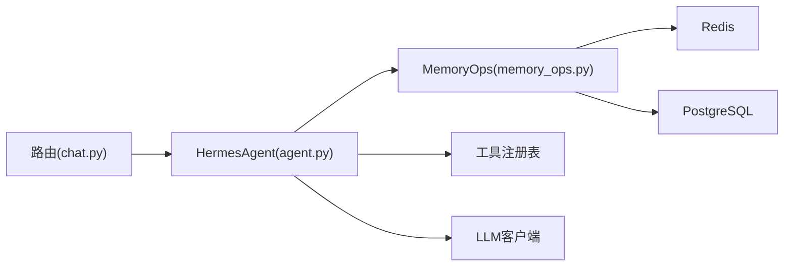

# 记忆管理机制

<cite>
**本文引用的文件**
- [hermes_agent/memory_ops.py](file://hermes_agent/memory_ops.py)
- [hermes_agent/agent.py](file://hermes_agent/agent.py)
- [backend/routers/chat.py](file://backend/routers/chat.py)
- [.memory/session.json](file://.memory/session.json)
- [backend/engine/context.py](file://backend/engine/context.py)
</cite>

## 目录
1. [简介](#简介)
2. [项目结构](#项目结构)
3. [核心组件](#核心组件)
4. [架构总览](#架构总览)
5. [详细组件分析](#详细组件分析)
6. [依赖关系分析](#依赖关系分析)
7. [性能考量](#性能考量)
8. [故障排查指南](#故障排查指南)
9. [结论](#结论)
10. [附录：使用示例与最佳实践](#附录使用示例与最佳实践)

## 简介
本技术文档围绕“记忆管理机制”展开，聚焦短期记忆（会话上下文）与长期记忆（持久化与知识库沉淀）的实现原理。内容涵盖数据结构设计、存储策略、检索算法、创建/更新/删除操作、内存管理与垃圾回收、上下文保持与会话管理、索引与搜索（向量相似度与语义检索）、以及隐私保护与安全合规等主题。通过代码级分析与可视化图示，帮助读者快速理解并高效使用该机制。

## 项目结构
记忆管理在系统中由以下关键部分协作完成：
- 会话上下文与记忆操作：HermesAgent 负责维护消息序列（messages），并通过 MemoryOperationsMixin 提供压缩、自愈、限流、持久化与知识沉淀能力。
- 会话路由与生命周期：后端 FastAPI 路由负责鉴权、会话 ID 绑定、调用 Agent 的流式接口，并提供历史会话 CRUD。
- 冷数据持久化：PostgreSQL 存储会话消息；Redis 作为热缓存承载最近会话上下文。
- 系统指令与初始上下文：系统提示词与初始会话模板用于保证一致的对话基线。
- 引擎上下文（非对话记忆）：回测/实盘引擎中的 StrategyContext 提供运行期上下文，与对话记忆解耦。

图表来源
- [backend/routers/chat.py:184-224](file://backend/routers/chat.py#L184-L224)
- [hermes_agent/agent.py:505-556](file://hermes_agent/agent.py#L505-L556)
- [hermes_agent/memory_ops.py:131-176](file://hermes_agent/memory_ops.py#L131-L176)
- [.memory/session.json:1-7](file://.memory/session.json#L1-L7)

章节来源
- [backend/routers/chat.py:184-224](file://backend/routers/chat.py#L184-L224)
- [hermes_agent/agent.py:505-556](file://hermes_agent/agent.py#L505-L556)
- [hermes_agent/memory_ops.py:131-176](file://hermes_agent/memory_ops.py#L131-L176)
- [.memory/session.json:1-7](file://.memory/session.json#L1-L7)

## 核心组件
- HermesAgent：主脑类，维护 messages（会话消息列表），驱动 ReAct 循环，统一 LLM 调用、工具执行、事件流输出，并集成记忆管理 Mixin。
- MemoryOperationsMixin：提供记忆压缩、自愈、TokenGuard 防爆护栏、会话持久化（Redis + PostgreSQL 异步落库）、事实抽取与知识库沉淀。
- Chat 路由：提供聊天流式接口与历史会话 CRUD，负责 JWT 鉴权、会话 ID 安全拼接、用户输入长度限制。
- 系统指令与初始上下文：加载系统提示词，并在加载历史时覆盖 system 消息，确保一致性。
- 引擎上下文：StrategyContext 为策略/引擎运行期上下文，与对话记忆解耦，避免混淆。

章节来源
- [hermes_agent/agent.py:60-113](file://hermes_agent/agent.py#L60-L113)
- [hermes_agent/memory_ops.py:26-42](file://hermes_agent/memory_ops.py#L26-L42)
- [backend/routers/chat.py:23-49](file://backend/routers/chat.py#L23-L49)
- [backend/engine/context.py:25-121](file://backend/engine/context.py#L25-L121)

## 架构总览
记忆管理的整体流程如下：
- 请求进入 FastAPI 路由，校验 JWT，构造 HermesAgent，注入 tool_registry、llm_client、redis_client。
- Agent 初始化时从 Redis 加载历史，若未命中则从 PostgreSQL 唤醒冷数据，并应用最新系统提示词。
- 每轮 ReAct 迭代前执行 TokenGuard 限流与预算检查，必要时触发激进压缩。
- LLM 推理结果以流式事件返回，工具调用结果写入 messages，随后异步保存至 Redis 与 PostgreSQL。
- 最终回答可自动抽取事实并写入知识库（向量嵌入）。

图表来源
- [backend/routers/chat.py:184-224](file://backend/routers/chat.py#L184-L224)
- [hermes_agent/agent.py:187-493](file://hermes_agent/agent.py#L187-L493)
- [hermes_agent/memory_ops.py:131-176](file://hermes_agent/memory_ops.py#L131-L176)

## 详细组件分析

### 短期记忆：数据结构与窗口管理
- 数据结构：messages 为有序列表，包含 system/user/assistant/tool 四类消息。system 消息始终位于首位，并在加载历史时被覆写为最新版本。
- 滑动窗口与压缩：当消息数量或估算 token 超过阈值时，对非最新轮次的巨型 tool 返回值进行有损截断，并裁剪旧消息，保留 system 与最近有效轮次。
- 自愈机制：修复异常中断导致的孤立 tool_calls，补齐缺失的 tool 响应，确保 assistant 与 tool 成对闭合。
- Token 估算：基于 JSON 序列化后的字符串长度粗略估算 token，用于触发压缩与熔断。

图表来源
- [hermes_agent/memory_ops.py:44-76](file://hermes_agent/memory_ops.py#L44-L76)
- [hermes_agent/memory_ops.py:78-129](file://hermes_agent/memory_ops.py#L78-L129)

章节来源
- [hermes_agent/memory_ops.py:35-76](file://hermes_agent/memory_ops.py#L35-L76)
- [hermes_agent/memory_ops.py:78-129](file://hermes_agent/memory_ops.py#L78-L129)
- [hermes_agent/agent.py:558-564](file://hermes_agent/agent.py#L558-L564)

### 长期记忆：存储策略与持久化
- 热数据（Redis）：会话消息以 JSON 形式按会话键存储，设置过期时间，支持快速读写与跨进程共享。
- 冷数据（PostgreSQL）：异步任务将消息 Upsert 到数据库，首次会话根据首条用户消息智能生成标题，后续更新覆盖。
- 冷热联动：加载时优先读 Redis，未命中则从 PG 恢复并回填 Redis；删除会话时同时清理两层存储。

图表来源
- [hermes_agent/memory_ops.py:131-176](file://hermes_agent/memory_ops.py#L131-L176)
- [backend/routers/chat.py:325-383](file://backend/routers/chat.py#L325-L383)

章节来源
- [hermes_agent/memory_ops.py:131-176](file://hermes_agent/memory_ops.py#L131-L176)
- [backend/routers/chat.py:230-383](file://backend/routers/chat.py#L230-L383)

### 检索算法：向量相似度与语义检索
- 事实抽取：从最终回答中按正则提取含数字与单位的事实片段，去重后生成嵌入向量。
- 嵌入与入库：调用嵌入服务获取向量，写入知识库表，附带模型版本、时间戳与来源 URL。
- 检索与排序：知识库具备 embedding 字段，可用于向量相似度检索与相关性排序（具体检索逻辑由上层服务实现，此处提供沉淀入口）。

图表来源
- [hermes_agent/memory_ops.py:291-356](file://hermes_agent/memory_ops.py#L291-L356)

章节来源
- [hermes_agent/memory_ops.py:291-356](file://hermes_agent/memory_ops.py#L291-L356)

### 上下文保持与会话管理
- 会话 ID：路由层将用户名与传入 session_id 拼接为安全键，隔离不同用户上下文。
- 历史加载：initialize 阶段从 Redis/PG 恢复 messages，并强制应用最新系统提示词。
- 流式对话：chat_stream_async 将用户输入追加到 messages，触发 ReAct 循环，事件逐块返回。
- 引擎上下文：StrategyContext 提供运行时上下文（now/mode/run_id 等），与对话记忆解耦，避免混用。

图表来源
- [backend/routers/chat.py:184-224](file://backend/routers/chat.py#L184-L224)
- [hermes_agent/agent.py:653-692](file://hermes_agent/agent.py#L653-L692)
- [hermes_agent/memory_ops.py:131-176](file://hermes_agent/memory_ops.py#L131-L176)
- [backend/engine/context.py:25-121](file://backend/engine/context.py#L25-L121)

章节来源
- [backend/routers/chat.py:184-224](file://backend/routers/chat.py#L184-L224)
- [hermes_agent/agent.py:653-692](file://hermes_agent/agent.py#L653-L692)
- [backend/engine/context.py:25-121](file://backend/engine/context.py#L25-L121)

### 创建、更新、删除操作与内存管理
- 创建：新会话首次写入时，尝试智能生成标题；若无标题则截取首条用户消息前缀。
- 更新：每次 ReAct 完成后异步 Upsert 消息；删除历史时同时清理 Redis 与 PG。
- 删除：支持批量删除当前用户所有会话与单条会话删除，确保冷热一致。
- 内存管理：通过压缩与自愈控制消息规模；TokenGuard 防止上下文过大导致 OOM 或超时。

图表来源
- [hermes_agent/memory_ops.py:177-258](file://hermes_agent/memory_ops.py#L177-L258)
- [backend/routers/chat.py:325-383](file://backend/routers/chat.py#L325-L383)

章节来源
- [hermes_agent/memory_ops.py:177-258](file://hermes_agent/memory_ops.py#L177-L258)
- [backend/routers/chat.py:325-383](file://backend/routers/chat.py#L325-L383)

### 隐私保护与安全性考虑
- 访问控制：路由层通过 JWT 验证提取 username，会话键以 user_{username}_ 前缀隔离，避免越权访问。
- 数据脱敏：会话标题清洗去除敏感字符与乱码，限制长度，防止注入与污染。
- 传输与存储：消息以 JSON 存储在 Redis/PG，建议结合 TLS 与加密存储策略（如磁盘加密、密钥管理）以满足合规要求。
- 审计与日志：路由与 Agent 内部打印关键状态，便于审计与排障；建议在生产环境启用结构化日志与访问审计。

章节来源
- [backend/routers/chat.py:23-49](file://backend/routers/chat.py#L23-L49)
- [hermes_agent/agent.py:38-57](file://hermes_agent/agent.py#L38-L57)
- [hermes_agent/memory_ops.py:177-258](file://hermes_agent/memory_ops.py#L177-L258)

## 依赖关系分析
- HermesAgent 依赖 MemoryOperationsMixin 提供的记忆能力，并通过 tool_registry 与 llm_client 完成工具执行与大模型交互。
- 路由层依赖 JWT 鉴权与全局注册表，确保工具可用性与用户身份隔离。
- 记忆持久化依赖 Redis 与 PostgreSQL，删除操作需保持一致性。

图表来源
- [backend/routers/chat.py:184-224](file://backend/routers/chat.py#L184-L224)
- [hermes_agent/agent.py:505-556](file://hermes_agent/agent.py#L505-L556)
- [hermes_agent/memory_ops.py:131-176](file://hermes_agent/memory_ops.py#L131-L176)

章节来源
- [backend/routers/chat.py:184-224](file://backend/routers/chat.py#L184-L224)
- [hermes_agent/agent.py:505-556](file://hermes_agent/agent.py#L505-L556)
- [hermes_agent/memory_ops.py:131-176](file://hermes_agent/memory_ops.py#L131-L176)

## 性能考量
- 上下文窗口保护：TokenGuard 在每次 LLM 请求前进行限流与预算检查，超限触发激进压缩，避免 OOM 与超时。
- 流式处理：ReAct 循环采用流式事件，降低首字节延迟，提升用户体验。
- 异步持久化：数据库写入通过后台任务异步执行，减少主路径阻塞。
- 缓存命中：Redis 热缓存提高会话加载速度，减少数据库压力。
- 工具返回值压缩：对非最新轮次的巨型 tool 内容进行截断，减少上下文膨胀。

[本节为通用指导，不直接分析具体文件]

## 故障排查指南
- 会话无法加载：检查 Redis 键是否存在、PG 记录是否完整；确认系统提示词覆盖逻辑正常。
- 工具调用不完整：自愈机制会检测并补齐缺失的 tool 响应；若仍异常，检查工具执行与错误封装。
- 标题生成失败：降级为截取首条用户消息；检查敏感词拦截与清洗规则。
- 删除不一致：确保 Redis 与 PG 同时删除；使用扫描模式清理用户前缀键。

章节来源
- [hermes_agent/memory_ops.py:78-129](file://hermes_agent/memory_ops.py#L78-L129)
- [hermes_agent/memory_ops.py:177-258](file://hermes_agent/memory_ops.py#L177-L258)
- [backend/routers/chat.py:325-383](file://backend/routers/chat.py#L325-L383)

## 结论
该记忆管理机制通过短期记忆（会话上下文）与长期记忆（Redis/PG 持久化与知识库沉淀）协同工作，实现了高可用、可扩展且安全的对话体验。借助压缩、自愈与 TokenGuard，系统在长对话场景下保持稳定；通过向量嵌入与事实抽取，为语义检索与知识复用奠定基础。配合严格的访问控制与数据清洗，满足生产环境的隐私与合规要求。

[本节为总结，不直接分析具体文件]

## 附录：使用示例与最佳实践
- 在对话中利用记忆信息
  - 通过路由发送消息，Agent 自动加载历史上下文，结合工具执行给出连贯回答。
  - 参考路径：[后端路由:184-224](file://backend/routers/chat.py#L184-L224)、[Agent 流式接口:653-692](file://hermes_agent/agent.py#L653-L692)。
- 处理长对话场景
  - 关注压缩与自愈行为，避免巨型 tool 返回值影响上下文；必要时调整阈值或分段提问。
  - 参考路径：[记忆压缩:44-76](file://hermes_agent/memory_ops.py#L44-L76)、[记忆自愈:78-129](file://hermes_agent/memory_ops.py#L78-L129)。
- 优化记忆性能
  - 启用 Redis 热缓存，合理设置过期时间；监控 PG 写入延迟；定期清理无用会话。
  - 参考路径：[持久化:131-176](file://hermes_agent/memory_ops.py#L131-L176)、[删除会话:325-383](file://backend/routers/chat.py#L325-L383)。
- 隐私与安全
  - 确保 JWT 配置正确，会话键前缀隔离；对敏感信息进行脱敏与最小化存储。
  - 参考路径：[鉴权:23-49](file://backend/routers/chat.py#L23-L49)、[标题清洗:38-57](file://hermes_agent/agent.py#L38-L57)。
