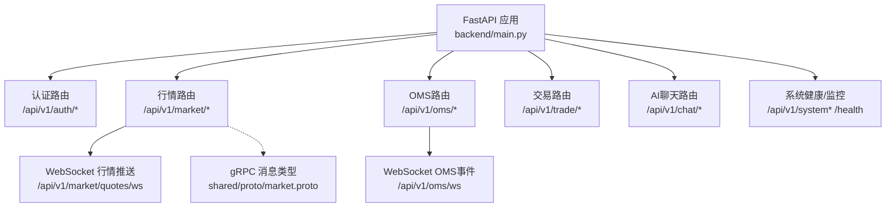
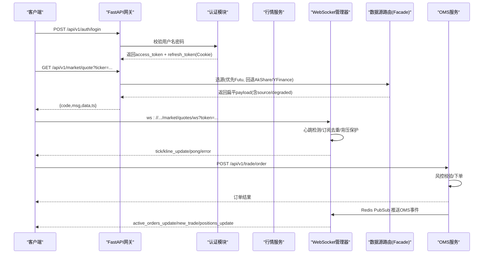
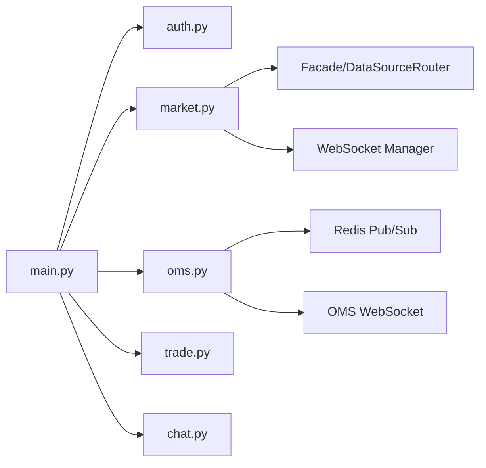

# API接口参考

<cite>
**本文引用的文件**
- [backend/main.py](file://backend/main.py)
- [backend/routers/auth.py](file://backend/routers/auth.py)
- [backend/routers/market.py](file://backend/routers/market.py)
- [backend/routers/chat.py](file://backend/routers/chat.py)
- [backend/routers/trade.py](file://backend/routers/trade.py)
- [backend/routers/oms.py](file://backend/routers/oms.py)
- [backend/core/error_codes.py](file://backend/core/error_codes.py)
- [backend/core/security.py](file://backend/core/security.py)
- [backend/core/middleware.py](file://backend/core/middleware.py)
- [shared/proto/market.proto](file://shared/proto/market.proto)
- [docs/10. API接口规范.md](file://docs/10. API接口规范.md)
</cite>

## 目录
1. [简介](#简介)
2. [项目结构](#项目结构)
3. [核心组件](#核心组件)
4. [架构总览](#架构总览)
5. [详细组件分析](#详细组件分析)
6. [依赖关系分析](#依赖关系分析)
7. [性能与限流](#性能与限流)
8. [故障排查指南](#故障排查指南)
9. [结论](#结论)
10. [附录：调用示例与调试](#附录调用示例与调试)

## 简介
本参考文档面向API使用者，系统化说明Quant Agent的REST、WebSocket与gRPC接口能力，覆盖认证鉴权、请求/响应Schema、错误码、版本控制、速率限制、向后兼容性与测试调试方法。所有接口以FastAPI路由为核心，统一通过API前缀进行版本隔离；实时数据通过WebSocket推送；内部服务间通信使用HMAC签名保护；gRPC协议定义位于共享proto文件。

## 项目结构
后端采用模块化路由组织：主应用工厂负责中间件、OpenAPI、CORS与路由挂载；各业务域（市场、OMS、交易、聊天等）独立路由文件；核心基础设施（错误码、安全、中间件、数据库、缓存）集中在core目录；gRPC消息类型在shared/proto中定义。

图表来源
- [backend/main.py:125-218](file://backend/main.py#L125-L218)
- [backend/routers/market.py:73-226](file://backend/routers/market.py#L73-L226)
- [backend/routers/oms.py:379-464](file://backend/routers/oms.py#L379-L464)
- [shared/proto/market.proto:1-22](file://shared/proto/market.proto#L1-L22)

章节来源
- [backend/main.py:125-218](file://backend/main.py#L125-L218)
- [docs/10. API接口规范.md:23-94](file://docs/10. API接口规范.md#L23-L94)

## 核心组件
- 应用工厂与路由挂载：统一API版本前缀、CORS、异常处理、OpenAPI增强、静态资源挂载。
- 认证与鉴权：JWT访问令牌+HttpOnly刷新令牌；可选Google OAuth验证；WebSocket连接时Query Token校验。
- 行情与历史数据：REST获取快照、历史K线、期权链、资金流向、盘口深度；WebSocket订阅实时Tick/K线更新。
- OMS与交易：订单管理、算法拆单、持仓查询、交易模式切换、Kill Switch熔断；WebSocket推送OMS事件。
- AI聊天：SSE/NDJSON流式返回Agent推理过程与最终内容。
- 中间件与可观测性：访问日志、Prometheus指标、外部API耗时追踪。
- gRPC消息：Order、QuoteData用于跨进程或子服务的数据交换。

章节来源
- [backend/main.py:125-218](file://backend/main.py#L125-L218)
- [backend/routers/auth.py:117-162](file://backend/routers/auth.py#L117-L162)
- [backend/routers/market.py:342-545](file://backend/routers/market.py#L342-L545)
- [backend/routers/oms.py:56-184](file://backend/routers/oms.py#L56-L184)
- [backend/routers/chat.py:184-224](file://backend/routers/chat.py#L184-L224)
- [backend/core/middleware.py:90-133](file://backend/core/middleware.py#L90-L133)
- [shared/proto/market.proto:1-22](file://shared/proto/market.proto#L1-L22)

## 架构总览
Quant Agent对外暴露REST与WebSocket接口，内部通过Facade与DataSourceRouter选择数据源（Futu/AkShare/YFinance），并支持降级与熔断。认证由JWT完成，WebSocket连接通过Query Token鉴权。OMS模块通过Redis Pub/Sub广播事件至前端WebSocket。gRPC消息类型用于底层数据结构定义。

图表来源
- [backend/routers/auth.py:117-162](file://backend/routers/auth.py#L117-L162)
- [backend/routers/market.py:342-545](file://backend/routers/market.py#L342-L545)
- [backend/routers/market.py:73-226](file://backend/routers/market.py#L73-L226)
- [backend/routers/trade.py:30-56](file://backend/routers/trade.py#L30-L56)
- [backend/routers/oms.py:379-464](file://backend/routers/oms.py#L379-L464)

## 详细组件分析

### 认证与鉴权（/api/v1/auth）
- 登录：POST /api/v1/auth/login，返回access_token与refresh_token（HttpOnly Cookie）。
- 刷新：POST /api/v1/auth/refresh，从Cookie读取Refresh Token签发新Access Token。
- 登出：POST /api/v1/auth/logout，清除服务端黑名单并删除Cookie。
- Google OAuth：POST /api/v1/auth/google/verify，验证前端ID Token后签发系统Token。
- 当前用户：GET /api/v1/auth/me，需Bearer Token。

鉴权方式
- REST：Authorization: Bearer <access_token>
- WebSocket：连接URL携带 ?token=<access_token>
- 内部Tool API：HMAC-SHA256签名头 X-Internal-Sig、X-Internal-Ts

错误码映射
- 1001/1002/1003：Token缺失/过期/无效 → 401
- 1004/1005：权限不足/HMAC签名失败 → 403

章节来源
- [backend/routers/auth.py:117-162](file://backend/routers/auth.py#L117-L162)
- [backend/routers/auth.py:305-386](file://backend/routers/auth.py#L305-L386)
- [backend/core/error_codes.py:15-55](file://backend/core/error_codes.py#L15-L55)
- [backend/core/security.py:37-119](file://backend/core/security.py#L37-L119)

### 行情接口（/api/v1/market）
- 实时快照：GET /api/v1/market/quote?ticker=...
- 批量快照：POST /api/v1/market/quotes/batch，从Redis缓存批量拉取自选行情。
- 历史K线：GET /api/v1/market/history?ticker=...&ktype=...&num=...
- K线同步：POST /api/v1/market/kline/sync，触发本地数仓增量/全量补全。
- 期权链：GET /api/v1/market/option-chain?ticker=...&expiration_date=...
- IV摘要：GET /api/v1/market/option-iv-summary?ticker=...
- 策略实验室：GET /api/v1/market/option-strategy-lab?ticker=...&strategy_type=...&spread=...
- 波动率：GET /api/v1/market/option-volatility?ticker=...
- 资金流向：GET /api/v1/market/fund-flow?ticker=...
- 筹码分布：GET /api/v1/market/capital-distribution/{ticker}
- 十大经纪商：GET /api/v1/market/top-brokers/{ticker}
- 分时资金流：GET /api/v1/market/capital-flow/{ticker}?period_type=INTRADAY
- 板块热力图：GET /api/v1/market/heat-map/{market}
- 盘口深度：GET /api/v1/market/order-book?ticker=...
- 市场快照：GET /api/v1/market/snapshot?tickers=...

数据源与降级
- Futu优先（港美股/A股等经DataSourceRouter.fetch_futu），失败回退至AkShare/YFinance。
- 返回字段包含source、degraded、latency_ms、cached等元信息。

WebSocket行情
- 连接：ws://host/api/v1/market/quotes/ws?token=...
- 客户端→服务端：subscribe/unsubscribe/ping
- 服务端→客户端：connected/tick/kline_update/pong/error
- 特性：心跳超时断开、订阅去重、背压保护、自动格式化ticker。

章节来源
- [backend/routers/market.py:342-800](file://backend/routers/market.py#L342-L800)
- [backend/routers/market.py:73-226](file://backend/routers/market.py#L73-L226)

### OMS与交易（/api/v1/oms 与 /api/v1/trade）
- OMS状态：GET /api/v1/oms/state，聚合活动挂单、历史成交、Bot节点、算法执行、交易模式。
- Kill Switch：POST /api/v1/oms/kill_switch，瞬间阻断实盘Bot并市价全平。
- 订单操作：
  - 取消：POST /api/v1/oms/orders/{order_id}/cancel（幂等锁防并发）
  - 改单：POST /api/v1/oms/orders/{order_id}/modify
- 持仓：GET /api/v1/oms/positions?market=HK
- Bot控制：暂停/恢复/终止
- 算法拆单：启动/暂停/恢复/取消；执行分析报告
- 交易模式：查询/热切换（SANDBOX/PAPER/LIVE）
- 交易接口：
  - 发单：POST /api/v1/trade/order
  - 账户：GET /api/v1/trade/account
  - 组合：GET /api/v1/trade/portfolio
  - 交易日志：GET /api/v1/trade/trades?limit=...

WebSocket OMS事件
- 连接：ws://host/api/v1/oms/ws?token=...
- 事件类型：bots_update、active_orders_update、new_trade、bot_log、algo_executions_update、positions_update、mode_change
- 实现：订阅Redis通道并转发至客户端。

章节来源
- [backend/routers/oms.py:56-371](file://backend/routers/oms.py#L56-L371)
- [backend/routers/oms.py:379-464](file://backend/routers/oms.py#L379-L464)
- [backend/routers/trade.py:30-56](file://backend/routers/trade.py#L30-L56)

### AI聊天（/api/v1/chat）
- 建议：GET /api/v1/chat/suggestions?limit=...
- 流式对话：POST /api/v1/chat，返回application/x-ndjson流，包含thinking/tool_result/message/error事件。
- 会话管理：
  - 列表：GET /api/v1/chat/sessions?q=...
  - 详情：GET /api/v1/chat/sessions/{session_id}
  - 删除全部：DELETE /api/v1/chat/sessions
  - 删除单个：DELETE /api/v1/chat/sessions/{session_id}

章节来源
- [backend/routers/chat.py:122-224](file://backend/routers/chat.py#L122-L224)
- [backend/routers/chat.py:230-384](file://backend/routers/chat.py#L230-L384)

### gRPC消息类型
- Order：价格与数量，用于盘口单档结构。
- QuoteData：极速行情快照（状态、标的、最新价、涨跌幅、成交量、买卖盘、来源）。

章节来源
- [shared/proto/market.proto:1-22](file://shared/proto/market.proto#L1-L22)

## 依赖关系分析
- FastAPI应用工厂集中注册中间件与路由，确保统一的API版本前缀与CORS策略。
- 认证模块提供JWT生成与校验，WebSocket连接复用同一密钥。
- 行情路由通过Facade与DataSourceRouter解耦数据源，支持降级与熔断。
- OMS模块通过Redis Pub/Sub实现事件驱动的前端实时更新。
- 中间件记录请求计数、延迟与外部API耗时，便于监控与排障。

图表来源
- [backend/main.py:125-218](file://backend/main.py#L125-L218)
- [backend/routers/market.py:73-226](file://backend/routers/market.py#L73-L226)
- [backend/routers/oms.py:379-464](file://backend/routers/oms.py#L379-L464)

章节来源
- [backend/main.py:125-218](file://backend/main.py#L125-L218)
- [backend/core/middleware.py:90-133](file://backend/core/middleware.py#L90-L133)

## 性能与限流
- 中间件记录每个接口的请求次数与P99/P95延迟，便于容量规划。
- 外部API调用通过httpx钩子统计耗时与状态码，慢请求告警。
- WebSocket心跳超时（60秒）防止僵尸连接；订阅去重与背压保护提升吞吐。
- 数据源降级与熔断避免雪崩；Redis缓存批量快照降低延迟。
- 速率限制：仓库未内置全局限流器；建议在网关层（如Nginx/Cloudflare）或反向代理配置限流策略。

章节来源
- [backend/core/middleware.py:10-88](file://backend/core/middleware.py#L10-L88)
- [backend/routers/market.py:73-226](file://backend/routers/market.py#L73-L226)

## 故障排查指南
- 错误码：统一ErrorCode枚举，HTTP状态码映射清晰（401/403/400/404/503/500）。
- 常见错误：
  - Token缺失/过期：检查Authorization头或WebSocket Query Token。
  - 数据源不可用：查看/health/services与健康探针；关注degraded字段。
  - WebSocket断连：检查心跳ping间隔与网络稳定性。
- 日志与监控：
  - 访问日志带颜色标记耗时；Prometheus指标可通过/metrics抓取。
  - 外部API慢调用会输出警告日志。
- 调试工具：
  - Swagger UI：/docs
  - ReDoc：/redoc
  - OpenAPI Schema：/openapi.json

章节来源
- [backend/core/error_codes.py:15-55](file://backend/core/error_codes.py#L15-L55)
- [backend/core/middleware.py:90-133](file://backend/core/middleware.py#L90-L133)
- [docs/10. API接口规范.md:9-19](file://docs/10. API接口规范.md#L9-L19)

## 结论
Quant Agent提供完整的量化交易与AI研究API体系，涵盖REST、WebSocket与gRPC消息定义。通过统一认证、数据源解耦、降级熔断与可观测性，满足高可用与高性能需求。使用者应遵循API规范，结合Swagger与OpenAPI进行集成与测试。

## 附录：调用示例与调试
- 登录获取Token：
  - 方法：POST /api/v1/auth/login
  - 请求体：{username, password}
  - 响应：access_token与refresh_token（HttpOnly Cookie）
- 获取实时行情：
  - 方法：GET /api/v1/market/quote?ticker=AAPL
  - 响应：包含price/change_pct/volume/source等字段
- 订阅WebSocket行情：
  - 连接：ws://host/api/v1/market/quotes/ws?token=<access_token>
  - 发送：{"action":"subscribe","symbols":["AAPL"],"channel":"quote"}
  - 接收：tick/kline_update/pong/error事件
- 发单：
  - 方法：POST /api/v1/trade/order
  - 请求体：{ticker, action, qty, price, order_id}
- 调试：
  - 访问/docs或/redoc查看在线文档
  - 使用curl或Postman构造请求，携带Authorization头
  - 通过浏览器开发者工具观察WebSocket帧

章节来源
- [backend/routers/auth.py:117-162](file://backend/routers/auth.py#L117-L162)
- [backend/routers/market.py:342-545](file://backend/routers/market.py#L342-L545)
- [backend/routers/market.py:73-226](file://backend/routers/market.py#L73-L226)
- [backend/routers/trade.py:30-56](file://backend/routers/trade.py#L30-L56)