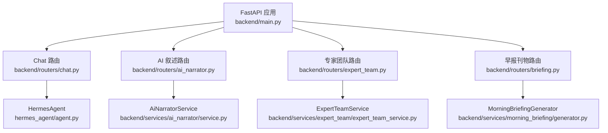
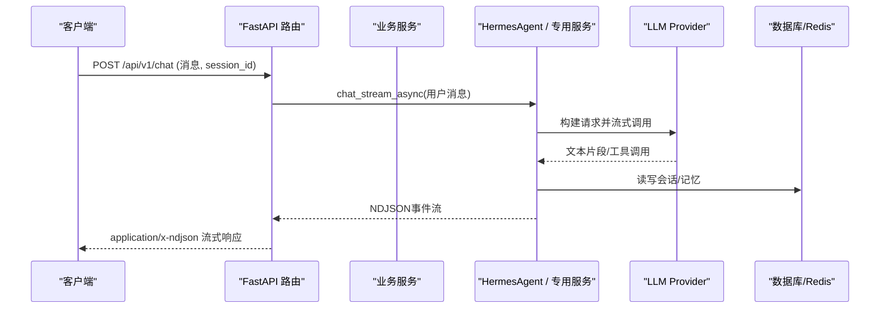
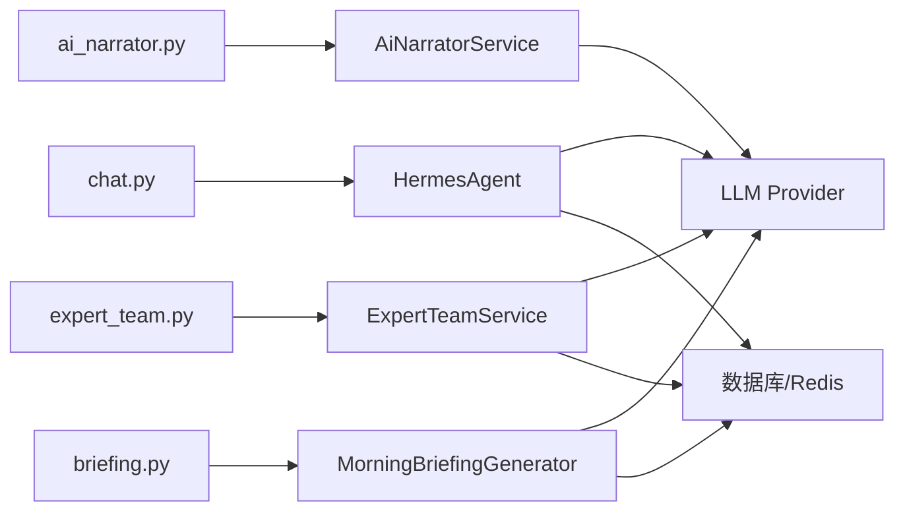

# AI智能分析API

<cite>
**本文引用的文件**
- [backend/main.py](file://backend/main.py)
- [backend/routers/chat.py](file://backend/routers/chat.py)
- [backend/routers/ai_narrator.py](file://backend/routers/ai_narrator.py)
- [backend/routers/expert_team.py](file://backend/routers/expert_team.py)
- [backend/routers/briefing.py](file://backend/routers/briefing.py)
- [backend/services/ai_narrator/models.py](file://backend/services/ai_narrator/models.py)
- [backend/services/expert_team/models.py](file://backend/services/expert_team/models.py)
- [backend/core/models.py](file://backend/core/models.py)
- [hermes_agent/agent.py](file://hermes_agent/agent.py)
</cite>

## 目录
1. [简介](#简介)
2. [项目结构](#项目结构)
3. [核心组件](#核心组件)
4. [架构总览](#架构总览)
5. [详细接口说明](#详细接口说明)
6. [依赖关系分析](#依赖关系分析)
7. [性能与成本考量](#性能与成本考量)
8. [故障排查指南](#故障排查指南)
9. [结论](#结论)
10. [附录](#附录)

## 简介
本文件面向开发者，系统化文档化 Quant Agent 的AI智能分析RESTful API，覆盖以下能力：
- 聊天对话与会话管理（流式NDJSON）
- AI叙述（异动解说员，支持流式打字机输出）
- 专家团队协作（SSE流式多轮辩论与收敛报告）
- 晨间简报（盘前早报自动生成与分享）

同时涵盖：
- 自然语言处理、市场分析生成、多智能体协作、报告自动生成的端点URL、请求参数、响应格式
- 流式响应处理、上下文管理、记忆存储机制
- LLM集成、提示词工程与成本控制策略
- 完整JSON请求/响应示例与最佳实践

## 项目结构
后端采用FastAPI模块化路由组织，AI相关能力分布在多个路由与服务中：
- 主入口负责应用装配、中间件、CORS、OpenAPI与路由挂载
- Chat路由提供会话管理与流式对话
- AI Narrator路由提供异动解说的同步与流式接口
- Expert Team路由提供专家团分析的SSE流式接口与场景/会话管理
- Briefing路由提供早报刊物的生成、查询与分享

图表来源
- [backend/main.py:125-218](file://backend/main.py#L125-L218)
- [backend/routers/chat.py:184-224](file://backend/routers/chat.py#L184-L224)
- [backend/routers/ai_narrator.py:25-80](file://backend/routers/ai_narrator.py#L25-L80)
- [backend/routers/expert_team.py:48-103](file://backend/routers/expert_team.py#L48-L103)
- [backend/routers/briefing.py:18-46](file://backend/routers/briefing.py#L18-L46)

章节来源
- [backend/main.py:125-218](file://backend/main.py#L125-L218)

## 核心组件
- HermesAgent：统一LLM调用、工具执行、ReAct循环、Token计量与上下文记忆
- AiNarratorService：异动解说的数据驱动生成与流式输出
- ExpertTeamService：多专家角色协同、多轮辩论、首席收敛报告
- MorningBriefingGenerator：多源数据采集+LLM组装盘前早报Markdown

章节来源
- [hermes_agent/agent.py:60-200](file://hermes_agent/agent.py#L60-L200)
- [backend/services/ai_narrator/models.py:9-35](file://backend/services/ai_narrator/models.py#L9-L35)
- [backend/services/expert_team/models.py:11-128](file://backend/services/expert_team/models.py#L11-L128)
- [backend/services/morning_briefing/generator.py:153-179](file://backend/services/morning_briefing/generator.py#L153-L179)

## 架构总览
整体流程：客户端通过REST调用各路由端点，路由层进行鉴权与参数校验后，调用对应服务完成业务逻辑；AI能力通过HermesAgent或专用服务与LLM交互，结果以JSON或流式（NDJSON/SSE）返回。会话与历史数据持久化到数据库，热态缓存使用Redis。

图表来源
- [backend/routers/chat.py:184-224](file://backend/routers/chat.py#L184-L224)
- [hermes_agent/agent.py:140-200](file://hermes_agent/agent.py#L140-L200)
- [backend/core/models.py:106-124](file://backend/core/models.py#L106-L124)

## 详细接口说明

### 聊天对话与会话管理
- 基础路径：/api/v1/chat
- 认证：JWT（Header Bearer 或 Cookie refresh_token），从载荷sub提取username

端点列表
- GET /api/v1/chat/suggestions?limit=10
  - 功能：获取聊天灵感建议（静态+动态组合）
  - 响应：{"status":"success","data":[...]}
- POST /api/v1/chat
  - 功能：发起AI对话（流式NDJSON）
  - 请求体：
    - messages: [{role,content,name,tool_calls,tool_call_id}, ...]
    - session_id: 可选，默认"default_api_session"
  - 响应：application/x-ndjson 流式事件（包含文本片段、工具调用、错误等）
- GET /api/v1/chat/sessions?user_id=&q=
  - 功能：获取历史会话列表（支持关键字搜索）
  - 响应：{"status":"success","data":[{"session_id","title","created_at","updated_at","message_count"},...]}
- GET /api/v1/chat/sessions/{session_id}
  - 功能：获取指定会话的历史消息
  - 响应：{"status":"success","data":[...]}
- DELETE /api/v1/chat/sessions
  - 功能：删除当前用户所有历史会话（清理Redis热数据）
  - 响应：{"status":"success","message":"..."}
- DELETE /api/v1/chat/sessions/{session_id}
  - 功能：删除指定会话（清理Redis热数据）
  - 响应：{"status":"success","message":"..."}

流式协议（NDJSON）
- 每行一个JSON事件，包含文本增量、工具调用、错误等
- 错误事件不中断流，前端需容错处理

上下文与记忆
- 会话ID安全化：user_{username}_{session_id}
- 会话持久化：AgentSession表（messages JSON）
- 记忆缓存：Redis键 hermes:memory:{safe_session_id}*

章节来源
- [backend/routers/chat.py:122-224](file://backend/routers/chat.py#L122-L224)
- [backend/routers/chat.py:230-384](file://backend/routers/chat.py#L230-L384)
- [backend/core/models.py:106-124](file://backend/core/models.py#L106-L124)

### AI叙述（异动解说员）
- 基础路径：/api/v1/ai
- 无需JWT（路由未声明鉴权依赖）

端点列表
- POST /api/v1/ai/narrate
  - 功能：对异动标的生成一句话数据驱动解说（带来源/置信度）
  - 请求体：
    - symbol: 标的代码
    - change_pct: 涨跌幅百分比
    - direction: up|down，默认up
    - threshold: 阈值，默认2.0
    - include_pattern_winrate: 是否包含形态胜率
    - pattern_winrate: 形态胜率（可选）
    - pattern_name: 形态名称（可选）
  - 响应：{"status":"success","data":{...}}
- POST /api/v1/ai/stream
  - 功能：流式返回异动解说（NDJSON）
  - 请求体：同上
  - 响应：application/x-ndjson 流式事件
    - {"event":"ping"} 首包占位
    - {"event":"delta","data":{"symbol","text"}} 逐段真实文本
    - {"event":"done","data":{NarrativeResult}} 结构化结果
    - {"event":"error","data":"..."} 下游异常不中断流

章节来源
- [backend/routers/ai_narrator.py:25-80](file://backend/routers/ai_narrator.py#L25-L80)
- [backend/services/ai_narrator/models.py:9-35](file://backend/services/ai_narrator/models.py#L9-L35)

### 专家团队协作
- 基础路径：/api/v1/expert-team
- 认证：JWT（Header Bearer 或 Cookie refresh_token）

端点列表
- POST /api/v1/expert-team/analyze
  - 功能：发起专家团分析（SSE流式）
  - 请求体：
    - scenario: 场景模板ID（如 financial_research / code_review）
    - question: 用户问题
    - ticker: 金融域标的代码（可选）
    - code_context: 代码域代码片段（可选）
    - extra_context: 额外上下文（可选）
    - rounds: 辩论轮数 1-4，默认2
    - expert_ids: 自定义专家阵容（可选）
  - 响应：text/event-stream SSE事件
    - type: status | expert_opinion | round_complete | chief_report | error | done
    - data/message/content: 事件数据或可读摘要
- GET /api/v1/expert-team/scenarios
  - 功能：获取可用场景模板列表
  - 响应：{"scenarios":[...]}
- GET /api/v1/expert-team/sessions?limit=20
  - 功能：获取历史会话列表（Redis热→PG冷双层查询）
  - 响应：{"sessions":[...]}
- GET /api/v1/expert-team/sessions/{session_id}
  - 功能：获取完整辩论记录（Redis→PG→内存三级降级）
  - 响应：DebateSession对象

章节来源
- [backend/routers/expert_team.py:28-103](file://backend/routers/expert_team.py#L28-L103)
- [backend/services/expert_team/models.py:86-128](file://backend/services/expert_team/models.py#L86-L128)

### 晨间简报（早报刊物）
- 基础路径：/api/v1/briefing
- 无需JWT（路由未声明鉴权依赖）

端点列表
- POST /api/v1/briefing/generate?market=全球&date=YYYY-MM-DD
  - 功能：手动触发盘前早报生成
  - 响应：{"status":"success","data":{BriefingResult}}
- GET /api/v1/briefing/latest?market=全球
  - 功能：获取最新一份早报（供Dashboard自动加载）
  - 响应：{"status":"success"|"empty","data":...}
- GET /api/v1/briefing/share/{briefing_id}
  - 功能：按分享短码获取早报（分享URL落地页数据源）
  - 响应：{"status":"success","data":{BriefingResult}}

章节来源
- [backend/routers/briefing.py:18-46](file://backend/routers/briefing.py#L18-L46)

## 依赖关系分析
- 路由层依赖：
  - chat.py → HermesAgent、Redis、数据库模型
  - ai_narrator.py → AiNarratorService、心跳封装
  - expert_team.py → ExpertTeamService、场景注册器
  - briefing.py → MorningBriefingGenerator、存储模块
- 服务层依赖：
  - HermesAgent → OpenAI SDK、工具注册表、Token计量
  - AiNarratorService → 数据源、LLM服务
  - ExpertTeamService → 专家角色、场景模板、会话存储
  - MorningBriefingGenerator → 工具注册表、LLM服务、存储

图表来源
- [backend/routers/chat.py:184-224](file://backend/routers/chat.py#L184-L224)
- [backend/routers/ai_narrator.py:25-80](file://backend/routers/ai_narrator.py#L25-L80)
- [backend/routers/expert_team.py:48-103](file://backend/routers/expert_team.py#L48-L103)
- [backend/routers/briefing.py:18-46](file://backend/routers/briefing.py#L18-L46)
- [hermes_agent/agent.py:140-200](file://hermes_agent/agent.py#L140-L200)

章节来源
- [backend/main.py:170-210](file://backend/main.py#L170-L210)

## 性能与成本考量
- 流式响应：
  - 聊天对话使用NDJSON流式，降低首包延迟，提升用户体验
  - AI叙述使用NDJSON打字机模式，逐步推送真实内容
  - 专家团队使用SSE流式，实时推送状态与观点
- Token计量与成本控制：
  - HermesAgent统一记录prompt_tokens、completion_tokens、total_tokens
  - 可通过token_usage_store进行用量统计与限流策略
- 并发与降级：
  - 早报生成并行采集多数据源，失败项优雅降级
  - 专家会话多级缓存（Redis→PG→内存）
- 超时与熔断：
  - 全局socket默认超时15秒，防止死锁
  - 工具执行异常脱敏，避免凭据泄露

章节来源
- [hermes_agent/agent.py:100-137](file://hermes_agent/agent.py#L100-L137)
- [backend/services/morning_briefing/generator.py:182-200](file://backend/services/morning_briefing/generator.py#L182-L200)
- [backend/main.py:25-26](file://backend/main.py#L25-L26)

## 故障排查指南
- 401 未授权：检查JWT是否正确携带（Header Bearer或Cookie refresh_token），确保载荷包含sub字段
- 503 Tool Registry未初始化：确认全局注册表已启动
- 流式中断：检查网络与代理配置，确保服务端保持连接（Keep-Alive）
- 数据为空：检查市场范围与日期参数，确认数据源可用性
- 错误事件：在NDJSON/SSE流中捕获error事件，记录日志并提示用户重试

章节来源
- [backend/routers/chat.py:31-48](file://backend/routers/chat.py#L31-L48)
- [backend/routers/chat.py:187-190](file://backend/routers/chat.py#L187-L190)
- [backend/routers/ai_narrator.py:63-66](file://backend/routers/ai_narrator.py#L63-L66)
- [backend/routers/expert_team.py:61-67](file://backend/routers/expert_team.py#L61-L67)

## 结论
Quant Agent AI智能分析API提供了完整的对话、叙述、专家协作与报告生成能力，采用流式响应提升实时性，结合多源数据与LLM实现高质量输出。通过统一的Token计量与降级策略，保障系统稳定性与成本可控。开发者可基于本指南快速集成AI功能，遵循最佳实践获得稳定高效的体验。

## 附录

### 请求/响应示例（节选）
- 聊天对话请求
  - URL: POST /api/v1/chat
  - 请求体：
    - messages: [{"role":"user","content":"请分析AAPL今日走势"}]
    - session_id: "default_api_session"
  - 响应：application/x-ndjson 流式事件（文本片段、工具调用、错误等）

- AI叙述请求
  - URL: POST /api/v1/ai/narrate
  - 请求体：
    - symbol: "AAPL"
    - change_pct: 3.5
    - direction: "up"
    - threshold: 2.0
  - 响应：{"status":"success","data":{"symbol":"AAPL","direction":"up","change_pct":3.5,"threshold":2.0,"summary":"...","source":"...","confidence":0.95,...}}

- 专家团队分析请求
  - URL: POST /api/v1/expert-team/analyze
  - 请求体：
    - scenario: "financial_research"
    - question: "评估NVDA未来一周走势"
    - ticker: "NVDA"
    - rounds: 2
  - 响应：text/event-stream SSE事件（状态、观点、报告等）

- 早报刊物生成请求
  - URL: POST /api/v1/briefing/generate?market=全球&date=2024-01-01
  - 响应：{"status":"success","data":{"id":"...","date":"2024-01-01","market":"全球","markdown":"...","source_tools":["..."],...}}

### LLM集成与提示词工程
- LLM调用归一化：HermesAgent统一构建请求参数，屏蔽Provider差异
- 温度设置：量化场景使用低随机性（temperature=0.0）确保确定性
- 工具调用：动态注入工具Schema，支持函数调用与工作流
- 提示词管理：系统提示词与任务提示词分离，便于维护与扩展

章节来源
- [hermes_agent/agent.py:70-97](file://hermes_agent/agent.py#L70-L97)
- [hermes_agent/agent.py:140-177](file://hermes_agent/agent.py#L140-L177)

### 最佳实践
- 流式处理：前端应逐行解析NDJSON/SSE事件，实时更新UI
- 错误处理：捕获error事件并友好提示，避免中断用户体验
- 会话管理：合理设置session_id，利用历史消息增强上下文
- 成本控制：监控Token用量，设置上限与降级策略
- 数据安全：敏感信息脱敏，避免泄露至LLM上下文