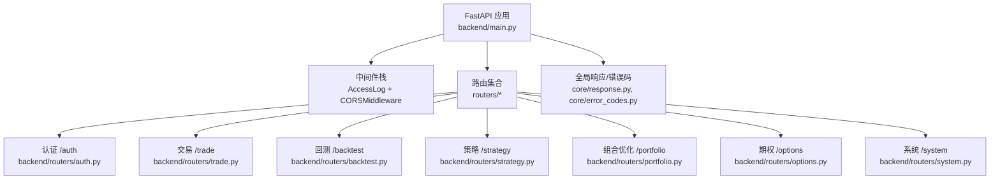
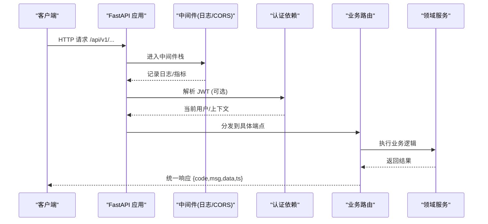
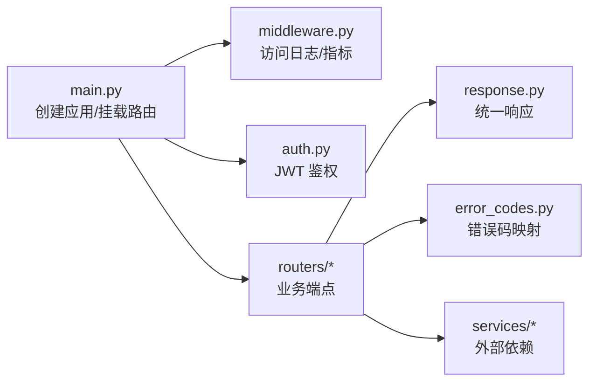

# RESTful API接口

<cite>
**本文引用的文件**
- [backend/main.py](file://backend/main.py)
- [backend/core/middleware.py](file://backend/core/middleware.py)
- [backend/core/security.py](file://backend/core/security.py)
- [backend/routers/auth.py](file://backend/routers/auth.py)
- [backend/routers/trade.py](file://backend/routers/trade.py)
- [backend/routers/backtest.py](file://backend/routers/backtest.py)
- [backend/routers/strategy.py](file://backend/routers/strategy.py)
- [backend/routers/portfolio.py](file://backend/routers/portfolio.py)
- [backend/routers/options.py](file://backend/routers/options.py)
- [backend/routers/system.py](file://backend/routers/system.py)
- [backend/core/response.py](file://backend/core/response.py)
- [backend/core/error_codes.py](file://backend/core/error_codes.py)
</cite>

## 目录
1. [简介](#简介)
2. [项目结构](#项目结构)
3. [核心组件](#核心组件)
4. [架构总览](#架构总览)
5. [详细组件分析](#详细组件分析)
6. [依赖关系分析](#依赖关系分析)
7. [性能与限流](#性能与限流)
8. [故障排查指南](#故障排查指南)
9. [结论](#结论)
10. [附录：端点清单与示例](#附录端点清单与示例)

## 简介
本文件为 Quant Agent 后端服务的 RESTful API 接口文档，覆盖认证、交易、回测、策略、组合优化、期权、系统监控等核心能力。所有业务接口统一以 /api/v1 前缀暴露（版本控制通过环境变量 API_URL_VERSION 配置），并采用统一的响应封装与错误码体系。文档同时说明 CORS 配置、认证方式、权限控制、速率限制策略以及错误处理规范，并提供集成最佳实践。

## 项目结构
后端基于 FastAPI 构建，入口在 backend/main.py，集中注册中间件、CORS、OpenAPI 元数据，并按模块挂载路由。各功能域以 routers/* 划分，通用基础设施位于 core/*。

图表来源
- [backend/main.py:125-218](file://backend/main.py#L125-L218)
- [backend/core/middleware.py:90-133](file://backend/core/middleware.py#L90-L133)

章节来源
- [backend/main.py:125-218](file://backend/main.py#L125-L218)

## 核心组件
- 版本控制与路由前缀：通过环境变量 API_URL_VERSION 决定 API 路径前缀，默认 v1，所有业务路由统一挂载到 /api/{API_URL_VERSION}。
- CORS：允许跨域请求，支持 GET/POST/PUT/DELETE/OPTIONS，允许携带凭证，可配置允许的源列表。
- 访问日志与指标：AccessLogMiddleware 记录请求方法、端点、状态码与耗时，并输出 Prometheus 指标。
- 认证与鉴权：JWT Bearer Token 登录、刷新、登出；可选 Google OAuth 验证后签发内部 Token；WebSocket 行情推送支持 QueryString Token 鉴权。
- 统一响应与错误码：success/error 封装标准 JSON 结构；ErrorCode 枚举映射 HTTP 状态码。
- 安全工具：HMAC-SHA256 签名生成与校验，用于内部服务间通信防护。

章节来源
- [backend/main.py:120-160](file://backend/main.py#L120-L160)
- [backend/core/middleware.py:90-133](file://backend/core/middleware.py#L90-L133)
- [backend/routers/auth.py:20-98](file://backend/routers/auth.py#L20-L98)
- [backend/core/response.py:1-70](file://backend/core/response.py#L1-L70)
- [backend/core/error_codes.py:1-55](file://backend/core/error_codes.py#L1-L55)
- [backend/core/security.py:37-119](file://backend/core/security.py#L37-L119)

## 架构总览
下图展示从客户端到路由层的调用链路与关键横切关注点（CORS、鉴权、日志、限流）。

图表来源
- [backend/main.py:125-218](file://backend/main.py#L125-L218)
- [backend/core/middleware.py:90-133](file://backend/core/middleware.py#L90-L133)
- [backend/routers/auth.py:65-98](file://backend/routers/auth.py#L65-L98)
- [backend/core/response.py:26-69](file://backend/core/response.py#L26-L69)

## 详细组件分析

### 认证与账户（/api/v1/auth）
- 登录 POST /auth/login
  - 请求体：用户名、密码（OAuth2PasswordRequestForm）
  - 响应：access_token、token_type、user 信息；设置 HttpOnly refresh_token Cookie
  - 状态码：200/401
- 获取当前用户 GET /auth/me
  - 鉴权：Bearer Token
  - 响应：用户基本信息
  - 状态码：200/401
- 修改密码 POST /auth/change-password
  - 鉴权：Bearer Token
  - 请求体：旧密码、新密码
  - 响应：成功消息
  - 状态码：200/400
- Google 令牌验证 POST /auth/google/verify
  - 请求体：Google ID Token
  - 响应：access_token、user 信息；设置 refresh_token Cookie
  - 状态码：200/401/500
- 刷新令牌 POST /auth/refresh
  - 鉴权：Cookie 中的 refresh_token
  - 响应：新的 access_token
  - 状态码：200/401
- 登出 POST /auth/logout
  - 清理 refresh_token Cookie
  - 响应：成功消息
  - 状态码：200

章节来源
- [backend/routers/auth.py:100-386](file://backend/routers/auth.py#L100-L386)

### 交易与订单（/api/v1/trade）
- 下单 POST /trade/order
  - 鉴权：Bearer Token（路由级依赖）
  - 请求体：ticker、action(BUY/SELL)、qty、price、order_id
  - 响应：下单结果
  - 状态码：200/4xx/5xx
- 查询账户 GET /trade/account
  - 参数：market（默认 HK）
  - 响应：账户信息
  - 状态码：200
- 查询持仓 GET /trade/portfolio
  - 响应：资产与风控指标
  - 状态码：200
- 查询交易日志 GET /trade/trades
  - 参数：limit（默认 100）
  - 响应：最近交易日志
  - 状态码：200

章节来源
- [backend/routers/trade.py:23-57](file://backend/routers/trade.py#L23-L57)

### 回测引擎（/api/v1/backtest）
- 运行回测 POST /backtest/run
  - 请求体：标的、周期、间隔、初始资金、手续费、滑点、数据源、调试模式、快照ID、随机种子、策略源码/类名/参数等
  - 响应：回测结果
  - 状态码：200/400
- 流式回测 POST /backtest/run/stream
  - 请求体同上
  - 响应：SSE 流式进度事件，最终返回完整结果或错误
  - 状态码：200/400

章节来源
- [backend/routers/backtest.py:43-200](file://backend/routers/backtest.py#L43-L200)

### 策略开发（/api/v1/strategy）
- 提供策略草稿保存、格式化、AI 生成、状态管理等能力（详见路由定义）
- 内置细粒度限流器 RateLimiter，支持按 IP/用户维度限制，结合 Redis 实现黑名单与全局防刷

章节来源
- [backend/routers/strategy.py:26-177](file://backend/routers/strategy.py#L26-L177)

### 组合优化（/api/v1/portfolio）
- 组合优化 POST /portfolio/optimize
  - 请求体：symbols、模型（markowitz/risk_parity/max_sharpe/equal_weight）、权重上限、目标收益、无风险利率、周期
  - 响应：权重、预期收益、波动率、夏普比率、风险贡献等
  - 状态码：200/400/500
- 有效前沿 GET /portfolio/efficient-frontier
  - 请求体：symbols、点数、权重上限、无风险利率、周期
  - 响应：前沿数据
  - 状态码：200/400/500
- 多模型对比 POST /portfolio/compare
  - 请求体：symbols、权重上限、无风险利率、周期
  - 响应：对比结果
  - 状态码：200/400/500

章节来源
- [backend/routers/portfolio.py:22-219](file://backend/routers/portfolio.py#L22-L219)

### 期权（/api/v1/options）
- 计算 Greeks GET /options/greeks/{ticker}
  - 参数：expiry（可选）
  - 响应：标的现价、期权链 enriched 数据
  - 状态码：200/404/500
- 期权筛选 POST /options/screen
  - 请求体：ticker、IV Rank/Delta/成交量/持仓量/类型/到期日等过滤条件
  - 响应：筛选结果
  - 状态码：200/404/500
- 波动率微笑 GET /options/vol-smile/{ticker}
  - 参数：expiry（可选）
  - 响应：微笑曲线分析
  - 状态码：200/404/500
- IV Rank/Percentile GET /options/iv-rank/{ticker}
  - 响应：ATM 期权的 IV 统计
  - 状态码：200/404/500

章节来源
- [backend/routers/options.py:26-253](file://backend/routers/options.py#L26-L253)

### 系统监控（/api/v1/system）
- 可观测性概览 GET /system/observability
  - 参数：format=json|grafana
  - 响应：tick_cache、FMP credit、运行时信息等
  - 状态码：200
- 数据质量概览 GET /system/data-quality
  - 响应：脏数据率、完整率、异常计数等
  - 状态码：200
- 性能日志 GET /system/performance-logs
  - 参数：limit、log_type、since
  - 响应：慢请求与事件循环卡顿日志
  - 状态码：200

章节来源
- [backend/routers/system.py:23-200](file://backend/routers/system.py#L23-L200)

### WebSocket 行情推送（/api/v1/market）
- 连接 ws://host/api/v1/market/quotes/ws?token=JWT
  - 认证：QueryString token 校验
  - 消息协议：
    - subscribe/unsubscribe/ping
    - 响应包含 code/msg/data/ts
  - 心跳：超时 60s 无 ping 断开
  - 背压保护：慢客户端自动丢弃最旧消息

章节来源
- [backend/routers/market.py:73-200](file://backend/routers/market.py#L73-L200)

## 依赖关系分析
- 路由与中间件：main.py 集中注册 AccessLogMiddleware 与 CORSMiddleware，确保日志先于 CORS 执行，避免 OPTIONS 预检被误拦截。
- 认证依赖：get_current_user/get_current_user_optional 作为依赖注入，供路由级鉴权。
- 响应与错误：路由层优先使用 success/error 构造统一响应；错误码映射至 HTTP 状态码。
- 外部依赖：市场数据、数据湖、Redis、Prometheus 等通过 services 层接入。

图表来源
- [backend/main.py:125-218](file://backend/main.py#L125-L218)
- [backend/core/middleware.py:90-133](file://backend/core/middleware.py#L90-L133)
- [backend/routers/auth.py:65-98](file://backend/routers/auth.py#L65-L98)
- [backend/core/response.py:26-69](file://backend/core/response.py#L26-L69)
- [backend/core/error_codes.py:40-55](file://backend/core/error_codes.py#L40-L55)

章节来源
- [backend/main.py:125-218](file://backend/main.py#L125-L218)
- [backend/core/middleware.py:90-133](file://backend/core/middleware.py#L90-L133)
- [backend/routers/auth.py:65-98](file://backend/routers/auth.py#L65-L98)
- [backend/core/response.py:26-69](file://backend/core/response.py#L26-L69)
- [backend/core/error_codes.py:40-55](file://backend/core/error_codes.py#L40-L55)

## 性能与限流
- 访问日志与指标：AccessLogMiddleware 记录每个请求的耗时、状态码，并暴露 Prometheus 指标（fastapi_requests_total、fastapi_request_duration_seconds）。
- 外部 API 监控：httpx 钩子记录第三方调用耗时与状态码，便于定位慢下游。
- 速率限制：
  - 策略路由内置 RateLimiter，支持按 IP/用户维度限制，结合 Redis 实现黑名单与全局防刷。
  - 其他路由可按需复用该限流器或扩展为网关级限流。
- 建议：
  - 对高并发读接口启用缓存（如 Redis）与分页/限参。
  - 对写接口增加幂等键与重试退避。
  - 对长耗时任务使用异步/队列+SSE/WS 推送进度。

章节来源
- [backend/core/middleware.py:10-88](file://backend/core/middleware.py#L10-L88)
- [backend/routers/strategy.py:97-177](file://backend/routers/strategy.py#L97-L177)

## 故障排查指南
- 常见错误码与含义：
  - 1xxx：Token 缺失/过期/无效、权限不足、HMAC 签名无效
  - 2xxx：参数校验失败、资源不存在
  - 3xxx：外部依赖不可用（富途断连、Redis 不可用、熔断打开、全部数据源失败）
  - 5xxx：内部未知错误
- 统一错误响应格式：{code, msg, data, ts[, trace_id]}
- 排查步骤：
  - 检查 CORS 是否放行来源与方法；确认 AccessLog 中 endpoint 是否为 UNMATCHED_ROUTE。
  - 核对 JWT 是否携带正确，Refresh Token 是否在 Cookie 中且 SameSite/Secure 配置正确。
  - 查看 Prometheus 指标 fastapi_requests_total、fastapi_request_duration_seconds 定位慢接口与错误热点。
  - 对外部依赖（数据源、LLM、通知）使用 EXTERNAL_API_* 指标与告警。
  - 对限流触发（429/403）检查 Redis 限流键与黑名单。

章节来源
- [backend/core/error_codes.py:15-55](file://backend/core/error_codes.py#L15-L55)
- [backend/core/response.py:40-69](file://backend/core/response.py#L40-L69)
- [backend/core/middleware.py:90-133](file://backend/core/middleware.py#L90-L133)

## 结论
Quant Agent 的 REST API 以 FastAPI 为核心，采用模块化路由、统一响应与错误码、完善的鉴权与中间件栈，支撑交易、回测、策略、组合优化、期权与系统监控等场景。通过版本化前缀与 CORS 配置，满足前后端分离与跨域需求；通过限流与指标监控，保障高可用与可观测性。建议在生产环境严格配置 SECRET_KEY、ALLOWED_ORIGINS、BCRYPT_ROUNDS 等敏感参数，并结合 Prometheus/Grafana 建立告警与容量规划。

## 附录：端点清单与示例

### 认证（/api/v1/auth）
- POST /auth/login
  - 请求体：username, password
  - 响应：access_token, token_type, user
  - 状态码：200/401
- GET /auth/me
  - 鉴权：Bearer Token
  - 响应：id, username, email
  - 状态码：200/401
- POST /auth/change-password
  - 鉴权：Bearer Token
  - 请求体：old_password, new_password
  - 响应：status, message
  - 状态码：200/400
- POST /auth/google/verify
  - 请求体：credential
  - 响应：access_token, user
  - 状态码：200/401/500
- POST /auth/refresh
  - 鉴权：Cookie refresh_token
  - 响应：access_token
  - 状态码：200/401
- POST /auth/logout
  - 响应：message
  - 状态码：200

章节来源
- [backend/routers/auth.py:100-386](file://backend/routers/auth.py#L100-L386)

### 交易（/api/v1/trade）
- POST /trade/order
  - 鉴权：Bearer Token
  - 请求体：ticker, action, qty, price, order_id
  - 响应：下单结果
  - 状态码：200/4xx/5xx
- GET /trade/account?market=HK
  - 响应：账户信息
  - 状态码：200
- GET /trade/portfolio
  - 响应：资产与风控指标
  - 状态码：200
- GET /trade/trades?limit=100
  - 响应：交易日志
  - 状态码：200

章节来源
- [backend/routers/trade.py:23-57](file://backend/routers/trade.py#L23-L57)

### 回测（/api/v1/backtest）
- POST /backtest/run
  - 请求体：BacktestRequest（见路由定义）
  - 响应：回测结果
  - 状态码：200/400
- POST /backtest/run/stream
  - 请求体：BacktestRequest
  - 响应：SSE 流式事件（进度/结果/错误）
  - 状态码：200/400

章节来源
- [backend/routers/backtest.py:43-200](file://backend/routers/backtest.py#L43-L200)

### 策略（/api/v1/strategy）
- 提供策略草稿保存、格式化、AI 生成、状态管理等功能（详见路由定义）
- 限流：RateLimiter（按 IP/用户维度，支持黑名单与全局防刷）

章节来源
- [backend/routers/strategy.py:26-177](file://backend/routers/strategy.py#L26-L177)

### 组合优化（/api/v1/portfolio）
- POST /portfolio/optimize
  - 请求体：OptimizeReq
  - 响应：权重、预期收益、波动率、夏普比率、风险贡献等
  - 状态码：200/400/500
- GET /portfolio/efficient-frontier
  - 请求体：FrontierReq
  - 响应：前沿数据
  - 状态码：200/400/500
- POST /portfolio/compare
  - 请求体：CompareReq
  - 响应：对比结果
  - 状态码：200/400/500

章节来源
- [backend/routers/portfolio.py:22-219](file://backend/routers/portfolio.py#L22-L219)

### 期权（/api/v1/options）
- GET /options/greeks/{ticker}?expiry=YYYY-MM-DD
  - 响应：spot_price, options(enriched)
  - 状态码：200/404/500
- POST /options/screen
  - 请求体：ScreenRequest
  - 响应：筛选结果
  - 状态码：200/404/500
- GET /options/vol-smile/{ticker}?expiry=YYYY-MM-DD
  - 响应：微笑曲线分析
  - 状态码：200/404/500
- GET /options/iv-rank/{ticker}
  - 响应：IV Rank/Percentile
  - 状态码：200/404/500

章节来源
- [backend/routers/options.py:26-253](file://backend/routers/options.py#L26-L253)

### 系统（/api/v1/system）
- GET /system/observability?format=json|grafana
  - 响应：tick_cache、fmp_credit、runtime
  - 状态码：200
- GET /system/data-quality
  - 响应：数据质量概览
  - 状态码：200
- GET /system/performance-logs?limit=100&log_type=&since=
  - 响应：性能日志
  - 状态码：200

章节来源
- [backend/routers/system.py:23-200](file://backend/routers/system.py#L23-L200)

### WebSocket 行情（/api/v1/market）
- ws://host/api/v1/market/quotes/ws?token=JWT
  - 消息：subscribe/unsubscribe/ping
  - 响应：code/msg/data/ts
  - 心跳：60s 超时
  - 状态：连接成功/鉴权失败/消息错误

章节来源
- [backend/routers/market.py:73-200](file://backend/routers/market.py#L73-L200)

### 统一响应与错误码
- 成功响应：{code: 0, msg: "ok", data: {...}, ts: 毫秒时间戳}
- 错误响应：{code: 业务错误码, msg: "描述", data: 附加信息, ts: 毫秒时间戳, trace_id: 可选}
- 错误码范围：1xxx 认证/鉴权；2xxx 请求/资源；3xxx 基础设施；5xxx 内部错误

章节来源
- [backend/core/response.py:26-69](file://backend/core/response.py#L26-L69)
- [backend/core/error_codes.py:15-55](file://backend/core/error_codes.py#L15-L55)

### 版本控制与 CORS
- 版本控制：API_URL_VERSION 环境变量控制前缀，默认 v1，所有业务路由挂载到 /api/{API_URL_VERSION}
- CORS：允许指定源、方法、头与凭证；OPTIONS 预检由 CORSMiddleware 直接处理

章节来源
- [backend/main.py:120-160](file://backend/main.py#L120-L160)

### 认证与权限
- 认证方式：JWT Bearer Token（登录/刷新/登出），Google OAuth 验证后签发内部 Token
- 权限控制：路由级依赖 get_current_user 强制鉴权；可选 get_current_user_optional 用于匿名/鉴权混合场景
- 内部通信：HMAC-SHA256 签名（X-Internal-Sig），防止内网横向渗透

章节来源
- [backend/routers/auth.py:20-98](file://backend/routers/auth.py#L20-L98)
- [backend/core/security.py:37-119](file://backend/core/security.py#L37-L119)

### 速率限制策略
- 策略路由内置 RateLimiter：按 IP/用户维度限制，支持 Redis 管道原子操作、违规记忆窗口、黑名单封禁与全局防刷
- 建议：对其他高频接口复用该限流器或在网关层统一限流

章节来源
- [backend/routers/strategy.py:97-177](file://backend/routers/strategy.py#L97-L177)

### 集成最佳实践
- 客户端侧：
  - 登录后保存 access_token，并在后续请求 Header 中携带 Authorization: Bearer <token>
  - 使用 refresh_token Cookie 定期刷新 access_token，避免频繁登录
  - WebSocket 连接时附带 ?token=JWT，并实现 ping/pong 保活
- 服务端侧：
  - 严格配置 SECRET_KEY、ALLOWED_ORIGINS、BCRYPT_ROUNDS 等敏感参数
  - 使用 Prometheus/Grafana 监控接口耗时与错误率，设置告警阈值
  - 对写接口增加幂等键与重试退避，避免重复提交
  - 对长耗时任务使用 SSE/WS 推送进度，提升用户体验

[本节为概念性指导，不直接分析具体文件]