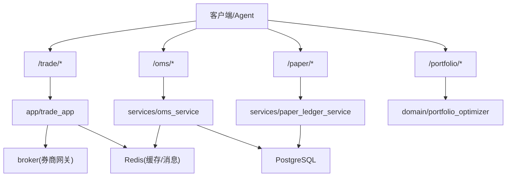
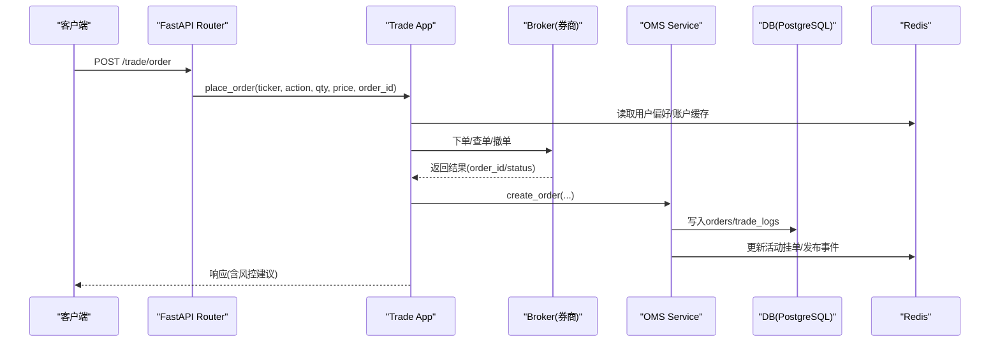
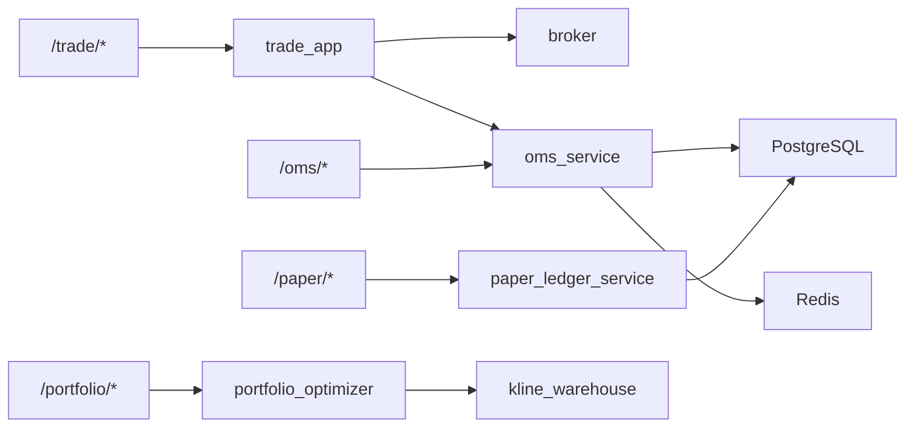

# 交易与订单管理API

<cite>
**本文引用的文件**
- [backend/routers/trade.py](file://backend/routers/trade.py)
- [backend/app/trade_app.py](file://backend/app/trade_app.py)
- [backend/routers/oms.py](file://backend/routers/oms.py)
- [backend/app/oms_app.py](file://backend/app/oms_app.py)
- [backend/services/oms_service.py](file://backend/services/oms_service.py)
- [backend/routers/paper.py](file://backend/routers/paper.py)
- [backend/services/paper_ledger_service.py](file://backend/services/paper_ledger_service.py)
- [backend/routers/portfolio.py](file://backend/routers/portfolio.py)
- [backend/domain/portfolio_optimizer.py](file://backend/domain/portfolio_optimizer.py)
- [backend/routers/auth.py](file://backend/routers/auth.py)
- [backend/core/models.py](file://backend/core/models.py)
</cite>

## 目录
1. [简介](#简介)
2. [项目结构](#项目结构)
3. [核心组件](#核心组件)
4. [架构总览](#架构总览)
5. [详细接口说明](#详细接口说明)
6. [依赖关系分析](#依赖关系分析)
7. [性能与可靠性](#性能与可靠性)
8. [故障排查指南](#故障排查指南)
9. [结论](#结论)
10. [附录：数据模型与示例](#附录数据模型与示例)

## 简介
本文件为 Quant Agent 的交易与订单管理 RESTful API 文档，覆盖实盘交易、纸面交易、仓位管理、组合优化等能力。文档包含：
- 订单创建、修改、撤销、查询的HTTP端点
- 实盘与纸面交易模式切换
- 风控检查（杠杆、ATR动态波动率）
- 成交回报处理与审计日志
- 多账户/权限控制（JWT鉴权）
- 完整的请求/响应结构与示例路径指引
- 面向开发者的集成指南

## 项目结构
后端采用分层设计：
- Router层：负责路由、参数校验、鉴权注入
- App层：用例编排（风控、缓存、下单分发、OMS持久化）
- Service层：领域服务（OMS、纸面账本、组合优化）
- Domain层：算法与策略（组合优化引擎）
- Core层：数据库模型、Redis客户端、安全与异常
- Workers：后台任务（OMS状态同步、Bot运行态）

图表来源
- [backend/routers/trade.py:10-57](file://backend/routers/trade.py#L10-L57)
- [backend/routers/oms.py:1-464](file://backend/routers/oms.py#L1-L464)
- [backend/routers/paper.py:1-218](file://backend/routers/paper.py#L1-L218)
- [backend/routers/portfolio.py:1-219](file://backend/routers/portfolio.py#L1-L219)
- [backend/app/trade_app.py:1-232](file://backend/app/trade_app.py#L1-L232)
- [backend/services/oms_service.py:1-276](file://backend/services/oms_service.py#L1-L276)
- [backend/services/paper_ledger_service.py:1-343](file://backend/services/paper_ledger_service.py#L1-L343)
- [backend/domain/portfolio_optimizer.py:1-200](file://backend/domain/portfolio_optimizer.py#L1-L200)

章节来源
- [backend/routers/trade.py:10-57](file://backend/routers/trade.py#L10-L57)
- [backend/routers/oms.py:1-464](file://backend/routers/oms.py#L1-L464)
- [backend/routers/paper.py:1-218](file://backend/routers/paper.py#L1-L218)
- [backend/routers/portfolio.py:1-219](file://backend/routers/portfolio.py#L1-L219)

## 核心组件
- 交易路由与编排：/trade/* 提供下单、账户信息、持仓摘要、交易日志；下单前进行杠杆与ATR动态波动率风控，并持久化到OMS与交易日志表
- OMS模块：/oms/* 提供活动订单、历史成交、改单、撤单、全局熔断、算法拆单、交易模式切换、WebSocket实时推送
- 纸面交易：/paper/* 提供组合CRUD、成交流水、净值序列、对比分析
- 组合优化：/portfolio/* 提供均值-方差、风险平价、最大Sharpe、有效前沿、多模型对比
- 鉴权与安全：/auth/* 提供登录、刷新、登出、Google OAuth验证；所有交易相关接口默认需要Bearer Token

章节来源
- [backend/routers/trade.py:10-57](file://backend/routers/trade.py#L10-L57)
- [backend/app/trade_app.py:35-187](file://backend/app/trade_app.py#L35-L187)
- [backend/routers/oms.py:56-371](file://backend/routers/oms.py#L56-L371)
- [backend/routers/paper.py:51-193](file://backend/routers/paper.py#L51-L193)
- [backend/routers/portfolio.py:114-218](file://backend/routers/portfolio.py#L114-L218)
- [backend/routers/auth.py:66-386](file://backend/routers/auth.py#L66-L386)

## 架构总览

图表来源
- [backend/routers/trade.py:30-57](file://backend/routers/trade.py#L30-L57)
- [backend/app/trade_app.py:35-187](file://backend/app/trade_app.py#L35-L187)
- [backend/services/oms_service.py:34-77](file://backend/services/oms_service.py#L34-L77)

## 详细接口说明

### 认证与权限
- 登录获取Token
  - POST /auth/login
  - 请求体：用户名、密码（OAuth2表单）
  - 响应：access_token、token_type、user
- 刷新Token
  - POST /auth/refresh
  - 通过Cookie中的refresh_token换取新的access_token
- 登出
  - POST /auth/logout
- Google OAuth验证
  - POST /auth/google/verify
  - 请求体：credential（Google ID Token）
  - 响应：access_token、user

注意：所有交易相关接口均需要携带有效的Bearer Token（除明确标注外）。

章节来源
- [backend/routers/auth.py:117-162](file://backend/routers/auth.py#L117-L162)
- [backend/routers/auth.py:305-346](file://backend/routers/auth.py#L305-L346)
- [backend/routers/auth.py:349-386](file://backend/routers/auth.py#L349-L386)
- [backend/routers/auth.py:204-299](file://backend/routers/auth.py#L204-L299)

### 实盘交易接口（/trade）
- 下单
  - POST /trade/order
  - 请求体字段：ticker、action（BUY/SELL）、qty、price、order_id
  - 风控：读取用户杠杆偏好、ATR动态波动率、资金敞口校验
  - 响应：status、message、data（券商返回）、risk_control.suggested_stop_loss（可选）
- 账户信息
  - GET /trade/account?market=HK|US
  - 响应：账户总资产、可用资金等
- 组合概览
  - GET /trade/portfolio
  - 响应：base_nav、sharpe、max_dd、margin_usage、exposure
- 交易日志
  - GET /trade/trades?limit=100
  - 响应：最近交易日志列表

章节来源
- [backend/routers/trade.py:30-57](file://backend/routers/trade.py#L30-L57)
- [backend/app/trade_app.py:35-187](file://backend/app/trade_app.py#L35-L187)
- [backend/app/trade_app.py:190-232](file://backend/app/trade_app.py#L190-L232)

### OMS订单管理（/oms）
- 初始状态
  - GET /oms/state
  - 返回：bots、active_orders、historical_trades、algo_executions、trading_mode
- 全局熔断
  - POST /oms/kill_switch
  - 请求体：timestamp
  - 行为：广播熔断信号、执行物理清仓、停止Bot/取消算法、标记订单CANCELLED
- 撤单
  - POST /oms/orders/{order_id}/cancel
  - 请求体：idempotency_key
  - 行为：幂等锁、Redis PubSub下发、DB状态更新、审计日志
- 改单
  - POST /oms/orders/{order_id}/modify
  - 请求体：price
  - 行为：Redis PubSub下发、DB价格更新、Redis同步、审计日志
- 真实持仓
  - GET /oms/positions?market=HK|US
  - 返回：从Redis缓存的最新持仓列表
- Bot控制
  - POST /oms/bots/{bot_id}/pause|resume|stop
- 算法拆单
  - POST /oms/algo/start
  - POST /oms/algo/{algo_id}/pause|resume|cancel
  - POST /oms/algo/analytics/{algo_id}
- 交易模式
  - GET /oms/mode
  - POST /oms/mode/switch
  - 模式：SANDBOX | PAPER | LIVE
- WebSocket实时推送
  - WS /oms/ws?token=<jwt>
  - 通道：bots_update、active_orders_update、new_trade、bot_log、algo_executions_update、positions_update、mode_change

章节来源
- [backend/routers/oms.py:56-371](file://backend/routers/oms.py#L56-L371)
- [backend/app/oms_app.py:24-54](file://backend/app/oms_app.py#L24-L54)
- [backend/services/oms_service.py:118-244](file://backend/services/oms_service.py#L118-L244)

### 纸面交易（/paper）
- 创建组合
  - POST /paper/portfolios
  - 请求体：name、strategy_name、code_hash、market、initial_capital、params、strategy_version_id、benchmark_backtest_ref
- 列出组合
  - GET /paper/portfolios?status=running|paused|closed
- 组合详情
  - GET /paper/portfolios/{portfolio_id}
  - 返回：组合信息与当前持仓
- 成交流水
  - GET /paper/portfolios/{portfolio_id}/fills?limit=50&offset=0
- 暂停/恢复/关闭
  - POST /paper/portfolios/{portfolio_id}/pause|resume|close
- 日终净值
  - GET /paper/portfolios/{portfolio_id}/nav?days=30
- 对比分析
  - GET /paper/portfolios/{portfolio_id}/compare?days=30
  - 返回：tracking_error、cumulative_drift、chart、paper_sharpe、paper_max_dd

章节来源
- [backend/routers/paper.py:51-193](file://backend/routers/paper.py#L51-L193)
- [backend/services/paper_ledger_service.py:26-343](file://backend/services/paper_ledger_service.py#L26-L343)

### 组合优化（/portfolio）
- 组合优化
  - POST /portfolio/optimize
  - 请求体：symbols、model（markowitz|risk_parity|max_sharpe|equal_weight）、max_weight、target_return、risk_free_rate、period
  - 返回：weights、expected_return、expected_volatility、sharpe_ratio、risk_contributions、effective_n
- 有效前沿
  - POST /portfolio/efficient-frontier
  - 请求体：symbols、n_points、max_weight、risk_free_rate、period
  - 返回：前沿点集（预期收益、波动率、Sharpe、权重）
- 多模型对比
  - POST /portfolio/compare
  - 请求体：symbols、max_weight、risk_free_rate、period
  - 返回：各模型结果对比

章节来源
- [backend/routers/portfolio.py:114-218](file://backend/routers/portfolio.py#L114-L218)
- [backend/domain/portfolio_optimizer.py:54-200](file://backend/domain/portfolio_optimizer.py#L54-L200)

## 依赖关系分析
- 交易链路依赖
  - trade router -> trade_app（风控+下单）-> broker（券商）-> oms_service（持久化）-> DB/Redis
- OMS链路依赖
  - oms router -> oms_service（订单状态同步、持仓缓存）-> DB/Redis + bot_runtime/algo_engine
- 纸面交易依赖
  - paper router -> paper_ledger_service -> DB（paper_fills、paper_positions、paper_nav_daily）
- 组合优化依赖
  - portfolio router -> portfolio_optimizer（scipy优化）-> kline_warehouse（历史收益率）

图表来源
- [backend/routers/trade.py:10-57](file://backend/routers/trade.py#L10-L57)
- [backend/app/trade_app.py:35-187](file://backend/app/trade_app.py#L35-L187)
- [backend/services/oms_service.py:1-276](file://backend/services/oms_service.py#L1-L276)
- [backend/routers/paper.py:1-218](file://backend/routers/paper.py#L1-L218)
- [backend/services/paper_ledger_service.py:1-343](file://backend/services/paper_ledger_service.py#L1-L343)
- [backend/routers/portfolio.py:1-219](file://backend/routers/portfolio.py#L1-L219)
- [backend/domain/portfolio_optimizer.py:1-200](file://backend/domain/portfolio_optimizer.py#L1-L200)

章节来源
- [backend/routers/trade.py:10-57](file://backend/routers/trade.py#L10-L57)
- [backend/app/trade_app.py:35-187](file://backend/app/trade_app.py#L35-L187)
- [backend/services/oms_service.py:1-276](file://backend/services/oms_service.py#L1-L276)
- [backend/routers/paper.py:1-218](file://backend/routers/paper.py#L1-L218)
- [backend/services/paper_ledger_service.py:1-343](file://backend/services/paper_ledger_service.py#L1-L343)
- [backend/routers/portfolio.py:1-219](file://backend/routers/portfolio.py#L1-L219)
- [backend/domain/portfolio_optimizer.py:1-200](file://backend/domain/portfolio_optimizer.py#L1-L200)

## 性能与可靠性
- 账户信息缓存：下单前账户总资产读取使用Redis缓存（TTL约5秒），避免高频穿透券商API
- 并发保护：账户信息读取使用异步锁防止重复调用；撤单使用Redis NX实现幂等性
- 实时性：OMS通过Redis PubSub推送订单、成交、持仓、模式变更等事件；前端通过WebSocket订阅
- 容错降级：组合优化在无法获取历史数据时回退到模拟数据；OMS持仓同步失败记录警告日志
- 熔断机制：全局Kill Switch可快速终止Bot、取消算法、标记订单为CANCELLED并执行市价平仓

章节来源
- [backend/app/trade_app.py:55-74](file://backend/app/trade_app.py#L55-L74)
- [backend/routers/oms.py:120-147](file://backend/routers/oms.py#L120-L147)
- [backend/routers/oms.py:379-464](file://backend/routers/oms.py#L379-L464)
- [backend/app/oms_app.py:24-54](file://backend/app/oms_app.py#L24-L54)
- [backend/routers/portfolio.py:56-108](file://backend/routers/portfolio.py#L56-L108)

## 故障排查指南
- 下单失败
  - 检查风控拦截：是否超出杠杆限制或ATR波动率过高导致强制降杠杆
  - 检查券商返回：broker返回error时抛出应用错误
- 订单未持久化
  - 检查OMS服务：create_order是否成功写入DB与Redis；查看日志中“订单已持久化”
- 改单/撤单无效
  - 检查幂等键：同一idempotency_key仅处理一次
  - 检查Redis通道：确认oms:order_modify/oms:order_cancel消息已发布
- 持仓不更新
  - 检查OMS持仓同步：定时任务是否拉取Futu账户信息并写入Redis
- 组合优化失败
  - 检查历史数据：kline_warehouse是否能获取足够K线；否则将回退到模拟数据
- 鉴权问题
  - 检查Token是否过期；使用/auth/refresh刷新；确保Cookie设置正确（生产环境SameSite=None+Secure）

章节来源
- [backend/app/trade_app.py:106-130](file://backend/app/trade_app.py#L106-L130)
- [backend/services/oms_service.py:34-77](file://backend/services/oms_service.py#L34-L77)
- [backend/routers/oms.py:120-177](file://backend/routers/oms.py#L120-L177)
- [backend/services/oms_service.py:155-193](file://backend/services/oms_service.py#L155-L193)
- [backend/routers/portfolio.py:56-108](file://backend/routers/portfolio.py#L56-L108)
- [backend/routers/auth.py:66-98](file://backend/routers/auth.py#L66-L98)

## 结论
本API体系提供了完整的交易与订单管理能力，涵盖实盘与纸面交易、风控检查、OMS状态同步、组合优化与审计日志。通过分层设计与Redis缓存/PubSub机制，系统在性能与可靠性方面具备良好基础。开发者可基于本文档快速集成交易系统，并结合WebSocket实现实时交互。

## 附录：数据模型与示例

### 数据模型
- 订单（Order）
  - 字段：order_id、symbol、side、order_type、qty、filled_qty、price、status、is_simulated、note、created_at
- 交易日志（TradeLog）
  - 字段：timestamp、ticker、action、price、qty、status、message
- 纸面组合（PaperPortfolio）
  - 字段：id、name、strategy_name、code_hash、market、initial_capital、params、status、created_at、closed_at
- 纸面成交（PaperFill）
  - 字段：id、portfolio_id、fill_seq、dt、symbol、side、qty、price、commission、slippage、intent_tag
- 纸面持仓（PaperPosition）
  - 字段：portfolio_id、symbol、qty、avg_cost、last_fill_seq
- 日终净值（PaperNavDaily）
  - 字段：portfolio_id、trade_date、nav、cash、market_value、daily_return、stale_symbols

章节来源
- [backend/core/models.py:53-64](file://backend/core/models.py#L53-L64)
- [backend/services/paper_ledger_service.py:26-343](file://backend/services/paper_ledger_service.py#L26-L343)

### 请求/响应示例（路径指引）
- 下单请求
  - 路径：POST /trade/order
  - 参考：[backend/routers/trade.py:30-39](file://backend/routers/trade.py#L30-L39)
  - 响应：包含status、message、data、risk_control（可选）
- 账户信息
  - 路径：GET /trade/account
  - 参考：[backend/routers/trade.py:42-44](file://backend/routers/trade.py#L42-L44)
- 组合概览
  - 路径：GET /trade/portfolio
  - 参考：[backend/routers/trade.py:47-50](file://backend/routers/trade.py#L47-L50)
- 交易日志
  - 路径：GET /trade/trades
  - 参考：[backend/routers/trade.py:53-57](file://backend/routers/trade.py#L53-L57)
- 撤单
  - 路径：POST /oms/orders/{order_id}/cancel
  - 参考：[backend/routers/oms.py:120-147](file://backend/routers/oms.py#L120-L147)
- 改单
  - 路径：POST /oms/orders/{order_id}/modify
  - 参考：[backend/routers/oms.py:149-177](file://backend/routers/oms.py#L149-L177)
- 持仓
  - 路径：GET /oms/positions
  - 参考：[backend/routers/oms.py:180-184](file://backend/routers/oms.py#L180-L184)
- 组合优化
  - 路径：POST /portfolio/optimize
  - 参考：[backend/routers/portfolio.py:114-175](file://backend/routers/portfolio.py#L114-L175)
- 纸面组合创建
  - 路径：POST /paper/portfolios
  - 参考：[backend/routers/paper.py:51-65](file://backend/routers/paper.py#L51-L65)
- 纸面成交流水
  - 路径：GET /paper/portfolios/{portfolio_id}/fills
  - 参考：[backend/routers/paper.py:87-96](file://backend/routers/paper.py#L87-L96)
- 纸面对比
  - 路径：GET /paper/portfolios/{portfolio_id}/compare
  - 参考：[backend/routers/paper.py:140-193](file://backend/routers/paper.py#L140-L193)
