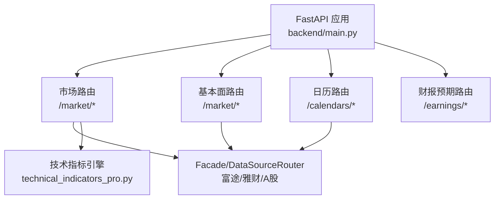
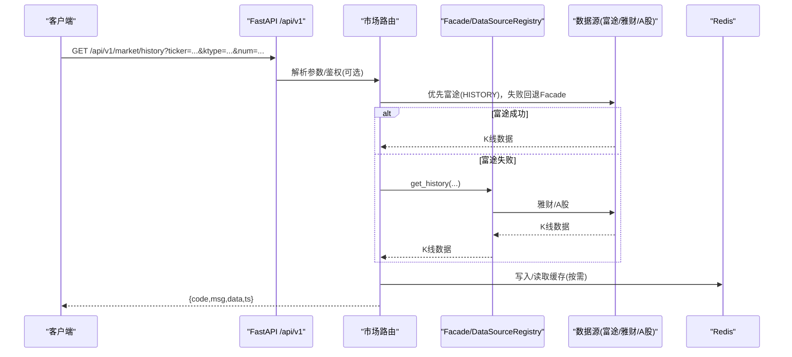
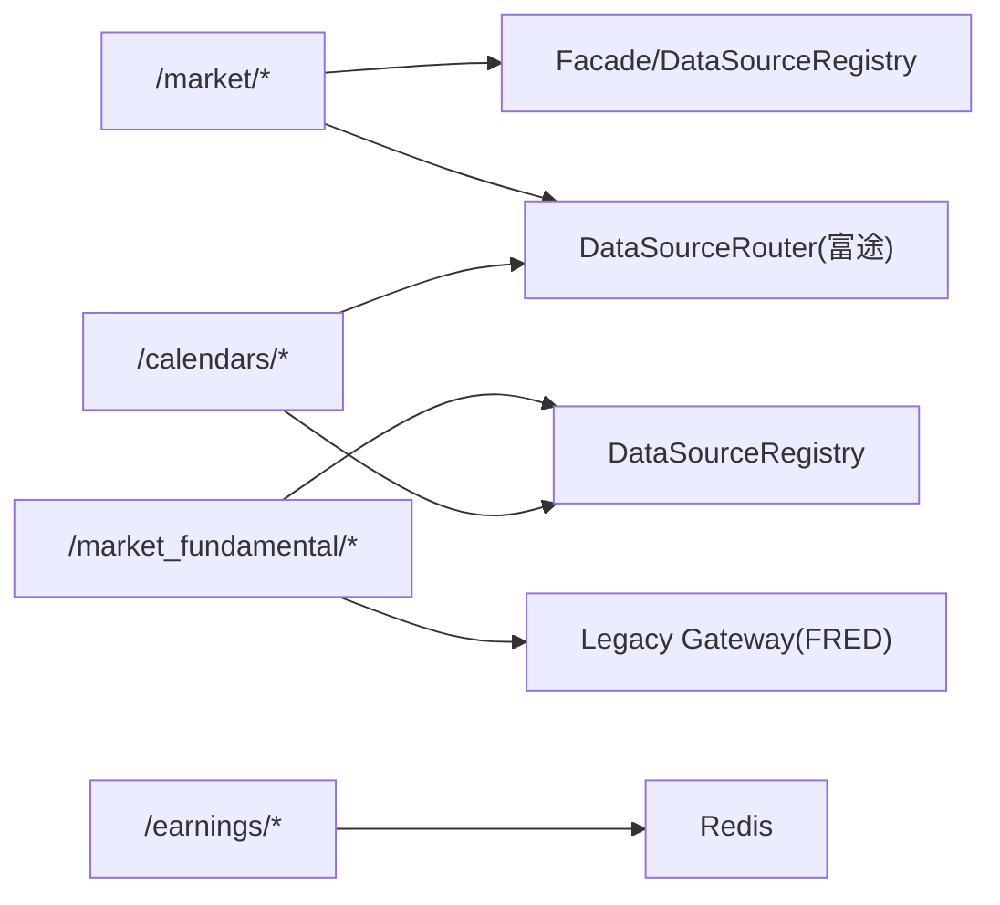
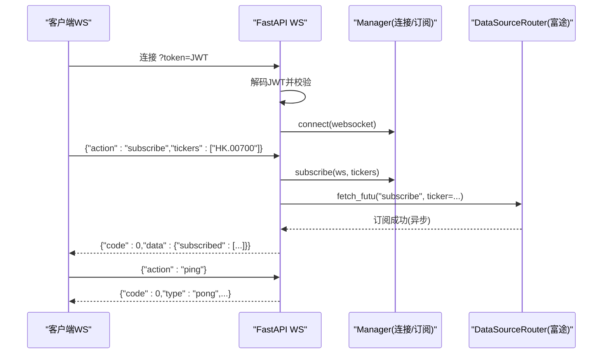

# 市场数据API

<cite>
**本文引用的文件**
- [backend/main.py](file://backend/main.py)
- [backend/routers/market.py](file://backend/routers/market.py)
- [backend/routers/market_fundamental.py](file://backend/routers/market_fundamental.py)
- [backend/routers/calendars.py](file://backend/routers/calendars.py)
- [backend/routers/earnings_router.py](file://backend/routers/earnings_router.py)
- [backend/utils/technical_indicators_pro.py](file://backend/utils/technical_indicators_pro.py)
- [backend/app/market_data.py](file://backend/app/market_data.py)
</cite>

## 目录
1. [简介](#简介)
2. [项目结构](#项目结构)
3. [核心组件](#核心组件)
4. [架构总览](#架构总览)
5. [详细接口说明](#详细接口说明)
6. [依赖关系分析](#依赖关系分析)
7. [性能与缓存策略](#性能与缓存策略)
8. [错误处理与降级](#错误处理与降级)
9. [WebSocket 实时推送](#websocket-实时推送)
10. [集成指南与优化建议](#集成指南与优化建议)
11. [故障排查](#故障排查)
12. [结论](#结论)

## 简介
本文件为 Quant Agent 的市场数据 RESTful API 文档，覆盖行情、基本面、日历事件与财报预期等能力。重点包括：
- 实时行情查询、历史K线获取、技术指标计算
- 资金流、盘口深度、期权链与波动率、板块热力图等扩展行情
- 新闻、事件、内幕交易、分析师共识等基本面数据
- 全球市场日历快照、分红/IPO 日历
- 财报预期基准值的增删改查
- WebSocket 多标的行情订阅与心跳保活
- 数据源路由（富途/雅财/A股源）、Redis 缓存与熔断限流、统一信封响应

所有端点统一挂载在 /api/v1 前缀下（由应用工厂装配）。

## 项目结构
- 应用入口与路由装配：backend/main.py
- 市场与期权行情：backend/routers/market.py
- 基本面/新闻/事件/内幕交易：backend/routers/market_fundamental.py
- 全球市场日历：backend/routers/calendars.py
- 财报预期管理：backend/routers/earnings_router.py
- 技术指标引擎：backend/utils/technical_indicators_pro.py
- 应用层门面：backend/app/market_data.py

图表来源
- [backend/main.py:125-200](file://backend/main.py#L125-L200)
- [backend/routers/market.py:45-1023](file://backend/routers/market.py#L45-L1023)
- [backend/routers/market_fundamental.py:23-730](file://backend/routers/market_fundamental.py#L23-L730)
- [backend/routers/calendars.py:33-638](file://backend/routers/calendars.py#L33-L638)
- [backend/routers/earnings_router.py:13-122](file://backend/routers/earnings_router.py#L13-L122)
- [backend/utils/technical_indicators_pro.py:175-200](file://backend/utils/technical_indicators_pro.py#L175-L200)

章节来源
- [backend/main.py:125-200](file://backend/main.py#L125-L200)

## 核心组件
- 路由层：按领域拆分 market、market_fundamental、calendars、earnings_router
- 服务层：通过 Facade/DataSourceRegistry/DataSourceRouter 选择数据源（富途、雅财、A股源）
- 缓存层：Redis 缓存热点数据（行情快照、新闻、日历、批量自选）
- 指标引擎：生产级技术指标计算（MA/EMA/MACD/RSI/Bollinger/ATR/OBV/VWAP/ADX/CCI/VWMA/atr_percent/elder_ray/keltner_channels）
- 实时通道：WebSocket 多标的订阅与进程内缓存回灌（broker/kline）

章节来源
- [backend/routers/market.py:45-1023](file://backend/routers/market.py#L45-L1023)
- [backend/routers/market_fundamental.py:23-730](file://backend/routers/market_fundamental.py#L23-L730)
- [backend/routers/calendars.py:33-638](file://backend/routers/calendars.py#L33-L638)
- [backend/routers/earnings_router.py:13-122](file://backend/routers/earnings_router.py#L13-L122)
- [backend/utils/technical_indicators_pro.py:175-200](file://backend/utils/technical_indicators_pro.py#L175-L200)

## 架构总览

图表来源
- [backend/routers/market.py:492-545](file://backend/routers/market.py#L492-L545)
- [backend/routers/calendars.py:279-423](file://backend/routers/calendars.py#L279-L423)

## 详细接口说明
以下接口均位于 /api/v1 前缀下。请求/响应遵循统一信封格式：{ code, msg, data, ts }（部分内部返回扁平 payload，由中间件统一包装）。

### 行情与K线
- GET /api/v1/market/quote
  - 参数：ticker
  - 行为：富途标的走 DataSourceRouter.fetch_futu("QUOTE")；非富途标的走 Facade（富途→雅财→A股）
  - 响应字段：source、degraded、latency_ms、cached 及业务字段
- GET /api/v1/market/history
  - 参数：ticker, ktype(K_DAY/K_1M/K_5M/K_15M/K_60M), num
  - 行为：富途优先，失败回退 Facade
  - 响应：data 为 K 线数组
- POST /api/v1/market/quotes/batch
  - 请求体：{ tickers: string[] }
  - 行为：从 Redis 缓存批量拉取自选行情（yf_macro_cache_*）
  - 响应：每个 ticker 的 last_price/change_pct/volume_str/source/status
- GET /api/v1/market/snapshot
  - 参数：tickers（逗号分隔）
  - 行为：批量实时快照（富途 SNAPSHOT）
  - 响应：data 包含 panel(count, avg_change, ups, downs, flats)
- GET /api/v1/market/fund-flow
  - 参数：ticker
  - 行为：资金流向（Facade）
- GET /api/v1/market/capital-distribution/{ticker}
  - 行为：主力筹码分层 + 背离信号
- GET /api/v1/market/top-brokers/{ticker}
  - 行为：十大买卖经纪商（富途）
- GET /api/v1/market/capital-flow/{ticker}?period_type=INTRADAY|HISTORICAL
  - 行为：个股资金流向时间序列
- GET /api/v1/market/order-book
  - 行为：实时 L2 盘口深度（富途 ORDER_BOOK）
- GET /api/v1/market/stock-basicinfo?market=HK|US|SG&sec_type=STOCK|ETF|IDX|WARRANT
  - 行为：全市场基本信息（富途 STOCK_BASICINFO）
- GET /api/v1/market/warrant-chain?ticker=...
  - 行为：港股窝轮/牛熊证链（若未实现则降级返回 degraded）
- GET /api/v1/market/search?q=...
  - 行为：本地词库搜索，空结果时降级到 Facade(YFinance)

章节来源
- [backend/routers/market.py:342-401](file://backend/routers/market.py#L342-L401)
- [backend/routers/market.py:408-460](file://backend/routers/market.py#L408-L460)
- [backend/routers/market.py:463-545](file://backend/routers/market.py#L463-L545)
- [backend/routers/market.py:800-838](file://backend/routers/market.py#L800-L838)
- [backend/routers/market.py:841-868](file://backend/routers/market.py#L841-L868)
- [backend/routers/market.py:939-972](file://backend/routers/market.py#L939-L972)

### 期权相关
- GET /api/v1/market/option-chain?ticker=...&expiration_date=YYYY-MM-DD
  - 行为：期权链（富途→雅财降级）
- GET /api/v1/market/option-iv-summary?ticker=...
  - 行为：期权 IV 指标聚合（ATM IV/IV分位/已实现波动/Skew）
- GET /api/v1/market/option-strategy-lab?ticker=...&strategy_type=STRANGLE|CALL|PUT&spread=5&underlying_price=...
  - 行为：期权损益实验室（策略曲线+盈亏平衡点+Greeks）
- GET /api/v1/market/option-volatility?ticker=...
  - 行为：单合约隐含波动率/历史波动率/Greeks

章节来源
- [backend/routers/market.py:548-657](file://backend/routers/market.py#L548-L657)

### 技术指标
- GET /api/v1/market/tech-indicators?ticker=...&lookback_days=90
  - 行为：先取历史K线（富途优先，否则Facade），再调用技术指标引擎计算
  - 响应：klines（最近10根）、indicators（完整指标序列）、source、degraded

章节来源
- [backend/routers/market.py:871-936](file://backend/routers/market.py#L871-L936)
- [backend/utils/technical_indicators_pro.py:175-200](file://backend/utils/technical_indicators_pro.py#L175-L200)

### 基本面、新闻、事件、内幕交易
- GET /api/v1/market/news?ticker=...&limit=10
  - 行为：Finnhub/Futu 新闻优先，失败降级 Yahoo；带细粒度锁防击穿；Redis 缓存
- GET /api/v1/market/events/{ticker}?days_back=30&days_ahead=30
  - 行为：财报/分红/重大新闻事件（合并排序）
- GET /api/v1/market/fundamental/{ticker}
  - 行为：宏观资产自动路由至 FRED；指数/ETF 特殊提示；否则 Facade(Futu/YFinance)
- GET /api/v1/market/fundamental/merged/{ticker}
  - 行为：三源合并（Futu+FMP+YFinance）
- GET /api/v1/market/short-selling/{ticker}[/{mode}]
  - 行为：卖空拥挤度监控（Futu/HKEX/SFC 交叉验证）
- GET /api/v1/market/holders/{ticker}
  - 行为：沪深港通 Top 机构持仓明细（仅非美股）
- GET /api/v1/market/insider-marquee?limit=10
  - 行为：全市场显著高管内幕交易跑马灯（Redis ZSET）
- GET /api/v1/market/insider-transactions?ticker=...&limit=50
  - 行为：个股内幕交易记录（Finnhub 优先，失败模拟数据）
- GET /api/v1/market/analyst-vs-fundamental/{ticker}
  - 行为：卖方共识 vs 实际基本面（交叉验证面板）

章节来源
- [backend/routers/market_fundamental.py:237-356](file://backend/routers/market_fundamental.py#L237-L356)
- [backend/routers/market_fundamental.py:359-437](file://backend/routers/market_fundamental.py#L359-L437)
- [backend/routers/market_fundamental.py:445-552](file://backend/routers/market_fundamental.py#L445-L552)
- [backend/routers/market_fundamental.py:555-600](file://backend/routers/market_fundamental.py#L555-L600)
- [backend/routers/market_fundamental.py:603-632](file://backend/routers/market_fundamental.py#L603-L632)
- [backend/routers/market_fundamental.py:635-700](file://backend/routers/market_fundamental.py#L635-L700)
- [backend/routers/market_fundamental.py:703-729](file://backend/routers/market_fundamental.py#L703-L729)

### 全球市场日历
- GET /api/v1/calendars/snapshot?force_refresh=false
  - 行为：按类目聚合的大类资产行情（Futu 优先，其次 yf 缓存，最后 on-demand 抓取）
- GET /api/v1/calendars/hours
  - 行为：全球市场交易时段矩阵（世界时钟）
- GET /api/v1/calendars/dividends?symbol=AAPL
  - 行为：分红日历（Finnhub 优先，限流退避）
- GET /api/v1/calendars/ipos
  - 行为：IPO 日历（Finnhub 优先，限流退避）

章节来源
- [backend/routers/calendars.py:449-480](file://backend/routers/calendars.py#L449-L480)
- [backend/routers/calendars.py:483-515](file://backend/routers/calendars.py#L483-L515)
- [backend/routers/calendars.py:522-579](file://backend/routers/calendars.py#L522-L579)
- [backend/routers/calendars.py:582-637](file://backend/routers/calendars.py#L582-L637)

### 财报预期
- GET /api/v1/earnings/expectations?ticker=...&period=...
  - 行为：读取 Redis 存储的预期基准值
- POST /api/v1/earnings/expectations
  - 请求体：{ ticker, period, expectations: [{metric, expected_low, expected_high, expected_value, unit, scenario, notes}] }
  - 行为：写入 Redis（TTL 1年）
- DELETE /api/v1/earnings/expectations?ticker=...&period=...
  - 行为：删除指定预期
- GET /api/v1/earnings/expectations/list?ticker=...
  - 行为：列出所有预期（可按 ticker 过滤）

章节来源
- [backend/routers/earnings_router.py:36-122](file://backend/routers/earnings_router.py#L36-L122)

### 实时数据只读
- GET /api/v1/market/broker/{symbol}
  - 行为：读取进程内 broker 缓存（来自 quant:broker:* 频道回灌）
- GET /api/v1/market/kline/{symbol}
  - 行为：读取进程内 kline 缓存（来自 quant:kline:* 频道回灌）

章节来源
- [backend/routers/market.py:982-1022](file://backend/routers/market.py#L982-L1022)

## 依赖关系分析
- 路由层依赖：
  - market.py：Facade/DataSourceRouter、Redis、TickerFormat、MarketEngine、KlineWarehouse
  - market_fundamental.py：Redis、DataSourceRegistry、Legacy Gateway（FRED）
  - calendars.py：Redis、DataSourceRegistry、Finnhub Router
  - earnings_router.py：Redis
- 外部数据源：
  - 富途（Futu OpenD/子服务）
  - 雅财（YFinance，内部或远程节点）
  - A股源（AkShare）
  - Finnhub（新闻/财报/分红/IPO）
  - FRED（宏观序列）

图表来源
- [backend/routers/market.py:19-29](file://backend/routers/market.py#L19-L29)
- [backend/routers/market_fundamental.py:15-22](file://backend/routers/market_fundamental.py#L15-L22)
- [backend/routers/calendars.py:30-33](file://backend/routers/calendars.py#L30-L33)
- [backend/routers/earnings_router.py:11-13](file://backend/routers/earnings_router.py#L11-L13)

章节来源
- [backend/routers/market.py:19-29](file://backend/routers/market.py#L19-L29)
- [backend/routers/market_fundamental.py:15-22](file://backend/routers/market_fundamental.py#L15-L22)
- [backend/routers/calendars.py:30-33](file://backend/routers/calendars.py#L30-L33)
- [backend/routers/earnings_router.py:11-13](file://backend/routers/earnings_router.py#L11-L13)

## 性能与缓存策略
- Redis 缓存
  - 自选批量行情：yf_macro_cache_{yf_code.lower()}，TTL 由采集守护更新
  - 新闻：cache:market:news:{ticker}:{limit}，TTL 300s
  - 日历快照：calendars_snapshot，TTL 120~180s
  - 分红/IPO：calendars_dividends:{symbol}, calendars_ipos:all，TTL 21600s
  - 财报预期：quant:earnings:expectations:{ticker}:{period}，TTL 1年
- 进程内缓存
  - broker/kline 实时数据：消费 quant:broker:* / quant:kline:* 频道，TTL 约 5s
- 限流与退避
  - Finnhub 限流退避：rate_limit_registry.get_throttler("finnhub")，遇 429 直接降级
- 指标计算缓存
  - TechnicalIndicatorsEngine 使用基于输入参数的 MD5 键缓存，TTL 300s

章节来源
- [backend/routers/market.py:408-460](file://backend/routers/market.py#L408-L460)
- [backend/routers/market_fundamental.py:247-356](file://backend/routers/market_fundamental.py#L247-L356)
- [backend/routers/calendars.py:449-480](file://backend/routers/calendars.py#L449-L480)
- [backend/routers/calendars.py:522-579](file://backend/routers/calendars.py#L522-L579)
- [backend/routers/earnings_router.py:42-70](file://backend/routers/earnings_router.py#L42-L70)
- [backend/routers/market.py:982-1022](file://backend/routers/market.py#L982-L1022)
- [backend/utils/technical_indicators_pro.py:136-169](file://backend/utils/technical_indicators_pro.py#L136-L169)

## 错误处理与降级
- 统一信封：中间件将业务 payload 包装为 {code,msg,data,ts}；facade 返回扁平 payload 时自动注入 source/degraded
- 数据源降级：
  - 行情：富途 → Facade（雅财/A股）
  - 历史K线：富途 → Facade
  - 新闻：Finnhub/Futu → Yahoo 兜底
  - 日历：Futu → yf 缓存 → on-demand yfinance
- 错误码与消息：
  - HTTP 400：参数错误或数据源不可用（detail 含原因）
  - HTTP 500：内部异常（如富途子服务不可达）
  - 降级标志：degraded=true，附带 degraded_message
- 熔断与限流：
  - Finnhub 限流退避：遇到 rate_limit 直接返回 degraded/unavailable
  - 健康探测：/health/services 汇总各数据源状态

章节来源
- [backend/routers/market.py:342-401](file://backend/routers/market.py#L342-L401)
- [backend/routers/market.py:492-545](file://backend/routers/market.py#L492-L545)
- [backend/routers/market_fundamental.py:237-356](file://backend/routers/market_fundamental.py#L237-L356)
- [backend/routers/calendars.py:522-579](file://backend/routers/calendars.py#L522-L579)
- [backend/routers/market.py:228-327](file://backend/routers/market.py#L228-L327)

## WebSocket 实时推送
- 端点：ws://host/api/v1/market/quotes/ws?token=<JWT>
- 认证：Query String token 校验（HS256）
- 心跳：ping/pong，超时 60s 无心跳断开
- 订阅协议：
  - action: subscribe | unsubscribe | ping
  - tickers: 字符串或逗号分隔；自动格式化为富途强前缀
  - last_ids: 增量同步（可选）
- 响应：
  - 订阅确认：{code:0, data:{subscribed, already_subscribed}}
  - 取消确认：{code:0, data:{unsubscribed}}
  - 心跳响应：{code:0, type:"pong", data:{client_ts, server_ts, subscriptions}}
- 背压保护：慢客户端自动 drop-oldest
- 数据回灌：新订阅会异步回传子服务建立真实订阅（富途），释放时异步退订

图表来源
- [backend/routers/market.py:73-226](file://backend/routers/market.py#L73-L226)

章节来源
- [backend/routers/market.py:73-226](file://backend/routers/market.py#L73-L226)

## 集成指南与优化建议
- 接入步骤
  1) 配置环境变量：SECRET_KEY、FINNHUB_API_KEY、允许跨域域名
  2) 前端通过 /api/v1 访问；WebSocket 连接携带 JWT
  3) 首次加载：调用 /calendars/snapshot 获取大类资产快照
  4) 个股页面：调用 /market/quote、/market/history、/market/tech-indicators
  5) 实时看板：WebSocket 订阅 tickers，配合 /market/broker/{symbol} 与 /market/kline/{symbol} 做兜底
- 性能优化
  - 批量查询：使用 /market/quotes/batch 减少请求数
  - 缓存命中：合理设置 lookback_days，避免过大窗口导致计算耗时
  - 指标计算：利用内置缓存，避免重复计算相同参数
  - 限流友好：对 Finnhub 相关接口进行重试退避，避免触发 429
  - 降级策略：富途不可用时自动回退雅财/A股源，保证可用性
- 最佳实践
  - 使用 format_ticker 标准化 tickers（如 HK.00700）
  - 关注 response 中的 source/degraded/latency_ms/cached 元信息
  - 对关键路径（新闻/日历）启用 force_refresh 仅在必要时绕过缓存

章节来源
- [backend/routers/market.py:73-226](file://backend/routers/market.py#L73-L226)
- [backend/routers/market.py:408-460](file://backend/routers/market.py#L408-L460)
- [backend/routers/market.py:871-936](file://backend/routers/market.py#L871-L936)
- [backend/routers/calendars.py:449-480](file://backend/routers/calendars.py#L449-L480)

## 故障排查
- 富途连接状态
  - 查看 /market/futu/status 与 /health/services 判断 OpenD 可达性
- 数据源不可用
  - 检查 FINNHUB_API_KEY 是否配置
  - 观察 Finnhub 限流退避（degraded/unavailable）
- 缓存问题
  - 清理 Redis 对应 key（如 yf_macro_cache_*、calendars_snapshot）
  - 使用 force_refresh=true 强制刷新
- 技术指标计算失败
  - 确认历史K线返回为 list；若为信封需解包
  - 检查 lookback_days 是否过小导致无法计算

章节来源
- [backend/routers/market.py:228-327](file://backend/routers/market.py#L228-L327)
- [backend/routers/calendars.py:522-579](file://backend/routers/calendars.py#L522-L579)
- [backend/routers/market.py:871-936](file://backend/routers/market.py#L871-L936)

## 结论
本 API 以模块化路由与统一 Facade/DataSourceRouter 为核心，结合 Redis 缓存与进程内实时缓存，提供高可用、可扩展的市场数据能力。通过富途优先、雅财/A股兜底的降级策略，以及 Finnhub 限流退避，确保在不同网络与配额条件下稳定输出。开发者可据此快速集成行情、基本面、日历与财报预期等能力，并通过 WebSocket 获得低延迟实时数据。