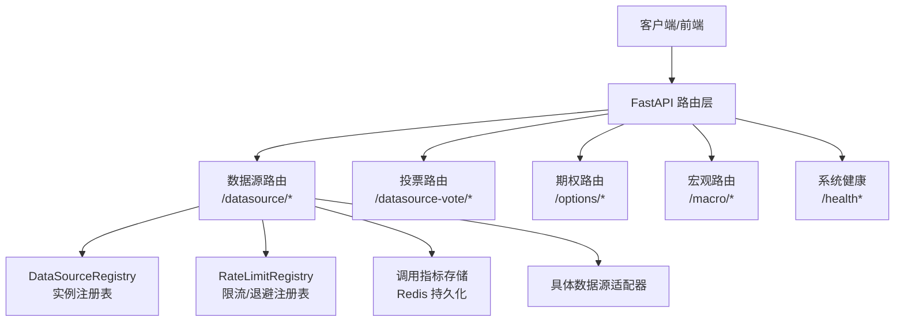
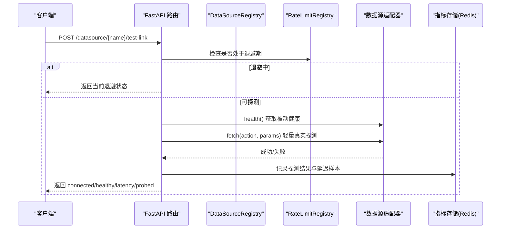
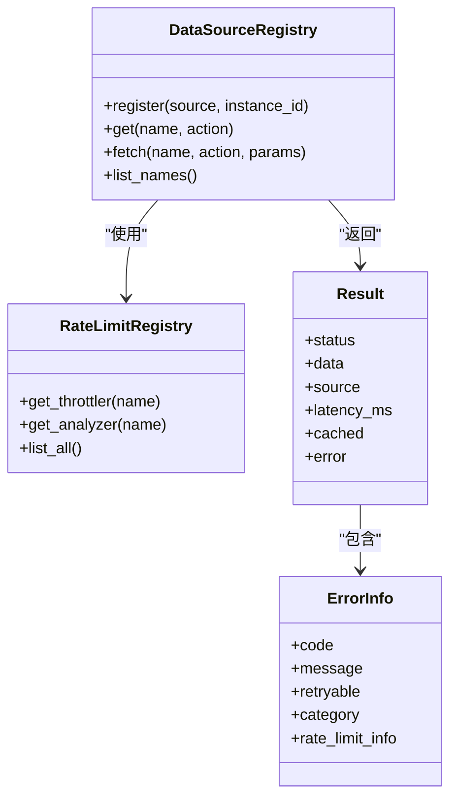

# 数据源管理API

<cite>
**本文引用的文件**
- [backend/routers/datasource.py](file://backend/routers/datasource.py)
- [backend/routers/datasource_vote.py](file://backend/routers/datasource_vote.py)
- [backend/routers/options.py](file://backend/routers/options.py)
- [backend/routers/macro.py](file://backend/routers/macro.py)
- [backend/routers/system_health.py](file://backend/routers/system_health.py)
- [backend/services/datasource/__init__.py](file://backend/services/datasource/__init__.py)
- [backend/services/datasource/registry.py](file://backend/services/datasource/registry.py)
- [backend/services/datasource/source_registry.py](file://backend/services/datasource/source_registry.py)
</cite>

## 目录
1. [简介](#简介)
2. [项目结构](#项目结构)
3. [核心组件](#核心组件)
4. [架构总览](#架构总览)
5. [详细组件分析](#详细组件分析)
6. [依赖关系分析](#依赖关系分析)
7. [性能与一致性](#性能与一致性)
8. [故障排查指南](#故障排查指南)
9. [结论](#结论)
10. [附录：接口清单与示例](#附录接口清单与示例)

## 简介
本文件面向开发者，系统化说明 Quant Agent 的数据源管理 RESTful API，覆盖数据源注册、健康检查、质量评估、数据同步（主动探测）、多数据源路由、负载均衡与故障转移策略；并给出期权数据与宏观经济数据的 HTTP 端点。文档包含 URL 路径、请求参数、响应格式、JSON 示例、错误码与最佳实践，帮助快速集成与管理数据源。

## 项目结构
后端通过 FastAPI Router 暴露数据源相关能力：
- 数据源限流与健康看板：/datasource/*
- 数据源贡献投票：/datasource-vote/*
- 期权数据：/options/*
- 宏观经济数据：/macro/*
- 系统健康与就绪探针：/health*

图表来源
- [backend/routers/datasource.py:155-351](file://backend/routers/datasource.py#L155-L351)
- [backend/services/datasource/source_registry.py:41-133](file://backend/services/datasource/source_registry.py#L41-L133)
- [backend/services/datasource/registry.py:29-99](file://backend/services/datasource/registry.py#L29-L99)

章节来源
- [backend/routers/datasource.py:1-707](file://backend/routers/datasource.py#L1-L707)
- [backend/routers/datasource_vote.py:1-149](file://backend/routers/datasource_vote.py#L1-L149)
- [backend/routers/options.py:1-253](file://backend/routers/options.py#L1-L253)
- [backend/routers/macro.py:1-296](file://backend/routers/macro.py#L1-L296)
- [backend/routers/system_health.py:1-421](file://backend/routers/system_health.py#L1-L421)

## 核心组件
- 数据源实例注册表 DataSourceRegistry：维护已注册的 DataSourceInterface 实例，支持按名称获取首个可用实例，并按 capability 严格匹配 action。
- 限流/退避注册表 RateLimitRegistry：为每个数据源提供 Throttler（退避）与 Analyzer（频率分析），用于限流检测、退避冷却与统计。
- 统一结果模型 Result/ErrorInfo/HealthInfo：标准化返回结构、错误分类与限流信息。
- 健康看板与主动探测：聚合各数据源健康状态、延迟分布、错误率趋势、可用性时间线，并提供 test-link 主动探测。
- 投票机制：基于 Redis 的每用户每日限一票，持久化计数与去重。
- 期权与宏观数据：封装市场数据与宏观数据查询，提供筛选、IV 分析、日历等能力。

章节来源
- [backend/services/datasource/source_registry.py:41-200](file://backend/services/datasource/source_registry.py#L41-L200)
- [backend/services/datasource/registry.py:29-99](file://backend/services/datasource/registry.py#L29-L99)
- [backend/services/datasource/__init__.py:23-468](file://backend/services/datasource/__init__.py#L23-L468)

## 架构总览
数据源管理采用“路由层 + 注册表 + 适配器”的分层设计：
- 路由层负责 HTTP 映射、鉴权、参数校验与编排。
- 注册表层负责实例管理与限流/退避控制。
- 适配器层实现具体上游数据源的 fetch/health/capabilities。

图表来源
- [backend/routers/datasource.py:487-642](file://backend/routers/datasource.py#L487-L642)
- [backend/services/datasource/source_registry.py:140-200](file://backend/services/datasource/source_registry.py#L140-L200)
- [backend/services/datasource/registry.py:29-99](file://backend/services/datasource/registry.py#L29-L99)

## 详细组件分析

### 数据源健康与限流看板（/datasource/*）
- GET /datasource/{name}/rate-limit-analysis
  - 作用：查询指定数据源的限流频率分析结果（窗口支持 24h/7d）。
  - 参数：window（可选，如 24h、7d）
  - 响应字段：estimated_limit_rpm、recommended_interval_seconds、peak_hours、avg_recovery_seconds、confidence、history
- GET /datasource/{name}/rate-limit-status
  - 作用：查询实时退避状态（是否退避、截止时间、连续限流次数、估计 RPM、退避策略）
- GET /datasource/rate-limit-overview
  - 作用：所有数据源的限流状态总览
- GET /datasource/finnhub/health
  - 作用：Finnhub 数据源健康检查（限流感知，不消耗免费配额）
- GET /datasource/health-overview
  - 作用：统一健康看板卡片矩阵（connected、status、延迟、成功率、限流数等）
- GET /datasource/{name}/health
  - 作用：单数据源健康详情
- GET /datasource/router/health
  - 作用：YFinance 主/备节点健康看板（节点级状态）
- GET /datasource/{name}/latency-distribution?hours=24
  - 作用：延迟分布直方图数据
- GET /datasource/{name}/error-rate-trend?hours=24
  - 作用：错误率趋势折线图数据
- GET /datasource/rate-limit-heatmap?days=7
  - 作用：限流热力图（多源过去 N 天）
- GET /datasource/{name}/availability-timeline?hours=24
  - 作用：可用性时间线
- POST /datasource/{name}/test-link
  - 作用：主动链路探测（尊重退避、并发限制、per-source 串行锁）
  - 响应关键字段：connected、healthy、status、latency_ms、probed、validated、error、tested_at
- WS /datasource/ws/health?token=<jwt>
  - 作用：实时推送健康概览与 STALE 报警（15s 轮询）

章节来源
- [backend/routers/datasource.py:65-152](file://backend/routers/datasource.py#L65-L152)
- [backend/routers/datasource.py:155-183](file://backend/routers/datasource.py#L155-L183)
- [backend/routers/datasource.py:196-351](file://backend/routers/datasource.py#L196-L351)
- [backend/routers/datasource.py:354-455](file://backend/routers/datasource.py#L354-L455)
- [backend/routers/datasource.py:487-642](file://backend/routers/datasource.py#L487-L642)
- [backend/routers/datasource.py:645-707](file://backend/routers/datasource.py#L645-L707)

### 数据源贡献投票（/datasource-vote/*）
- GET /datasource-vote/board
  - 作用：需求看板（已接入/开发中/社区投票中 + 票数 + 今日已投）
  - 鉴权：需要登录用户
- POST /datasource-vote/vote
  - 作用：投票（防刷票：每用户每源每日限一票）
  - 请求体：{ "source": "fred|dbnomics|rbi|..." }
  - 响应：ok、source、votes

章节来源
- [backend/routers/datasource_vote.py:69-149](file://backend/routers/datasource_vote.py#L69-L149)

### 期权数据（/options/*）
- GET /options/greeks/{ticker}?expiry=YYYY-MM-DD
  - 作用：计算指定标的期权 Greeks
- POST /options/screen
  - 作用：期权高级筛选（IV Rank/Delta/成交量/持仓量/到期日等）
- GET /options/vol-smile/{ticker}?expiry=YYYY-MM-DD
  - 作用：波动率微笑曲线分析
- GET /options/iv-rank/{ticker}
  - 作用：IV Rank/Percentile（惰性落库历史 IV）
- GET /options/chain-matrix/{ticker}?max_expiries=8&max_strikes=21
  - 作用：跨到期日的 IV 波动率曲面（前端热力图用）

章节来源
- [backend/routers/options.py:41-253](file://backend/routers/options.py#L41-L253)

### 宏观经济数据（/macro/*）
- GET /macro/calendar?days_ahead=7&days_back=0
  - 作用：全球经济体宏观日历（过去/未来）
- GET /macro/series?series_id=...&limit=100&force_refresh=false
  - 作用：FRED 宏观时间序列
- GET /macro/economic-calendar?days_ahead=7&days_back=0&prefer_sources=[...]
  - 作用：Facade 聚合 fred/dbnomics/rbi 的宏观日历
- GET /macro/fed-watch?prefer_sources=[futu]
  - 作用：FedWatch 面板（隐含利率 + 政策斜率）
- GET /macro/sentiment-history?limit=200
  - 作用：情绪风向标历史（P/C Ratio、VIX、Credit Spread）
- GET /macro/sector-fund-flow
  - 作用：板块资金流向
- GET /macro/capital-flow
  - 作用：跨市场资金流向
- GET /macro/capital-flow-dashboard?force_refresh=false
  - 作用：北向/南向 + 三市场板块资金流聚合看板
- GET /macro/news?category=general&limit=50
  - 作用：全球市场前沿新闻
- GET /macro/dashboard?force_refresh=false&days_back=3
  - 作用：大盘看板所需的核心数据聚合
- GET /macro/earnings?days_ahead=7&days_back=0&force_refresh=false
  - 作用：财报日历
- GET /macro/assets?force_refresh=false
  - 作用：大类资产与宏观风险雷达
- GET /macro/margin-trading
  - 作用：三个市场的融资融券余额
- WS /macro/news/ws?token=<jwt>
  - 作用：实时推送最新宏观新闻
- WS /macro/calendar/ws?token=<jwt>
  - 作用：推送当天宏观事件报警

章节来源
- [backend/routers/macro.py:42-148](file://backend/routers/macro.py#L42-L148)
- [backend/routers/macro.py:155-296](file://backend/routers/macro.py#L155-L296)

### 系统健康与就绪探针（/health*）
- GET /health
  - 作用：进程存活（liveness）
- GET /health/live
  - 作用：进程存活（liveness）
- GET /health/ready
  - 作用：就绪探针（readiness）：Redis + Postgres + 至少一个数据源连通
- GET /health/deep
  - 作用：全链路诊断（组件健康、PG、数据源就绪、采集器心跳、WS 连接数、线程池使用率、事件循环 lag、熔断器状态）
- GET /cluster
  - 作用：节点状态概览

章节来源
- [backend/routers/system_health.py:173-366](file://backend/routers/system_health.py#L173-L366)

## 依赖关系分析
- 路由层依赖注册表进行实例选择与限流控制。
- 限流/退避注册表独立于实例注册表，避免职责耦合。
- 指标存储（Redis）用于今日调用计数、延迟样本、错误率趋势、可用性时间线与限流热力图。
- 健康看板通过并发 gather 聚合多个数据源的健康卡片，保证低延迟渲染。

图表来源
- [backend/services/datasource/source_registry.py:41-200](file://backend/services/datasource/source_registry.py#L41-L200)
- [backend/services/datasource/registry.py:29-99](file://backend/services/datasource/registry.py#L29-L99)
- [backend/services/datasource/__init__.py:227-306](file://backend/services/datasource/__init__.py#L227-L306)

章节来源
- [backend/services/datasource/source_registry.py:41-200](file://backend/services/datasource/source_registry.py#L41-L200)
- [backend/services/datasource/registry.py:29-99](file://backend/services/datasource/registry.py#L29-L99)
- [backend/services/datasource/__init__.py:23-468](file://backend/services/datasource/__init__.py#L23-L468)

## 性能与一致性
- 多数据源路由与负载均衡
  - 通过 DataSourceRegistry.get(name, action) 选取首个可用实例；当传入 action 时，会按 capabilities 严格匹配，避免静默回退到不兼容实例。
  - 可通过环境变量 DATASOURCE_LOOSE_CAPABILITY=1 恢复旧行为（过渡期建议关闭）。
- 故障转移策略
  - 限流类错误（RATE_LIMIT/QUOTA_EXHAUSTED/IP_BLOCKED）走独立退避机制，不计入熔断器失败计数，避免误杀整节点。
  - 熔断器 OPEN 时直接返回错误，不调用具体源，降低雪崩风险。
  - YFinance 主/备节点健康看板支持节点级状态展示，便于切换与降级。
- 数据一致性与版本管理
  - 调用指标经 Redis 持久化（今日计数、延迟样本、错误率趋势、可用性时间线、限流热力图），重启不丢。
  - 期权 IV 历史惰性落库，累积真实快照后自动生效 IV Rank/Percentile。
  - 宏观数据支持 force_refresh 绕过缓存拉取最新数据。
- 质量评估与监控
  - 健康看板综合 connected、status、延迟、成功率、限流数等指标；支持延迟分布、错误率趋势、可用性时间线、限流热力图。
  - 系统健康探针提供 liveness/readiness/deep 分级检查，便于 K8s 编排。

章节来源
- [backend/services/datasource/source_registry.py:98-133](file://backend/services/datasource/source_registry.py#L98-L133)
- [backend/services/datasource/__init__.py:23-468](file://backend/services/datasource/__init__.py#L23-L468)
- [backend/routers/options.py:172-224](file://backend/routers/options.py#L172-L224)
- [backend/routers/macro.py:51-148](file://backend/routers/macro.py#L51-L148)
- [backend/routers/datasource.py:196-351](file://backend/routers/datasource.py#L196-L351)

## 故障排查指南
- 常见错误与处理
  - 未知数据源：404 unknown source
  - 数据源未注册或不可用：SOURCE_NOT_FOUND
  - 限流退避：返回 rate_limited，携带 retry_after
  - 熔断器打开：CIRCUIT_OPEN，跳过调用
  - 健康探针失败：不影响整体看板，仅标记 last_error
- 排查步骤
  - 使用 /health/ready 确认基础设施就绪（Redis/PG/数据源）
  - 使用 /health/deep 查看组件健康、事件循环 lag、熔断器状态
  - 使用 /datasource/health-overview 与 /datasource/{name}/health 定位具体数据源问题
  - 使用 /datasource/{name}/latency-distribution 与 /datasource/{name}/error-rate-trend 观察延迟与错误趋势
  - 使用 /datasource/{name}/test-link 主动探测链路（尊重退避与并发限制）

章节来源
- [backend/routers/system_health.py:173-366](file://backend/routers/system_health.py#L173-L366)
- [backend/routers/datasource.py:196-351](file://backend/routers/datasource.py#L196-L351)
- [backend/services/datasource/source_registry.py:140-200](file://backend/services/datasource/source_registry.py#L140-L200)

## 结论
Quant Agent 的数据源管理 API 提供了完善的健康检查、限流退避、质量评估与主动探测能力，并通过注册表与适配器解耦实现多数据源路由与故障转移。结合期权与宏观数据接口，可为上层应用提供稳定、可观测、可扩展的数据服务。建议在生产环境启用 readiness/deep 探针，配合 Redis 指标与看板持续优化数据源质量与稳定性。

## 附录：接口清单与示例

### 数据源健康与限流
- GET /datasource/{name}/rate-limit-analysis?window=24h
  - 响应示例：
    {
      "estimated_limit_rpm": 120,
      "recommended_interval_seconds": 0.5,
      "peak_hours": ["10:00","14:00"],
      "avg_recovery_seconds": 12.3,
      "confidence": 0.85,
      "history": []
    }
- GET /datasource/{name}/rate-limit-status
  - 响应示例：
    {
      "source": "yfinance",
      "is_throttled": false,
      "throttle_until": null,
      "consecutive_rate_limits": 0,
      "estimated_rpm": 100,
      "backoff_strategy": "none"
    }
- GET /datasource/rate-limit-overview
  - 响应示例：
    {
      "sources": [
        {"source":"yfinance","is_throttled":false,"consecutive_rate_limits":0,"total_rate_limits_1h":0,"estimated_limit_rpm":100,"backoff_strategy":"none"}
      ],
      "total": 1
    }
- GET /datasource/finnhub/health
  - 响应示例：
    {
      "source": "finnhub",
      "healthy": true,
      "mode": "external_rest",
      "connected": true,
      "last_error": null,
      "rate_limit_status": {"is_throttled":false,"throttle_until":null,"estimated_rpm":null,"estimated_limit_rpm":null,"consecutive_rate_limits":0,"total_rate_limit_1h":0,"backoff_strategy":"none","category":null}
    }
- GET /datasource/health-overview
  - 响应示例：
    {
      "sources": [
        {"source":"yfinance","status":"healthy","connected":true,"latency_ms":45.2,"today_calls":1200,"success_rate":0.99,"rate_limit_count":2,"rl_category":"normal","rl_breakdown":{},"probe_calls":1,"metric_source":"redis","last_request_ts":1710000000,"last_success_ts":1710000000,"is_throttled":false,"consecutive_rate_limits":0,"backoff_strategy":"none","latency_avg_ms":40,"latency_p95_ms":80,"latency_min_ms":20,"latency_max_ms":120,"latency_samples":[],"health_error":null}
      ],
      "total": 1,
      "generated_at": 1710000000
    }
- GET /datasource/{name}/health
  - 响应同健康卡片字段
- GET /datasource/router/health
  - 响应示例：
    {
      "router_enabled": true,
      "yfinance": {
        "nodes": [
          {"name":"yf_primary","role":"primary","url":"...","status":"healthy"},
          {"name":"yf_backup_1","role":"backup","url":"...","status":"healthy"}
        ],
        "primary_count": 1,
        "backup_count": 1
      }
    }
- GET /datasource/{name}/latency-distribution?hours=24
  - 响应示例：
    {
      "source": "yfinance",
      "buckets": [{"range":"0-50ms","count":100},{"range":"50-100ms","count":50}],
      "total_samples": 150,
      "avg_ms": 65.0,
      "p50_ms": 60.0,
      "p95_ms": 120.0
    }
- GET /datasource/{name}/error-rate-trend?hours=24
  - 响应示例：
    {
      "source": "yfinance",
      "trend": [{"ts":1710000000,"error_rate":0.01},{"ts":1710003600,"error_rate":0.02}]
    }
- GET /datasource/rate-limit-heatmap?days=7
  - 响应示例：
    {
      "heatmap": [{"date":"2024-01-01","rate_limit_count":5},{"date":"2024-01-02","rate_limit_count":3}]
    }
- GET /datasource/{name}/availability-timeline?hours=24
  - 响应示例：
    {
      "source": "yfinance",
      "timeline": [{"ts":1710000000,"available":true},{"ts":1710003600,"available":true}]
    }
- POST /datasource/{name}/test-link
  - 请求体：无
  - 响应示例：
    {
      "source": "yfinance",
      "connected": true,
      "healthy": true,
      "status": "ok",
      "latency_ms": 45.2,
      "probed": true,
      "validated": true,
      "error": null,
      "tested_at": "2024-01-01T12:00:00Z"
    }
- WS /datasource/ws/health?token=<jwt>
  - 消息类型：overview/alert

章节来源
- [backend/routers/datasource.py:65-152](file://backend/routers/datasource.py#L65-L152)
- [backend/routers/datasource.py:155-183](file://backend/routers/datasource.py#L155-L183)
- [backend/routers/datasource.py:196-351](file://backend/routers/datasource.py#L196-L351)
- [backend/routers/datasource.py:354-455](file://backend/routers/datasource.py#L354-L455)
- [backend/routers/datasource.py:487-642](file://backend/routers/datasource.py#L487-L642)
- [backend/routers/datasource.py:645-707](file://backend/routers/datasource.py#L645-L707)

### 数据源贡献投票
- GET /datasource-vote/board
  - 响应示例：
    {
      "connected": [{"name":"fred","label":"FRED 宏观经济","desc":"...","votes":10}],
      "developing": [{"name":"polygon","label":"Polygon.io","desc":"...","votes":0}],
      "voting": [{"name":"binance","label":"Binance","desc":"...","votes":5}],
      "my_votes_today": ["fred"]
    }
- POST /datasource-vote/vote
  - 请求体：{"source": "fred"}
  - 响应示例：
    {"ok": true, "source": "fred", "votes": 11}

章节来源
- [backend/routers/datasource_vote.py:69-149](file://backend/routers/datasource_vote.py#L69-L149)

### 期权数据
- GET /options/greeks/{ticker}?expiry=YYYY-MM-DD
  - 响应示例：
    {
      "status": "success",
      "ticker": "AAPL",
      "spot_price": 175.5,
      "risk_free_rate": 0.05,
      "options": []
    }
- POST /options/screen
  - 请求体：{"ticker":"AAPL","iv_rank_min":0.3,"delta_min":-0.5,"min_volume":1000}
  - 响应示例：
    {"status": "success", "results": []}
- GET /options/vol-smile/{ticker}?expiry=YYYY-MM-DD
  - 响应示例：
    {"status": "success", "smile": []}
- GET /options/iv-rank/{ticker}
  - 响应示例：
    {"status": "success", "current_iv": 25.0, "iv_rank": 60.0, "iv_percentile": 55.0, "data_points": 10, "note": ""}
- GET /options/chain-matrix/{ticker}?max_expiries=8&max_strikes=21
  - 响应示例：
    {"symbol":"AAPL","underlying_price":175.5,"expirations":[],"strikes":[],"calls":{"iv":[],"delta":[]},"puts":{"iv":[],"delta":[]},"legs":[]}

章节来源
- [backend/routers/options.py:41-253](file://backend/routers/options.py#L41-L253)

### 宏观经济数据
- GET /macro/calendar?days_ahead=7&days_back=0
  - 响应示例：
    {"status": "success", "data": []}
- GET /macro/series?series_id=UNRATE&limit=100&force_refresh=false
  - 响应示例：
    {"status": "success", "data": []}
- GET /macro/economic-calendar?days_ahead=7&days_back=0&prefer_sources=["fred"]
  - 响应示例：
    {"status": "success", "data": []}
- GET /macro/fed-watch?prefer_sources=["futu"]
  - 响应示例：
    {"status": "success", "implied_rates": [], "slope": 0}
- GET /macro/sentiment-history?limit=200
  - 响应示例：
    {"status": "success", "data": []}
- GET /macro/sector-fund-flow
  - 响应示例：
    {"status": "success", "data": []}
- GET /macro/capital-flow
  - 响应示例：
    {"status": "success", "data": []}
- GET /macro/capital-flow-dashboard?force_refresh=false
  - 响应示例：
    {"status": "success", "data": []}
- GET /macro/news?category=general&limit=50
  - 响应示例：
    {"status": "success", "data": []}
- GET /macro/dashboard?force_refresh=false&days_back=3
  - 响应示例：
    {"status": "success", "data": []}
- GET /macro/earnings?days_ahead=7&days_back=0&force_refresh=false
  - 响应示例：
    {"status": "success", "data": []}
- GET /macro/assets?force_refresh=false
  - 响应示例：
    {"status": "success", "data": []}
- GET /macro/margin-trading
  - 响应示例：
    {"status": "success", "data": []}
- WS /macro/news/ws?token=<jwt>
  - 初始消息：{"type":"news_snapshot","message":"...","data":[]}
- WS /macro/calendar/ws?token=<jwt>
  - 初始消息：{"type":"macro_alert","message":"...","events":[]}

章节来源
- [backend/routers/macro.py:42-148](file://backend/routers/macro.py#L42-L148)
- [backend/routers/macro.py:155-296](file://backend/routers/macro.py#L155-L296)

### 系统健康与就绪
- GET /health
  - 响应示例：
    {"status": "healthy", "uptime_seconds": 123.4, "timestamp": "2024-01-01T12:00:00Z"}
- GET /health/live
  - 响应示例：
    {"status": "alive", "uptime_seconds": 123.4, "timestamp": "2024-01-01T12:00:00Z"}
- GET /health/ready
  - 响应示例：
    {"status": "ready", "checks": {"redis":"connected","postgres":"connected","data_sources":{"market_gateway":"CONNECTED"}},"timestamp": "2024-01-01T12:00:00Z"}
- GET /health/deep
  - 响应示例：
    {"status": "healthy", "uptime_seconds": 123.4, "timestamp": "2024-01-01T12:00:00Z", "components": {...}, "data_source_detail": {...}, "collectors": {...}, "websocket": {...}, "thread_pools": {...}, "redis_queue_depth": 0, "circuit_breaker_states": {}, "event_loop_lag_seconds": 0.0001}
- GET /cluster
  - 响应示例：
    {"mode": "standalone", "collectors": []}

章节来源
- [backend/routers/system_health.py:173-366](file://backend/routers/system_health.py#L173-L366)