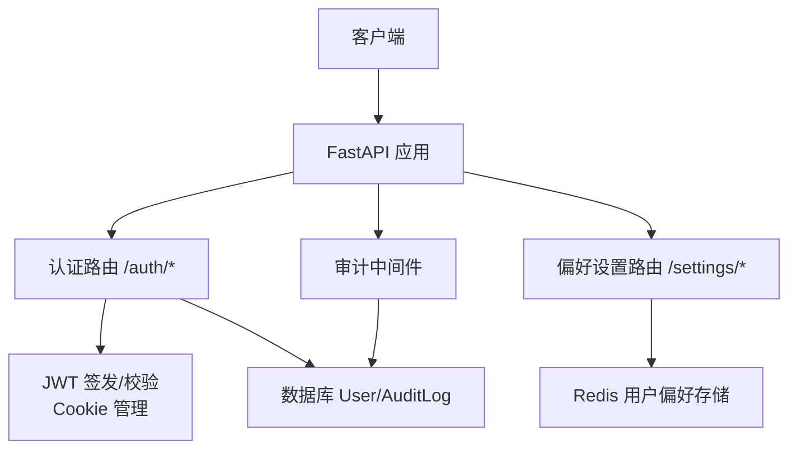
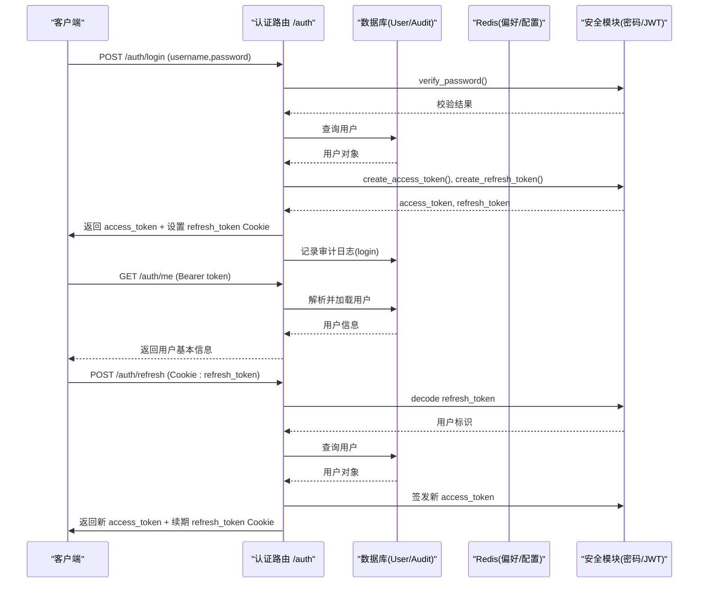
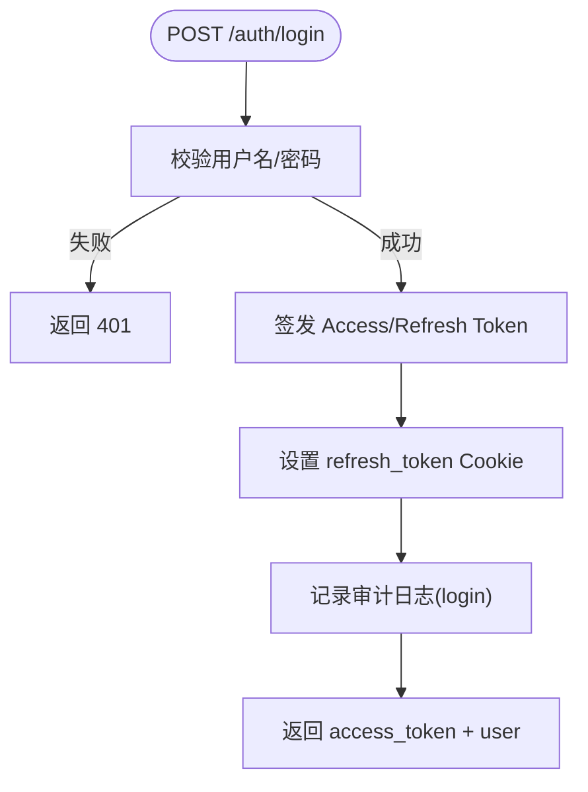
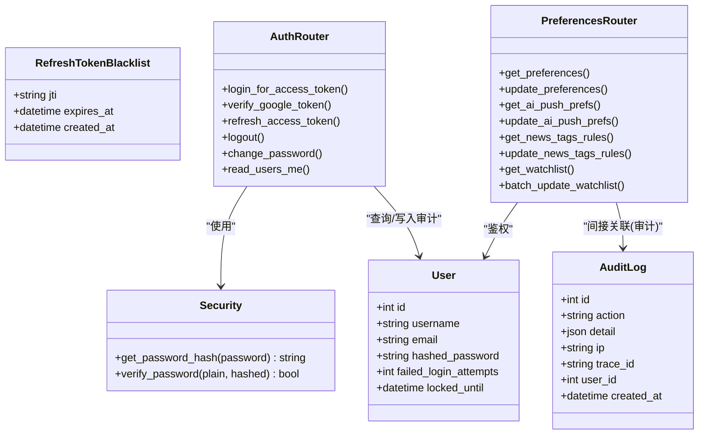

# 用户认证与权限API

<cite>
**本文引用的文件**
- [backend/routers/auth.py](file://backend/routers/auth.py)
- [backend/core/security.py](file://backend/core/security.py)
- [backend/routers/preferences.py](file://backend/routers/preferences.py)
- [backend/core/models.py](file://backend/core/models.py)
- [backend/services/audit_service.py](file://backend/services/audit_service.py)
- [backend/bootstrap/lifecycle.py](file://backend/bootstrap/lifecycle.py)
- [backend/middleware/audit_middleware.py](file://backend/middleware/audit_middleware.py)
- [backend/core/config.py](file://backend/core/config.py)
</cite>

## 目录
1. [简介](#简介)
2. [项目结构](#项目结构)
3. [核心组件](#核心组件)
4. [架构总览](#架构总览)
5. [详细接口说明](#详细接口说明)
6. [依赖关系分析](#依赖关系分析)
7. [性能与安全考虑](#性能与安全考虑)
8. [故障排查指南](#故障排查指南)
9. [结论](#结论)
10. [附录：集成指南与示例](#附录：集成指南与示例)

## 简介
本文件面向开发者，提供 Quant Agent 的用户认证与权限相关 RESTful API 文档。内容覆盖账号密码登录、Google OAuth2 登录、令牌刷新与登出、当前用户信息获取、用户偏好设置等端点；并说明 JWT 验证、会话管理（Access Token + Refresh Token Cookie）、审计日志、安全最佳实践（密码哈希、防暴力破解建议）以及客户端集成要点。

## 项目结构
与认证与权限相关的后端实现主要位于以下模块：
- 路由层：认证与偏好设置
  - 认证路由：/auth/*
  - 偏好设置路由：/settings/*
- 安全与模型：
  - 密码哈希与内部通信签名
  - 用户、审计日志、刷新令牌黑名单等数据模型
- 生命周期与中间件：
  - 启动时初始化默认管理员账号
  - 审计中间件对关键操作进行记录

**图表来源**
- [backend/routers/auth.py:100-386](file://backend/routers/auth.py#L100-L386)
- [backend/routers/preferences.py:14-251](file://backend/routers/preferences.py#L14-L251)
- [backend/core/models.py:37-75,259-304:37-75](file://backend/core/models.py#L37-L75)
- [backend/services/audit_service.py:43-80](file://backend/services/audit_service.py#L43-L80)

**章节来源**
- [backend/routers/auth.py:100-386](file://backend/routers/auth.py#L100-L386)
- [backend/routers/preferences.py:14-251](file://backend/routers/preferences.py#L14-L251)
- [backend/core/models.py:37-75](file://backend/core/models.py#L37-L75)
- [backend/services/audit_service.py:43-80](file://backend/services/audit_service.py#L43-L80)

## 核心组件
- 认证路由（/auth）
  - 账号密码登录：POST /auth/login
  - Google OAuth2 令牌验证：POST /auth/google/verify
  - 刷新 Access Token：POST /auth/refresh
  - 登出：POST /auth/logout
  - 修改密码：POST /auth/change-password
  - 查看当前用户：GET /auth/me
- 偏好设置路由（/settings）
  - 获取/更新全局偏好：GET/POST /settings/preferences
  - AI 推送偏好：GET/PUT /settings/preferences/ai-push
  - 新闻标签规则：GET/POST /settings/news-tags
  - 监控池：GET /settings/watchlist，批量增删：POST /settings/watchlist/batch
- 安全能力
  - 密码哈希与校验：bcrypt
  - JWT 签发与解码：HS256，短效 Access Token + 长效 Refresh Token（Cookie）
  - 审计日志：登录、登出、改密等操作写入审计表
- 数据模型
  - 用户、审计日志、刷新令牌黑名单等

**章节来源**
- [backend/routers/auth.py:100-386](file://backend/routers/auth.py#L100-L386)
- [backend/routers/preferences.py:14-251](file://backend/routers/preferences.py#L14-L251)
- [backend/core/security.py:20-31](file://backend/core/security.py#L20-L31)
- [backend/core/models.py:37-75,259-304:37-75](file://backend/core/models.py#L37-L75)

## 架构总览
下图展示了认证流程中各组件的交互：客户端通过浏览器或应用发起请求，FastAPI 路由处理认证逻辑，使用 JWT 签发短期访问令牌，并通过 HttpOnly Cookie 维护长期刷新令牌；偏好设置通过 Redis 缓存读写；所有敏感操作均记录审计日志。

**图表来源**
- [backend/routers/auth.py:117-162,305-346:117-162](file://backend/routers/auth.py#L117-L162)
- [backend/routers/auth.py:349-386](file://backend/routers/auth.py#L349-L386)
- [backend/core/security.py:20-31](file://backend/core/security.py#L20-L31)
- [backend/services/audit_service.py:43-80](file://backend/services/audit_service.py#L43-L80)

## 详细接口说明

### 认证类接口

#### 账号密码登录
- 路径与方法：POST /auth/login
- 请求体：表单参数 username、password（OAuth2PasswordRequestForm）
- 响应：
  - 成功：包含 access_token、token_type、user 基本信息；同时设置 HttpOnly Cookie refresh_token
  - 失败：401 用户名或密码错误
- 说明：
  - Access Token 有效期较短（分钟级），Refresh Token 有效期较长（天级）
  - 生产环境 Cookie 启用 Secure + SameSite=None，开发环境为 Lax + 非 Secure
  - 登录成功后记录审计日志

**图表来源**
- [backend/routers/auth.py:117-162](file://backend/routers/auth.py#L117-L162)
- [backend/services/audit_service.py:43-80](file://backend/services/audit_service.py#L43-L80)

**章节来源**
- [backend/routers/auth.py:117-162](file://backend/routers/auth.py#L117-L162)

#### Google OAuth2 登录
- 路径与方法：POST /auth/google/verify
- 请求体：{ "credential": "<Google ID Token>" }
- 响应：
  - 成功：access_token、user 基本信息；设置 refresh_token Cookie
  - 失败：401 无效 Google Token；500 回调异常
- 说明：
  - 后端验证 Google ID Token，自动注册或查找本地用户
  - 签发系统内部短效 Access Token 与长效 Refresh Token
  - 记录审计日志（含登录方式 google）

**章节来源**
- [backend/routers/auth.py:200-299](file://backend/routers/auth.py#L200-L299)

#### 刷新 Access Token
- 路径与方法：POST /auth/refresh
- 请求头/体：从 Cookie 读取 refresh_token
- 响应：
  - 成功：返回新的 access_token；续期 refresh_token Cookie
  - 失败：401 缺少或无效/过期 Refresh Token
- 说明：滑动窗口续期，提升用户体验

**章节来源**
- [backend/routers/auth.py:305-346](file://backend/routers/auth.py#L305-L346)

#### 登出
- 路径与方法：POST /auth/logout
- 响应：清理 refresh_token Cookie，返回成功消息
- 说明：若可解析到用户，记录审计日志

**章节来源**
- [backend/routers/auth.py:349-386](file://backend/routers/auth.py#L349-L386)

#### 修改密码
- 路径与方法：POST /auth/change-password
- 请求体：{ "old_password": "...", "new_password": "..." }
- 响应：成功返回提示；失败返回原密码错误
- 说明：需已登录（Bearer Token），记录审计日志

**章节来源**
- [backend/routers/auth.py:165-192](file://backend/routers/auth.py#L165-L192)

#### 查看当前用户
- 路径与方法：GET /auth/me
- 鉴权：需要有效的 Bearer Token
- 响应：返回 id、username、email（若存在）

**章节来源**
- [backend/routers/auth.py:103-109](file://backend/routers/auth.py#L103-L109)

### 用户偏好与客户端配置

#### 获取/更新全局偏好
- 路径与方法：
  - GET /settings/preferences
  - POST /settings/preferences
- 鉴权：需要已登录
- 行为：
  - 读取 Redis 中的用户偏好，合并默认值返回
  - 更新时局部合并，支持 yfinanceFallbackEnabled 开关联动系统级配置
- 注意：偏好键名与默认值由服务端定义

**章节来源**
- [backend/routers/preferences.py:94-141](file://backend/routers/preferences.py#L94-L141)

#### AI 推送偏好
- 路径与方法：
  - GET /settings/preferences/ai-push
  - PUT /settings/preferences/ai-push
- 鉴权：需要已登录
- 行为：受控模块列表固定（ai01..ai08），未配置项回退默认值；批量更新仅接受已知模块

**章节来源**
- [backend/routers/preferences.py:46-91](file://backend/routers/preferences.py#L46-L91)

#### 新闻标签规则
- 路径与方法：
  - GET /settings/news-tags
  - POST /settings/news-tags
- 鉴权：需要已登录
- 行为：读取/更新 Redis 中的正则规则；更新时校验正则合法性

**章节来源**
- [backend/routers/preferences.py:144-193](file://backend/routers/preferences.py#L144-L193)

#### 监控池（Watchlist）
- 路径与方法：
  - GET /settings/watchlist
  - POST /settings/watchlist/batch（action=add/remove，tickers[]）
- 鉴权：需要已登录
- 行为：基于 Redis Set 维护用户监控标的；批量操作维护全局引用计数以联动后台任务

**章节来源**
- [backend/routers/preferences.py:206-251](file://backend/routers/preferences.py#L206-L251)

## 依赖关系分析
- 认证路由依赖：
  - 安全模块：密码哈希/校验、JWT 签发/解码
  - 数据库：用户查询、审计日志写入
  - Cookie 管理：根据环境动态设置 Secure/SameSite
- 偏好设置路由依赖：
  - Redis：用户偏好、系统开关、新闻规则、监控池集合
  - 用户鉴权：复用 get_current_user
- 数据模型：
  - User：用户基础信息与锁定字段
  - AuditLog：审计日志
  - RefreshTokenBlacklist：刷新令牌黑名单（预留）

**图表来源**
- [backend/core/models.py:37-75,259-304:37-75](file://backend/core/models.py#L37-L75)
- [backend/core/security.py:20-31](file://backend/core/security.py#L20-L31)
- [backend/routers/auth.py:100-386](file://backend/routers/auth.py#L100-L386)
- [backend/routers/preferences.py:14-251](file://backend/routers/preferences.py#L14-L251)

**章节来源**
- [backend/core/models.py:37-75](file://backend/core/models.py#L37-L75)
- [backend/core/security.py:20-31](file://backend/core/security.py#L20-L31)
- [backend/routers/auth.py:100-386](file://backend/routers/auth.py#L100-L386)
- [backend/routers/preferences.py:14-251](file://backend/routers/preferences.py#L14-L251)

## 性能与安全考虑
- 令牌策略
  - Access Token 短效（分钟级），降低泄露风险
  - Refresh Token 长效（天级）并通过 HttpOnly Cookie 存储，减少前端暴露面
  - 刷新采用滑动窗口机制，提升在线体验
- 密码安全
  - 使用 bcrypt 哈希存储密码，强度可通过环境变量调整
- 会话与跨域
  - 生产环境 Cookie 启用 Secure + SameSite=None，确保跨站请求携带 Cookie
  - 开发环境保持 Lax + 非 Secure，便于调试
- 审计与追踪
  - 登录、登出、改密等关键操作记录审计日志，包含 IP、trace_id、user_id
- 防暴力破解建议（扩展）
  - 可在登录接口前增加速率限制（如按 IP/用户维度限流）
  - 结合用户表的 failed_login_attempts 与 locked_until 字段实现账户锁定
  - 配合 WAF/网关层做 IP 封禁与验证码挑战
- 配置与环境
  - 密钥与算法通过环境变量注入，避免硬编码
  - 生产环境建议开启 HTTPS 与严格 Cookie 策略

**章节来源**
- [backend/routers/auth.py:22-41,117-162,305-346:22-41](file://backend/routers/auth.py#L22-L41)
- [backend/core/security.py:20-31](file://backend/core/security.py#L20-L31)
- [backend/core/models.py:37-48](file://backend/core/models.py#L37-L48)
- [backend/services/audit_service.py:43-80](file://backend/services/audit_service.py#L43-L80)

## 故障排查指南
- 登录失败（401）
  - 检查用户名/密码是否正确
  - 确认数据库连接正常，用户记录存在
  - 查看审计日志是否记录了 login 尝试
- Google 登录失败
  - 检查 GOOGLE_CLIENT_ID 配置
  - 确认前端传递的 credential 有效且未过期
  - 查看后端终端堆栈（异常捕获会打印）
- 刷新令牌失败
  - 确认 Cookie 中存在 refresh_token
  - 检查 Cookie 的 Secure/SameSite 是否与部署环境匹配
  - 确认时间同步，避免令牌过期误判
- 偏好设置异常
  - 检查 Redis 连通性与 Key 命名空间
  - 更新新闻标签规则时，确保正则表达式合法
- 审计日志缺失
  - 确认中间件与路由中 log_audit 调用正常
  - 检查数据库写入权限与连接

**章节来源**
- [backend/routers/auth.py:117-162,200-299,305-386:117-162](file://backend/routers/auth.py#L117-L162)
- [backend/routers/preferences.py:144-193](file://backend/routers/preferences.py#L144-L193)
- [backend/services/audit_service.py:43-80](file://backend/services/audit_service.py#L43-L80)

## 结论
Quant Agent 的认证与权限体系基于 JWT + Cookie 的双令牌模式，兼顾安全性与用户体验；偏好设置通过 Redis 高效读写；关键操作具备完整的审计追踪。建议在部署时强化速率限制与账户锁定策略，并结合网关层防护进一步提升安全性。

## 附录：集成指南与示例

### 客户端集成步骤
- 登录
  - 调用 POST /auth/login，提交 username/password
  - 保存返回的 access_token 用于后续请求的 Authorization: Bearer
  - 浏览器端无需手动处理 refresh_token Cookie
- 刷新令牌
  - 当 access_token 过期时，调用 POST /auth/refresh（浏览器自动携带 Cookie）
  - 使用返回的新 access_token 继续业务请求
- 获取当前用户
  - 调用 GET /auth/me，携带 Bearer Token
- 登出
  - 调用 POST /auth/logout，清理 Cookie
- 偏好设置
  - 按需调用 /settings/preferences、/settings/preferences/ai-push、/settings/news-tags、/settings/watchlist 系列接口

### JSON 示例（示意）
- 登录请求（表单）
  - username: "admin"
  - password: "admin"
- 登录响应（成功）
  - status: "success"
  - access_token: "<JWT字符串>"
  - token_type: "bearer"
  - user: { "username": "admin", "email": "admin@quant.local" }
- 刷新令牌响应（成功）
  - access_token: "<新JWT字符串>"
- 当前用户响应（成功）
  - id: 1
  - username: "admin"
  - email: "admin@quant.local"
- 更新偏好请求（部分）
  - { "yfinanceFallbackEnabled": true }
- 更新偏好响应（成功）
  - status: "success"
  - message: "偏好设置已更新"
  - data: { ...合并后的偏好... }

### 安全最佳实践清单
- 使用 HTTPS 部署，生产环境启用 Secure Cookie
- 定期轮换 SECRET_KEY 与内部通信密钥
- 在网关层实施速率限制与 IP 白名单
- 对登录失败次数进行统计与账户锁定
- 最小化敏感信息返回（如不返回完整用户资料）
- 对所有写操作进行审计记录

**章节来源**
- [backend/routers/auth.py:117-162,305-346:117-162](file://backend/routers/auth.py#L117-L162)
- [backend/routers/preferences.py:94-141](file://backend/routers/preferences.py#L94-L141)
- [backend/core/security.py:20-31](file://backend/core/security.py#L20-L31)
- [backend/bootstrap/lifecycle.py:77-103](file://backend/bootstrap/lifecycle.py#L77-L103)
- [backend/middleware/audit_middleware.py:14-27](file://backend/middleware/audit_middleware.py#L14-L27)