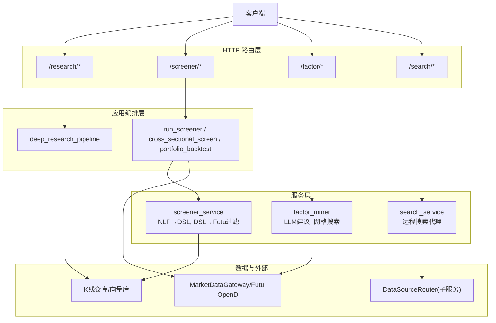
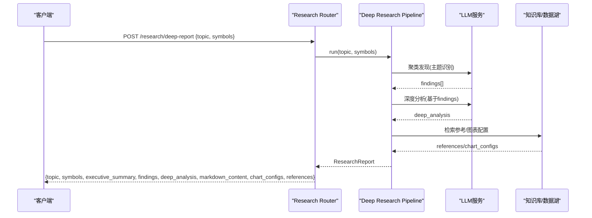
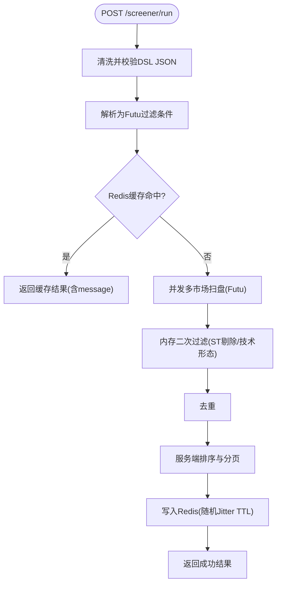
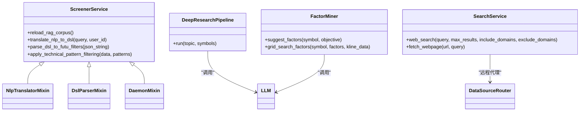

# 研究与选股器API

<cite>
**本文引用的文件**
- [backend/routers/research.py](file://backend/routers/research.py)
- [backend/app/research/deep_research.py](file://backend/app/research/deep_research.py)
- [backend/routers/screener.py](file://backend/routers/screener.py)
- [backend/app/screener_app.py](file://backend/app/screener_app.py)
- [backend/services/screener/dsl_parser.py](file://backend/services/screener/dsl_parser.py)
- [backend/services/screener/nlp_translator.py](file://backend/services/screener/nlp_translator.py)
- [backend/domain/cross_sectional.py](file://backend/domain/cross_sectional.py)
- [backend/routers/factor.py](file://backend/routers/factor.py)
- [backend/services/factor_mining/factor_miner.py](file://backend/services/factor_mining/factor_miner.py)
- [backend/routers/search.py](file://backend/routers/search.py)
- [backend/services/search/service.py](file://backend/services/search/service.py)
- [backend/core/models.py](file://backend/core/models.py)
</cite>

## 目录
1. [简介](#简介)
2. [项目结构](#项目结构)
3. [核心组件](#核心组件)
4. [架构总览](#架构总览)
5. [详细组件分析](#详细组件分析)
6. [依赖关系分析](#依赖关系分析)
7. [性能与缓存](#性能与缓存)
8. [错误处理与故障排查](#错误处理与故障排查)
9. [结论](#结论)
10. [附录：DSL语法、请求/响应示例与集成指南](#附录dsl语法请求响应示例与集成指南)

## 简介
本文件面向开发者，系统化文档化 Quant Agent 的“研究”与“选股器”RESTful API，覆盖：
- 研究会话管理（深度研报生成）
- 选股条件查询（自然语言转 DSL、在线扫盘、横截面筛选、组合回测）
- 因子挖掘（LLM建议 + 参数网格搜索）
- 智能搜索（统一网络搜索入口）
并给出接口路径、请求参数、响应格式、DSL语法支持、AI增强能力、批量处理能力、缓存策略、性能优化与错误处理说明。

## 项目结构
后端以 FastAPI Router 为 HTTP 边界层，业务编排下沉至 app 层与服务层，数据源通过网关或子服务代理访问。关键模块：
- routers：HTTP 路由定义（research、screener、factor、search）
- app：用例编排（screener_app、deep_research）
- services：领域服务（screener_service、factor_miner、search_service）
- domain：纯计算逻辑（cross_sectional）
- core：模型与基础设施（models、数据库、缓存等）

图表来源
- [backend/routers/research.py:17-52](file://backend/routers/research.py#L17-L52)
- [backend/routers/screener.py:63-221](file://backend/routers/screener.py#L63-L221)
- [backend/routers/factor.py:15-74](file://backend/routers/factor.py#L15-L74)
- [backend/routers/search.py:8-30](file://backend/routers/search.py#L8-L30)
- [backend/app/screener_app.py:295-464](file://backend/app/screener_app.py#L295-L464)
- [backend/app/research/deep_research.py:199-231](file://backend/app/research/deep_research.py#L199-L231)
- [backend/services/search/service.py:13-85](file://backend/services/search/service.py#L13-L85)

章节来源
- [backend/routers/research.py:17-52](file://backend/routers/research.py#L17-L52)
- [backend/routers/screener.py:63-221](file://backend/routers/screener.py#L63-L221)
- [backend/routers/factor.py:15-74](file://backend/routers/factor.py#L15-L74)
- [backend/routers/search.py:8-30](file://backend/routers/search.py#L8-L30)

## 核心组件
- 研究会话管理：提供元数据查询与深度研报生成（SSE流式进度由上层流水线驱动）。
- 选股器：
  - 自然语言转 DSL（NLP→JSON），带语义缓存与RAG注入。
  - DSL→Futu过滤条件，并发多市场扫盘，内存二次过滤、去重、排序、分页。
  - 横截面选股：基于Pandas矢量化指标与安全表达式求值。
  - 组合回测：一键等权组合回测与Tear Sheet。
- 因子挖掘：LLM建议因子表达式与参数范围，结合网格搜索评估夏普/收益。
- 智能搜索：统一网络搜索入口，经 DataSourceRouter 调用子服务 search_worker，支持域名白/黑名单与降级。

章节来源
- [backend/routers/research.py:25-52](file://backend/routers/research.py#L25-L52)
- [backend/app/research/deep_research.py:19-41](file://backend/app/research/deep_research.py#L19-L41)
- [backend/routers/screener.py:87-200](file://backend/routers/screener.py#L87-L200)
- [backend/app/screener_app.py:286-464](file://backend/app/screener_app.py#L286-L464)
- [backend/domain/cross_sectional.py:105-137](file://backend/domain/cross_sectional.py#L105-L137)
- [backend/routers/factor.py:18-74](file://backend/routers/factor.py#L18-L74)
- [backend/services/factor_mining/factor_miner.py:19-42](file://backend/services/factor_mining/factor_miner.py#L19-L42)
- [backend/routers/search.py:11-30](file://backend/routers/search.py#L11-L30)
- [backend/services/search/service.py:13-85](file://backend/services/search/service.py#L13-L85)

## 架构总览

图表来源
- [backend/routers/research.py:38-52](file://backend/routers/research.py#L38-L52)
- [backend/app/research/deep_research.py:199-231](file://backend/app/research/deep_research.py#L199-L231)

## 详细组件分析

### 研究会话管理（深度研报）
- 端点
  - GET /research/meta
  - POST /research/deep-report
- 功能
  - meta：返回工具数量与当前LLM模型名，供前端动态展示。
  - deep-report：触发三段流水线（聚类发现→数据深挖→图表交付），返回结构化研报内容。
- 请求/响应要点
  - 请求体包含 topic 与可选 symbols 列表。
  - 响应包含主题、标的、执行摘要、发现项、深度分析、Markdown正文、图表配置与参考文献。
- AI增强
  - 使用旗舰级模型进行主题聚类与深度分析，失败时安全降级并记录日志。
- 错误处理
  - LLM异常时返回降级结果，确保可用性。

章节来源
- [backend/routers/research.py:25-52](file://backend/routers/research.py#L25-L52)
- [backend/app/research/deep_research.py:19-41](file://backend/app/research/deep_research.py#L19-L41)
- [backend/app/research/deep_research.py:43-104](file://backend/app/research/deep_research.py#L43-L104)
- [backend/app/research/deep_research.py:107-150](file://backend/app/research/deep_research.py#L107-L150)
- [backend/app/research/deep_research.py:153-196](file://backend/app/research/deep_research.py#L153-L196)

### 选股器（DSL/NLP/在线扫盘/横截面/组合回测）
- 端点
  - GET /screener/suggestions
  - POST /screener/translate
  - POST /screener/run
  - GET /screener/history
  - POST /screener/history
  - POST /screener/reload-indicators
  - GET /screener/dictionary
  - POST /screener/dictionary
  - DELETE /screener/dictionary
  - POST /screener/dictionary/batch
  - POST /screener/subscribe
  - GET /screener/subscriptions
  - PUT /screener/subscription/time
  - DELETE /screener/subscription/{sub_id}
  - POST /screener/subscription/{sub_id}/toggle
  - POST /screener/summarize
  - POST /screener/cross-sectional
  - POST /screener/portfolio-backtest
  - SCREEN-01: /screener/screens (CRUD)
- 核心流程（run）
  - 校验并清理DSL JSON → 解析为Futu过滤条件 → 并发多市场扫盘 → 内存二次过滤（ST剔除、技术形态）→ 去重 → 服务端排序与分页 → Redis缓存命中则秒回。
- NLP→DSL
  - 语义归一化 → RAG召回相关指标规则 → LLM输出强类型JSON → 缓存命中直接返回。
- 横截面选股
  - 批量拉取K线（默认最近120日）→ 计算技术指标（RSI/KDJ/MACD/BOLL/ATR/量比/SMA/EMA）→ 安全表达式求值（仅允许白名单列）→ 返回满足表达式的标的集合。
- 组合回测
  - 接收标的列表、周期、初始资金、调仓频率、佣金比例，执行等权组合回测并返回Tear Sheet。
- 订阅与定时任务
  - 保存DSL为每日定时任务，支持时间更新、启停切换与删除。
- 私有规则与RAG词库
  - 支持用户私有规则CRUD与批量导入；热更新指标词库。

图表来源
- [backend/app/screener_app.py:295-464](file://backend/app/screener_app.py#L295-L464)
- [backend/services/screener/dsl_parser.py:16-78](file://backend/services/screener/dsl_parser.py#L16-L78)
- [backend/services/screener/dsl_parser.py:80-193](file://backend/services/screener/dsl_parser.py#L80-L193)

章节来源
- [backend/routers/screener.py:87-200](file://backend/routers/screener.py#L87-L200)
- [backend/app/screener_app.py:286-464](file://backend/app/screener_app.py#L286-L464)
- [backend/services/screener/dsl_parser.py:16-193](file://backend/services/screener/dsl_parser.py#L16-L193)
- [backend/services/screener/nlp_translator.py:21-127](file://backend/services/screener/nlp_translator.py#L21-L127)
- [backend/domain/cross_sectional.py:105-137](file://backend/domain/cross_sectional.py#L105-L137)
- [backend/core/models.py:155-196](file://backend/core/models.py#L155-L196)

### 因子挖掘（建议与网格搜索）
- 端点
  - POST /factor/suggest
  - POST /factor/search
- 功能
  - suggest：LLM根据目标（如最大化夏普）建议因子表达式与参数范围。
  - search：对建议因子进行真实网格搜索，返回最佳参数与Top结果（零幻觉：不可回测或失败标记skipped）。
- 数据结构
  - FactorSuggestion：name、expression、param_range、rationale。
  - FactorSearchResult：factor_name、best_params、best_sharpe、best_return、total_combos、top_results、status、skipped_reason。
- 错误处理
  - LLM或回测失败时不伪造数据，诚实返回skipped状态与原因。

章节来源
- [backend/routers/factor.py:18-74](file://backend/routers/factor.py#L18-L74)
- [backend/services/factor_mining/factor_miner.py:19-42](file://backend/services/factor_mining/factor_miner.py#L19-L42)
- [backend/services/factor_mining/factor_miner.py:47-137](file://backend/services/factor_mining/factor_miner.py#L47-L137)
- [backend/services/factor_mining/factor_miner.py:138-200](file://backend/services/factor_mining/factor_miner.py#L138-L200)

### 智能搜索（统一网络搜索入口）
- 端点
  - POST /search/web
- 功能
  - 统一入口，按优先级经 DataSourceRouter 调用子服务 search_worker（Tavily → Bocha），支持include/exclude域名过滤。
  - 全部源失败或无结果时返回空数组与末次错误提示。
- 网页抓取
  - 提供fetch_webpage能力（经Jina远程代理），主服务不直连外部。

章节来源
- [backend/routers/search.py:11-30](file://backend/routers/search.py#L11-L30)
- [backend/services/search/service.py:13-85](file://backend/services/search/service.py#L13-L85)

## 依赖关系分析

图表来源
- [backend/services/screener/service.py:16-25](file://backend/services/screener/service.py#L16-L25)
- [backend/services/screener/nlp_translator.py:18-25](file://backend/services/screener/nlp_translator.py#L18-L25)
- [backend/services/screener/dsl_parser.py:13-16](file://backend/services/screener/dsl_parser.py#L13-L16)
- [backend/app/research/deep_research.py:199-231](file://backend/app/research/deep_research.py#L199-L231)
- [backend/services/factor_mining/factor_miner.py:44-137](file://backend/services/factor_mining/factor_miner.py#L44-L137)
- [backend/services/search/service.py:13-85](file://backend/services/search/service.py#L13-L85)

章节来源
- [backend/services/screener/service.py:1-25](file://backend/services/screener/service.py#L1-L25)
- [backend/services/screener/nlp_translator.py:18-25](file://backend/services/screener/nlp_translator.py#L18-L25)
- [backend/services/screener/dsl_parser.py:13-16](file://backend/services/screener/dsl_parser.py#L13-L16)
- [backend/app/research/deep_research.py:199-231](file://backend/app/research/deep_research.py#L199-L231)
- [backend/services/factor_mining/factor_miner.py:44-137](file://backend/services/factor_mining/factor_miner.py#L44-L137)
- [backend/services/search/service.py:13-85](file://backend/services/search/service.py#L13-L85)

## 性能与缓存
- 选股器缓存
  - Redis键：quant:screener:dsl:{md5(dsl)}，TTL带随机抖动防雪崩。
  - NLP语义缓存：quant:screener:nlp_cache:v8:{md5(normalized_query)}，命中秒回。
  - 技术形态缓存：quant:tech:patterns:{symbol}:{date}，批量Pipeline读取。
- 并发与限流
  - 多市场并发扫盘（asyncio.gather）。
  - 技术形态批量拉取受保护，避免额度耗尽与限流。
- 排序与分页
  - 服务端动态排序（数值字段自动单位解析），支持page/page_size。
- 指标计算
  - 横截面引擎采用Pandas矢量化，避免Python循环瓶颈。

章节来源
- [backend/app/screener_app.py:295-464](file://backend/app/screener_app.py#L295-L464)
- [backend/services/screener/nlp_translator.py:96-127](file://backend/services/screener/nlp_translator.py#L96-L127)
- [backend/services/screener/dsl_parser.py:80-193](file://backend/services/screener/dsl_parser.py#L80-L193)
- [backend/domain/cross_sectional.py:105-137](file://backend/domain/cross_sectional.py#L105-L137)

## 错误处理与故障排查
- 常见错误码
  - 400：DSL格式错误、表达式非法、参数校验失败。
  - 404：订阅/筛选条件不存在或无权访问。
  - 500：服务内部异常（LLM/回测/搜索失败）。
  - 503：数据源未连接（Futu OpenD）。
- 降级策略
  - LLM失败：返回基础发现/默认因子。
  - 搜索失败：透传末次错误，返回空结果与提示。
  - 回测失败：标记skipped，不捏造指标。
- 排查建议
  - 检查Redis连通性与缓存键。
  - 确认Futu连接状态与权限。
  - 查看NLP/RAG召回规则是否匹配。
  - 关注技术形态过滤是否触发大量K线拉取。

章节来源
- [backend/app/screener_app.py:380-464](file://backend/app/screener_app.py#L380-L464)
- [backend/services/factor_mining/factor_miner.py:138-200](file://backend/services/factor_mining/factor_miner.py#L138-L200)
- [backend/services/search/service.py:21-85](file://backend/services/search/service.py#L21-L85)
- [backend/routers/research.py:38-52](file://backend/routers/research.py#L38-L52)

## 结论
本API体系将“研究”与“选股”两大能力解耦为清晰的HTTP端点，并通过NLP→DSL、DSL→Futu过滤、横截面表达式求值与因子网格搜索形成闭环。系统内置多级缓存、并发优化与健壮降级，保障高可用与高性能。开发者可据此快速集成量化研究工具链，实现从自然语言到可执行策略的一体化工作流。

## 附录：DSL语法、请求/响应示例与集成指南

### DSL语法支持（选股器）
- 市场选择：markets数组（如 ["HK","US","SH","SZ","JP","SG","UK"]）。
- 财务指标：type="financial"，支持term（LATEST/Q6/Q9/ANNUAL）、min_value/max_value、continuous_period、period_average/duration。
- 简单指标：type="simple"（PE/PB/MKT_CAP等）。
- 累计指标：type="accumulate"（成交量/成交额/换手率等）。
- 技术形态：type="indicator_pattern"（MACD金叉/死叉、RSI超买超卖等），需指定period。
- K线形态：type="kline_shape"（多头排列/曙光初现等）。
- 指标位置：type="indicator_positional"（价格上穿均线等）。
- 技术形态数组：technical_patterns（如 vcp_pattern/gap_up/volume_surge_3d/insider_net_buy）。
- 其他：exclude_st布尔值；filters数组承载具体条件。

章节来源
- [backend/services/screener/nlp_translator.py:130-200](file://backend/services/screener/nlp_translator.py#L130-L200)
- [backend/services/screener/dsl_parser.py:57-78](file://backend/services/screener/dsl_parser.py#L57-L78)

### 端点清单与参数/响应概要
- 研究会话
  - GET /research/meta → {tools_count, model_name}
  - POST /research/deep-report → {topic, symbols, executive_summary, findings[], deep_analysis, markdown_content, chart_configs[], references[]}
- 选股器
  - GET /screener/suggestions?limit=N → {status, data[]}
  - POST /screener/translate → {status, data: dsl}
  - POST /screener/run → {status, data[], total, message}
  - GET /screener/history → {status, data[]}
  - POST /screener/history → {status}
  - POST /screener/reload-indicators → {status, message}
  - GET /screener/dictionary → {status, data[]}
  - POST /screener/dictionary → {status, message}
  - DELETE /screener/dictionary → {status, message}
  - POST /screener/dictionary/batch → {status, message}
  - POST /screener/subscribe → {status, message}
  - GET /screener/subscriptions → {status, data[]}
  - PUT /screener/subscription/time → {status, message}
  - DELETE /screener/subscription/{sub_id} → {status, message}
  - POST /screener/subscription/{sub_id}/toggle → {status, message, is_active}
  - POST /screener/summarize → {status, data}
  - POST /screener/cross-sectional → {status, data}
  - POST /screener/portfolio-backtest → {status, data}
  - SCREEN-01: /screener/screens (CRUD) → {status, data/message}
- 因子挖掘
  - POST /factor/suggest → {symbol, objective, factors[]}
  - POST /factor/search → {symbol, results[]}
- 智能搜索
  - POST /search/web → {status, data[], message?}

章节来源
- [backend/routers/research.py:25-52](file://backend/routers/research.py#L25-L52)
- [backend/routers/screener.py:87-200](file://backend/routers/screener.py#L87-L200)
- [backend/routers/factor.py:18-74](file://backend/routers/factor.py#L18-L74)
- [backend/routers/search.py:11-30](file://backend/routers/search.py#L11-L30)

### 请求/响应示例（示意）
- 研究会话
  - 请求：POST /research/deep-report
    - 体：{ "topic": "AI算力产业链", "symbols": ["NVDA","AVGO","AMD"] }
  - 响应：{ "topic":"...","symbols":[...],"executive_summary":"...","findings":[{"theme":"...","summary":"...","relevance":0.8}], "deep_analysis":"...","markdown_content":"...","chart_configs":[],"references":[] }
- 选股器
  - 请求：POST /screener/run
    - 体：{ "dsl": "{...}", "page":1, "page_size":20, "sort_key":"mktcap", "sort_dir":-1, "filters":{} }
  - 响应：{ "status":"success","data":[{"rank":1,"symbol":"...","name":"...","mktcap":"...","price":...,"chg":...,"rsi":...,"chg30":"...","inflow":"..."}],"total":120,"message":"Futu OpenD 在线筛选成功" }
- 横截面选股
  - 请求：POST /screener/cross-sectional
    - 体：{ "symbols":["AAPL","MSFT","GOOG"], "expression":"RSI(14) < 30 AND MACD.histogram > 0" }
  - 响应：{ "status":"success","data":[...] }
- 因子挖掘
  - 请求：POST /factor/suggest
    - 体：{ "symbol":"AAPL", "objective":"maximize_sharpe" }
  - 响应：{ "symbol":"AAPL","objective":"maximize_sharpe","factors":[{"name":"...","expression":"...","param_range":{"period":[10,20,50]},"rationale":"..."}] }
- 智能搜索
  - 请求：POST /search/web
    - 体：{ "query":"AI芯片最新进展", "max_results":5, "include_domains":["arxiv.org"], "exclude_domains":["example.com"] }
  - 响应：{ "status":"success","data":[...], "message":"..." }

章节来源
- [backend/routers/research.py:38-52](file://backend/routers/research.py#L38-L52)
- [backend/app/screener_app.py:295-464](file://backend/app/screener_app.py#L295-L464)
- [backend/routers/factor.py:28-74](file://backend/routers/factor.py#L28-L74)
- [backend/routers/search.py:18-30](file://backend/routers/search.py#L18-L30)

### 集成指南（开发者）
- 鉴权与租户
  - 多数端点需登录用户上下文（get_current_user），订阅与保存筛选条件按user_id隔离。
- 缓存键规范
  - 选股DSL缓存：quant:screener:dsl:{md5(dsl)}
  - NLP语义缓存：quant:screener:nlp_cache:v8:{md5(normalized_query)}
  - 技术形态缓存：quant:tech:patterns:{symbol}:{date}
- 错误码约定
  - 400/404/500/503 分别对应参数错误、资源不存在、服务异常、数据源不可用。
- 性能建议
  - 合理设置page_size，避免全量拉取。
  - 复用NLP缓存，减少重复翻译。
  - 谨慎使用技术形态过滤，避免大规模K线拉取。
- 扩展点
  - 新增指标：在RAG词库中注册映射规则。
  - 新增技术形态：在technical_patterns数组中声明，并在二次过滤中实现。
  - 新增数据源：通过DataSourceRouter接入子服务。

章节来源
- [backend/routers/screener.py:63-221](file://backend/routers/screener.py#L63-L221)
- [backend/app/screener_app.py:295-464](file://backend/app/screener_app.py#L295-L464)
- [backend/services/screener/nlp_translator.py:96-127](file://backend/services/screener/nlp_translator.py#L96-L127)
- [backend/services/screener/dsl_parser.py:80-193](file://backend/services/screener/dsl_parser.py#L80-L193)
- [backend/services/search/service.py:13-85](file://backend/services/search/service.py#L13-L85)