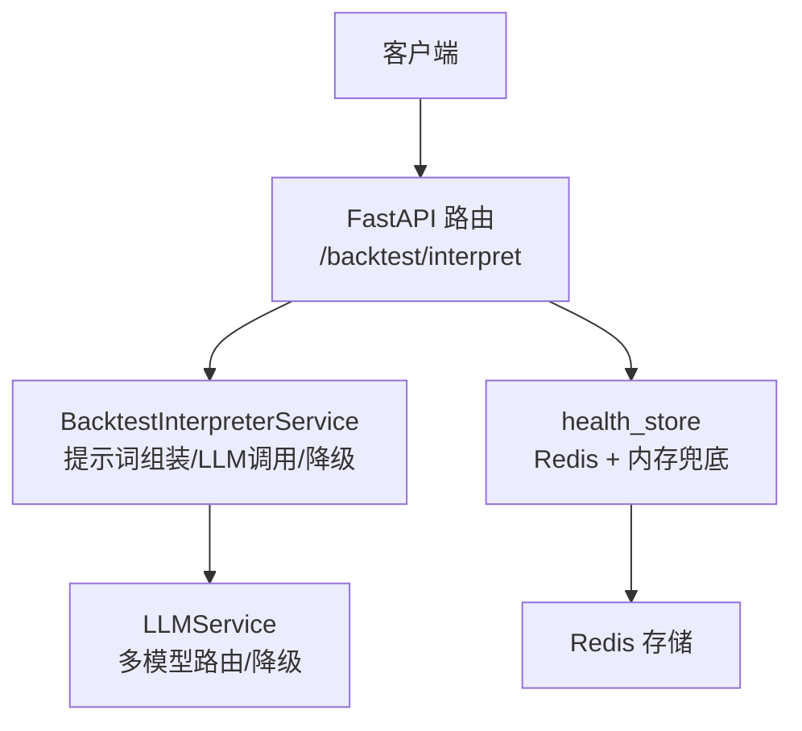
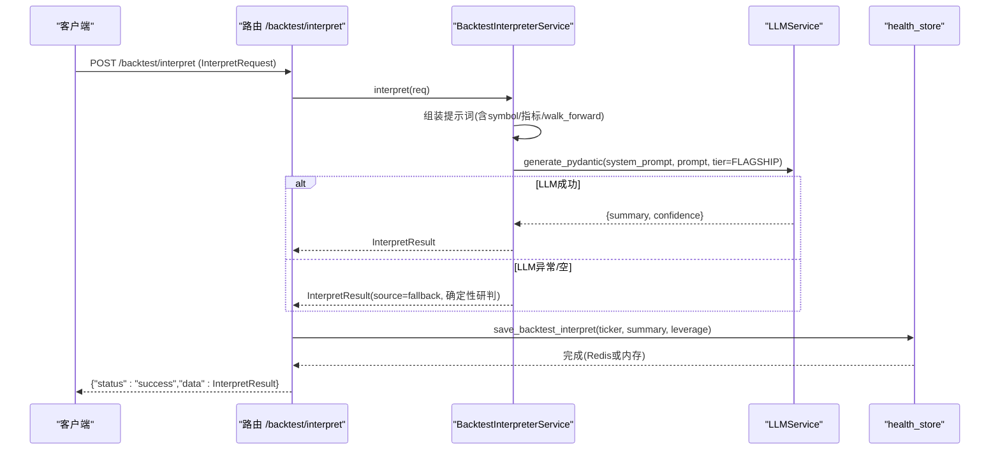
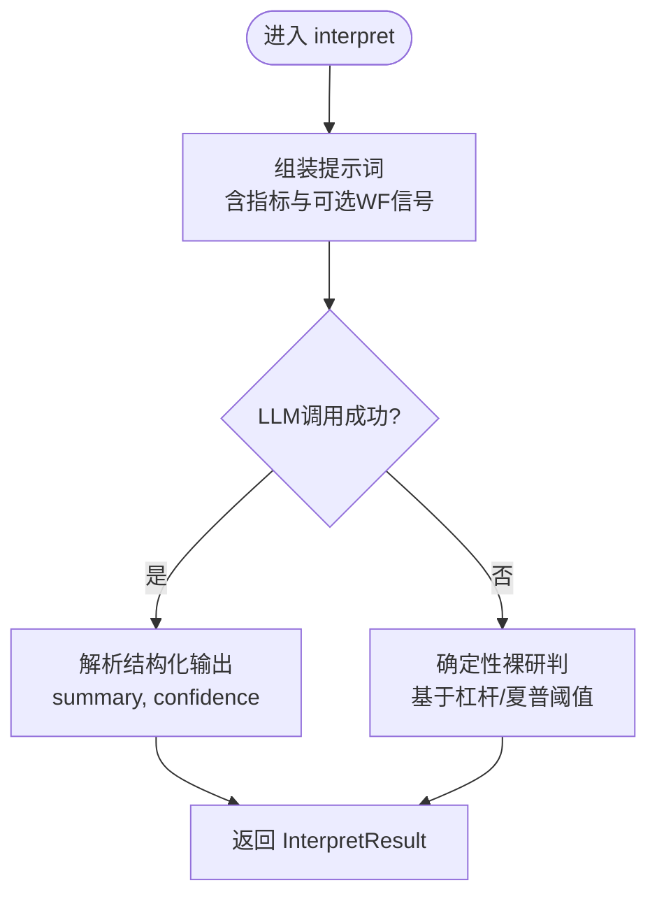
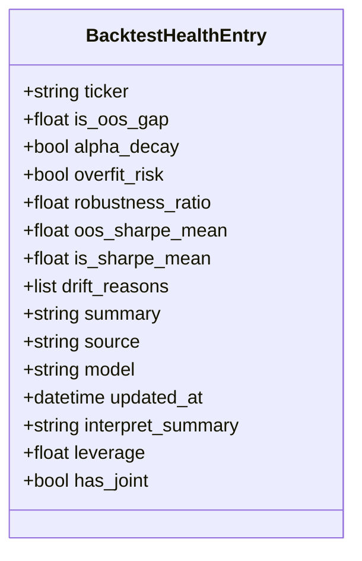
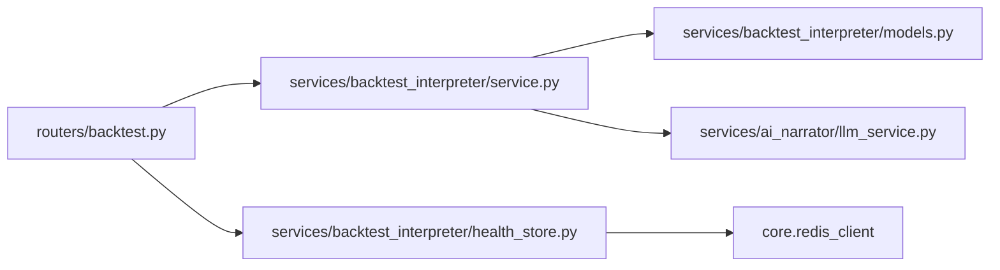

# AI解读API

<cite>
**本文引用的文件**
- [backend/routers/backtest.py](file://backend/routers/backtest.py)
- [backend/services/backtest_interpreter/service.py](file://backend/services/backtest_interpreter/service.py)
- [backend/services/backtest_interpreter/models.py](file://backend/services/backtest_interpreter/models.py)
- [backend/services/backtest_interpreter/health_store.py](file://backend/services/backtest_interpreter/health_store.py)
- [backend/services/ai_narrator/llm_service.py](file://backend/services/ai_narrator/llm_service.py)
- [backend/tests/test_backtest_interpreter.py](file://backend/tests/test_backtest_interpreter.py)
- [backend/tests/test_health_store.py](file://backend/tests/test_health_store.py)
</cite>

## 目录
1. [简介](#简介)
2. [项目结构](#项目结构)
3. [核心组件](#核心组件)
4. [架构总览](#架构总览)
5. [详细组件分析](#详细组件分析)
6. [依赖关系分析](#依赖关系分析)
7. [性能与缓存策略](#性能与缓存策略)
8. [故障排查指南](#故障排查指南)
9. [结论](#结论)
10. [附录：接口契约与示例](#附录接口契约与示例)

## 简介
本文件面向量化研究员，系统化说明 Quant Agent 的“AI回测解读”能力，重点覆盖 POST /backtest/interpret 端点。该端点接收真实回测指标（年化收益、夏普、最大回撤、杠杆倍数），通过LLM生成Tear Sheet一句话总结，并强制进行“杠杆 vs Alpha”判别；同时支持注入Walk-Forward滚动验证信号，形成联合研判。结果可持久化至Redis（或内存兜底），供盘前早报与健康度面板使用。文档还涵盖请求格式、符号信息传递、杠杆比例设置、响应数据结构、健康度评分与建议措施、以及模型调用、上下文注入与降级策略。

## 项目结构
围绕“AI解读”的关键代码位于以下模块：
- 路由层：定义 /backtest/interpret 等端点，负责参数校验与结果持久化
- 服务层：BacktestInterpreterService 实现解读逻辑、提示词组装、LLM调用与降级
- 数据模型：InterpretRequest/InterpretResult 等Pydantic模型，严格约束输入输出
- 持久化层：health_store 提供Redis+内存双写，合并主解读与Walk-Forward漂移结论
- LLM服务：统一的多模型路由与降级（含Ollama本地降级）

**图表来源**
- [backend/routers/backtest.py:328-342](file://backend/routers/backtest.py#L328-L342)
- [backend/services/backtest_interpreter/service.py:234-263](file://backend/services/backtest_interpreter/service.py#L234-L263)
- [backend/services/backtest_interpreter/health_store.py:81-124](file://backend/services/backtest_interpreter/health_store.py#L81-L124)
- [backend/services/ai_narrator/llm_service.py:192-200](file://backend/services/ai_narrator/llm_service.py#L192-L200)

**章节来源**
- [backend/routers/backtest.py:328-342](file://backend/routers/backtest.py#L328-L342)
- [backend/services/backtest_interpreter/service.py:234-263](file://backend/services/backtest_interpreter/service.py#L234-L263)
- [backend/services/backtest_interpreter/health_store.py:81-124](file://backend/services/backtest_interpreter/health_store.py#L81-L124)
- [backend/services/ai_narrator/llm_service.py:192-200](file://backend/services/ai_narrator/llm_service.py#L192-L200)

## 核心组件
- 路由端点 /backtest/interpret：接收 InterpretRequest，调用服务层解读，并将结果与杠杆比例持久化为“联合研判”
- 解读服务 BacktestInterpreterService：
  - 构造系统提示词与用户提示词（包含symbol、年化、夏普、最大回撤、杠杆、可选Walk-Forward摘要）
  - 调用LLM生成结构化输出（summary, confidence）
  - 失败时自动降级为确定性裸研判（零幻觉）
- 数据模型：
  - InterpretRequest：symbol、annual_return、sharpe、mdd、leverage、walk_forward
  - InterpretResult：summary、source、confidence
- 持久化 health_store：
  - save_backtest_interpret：写入联合研判（interpret_summary、leverage、has_joint）
  - save_backtest_health：写入Walk-Forward漂移结论（保留已存的联合研判字段）
  - get_all_backtest_health：返回所有标的最近健康度（用于早报/面板）

**章节来源**
- [backend/routers/backtest.py:328-342](file://backend/routers/backtest.py#L328-L342)
- [backend/services/backtest_interpreter/models.py:12-31](file://backend/services/backtest_interpreter/models.py#L12-L31)
- [backend/services/backtest_interpreter/service.py:29-73](file://backend/services/backtest_interpreter/service.py#L29-L73)
- [backend/services/backtest_interpreter/health_store.py:103-124](file://backend/services/backtest_interpreter/health_store.py#L103-L124)

## 架构总览
下图展示从请求到解读、再到持久化的完整流程，包括LLM调用与降级路径。

**图表来源**
- [backend/routers/backtest.py:328-342](file://backend/routers/backtest.py#L328-L342)
- [backend/services/backtest_interpreter/service.py:238-263](file://backend/services/backtest_interpreter/service.py#L238-L263)
- [backend/services/backtest_interpreter/health_store.py:103-124](file://backend/services/backtest_interpreter/health_store.py#L103-L124)
- [backend/services/ai_narrator/llm_service.py:192-200](file://backend/services/ai_narrator/llm_service.py#L192-L200)

## 详细组件分析

### 端点：POST /backtest/interpret
- 功能：基于真实回测指标生成一句话解读，必须显式判别“收益是否来自杠杆而非Alpha”，并可融合Walk-Forward漂移信号做联合研判
- 输入：InterpretRequest（symbol、annual_return、sharpe、mdd、leverage、walk_forward）
- 输出：{"status":"success","data": InterpretResult}
- 副作用：将解读结果与杠杆比例持久化（联合研判），供早报与健康度面板使用

**章节来源**
- [backend/routers/backtest.py:328-342](file://backend/routers/backtest.py#L328-L342)
- [backend/services/backtest_interpreter/models.py:12-31](file://backend/services/backtest_interpreter/models.py#L12-L31)

### 解读服务：BacktestInterpreterService
- 提示词构建：
  - 系统提示词：限定角色、风格与规则（仅用提供的指标，严禁编造数字）
  - 用户提示词：插入symbol、年化、夏普、最大回撤、杠杆，若携带walk_forward则注入联合信号
- LLM调用：
  - 使用FLAGSHIP模型，结构化输出{summary, confidence}
  - 失败或返回空时，降级为确定性裸研判（基于阈值规则判断杠杆/Alpha）
- Walk-Forward增强：
  - 当请求携带walk_forward摘要时，提示词会叠加IS/OOS缺口、稳健性比率、过拟合风险、Alpha衰减等信息，要求给出统一联合研判

**图表来源**
- [backend/services/backtest_interpreter/service.py:29-73](file://backend/services/backtest_interpreter/service.py#L29-L73)
- [backend/services/backtest_interpreter/service.py:238-263](file://backend/services/backtest_interpreter/service.py#L238-L263)

**章节来源**
- [backend/services/backtest_interpreter/service.py:29-73](file://backend/services/backtest_interpreter/service.py#L29-L73)
- [backend/services/backtest_interpreter/service.py:238-263](file://backend/services/backtest_interpreter/service.py#L238-L263)

### 持久化：health_store（Redis + 内存兜底）
- 职责：
  - save_backtest_interpret：保存主解读（interpret_summary）、杠杆比例（leverage）、标记联合研判（has_joint）
  - save_backtest_health：保存Walk-Forward漂移结论（覆盖WF字段，不覆盖联合研判字段）
  - get_all_backtest_health：按更新时间倒序返回所有标的健康度快照
- 设计要点：
  - 正常环境写入Redis（TTL 30天），无Redis时自动降级为进程内dict
  - 联合研判与WF漂移合并到同一条目，避免重复视图

**图表来源**
- [backend/services/backtest_interpreter/health_store.py:29-48](file://backend/services/backtest_interpreter/health_store.py#L29-L48)

**章节来源**
- [backend/services/backtest_interpreter/health_store.py:81-124](file://backend/services/backtest_interpreter/health_store.py#L81-L124)
- [backend/services/backtest_interpreter/health_store.py:139-154](file://backend/services/backtest_interpreter/health_store.py#L139-L154)

### LLM服务：多模型路由与降级
- 分级路由：LIGHTWEIGHT/STANDARD/FLAGSHIP，默认解读使用FLAGSHIP
- 降级机制：主供应商连续失败N次后自动切换至本地Ollama，探测可用后再切回
- 健康检查：定期探测主链路与Ollama可用性

**章节来源**
- [backend/services/ai_narrator/llm_service.py:26-32](file://backend/services/ai_narrator/llm_service.py#L26-L32)
- [backend/services/ai_narrator/llm_service.py:121-137](file://backend/services/ai_narrator/llm_service.py#L121-L137)
- [backend/services/ai_narrator/llm_service.py:163-185](file://backend/services/ai_narrator/llm_service.py#L163-L185)

## 依赖关系分析
- 路由层依赖服务层与持久化层
- 服务层依赖LLM服务与数据模型
- 持久化层依赖Redis客户端与内存单例
- 测试覆盖：对解读流程、降级行为、持久化合并与读取进行验证

**图表来源**
- [backend/routers/backtest.py:328-342](file://backend/routers/backtest.py#L328-L342)
- [backend/services/backtest_interpreter/service.py:234-263](file://backend/services/backtest_interpreter/service.py#L234-L263)
- [backend/services/backtest_interpreter/health_store.py:81-124](file://backend/services/backtest_interpreter/health_store.py#L81-L124)

**章节来源**
- [backend/routers/backtest.py:328-342](file://backend/routers/backtest.py#L328-L342)
- [backend/services/backtest_interpreter/service.py:234-263](file://backend/services/backtest_interpreter/service.py#L234-L263)
- [backend/services/backtest_interpreter/health_store.py:81-124](file://backend/services/backtest_interpreter/health_store.py#L81-L124)

## 性能与缓存策略
- LLM调用：
  - FLAGSHIP模型，超时与重试由底层HTTP客户端管理
  - 失败自动降级为确定性研判，保障可用性
- 持久化：
  - Redis写入带TTL（30天），索引键也设置过期
  - 无Redis时自动降级为内存dict，保证离线与单测可用
- 建议：
  - 高频解读可结合上游缓存（如按symbol+指标指纹缓存结果）以减少LLM调用
  - 合理设置walk_forward注入范围，避免过长提示词导致延迟上升

[本节为通用指导，无需特定文件引用]

## 故障排查指南
- LLM不可用或返回空：
  - 现象：source=fallback，confidence较低
  - 处理：检查网络与API Key；确认降级到Ollama是否生效；查看日志中的错误信息
- 持久化失败：
  - 现象：Redis写入失败但解读仍返回
  - 处理：检查Redis连接与权限；确认内存兜底是否生效；核对ticker是否为空
- 联合研判未合并：
  - 现象：健康度条目缺少interpret_summary或has_joint=False
  - 处理：确认先调用save_backtest_interpret再调用save_backtest_health（顺序不影响，内部会合并）；检查ticker一致性

**章节来源**
- [backend/services/backtest_interpreter/service.py:238-263](file://backend/services/backtest_interpreter/service.py#L238-L263)
- [backend/services/backtest_interpreter/health_store.py:81-124](file://backend/services/backtest_interpreter/health_store.py#L81-L124)
- [backend/tests/test_backtest_interpreter.py:51-80](file://backend/tests/test_backtest_interpreter.py#L51-L80)
- [backend/tests/test_health_store.py:78-103](file://backend/tests/test_health_store.py#L78-L103)

## 结论
POST /backtest/interpret 提供了以真实回测指标为基础的智能化解读能力，强制进行杠杆/Alpha判别，并可与Walk-Forward滚动验证结论融合，形成更稳健的联合研判。系统具备完善的降级与持久化机制，确保在LLM不可用时仍可返回确定性结论，并将结果持久化以供早报与健康度面板使用。该接口为量化研究员提供了高效的回测结果解释与决策支持工具。

[本节为总结，无需特定文件引用]

## 附录：接口契约与示例

### 请求体：InterpretRequest
- symbol: 可选，标的名称（用于提示词与持久化）
- annual_return: 必填，年化收益率（如0.23表示23%）
- sharpe: 必填，夏普比率
- mdd: 必填，最大回撤（允许负值输入）
- leverage: 可选，杠杆倍数（默认1.0）
- walk_forward: 可选，字典，包含is_oos_gap、robustness_ratio、overfit_risk、alpha_decay等字段，用于注入联合研判信号

**章节来源**
- [backend/services/backtest_interpreter/models.py:12-24](file://backend/services/backtest_interpreter/models.py#L12-L24)

### 响应体：InterpretResult
- summary: 一句话解读（≤80字，须含杠杆/Alpha判别）
- source: 来源（llm 或 fallback）
- confidence: 置信度（0-1）

外层包装：{"status":"success","data": InterpretResult}

**章节来源**
- [backend/services/backtest_interpreter/models.py:27-31](file://backend/services/backtest_interpreter/models.py#L27-L31)
- [backend/routers/backtest.py:328-342](file://backend/routers/backtest.py#L328-L342)

### 不同回测结果的解读示例（基于测试用例）
- 盈利策略（高夏普、低杠杆）：
  - 输入：annual_return≈0.23, sharpe≥1.0, leverage≈1.0
  - 预期：解读强调Alpha驱动，非杠杆注水
- 风险警示（高杠杆、低夏普）：
  - 输入：annual_return≈0.23, sharpe<1.0, leverage>1.3
  - 预期：解读指出收益靠杠杆堆出，Alpha稀薄
- 联合研判（携带walk_forward）：
  - 输入：walk_forward中overfit_risk=True或alpha_decay=True
  - 预期：解读叠加样本外崩塌信号，提示外推需谨慎

**章节来源**
- [backend/tests/test_backtest_interpreter.py:32-80](file://backend/tests/test_backtest_interpreter.py#L32-L80)
- [backend/tests/test_backtest_interpreter.py:83-138](file://backend/tests/test_backtest_interpreter.py#L83-L138)

### 健康度评分与建议措施
- 健康度字段（来自Walk-Forward解读）：
  - is_oos_gap：IS/OOS夏普均值缺口
  - alpha_decay：是否检测到Alpha衰减
  - overfit_risk：是否检测到过拟合风险
  - robustness_ratio：样本外盈利折占比（越高越稳）
  - oos_sharpe_mean/is_sharpe_mean：样本外/内夏普均值
- 建议措施：
  - 若overfit_risk或alpha_decay为真：建议重新审视参数稳健性与样本外表现
  - 若robustness_ratio偏低：建议降低杠杆或优化风控
  - 若is_oos_gap过大：警惕过拟合与外推失效

**章节来源**
- [backend/services/backtest_interpreter/models.py:75-86](file://backend/services/backtest_interpreter/models.py#L75-L86)
- [backend/services/backtest_interpreter/health_store.py:29-48](file://backend/services/backtest_interpreter/health_store.py#L29-L48)

### 模型调用、上下文注入与结果缓存
- 模型调用：
  - 使用FLAGSHIP模型，支持多模型路由与Ollama降级
- 上下文注入：
  - 系统提示词限定角色与规则
  - 用户提示词注入symbol、指标与可选walk_forward摘要
- 结果缓存：
  - 当前实现未内置结果缓存；可在上层按symbol+指标指纹增加缓存以减少LLM调用
  - 持久化层提供健康度快照（Redis+内存），便于复用与展示

**章节来源**
- [backend/services/ai_narrator/llm_service.py:26-32](file://backend/services/ai_narrator/llm_service.py#L26-L32)
- [backend/services/ai_narrator/llm_service.py:121-137](file://backend/services/ai_narrator/llm_service.py#L121-L137)
- [backend/services/backtest_interpreter/service.py:29-73](file://backend/services/backtest_interpreter/service.py#L29-L73)
- [backend/services/backtest_interpreter/health_store.py:81-124](file://backend/services/backtest_interpreter/health_store.py#L81-L124)