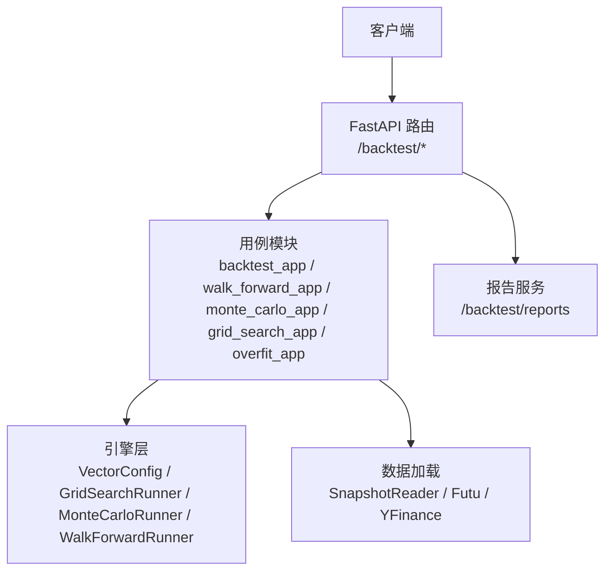
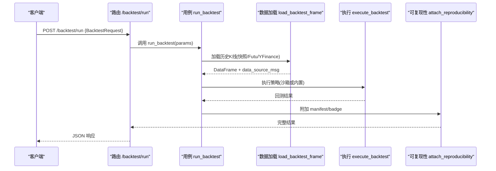
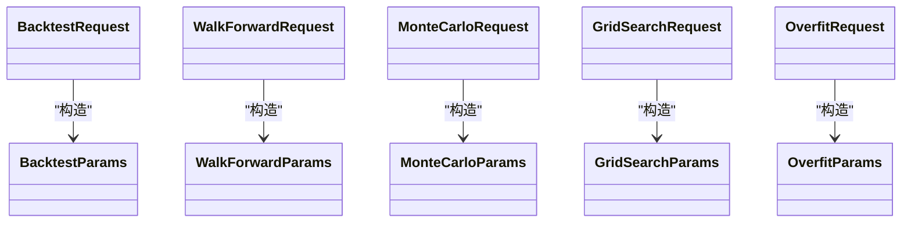

# 回测执行API

<cite>
**本文引用的文件**
- [backend/routers/backtest.py](file://backend/routers/backtest.py)
- [backend/app/backtest_app.py](file://backend/app/backtest_app.py)
- [backend/app/walk_forward_app.py](file://backend/app/walk_forward_app.py)
- [backend/app/monte_carlo_app.py](file://backend/app/monte_carlo_app.py)
- [backend/app/grid_search_app.py](file://backend/app/grid_search_app.py)
- [backend/app/overfit_app.py](file://backend/app/overfit_app.py)
- [backend/routers/backtest_reports.py](file://backend/routers/backtest_reports.py)
- [backend/core/exception_handlers.py](file://backend/core/exception_handlers.py)
- [backend/core/error_codes.py](file://backend/core/error_codes.py)
- [backend/core/response.py](file://backend/core/response.py)
</cite>

## 目录
1. [简介](#简介)
2. [项目结构](#项目结构)
3. [核心组件](#核心组件)
4. [架构总览](#架构总览)
5. [详细接口说明](#详细接口说明)
6. [依赖关系分析](#依赖关系分析)
7. [性能与并发](#性能与并发)
8. [故障排查指南](#故障排查指南)
9. [结论](#结论)
10. [附录：请求与响应示例](#附录请求与响应示例)

## 简介
本文件为 Quant Agent 的回测执行 RESTful API 文档，覆盖以下能力：
- 基础回测（同步与SSE流式）
- 滚动验证（Walk-Forward）
- 蒙特卡洛模拟（交易重排/自助抽样）
- 参数网格搜索（含夏普热力图）
- 过拟合检测（Deflated Sharpe + 参数悬崖）
- 报告持久化与查询
- 异步任务处理机制、进度跟踪、结果获取
- 并发控制、资源管理与错误处理策略
- 面向量化研究员的高效集成最佳实践

## 项目结构
后端通过 FastAPI 暴露 /backtest 前缀的端点，路由层只做参数校验与HTTP映射；业务逻辑在 app/* 中实现；底层引擎使用 VectorBT/NumPy 向量化快路径。报告持久化由独立 router 提供。

图表来源
- [backend/routers/backtest.py:43-385](file://backend/routers/backtest.py#L43-L385)
- [backend/app/backtest_app.py:72-142](file://backend/app/backtest_app.py#L72-L142)
- [backend/routers/backtest_reports.py:82-149](file://backend/routers/backtest_reports.py#L82-L149)

章节来源
- [backend/routers/backtest.py:43-385](file://backend/routers/backtest.py#L43-L385)
- [backend/routers/backtest_reports.py:1-192](file://backend/routers/backtest_reports.py#L1-L192)

## 核心组件
- 路由层：定义请求模型与端点，统一错误映射
- 用例层：封装“拉数→执行→报告”流程
- 引擎层：向量化执行器、网格搜索、蒙特卡洛、滚动验证、过拟合分析
- 数据层：快照优先，其次Futu/YFinance
- 报告层：持久化与查询

章节来源
- [backend/routers/backtest.py:46-143](file://backend/routers/backtest.py#L46-L143)
- [backend/app/backtest_app.py:54-70](file://backend/app/backtest_app.py#L54-L70)
- [backend/app/walk_forward_app.py:22-45](file://backend/app/walk_forward_app.py#L22-L45)
- [backend/app/monte_carlo_app.py:24-39](file://backend/app/monte_carlo_app.py#L24-L39)
- [backend/app/grid_search_app.py:22-39](file://backend/app/grid_search_app.py#L22-L39)
- [backend/app/overfit_app.py:27-44](file://backend/app/overfit_app.py#L27-L44)

## 架构总览

图表来源
- [backend/routers/backtest.py:145-168](file://backend/routers/backtest.py#L145-L168)
- [backend/app/backtest_app.py:287-296](file://backend/app/backtest_app.py#L287-L296)
- [backend/app/backtest_app.py:72-142](file://backend/app/backtest_app.py#L72-L142)

## 详细接口说明

### 通用约定
- 基础URL前缀：/backtest
- 成功响应：{"status":"success","data":...}（部分接口）或统一响应 {"code":0,"msg":"ok","data":...,"ts":...}
- 错误响应：统一异常处理器返回 {"code":..., "msg":..., "data":..., "ts":...}
- 认证/鉴权：本组接口未强制鉴权（如需请结合网关或中间件）

章节来源
- [backend/core/exception_handlers.py:18-42](file://backend/core/exception_handlers.py#L18-L42)
- [backend/core/error_codes.py:15-54](file://backend/core/error_codes.py#L15-L54)
- [backend/core/response.py:26-37](file://backend/core/response.py#L26-L37)

---

### 1) 基础回测（同步）
- 方法/路径：POST /backtest/run
- 功能：拉取历史数据并运行回测，返回Tear Sheet与可复现性摘要
- 请求体字段（BacktestRequest）：
  - ticker: 标的代码
  - period: 周期字符串（如 2y, 1y, max）
  - interval: 频率（1d, 1m, 5m, 15m, 1h）
  - initial_capital: 初始资金
  - atr_multiplier: ATR倍数
  - commission_pct: 手续费率
  - slippage_pct: 滑点率
  - data_source: auto/futu/yfinance
  - debug_mode: 调试开关
  - data_snapshot_id: 快照ID（可选）
  - random_seed: 随机种子（可选）
  - source_code/class_name/params: 动态沙箱策略（可选）
- 响应：
  - 成功：{"status":"success","data":{...}}，data中包含指标、曲线、manifest、badge等
  - 失败：HTTP 400，包含 BacktestDataError 消息

章节来源
- [backend/routers/backtest.py:46-61](file://backend/routers/backtest.py#L46-L61)
- [backend/routers/backtest.py:145-168](file://backend/routers/backtest.py#L145-L168)
- [backend/app/backtest_app.py:287-296](file://backend/app/backtest_app.py#L287-L296)

---

### 2) 基础回测（SSE流式）
- 方法/路径：POST /backtest/run/stream
- 功能：以 SSE 推送撮合阶段进度，结束时返回完整结果
- 请求体：同 /backtest/run
- 流式协议：application/x-ndjson，每行一个JSON对象
  - 进度事件：{"type":"progress","progress":N,"stage":"...","detail":"..."}
  - 结束事件：{"type":"result","data":{...}} 或 {"type":"error","message":"..."}
- 注意：客户端需按行解析，遇到 result/error 后关闭连接

章节来源
- [backend/routers/backtest.py:170-218](file://backend/routers/backtest.py#L170-L218)
- [backend/app/backtest_app.py:299-357](file://backend/app/backtest_app.py#L299-L357)

---

### 3) 滚动验证（Walk-Forward）
- 方法/路径：POST /backtest/walk-forward
- 功能：滚动窗口训练/验证，输出漂移报告
- 请求体字段（WalkForwardRequest）：
  - ticker, period, interval, initial_capital, commission_pct, slippage_pct, data_source, data_snapshot_id
  - strategy_key: 内置策略键（如 sma_cross）
  - params: 策略参数
  - param_grid: 可选样本内网格寻优（笛卡尔积上限48）
  - train_bars/test_bars/step_bars/anchored/target_metric
- 响应：{"status":"success","data":{...}}，包含各窗口指标、漂移统计等

章节来源
- [backend/routers/backtest.py:63-82](file://backend/routers/backtest.py#L63-L82)
- [backend/routers/backtest.py:221-245](file://backend/routers/backtest.py#L221-L245)
- [backend/app/walk_forward_app.py:27-45](file://backend/app/walk_forward_app.py#L27-L45)
- [backend/app/walk_forward_app.py:60-108](file://backend/app/walk_forward_app.py#L60-L108)

---

### 4) 蒙特卡洛模拟
- 方法/路径：POST /backtest/monte-carlo
- 功能：交易序列重排/自助抽样，输出分位曲线与最坏回撤
- 请求体字段（MonteCarloRequest）：
  - ticker, period, interval, initial_capital, commission_pct, slippage_pct, data_source, data_snapshot_id
  - strategy_key, params
  - iterations: 迭代次数（10~5000）
  - method: trade_reshuffle | trade_bootstrap | return_bootstrap
  - seed: 随机种子
- 响应：{"status":"success","data":{...}}，包含分位曲线、统计量等

章节来源
- [backend/routers/backtest.py:84-103](file://backend/routers/backtest.py#L84-L103)
- [backend/routers/backtest.py:248-269](file://backend/routers/backtest.py#L248-L269)
- [backend/app/monte_carlo_app.py:24-39](file://backend/app/monte_carlo_app.py#L24-L39)
- [backend/app/monte_carlo_app.py:47-99](file://backend/app/monte_carlo_app.py#L47-L99)

---

### 5) 参数网格搜索
- 方法/路径：POST /backtest/grid-search
- 功能：并发回测多组参数，输出排序结果与夏普热力图数据
- 请求体字段（GridSearchRequest）：
  - ticker, period, interval, initial_capital, commission_pct, slippage_pct, data_source, data_snapshot_id
  - strategy_key, base_params
  - param_grid: 参数网格（必填）
  - target_metric: sharpe | total_return | max_drawdown
  - max_workers: 并发度（0=自动；1=串行；最大16）
  - heatmap_x/heatmap_y: 热力图坐标轴
- 响应：{"status":"success","data":{...}}，包含 results、best、heatmap、top_results 等

章节来源
- [backend/routers/backtest.py:105-123](file://backend/routers/backtest.py#L105-L123)
- [backend/routers/backtest.py:272-295](file://backend/routers/backtest.py#L272-L295)
- [backend/app/grid_search_app.py:22-39](file://backend/app/grid_search_app.py#L22-L39)
- [backend/app/grid_search_app.py:47-105](file://backend/app/grid_search_app.py#L47-L105)

---

### 6) 过拟合检测
- 方法/路径：POST /backtest/overfit
- 功能：基于网格搜索结果计算 Deflated Sharpe Ratio 与相邻参数格性能悬崖
- 请求体字段（OverfitRequest）：
  - ticker, period, interval, initial_capital, commission_pct, slippage_pct, data_source, data_snapshot_id
  - strategy_key, base_params
  - param_grid: 多重试炼参数网格（必填）
  - max_workers: 并发度（0~16）
  - dsr_warn_below: DSR阈值
  - cliff_abs/cliff_rel: 悬崖检测阈值
- 响应：{"status":"success","data":{...}}，包含 DSR、悬崖告警、grid 汇总等

章节来源
- [backend/routers/backtest.py:125-143](file://backend/routers/backtest.py#L125-L143)
- [backend/routers/backtest.py:298-321](file://backend/routers/backtest.py#L298-L321)
- [backend/app/overfit_app.py:27-44](file://backend/app/overfit_app.py#L27-L44)
- [backend/app/overfit_app.py:52-132](file://backend/app/overfit_app.py#L52-L132)

---

### 7) AI 解读与健康度
- 方法/路径：
  - POST /backtest/interpret：对回测Tear Sheet进行一句话解读（LLM），并持久化健康度
  - POST /backtest/overfit-check：纯计算过拟合检测（参数敏感性差异）
  - POST /backtest/overfit-check/grid：从网格搜索结果派生参数敏感性并检测
  - POST /backtest/interpret/walk-forward：对滚动验证报告进行健康度判定与解读
  - GET /backtest/health：返回所有标的最近回测健康度
- 请求/响应：遵循各自 Pydantic 模型，返回 {"status":"success","data":...}

章节来源
- [backend/routers/backtest.py:324-385](file://backend/routers/backtest.py#L324-L385)

---

### 8) 报告持久化与查询
- 方法/路径：
  - POST /backtest/reports：持久化回测报告（绑定 code_hash + manifest_hash + params + seed）
  - GET /backtest/reports/{run_id}：按 run_id 获取报告
  - GET /backtest/reports：按 reproducibility_key/code_hash 查询列表
  - POST /backtest/snapshots/register：测试/运维注册 published 快照元数据
- 请求/响应：见 backtest_reports.py 中的模型定义与 _ok/_err 封装

章节来源
- [backend/routers/backtest_reports.py:28-79](file://backend/routers/backtest_reports.py#L28-L79)
- [backend/routers/backtest_reports.py:82-149](file://backend/routers/backtest_reports.py#L82-L149)
- [backend/routers/backtest_reports.py:152-192](file://backend/routers/backtest_reports.py#L152-L192)

## 依赖关系分析

图表来源
- [backend/routers/backtest.py:46-143](file://backend/routers/backtest.py#L46-L143)
- [backend/app/backtest_app.py:54-70](file://backend/app/backtest_app.py#L54-L70)
- [backend/app/walk_forward_app.py:27-45](file://backend/app/walk_forward_app.py#L27-L45)
- [backend/app/monte_carlo_app.py:24-39](file://backend/app/monte_carlo_app.py#L24-L39)
- [backend/app/grid_search_app.py:22-39](file://backend/app/grid_search_app.py#L22-L39)
- [backend/app/overfit_app.py:27-44](file://backend/app/overfit_app.py#L27-L44)

章节来源
- [backend/routers/backtest.py:46-143](file://backend/routers/backtest.py#L46-L143)

## 性能与并发
- 数据加载优先级：快照 → Futu → YFinance；失败时抛出 BacktestDataError
- 执行模式：
  - 动态沙箱策略：CPU密集，卸载到进程池；不可pickle时自动回退线程
  - 内置策略：向量化执行，支持进度回调（SSE）
- 并发控制：
  - 网格搜索：max_workers 限制并行度（0=自动，最大16）
  - 过拟合检测：复用网格搜索并发配置
- 资源管理：
  - 数据库会话在快照读取后及时关闭
  - SSE流式连接在完成后取消后台任务
- 建议：
  - 大网格搜索时合理设置 max_workers，避免CPU饱和
  - 使用 data_snapshot_id 固定数据源，提升可复现性与稳定性
  - 长耗时任务优先使用SSE流式接口，前端实时反馈进度

章节来源
- [backend/app/backtest_app.py:72-142](file://backend/app/backtest_app.py#L72-L142)
- [backend/app/backtest_app.py:166-222](file://backend/app/backtest_app.py#L166-L222)
- [backend/app/backtest_app.py:299-357](file://backend/app/backtest_app.py#L299-L357)
- [backend/app/grid_search_app.py:75-95](file://backend/app/grid_search_app.py#L75-L95)
- [backend/routers/backtest.py:190-218](file://backend/routers/backtest.py#L190-L218)

## 故障排查指南
- 常见错误码与状态：
  - 400：参数校验失败或数据不可用（BacktestDataError/WalkForwardError/MonteCarloError/GridSearchError/OverfitError）
  - 422：Pydantic 请求体校验失败
  - 500：内部未知错误（全局兜底）
- 定位步骤：
  - 检查 data_source 与 data_snapshot_id 是否有效
  - 确认策略 key 是否存在于 STRATEGY_REGISTRY
  - 查看 SSE 流中的 error 事件消息
  - 使用 trace_id 在日志中检索
- 建议：
  - 先使用最小数据集与默认参数验证链路
  - 逐步放开并发与网格规模
  - 将关键参数与随机种子写入 manifest，便于回溯

章节来源
- [backend/core/exception_handlers.py:18-102](file://backend/core/exception_handlers.py#L18-L102)
- [backend/core/error_codes.py:15-54](file://backend/core/error_codes.py#L15-L54)
- [backend/routers/backtest.py:164-168](file://backend/routers/backtest.py#L164-L168)
- [backend/routers/backtest.py:242-245](file://backend/routers/backtest.py#L242-L245)
- [backend/routers/backtest.py:266-269](file://backend/routers/backtest.py#L266-L269)
- [backend/routers/backtest.py:292-295](file://backend/routers/backtest.py#L292-L295)
- [backend/routers/backtest.py:318-321](file://backend/routers/backtest.py#L318-L321)

## 结论
本套API提供了完整的回测执行与分析能力，涵盖基础回测、滚动验证、蒙特卡洛、网格搜索与过拟合检测，并通过SSE流式推送实现进度可视化。配合报告持久化与健康度解读，形成闭环的研究工作流。建议在大规模网格搜索与长耗时任务中使用并发控制与快照数据，确保稳定性与可复现性。

## 附录：请求与响应示例

- 基础回测（同步）
  - 请求示例（JSON）：
    - {
        "ticker": "AAPL",
        "period": "2y",
        "interval": "1d",
        "initial_capital": 100000,
        "commission_pct": 0.0005,
        "slippage_pct": 0.001,
        "data_source": "auto",
        "random_seed": 42
      }
  - 响应示例（成功）：
    - {
        "status": "success",
        "data": {
          "metrics": {...},
          "equity_curve": [...],
          "trades": [...],
          "manifest": {...},
          "badge": {...}
        }
      }
  - 响应示例（失败）：
    - {
        "code": 2001,
        "msg": "请求参数校验失败: ...",
        "data": [...],
        "ts": 1719475200000
      }

- 滚动验证
  - 请求示例（JSON）：
    - {
        "ticker": "SPY",
        "strategy_key": "sma_cross",
        "params": {"fast": 10, "slow": 30},
        "train_bars": 120,
        "test_bars": 40,
        "target_metric": "sharpe"
      }
  - 响应示例（成功）：
    - {
        "status": "success",
        "data": {
          "windows": [...],
          "drift": {...},
          "data_source_msg": "...",
          "strategy_key": "sma_cross",
          "ticker": "SPY"
        }
      }

- 蒙特卡洛模拟
  - 请求示例（JSON）：
    - {
        "ticker": "QQQ",
        "strategy_key": "sma_cross",
        "iterations": 1000,
        "method": "trade_bootstrap",
        "seed": 42
      }
  - 响应示例（成功）：
    - {
        "status": "success",
        "data": {
          "percentiles": {...},
          "worst_drawdown": {...},
          "data_source_msg": "...",
          "strategy_key": "sma_cross",
          "ticker": "QQQ"
        }
      }

- 参数网格搜索
  - 请求示例（JSON）：
    - {
        "ticker": "MSFT",
        "param_grid": {"fast": [10, 20, 30], "slow": [40, 60]},
        "target_metric": "sharpe",
        "max_workers": 4
      }
  - 响应示例（成功）：
    - {
        "status": "success",
        "data": {
          "results": [...],
          "best": {...},
          "heatmap": {...},
          "top_results": [...],
          "data_source_msg": "...",
          "strategy_key": "sma_cross",
          "ticker": "MSFT"
        }
      }

- 过拟合检测
  - 请求示例（JSON）：
    - {
        "ticker": "IWM",
        "param_grid": {"fast": [10, 20], "slow": [40, 60]},
        "dsr_warn_below": 0.95,
        "cliff_abs": 0.5,
        "cliff_rel": 0.35
      }
  - 响应示例（成功）：
    - {
        "status": "success",
        "data": {
          "dsr": {...},
          "cliffs": [...],
          "grid": {
            "best": {...},
            "n_combos": 4,
            "n_ok": 4,
            "heatmap": {...},
            "top_results": [...]
          },
          "data_source_msg": "...",
          "strategy_key": "sma_cross",
          "ticker": "IWM"
        }
      }

- SSE流式（/backtest/run/stream）
  - 事件示例（逐行NDJSON）：
    - {"type":"progress","progress":2,"stage":"data","detail":"加载历史 K 线..."}
    - {"type":"progress","progress":15,"stage":"data","detail":"已加载 N 根 K 线"}
    - {"type":"progress","progress":40,"stage":"match","detail":"DivergenceResonance 引擎撮合历史 K 线..."}
    - {"type":"result","data":{"status":"success","data":{...}}}
    - 或 {"type":"error","message":"..."}

- 报告持久化与查询
  - 持久化请求（POST /backtest/reports）：
    - {
        "manifest": {
          "run_id": "uuid",
          "mode": "backtest",
          "code_hash": "...",
          "params": {},
          "data_snapshot_id": "latest_published",
          "random_seed": 42,
          "engine_version": "1.0.0",
          "data_mode": "unbound",
          "reproducible": false
        },
        "metrics": {...},
        "equity_curve": [...],
        "trades": [...]
      }
  - 查询列表（GET /backtest/reports?code_hash=...&limit=20）：
    - {"status":"success","data":[...]}

章节来源
- [backend/routers/backtest.py:46-143](file://backend/routers/backtest.py#L46-L143)
- [backend/routers/backtest.py:145-218](file://backend/routers/backtest.py#L145-L218)
- [backend/routers/backtest.py:221-321](file://backend/routers/backtest.py#L221-L321)
- [backend/routers/backtest_reports.py:82-149](file://backend/routers/backtest_reports.py#L82-L149)
