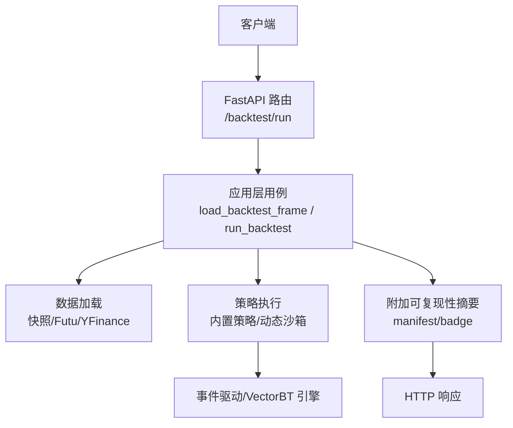
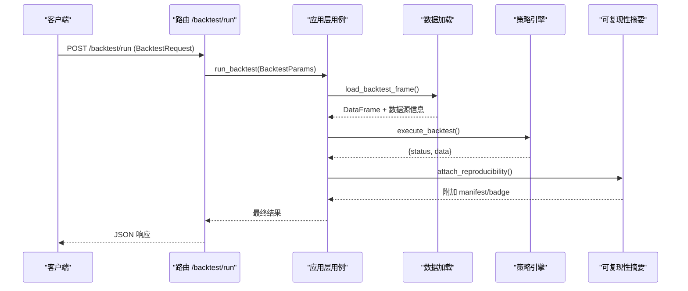
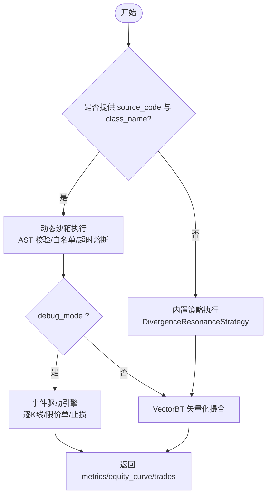
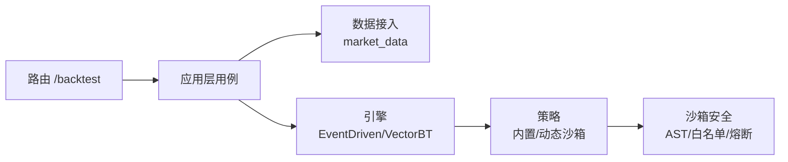

# 基础回测API

<cite>
**本文引用的文件**
- [backend/routers/backtest.py](file://backend/routers/backtest.py)
- [backend/app/backtest_app.py](file://backend/app/backtest_app.py)
- [backend/backtest/event_engine.py](file://backend/backtest/event_engine.py)
- [backend/backtest/strategies.py](file://backend/backtest/strategies.py)
- [backend/backtest/runners.py](file://backend/backtest/runners.py)
- [backend/backtest/sandbox.py](file://backend/backtest/sandbox.py)
- [backend/app/market_data.py](file://backend/app/market_data.py)
</cite>

## 目录
1. [简介](#简介)
2. [项目结构](#项目结构)
3. [核心组件](#核心组件)
4. [架构总览](#架构总览)
5. [详细组件分析](#详细组件分析)
6. [依赖关系分析](#依赖关系分析)
7. [性能考量](#性能考量)
8. [故障排查指南](#故障排查指南)
9. [结论](#结论)
10. [附录](#附录)

## 简介
本文件面向量化研究员，提供 Quant Agent 基础回测 RESTful API 的使用说明，重点覆盖 POST /backtest/run 端点。内容包括：
- 回测参数配置（ticker、period、interval、initial_capital、滑点与手续费等）
- 策略代码提交方式（动态沙箱或内置策略）
- 数据源选择（快照、Futu、YFinance）
- 请求参数校验规则、默认值与错误处理
- 同步执行与流式进度推送
- 响应数据结构（绩效指标、交易记录、权益曲线、可复现性摘要）
- 快速验证策略想法的调用示例与最佳实践

## 项目结构
后端通过 FastAPI 暴露 /backtest 路由，核心流程为：
- 路由层接收请求并做 Pydantic 校验
- 应用层加载历史 K 线（优先数据快照，其次 Futu/YFinance）
- 引擎层执行策略（内置矢量化策略或动态沙箱策略），计算绩效与交易明细
- 附加可复现性信息（代码哈希、数据快照、随机种子等）

图表来源
- [backend/routers/backtest.py:145-168](file://backend/routers/backtest.py#L145-L168)
- [backend/app/backtest_app.py:72-142](file://backend/app/backtest_app.py#L72-L142)
- [backend/app/backtest_app.py:287-296](file://backend/app/backtest_app.py#L287-L296)

章节来源
- [backend/routers/backtest.py:46-61](file://backend/routers/backtest.py#L46-L61)
- [backend/app/backtest_app.py:54-70](file://backend/app/backtest_app.py#L54-L70)

## 核心组件
- 路由与请求模型
  - BacktestRequest：定义 ticker、period、interval、initial_capital、atr_multiplier、commission_pct、slippage_pct、data_source、debug_mode、data_snapshot_id、random_seed、source_code、class_name、params 等字段及默认值
  - 路由 /backtest/run 将请求映射为 BacktestParams 并调用 run_backtest
- 应用层用例
  - load_backtest_frame：按 data_source 优先级加载数据（快照 → Futu → YFinance）
  - execute_backtest：根据是否提供 source_code/class_name 选择动态沙箱或内置策略
  - attach_reproducibility：附加 manifest 与 badge（代码哈希、数据快照、随机种子、可复现性标记）
  - run_backtest：串联数据加载、策略执行、可复现性附加
- 引擎与策略
  - 内置策略 DivergenceResonanceStrategy：RSI/MACD/KDJ 共振，VectorBT 矢量化撮合
  - 事件驱动引擎 EventDrivenBacktestEngine：逐 K 线推进、限价单、止损、滑点与手续费
  - 动态沙箱：AST 安全扫描、白名单模块、超时/内存熔断、Numba JIT 支持
- 数据接入
  - market_data_gateway：统一行情入口，支持 Futu 与 YFinance

章节来源
- [backend/routers/backtest.py:46-61](file://backend/routers/backtest.py#L46-L61)
- [backend/routers/backtest.py:145-168](file://backend/routers/backtest.py#L145-L168)
- [backend/app/backtest_app.py:72-142](file://backend/app/backtest_app.py#L72-L142)
- [backend/app/backtest_app.py:166-221](file://backend/app/backtest_app.py#L166-L221)
- [backend/app/backtest_app.py:224-296](file://backend/app/backtest_app.py#L224-L296)
- [backend/backtest/strategies.py:13-204](file://backend/backtest/strategies.py#L13-L204)
- [backend/backtest/event_engine.py:37-271](file://backend/backtest/event_engine.py#L37-L271)
- [backend/backtest/sandbox.py:147-338](file://backend/backtest/sandbox.py#L147-L338)
- [backend/app/market_data.py:7-15](file://backend/app/market_data.py#L7-L15)

## 架构总览
下图展示从 HTTP 请求到回测结果返回的完整调用链，包括数据加载、策略执行与可复现性附加。

图表来源
- [backend/routers/backtest.py:145-168](file://backend/routers/backtest.py#L145-L168)
- [backend/app/backtest_app.py:287-296](file://backend/app/backtest_app.py#L287-L296)
- [backend/app/backtest_app.py:224-285](file://backend/app/backtest_app.py#L224-L285)

## 详细组件分析

### 端点：POST /backtest/run
- 功能
  - 接收回测参数，拉取历史 K 线，执行策略（内置或动态沙箱），返回绩效指标、交易记录、权益曲线与可复现性摘要
- 请求体字段与默认值
  - ticker: 必填，标的代码
  - period: 时间范围，默认 "2y"
  - interval: K 线周期，默认 "1d"
  - initial_capital: 初始资金，默认 100000.0
  - atr_multiplier: ATR 止损倍数，默认 2.0
  - commission_pct: 手续费比例，默认 0.0005
  - slippage_pct: 滑点比例，默认 0.001
  - data_source: 数据源选择，默认 "auto"（优先快照，其次 Futu/YFinance）
  - debug_mode: 调试模式，默认 false
  - data_snapshot_id: 数据快照 ID，可选
  - random_seed: 随机种子，可选，默认 42
  - source_code: 策略源码，可选；若提供需同时提供 class_name
  - class_name: 策略类名，可选；与 source_code 配合使用
  - params: 策略参数字典，可选
- 参数校验规则
  - 由 Pydantic 模型 BacktestRequest 自动校验类型与必填项
  - 当 data_source 为 "auto" 时，系统依次尝试快照、Futu、YFinance 获取数据
  - 当提供 source_code 与 class_name 时，进入动态沙箱执行路径
- 错误处理机制
  - 数据不可用：抛出 BacktestDataError，路由层转换为 HTTP 400
  - 策略执行异常：捕获异常并返回 {status: "error", message: ...}
  - 流式接口：SSE 推送进度与错误消息，结束返回完整结果
- 同步执行模式
  - 直接返回完整回测结果（含 metrics、equity_curve、trades、limit_orders、manifest、badge）
- 异步任务处理机制
  - 流式接口 /backtest/run/stream 使用 SSE 推送阶段进度（如数据加载、信号生成、撮合、统计、完成），并在结束时返回完整结果
  - 进度包包含 progress、stage、detail 字段，便于前端显示实时状态

章节来源
- [backend/routers/backtest.py:46-61](file://backend/routers/backtest.py#L46-L61)
- [backend/routers/backtest.py:145-168](file://backend/routers/backtest.py#L145-L168)
- [backend/routers/backtest.py:170-218](file://backend/routers/backtest.py#L170-L218)
- [backend/app/backtest_app.py:72-142](file://backend/app/backtest_app.py#L72-L142)
- [backend/app/backtest_app.py:166-221](file://backend/app/backtest_app.py#L166-L221)
- [backend/app/backtest_app.py:287-357](file://backend/app/backtest_app.py#L287-L357)

### 数据加载与数据源选择
- 优先级
  - 首选 data_snapshot_id 指向的数据快照（latest_published 或指定 ID）
  - 其次尝试 Futu OpenD 在线数据
  - 最后尝试 YFinance 历史数据
- 失败处理
  - 任一阶段失败会记录日志并继续下一候选
  - 全部失败则抛出 BacktestDataError，路由层转为 HTTP 400
- 数据格式
  - 统一标准化 OHLCV 列名与时间索引，供后续引擎消费

章节来源
- [backend/app/backtest_app.py:72-142](file://backend/app/backtest_app.py#L72-L142)
- [backend/app/market_data.py:7-15](file://backend/app/market_data.py#L7-L15)

### 策略执行与回测引擎
- 内置策略（无 source_code）
  - 使用 DivergenceResonanceStrategy，基于 VectorBT 矢量化撮合，输出绩效指标、交易明细、权益曲线
- 动态沙箱（提供 source_code 与 class_name）
  - AST 安全扫描，限制危险模块与函数，仅允许 Numba JIT 等装饰器
  - 支持两种契约：
    - 类方法契约：实现 _calculate_indicators() 与 _generate_signals()，输出 dense signal
    - 模块级契约：实现 generate_signals(df)，输出 event signal
  - 高保真模式：debug_mode=true 时降级至事件驱动引擎，逐 K 线推进，支持限价单与止损
- 滑点与手续费
  - 内置策略与事件驱动引擎均按 slippage_pct 与 commission_pct 计算摩擦成本
  - 动态止损通过 ATR 倍数计算 trailing stop

图表来源
- [backend/app/backtest_app.py:166-221](file://backend/app/backtest_app.py#L166-L221)
- [backend/backtest/event_engine.py:37-271](file://backend/backtest/event_engine.py#L37-L271)
- [backend/backtest/strategies.py:13-204](file://backend/backtest/strategies.py#L13-L204)
- [backend/backtest/sandbox.py:147-338](file://backend/backtest/sandbox.py#L147-L338)

章节来源
- [backend/app/backtest_app.py:166-221](file://backend/app/backtest_app.py#L166-L221)
- [backend/backtest/event_engine.py:37-271](file://backend/backtest/event_engine.py#L37-L271)
- [backend/backtest/strategies.py:13-204](file://backend/backtest/strategies.py#L13-L204)
- [backend/backtest/sandbox.py:147-338](file://backend/backtest/sandbox.py#L147-L338)

### 流式回测：/backtest/run/stream
- 功能
  - 使用 SSE 推送回测阶段进度（数据加载、信号生成、撮合、统计、完成），结束时返回完整结果
- 进度包结构
  - progress：百分比进度
  - stage：阶段标识（data、compile、signal、match、stats、curve、done）
  - detail：阶段描述
- 错误处理
  - 发生异常时推送 error 类型消息，包含截断后的堆栈信息

章节来源
- [backend/routers/backtest.py:170-218](file://backend/routers/backtest.py#L170-L218)
- [backend/app/backtest_app.py:299-357](file://backend/app/backtest_app.py#L299-L357)

### 响应数据结构
- 顶层结构
  - status: "success" 或 "error"
  - data: 回测结果对象（成功时）
  - message: 错误信息（失败时）
- data 字段
  - metrics: 绩效指标（total_return、annualized_return、sharpe_ratio、max_drawdown、win_rate、total_trades、profit_factor、total_friction_cost）
  - equity_curve: 权益曲线（date、equity、benchmark、price）
  - trades: 交易记录（date、action、price、shares、profit）
  - limit_orders: 挂单列表（当前为空）
  - manifest: 可复现性清单（run_id、mode、code_hash、params、data_snapshot_id、manifest_hash、random_seed、data_mode、reproducible）
  - badge: 可复现性徽章（code_hash、manifest_hash、reproducible、data_snapshot_id、data_mode）
- 流式响应
  - application/x-ndjson 格式，每条消息为 JSON 字符串，包含 type（result/error）与 data/message

章节来源
- [backend/app/backtest_app.py:224-296](file://backend/app/backtest_app.py#L224-L296)
- [backend/backtest/strategies.py:189-204](file://backend/backtest/strategies.py#L189-L204)
- [backend/backtest/event_engine.py:259-271](file://backend/backtest/event_engine.py#L259-L271)
- [backend/routers/backtest.py:170-218](file://backend/routers/backtest.py#L170-L218)

## 依赖关系分析
- 路由依赖应用层用例
- 应用层依赖数据接入与引擎
- 引擎依赖策略与沙箱安全
- 数据接入依赖市场数据网关

图表来源
- [backend/routers/backtest.py:145-168](file://backend/routers/backtest.py#L145-L168)
- [backend/app/backtest_app.py:72-142](file://backend/app/backtest_app.py#L72-L142)
- [backend/backtest/event_engine.py:37-271](file://backend/backtest/event_engine.py#L37-L271)
- [backend/backtest/sandbox.py:147-338](file://backend/backtest/sandbox.py#L147-L338)

章节来源
- [backend/routers/backtest.py:145-168](file://backend/routers/backtest.py#L145-L168)
- [backend/app/backtest_app.py:72-142](file://backend/app/backtest_app.py#L72-L142)
- [backend/backtest/event_engine.py:37-271](file://backend/backtest/event_engine.py#L37-L271)
- [backend/backtest/sandbox.py:147-338](file://backend/backtest/sandbox.py#L147-L338)

## 性能考量
- 矢量化优先：默认使用 VectorBT 进行高性能回测
- CPU 密集卸载：动态沙箱执行使用进程池，不可 pickle 时回退线程
- 超时与内存熔断：沙箱执行设置超时与内存上限，防止死循环与 OOM
- 数据缓存：YFinance 历史数据带 TTL 缓存，减少重复请求
- 进度推送：流式接口提供细粒度进度，便于前端优化用户体验

章节来源
- [backend/app/backtest_app.py:191-207](file://backend/app/backtest_app.py#L191-L207)
- [backend/backtest/sandbox.py:352-415](file://backend/backtest/sandbox.py#L352-L415)
- [backend/app/backtest_app.py:126-136](file://backend/app/backtest_app.py#L126-L136)

## 故障排查指南
- 数据加载失败
  - 检查 data_source 配置与网络连通性
  - 确认 data_snapshot_id 是否存在且有效
  - 查看日志中 Futu/YFinance 拉取失败原因
- 策略执行异常
  - 动态沙箱：检查源码语法、缩进、导入白名单、未授权装饰器
  - 内置策略：检查 OHLCV 列名与数据长度（至少 10 根 K 线）
- 流式接口无响应
  - 确认 SSE 连接未被代理缓冲（headers 已禁用缓冲）
  - 检查 on_progress 回调是否正确传递
- 常见错误码
  - HTTP 400：数据不可用或参数校验失败
  - status: "error"：策略执行期间异常，message 包含异常类型与堆栈摘要

章节来源
- [backend/routers/backtest.py:164-168](file://backend/routers/backtest.py#L164-L168)
- [backend/app/backtest_app.py:138-142](file://backend/app/backtest_app.py#L138-L142)
- [backend/backtest/sandbox.py:326-338](file://backend/backtest/sandbox.py#L326-L338)
- [backend/backtest/event_engine.py:139-141](file://backend/backtest/event_engine.py#L139-L141)

## 结论
POST /backtest/run 提供了端到端的回测能力，支持灵活的数据源选择、策略代码提交与参数配置，并通过流式接口提供实时进度反馈。结合可复现性摘要，研究人员可以快速验证策略想法并评估其稳健性。建议在生产环境中合理配置 data_source、initial_capital、slippage_pct 与 commission_pct，并结合流式接口提升交互体验。

## 附录

### 请求示例（JSON）
- 内置策略回测
  - 字段：ticker、period、interval、initial_capital、atr_multiplier、commission_pct、slippage_pct、data_source、debug_mode、data_snapshot_id、random_seed
  - 示例键值参考：
    - ticker: "AAPL"
    - period: "2y"
    - interval: "1d"
    - initial_capital: 100000.0
    - atr_multiplier: 2.0
    - commission_pct: 0.0005
    - slippage_pct: 0.001
    - data_source: "auto"
    - debug_mode: false
    - data_snapshot_id: "latest_published"
    - random_seed: 42
- 动态沙箱策略回测
  - 额外字段：source_code、class_name、params
  - 示例键值参考：
    - source_code: "<策略源码>"
    - class_name: "MyStrategy"
    - params: {"atr_multiplier": 2.0, "stop_loss_atr_multiple": 2.0}

章节来源
- [backend/routers/backtest.py:46-61](file://backend/routers/backtest.py#L46-L61)
- [backend/app/backtest_app.py:166-221](file://backend/app/backtest_app.py#L166-L221)

### 响应示例（JSON）
- 成功响应
  - status: "success"
  - data:
    - metrics: {total_return, annualized_return, sharpe_ratio, max_drawdown, win_rate, total_trades, profit_factor, total_friction_cost}
    - equity_curve: [{date, equity, benchmark, price}]
    - trades: [{date, action, price, shares, profit}]
    - limit_orders: []
    - manifest: {run_id, mode, code_hash, params, data_snapshot_id, manifest_hash, random_seed, data_mode, reproducible}
    - badge: {code_hash, manifest_hash, reproducible, data_snapshot_id, data_mode}
- 失败响应
  - status: "error"
  - message: "<异常类型>: <异常信息>\n\n追踪详情:\n<堆栈摘要>"

章节来源
- [backend/app/backtest_app.py:224-296](file://backend/app/backtest_app.py#L224-L296)
- [backend/backtest/strategies.py:189-204](file://backend/backtest/strategies.py#L189-L204)
- [backend/backtest/event_engine.py:259-271](file://backend/backtest/event_engine.py#L259-L271)

### 快速验证策略想法的调用步骤
- 准备数据
  - 选择 data_source="auto"，或使用 data_snapshot_id 指定快照
- 配置参数
  - 设置 ticker、period、interval、initial_capital、slippage_pct、commission_pct
- 提交策略
  - 内置策略：不传 source_code 与 class_name
  - 动态策略：传入 source_code、class_name 与 params
- 执行回测
  - 同步：POST /backtest/run
  - 流式：POST /backtest/run/stream，订阅进度与结果
- 分析结果
  - 查看 metrics、equity_curve、trades
  - 检查 manifest/badge 确认可复现性

章节来源
- [backend/routers/backtest.py:145-218](file://backend/routers/backtest.py#L145-L218)
- [backend/app/backtest_app.py:72-142](file://backend/app/backtest_app.py#L72-L142)
- [backend/app/backtest_app.py:287-357](file://backend/app/backtest_app.py#L287-L357)
