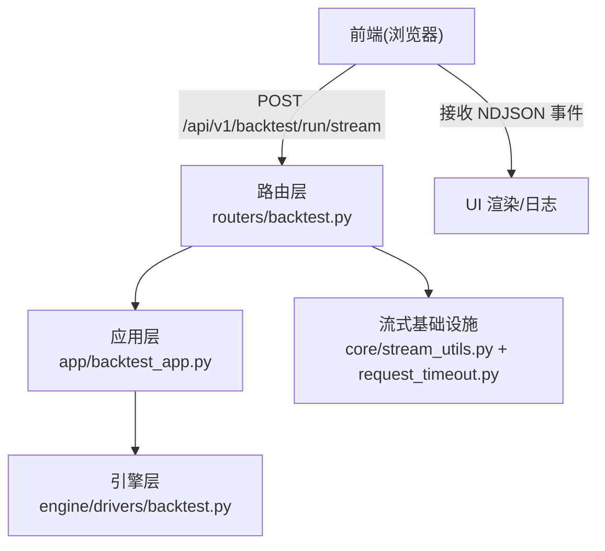
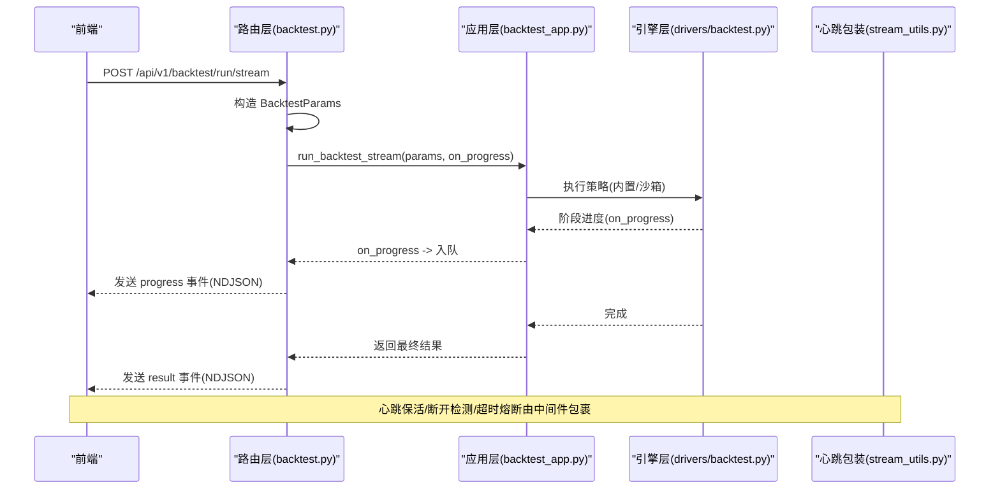
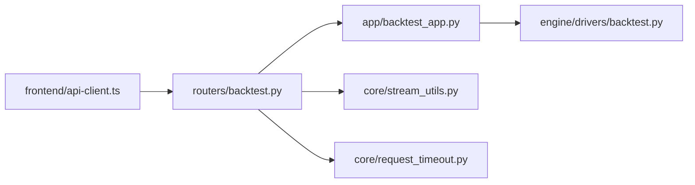
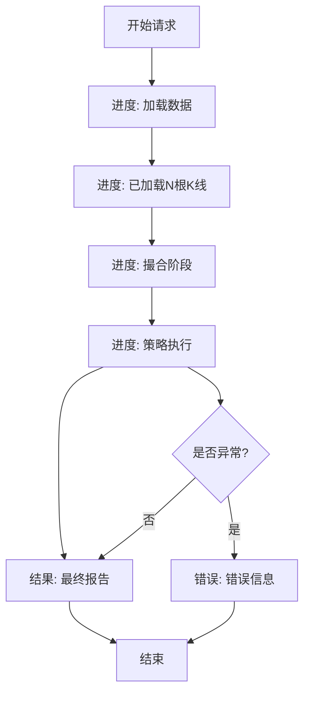

# 流式回测API

<cite>
**本文引用的文件**
- [backend/routers/backtest.py](file://backend/routers/backtest.py)
- [backend/app/backtest_app.py](file://backend/app/backtest_app.py)
- [backend/core/stream_utils.py](file://backend/core/stream_utils.py)
- [backend/core/request_timeout.py](file://backend/core/request_timeout.py)
- [backend/engine/drivers/backtest.py](file://backend/engine/drivers/backtest.py)
- [frontend/src/lib/api-client.ts](file://frontend/src/lib/api-client.ts)
</cite>

## 目录
1. [简介](#简介)
2. [项目结构](#项目结构)
3. [核心组件](#核心组件)
4. [架构总览](#架构总览)
5. [详细组件分析](#详细组件分析)
6. [依赖关系分析](#依赖关系分析)
7. [性能与可靠性](#性能与可靠性)
8. [故障排查指南](#故障排查指南)
9. [结论](#结论)
10. [附录：前端集成示例与消息序列](#附录前端集成示例与消息序列)

## 简介
本文件面向需要实时监控回测进度的应用场景，详细说明 POST /backtest/run/stream 端点的流式实现。该端点以 NDJSON 流式返回回测进度、撮合阶段状态更新以及最终结果；同时提供断线重连、错误处理与资源清理策略指导，并给出完整的前端 JavaScript 集成示例与端到端消息序列。

## 项目结构
- 路由层：后端 FastAPI 路由接收请求，构造参数并通过队列将进度与结果推送到客户端。
- 应用层：负责数据加载、策略执行（内置或动态沙箱），并在执行过程中通过回调推送进度。
- 引擎层：驱动逐 bar 回放、撮合、策略调用与指标计算。
- 流式基础设施：心跳保活、断开检测、超时熔断，避免中间代理中断长连接。
- 前端：统一 SSE/NDJSON 客户端封装，支持订阅、错误处理与资源释放。

图表来源
- [backend/routers/backtest.py:170-218](file://backend/routers/backtest.py#L170-L218)
- [backend/app/backtest_app.py:299-356](file://backend/app/backtest_app.py#L299-L356)
- [backend/core/stream_utils.py:21-77](file://backend/core/stream_utils.py#L21-L77)
- [backend/core/request_timeout.py:37-67](file://backend/core/request_timeout.py#L37-L67)

章节来源
- [backend/routers/backtest.py:170-218](file://backend/routers/backtest.py#L170-L218)
- [backend/app/backtest_app.py:299-356](file://backend/app/backtest_app.py#L299-L356)
- [backend/core/stream_utils.py:21-77](file://backend/core/stream_utils.py#L21-L77)
- [backend/core/request_timeout.py:37-67](file://backend/core/request_timeout.py#L37-L67)

## 核心组件
- 路由端点：POST /backtest/run/stream
  - 职责：校验请求体、构建 BacktestParams、创建异步队列、启动后台任务、按事件类型产出 NDJSON 行。
  - 事件类型：progress（进度）、result（最终结果）、error（错误）。
- 应用层流式执行：run_backtest_stream
  - 职责：加载历史 K 线、执行策略（内置或动态沙箱）、附加可复现性摘要，并通过 on_progress 回调推送阶段进度。
- 引擎层：BacktestDriver
  - 职责：逐 bar 推进、先撮合挂单/止损再驱动策略、记录权益曲线与交易、计算指标。
- 流式基础设施：heartbeat_wrap
  - 职责：为流式响应提供心跳保活、客户端断开检测、超时熔断，避免被反向代理静默掐断。
- 前端 SSE 客户端：SSEClient
  - 职责：建立 EventSource 连接、解析 JSON 消息、错误回调、取消订阅与关闭连接。

章节来源
- [backend/routers/backtest.py:170-218](file://backend/routers/backtest.py#L170-L218)
- [backend/app/backtest_app.py:299-356](file://backend/app/backtest_app.py#L299-L356)
- [backend/engine/drivers/backtest.py:180-344](file://backend/engine/drivers/backtest.py#L180-L344)
- [backend/core/stream_utils.py:21-77](file://backend/core/stream_utils.py#L21-L77)
- [frontend/src/lib/api-client.ts:494-550](file://frontend/src/lib/api-client.ts#L494-L550)

## 架构总览
下图展示了从请求到流式响应的完整链路，包括进度推送与最终结果输出。

图表来源
- [backend/routers/backtest.py:170-218](file://backend/routers/backtest.py#L170-L218)
- [backend/app/backtest_app.py:299-356](file://backend/app/backtest_app.py#L299-L356)
- [backend/core/stream_utils.py:21-77](file://backend/core/stream_utils.py#L21-L77)
- [backend/core/request_timeout.py:37-67](file://backend/core/request_timeout.py#L37-L67)

## 详细组件分析

### 路由端点：POST /backtest/run/stream
- 输入参数：ticker、period、interval、initial_capital、commission_pct、slippage_pct、data_source、debug_mode、data_snapshot_id、random_seed、source_code、class_name、params。
- 行为：
  - 创建 asyncio.Queue 作为进度通道。
  - 启动后台任务执行 run_backtest_stream，并将进度与结果写入队列。
  - 生成器循环读取队列，产出 NDJSON 行；遇到 result 或 error 时终止。
  - 设置响应头 Cache-Control=no-cache、X-Accel-Buffering=no，禁用缓冲。
- 事件类型：
  - progress：包含进度百分比、阶段标识、详情等字段。
  - result：包含最终回测报告与可复现性摘要。
  - error：包含错误信息字符串。

章节来源
- [backend/routers/backtest.py:46-61](file://backend/routers/backtest.py#L46-L61)
- [backend/routers/backtest.py:170-218](file://backend/routers/backtest.py#L170-L218)

### 应用层流式执行：run_backtest_stream
- 数据加载：优先尝试快照数据源，其次 Futu OpenD，最后 YFinance；失败抛出 BacktestDataError。
- 策略执行：
  - 动态沙箱路径：使用 run_cpu_bound_with_progress 推送阶段进度。
  - 内置策略路径：在引擎运行前推送“撮合历史 K 线”的进度提示，随后执行引擎。
- 可复现性：附加 manifest 与 badge（代码哈希、数据模式、随机种子等）。

章节来源
- [backend/app/backtest_app.py:72-142](file://backend/app/backtest_app.py#L72-L142)
- [backend/app/backtest_app.py:299-356](file://backend/app/backtest_app.py#L299-L356)

### 引擎层：BacktestDriver 主循环
- 数据准备：清洗 DataFrame、统一列名、去重。
- RunManifest：生成可复现实例（代码哈希、数据快照、随机种子、数据模式）。
- 逐 bar 推进：
  - 先撮合挂单/止损。
  - 再驱动策略 on_bar。
  - 分发成交回报。
  - 记录权益曲线与基准对比。
- 指标计算：总收益、夏普比率、最大回撤、胜率、摩擦成本。

章节来源
- [backend/engine/drivers/backtest.py:180-344](file://backend/engine/drivers/backtest.py#L180-L344)
- [backend/engine/drivers/backtest.py:358-399](file://backend/engine/drivers/backtest.py#L358-L399)

### 流式基础设施：心跳保活与超时熔断
- heartbeat_wrap：
  - 心跳保活：若源未在 interval 内产出 chunk，则下发心跳字节（NDJSON_HEARTBEAT 或 SSE_HEARTBEAT）。
  - 客户端断开：检测到断开立即终止并取消下游泵任务。
  - 超时熔断：超过 deadline 立即终止。
- 请求级中间件：
  - 根据路由前缀解析超时时间。
  - 对 StreamingResponse 用 heartbeat_wrap 包裹，注入 deadline 与心跳。

章节来源
- [backend/core/stream_utils.py:21-77](file://backend/core/stream_utils.py#L21-L77)
- [backend/core/request_timeout.py:37-67](file://backend/core/request_timeout.py#L37-L67)

### 前端集成：SSE 客户端
- SSEClient：
  - 使用 EventSource 建立连接，withCredentials=true。
  - onmessage 解析 JSON 并回调。
  - onerror 上报错误。
  - 返回取消函数，用于关闭连接并从 Map 中移除。
- UnifiedApiClient：
  - 暴露 subscribe(path, onMessage, onError) 快捷方法。
  - 提供 REST 与流式请求的统一入口。

章节来源
- [frontend/src/lib/api-client.ts:494-550](file://frontend/src/lib/api-client.ts#L494-L550)
- [frontend/src/lib/api-client.ts:552-589](file://frontend/src/lib/api-client.ts#L552-L589)

## 依赖关系分析
- 路由层依赖应用层接口 run_backtest_stream。
- 应用层依赖数据加载模块与 CPU 密集任务调度（进程池/线程池）。
- 引擎层依赖 SimBroker、SimClock、Strategy 抽象。
- 流式基础设施为所有长连接提供统一保护。
- 前端通过统一 API 客户端进行 SSE 订阅与资源管理。

图表来源
- [backend/routers/backtest.py:170-218](file://backend/routers/backtest.py#L170-L218)
- [backend/app/backtest_app.py:299-356](file://backend/app/backtest_app.py#L299-L356)
- [backend/core/stream_utils.py:21-77](file://backend/core/stream_utils.py#L21-L77)
- [backend/core/request_timeout.py:37-67](file://backend/core/request_timeout.py#L37-L67)
- [frontend/src/lib/api-client.ts:494-550](file://frontend/src/lib/api-client.ts#L494-L550)

## 性能与可靠性
- 性能
  - CPU 密集任务卸载至进程池，不可 pickle 时自动回退线程，避免阻塞事件循环。
  - 逐 bar 撮合与策略调用顺序优化，减少不必要的计算。
  - 指标计算采用向量化操作，降低内存与时间开销。
- 可靠性
  - 心跳保活避免 Cloudflare/Nginx 等代理因静默超时而断开连接。
  - 客户端断开检测及时取消下游任务，避免资源浪费。
  - 请求级超时熔断防止长时间无响应占用服务器资源。
  - 错误路径统一捕获并转为 error 事件，不中断流式传输。

[本节为通用指导，不直接分析具体文件]

## 故障排查指南
- 常见问题
  - 数据加载失败：检查 data_source 配置与网络连通性；确认快照 ID 是否有效。
  - 策略执行异常：查看 error 事件中的堆栈信息；确认 source_code 与 class_name 匹配。
  - 连接中断：检查反向代理超时配置；确认前端已正确关闭与重连。
- 定位步骤
  - 观察 progress 事件阶段标识，定位卡点位置（data、match、strategy）。
  - 检查服务端日志与指标（CPU、内存、队列长度）。
  - 使用最小化请求体复现问题，逐步增加复杂度。

章节来源
- [backend/app/backtest_app.py:72-142](file://backend/app/backtest_app.py#L72-L142)
- [backend/routers/backtest.py:170-218](file://backend/routers/backtest.py#L170-L218)

## 结论
POST /backtest/run/stream 提供了完整的流式回测能力，覆盖进度推送、撮合阶段状态更新与最终结果输出。结合心跳保活、超时熔断与前端资源管理，可满足实时监控场景的高可用与低延迟需求。建议在生产环境启用请求级超时与监控告警，确保长连接的稳定性与可观测性。

[本节为总结，不直接分析具体文件]

## 附录：前端集成示例与消息序列

### 前端 JavaScript 集成示例
- 建立连接：使用 EventSource 或统一 SSEClient.subscribe 连接到 /api/v1/backtest/run/stream。
- 处理消息：
  - progress：更新进度条与阶段描述。
  - result：渲染最终报告与指标。
  - error：显示错误信息并停止刷新。
- 断线重连：
  - 监听 onerror，等待一段时间后重试连接。
  - 保持幂等：重新发起相同参数的请求。
- 资源清理：
  - 组件卸载或用户主动取消时调用取消函数关闭连接。
  - 清空本地状态，避免残留定时器或引用。

章节来源
- [frontend/src/lib/api-client.ts:494-550](file://frontend/src/lib/api-client.ts#L494-L550)
- [frontend/src/lib/api-client.ts:552-589](file://frontend/src/lib/api-client.ts#L552-L589)

### 完整消息序列示例
- 开始：
  - 前端 POST /api/v1/backtest/run/stream，携带 ticker、period、interval 等参数。
  - 服务端返回 progress 事件：加载数据、已加载 N 根 K 线。
- 撮合阶段：
  - 服务端推送 progress：进入撮合阶段，描述“撮合历史 K 线”。
  - 引擎逐 bar 推进，期间可能多次推送进度。
- 结束：
  - 服务端推送 result：包含最终回测报告与可复现性摘要。
  - 前端停止刷新，渲染结果。
- 错误路径：
  - 任意阶段出现异常，服务端推送 error 事件，包含错误信息。
  - 前端显示错误并允许重试。

图表来源
- [backend/routers/backtest.py:170-218](file://backend/routers/backtest.py#L170-L218)
- [backend/app/backtest_app.py:299-356](file://backend/app/backtest_app.py#L299-L356)