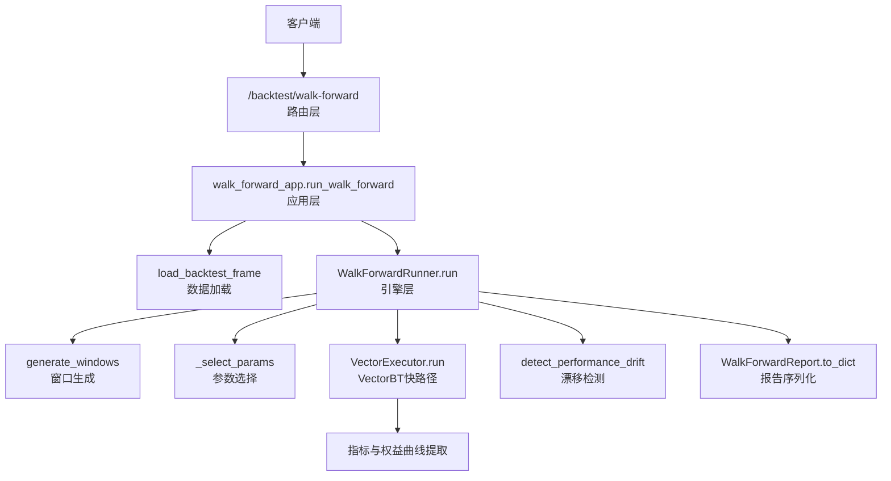
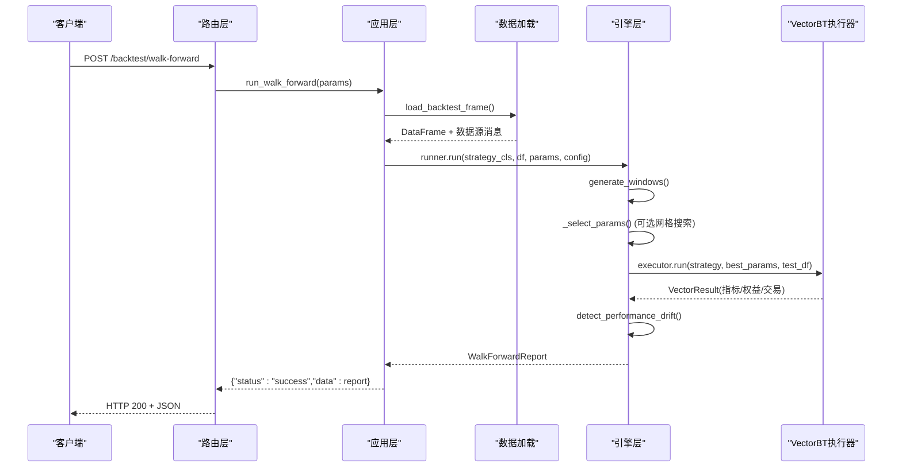
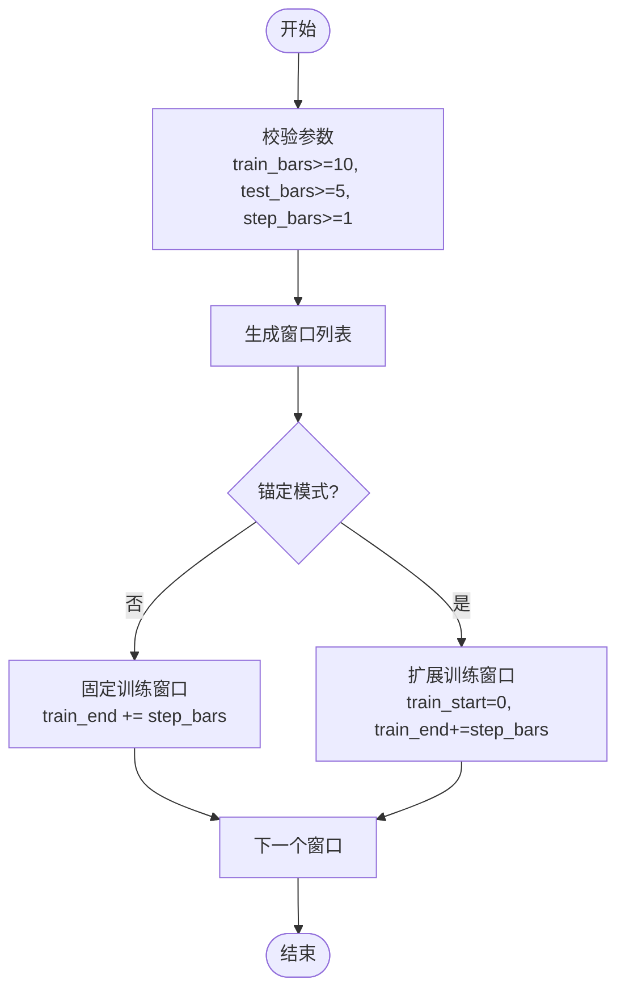
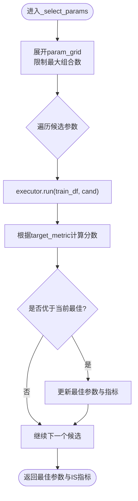
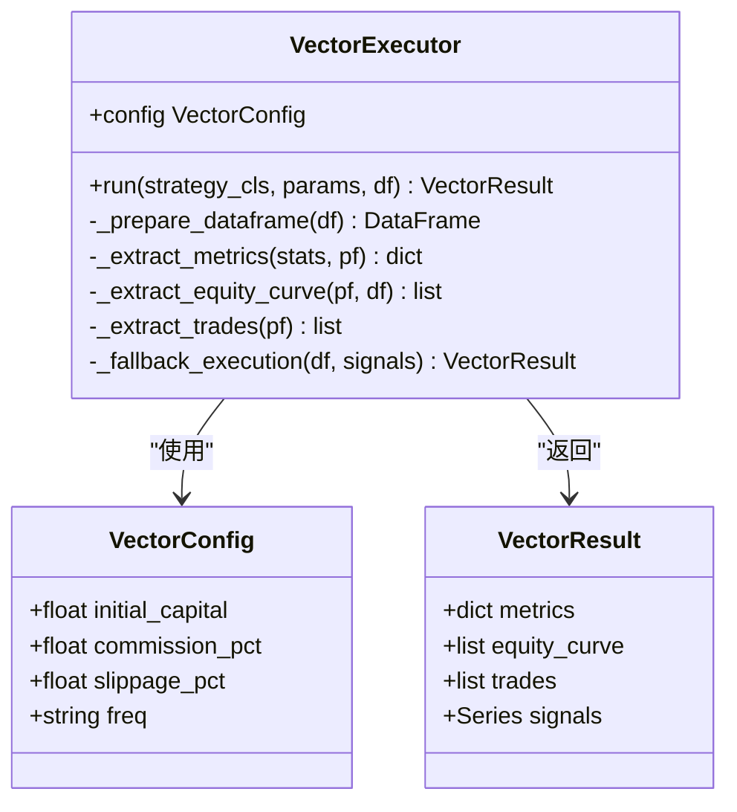
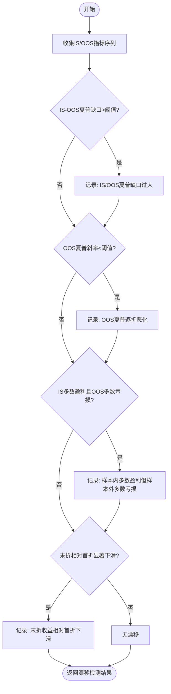
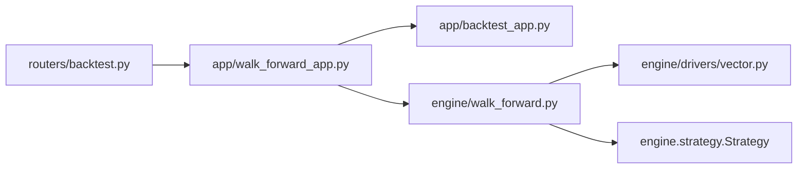

# 滚动验证API

<cite>
**本文引用的文件**
- [backend/routers/backtest.py](file://backend/routers/backtest.py)
- [backend/app/walk_forward_app.py](file://backend/app/walk_forward_app.py)
- [backend/engine/walk_forward.py](file://backend/engine/walk_forward.py)
- [backend/engine/drivers/vector.py](file://backend/engine/drivers/vector.py)
- [backend/app/backtest_app.py](file://backend/app/backtest_app.py)
- [backend/core/cpu_pool.py](file://backend/core/cpu_pool.py)
</cite>

## 目录
1. [简介](#简介)
2. [项目结构](#项目结构)
3. [核心组件](#核心组件)
4. [架构总览](#架构总览)
5. [详细组件分析](#详细组件分析)
6. [依赖关系分析](#依赖关系分析)
7. [性能与并行执行](#性能与并行执行)
8. [请求与响应规范](#请求与响应规范)
9. [故障排查](#故障排查)
10. [结论](#结论)

## 简介
本接口文档面向量化研究员，提供稳健性验证的“滚动验证 Walk-Forward”能力。通过 POST /backtest/walk-forward 端点，系统会：
- 按滚动或锚定窗口拆分训练集（IS）与测试集（OOS）
- 在训练窗口内支持参数网格搜索，选择最优参数
- 使用 VectorBT 快路径对每个 OOS 窗口进行高性能回测
- 检测样本外性能漂移并给出告警原因
- 输出各窗口的绩效对比、权益曲线片段与优化建议

该接口适合用于策略稳健性评估、过拟合预警与参数敏感性分析。

## 项目结构
Walk-Forward 功能由路由层、应用层、引擎层与执行器层组成：
- 路由层：定义 HTTP 请求模型与端点映射
- 应用层：组装参数、加载数据、调用引擎
- 引擎层：滚动窗口生成、参数选择、漂移检测、报告汇总
- 执行器层：VectorBT 快路径执行与指标提取

图表来源
- [backend/routers/backtest.py:221-245](file://backend/routers/backtest.py#L221-L245)
- [backend/app/walk_forward_app.py:60-107](file://backend/app/walk_forward_app.py#L60-L107)
- [backend/engine/walk_forward.py:126-243](file://backend/engine/walk_forward.py#L126-L243)
- [backend/engine/drivers/vector.py:54-133](file://backend/engine/drivers/vector.py#L54-L133)

章节来源
- [backend/routers/backtest.py:221-245](file://backend/routers/backtest.py#L221-L245)
- [backend/app/walk_forward_app.py:60-107](file://backend/app/walk_forward_app.py#L60-L107)
- [backend/engine/walk_forward.py:126-243](file://backend/engine/walk_forward.py#L126-L243)
- [backend/engine/drivers/vector.py:54-133](file://backend/engine/drivers/vector.py#L54-L133)

## 核心组件
- 请求模型：WalkForwardRequest（包含 ticker、period、interval、初始资金、手续费、滑点、数据源、策略键、参数、网格、滚动参数、目标指标等）
- 应用层：run_walk_forward 负责数据加载、参数转换、构建配置与执行器、调用引擎并返回统一响应
- 引擎层：WalkForwardRunner 负责窗口生成、参数选择、OOS 回测、漂移检测与报告汇总
- 执行器层：VectorExecutor 基于 VectorBT 快速执行信号到组合，提取指标、交易与权益曲线
- 数据加载：load_backtest_frame 支持快照、Futu、YFinance 多源数据获取与标准化

章节来源
- [backend/routers/backtest.py:63-82](file://backend/routers/backtest.py#L63-L82)
- [backend/app/walk_forward_app.py:27-107](file://backend/app/walk_forward_app.py#L27-L107)
- [backend/engine/walk_forward.py:28-100](file://backend/engine/walk_forward.py#L28-L100)
- [backend/engine/drivers/vector.py:25-43](file://backend/engine/drivers/vector.py#L25-L43)
- [backend/app/backtest_app.py:72-142](file://backend/app/backtest_app.py#L72-L142)

## 架构总览
Walk-Forward 的整体流程如下：
- 接收请求后，路由层校验并转换为内部参数对象
- 应用层加载历史K线，统一列名小写，构造 WalkForwardConfig 与 VectorConfig
- 引擎层生成滚动/锚定窗口，在训练窗口内进行参数网格搜索，选择最优参数
- 对每个 OOS 窗口执行 VectorBT 快路径回测，计算 IS/OOS 指标
- 检测性能漂移（夏普缺口、趋势恶化、多数折盈亏反转、末期相对初期变差）
- 汇总为 WalkForwardReport，序列化为 JSON 响应

图表来源
- [backend/routers/backtest.py:221-245](file://backend/routers/backtest.py#L221-L245)
- [backend/app/walk_forward_app.py:60-107](file://backend/app/walk_forward_app.py#L60-L107)
- [backend/engine/walk_forward.py:176-243](file://backend/engine/walk_forward.py#L176-L243)
- [backend/engine/drivers/vector.py:54-133](file://backend/engine/drivers/vector.py#L54-L133)

## 详细组件分析

### 滚动窗口与锚定模式
- 固定窗口（anchored=False）：训练窗口长度固定为 train_bars，随 step_bars 步进滑动
- 扩展窗口（anchored=True）：训练窗口从起点开始逐步扩展，测试窗口长度固定为 test_bars
- 步长 step_bars 默认等于 test_bars；可自定义更细粒度步进
- 最小窗口约束：train_bars>=10，test_bars>=5，step_bars>=1

图表来源
- [backend/engine/walk_forward.py:126-146](file://backend/engine/walk_forward.py#L126-L146)

章节来源
- [backend/engine/walk_forward.py:126-146](file://backend/engine/walk_forward.py#L126-L146)

### 参数网格搜索集成
- 支持 param_grid 笛卡尔积展开，上限 max_grid_combos 防止组合爆炸
- 在训练窗口内对候选参数逐一运行 VectorBT 快路径，依据 target_metric 评分选择最佳参数
- target_metric 支持 sharpe 与 total_return
- 若未提供 param_grid，则使用 base params 直接训练

图表来源
- [backend/engine/walk_forward.py:149-167](file://backend/engine/walk_forward.py#L149-L167)
- [backend/engine/walk_forward.py:245-265](file://backend/engine/walk_forward.py#L245-L265)

章节来源
- [backend/engine/walk_forward.py:149-167](file://backend/engine/walk_forward.py#L149-L167)
- [backend/engine/walk_forward.py:245-265](file://backend/engine/walk_forward.py#L245-L265)

### VectorBT 快路径优化
- 要求策略实现 signals(df, params) 返回信号序列
- 将信号转为 entries/exits/short_entries/short_exits，调用 VectorBT Portfolio.from_signals
- 提取 stats、权益曲线、交易记录；若无 VectorBT 则回退到简单模拟执行
- 费用与滑点与 SimBroker 同源配置，保证结果可比

图表来源
- [backend/engine/drivers/vector.py:25-43](file://backend/engine/drivers/vector.py#L25-L43)
- [backend/engine/drivers/vector.py:45-133](file://backend/engine/drivers/vector.py#L45-L133)
- [backend/engine/drivers/vector.py:135-216](file://backend/engine/drivers/vector.py#L135-L216)
- [backend/engine/drivers/vector.py:218-289](file://backend/engine/drivers/vector.py#L218-L289)

章节来源
- [backend/engine/drivers/vector.py:45-133](file://backend/engine/drivers/vector.py#L45-L133)
- [backend/engine/drivers/vector.py:135-216](file://backend/engine/drivers/vector.py#L135-L216)
- [backend/engine/drivers/vector.py:218-289](file://backend/engine/drivers/vector.py#L218-L289)

### 性能漂移检测
- 计算 IS/OOS 夏普均值差，超过阈值触发告警
- 计算 OOS 夏普线性斜率，若显著负向则提示逐折恶化
- 统计 IS 盈利比例与 OOS 亏损比例，若多数折反转则告警
- 比较末折与首折 OOS 收益，若显著下滑则告警

图表来源
- [backend/engine/walk_forward.py:268-301](file://backend/engine/walk_forward.py#L268-L301)

章节来源
- [backend/engine/walk_forward.py:268-301](file://backend/engine/walk_forward.py#L268-L301)

### 内置策略与矢量化要求
- 内置示例策略：SmaCrossStrategy（均线穿越），必须实现 signals() 方法以支持矢量化
- 非矢量化策略无法用于 Walk-Forward，会抛出异常

章节来源
- [backend/engine/walk_forward.py:323-340](file://backend/engine/walk_forward.py#L323-L340)

## 依赖关系分析
- 路由层依赖应用层与解释服务（AI解读），但 Walk-Forward 主流程不依赖 AI 模块
- 应用层依赖数据加载与引擎层
- 引擎层依赖执行器层与策略接口
- 执行器层依赖 VectorBT（可选），并提供回退逻辑

图表来源
- [backend/routers/backtest.py:221-245](file://backend/routers/backtest.py#L221-L245)
- [backend/app/walk_forward_app.py:60-107](file://backend/app/walk_forward_app.py#L60-L107)
- [backend/engine/walk_forward.py:176-243](file://backend/engine/walk_forward.py#L176-L243)
- [backend/engine/drivers/vector.py:54-133](file://backend/engine/drivers/vector.py#L54-L133)

章节来源
- [backend/routers/backtest.py:221-245](file://backend/routers/backtest.py#L221-L245)
- [backend/app/walk_forward_app.py:60-107](file://backend/app/walk_forward_app.py#L60-L107)
- [backend/engine/walk_forward.py:176-243](file://backend/engine/walk_forward.py#L176-L243)
- [backend/engine/drivers/vector.py:54-133](file://backend/engine/drivers/vector.py#L54-L133)

## 性能与并行执行
- CPU 密集型任务通过进程池与信号量背压管理，避免阻塞事件循环
- Walk-Forward 本身串行执行各窗口，但可通过并发多个请求利用进程池并行
- VectorBT 快路径在 C 扩展中释放 GIL，提升计算效率；若无 VectorBT 自动回退
- 内存管理：DataFrame 复制与列名标准化，避免重复引用；权益曲线与交易记录按需提取

章节来源
- [backend/core/cpu_pool.py:1-219](file://backend/core/cpu_pool.py#L1-L219)
- [backend/engine/drivers/vector.py:54-133](file://backend/engine/drivers/vector.py#L54-L133)
- [backend/app/backtest_app.py:72-142](file://backend/app/backtest_app.py#L72-L142)

## 请求与响应规范

### 端点
- 方法：POST
- 路径：/backtest/walk-forward
- 标签：Backtesting Engine

### 请求体字段（WalkForwardRequest）
- ticker: 标的代码（字符串）
- period: 时间范围（如 2y、1y、max）
- interval: K线周期（如 1d、1m、5m、15m、1h）
- initial_capital: 初始资金（浮点数）
- commission_pct: 手续费比例（浮点数）
- slippage_pct: 滑点比例（浮点数）
- data_source: 数据源（auto、futu、yfinance）
- data_snapshot_id: 数据快照ID（可选）
- strategy_key: 策略键（如 sma_cross）
- params: 基础参数（字典）
- param_grid: 参数网格（字典列表，笛卡尔积上限48）
- train_bars: 训练窗口长度（整数，>=10）
- test_bars: 测试窗口长度（整数，>=5）
- step_bars: 步进长度（整数，>=1；默认等于 test_bars）
- anchored: 是否扩展训练窗口（布尔）
- target_metric: 目标指标（sharpe 或 total_return）

### 响应体结构
- status: success
- data: 包含以下字段
  - folds: 各滚动窗口结果数组
    - fold_index: 窗口序号
    - train_range: [train_start, train_end]
    - test_range: [test_start, test_end]
    - params: 该窗口使用的参数
    - is_metrics: 训练窗口指标（total_return、sharpe、max_drawdown、n_bars）
    - oos_metrics: 测试窗口指标（同上）
  - drift_detected: 是否检测到漂移（布尔）
  - drift_reasons: 漂移原因列表（字符串）
  - summary: 汇总统计
    - n_folds: 窗口数量
    - oos_total_return_mean/std: OOS 总收益均值/标准差
    - oos_sharpe_mean/std: OOS 夏普均值/标准差
    - is_sharpe_mean: IS 夏普均值
    - is_oos_sharpe_gap: IS/OOS 夏普缺口
    - oos_positive_fold_ratio: OOS 正收益窗口比例
  - config: 本次运行的配置
    - train_bars、test_bars、step_bars、anchored、target_metric、n_folds、n_bars
  - data_source_msg: 数据来源消息
  - strategy_key: 使用的策略键
  - ticker: 标的代码

### 请求示例
- 固定窗口滚动验证（默认）
  - 设置 anchored=false，train_bars=120，test_bars=40，step_bars=40
  - 适用于稳定市场环境下策略稳健性检验
- 扩展窗口滚动验证
  - 设置 anchored=true，train_bars=120，test_bars=40，step_bars=40
  - 适用于长期趋势策略，训练集逐步扩大以提升稳定性
- 带网格搜索的参数优化
  - 设置 param_grid={"period":[10,20,30],"slow":[40,60]}，target_metric="sharpe"
  - 在训练窗口内自动选择最优参数，再在 OOS 窗口验证

注意：以上示例仅描述参数含义与配置方式，具体数值应根据实际数据规模与策略特性调整。

章节来源
- [backend/routers/backtest.py:63-82](file://backend/routers/backtest.py#L63-L82)
- [backend/engine/walk_forward.py:67-100](file://backend/engine/walk_forward.py#L67-L100)
- [backend/engine/walk_forward.py:28-43](file://backend/engine/walk_forward.py#L28-L43)

## 故障排查
- 数据加载失败：检查 data_source、ticker、period、interval 是否正确；确认 Futu/YFinance 可用
- 策略不支持矢量化：确保策略实现 signals() 方法；否则无法用于 Walk-Forward
- 数据不足：确保 n_bars 足够生成至少 min_folds 个窗口；调整 train_bars/test_bars/step_bars
- 网格组合过多：param_grid 组合超过上限会被截断；减少参数空间或增大 max_grid_combos
- VectorBT 未安装：自动回退到简单执行，指标可能不完整；建议安装 VectorBT 以获得完整统计

章节来源
- [backend/app/backtest_app.py:72-142](file://backend/app/backtest_app.py#L72-L142)
- [backend/engine/walk_forward.py:193-204](file://backend/engine/walk_forward.py#L193-L204)
- [backend/engine/walk_forward.py:149-167](file://backend/engine/walk_forward.py#L149-L167)
- [backend/engine/drivers/vector.py:131-133](file://backend/engine/drivers/vector.py#L131-L133)

## 结论
POST /backtest/walk-forward 提供了完整的滚动验证能力，结合 VectorBT 快路径与漂移检测，帮助量化研究员评估策略稳健性与参数敏感性。通过合理配置滚动参数、目标指标与网格搜索，可在不同市场环境下获得可靠的验证结果。建议结合 AI 解读接口进一步分析漂移原因与优化建议，形成闭环的策略研发流程。