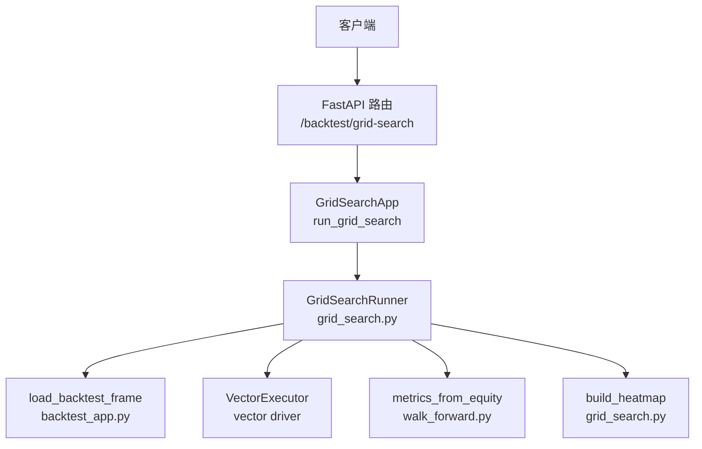
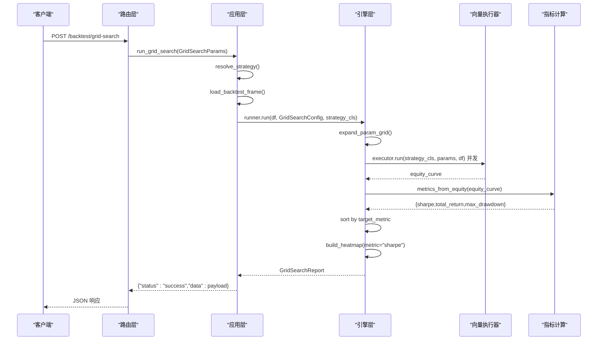
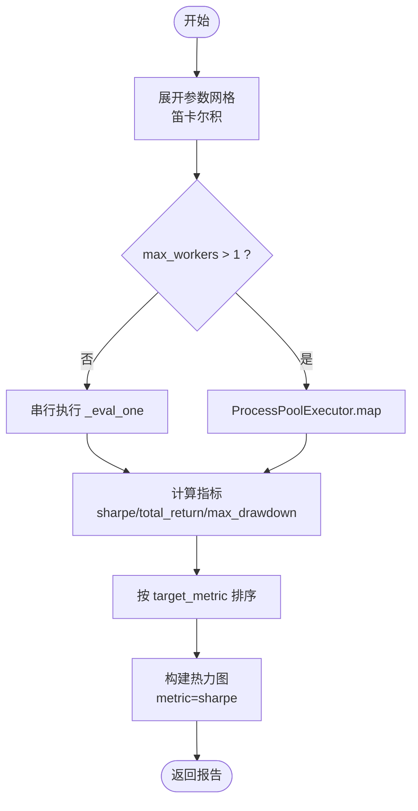
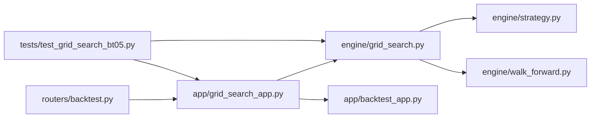

# 网格搜索API

<cite>
**本文引用的文件**
- [backend/routers/backtest.py](file://backend/routers/backtest.py)
- [backend/app/grid_search_app.py](file://backend/app/grid_search_app.py)
- [backend/engine/grid_search.py](file://backend/engine/grid_search.py)
- [backend/engine/strategy.py](file://backend/engine/strategy.py)
- [backend/engine/walk_forward.py](file://backend/engine/walk_forward.py)
- [backend/app/backtest_app.py](file://backend/app/backtest_app.py)
- [backend/tests/test_grid_search_bt05.py](file://backend/tests/test_grid_search_bt05.py)
</cite>

## 目录
1. [简介](#简介)
2. [项目结构](#项目结构)
3. [核心组件](#核心组件)
4. [架构总览](#架构总览)
5. [详细组件分析](#详细组件分析)
6. [依赖关系分析](#依赖关系分析)
7. [性能与并发](#性能与并发)
8. [故障排查指南](#故障排查指南)
9. [结论](#结论)
10. [附录：请求与响应规范](#附录请求与响应规范)

## 简介
本文件面向量化研究员，系统化说明 Quant Agent 的“参数网格搜索”能力，聚焦 POST /backtest/grid-search 端点。该接口支持多维参数空间探索、并发回测执行、目标指标选择（sharpe、total_return、max_drawdown）、工作进程配置（max_workers）以及热力图坐标设置（heatmap_x、heatmap_y），并返回排序后的搜索结果、最优参数组合与可直接用于前端可视化（ECharts heatmap）的热力图数据。

## 项目结构
网格搜索功能由路由层、应用层与引擎层协同完成：
- 路由层：定义 HTTP 端点与请求模型，负责参数校验与异常映射。
- 应用层：组装参数、加载数据、调用引擎并包装结果。
- 引擎层：展开参数网格、并发执行矢量化回测、计算指标、生成热力图矩阵。

图表来源
- [backend/routers/backtest.py:272-295](file://backend/routers/backtest.py#L272-L295)
- [backend/app/grid_search_app.py:47-104](file://backend/app/grid_search_app.py#L47-L104)
- [backend/engine/grid_search.py:221-296](file://backend/engine/grid_search.py#L221-L296)
- [backend/app/backtest_app.py:72-142](file://backend/app/backtest_app.py#L72-L142)
- [backend/engine/walk_forward.py:103-123](file://backend/engine/walk_forward.py#L103-L123)

章节来源
- [backend/routers/backtest.py:105-123](file://backend/routers/backtest.py#L105-L123)
- [backend/app/grid_search_app.py:22-39](file://backend/app/grid_search_app.py#L22-L39)
- [backend/engine/grid_search.py:88-118](file://backend/engine/grid_search.py#L88-L118)

## 核心组件
- GridSearchRequest：HTTP 请求体，包含标的、时间范围、策略键、参数网格、目标指标、并发度与热力图坐标等。
- GridSearchParams：应用层参数对象，透传到引擎。
- GridSearchConfig：引擎侧配置，含参数网格、基础参数、目标指标、最大组合数、工作进程数与热力图坐标。
- GridSearchRunner：核心执行器，展开参数网格、并发执行、排序结果、构建热力图。
- build_heatmap：将结果转换为 ECharts 友好的二维矩阵与 echarts_data。
- metrics_from_equity：从权益曲线计算夏普、总收益、最大回撤等指标。

章节来源
- [backend/routers/backtest.py:105-123](file://backend/routers/backtest.py#L105-L123)
- [backend/app/grid_search_app.py:22-39](file://backend/app/grid_search_app.py#L22-L39)
- [backend/engine/grid_search.py:88-118](file://backend/engine/grid_search.py#L88-L118)
- [backend/engine/grid_search.py:143-218](file://backend/engine/grid_search.py#L143-L218)
- [backend/engine/walk_forward.py:103-123](file://backend/engine/walk_forward.py#L103-L123)

## 架构总览
网格搜索端到端流程如下：
1. 客户端发送 POST /backtest/grid-search，携带 param_grid、target_metric、max_workers、heatmap_x/y 等。
2. 路由层构造 GridSearchParams，调用 run_grid_search。
3. 应用层解析策略、加载历史 K 线数据，构造 VectorConfig。
4. 引擎层展开参数网格为笛卡尔积组合，按 max_workers 并发执行矢量化回测。
5. 对每个组合计算 sharpe、total_return、max_drawdown，并按 target_metric 排序。
6. 构建固定维度切片的热力图矩阵（默认以 sharpe 作为热力值）。
7. 返回 status、data（results、best、heatmap、n_combos、n_ok、workers、config）及附加信息。

图表来源
- [backend/routers/backtest.py:272-295](file://backend/routers/backtest.py#L272-L295)
- [backend/app/grid_search_app.py:47-104](file://backend/app/grid_search_app.py#L47-L104)
- [backend/engine/grid_search.py:221-296](file://backend/engine/grid_search.py#L221-L296)
- [backend/engine/walk_forward.py:103-123](file://backend/engine/walk_forward.py#L103-L123)

## 详细组件分析

### 端点与请求模型
- 路径：POST /backtest/grid-search
- 请求体字段（GridSearchRequest）：
  - ticker：标的代码
  - period：回测周期（如 2y）
  - interval：K线级别（如 1d）
  - initial_capital：初始资金
  - commission_pct：手续费比例
  - slippage_pct：滑点比例
  - data_source：数据来源（auto/futu/yfinance）
  - data_snapshot_id：快照ID（可选）
  - strategy_key：策略键（默认 sma_cross）
  - base_params：基础参数（将被 param_grid 覆盖）
  - param_grid：参数网格（字典，值为列表）
  - target_metric：目标指标（sharpe | total_return | max_drawdown）
  - max_workers：工作进程数（0=自动；1=串行；上限16）
  - heatmap_x：热力图X轴参数名（可选）
  - heatmap_y：热力图Y轴参数名（可选）

章节来源
- [backend/routers/backtest.py:105-123](file://backend/routers/backtest.py#L105-L123)

### 应用层处理
- 解析策略：resolve_strategy(strategy_key)
- 加载数据：load_backtest_frame(BacktestParams)
- 构造 Runner：传入 VectorConfig、strategy_key
- 运行搜索：runner.run(df, GridSearchConfig, strategy_cls)
- 包装结果：附加 data_source_msg、strategy_key、ticker、strategies_available

章节来源
- [backend/app/grid_search_app.py:47-104](file://backend/app/grid_search_app.py#L47-L104)
- [backend/app/backtest_app.py:72-142](file://backend/app/backtest_app.py#L72-L142)

### 引擎层执行
- 参数网格展开：expand_param_grid(base_params, param_grid, max_combos)
- 并发执行：ProcessPoolExecutor 或串行执行 _eval_one
- 指标计算：metrics_from_equity(equity_curve, initial_capital)
- 排序规则：按 target_metric 升序/降序（max_drawdown 升序，其余降序）
- 热力图构建：build_heatmap(results, param_grid, metric="sharpe", x_param, y_param, fixed_params)

图表来源
- [backend/engine/grid_search.py:121-140](file://backend/engine/grid_search.py#L121-L140)
- [backend/engine/grid_search.py:221-296](file://backend/engine/grid_search.py#L221-L296)
- [backend/engine/walk_forward.py:103-123](file://backend/engine/walk_forward.py#L103-L123)

章节来源
- [backend/engine/grid_search.py:121-140](file://backend/engine/grid_search.py#L121-L140)
- [backend/engine/grid_search.py:221-296](file://backend/engine/grid_search.py#L221-L296)

### 热力图坐标与固定参数
- 若未指定 heatmap_x/heatmap_y，则默认取 param_grid 的前两个键作为 x/y。
- 超过两维时，其余参数被固定为 best 或 fixed_params 的切片，确保输出二维矩阵。
- 热力图始终使用 sharpe 作为矩阵值，便于统一可视化。

章节来源
- [backend/engine/grid_search.py:143-218](file://backend/engine/grid_search.py#L143-L218)

### 策略与矢量化要求
- 网格搜索要求策略实现 signals() 以启用矢量化快路径。
- 内置示例：SmaCrossStrategy（均线穿越），提供 signals() 实现。
- 非矢量化策略会被拒绝，避免事件驱动路径带来的高开销。

章节来源
- [backend/engine/strategy.py:68-89](file://backend/engine/strategy.py#L68-L89)
- [backend/engine/walk_forward.py:323-340](file://backend/engine/walk_forward.py#L323-L340)

## 依赖关系分析
- 路由层依赖应用层与引擎层，仅做参数映射与异常转换。
- 应用层依赖数据加载与策略解析，封装引擎调用。
- 引擎层依赖向量执行器与指标计算模块，内部通过进程池实现并发。
- 测试覆盖网格展开、热力图矩阵、串行/并发路径与错误映射。

图表来源
- [backend/routers/backtest.py:272-295](file://backend/routers/backtest.py#L272-L295)
- [backend/app/grid_search_app.py:47-104](file://backend/app/grid_search_app.py#L47-L104)
- [backend/engine/grid_search.py:221-296](file://backend/engine/grid_search.py#L221-L296)
- [backend/tests/test_grid_search_bt05.py:190-209](file://backend/tests/test_grid_search_bt05.py#L190-L209)

章节来源
- [backend/tests/test_grid_search_bt05.py:42-101](file://backend/tests/test_grid_search_bt05.py#L42-L101)
- [backend/tests/test_grid_search_bt05.py:103-187](file://backend/tests/test_grid_search_bt05.py#L103-L187)

## 性能与并发
- 并发策略：当 max_workers > 1 时使用 ProcessPoolExecutor 并行执行各参数组合的回测；否则串行执行。
- 工作进程数：默认自动选择 min(4, cpu_count)，最小为1，最大受限于组合数与配置上限（16）。
- 资源管理：进程初始化时注入 DataFrame、VectorConfig、strategy_key，避免重复传递大对象。
- 单格失败隔离：单个参数组合失败不会中断整体搜索，记录日志并以极值占位。
- 组合上限：默认限制最大组合数为 256，防止参数空间过大导致超时。

章节来源
- [backend/engine/grid_search.py:27-33](file://backend/engine/grid_search.py#L27-33)
- [backend/engine/grid_search.py:44-85](file://backend/engine/grid_search.py#L44-L85)
- [backend/engine/grid_search.py:252-264](file://backend/engine/grid_search.py#L252-L264)

## 故障排查指南
- 空参数网格：会抛出错误，提示 param_grid 不能为空。
- 未知策略键：会抛出错误，提示 strategy_key 无效。
- 非矢量化策略：会抛出错误，提示不支持矢量化，需实现 signals()。
- 数据加载失败：会抛出错误，提示数据源不可用或拉取失败。
- 目标指标非法：会抛出错误，提示 target_metric 不在允许范围内。
- 热力图坐标非法：会抛出错误，提示 heatmap_x/heatmap_y 不在 param_grid 中。

章节来源
- [backend/app/grid_search_app.py:53-55](file://backend/app/grid_search_app.py#L53-L55)
- [backend/engine/grid_search.py:35-41](file://backend/engine/grid_search.py#L35-L41)
- [backend/engine/grid_search.py:238-239](file://backend/engine/grid_search.py#L238-L239)
- [backend/engine/grid_search.py:266-268](file://backend/engine/grid_search.py#L266-L268)
- [backend/engine/grid_search.py:171-176](file://backend/engine/grid_search.py#L171-L176)

## 结论
POST /backtest/grid-search 提供了完整的参数网格搜索能力，支持多维参数空间、并发执行、目标指标排序与热力图可视化。通过合理的 max_workers 与 param_grid 设计，量化研究员可高效定位最优参数组合，并结合前端 ECharts 进行直观分析。建议结合 Walk-Forward 与过拟合检测进一步验证参数稳健性。

## 附录：请求与响应规范

### 请求体（GridSearchRequest）
- ticker：字符串
- period：字符串（如 2y）
- interval：字符串（如 1d）
- initial_capital：浮点数
- commission_pct：浮点数
- slippage_pct：浮点数
- data_source：字符串（auto/futu/yfinance）
- data_snapshot_id：字符串（可选）
- strategy_key：字符串（默认 sma_cross）
- base_params：字典（可选）
- param_grid：字典，值为列表（必填）
- target_metric：字符串（sharpe | total_return | max_drawdown）
- max_workers：整数（0=自动；1=串行；上限16）
- heatmap_x：字符串（可选）
- heatmap_y：字符串（可选）

章节来源
- [backend/routers/backtest.py:105-123](file://backend/routers/backtest.py#L105-L123)

### 响应体（成功）
- status：字符串（success）
- data：对象
  - results：数组，每项包含 params、sharpe、total_return、max_drawdown、ok、error
  - best：对象（最优参数组合）
  - heatmap：对象
    - x_param：字符串
    - y_param：字符串（可为空）
    - x_values：数组
    - y_values：数组
    - matrix：二维数组（行×列）
    - echarts_data：数组，每项为 [x_index, y_index, value]
    - metric：字符串（固定为 sharpe）
    - fixed_params：字典（固定维度参数）
  - n_combos：整数（总组合数）
  - n_ok：整数（有效组合数）
  - workers：整数（实际工作进程数）
  - config：对象
    - target_metric：字符串
    - param_keys：数组（参数键列表）
    - max_combos：整数（最大组合数）
- data_source_msg：字符串（数据来源说明）
- strategy_key：字符串
- ticker：字符串
- strategies_available：数组（可用策略键列表）

章节来源
- [backend/engine/grid_search.py:100-118](file://backend/engine/grid_search.py#L100-L118)
- [backend/engine/grid_search.py:274-296](file://backend/engine/grid_search.py#L274-L296)
- [backend/app/grid_search_app.py:99-104](file://backend/app/grid_search_app.py#L99-L104)

### 复杂参数空间搜索示例（多因子策略）
- 场景：双均线穿越 + 波动率过滤
- 参数网格：
  - fast_period：[5, 10, 15]
  - slow_period：[20, 40, 60]
  - atr_multiplier：[1.5, 2.0, 2.5]
- 目标指标：sharpe
- 工作进程：max_workers=4
- 热力图坐标：heatmap_x="fast_period", heatmap_y="slow_period"
- 说明：通过固定 atr_multiplier 为最佳值或指定 fixed_params，构建二维热力图观察 fast/slow 的交互效应。

章节来源
- [backend/engine/grid_search.py:121-140](file://backend/engine/grid_search.py#L121-L140)
- [backend/engine/grid_search.py:143-218](file://backend/engine/grid_search.py#L143-L218)

### 并行执行策略、负载均衡与资源管理
- 并行策略：ProcessPoolExecutor 将参数组合分发到多个进程，每个进程独立执行矢量化回测。
- 负载均衡：默认按 CPU 核心数与组合数动态选择 workers，避免过载。
- 资源管理：进程初始化时注入共享数据与配置，减少序列化开销；单格失败不影响整体。
- 安全边界：组合数上限保护系统稳定性。

章节来源
- [backend/engine/grid_search.py:27-33](file://backend/engine/grid_search.py#L27-33)
- [backend/engine/grid_search.py:252-264](file://backend/engine/grid_search.py#L252-L264)