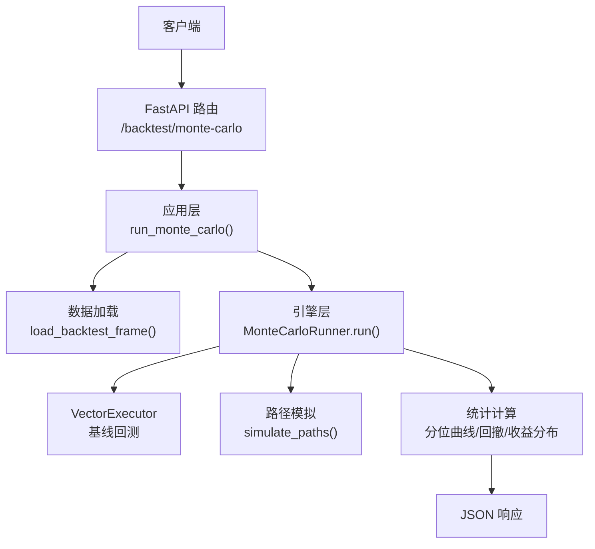
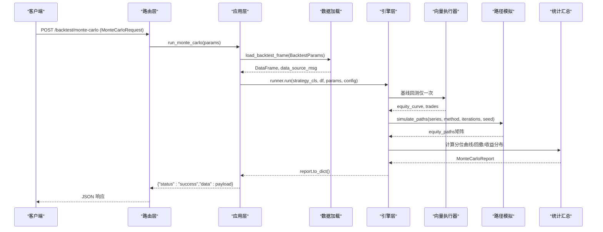
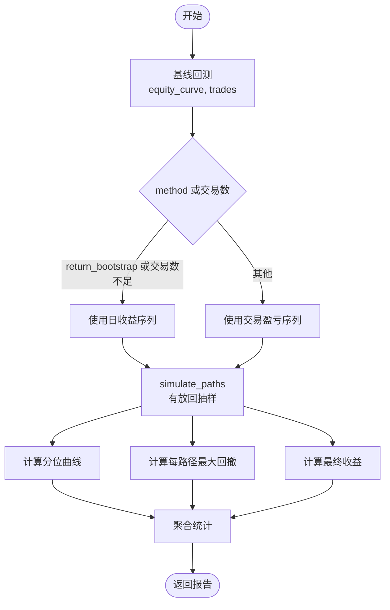
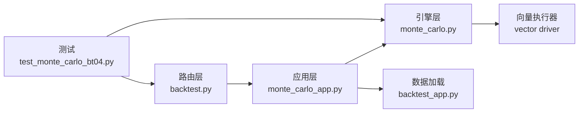

# 蒙特卡洛模拟API

<cite>
**本文引用的文件**
- [backend/routers/backtest.py](file://backend/routers/backtest.py)
- [backend/app/monte_carlo_app.py](file://backend/app/monte_carlo_app.py)
- [backend/engine/monte_carlo.py](file://backend/engine/monte_carlo.py)
- [backend/tests/test_monte_carlo_bt04.py](file://backend/tests/test_monte_carlo_bt04.py)
- [backend/app/backtest_app.py](file://backend/app/backtest_app.py)
</cite>

## 目录
1. [简介](#简介)
2. [项目结构](#项目结构)
3. [核心组件](#核心组件)
4. [架构总览](#架构总览)
5. [详细组件分析](#详细组件分析)
6. [依赖关系分析](#依赖关系分析)
7. [性能考量](#性能考量)
8. [故障排查指南](#故障排查指南)
9. [结论](#结论)
10. [附录：请求与响应规范](#附录请求与响应规范)

## 简介
本文件面向量化研究员，系统化说明 Quant Agent 的“蒙特卡洛模拟”能力，聚焦 POST /backtest/monte-carlo 端点。该接口基于一次基线回测，对交易盈亏序列或日收益序列进行重排/自助抽样，生成多条权益路径，并输出分位曲线、最坏回撤及最终收益分布等统计指标，用于策略稳健性评估与压力测试。

## 项目结构
后端通过 FastAPI 路由暴露蒙特卡洛接口；应用层负责参数组装与数据加载；引擎层实现蒙特卡洛路径生成与统计计算；测试覆盖关键逻辑与错误映射。

图表来源
- [backend/routers/backtest.py:248-269](file://backend/routers/backtest.py#L248-L269)
- [backend/app/monte_carlo_app.py:47-98](file://backend/app/monte_carlo_app.py#L47-L98)
- [backend/engine/monte_carlo.py:149-253](file://backend/engine/monte_carlo.py#L149-L253)
- [backend/app/backtest_app.py:72-142](file://backend/app/backtest_app.py#L72-L142)

章节来源
- [backend/routers/backtest.py:248-269](file://backend/routers/backtest.py#L248-L269)
- [backend/app/monte_carlo_app.py:47-98](file://backend/app/monte_carlo_app.py#L47-L98)
- [backend/engine/monte_carlo.py:149-253](file://backend/engine/monte_carlo.py#L149-L253)
- [backend/app/backtest_app.py:72-142](file://backend/app/backtest_app.py#L72-L142)

## 核心组件
- 路由层：定义 MonteCarloRequest 模型与 /backtest/monte-carlo 端点，负责校验与异常映射。
- 应用层：将请求转换为内部参数，加载历史数据，调用引擎执行蒙特卡洛模拟。
- 引擎层：
  - 基线回测：仅运行一次 Vector 快路径，得到权益曲线与交易明细。
  - 序列抽取：从交易盈亏或日收益中抽取序列。
  - 路径模拟：支持 trade_reshuffle、trade_bootstrap、return_bootstrap 三种方法。
  - 统计汇总：计算分位曲线、最坏回撤、最终收益分位数等。
- 测试：覆盖提取器、路径模拟、分位曲线、Runner 行为与 API 错误映射。

章节来源
- [backend/routers/backtest.py:84-103](file://backend/routers/backtest.py#L84-L103)
- [backend/routers/backtest.py:248-269](file://backend/routers/backtest.py#L248-L269)
- [backend/app/monte_carlo_app.py:24-98](file://backend/app/monte_carlo_app.py#L24-L98)
- [backend/engine/monte_carlo.py:32-64](file://backend/engine/monte_carlo.py#L32-L64)
- [backend/engine/monte_carlo.py:67-146](file://backend/engine/monte_carlo.py#L67-L146)
- [backend/engine/monte_carlo.py:149-253](file://backend/engine/monte_carlo.py#L149-L253)
- [backend/tests/test_monte_carlo_bt04.py:32-194](file://backend/tests/test_monte_carlo_bt04.py#L32-L194)

## 架构总览
下图展示从 HTTP 请求到结果返回的完整调用链，以及关键数据流转。

图表来源
- [backend/routers/backtest.py:248-269](file://backend/routers/backtest.py#L248-L269)
- [backend/app/monte_carlo_app.py:47-98](file://backend/app/monte_carlo_app.py#L47-L98)
- [backend/engine/monte_carlo.py:159-253](file://backend/engine/monte_carlo.py#L159-L253)
- [backend/app/backtest_app.py:72-142](file://backend/app/backtest_app.py#L72-L142)

## 详细组件分析

### 端点与请求模型
- 端点：POST /backtest/monte-carlo
- 请求体字段（来自路由层模型）：
  - ticker: 标的代码
  - period: 回测周期（如 2y）
  - interval: K线级别（如 1d）
  - initial_capital: 初始资金
  - commission_pct: 手续费比例
  - slippage_pct: 滑点比例
  - data_source: 数据来源（auto/futu/yfinance）
  - data_snapshot_id: 快照ID（可选）
  - strategy_key: 内置策略键（默认 sma_cross）
  - params: 策略参数字典
  - iterations: 模拟次数（10~5000）
  - method: 抽样方法（trade_reshuffle | trade_bootstrap | return_bootstrap）
  - seed: 随机种子（可选）

章节来源
- [backend/routers/backtest.py:84-103](file://backend/routers/backtest.py#L84-L103)
- [backend/routers/backtest.py:248-269](file://backend/routers/backtest.py#L248-L269)

### 应用层处理流程
- 解析策略类：根据 strategy_key 解析策略。
- 构建 BacktestParams 并加载历史数据：优先尝试快照，其次 Futu/YFinance。
- 构造 MonteCarloConfig 并调用引擎运行。
- 附加数据源信息与可用策略列表到响应。

章节来源
- [backend/app/monte_carlo_app.py:47-98](file://backend/app/monte_carlo_app.py#L47-L98)
- [backend/app/backtest_app.py:72-142](file://backend/app/backtest_app.py#L72-L142)

### 引擎层：蒙特卡洛核心
- 基线回测：仅执行一次 Vector 回测，获取 equity_curve 与 trades。
- 序列选择：
  - 若 method=return_bootstrap 或交易数不足阈值，则使用日收益序列（复合累积）。
  - 否则使用交易盈亏序列（绝对累加）。
- 路径模拟：
  - trade_reshuffle：对交易序列做置换，保持总和不变，适合检验顺序风险。
  - trade_bootstrap：对交易序列有放回抽样，模拟交易不确定性。
  - return_bootstrap：对日收益序列有放回抽样，模拟市场波动不确定性。
- 统计汇总：
  - 分位曲线：按配置的分位数（默认 5/50/95）计算权益路径分位。
  - 最坏回撤：各路径的最大回撤中的最大值。
  - 最终收益分位数：每条路径的最终收益率的分位统计。

图表来源
- [backend/engine/monte_carlo.py:159-253](file://backend/engine/monte_carlo.py#L159-L253)
- [backend/engine/monte_carlo.py:67-146](file://backend/engine/monte_carlo.py#L67-L146)

章节来源
- [backend/engine/monte_carlo.py:67-146](file://backend/engine/monte_carlo.py#L67-L146)
- [backend/engine/monte_carlo.py:149-253](file://backend/engine/monte_carlo.py#L149-L253)

### 三种抽样方法与使用场景
- trade_reshuffle（交易重排）
  - 机制：对已实现交易盈亏序列进行随机置换，保持总盈亏不变。
  - 适用：评估交易顺序对权益路径的影响，检验顺序风险。
  - 特点：所有路径终点一致，关注过程波动。
- trade_bootstrap（交易自助抽样）
  - 机制：对交易盈亏序列有放回抽样，模拟交易结果的随机性。
  - 适用：交易频率适中且样本足够时，评估交易层面的不确定性。
  - 特点：当交易数过少会回退至 return_bootstrap。
- return_bootstrap（收益自助抽样）
  - 机制：对日收益序列有放回抽样，复合累积生成权益路径。
  - 适用：交易较少或希望模拟市场波动不确定性的场景。
  - 特点：更贴近连续时间下的收益分布假设。

章节来源
- [backend/engine/monte_carlo.py:118-133](file://backend/engine/monte_carlo.py#L118-L133)
- [backend/engine/monte_carlo.py:184-198](file://backend/engine/monte_carlo.py#L184-L198)
- [backend/tests/test_monte_carlo_bt04.py:53-100](file://backend/tests/test_monte_carlo_bt04.py#L53-L100)

### 随机种子控制、可重复性与统计显著性
- 随机种子：
  - 通过 seed 控制 NumPy 随机数生成器，确保相同输入下路径完全可复现。
  - 测试验证了不同调用在相同 seed 下产生相同路径。
- 可重复性建议：
  - 固定 seed 与 method、iterations，保证结果稳定。
  - 记录 data_source_msg 与策略 key，便于溯源。
- 统计显著性检验：
  - 可通过多次独立 seed 运行，比较关键指标（夏普、最大回撤、最终收益）的均值与方差，观察是否稳定。
  - 结合分位曲线与最坏回撤分布，评估尾部风险与稳健性。

章节来源
- [backend/engine/monte_carlo.py:115-125](file://backend/engine/monte_carlo.py#L115-L125)
- [backend/tests/test_monte_carlo_bt04.py:68-86](file://backend/tests/test_monte_carlo_bt04.py#L68-L86)

### 风险偏好配置示例（保守型 vs 激进型）
以下为不同风险偏好的配置思路（不直接给出代码内容，仅描述参数调整方向）：
- 保守型策略
  - 目标：降低尾部风险，强调回撤控制。
  - 建议：
    - method 使用 return_bootstrap，以模拟市场波动不确定性。
    - iterations 设置较高（如 2000~5000），增强统计稳定性。
    - seed 固定，便于对比与审计。
    - 关注 worst_drawdown 与 p5 曲线，作为压力测试结果。
- 激进型策略
  - 目标：捕捉更高收益，容忍更大波动。
  - 建议：
    - method 使用 trade_bootstrap，评估交易层面不确定性。
    - iterations 适中（如 1000~2000），平衡效率与精度。
    - 关注 p95 曲线与 final_return_percentiles 的高分位，评估上行潜力。
    - 结合 walk-forward 或网格搜索，进一步验证参数稳健性。

章节来源
- [backend/routers/backtest.py:84-103](file://backend/routers/backtest.py#L84-L103)
- [backend/engine/monte_carlo.py:184-198](file://backend/engine/monte_carlo.py#L184-L198)

## 依赖关系分析
- 路由层依赖应用层与异常类型。
- 应用层依赖数据加载与引擎层。
- 引擎层依赖向量执行器与统计函数。
- 测试覆盖提取器、路径模拟、分位曲线、Runner 与 API 错误映射。

图表来源
- [backend/routers/backtest.py:248-269](file://backend/routers/backtest.py#L248-L269)
- [backend/app/monte_carlo_app.py:47-98](file://backend/app/monte_carlo_app.py#L47-L98)
- [backend/engine/monte_carlo.py:149-253](file://backend/engine/monte_carlo.py#L149-L253)
- [backend/app/backtest_app.py:72-142](file://backend/app/backtest_app.py#L72-L142)
- [backend/tests/test_monte_carlo_bt04.py:196-215](file://backend/tests/test_monte_carlo_bt04.py#L196-L215)

章节来源
- [backend/routers/backtest.py:248-269](file://backend/routers/backtest.py#L248-L269)
- [backend/app/monte_carlo_app.py:47-98](file://backend/app/monte_carlo_app.py#L47-L98)
- [backend/engine/monte_carlo.py:149-253](file://backend/engine/monte_carlo.py#L149-L253)
- [backend/app/backtest_app.py:72-142](file://backend/app/backtest_app.py#L72-L142)
- [backend/tests/test_monte_carlo_bt04.py:196-215](file://backend/tests/test_monte_carlo_bt04.py#L196-L215)

## 性能考量
- 基线回测仅执行一次，路径生成纯 NumPy 计算，避免重复昂贵操作。
- iterations 上限为 5000，防止过度计算。
- 交易数不足时自动回退至 return_bootstrap，减少无效抽样。
- 建议在大数据集上合理设置 iterations，并结合并行工具（如网格搜索）进行多情景评估。

章节来源
- [backend/engine/monte_carlo.py:27-38](file://backend/engine/monte_carlo.py#L27-L38)
- [backend/engine/monte_carlo.py:112-113](file://backend/engine/monte_carlo.py#L112-L113)
- [backend/engine/monte_carlo.py:184-198](file://backend/engine/monte_carlo.py#L184-L198)

## 故障排查指南
- 常见错误与定位：
  - 数据加载失败：检查 data_source、period、interval 与数据源可用性。
  - 策略不可矢量化：确保策略实现 signals() 方法。
  - 序列为空或过短：检查交易数与权益曲线长度。
  - 未知 method：确认 method 取值合法。
- 错误映射：
  - 应用层异常统一映射为 HTTP 400，detail 包含错误信息。
  - 测试覆盖了错误映射行为。

章节来源
- [backend/app/monte_carlo_app.py:41-98](file://backend/app/monte_carlo_app.py#L41-L98)
- [backend/routers/backtest.py:248-269](file://backend/routers/backtest.py#L248-L269)
- [backend/tests/test_monte_carlo_bt04.py:196-215](file://backend/tests/test_monte_carlo_bt04.py#L196-L215)

## 结论
POST /backtest/monte-carlo 提供了完整的蒙特卡洛模拟能力，支持交易重排与两种自助抽样方法，输出分位曲线、最坏回撤与最终收益分布，帮助量化研究员评估策略稳健性与尾部风险。通过固定随机种子与合理配置 iterations/method，可实现结果可重复与统计显著性检验。结合保守/激进配置思路，可开展系统化的压力测试与稳健性评估。

## 附录：请求与响应规范

### 请求体（MonteCarloRequest）
- ticker: 字符串
- period: 字符串（如 2y）
- interval: 字符串（如 1d）
- initial_capital: 浮点数
- commission_pct: 浮点数
- slippage_pct: 浮点数
- data_source: 字符串（auto/futu/yfinance）
- data_snapshot_id: 字符串（可选）
- strategy_key: 字符串（默认 sma_cross）
- params: 字典（策略参数）
- iterations: 整数（10~5000）
- method: 枚举（trade_reshuffle | trade_bootstrap | return_bootstrap）
- seed: 整数（可选）

章节来源
- [backend/routers/backtest.py:84-103](file://backend/routers/backtest.py#L84-L103)

### 响应体结构
- status: 字符串（success）
- data: 对象
  - method_used: 实际使用的抽样方法
  - n_paths: 路径数量
  - n_steps: 步数（含初始列）
  - percentile_curves: 分位曲线（p5/p50/p95 等），每个键对应 step/equity 序列
  - worst_drawdown: 最坏回撤（所有路径中最大回撤）
  - drawdown_percentiles: 回撤分位数（p5/p50/p95 等）
  - final_return_percentiles: 最终收益分位数（p5/p50/p95 等）
  - baseline: 基线指标（total_return/sharpe/max_drawdown/n_trades/n_bars）
  - config: 配置摘要（iterations/method_requested/seed/percentiles/series_kind/series_length）
  - data_source_msg: 数据源信息
  - strategy_key: 策略键
  - ticker: 标的
  - strategies_available: 可用策略列表

章节来源
- [backend/engine/monte_carlo.py:42-64](file://backend/engine/monte_carlo.py#L42-L64)
- [backend/engine/monte_carlo.py:230-253](file://backend/engine/monte_carlo.py#L230-L253)
- [backend/app/monte_carlo_app.py:93-98](file://backend/app/monte_carlo_app.py#L93-L98)
